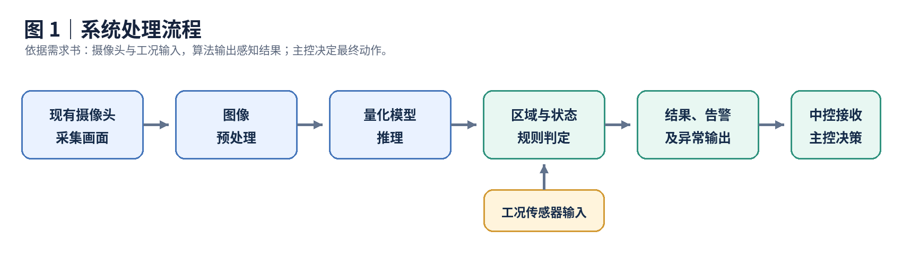
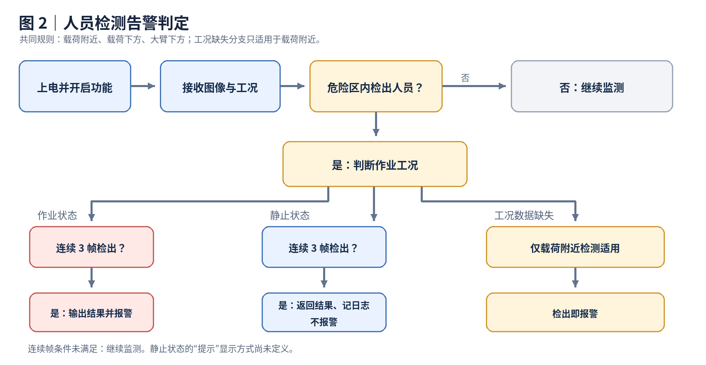
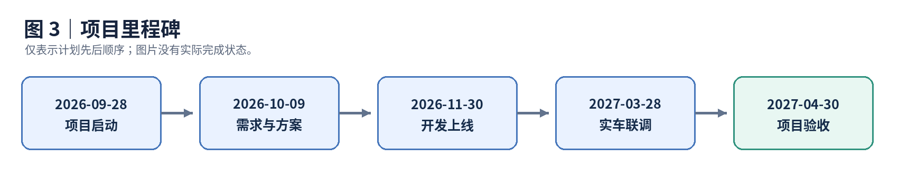

# 中控智能安全项目：需求与时间计划核验报告

> 核验日期：2026-09-29  
> 核验对象：[中控智能安全功能需求说明v5.1.docx](./中控智能安全功能需求说明v5.1.docx)、[项目时间计划.png](./项目时间计划.png)

## 1. 结论摘要

这两个文件分别是**项目技术需求及验收依据**和**五个里程碑的计划表**。项目拟利用起重机现有摄像头和工况信息，开发五项智能安全检测功能，并向中控输出检测结果与告警。需求书明确将系统定位为安全感知与告警辅助系统；起重机动作的最终控制策略由三一主控系统执行。

两份文件能够说明项目方向，但尚不能直接作为无歧义的最终开发、验收和交付清单。需要优先统一的事项是：**10 米需求范围与 5 米测试范围、≥50 米能力的测试布点、指标名称和计算方法、响应时间的计时起止点、卷扬冰雪覆盖阈值及标注、完全遮挡时的数据来源，以及各里程碑的完整交付物**。

本次核验的原始材料只有需求书和计划图片，没有实际源码、测试数据、运行日志、合同或验收报告。因此，本报告只核验文件内容及其内部一致性，不判断项目实际进度或功能性能。

## 2. 文件性质与关系

| 文件 | 已核实内容 | 使用时应注意 |
| --- | --- | --- |
| 需求书 | 封面标为 V5.1，编制单位为三一重起技术研究院；覆盖功能、环境、接口、性能、交付、测试和验收。文档标注“一般商密”。 | V5.1 是需求书版本；项目名称中的“智能安全 v1.0”是另一层版本。文档声明最终交付标准以双方签署的技术协议及合同附件为准。 |
| 时间计划图 | 列出启动、需求设计、开发上线、实车联调和验收五个计划节点。 | 只有计划完成时间与输出资料；备注栏为空，没有负责人、实际完成时间或完成状态。 |

需求书中的内嵌架构图展示了“摄像头及工况传感器输入 → 预处理 → AI 检测任务 → 声光预警、可视化输出”的总体链路。它说明系统组成，但不能替代接口字段、相机标定和数据同步等详细设计。

### 2.1 系统处理流程

下图依据需求书第 1.4、2.1、5.3 节整理。它展示的是**需求中的目标流程**，不代表已有软件已经按此实现。

这里的“业务规则”包括危险区边界、作业状态、连续帧及冰雪阈值。算法提供感知和告警信息；最终动作控制由三一主控决定。第 5.3 节对外接口要求通过初始化、逐帧检测、动态更新配置和释放资源承载这条处理链。

## 3. 五项功能的准确含义

| 功能 | 检测对象与范围 | 主要触发逻辑 | 主要指标 |
| --- | --- | --- | --- |
| 载荷附近人员检测 | 吊钩地面投影周围半径 **10 米**；需返回人员距中心的距离与顺时针夹角。 | 作业状态下连续 3 帧检出人员则报警；静止状态要求有检测结果、不报警，功能描述另称要“提示”；**没有工况数据输入时，在范围内检出人员立即报警**。 | 详细章节写准确率、召回率均 ≥92%，响应时间 ≤200 ms。 |
| 载荷下方人员检测 | 吊钩投影周围半径 **10 米**的载荷下方人员；需求涉及臂头相机画面中被载荷遮挡的区域，并写有可识别水平距离 ≥50 米。 | 作业状态下连续 3 帧检出则报警；静止状态返回结果但不报警。 | 详细章节写准确率、召回率均 ≥92%，响应时间 ≤200 ms。 |
| 大臂下方人员检测 | 大臂中轴线左右各 **40°** 的扇形区域；半径随主臂当前幅度变化，写有可检测距离 ≥50 米。 | 作业状态下连续 3 帧检出则报警；静止状态返回结果但不报警。 | 详细章节写准确率、召回率均 ≥92%，响应时间 ≤200 ms。 |
| 高度限位开关安装状态识别 | 区分重锤未安装、错误安装、正确安装。这里检测的是**安装状态**，不是替代机械限位开关执行切断动作。 | 上车上电、功能开启并处于准备状态，且大臂为基本臂长、根部角度 ≥5°时开启；未安装或错误安装报警；累积检测 ≥10 帧、静止 ≥15 秒或根部角度 ＞75°时结束检测并返回结果。 | 详细章节写准确率、召回率均 ≥92%，结果响应 ≤15 秒、帧率 ≥1。 |
| 卷扬冰雪检测 | 主要检测主、副卷扬卷筒表面的冰雪及其覆盖面积；功能描述还提到钢丝绳上的积雪。 | 超过可设覆盖面积阈值时报警；正文同时写了报警后退出检测。 | 详细章节写准确率、召回率均 ≥92%，响应时间 ≤1 秒。 |

前三项中，“检测出人员”和“触发报警”不是同一状态。尤其静止状态与作业状态的规则不同，测试需要分别覆盖。

### 3.1 人员检测的告警判定流程

下图适用于前三项人员检测的共同规则。**“工况数据缺失时立即报警”只在第 3.1 节载荷附近人员检测中明确规定**；另外两项缺失工况数据时如何处理，需求书没有写明。

这个流程图没有把第 3.1、3.2 节提及的静止状态“提示”画成报警：正文明确要求静止时不报警，但提示的界面形式和日志展示方式尚未定义。高度限位开关与卷扬冰雪有各自的触发规则，不适用这张图。

## 4. 技术、数据、交付和验收要求

- **平台与资源：**基于现有硬件，不增加硬件；要求在 Linux 下开发，适配 RK3588 Linux 和高通 8775 Android。软件环境章节另列 Ubuntu 20.04 无桌面版、RKNN SDK 2.1、QNN 适配和 OpenCV 4.5.4。摄像头包括 1 个臂头摄像头、2 个驾驶室顶长焦摄像头、2 个卷扬摄像头，标称分辨率均为 1920×1080、输入帧率为 25 fps；三类摄像头的水平视场角分别为 6.74°～60°、61°、140°。总体约束写单项功能算力开销 ≤2 TOPS、内存 ≤150 MB、帧率 ≥5；处理器环境另写内存 ≤8 GB。
- **实现方式：**C++17、YAML 配置、CMake 构建；训练输出 ONNX，量化后适配 RKNN/QNN 等目标平台，并使用硬件加速。架构要求预处理、推理、业务后处理和告警输出模块解耦，不将业务参数硬编码。
- **接口：**要求 `initialize(config)`、`detect(frame)`、`release()`、`updateConfig(config)`；错误码使用 32 位无符号整数，高 16 位标识模块，低 16 位标识错误，五项功能分别分配模块范围。
- **数据：**每类视觉任务建立独立数据集，保留原始视频、抽帧、标注和相机、时间、天气、光照、设备状态等元数据；标注标准须经三一审核。
- **交付：**完整 C++ 源码、编译脚本、YAML 模板、模型训练工程和量化脚本、可运行 Release 安装包、用户及开发部署文档、接口文档、测试用例和性能报告等。需求还写有驻场开发、使用三一代码仓库、培训、5 年免费质保和 24 小时故障响应；质保期内免费算法迭代、功能优化及配置工具升级的范围尚未细化。
- **文件中的权利条款：**需求书称成果知识产权归三一，第三方组件、开源库或外部接口的引入方须保证来源合法，并写明合同冲突时以主合同为准。此处只是记录文件内容，具体权利义务仍须对照最终签署的协议与合同。
- **验收：**第 8 章逐项功能测试、连续 8 小时压力测试、连续 72 小时无崩溃及无内存泄漏、API 联调、配置解析和交付文档检查。

### 4.1 阅读时容易混淆的术语

| 术语 | 本报告中的简明含义 |
| --- | --- |
| 工况／幅度 | 工况指起重机是否在回转、变幅、起落钩等作业；幅度在需求书中用于描述臂头地面投影与大臂根部的水平距离。它不是吊钩周围的 10 米警戒半径。 |
| ONNX、INT8、TOPS | ONNX 是模型交换格式；INT8 是一种量化表示；TOPS 是每秒万亿次运算的算力单位。文档写“单项功能算力开销 ≤2 TOPS”，实际测量方法和多功能并行时的总预算仍需定义。 |
| YAML、API、PIMPL | YAML 用于配置；API 是供中控调用的程序接口；PIMPL 是将实现细节封装在内部实现类中的代码结构。 |
| 准确率、精确率、召回率 | 准确率看全部样本中判对的比例；精确率看报警结果中真正应报警的比例；召回率看实际应报警的样本中被检出的比例。三者不能互相代替。 |

## 5. 时间计划及其局限

| 节点 | 计划完成日期 | 图片写明的输出资料 | 与上一节点相隔 |
| --- | --- | --- | ---: |
| 项目启动 | 2026-09-28 | 项目启动会议纪要 | — |
| 需求调研和方案设计 | 2026-10-09 | 需求拆解文档 | 11 天 |
| 功能开发上线 | 2026-11-30 | 开发环境及源码 | 52 天 |
| 实车测试联调 | 2027-03-28 | 合格测试报告 | 118 天 |
| 项目验收 | 2027-04-30 | 验收通过报告 | 33 天 |

启动计划日至验收计划日相隔 **214 天**。截至本报告日期，首个计划日期已经过去，但图片没有实际状态，不能由此推定启动会已完成。“功能开发上线”早于“实车测试联调”；它可能指开发版部署或试运行，但文件没有定义“上线”的具体准入条件，不能把这种解释当作已确认事实。

这条线仅表示图片给出的**计划先后顺序**，不表示任何节点已经完成，也不代表每一阶段之间没有并行工作。

时间图在 11 月节点仅列“开发环境及源码”，没有逐项安排需求书要求的数据集、模型、量化脚本、安装包、配置、文档和培训。应在正式项目计划中为这些交付物指定节点与验收人。

## 6. 第 8 章实际安排了哪些测试

| 功能 | 文件给出的主要测试办法 | 能直接核对的结果 |
| --- | --- | --- |
| 载荷附近人员 | 实车、载荷和假人；按臂长与幅度组合，把假人放在标记区域内或过渡区外。 | 第 8.1 节判定区域内应报警、区域外不应报警，另要求误报率 ≤8%。 |
| 载荷下方人员 | 实车回转，使载荷移至假人上方；根据臂头相机画面中假人是否被载荷完全或部分遮挡区分测试范围。 | 第 8.2 节只明确范围内应报警、范围外不应报警。 |
| 大臂下方人员 | 实车、假人；以回转中心和吊钩方向划左右各 40° 区域，40°～45°为不计入结果的过渡区。 | 第 8.3 节判定区域内应报警、区域外不应报警，另要求误报率 ≤8%。 |
| 高度限位开关 | 分别设置未安装、错误安装、正确安装三种状态，每种状态测试 40 轮。 | 第 8.4 节规定前两种应报警、正确安装不报警，另要求误报率 ≤8%。 |
| 卷扬冰雪 | 在与实车软件、模型一致的中控台架上运行测试脚本；测试集不少于 200 个样本，表中示例为正常、过曝、覆盖＜50%、覆盖≥50%各 50 个。 | 第 8.5 节只以 `FP/P ≤8%` 判定；脚本测试不等同于完整实车工况测试。 |

这张表描述的是**文档现有测试设计**，不是已取得的测试结果。第 8 章没有填写实际报警记录，时间图片也没有附测试报告。

## 7. 交叉核验发现

### 7.1 优先处理：会改变开发目标或验收结论

| 问题 | 文件依据 | 影响与建议 |
| --- | --- | --- |
| **10 米需求与 5 米测试不一致** | 第 3.1 节要求载荷附近半径 10 米；第 8.1 节按半径 5 米划检测区、6 米划过渡区。 | 现有测试不能证明 6～10 米符合需求。应统一真实功能边界，并调整测试布点、边界容差和期望结果。 |
| **≥50 米能力没有相应的远距布点** | 第 3.2、3.3 节写可识别或可检测的水平距离 ≥50 米；第 8.2、8.3 节记录表列出的幅度仅为 20、22、…、40 米。 | 若“幅度”即需求所指的水平距离，这些表格没有 ≥50 米工况，不能据此证明远距能力。应先统一距离定义，再补测 ≥50 米及边界工况。 |
| **指标名称及计算方法不统一** | 第 3.1～3.5 节写“准确率”；第 6.1 节汇总表写“精确率、召回率”；第 8 章多处只判“误报率 ≤8%”。 | 准确率、精确率和召回率是不同统计量。应指定每项功能的真值定义、样本构成、混淆矩阵、统计单位与合格公式。只统计误报不能证明召回率。 |
| **时延计时点不明确** | 人员检测要求连续 3 帧后报警，响应 ≤200 ms；总体最低帧率 ≥5。冰雪详细章节写响应 ≤1 秒，第 6.1 节写检测延迟 ≤200 ms。 | 若人员响应时间从首次出现到报警计，在 5 fps 下等待第 3 帧约需 400 ms；若 200 ms 指单帧处理则可能成立。冰雪两组数值也可能分别指报警链路和单帧处理。应定义每项指标的起点、终点、测试帧率及分位数或最大值口径。 |
| **冰雪覆盖阈值与标注未闭合** | 第 3.5 节要求计算覆盖面积并按阈值报警；第 8.5 节样本分为覆盖面积＜50%和≥50%，但仅要求“有／无冰雪”二分类标注。 | **50%只是测试分组界线，文件未确认它就是报警阈值。**应明确阈值、每个样本的覆盖比例真值、过曝样本的预期输出及报警判定规则。 |
| **载荷完全遮挡时的数据来源未定义** | 第 8.2 节将臂头相机画面中假人被载荷完全或部分遮挡均视作载荷下方检测情形。 | 应写明使用哪路相机或工况信息判断人员，以及多相机标定、时间同步、位置换算和遮挡真值如何生成。这是方案缺项，不等于已证明不可实现。 |

### 7.2 测试覆盖与状态机缺项

- **前三项人员检测：**第 8.1～8.3 节主要在指定光照下使用一名穿工装、戴安全帽的假人，检查区域内外是否报警；没有明确单列静止状态只返回结果、连续 3 帧、工况数据丢失、多人、局部遮挡、夜间或雨天等测试。第 8.1、8.3 节写“起钩至距地 2 米，观察并记录”，但未说明是在起钩运动中观察，还是停稳后观察；按正文规则，二者的报警期望不同。第 4 章虽列出环境要求，也规定超范围、能见度不足、严重遮挡的人员检测结果不纳入统计；这些排除条件需要可复现的边界。
- **载荷下方检测：**第 8.2 节写要测试功能与性能，但合格判定只列范围内外是否报警，缺少准确率、召回率及响应时间的实际统计程序。
- **限位开关：**第 8.4 节要求三种安装状态各测试 40 轮，并写起幅至臂尾角 ≥70°；未明确核验第 3.4 节规定的结束条件、≤15 秒结果时间及低帧率下的表现。第 3.4.2 节写根部角度 **≥5°**开启，第 3.4.4 节又写主臂角度**超过 5°**开启，5°边界及“根部角度／主臂角度”的定义也应统一。
- **卷扬冰雪：**第 3.5 节既要求全天候不间断监测，又要求超阈值报警后退出检测；报警清除、重启检测和人工复位条件没有定义。
- **卷扬冰雪的过曝样本：**第 8.5 节单独配置了过曝样本，但“有／无冰雪”标注和 `FP` 定义仅明确“正常样本误报警”。应规定过曝期望输出，以及它是否纳入误报、异常或无效样本统计。
- **告警策略：**多项人员检测区域可能重叠，文档未说明同时命中时的告警合并、优先级、去抖与解除条件。

### 7.3 文档引用、标准和实现口径

- “所有功能接口按第四章节要求封装”与实际位于**第五章**的接口规范不符。测试文本还引用了表 10.1、表 10.2、表 7.3、“4.16.2 节”和“附表 2”等，与现有文档编号不对应；第 8.2 节的“7.2.3 测试步骤”、第 8.3 节把大臂下方误写为载荷下方，也应修订。
- 总体约束写所有功能帧率 **≥5**，限位开关详细章节单独写 **≥1**。可能是专项例外，但应明示优先级。
- 需求要求 **C++17**，同时要求符合“**MISRA C2023**”。[MISRA 官方资料](https://misra.org.uk/app/uploads/2024/10/MISRA-C-2023-ADD4.pdf)将 MISRA C:2023 标明为 C 语言指南。应明确 C++ 源码的适用规范及检查范围，或者明确只有 C 模块适用此要求。
- 人员检测测试条件引用 **GB/T 44176-2024**。该标准确实存在，但官方名称为[《汽车全景影像监测系统性能要求及试验方法》](https://std.samr.gov.cn/gb/search/gbDetailed?id=vRyLOzXnsQM%3D&mode=p)。引用它作为光照测试参考不必然错误；应标明借用的具体条款及适用理由。本报告未核验该标准全文中的 800～100000 lx 数值出处。
- API 章节目前描述了接口用途，但未给出完整参数结构、坐标系、图像格式、时间戳及线程和错误恢复约定。需求书要求后续提供接口文档与示例代码，这些定义应在设计阶段落地。
- API 名称在同一段中先写 `initialize(config)`，随后又说“重复调用 `init()`”；应确认实际接口名称。第 5.1 节的“类禁用拷贝，移动构造，禁用裸指针”也应写成无歧义的代码规则，说明移动构造是要求提供，还是要求禁用。

## 8. 关于“误报率 ≤8%”的精确解释

第 8.5 节明确规定：`P = 算法报警样本数`，`FP = 标注为正常、但算法报警的样本数`，`误报率 = FP / P`。**只有在**所有报警样本都有明确的二分类真值、所有不应报警却报警的样本都计入 `FP`，且 `P > 0` 时，才能写成 `P = TP + FP`；这时 `FP/P = 1 - 精确率`，`FP/P ≤8%` 才等价于该测试集上的精确率 ≥92%。

现有测试集把**过曝**单列，`FP` 却只定义为“标注为正常”时的错误报警；同时，样本的“有／无冰雪”标注未明确等同于“是否超过报警阈值”。因此，不能无条件把文档的 `FP/P` 当成精确率的补数。无论如何，这一比值都不能单独证明召回率；`P = 0` 时公式也没有定义。

这与通常按“所有实际阴性样本”为分母计算的误报比例不是同一口径。建议在最终验收方案中直接列出 `TP、FP、TN、FN`，逐项定义准确率、精确率、召回率和误报指标，避免只用名称沟通。

## 9. 建议的处理顺序

1. **先冻结验收定义：**确认 10 米还是 5 米、各功能报警状态机、响应时间起止点、冰雪阈值及所有统计公式。
2. **再补齐可执行测试：**覆盖作业与静止、工况缺失、连续帧、多场景及遮挡；为每项 92% 指标提供独立测试集和计算方法。
3. **落实技术方案：**明确多相机标定与同步、坐标转换、API 数据结构、平台资源测量和故障处理。
4. **最后对齐计划和交付：**定义 2026-11-30“上线”的含义，把源码、数据、模型、配置、文档、报告及培训逐项分配到里程碑。

## 10. 核验边界

本报告核对了需求书正文、表格和内嵌架构图，以及时间图片中的五行内容。外部只核对了上述标准的官方名称和 MISRA C:2023 的语言适用对象；未核验设备实物、供应商方案、源代码、标准全文、测试原始数据或合同。凡标为“应明确”“可能”的内容，是基于现有文件提出的待确认事项，**不是已证实的项目缺陷或实施失败**。

### 10.1 原始材料覆盖核对

| 原始材料 | 本报告对应位置 | 核对重点 |
| --- | --- | --- |
| 需求书第 1 章：引言、目标、边界 | 第 1～3 节 | 五项功能的项目范围、辅助告警与主控边界。 |
| 需求书第 2 章：架构、运行环境 | 第 2.1、4 节 | 摄像头、工况、软硬件、量化推理和资源约束。 |
| 需求书第 3 章：五项详细功能 | 第 3、7 节 | 监测范围、触发条件、输出及正文指标。 |
| 需求书第 4 章：环境适应性 | 第 7.2 节 | 场景覆盖和排除统计的边界。 |
| 需求书第 5 章：接口与错误码 | 第 4、7.3 节 | 接口用途、错误码结构及未细化的参数。 |
| 需求书第 6 章：非功能与交付 | 第 4、7～8 节 | 性能、稳定性、数据、交付和售后。 |
| 需求书第 7～8 章：验收与测试 | 第 4、6～8 节 | 验收条件、逐项测试与指标计算口径。 |
| 项目时间计划图 | 第 5、9 节 | 五个计划日期、图片列出的输出资料与交付节点。 |

这张表表示**章节层面的覆盖**，不表示本报告逐字复写了原文，也不表示已经取得原文要求的测试证据。

## 附录 A：主文压缩过的关键条款

本附录补充那些不影响前述主要判断、但实施和验收时仍应查阅的原文细节。它是索引式摘要，不替代需求书全文。

| 原文位置 | 关键条款与数值 | 使用时的注意点 |
| --- | --- | --- |
| 封面后法律声明 | 文档标注“一般商密”；要求成果知识产权归三一，第三方组件和开源库来源合法、无侵权和二次收费；合同冲突时以主合同为准。正式签署技术协议与合同前，甲方保留通过招标补遗调整需求的权利。 | 项目最终权利义务仍以实际签署文件为准；文档本身还规定争议先协商，协商不成按合同约定地处理。 |
| 第 2.1、5.1～5.4 节 | 预处理为可选模块，后续为量化推理、业务判别、告警输出；底层库要求 PIMPL 封装、参数校验和统一错误码。初始化中途失败须回滚资源，重复初始化不得泄漏或重复加载；“如 60 秒”的初始化超时应有诊断。动态配置应无需重启生效，退出时应释放模型与缓存。 | `initialize(config)` 与同段的 `init()` 名称不一致；60 秒以“如”举例，不能直接当成已冻结的统一时限。 |
| 第 5.2 节 | 错误码为 32 位 `0xMMMMEEEE`。低 16 位中，`0x0000～0x0FFF`保留、仅 `SUCCESS=0`；`0x1000～0xBFFF`为通用错误；`0xC000～0xFFFF`供模块自定义。五项功能的高 16 位模块号依次为 `0x0004`、`0x0005`、`0x0006`、`0x0007`、`0x0008`。 | 通用错误还分基础、模型、推理、配置、网络、存储等类别；新增通用代码需评审，模块自定义错误需在详细设计中写明名称、触发条件和处理措施。 |
| 第 4、6.2、6.3 节 | 数据应覆盖晴、阴、夜、雨以及目标尺度、穿戴、运动和局部遮挡等变化；强暴雨、浓雾、沙尘造成光学致盲时应提示摄像头故障。异常日志要求时间戳、文件名、行号、等级和内容；相机遮挡、模型加载失败、信号超时均应输出异常。 | 环境适应性范围广于第 8 章实车测试范围；数据标注标准需三一审核同意。 |
| 第 6.4～6.7 节 | 要求后续推理 SDK 版本仅需局部适配；全代码中文注释、完整开发/部署/故障排查手册；交付源码、CMake、YAML、训练脚本、安装包、用例和报告；培训覆盖运维及二次开发，质保期内免费算法迭代和功能优化。 | “仅需局部适配”“免费迭代”等工作量边界未量化，应在协议、维护计划中明确。 |
| 第 8.1～8.3 节 | 前三项人员实车测试均规定约 **800～100000 lx**、**-20～+45℃**、风速 **≤8.9 m/s**；采用假人、工装和安全帽。记录表包含臂长 **46.7、56.1、65.5、75 米**及幅度 **20～40 米、每 2 米一档**。 | 这些是测试工况和记录表，不应误读为功能全部适用边界；第 8.1、8.3 节另写每种臂长幅度组合测试 2 轮。 |
| 第 8.4 节 | 限位开关测试照度 **≥50 lx**，三种安装状态各 **40 轮**；起幅到臂尾角 **≥70°**，观察中控屏报警。 | 这不能自动证明第 3.4 节的检测结束条件、≤15 秒响应和准确率/召回率要求。 |
| 第 8.5 节 | 冰雪采用台架测试，电源 **24 V±1 V**；模型和依赖版本要求与实车一致。样本由批量车数据筛选，总数不少于 **200**，四类示例各 **50**；图片重复输入，视频按实车处理频率抽帧，经 Wi-Fi/SSH 运行测试脚本。 | 脚本测试关注与实车逻辑一致性，但没有提供实际执行结果；其二分类标注仍不足以直接验证覆盖面积阈值。 |
