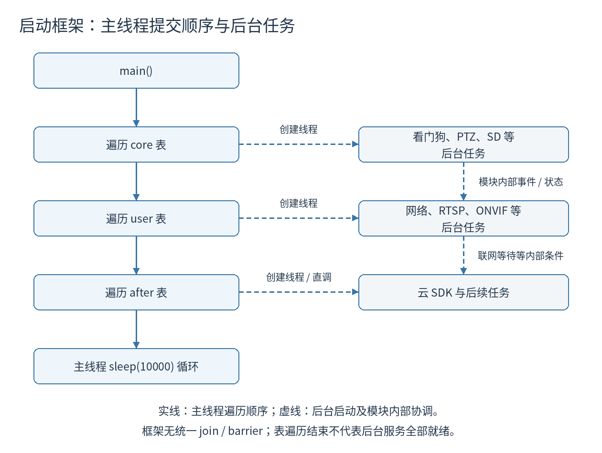
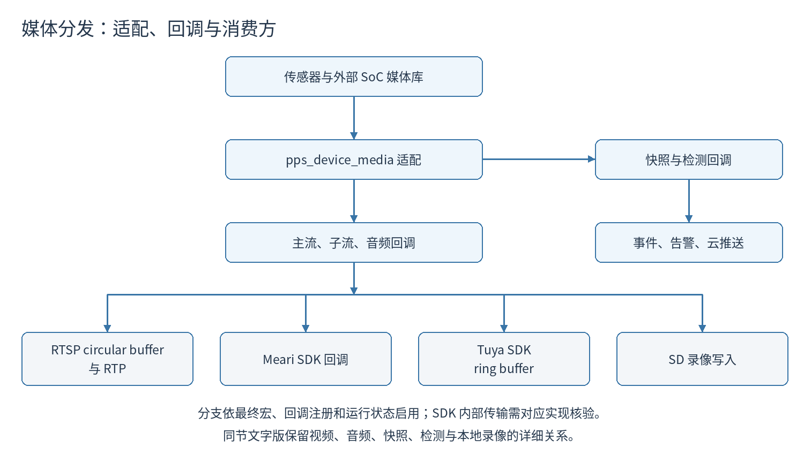

# camera-app 仓库源码深度分析报告

> **作者**：AI 代码审计
> **版本**：V5.6.6
> **公司**：杭州美旅科技有限公司（Hangzhou Meari Technology Co., Ltd.）
> **原分析时间**：2026-03-06
> **本次源码核验**：2026-10-05
> **源码位置**：`/home/tronlong/lyp/meari/camera-app`（源码快照无 `.git`，无法确认提交号）
> **规模**：3470 个文件；236 个 `.c`、2862 个 `.h`、3 个 `.cpp`，合计 3101 个 C/C++ 源文件及头文件、1,016,026 个物理行（含注释与空行）。统计方法与逐文件 SHA-256 见 [核验记录](核验记录.md) 和 [证据摘要](evidence/summary.json)。

> 本报告核验源码目录、全部文件清单、构建配置及主要业务调用链。源码存在不等于某款固件启用该功能，发布说明不等于实机验证结果。SDK、媒体库、工具链和板级驱动存在缺失，因此本次未完成固件编译、联网测试或刷写验证。下文明确区分源码事实、条件性风险和待验证事项。

---

## 目录

1. [仓库概述](#1-仓库概述)
2. [整体架构](#2-整体架构)
3. [目录结构详解](#3-目录结构详解)
4. [各模块功能详析](#4-各模块功能详析)
5. [启动流程图](#5-启动流程图)
6. [数据流与通信架构](#6-数据流与通信架构)
7. [多平台与多SDK支持](#7-多平台与多sdk支持)
8. [安全与健壮性核验](#8-安全与健壮性核验)
9. [代码质量评估](#9-代码质量评估)
10. [总结与建议](#10-总结与建议)
11. [构建流程与依赖缺口](#11-构建流程与依赖缺口)
12. [证据与验证边界](#12-证据与验证边界)

---

## 1. 仓库概述

`camera-app` 是一款面向嵌入式 Linux 的 **IP 网络摄像头（IPC）固件应用程序**，由杭州美旅科技有限公司（品牌 Meari / PPStrong）开发，支持涂鸦（Tuya）和美旅自有云平台两套接入方案。源码包含多种 MIPS/ARM SoC 适配分支与下列能力；具体固件是否提供这些功能取决于最终宏、设备能力与运行状态：

- 视频预览/传输（RTSP、P2P；另有 SRS RTMP 库源码）
- 云平台接入（涂鸦云、Meari 云、NKIT）
- ONVIF 标准协议
- HTTP 配网接口（80 端口）及条件开启的产测接口（8090 端口）
- SD 卡本地录像
- PTZ 云台控制
- AI 功能（移动侦测 MD、人形检测 PD、宠物检测 PET、婴儿哭声检测 BCD）
- 蓝牙 / AP 配网
- OTA 在线升级

---

## 2. 整体架构

```
┌─────────────────────────────────────────────────────────┐
│                      应用层 (Application Layer)          │
│           meari_ipc / tuya_ipc (main entry, SDK胶水层)   │
├─────────────────────────────────────────────────────────┤
│                  云端接入层 (Cloud SDK Layer)             │
│    Tuya SDK (v4/v5)  │  Meari SDK  │  NKIT SDK          │
├──────────────────────┬──────────────────────────────────┤
│   协议服务组件层      │        device 功能层              │
│  (Components Layer)  │     (pps_device Layer)            │
│  ┌────────────────┐  │  ┌─────────┐  ┌──────────────┐  │
│  │ RTSP Server    │  │  │ 网络管理 │  │ 媒体管道控制  │  │
│  │ RTMP (SRS)     │  │  │ 升级OTA  │  │ PTZ云台      │  │
│  │ ONVIF v1/v2    │  │  │ 存储/录像│  │ 用户认证     │  │
│  │ REST API(HTTP) │  │  │ GPIO/LED │  │ 加密身份     │  │
│  │ Shell Server   │  │  │ 看门狗   │  │ 设备发现     │  │
│  │ Baby Monitor   │  │  │ 设备能力 │  │ ...          │  │
│  └────────────────┘  │  └─────────┘  └──────────────┘  │
├──────────────────────┴──────────────────────────────────┤
│                   公共基础层 (Common Layer)               │
│    EventHub(事件总线) │ DNS │ Wi-Fi扫描 │ 时间工具        │
├─────────────────────────────────────────────────────────┤
│                    HAL 硬件抽象层                         │
│    arm-himix100-linux  │  ssc333（多平台共用）  │
└─────────────────────────────────────────────────────────┘
           ↕ 硬件驱动（Kernel / Driver，不含于本仓库）
```

**核心设计思想**：通过设备 API、HAL 和外部媒体库屏蔽底层差异，通过条件编译（`#ifdef CONFIG_TUYA_SUPPORT` / `CONFIG_MEARI_IPC_SDK` 等）在同一套代码中支持多种云平台与多种 SoC，通过插件表（`ppsdev_init_plugins_t[]`）驱动模块化启动。

---

## 3. 目录结构详解

```
camera-app/
├── README.md                   # 架构简介
├── 更新要点.md                 # 版本变更记录（V5.6.x 系列）
├── all.sh / auto.sh            # 多平台统一构建脚本
├── version/                    # 版本管理
│   ├── version                 # 主版本号：5.6.6.0
│   ├── gen_version.sh          # 版本号生成脚本
│   └── gen_git_info.sh         # Git commit 注入脚本
├── include/                    # 第三方/公共头文件
│   ├── curl/                   # libcurl HTTP 客户端
│   ├── zbar/                   # 二维码解码库
│   ├── onvif/                  # ONVIF 协议定义
│   ├── osal/                   # OS 抽象层（线程/内存/日志）
│   ├── util/                   # 通用工具 API（JSON/Base64/MD5/AES等）
│   ├── storage/                # 存储相关头文件
│   ├── pps_error.h             # 统一错误码定义
│   └── wpa_ctrl.h              # wpa_supplicant 控制接口
├── common/                     # 公共基础模块
│   ├── core/
│   │   ├── pps_eventhub.h      # 旧版事件定义；主业务使用 include/util/pps_eventhub.h
│   │   ├── pps_rfctime.c/h     # RFC 时间格式处理
│   ├── net/
│   │   ├── iwscan.c/h          # Wi-Fi AP 扫描
│   │   ├── pps_dns.c/h         # DNS 并发解析
│   │   └── pps_net2.c/h        # 网络基础操作
├── pps_hal/                    # 硬件抽象层
│   ├── hwl_config.h            # 全局路径与配置宏定义
│   ├── arm-himix100-linux/     # 海思 HiSilicon HAL
│   └── ssc333/                 # 多平台共用的 HAL 实现
├── pps_device/                 # 设备资源功能核心层
│   ├── pps_device_board.c/h    # 硬件板级信息（型号/MAC/SN等）
│   ├── pps_device_encryption.c # 设备身份加密（flash 分区读写）
│   ├── pps_device_netmng.c     # 网络管理（Wi-Fi/AP/以太网）
│   ├── pps_device_media.c      # 媒体流管理（4.x API）
│   ├── pps_device_media_5.x.c  # 媒体流管理（5.x API）
│   ├── pps_device_ptz.c        # PTZ 云台控制（8343物理行，包含末尾无换行的一行）
│   ├── pps_device_upgrade.c    # OTA 固件升级
│   ├── pps_device_user.c       # 用户认证管理
│   ├── pps_device_watchdog.c   # 软件/硬件看门狗
│   ├── pps_device_sdcard.c     # SD 卡管理
│   ├── pps_device_discovery.c  # 设备局域网发现（ONVIF WS-Discovery）
│   ├── pps_device_capa.c       # 设备能力集（293个去重 V_* 标识符，非已验证型号数）
│   ├── pps_device_led_ctrl.c   # LED 状态灯控制
│   ├── pps_device_gpio.c       # GPIO 事件（按键/PIR/电机）
│   ├── pps_device_rgb_light.c  # RGB 彩色灯控制
│   ├── pps_device_white_light.c# 白光灯控制
│   ├── pps_device_uart.c       # UART 通信
│   ├── pps_device_temp_humidity.c # 温湿度传感器
│   ├── pps_device_battery.c    # 电池管理
│   ├── pps_device_sleeping.c   # 休眠/离家模式
│   ├── pps_device_qrcode.c     # 二维码扫描（配网）
│   ├── pps_device_music.c      # 音乐播放
│   ├── pps_device_siren.c      # 报警声光控制
│   ├── pps_device_miniz.c/h    # zlib 压缩（miniz 嵌入实现，319849 字节 / 7733 行）
│   ├── pps_device_watermark.c  # 视频水印/OSD
│   ├── pps_device_charm.c      # 门铃模块
│   ├── pps_wpa_cli.c           # wpa_supplicant CLI 接口
│   ├── pps_sdcard/             # SD 卡文件系统工具
│   │   ├── pps_sdcard.c        # SD 卡挂载/格式化
│   │   ├── pps_disk_fs.c       # 磁盘文件系统操作
│   │   └── pps_fsck/           # FAT32 文件系统检查（自实现 fsck）
│   └── pps_product/            # 产测初始化
├── components/                 # 功能组件层
│   ├── pps_rtsp/               # RTSP 服务器（端口 8554）
│   ├── pps_rtmp/               # RTMP 推流（SRS librtmp）
│   ├── pps_onvif/              # ONVIF v1 / v2 实现
│   ├── restful_server/         # Mongoose 配网服务（80）及旧 ONVIF HTTP 包装（8000）
│   ├── pps_shell/              # Unix 域套接字命令服务器
│   ├── pps_storage/            # 录像控制与 MP4 封装
│   ├── pps_record3/            # 另一套录像实现，不能仅由目录名判断为最终采用的版本
│   ├── pps_baby_module/        # 婴儿监护专用协议
│   ├── pps_nkit_module/        # NKIT 第三方云 SDK 适配
│   ├── pps_nvr_module/         # NVR 接入模块
│   ├── pps_local_music/        # 本地音乐播放器
│   ├── pps_conf_sync/          # 配置同步
│   └── prodtest/               # 产测共享库 libpps_product_test.so（HTTP 8090）
├── ipc_app/                    # 云平台应用层（最终可执行程序）
│   ├── meari_ipc/              # 美旅云平台应用
│   │   └── main/               # 主程序（ppsapp.c 入口）
│   └── tuya_ipc/               # 涂鸦云平台应用
│       ├── tuya_app/           # 涂鸦应用主体（DP处理/事件/媒体）
│       ├── tuya_sdk_a2/        # 涂鸦 SDK a2 平台包
│       ├── tuya_sdk_a4/        # 涂鸦 SDK a4 平台包
│       ├── tuya_sdk_c5/c7/c9/  # 涂鸦 SDK 平台头文件（当前缺对应 libs）
│       └── tuya_sdk_*_5_x_sdk/ # 涂鸦 5.x SDK 包
├── tools/                      # 工具程序
│   ├── cmd_srv/                # 命令服务
│   ├── discovery/              # 局域网设备发现工具
│   ├── longsung_cm/            # 龙盛模块管理
│   ├── lookup_proc/            # 进程查找工具
│   ├── ppsconfig/              # 配置读写工具
│   ├── tpconfig/               # TP 产品参数配置
│   └── unpack/                 # 固件解包工具
└── doc/                        # 项目文档
    ├── 设备WEB API.doc          # HTTP API 文档
    ├── 硬件抽象层接口文档.docx   # HAL 接口规范
    ├── 设备外围IO驱动接口文档.docx # GPIO/外设驱动接口
    └── pps_device对接指南.md    # SDK 集成指南
```

---

## 4. 各模块功能详析

### 4.1 pps_device（核心设备层）

该层封装网络、身份、媒体、存储与外设控制，业务行为由设备能力、应用配置和编译宏共同决定。

#### 4.1.1 pps_device_board（板级管理）

- 经身份加密模块读取 Flash MTD 中的设备身份；`BOOT_PARAMS` 有历史布局注释，当前不能按旧注释直接断言 `sizeof` 为 256 字节（详见 4.1.2）
- 信息包括：设备型号、MAC 地址（最多 2 个）、生产日期、序列号、OEM 代码、P2P ID、许可证、加密版本号等
- 初始化以太网（`eth0`）MAC 地址并 `ifconfig eth0 up`
- 初始化 WiFi 模块驱动（通过 `rmmod`/`insmod` 命令加载不同 WiFi 驱动）
- 支持的 WiFi 模块：RTL8188FU/8192FU/8733BU、ATBM603x/606x、高拓 6062 等


源码依据：[pps_device/pps_device_board.c:310](/home/tronlong/lyp/meari/camera-app/pps_device/pps_device_board.c:310)、[pps_device/pps_device_board.c:680](/home/tronlong/lyp/meari/camera-app/pps_device/pps_device_board.c:680)。

#### 4.1.2 pps_device_encryption（设备身份加密）

- 定义并解析 Flash 中的 `BOOT_PARAMS`（设备元信息）及扩展身份结构
- 支持多种加密样式：TUTK_STYLE、LICENSE_ONLY_STYLE、TUYA2_STYLE、IDENTITY_STYLE 等
- 读取设备的 P2P ID、MAC、序列号、License Key、LDS 证书/密钥等
- 身份 Flash 数据的部分区域使用 XXTEA；Wi-Fi/SDK 配置文件由 `pps_device_enc_dec_cfg.c` 的固定密钥 AES-128 ECB 处理，两条路径不可混为一谈


布局依据：[pps_device/pps_device_encryption.c:99](/home/tronlong/lyp/meari/camera-app/pps_device/pps_device_encryption.c:99)。`DOME_INFO` 的字段是 28+48 字节，`BOOT_PARAMS` 在 208 字节偏移处嵌入它，按当前字段和常见目标 ABI 计算为 284 字节；文内仍有“256 Bytes/48BYTE”等旧注释。最终 Flash ABI 应以目标编译器的 `sizeof/offsetof` 和包生成器验证，不能仅信旧注释。

#### 4.1.3 pps_device_netmng（网络管理）
该模块承担应用侧主要网络状态与配置管理：
- Wi-Fi STA 模式（连接路由器）：调用 `wpa_supplicant` / `wpa_cli`
- AP 模式（热点配网）：与 AP/hostapd/netctrl 适配协调；外部网络管理工具的完整实现未提供
- 应用层的 `pps_common_bt.c/pps_ble_msg.c` 等负责蓝牙配网适配，网络模块接收连接参数
- 多 Wi-Fi 切换：`WIFI_LIST_MAX` 实际为 3，注释写“当前只有到两个”，多个切换函数仍专门处理索引 0/1；数组容量和完整三组切换能力需区分
- 5GHz/2.4GHz 双频支持，含频段白名单配置（按国家/地区）
- 以太网（`eth0`）支持（条件编译 `PPS_NET_MANAGER_SUPPORT_ETH`）
- Ping 连通性检测、DNS 并发解析
- Wi-Fi 信号和连接状态由应用/SDK 适配层上报；原报告“固定间隔 1 天”的断言缺乏对应调用链证据，撤回


源码依据：[pps_device/pps_device_netmng.h:22](/home/tronlong/lyp/meari/camera-app/pps_device/pps_device_netmng.h:22)、[pps_device/pps_device_netmng.c:460](/home/tronlong/lyp/meari/camera-app/pps_device/pps_device_netmng.c:460)、[pps_device/pps_device_netmng.c:559](/home/tronlong/lyp/meari/camera-app/pps_device/pps_device_netmng.c:559)。

#### 4.1.4 pps_device_ptz（PTZ 云台控制）

- 文件有 8343 个物理行（`wc -l` 计 8342 个换行符）；是较大的业务文件，但不是最大文件：SRS 为 36004 行，Meari DP 为 8579 行
- 支持步进电机（Step Motor）控制：上/下/左/右/全方位停止
- 巡视功能：一键巡视、定时巡视、噪音触发巡视
- 人形追踪（People Track）联动控制
- 极限位置检测与保护
- 预置点（Preset Point）管理


源码依据：[pps_device/pps_device_ptz.c:1](/home/tronlong/lyp/meari/camera-app/pps_device/pps_device_ptz.c:1) 与 [pps_device/CMakeLists.txt:170](/home/tronlong/lyp/meari/camera-app/pps_device/CMakeLists.txt:170)。启用 `CONFIG_PTZ_VERSION_OLD` 且未启用人形追踪的分支仍编译旧 PTZ 文件。

#### 4.1.5 pps_device_upgrade（OTA 升级）

- 支持 URL 升级（HTTP/HTTPS 下载固件包）
- 支持 SD 卡本地升级（扫描 `/mnt/mmc01/` 查找升级包）
- 升级流程：获取升级缓冲区 → 下载/读取 → 校验包头、文件长度和字节累加和 → 写入 MTD → 分块读回校验 → 由调用层安排重启
- 固件包格式验证：检查 magic number (`0x5354524e`) 和基础 checksum
- 升级前卸载内核模块（音频、视频编码、ISP等）


源码依据：[pps_device/pps_device_upgrade.c:140](/home/tronlong/lyp/meari/camera-app/pps_device/pps_device_upgrade.c:140)、[pps_device/pps_device_upgrade.c:524](/home/tronlong/lyp/meari/camera-app/pps_device/pps_device_upgrade.c:524)、[pps_device/pps_device_upgrade.c:795](/home/tronlong/lyp/meari/camera-app/pps_device/pps_device_upgrade.c:795)。

#### 4.1.6 pps_device_user（用户认证）

- 账户表容量为 4（索引 0-3），仅 0/1 有静态初值，2/3 为空；不是 4 个启用账户
- 账户信息保存在静态全局内存；管理员密码 setter 仅更新内存，当前实现没有写 `/etc/passwd`，也不能据此保证重启后保留
- 账户表使用字符偏移混淆，认证路径与新版 RTSP 的 `g_device_password` 不同，详见第 8 章


源码依据：[pps_device/pps_device_user.c:38](/home/tronlong/lyp/meari/camera-app/pps_device/pps_device_user.c:38)、[pps_device/pps_device_user.c:119](/home/tronlong/lyp/meari/camera-app/pps_device/pps_device_user.c:119)、[pps_device/pps_device_user.c:144](/home/tronlong/lyp/meari/camera-app/pps_device/pps_device_user.c:144)。

#### 4.1.7 pps_device_watchdog（看门狗）

- 硬件看门狗：调用 HAL 接口 `PPS_HAL_WATCH_DOG_Ctrl`
- 软件看门狗：监控多个模块的"喂狗"心跳值
  - 监控项：CPU高负载、媒体流延迟、RESTful 服务器超时、SD卡超时、网络超时、快照超时等
- 自动重启：默认每 7 天定时重启，支持按平台差异化配置


源码依据：[pps_device/pps_device_watchdog.c:24](/home/tronlong/lyp/meari/camera-app/pps_device/pps_device_watchdog.c:24)。默认 7 天之外，还有 DOREL 的 1 天、KYUNG 的 14 天及按设备能力和空闲窗口调整的分支。

#### 4.1.8 pps_sdcard / pps_fsck（SD 卡管理）

- 支持 FAT32 文件系统的挂载、格式化、fsck 检查（自实现）
- 256G 支持来自 V5.6.6 发布说明；源码有容量、格式化和 FAT 检查逻辑，但本次未测试 256G 实卡
- 有启动阶段 boot/FAT 检查、只读验证和运行中重挂载/fsck 恢复；不能概括为每次挂载前均进行完整文件系统检查
- 录像文件按日期目录分类存储

---


源码依据：[pps_device/pps_sdcard/pps_sdcard.c:80](/home/tronlong/lyp/meari/camera-app/pps_device/pps_sdcard/pps_sdcard.c:80)、[pps_device/pps_sdcard/pps_sdcard.c:570](/home/tronlong/lyp/meari/camera-app/pps_device/pps_sdcard/pps_sdcard.c:570)、[更新要点.md:1](/home/tronlong/lyp/meari/camera-app/更新要点.md:1)。新存储库分支依赖外部 SD API，不能将旧 FAT 源码描述套到所有构建。

### 4.2 Components（服务组件层）

#### 4.2.1 RTSP 服务器（pps_rtsp）

- 监听端口：`8554`
- 新实现注册主/子流 `/Streaming/Channels/101` 与 `/Streaming/Channels/102`；回放和对讲能力依实现、SDK 与配置分支确认，不能当作所有 RTSP 固件共有功能
- 有 Basic 与 Digest 分支；旧实现使用设备账户表，新实现使用独立设备密码，空密码分支允许无 Authorization 请求
- 检测客户端类型：VLC、ONVIF、NVR、FFMPEG、海思微型设备
- 支持 TCP/UDP 两种 RTP 传输模式


源码依据：[components/pps_rtsp/rtsp/pps_rtsp_server.c:313](/home/tronlong/lyp/meari/camera-app/components/pps_rtsp/rtsp/pps_rtsp_server.c:313)、[components/pps_rtsp/rtsp/librtsp/rtsp_demo.c:1049](/home/tronlong/lyp/meari/camera-app/components/pps_rtsp/rtsp/librtsp/rtsp_demo.c:1049)。

#### 4.2.2 RTMP 推流（pps_rtmp）

- 使用 SRS（Simple Realtime Server）librtmp 库
- 当前目录只有 SRS 库源码和头文件；是否参与最终推流需核对应用链接与 SDK，不能仅由该目录断言 Meari/Tuya 云录像都经过 SRS


源码依据：[components/pps_rtmp/srs_librtmp.cpp:1](/home/tronlong/lyp/meari/camera-app/components/pps_rtmp/srs_librtmp.cpp:1)。

#### 4.2.3 ONVIF（pps_onvif）

- 实现 ONVIF v1（端口 8000）和 v2
- 标准发现涉及 UDP 组播 239.255.255.250:3702；设备另有 UDP 3703 广播发现，不能把后者直接写成标准 WS-Discovery
- 支持：获取设备信息、媒体配置、PTZ 控制、事件订阅、重启/恢复出厂
- V5.6.5 发布说明记载“启动后不依赖公网”；源码含启用/休眠/服务状态控制，本次未验证断外网实机行为


源码依据：[components/pps_onvif/pps_onvif_v1.c:126](/home/tronlong/lyp/meari/camera-app/components/pps_onvif/pps_onvif_v1.c:126)、[components/pps_onvif/pps_onvif_v2.c:474](/home/tronlong/lyp/meari/camera-app/components/pps_onvif/pps_onvif_v2.c:474)、[components/pps_onvif/pps_onvif_v2.c:745](/home/tronlong/lyp/meari/camera-app/components/pps_onvif/pps_onvif_v2.c:745)。两套应用顶层 CMake 的 RTSP 分支会设置 ONVIF v2，因此产品配置的初始 ONVIF 选项不一定就是最终值。

#### 4.2.4 RESTful HTTP 服务器（restful_server）

- 基于 Mongoose 嵌入式 HTTP 框架
- 监听端口：`80`
- 提供 JSON 格式的 REST API
- 80 端口当前注册 `/devices`，实际路由主要是 `/devices/wifi` 配网；广泛的系统、媒体和 Flash 操作出现在 `components/prodtest` 的 8090 产测服务
- 认证方式：Basic 与自定义 MD5 Digest；AP 模式 Basic 另有默认账户分支。80 服务会在 `pps_device_net_is_connected()==1` 时退出，并非永久常驻的通用控制 API


源码依据：[components/restful_server/restful_server.c:163](/home/tronlong/lyp/meari/camera-app/components/restful_server/restful_server.c:163)、[components/restful_server/restful_server.c:655](/home/tronlong/lyp/meari/camera-app/components/restful_server/restful_server.c:655)、[components/restful_server/restful_server.c:681](/home/tronlong/lyp/meari/camera-app/components/restful_server/restful_server.c:681)。

#### 4.2.5 Shell 服务器（pps_shell）

- 基于 Unix 域套接字（`/var/shell.socket`）
- 提供设备本地调试命令接口（`ppstool` 客户端）
- 支持命令：iqtool（图像质量调试）、pd（人形检测）、log_level、factory（恢复出厂）、track（人形追踪）、dog（看门狗）、ptz、bitrate、save_audio_video 等


源码依据：[components/pps_shell/pps_shell_server.c:33](/home/tronlong/lyp/meari/camera-app/components/pps_shell/pps_shell_server.c:33)、[components/pps_shell/pps_shell_server.c:105](/home/tronlong/lyp/meari/camera-app/components/pps_shell/pps_shell_server.c:105)。服务检查客户端绑定 socket 文件类型/权限并取得文件 UID；这属于本地 IPC，不等同于网络 Shell。最终访问控制仍依赖运行时目录权限、UID 与 umask。

#### 4.2.6 录像引擎（pps_record3 / pps_storage）

- 自实现 MP4 muxer/demuxer（支持 H.264/H.265 + AAC/G.711）
- 支持 MP4 文件修复（异常断电后）
- 录像计划管理（`pps_schedule`）
- 缩略图生成（`pps_record_thumbnail`）
- 回放流管理


源码依据：[ipc_app/meari_ipc/CMakeLists.txt:890](/home/tronlong/lyp/meari/camera-app/ipc_app/meari_ipc/CMakeLists.txt:890)、[components/pps_storage/pps_record_old.c:180](/home/tronlong/lyp/meari/camera-app/components/pps_storage/pps_record_old.c:180)、[components/pps_storage/pps_record_old.c:2063](/home/tronlong/lyp/meari/camera-app/components/pps_storage/pps_record_old.c:2063)。当前 Meari SD 分支列入 `pps_storage`，不能凭目录名断言走 `pps_record3`；`pps_device_storage.c` 则是新外部录像 API 的包装。

#### 4.2.7 Baby Monitor（pps_baby_module）

- 专用私有协议（TCP）
- 客户端/服务端双向通信
- AES 加密的数据传输（`pps_aes.c`）
- 管道（pipe）数据传输机制

---


源码依据：[components/pps_baby_module/client/pps_tcp_client.c:131](/home/tronlong/lyp/meari/camera-app/components/pps_baby_module/client/pps_tcp_client.c:131)、[components/pps_baby_module/server/pps_tcp_server.c:212](/home/tronlong/lyp/meari/camera-app/components/pps_baby_module/server/pps_tcp_server.c:212)、[components/pps_baby_module/pps_aes.c:1](/home/tronlong/lyp/meari/camera-app/components/pps_baby_module/pps_aes.c:1)。存在 TCP 和 AES 代码不代表全部报文具有完整性认证；配对、密钥与加密覆盖需单独确认。

### 4.3 ipc_app（应用层）

#### 4.3.1 meari_ipc（美旅云应用）

- 主入口：`ppsapp.c` 的 `main()` 函数
- 采用**插件表驱动**的三阶段启动（core → user → after）
- 主要启动项以 `ppsdev_init_plugins_t` 注册，指定后台线程、请求优先级和 KiB 栈大小；框架并不统一确认服务就绪或汇总同步 handler 的错误
- 集成美旅 SDK（`mp_ipc_api.h`）进行云端 DP 数据点上报


源码依据：[ipc_app/meari_ipc/main/ppsapp.c:13](/home/tronlong/lyp/meari/camera-app/ipc_app/meari_ipc/main/ppsapp.c:13)、[ipc_app/meari_ipc/main/pps_ipc_sdk.c:2885](/home/tronlong/lyp/meari/camera-app/ipc_app/meari_ipc/main/pps_ipc_sdk.c:2885)、[ipc_app/meari_ipc/main/pps_dp.c:1](/home/tronlong/lyp/meari/camera-app/ipc_app/meari_ipc/main/pps_dp.c:1)。SDK 启动线程等待联网，产测状态下返回；NKIT 的特定 token 分支也跳过 Meari 云启动。

#### 4.3.2 tuya_ipc（涂鸦云应用）

- 集成涂鸦 IPC SDK（v4.x/v5.x）
- DP 数据点处理主要位于 `pps_tuya_ipc_dp_utils.c` 及网关对应实现；Meari 的 `pps_dp.c` 不是 Tuya 源文件
- 事件上报（`pps_tuya_ipc_event.c`）：移动侦测、人形检测、门铃等
- 支持涂鸦网关模式（`tuya_gw_sdk`）
- 支持多平台 SDK 包（a2/a4/c302b/c5/c7/c9/c9-5x-bt）

---


源码依据：[ipc_app/tuya_ipc/tuya_app/pps_tuya_app.c:13](/home/tronlong/lyp/meari/camera-app/ipc_app/tuya_ipc/tuya_app/pps_tuya_app.c:13)、[ipc_app/tuya_ipc/tuya_app/pps_tuya_app.c:119](/home/tronlong/lyp/meari/camera-app/ipc_app/tuya_ipc/tuya_app/pps_tuya_app.c:119)、[ipc_app/tuya_ipc/CMakeLists.txt:1518](/home/tronlong/lyp/meari/camera-app/ipc_app/tuya_ipc/CMakeLists.txt:1518)。最终涂鸦可执行文件名是 `meari_tuya_app`，不能从目录名写成 `tuya_ipc`。

### 4.4 原报告未展开的设备与组件入口

以下为资源控制入口与调用职责；具体功能仍需产品能力与宏启用。PET 喂食器机械控制与媒体 PET 检测是两类功能，不能仅凭名称当作同一个模块。

| 资源/模块 | 源码入口 | 当前职责与条件 |
|---|---|---|
| GPIO/按键/PIR | [pps_device/pps_device_gpio.c:147](/home/tronlong/lyp/meari/camera-app/pps_device/pps_device_gpio.c:147) | 注册监听，协调 HAL GPIO 与应用回调；按键、PIR、恢复出厂的消费方在应用层 |
| UART/扩展 MCU/ZOOM | [pps_device/pps_device_uart.c:332](/home/tronlong/lyp/meari/camera-app/pps_device/pps_device_uart.c:332) | 初始化串口服务、接收回调、发送数据；扩展 UART/泛光与变焦有单独协议和条件 |
| 温湿度/CPU 温度 | [pps_device/pps_device_temp_humidity.c:37](/home/tronlong/lyp/meari/camera-app/pps_device/pps_device_temp_humidity.c:37)、[pps_device/pps_device_temp_humidity.c:269](/home/tronlong/lyp/meari/camera-app/pps_device/pps_device_temp_humidity.c:269) | 读取与状态循环，初始化按能力选择；不是所有平台都有传感器 |
| 电池 | [pps_device/pps_device_battery.c:23](/home/tronlong/lyp/meari/camera-app/pps_device/pps_device_battery.c:23)、[pps_device/pps_device_battery.c:116](/home/tronlong/lyp/meari/camera-app/pps_device/pps_device_battery.c:116) | 容量/充电状态和检查线程，向事件/应用层提供状态 |
| RGB、白光、警笛 | [pps_device/pps_device_rgb_light.c:43](/home/tronlong/lyp/meari/camera-app/pps_device/pps_device_rgb_light.c:43)、[pps_device/pps_device_white_light.c:84](/home/tronlong/lyp/meari/camera-app/pps_device/pps_device_white_light.c:84)、[pps_device/pps_device_siren.c:49](/home/tronlong/lyp/meari/camera-app/pps_device/pps_device_siren.c:49) | 手动、夜视与报警定时控制；启用和模式受能力/配置约束 |
| PET 喂食控制 | [pps_device/pps_device_pet.c:288](/home/tronlong/lyp/meari/camera-app/pps_device/pps_device_pet.c:288) | 搅拌、投食等资源控制；由 CONFIG_PET 加入构建，与人形/宠物 AI 检测另行配置 |
| 二维码 | [pps_device/pps_device_qrcode.c:61](/home/tronlong/lyp/meari/camera-app/pps_device/pps_device_qrcode.c:61)、[pps_device/pps_device_qrcode.c:195](/home/tronlong/lyp/meari/camera-app/pps_device/pps_device_qrcode.c:195) | 识别结果 callback、开始/停止扫描；底层识别库为外部依赖 |
| 休眠/离家 | [pps_device/pps_device_sleeping.c:74](/home/tronlong/lyp/meari/camera-app/pps_device/pps_device_sleeping.c:74)、[pps_device/pps_device_sleeping.c:142](/home/tronlong/lyp/meari/camera-app/pps_device/pps_device_sleeping.c:142) | 睡眠模式、地理状态和定时计划，影响媒体/预览与外设状态 |
| 视频默认方向 | [pps_device/pps_device_video_default_orientation.c:566](/home/tronlong/lyp/meari/camera-app/pps_device/pps_device_video_default_orientation.c:566) | 按型号选默认翻转/镜像，应用另有动态方向处理 |
| 时间与重启 | [pps_device/pps_device_time.c:139](/home/tronlong/lyp/meari/camera-app/pps_device/pps_device_time.c:139)、[pps_device/pps_device_reboot.c:57](/home/tronlong/lyp/meari/camera-app/pps_device/pps_device_reboot.c:57) | 时区/时钟、恢复出厂/异常重启与reboot callback；需区分配置删除与软/硬重启 |
| 本地音乐 | [components/pps_local_music/pps_local_music.c:192](/home/tronlong/lyp/meari/camera-app/components/pps_local_music/pps_local_music.c:192) | 播放/停止/模式与歌曲控制；媒体输出和曲目资源取决于产品包 |
| NKIT 与 NVR | [components/pps_nkit_module/pps_nkit_sdk.c:350](/home/tronlong/lyp/meari/camera-app/components/pps_nkit_module/pps_nkit_sdk.c:350) | 网络/发现、报警、绑定及NVR设置；NKIT-only WLAN 源文件缺失，不能声称该分支完整 |
| 配置同步回调 | [components/pps_conf_sync/pps_conf_sync_callback.c:22](/home/tronlong/lyp/meari/camera-app/components/pps_conf_sync/pps_conf_sync_callback.c:22) | 初始化上传/查询回调表；具体资源操作接入Meari/NKIT应用，不是所有配置自动一致 |
| 独立工具 | [tools/unpack/unpack.c:1](/home/tronlong/lyp/meari/camera-app/tools/unpack/unpack.c:1)、[tools/tpconfig/pps_tp_resolve.c:1](/home/tronlong/lyp/meari/camera-app/tools/tpconfig/pps_tp_resolve.c:1)、[tools/discovery/discovery.c:1](/home/tronlong/lyp/meari/camera-app/tools/discovery/discovery.c:1) | 固件包解析、TP生成/处理、局域网发现；独立入口不等于主应用总会运行它们 |

资源层还有 OEM ID、默认方向、灯光、报警计划、串口扩展、留言/门铃、错误记录、媒体水印等文件，全部文件可从证据清单按目录检索。其接口存在性已纳入目录核验，硬件协议与目标固件行为仍应按各模块与使用方验证。

---

## 5. 启动流程图

### 5.1 框架实际执行语义

两套应用均按 `core → user → after` 调用 `ppsall_run_init()`。框架遍历插件表，`by_thread=0` 直接调用 handler，`by_thread=1` 创建 detached pthread 后继续遍历。它没有 `pthread_join`、阶段 barrier 或统一的 ready 标志，所以“core 同步顺序执行”“全部 user 服务就绪后执行 after”均不成立。

[pps_device/pps_device_base_init.c:39](/home/tronlong/lyp/meari/camera-app/pps_device/pps_device_base_init.c:39) 显示：栈字段乘 1024；优先级仅写入 pthread 属性，未显式设置实时调度策略；属性 setter 的返回值未统一处理。同步 handler 返回值被忽略，日志中的 `OK` 不能证明初始化成功。线程创建失败后也继续后续模块，错误打印使用 `errno`，而 pthread 返回码自身才是准确错误码。



[打开原尺寸图片](assets/startup-framework.png) · [图示源文件](assets/startup-framework.mmd)

图中的实线表示主线程提交顺序，不能读成后台任务完成顺序。媒体、SDK、录像等模块另有各自的状态等待；例如 [ipc_app/meari_ipc/main/pps_ipc_sdk.c:2885](/home/tronlong/lyp/meari/camera-app/ipc_app/meari_ipc/main/pps_ipc_sdk.c:2885) 会等待网络连接。

### 5.2 Meari 启动表

完整 6 张表、113 条非空名称记录（包括 `start ok` 空 handler 标记）的源码位置、线程参数和预处理条件见 [启动插件清单](evidence/startup-plugins.tsv)。该清单包含不同宏分支，条目数不是某个固件实际启动的线程数。

| 阶段 | 主要顺序与条件 |
|---|---|
| core | 日志重定向（条件）、日志上报、系统/事件初始化、信号注册、看门狗/启动日志线程、board、空 user init、settings、本地音乐/PET（条件）、白光、PTZ、媒体、Baby/蓝牙预初始化（条件）、水印（条件）、reboot 回调、GPIO、LED、产测、SD、录像/存储（条件）、Meari 事件报告（条件）、本地 shell |
| user | 网络、AP v2、NKIT（条件）、声光报警、泛光（条件）、RGB、ONVIF/RTSP/REST（条件）、发现、休眠（条件）、温湿度、电池、音乐/门铃（条件）、视频方向控制 |
| after | ZOOM UART（条件）、通用蓝牙（条件）、Meari SDK（条件）、码率自适应（条件）、音乐列表（条件）、`start ok` 标记 |

依据：[ipc_app/meari_ipc/main/ppsapp.c:13](/home/tronlong/lyp/meari/camera-app/ipc_app/meari_ipc/main/ppsapp.c:13)。`CONFIG_DEBUG_FIRMWARE` 的另一套 main 只初始化系统、连接固定测试 AP、等待 10 秒并返回，不运行上述正常插件表。

下面补回原报告的逐项树形流程，并按当前源码补齐启动项。`[直调]` 表示主线程调用并等待该函数返回；`[线程]` 表示创建 detached 线程后继续遍历；方括号中的宏是条目的编译条件。图内列出所有条件分支，具体固件只包含宏满足的条目；阶段间没有统一的后台任务完成等待。

```text
Meari 正常 main()（未定义 CONFIG_DEBUG_FIRMWARE）
  │
  ├── Phase 1: core（按表遍历；直调和后台线程混合）
  │     ├── pps_log_redirect_init()            [直调][LOG_PRINTF_REDIRECT] 日志重定向
  │     ├── pps_log_report_init()              [直调] 日志报告初始化
  │     ├── pps_device_system_init()           [直调] 系统/事件基础初始化
  │     ├── pps_register_signal_handlers()     [直调] 信号注册；SIGSEGV 注册已注释
  │     ├── pps_watchdog_init()                [线程] 看门狗
  │     ├── pps_startup_log_init()             [线程] 启动日志
  │     ├── pps_device_board_init()            [直调] 板级身份及硬件配置
  │     ├── pps_device_user_info_init()        [直调] 当前函数为空，账户另有静态初值
  │     ├── pps_settings_init()                [直调] Device 属性配置
  │     ├── pps_local_music_init()             [线程][CONFIG_LOCAL_MUSIC] 本地音乐
  │     ├── pps_white_light_init()             [直调] 白光模块
  │     ├── pps_pet_service_init()             [线程][CONFIG_PET] PET 服务
  │     ├── pps_ptz_service_init()             [线程] PTZ 云台
  │     ├── pps_media_service_init()           [直调] 媒体服务
  │     ├── pps_hg0_module_init()              [线程][CONFIG_BABY_SERIAL] Baby HG0
  │     ├── pps_record_hg0_conf()              [线程][CONFIG_BABY_SERIAL] HG0 配置
  │     ├── pps_babymonitor_init()             [线程][CONFIG_BABY_SERIAL] Baby Monitor
  │     ├── pps_common_bt_pre_init()           [直调][CONFIG_COMMON_BT] 蓝牙预初始化
  │     ├── pps_watermark_state_obtain_cb_init()[直调][CONFIG_REC_OVERLAY] 水印状态回调
  │     ├── pps_device_watermark_loop()        [线程][CONFIG_REC_OVERLAY] 水印/OSD
  │     ├── pps_reboot_cb_init()               [直调] 重启回调
  │     ├── pps_gpio_event_init()              [线程] GPIO 事件
  │     ├── pps_led_init()                     [直调] LED
  │     ├── pps_product_test_init()            [直调][未定义 CONFIG_NO_FACTORY_MODE] 产测
  │     ├── pps_device_sdcard_init()           [线程] SD 卡管理
  │     ├── pps_device_recorder_init()         [直调][CONFIG_SD_RECORD 且非 CONFIG_ENABLE_NKIT_ONLY]
  │     ├── pps_device_storage_init()          [线程][同上] SD 录像管理
  │     ├── pps_device_event_report()          [线程][CONFIG_MEARI_IPC_SDK] 事件报告
  │     └── shell_server_open()                [直调] 本地 Unix socket shell
  │
  ├── Phase 2: user（core 表遍历结束后；不统一等待其后台任务就绪）
  │     ├── pps_netmng_service_start()         [线程] 网络管理
  │     ├── pps_ap_v2_start()                  [线程] AP 配网
  │     ├── pps_nkit_sdk_init()                [线程][CONFIG_ENABLE_NKIT] NKIT SDK
  │     ├── pps_nkit_wlan_start()              [线程][CONFIG_ENABLE_NKIT_ONLY] NKIT WLAN
  │     ├── pps_device_siren_ctrl()            [线程] 报警声光
  │     ├── pps_flight_service_init()          [直调][CONFIG_FLIGHT_SUPPORT] 泛光
  │     ├── pps_rgb_color_light_service()      [直调] RGB 灯
  │     ├── pps_onvif_cfg_init()               [线程][CONFIG_ONVIF_SERVICE] ONVIF 配置
  │     ├── pps_onvif_start1()                 [线程][CONFIG_ONVIF_SERVICE_V2] ONVIF 服务
  │     ├── pps_onvif_start2()                 [线程][CONFIG_ONVIF_SERVICE_V2] ONVIF 发现
  │     ├── pps_rtsp_server_init()             [线程][CONFIG_RTSP_SERVICE] RTSP（8554）
  │     ├── restful_webserver_init()           [线程][CONFIG_RESTFUL_SERVER] HTTP 服务
  │     ├── pps_device_discovery_init()        [线程] 局域网发现（UDP 3702/3703）
  │     ├── pps_device_sleeping_init()         [直调][CONFIG_HOME_AWAY] 离家/休眠
  │     ├── pps_temp_humidity_init()           [直调] 温湿度
  │     ├── pps_device_battery_init()          [直调] 电池管理
  │     ├── music_player_module_init()         [直调][CONFIG_MUSIC] 音乐模块
  │     ├── pps_charm_service_init()           [线程][CONFIG_DOORBELL] 门铃
  │     └── pps_pcr_rotation_init()            [线程] 视频方向控制
  │
  └── Phase 3: after（user 表遍历结束后；不统一等待其服务就绪）
        ├── pps_uart_zoom_start()             [线程][CONFIG_ZOOM] ZOOM 串口
        ├── pps_common_bt_init()              [线程][CONFIG_COMMON_BT] 通用蓝牙
        ├── pps_mp_sdk_init()                 [线程][CONFIG_MEARI_IPC_SDK] Meari SDK
        ├── pps_check_p2p_usage()              [线程][CONFIG_ENABLE_BITRATE_AUTO_ADAPTATION]
        ├── music_player_init_music_list()    [线程][CONFIG_MUSIC] 音乐列表
        └── "start ok"                        空 handler 标记，不代表所有服务成功就绪

        ↓ 三张表遍历返回后
        while (1) sleep(10000)                主线程保持运行，后台任务自行协调
```

### 5.3 Tuya 启动差异

Tuya core 包含 `pps_tuya_dp_config_init()`、涂鸦媒体/LED 适配，after 同步初始化 `dp_list_init()`，再选择网关 SDK、4.x SDK 或 `pps_tuya_sdk_init_5_0_x()`，随后启动 P2P live、校时和状态上报等。SD 管理线程在其 after 表启动，和 Meari core 的位置不同。

依据：[ipc_app/tuya_ipc/tuya_app/pps_tuya_app.c:13](/home/tronlong/lyp/meari/camera-app/ipc_app/tuya_ipc/tuya_app/pps_tuya_app.c:13)、[ipc_app/tuya_ipc/tuya_app/pps_tuya_app.c:119](/home/tronlong/lyp/meari/camera-app/ipc_app/tuya_ipc/tuya_app/pps_tuya_app.c:119)。必须分别读两套表，不宜用 Meari 的流程图代表全部固件。

### 5.4 信号处理边界

[ipc_app/meari_ipc/main/ppsall_init.c:145](/home/tronlong/lyp/meari/camera-app/ipc_app/meari_ipc/main/ppsall_init.c:145) 的 `signal(SIGSEGV, ...)` 被注释；虽然 handler 内有 SIGSEGV 分支，不能写成“已注册段错误处理”。代码尝试注册 SIGKILL/SIGSTOP，但这两个信号不能被用户态 handler 捕获。handler 内调用日志、Shell、媒体停止等函数，也需要针对异步信号安全性审查。

---

## 6. 数据流与通信架构

### 6.1 媒体分发与云接入

补回原报告的树形视频数据流，包含音频、快照和告警分支。传感器、ISP、编码器位于外部媒体实现；各输出分支取决于编译选择、回调注册和运行状态。

```text
传感器（Sensor）
    ↓ 外部 SoC 媒体库：ISP / H.264、H.265 编码（依平台能力）
pps_device_media 适配（OLD / 1 / 5 分支）
    ├── 主流 / 子流视频回调 ─┬──→ RTSP circular buffer → RTP → NVR / VLC / 播放客户端
    │                       ├──→ Meari SDK 回调 → SDK 内部传输 → 手机 App / 云服务
    │                       ├──→ Tuya SDK ring buffer → SDK 内部传输 → 手机 App / 云服务
    │                       └──→ SD 录像回调 → 所选录像实现 → 本地存储
    ├── 音频回调（G.711/AAC 等，依配置）→ RTSP / 云 SDK / SD 录像消费方
    ├── 快照（JPEG）→ 应用/SDK 快照处理 → 报警图片 / 请求方
    └── 检测回调 → 应用事件 / EventHub → 告警、录像与追踪联动（按条件）

SRS librtmp 源码另行存在；不能据此把任一 SDK 的云传输固定画成 RTMP。
```



[打开原尺寸图片](assets/media-distribution.png) · [图示源文件](assets/media-distribution.mmd)

三套媒体实现按 `CONFIG_MEDIA_LIB_VERSION_OLD/1/5` 选择，调用不同外部媒体 API。媒体硬件实现和 AI 算法库不在当前快照中，源码主要可验证其适配、回调注册和参数控制。

5.x 的视频回调、音频回调注册及分发见 [pps_device/pps_device_media_5.x.c:1186](/home/tronlong/lyp/meari/camera-app/pps_device/pps_device_media_5.x.c:1186)、[pps_device/pps_device_media_5.x.c:1359](/home/tronlong/lyp/meari/camera-app/pps_device/pps_device_media_5.x.c:1359)、[pps_device/pps_device_media_5.x.c:1417](/home/tronlong/lyp/meari/camera-app/pps_device/pps_device_media_5.x.c:1417)。Meari 注册主/子流及 G.711/AAC 回调见 [ipc_app/meari_ipc/main/pps_ipc_sdk.c:1847](/home/tronlong/lyp/meari/camera-app/ipc_app/meari_ipc/main/pps_ipc_sdk.c:1847)；Tuya 的 ring buffer 初始化与写入见 [ipc_app/tuya_ipc/tuya_app/pps_tuya_media.c:1559](/home/tronlong/lyp/meari/camera-app/ipc_app/tuya_ipc/tuya_app/pps_tuya_media.c:1559)、[ipc_app/tuya_ipc/tuya_app/pps_tuya_media.c:2127](/home/tronlong/lyp/meari/camera-app/ipc_app/tuya_ipc/tuya_app/pps_tuya_media.c:2127)。

RTSP 新实现消费 circular buffer 后向两条 session 发送视频和音频，见 [components/pps_rtsp/rtsp/pps_rtsp_server.c:64](/home/tronlong/lyp/meari/camera-app/components/pps_rtsp/rtsp/pps_rtsp_server.c:64)、[components/pps_rtsp/rtsp/pps_rtsp_server.c:313](/home/tronlong/lyp/meari/camera-app/components/pps_rtsp/rtsp/pps_rtsp_server.c:313)。SRS 库的存在不能证明云端媒体必经 RTMP；SDK 的内部传输路径需要对应实现或运行证据。

### 6.2 EventHub 的正确接口与实际调用链

主业务使用 [include/util/pps_eventhub.h:25](/home/tronlong/lyp/meari/camera-app/include/util/pps_eventhub.h:25) 的 `pps_eventhub_e` / `PPS_EVENTHUB_*`。`common/core/pps_eventhub.h` 中仍有旧的 `PPS_EV_*`；原报告以该头文件画主业务事件图不准确。当前目录没有 EventHub 的实现源码，顶层链接了外部 `pps_util/pps_osal`；无法由头文件断言其同步/异步调度、回调锁策略或数据寿命。

下面补回“事件来源 → 事件总线 → 消费方”图，使用实际主业务事件名。箭头表示发布/订阅关系，消费方按构建和运行条件选择，不表示全部产品均同时执行这些动作。

```text
事件来源                     发布的事件                                 EventHub → 订阅处理
───────────────────────      ───────────────────────────────────────   ─────────────────────────
移动检测/应用告警       ───→ PPS_EVENTHUB_MD                         ───→ 录像 / 云录像 / 告警
人形检测                ───→ PPS_EVENTHUB_PEOPLE_DETECTION           ───→ 应用回调 → 发布 MD / 告警
PIR 输入                ───→ PPS_EVENTHUB_PIR_EVENT                  ───→ 录像触发
噪声 / 哭声检测         ───→ PPS_EVENTHUB_DB_ALARM / PPS_EVENTHUB_BCD ───→ 告警 / 条件性录像 / Baby 联动
SD 挂载                 ───→ PPS_EVENTHUB_SDCARD_MOUNTED             ───→ 录像初始化 / 启动任务
SD 拔出流程             ───→ PPS_EVENTHUB_SDCARD_START_REMOVE        ───→ 录像停止 / 资源协调
                         └─→ PPS_EVENTHUB_SDCARD_REMOVED             ───→ 移除完成状态处理
网络 / SDK 连接状态     ───→ PPS_EVENTHUB_STA_CONNECTED              ───→ 相关网络 / 应用回调
                         ├─→ PPS_EVENTHUB_STA_GOT_IP                 ───→ IP 状态处理
                         ├─→ PPS_EVENTHUB_MQTT_CONNECT               ───→ SDK 连接状态处理
                         └─→ PPS_EVENTHUB_STA_ONLINE                 ───→ 云状态 / 参数与媒体协调
电池状态                ───→ PPS_EVENTHUB_LOW_BATTERY_WARNING        ───→ 低电上报 / 告警
Device 配置加载         ───→ PPS_EVENTHUB_SETTING_LOAD_FINISH        ───→ 等配置完成的检测逻辑

第二行中的“发布 MD”为已核验的 Meari 人形检测处理分支，不是 PIR → MD 的统一规则。
```

各事件的处理说明见下表。EventHub 内部如何排队、加锁和调用订阅者，仍需外部库实现核验。

| 事件来源 | 实际事件 | 主要处理 |
|---|---|---|
| 移动/人形检测 | `PPS_EVENTHUB_MD`、`PPS_EVENTHUB_PEOPLE_DETECTION` | 本地录像、云录像、告警和追踪联动 |
| PIR | `PPS_EVENTHUB_PIR_EVENT` | 录像触发，不应画成 PIR 永远直接产生 MD |
| 噪声/哭声 | `PPS_EVENTHUB_DB_ALARM`、`PPS_EVENTHUB_BCD` | 告警、录像及 Baby 联动；DB 在此表示声音/噪声告警，不是数据库告警 |
| SD 卡状态 | `PPS_EVENTHUB_SDCARD_MOUNTED/REMOVED/START_REMOVE/...` | 录像初始化、停录、容量与检查流程 |
| 网络/SDK 状态 | `PPS_EVENTHUB_STA_CONNECTED/STA_GOT_IP/MQTT_CONNECT/STA_ONLINE` | 媒体启动、参数同步、云服务状态 |
| 电池 | `PPS_EVENTHUB_LOW_BATTERY_WARNING` | 低电状态上报和告警 |
| 配置加载完成 | `PPS_EVENTHUB_SETTING_LOAD_FINISH` | 等配置完成后启动相关检测逻辑 |

实际录像订阅见 [components/pps_storage/pps_record_old.c:2020](/home/tronlong/lyp/meari/camera-app/components/pps_storage/pps_record_old.c:2020) 和 [components/pps_storage/pps_record_old.c:2092](/home/tronlong/lyp/meari/camera-app/components/pps_storage/pps_record_old.c:2092)；人形检测转 MD、Meari SDK 的连接事件及云录像订阅见 [ipc_app/meari_ipc/main/ppsall_init.c:253](/home/tronlong/lyp/meari/camera-app/ipc_app/meari_ipc/main/ppsall_init.c:253)、[ipc_app/meari_ipc/main/pps_ipc_sdk.c:242](/home/tronlong/lyp/meari/camera-app/ipc_app/meari_ipc/main/pps_ipc_sdk.c:242)、[ipc_app/meari_ipc/main/pps_ipc_sdk.c:2774](/home/tronlong/lyp/meari/camera-app/ipc_app/meari_ipc/main/pps_ipc_sdk.c:2774)。

### 6.3 端口、生命周期与访问条件

| 服务 | 本地端口/路径 | 源码事实与限制 |
|---|---|---|
| Meari HTTP 配网 | TCP 80 | `CONFIG_MEARI_SUPPORT` 下启动，注册 `/devices`；联网后退出，不是全部设备永久提供的通用控制 API |
| RTSP | TCP 8554 | 主/子流 101/102；启用、休眠与密码状态影响服务可用性 |
| ONVIF HTTP | TCP 8000 | v1 的 Mongoose 包装或 v2 的外部服务；配置启用状态决定是否监听 |
| WS-Discovery | UDP 3702，组播 239.255.255.250 | `pps_device_discovery.c` 有自实现；可能与 ONVIF 库发现逻辑共同参与，需确认最终构建 |
| 专有发现 | UDP 3703，广播 255.255.255.255 | 与设备广播发现相关，不应当作标准 ONVIF HTTP 端口 |
| 产测 HTTP | TCP 8090 | 来自产测共享库，未加密身份、工厂模式或 `PPS_EVENTHUB_OPEN_8090` 可触发开启 |
| 本地调试 | `/var/shell.socket` | AF_UNIX，本地进程接口；权限由文件系统与进程环境决定 |
| 云 SDK/P2P/RTMP | SDK/URL/运行配置决定 | 原报告列的 1883/8883/1935 是常见协议默认值，未确认当前固件采用这些固定端口，故撤回固定值 |

端口依据：[components/restful_server/restful_server.c:692](/home/tronlong/lyp/meari/camera-app/components/restful_server/restful_server.c:692)、[components/pps_rtsp/rtsp/pps_rtsp_server.c:45](/home/tronlong/lyp/meari/camera-app/components/pps_rtsp/rtsp/pps_rtsp_server.c:45)、[components/pps_onvif/pps_onvif_v2.c:474](/home/tronlong/lyp/meari/camera-app/components/pps_onvif/pps_onvif_v2.c:474)、[pps_device/pps_device_discovery.c:45](/home/tronlong/lyp/meari/camera-app/pps_device/pps_device_discovery.c:45)、[components/prodtest/pps_product_test_restful.c:4135](/home/tronlong/lyp/meari/camera-app/components/prodtest/pps_product_test_restful.c:4135)。

### 6.4 配置与身份持久化

| 路径 | 作用与边界 |
|---|---|
| `/etc/device_tp.conf` | TP/板级产品配置 |
| `/home/cfg/dev_settings.json` | Device 属性配置，应用注册 get/set/change 回调 |
| `/home/cfg/mp_config.json`、`mp_config_enc.json` | Meari SDK/应用状态配置，格式按实现与分支选择 |
| `/home/cfg/wifi.info` | 遗留 Wi-Fi 文件，兼容读取路径仍存在 |
| `/home/cfg/wifi_enc.json`、`.bk` | Wi-Fi 配置及备份；固定密钥 AES ECB 加密，不等同于设备独立密钥保护 |
| `/home/cfg/wifi_config_save.conf` | Wi-Fi 保存辅助配置 |
| `/home/cfg/device.token` | 云接入 token |
| `/home/cfg/tutk_meari.cfg` | P2P 快速配置 |
| `/home/cfg/alarm.cfg`、`media.conf`、`nvr_config.json` | 告警、媒体和 NVR 配置 |
| `/home/cfg/baby_config.json` 等 | `CONFIG_BABY_SERIAL` 下 Baby 配置 |
| `/tmp/version`、`/tmp/ntplog`、`/tmp/error_code.json` | 版本、校时和异常记录；部分频繁写入数据被移入 RAM |
| `/etc/passwd` | 定义了路径常量；`pps_device_set_admin_password()` 当前仅更新内存，不能推断此函数覆盖写系统账户 |
| `/proc/mtd` | MTD 分区信息；身份实际存储在 Flash，并非普通 JSON 配置 |

路径定义见 [pps_hal/hwl_config.h:18](/home/tronlong/lyp/meari/camera-app/pps_hal/hwl_config.h:18)。Device 属性层持有 JSON 根和配置 mutex，应用层注册各资源操作及恢复出厂回调，见 [pps_device/pps_device_settings.c:24](/home/tronlong/lyp/meari/camera-app/pps_device/pps_device_settings.c:24)、[ipc_app/meari_ipc/main/pps_settings.c:601](/home/tronlong/lyp/meari/camera-app/ipc_app/meari_ipc/main/pps_settings.c:601)、[ipc_app/meari_ipc/main/pps_settings.c:1202](/home/tronlong/lyp/meari/camera-app/ipc_app/meari_ipc/main/pps_settings.c:1202)。管理员 setter 和设备密码属性 callback 是不同路径，见 [pps_device/pps_device_user.c:144](/home/tronlong/lyp/meari/camera-app/pps_device/pps_device_user.c:144)、[ipc_app/meari_ipc/main/pps_settings.c:227](/home/tronlong/lyp/meari/camera-app/ipc_app/meari_ipc/main/pps_settings.c:227)。

---

## 7. 多平台与多SDK支持

### 7.1 平台对应关系：以构建赋值为准

`ssc333` 是多平台共用的 HAL 目录名，不能据此把所有使用该目录的平台归为星宸。下表主要以 Meari 顶层 CMake 的 SDK ID、媒体版本标志和编译器赋值核验，不将代码分支等同于完整可构建产品。

| 硬件代号 | 构建中的 SDK/平台指向 | 架构/媒体分支 | 源码依据 |
|---|---|---|---|
| c2/c21 | HI3518EV200 | 海思 ARM，OLD | [ipc_app/meari_ipc/CMakeLists.txt:38](/home/tronlong/lyp/meari/camera-app/ipc_app/meari_ipc/CMakeLists.txt:38) |
| c4 | HI3518EV201 | 海思 ARM，OLD | [ipc_app/meari_ipc/CMakeLists.txt:51](/home/tronlong/lyp/meari/camera-app/ipc_app/meari_ipc/CMakeLists.txt:51) |
| c5/c51 | HI3518EV300 | 海思 ARM，OLD；原“C5=SSC333”错误 | [ipc_app/meari_ipc/CMakeLists.txt:63](/home/tronlong/lyp/meari/camera-app/ipc_app/meari_ipc/CMakeLists.txt:63) |
| c6/c61 | HI3518EV300 SDK 赋值 | 海思 ARM，OLD；不额外推断具体芯片型号 | [ipc_app/meari_ipc/CMakeLists.txt:90](/home/tronlong/lyp/meari/camera-app/ipc_app/meari_ipc/CMakeLists.txt:90) |
| c7/c71 | SIGMASTAR | 星宸 ARM，4.x/1 分支 | [ipc_app/meari_ipc/CMakeLists.txt:103](/home/tronlong/lyp/meari/camera-app/ipc_app/meari_ipc/CMakeLists.txt:103) |
| c9/c91/c94/c95/c401a/c401b/c40de | JUNZHENG_T31Z SDK 赋值 | 君正 MIPS，4.x；不同子型号选择 T31L/T31LC 等媒体目录 | [ipc_app/meari_ipc/CMakeLists.txt:136](/home/tronlong/lyp/meari/camera-app/ipc_app/meari_ipc/CMakeLists.txt:136)、[ipc_app/meari_ipc/CMakeLists.txt:604](/home/tronlong/lyp/meari/camera-app/ipc_app/meari_ipc/CMakeLists.txt:604) |
| c92/c93 | JUNZHENG_T31ZX | 君正 MIPS，4.x | [ipc_app/meari_ipc/CMakeLists.txt:163](/home/tronlong/lyp/meari/camera-app/ipc_app/meari_ipc/CMakeLists.txt:163) |
| a2/a3 | ANYKAV200 | 安凯 ARM，旧媒体；原“A3=AV100”错误 | [ipc_app/meari_ipc/CMakeLists.txt:318](/home/tronlong/lyp/meari/camera-app/ipc_app/meari_ipc/CMakeLists.txt:318)、[ipc_app/meari_ipc/CMakeLists.txt:339](/home/tronlong/lyp/meari/camera-app/ipc_app/meari_ipc/CMakeLists.txt:339) |
| a4 | ANYKAV331 | 安凯 ARM，4.x | [ipc_app/meari_ipc/CMakeLists.txt:222](/home/tronlong/lyp/meari/camera-app/ipc_app/meari_ipc/CMakeLists.txt:222) |
| a5/c301b | ANYKAV500 | 安凯 ARM，5.x | [ipc_app/meari_ipc/CMakeLists.txt:252](/home/tronlong/lyp/meari/camera-app/ipc_app/meari_ipc/CMakeLists.txt:252)、[ipc_app/meari_ipc/CMakeLists.txt:289](/home/tronlong/lyp/meari/camera-app/ipc_app/meari_ipc/CMakeLists.txt:289) |
| c302a/c302b/c303a/c303b | ANYKAV100 | 安凯 AV100 ARM，5.x；原“C302b=T31 MIPS”错误 | [ipc_app/meari_ipc/CMakeLists.txt:446](/home/tronlong/lyp/meari/camera-app/ipc_app/meari_ipc/CMakeLists.txt:446) |
| c404a/c404b | JUNZHENG_T40 | 君正 MIPS，5.x | [ipc_app/meari_ipc/CMakeLists.txt:363](/home/tronlong/lyp/meari/camera-app/ipc_app/meari_ipc/CMakeLists.txt:363) |
| c405a/b、c408a/b、c40ba/bb/ca/cb | JUNZHENG_T41 | 君正 MIPS，5.x | [ipc_app/meari_ipc/CMakeLists.txt:397](/home/tronlong/lyp/meari/camera-app/ipc_app/meari_ipc/CMakeLists.txt:397) |
| c101a/c101b | DUOFANG_HC1703 | Augentix 工具链的 ARM，5.x；原“C101=海思 EV300”错误 | [ipc_app/meari_ipc/CMakeLists.txt:483](/home/tronlong/lyp/meari/camera-app/ipc_app/meari_ipc/CMakeLists.txt:483) |
| x86/x64/arm 等 | 有主机/通用分支 | 当前缺少 `pps_hal/x86_64`，不能声称已有可运行主机测试平台 | [pps_hal/CMakeLists.txt:3](/home/tronlong/lyp/meari/camera-app/pps_hal/CMakeLists.txt:3)、[ipc_app/meari_ipc/CMakeLists.txt:512](/home/tronlong/lyp/meari/camera-app/ipc_app/meari_ipc/CMakeLists.txt:512) |

Tuya 平台选择另在 [ipc_app/tuya_ipc/CMakeLists.txt:18](/home/tronlong/lyp/meari/camera-app/ipc_app/tuya_ipc/CMakeLists.txt:18) 起，不能推断它覆盖 Meari 的全部 T40/T41/HC1703 分支。Meari 与 Tuya 的配置文件分别为 128 和 166 个，总计 294 个 `.cmake`；这不是 294 种 SoC 或 294 款已验证固件。

### 7.2 媒体、录像与协议构建选择

| 选择项 | 实际效果 |
|---|---|
| `CONFIG_MEDIA_LIB_VERSION_OLD` | 编译 `pps_device_media_old.c`；旧门铃/水印也可按宏加入 |
| `CONFIG_MEDIA_LIB_VERSION_1` | 编译 `pps_device_media.c`；主工程按平台选 `media_4.x` 子目录 |
| `CONFIG_MEDIA_LIB_VERSION_5` | 编译 `pps_device_media_5.x.c`；依赖 `media_5.x` 外部头文件/库 |
| `CONFIG_PEOPLE_TRACK_ENABLE` | 选新 PTZ；否则还根据 `CONFIG_PTZ_VERSION_OLD` 选择新/旧实现 |
| `CONFIG_RECORD_LIB_NEW` | 使用 `pps_device_storage.c` 包装外部新录像 API；旧分支加入本地 SD/fsck 源码 |
| `CONFIG_SD_RECORD` | Meari 主工程列入 `components/pps_storage` 的封装、修复、回放等源文件 |
| `CONFIG_RTSP_SERVICE` | 主工程中同时强设 ONVIF v2 ON、v1 OFF；需看后续赋值与宏，不能只看配置文件初值 |
| `CONFIG_ENABLE_NKIT_ONLY` | Meari core 排除常规 SD 录像初始化；NKIT WLAN 路径涉及当前缺失文件 |

依据：[pps_device/CMakeLists.txt:102](/home/tronlong/lyp/meari/camera-app/pps_device/CMakeLists.txt:102)、[pps_device/CMakeLists.txt:127](/home/tronlong/lyp/meari/camera-app/pps_device/CMakeLists.txt:127)、[ipc_app/meari_ipc/CMakeLists.txt:890](/home/tronlong/lyp/meari/camera-app/ipc_app/meari_ipc/CMakeLists.txt:890)、[ipc_app/meari_ipc/CMakeLists.txt:1041](/home/tronlong/lyp/meari/camera-app/ipc_app/meari_ipc/CMakeLists.txt:1041)、[ipc_app/tuya_ipc/CMakeLists.txt:1073](/home/tronlong/lyp/meari/camera-app/ipc_app/tuya_ipc/CMakeLists.txt:1073)。例如 c7-m_neutral 初始设 ONVIF v1 ON，之后顶层 RTSP 分支会覆盖；应使用最终预处理结果评估功能。

### 7.3 型号、Wi-Fi 与运行时能力

`pps_device_capa.c` 包含分类数组、型号判定与大量能力 getter，再由设备初始化汇总到 capability。当前全文去重共有 **293 个 `V_*` 标识符**；它们包含分类/分支引用，不应当作上市型号、编译成功型号或实测型号数。原报告“252+ 种”的统计口径不清，改为可复现词法统计。

Mini、Bullet、Speed、Baby、门铃、泛光等产品条件及 OEM 分支需要同时核对 board 身份、TP、能力表和构建宏。Wi-Fi 驱动适配可见 RTL8188、8192、8733、ATBM、高拓等条件，但“16+ 模块”没有统一去重口径，故不再作为精确数量。依据：[pps_device/pps_device_capa.c:12](/home/tronlong/lyp/meari/camera-app/pps_device/pps_device_capa.c:12)、[pps_device/pps_device_capa.c:3900](/home/tronlong/lyp/meari/camera-app/pps_device/pps_device_capa.c:3900)、[pps_device/pps_device_board.c:310](/home/tronlong/lyp/meari/camera-app/pps_device/pps_device_board.c:310)、[pps_device/pps_device_board.c:547](/home/tronlong/lyp/meari/camera-app/pps_device/pps_device_board.c:547)。

### 7.4 发布说明里的组件版本

| 组件 | V5.6.6 build1 发布说明值 |
|---|---|
| Tuya SDK | 4.9.18、5.3.22 |
| Meari SDK | B14418 |
| anykaV33x 媒体库 | 4.6.147 |
| 君正 T31 媒体库 | 4.6.145 |
| SigmaStar 媒体库 | 4.6.58 |
| AV100 媒体库 | 5.1.59 |
| T41 媒体库 | 5.1.62 |
| 多方媒体库 | 5.1.71 |
| SD/录像 | 1.2 |

以上值的直接依据是 [更新要点.md:24](/home/tronlong/lyp/meari/camera-app/更新要点.md:24)，并非对实际 `.so/.a` 的独立版本鉴定。当前缺失媒体库、Meari SDK 和大部分 Tuya libs，不能保证任意平台最终产物与表中版本一致。应用版本来源 [version/version:1](/home/tronlong/lyp/meari/camera-app/version/version:1) 为 5.6.6.0；运行时会查询 SDK/媒体版本并记录 Git 信息，见 [pps_device/pps_device_base_init.c:99](/home/tronlong/lyp/meari/camera-app/pps_device/pps_device_base_init.c:99)。

---

## 8. 安全与健壮性核验

本章按“源码证据、触发条件、验证边界”记录问题，不凭危险函数出现次数直接判定远程漏洞，不对所有平台统一给 Critical。源码中的测试凭据和固定密钥不在文档重复列明文值，原始位置可通过链接核对。

### 8.1 固定内置账户与可逆密码混淆：已确认

[pps_device/pps_device_user.c:38](/home/tronlong/lyp/meari/camera-app/pps_device/pps_device_user.c:38) 为账户 0/1 设置静态用户名与密码，2/3 为空。用户名减 32、密码减 31，逆向加回即可恢复。`pps_device_user_info_init()` 为空，管理员 setter 只更新账户 0；固定账户 1 不会随该 setter 改变。共同使用此表的服务存在固定凭据访问风险。

已追到的调用：HTTP Basic 直接调用 `pps_device_user_auth()`；HTTP Digest 从 `pps_device_get_users_info()` 获取账户；旧 RTSP `pps_rtsps.c` 调用账户认证。依据：[components/restful_server/restful_server.c:163](/home/tronlong/lyp/meari/camera-app/components/restful_server/restful_server.c:163)、[components/restful_server/restful_server.c:309](/home/tronlong/lyp/meari/camera-app/components/restful_server/restful_server.c:309)、[components/pps_rtsp/pps_rtsps.c:434](/home/tronlong/lyp/meari/camera-app/components/pps_rtsp/pps_rtsps.c:434)。

**修正原结论**：新 RTSP `librtsp/auth.c` 取 `g_device_password`，ONVIF v2 经 `pps_set_rtsp_password()` 配置 `admin` 与设备密码。不能称该固定账户“永久可登录所有 RTSP/HTTP/ONVIF”。“后门”涉及设计意图；源码能确认的是固定内置账户，具体设备暴露范围需结合构建与运行状态。

### 8.2 新 RTSP 用户名/密码比较错误：新增、已确认表达式缺陷

[components/pps_rtsp/rtsp/librtsp/auth.c:11](/home/tronlong/lyp/meari/camera-app/components/pps_rtsp/rtsp/librtsp/auth.c:11) 中：

```c
if (strncmp(username, "admin", strlen(username) != 0)) { ... }
```

第三参数是布尔表达式，非空用户名只比较 1 个字符，空用户名比较 0 个字符。Basic 密码比较使用真实密码长度作为 `strncmp` 长度，未检查两个字符串等长，存在前缀接受问题。Digest 分支读取设备密码后计算响应，没有独立校验用户名必须为 admin。

另在 [components/pps_rtsp/rtsp/librtsp/rtsp_demo.c:1049](/home/tronlong/lyp/meari/camera-app/components/pps_rtsp/rtsp/librtsp/rtsp_demo.c:1049)，没有 Authorization 且设备密码为空时返回认证成功。调用链确实用于 DESCRIBE/SETUP/PLAY/PAUSE；若产品设计允许免密，应明确产品状态及配置约束；不能将所有空密码状态都当作已确认远程绕过。

**条件**：编译并运行新 RTSP、服务允许预览、请求到达认证分支。非空密码时上述用户名错误不等于无需知道密码。建议完整比较用户名、检查密码长度与空值策略，并统一 Basic/Digest 的账号语义；本次未进行网络攻击复现。

### 8.3 HTTP/RTSP 解析的具体内存边界缺口：已确认缺检查，利用性待验证

HTTP Basic 的 `username[64]`、`password[64]` 在 [components/restful_server/restful_server.c:163](/home/tronlong/lyp/meari/camera-app/components/restful_server/restful_server.c:163) 使用 `strncpy(username, ..., t-basic_auth)` 与 `strcpy(password, t+1)`，未先限制字段长度。Base64 解码输出缓冲区为 512 字节，解码函数实现缺失；不能证明任意长 Authorization 已被底层安全拒绝。

新 RTSP 在 [components/pps_rtsp/rtsp/librtsp/auth.c:188](/home/tronlong/lyp/meari/camera-app/components/pps_rtsp/rtsp/librtsp/auth.c:188) 使用无宽度 `%[^=]` / `%[^\"]` 扫描到固定数组，再 `strcpy` 到 64/128 字节字段。这里存在具体网络输入和局部缓冲区的边界缺口，比“全仓库有 sprintf 所以存在漏洞”更有证据。应同时核对底层 RTSP 消息长度约束，采用有容量的解析 API；本次没有证明可控覆盖、代码执行或特定固件 CVSS。

### 8.4 OTA 包来源真实性与解析边界：已确认本层缺少签名验证

[pps_device/pps_device_upgrade.c:140](/home/tronlong/lyp/meari/camera-app/pps_device/pps_device_upgrade.c:140) 检查 magic、文件数量、包头长度、平台/应用/OEM 等；版本控制受 `CONFIG_UPGRADE_USE_VERSION` 约束，产测或 debug 包分支会跳过部分后续匹配。[pps_device/pps_device_upgrade.c:524](/home/tronlong/lyp/meari/camera-app/pps_device/pps_device_upgrade.c:524) 检查包头/文件字节累加和，然后写 MTD 并读回比较。

这条本地 buffer 升级链没有公钥签名验证调用，XOR 格式变换、checksum 和写后读回都不证明发布者身份。但不能由此断言云 SDK、下载器、Bootloader 也完全没有签名验证：当前下载器只有 [include/util/pps_firmware_download.h:26](/home/tronlong/lyp/meari/camera-app/include/util/pps_firmware_download.h:26) 的声明。

URL 入口仅 `strncmp(url,"http",4)`，允许该前缀，不严格确认 URL scheme/host，也不在本层强制 TLS。TLS 证书校验由缺失下载实现决定，原“MITM 必然接管所有设备”结论证据不足。

此外，buffer 入口仅检查非 NULL/非零 size，随后包头解析复制整个 header，复制前没有先保证 `size >= sizeof(header)`；文件区间校验采用 `start_offset + file_len > size`，需要检查无符号加法溢出。建议先做最小头长检查、用减法式边界比较，再验证签名与兼容性；实机升级、掉电和回滚需另测。

### 8.5 配置文件固定密钥 AES ECB：新增、已确认

[pps_device/pps_device_enc_dec_cfg.c:16](/home/tronlong/lyp/meari/camera-app/pps_device/pps_device_enc_dec_cfg.c:16) 的静态数组经固定 XOR 恢复 16 字节 key；[pps_device/pps_device_enc_dec_cfg.c:119](/home/tronlong/lyp/meari/camera-app/pps_device/pps_device_enc_dec_cfg.c:119) 用 AES-128 ECB 逐块加密，并加 CRC8/包头。Wi-Fi 保存和读取实际调用它，见 [pps_device/pps_device_netmng.c:559](/home/tronlong/lyp/meari/camera-app/pps_device/pps_device_netmng.c:559)、[pps_device/pps_device_netmng.c:1066](/home/tronlong/lyp/meari/camera-app/pps_device/pps_device_netmng.c:1066)。

因此配置“加密”不能提供设备间独立密钥保护，CRC8 不提供密码学完整性认证。风险依赖攻击者能否读取/修改配置、进程或固件；不是仅凭此即可从网络获取 Wi-Fi 密码。建议按设备管理密钥、使用带认证加密并制定旧配置迁移策略。

### 8.6 日志包含密码、token 或密钥：已确认输出点

Wi-Fi PSK 存在 VERBOSE 输出，见 [pps_device/pps_device_netmng.c:484](/home/tronlong/lyp/meari/camera-app/pps_device/pps_device_netmng.c:484)。新版 Meari ONVIF 密码设置路径以 INFO 输出解码密码，见 [components/pps_rtsp/rtsp/pps_rtsp_server.c:533](/home/tronlong/lyp/meari/camera-app/components/pps_rtsp/rtsp/pps_rtsp_server.c:533)；HTTP 配网处理有 token INFO 输出，见 [components/restful_server/restful_server.c:595](/home/tronlong/lyp/meari/camera-app/components/restful_server/restful_server.c:595)。LDS 分支还存在证书、私钥/PSK 的 VERBOSE 输出，见 [pps_device/pps_device_board.c:386](/home/tronlong/lyp/meari/camera-app/pps_device/pps_device_board.c:386)。

实际泄露范围由日志级别、串口、本地文件、日志重定向/上报配置决定。当前没有完整追踪每个输出到云上传的路径，不将“存在打印点”写成“已证实上传云端”。建议源头删除明文输出，并检查历史日志保留与上报路径。

### 8.7 调试固件固定配网凭据：事实确认，生产影响有条件

[ipc_app/meari_ipc/main/ppsapp.c:157](/home/tronlong/lyp/meari/camera-app/ipc_app/meari_ipc/main/ppsapp.c:157) 的 debug main 使用固定测试 AP 凭据。宏启用时的行为已确认；正常 main 不会执行这段路径。是否有量产固件开启该宏缺乏产物证据。发布过程应检查宏与实际启动入口，测试凭据通过外部配置注入。

### 8.8 原命令注入示例：撤回已确证漏洞表述

`country_code` 确实进入 Shell 命令，见 [pps_device/pps_device_netmng.c:2358](/home/tronlong/lyp/meari/camera-app/pps_device/pps_device_netmng.c:2358)，但其来源是 zone→固定国家码表，见 [pps_device/pps_device_board.c:1461](/home/tronlong/lyp/meari/camera-app/pps_device/pps_device_board.c:1461)、[pps_device/pps_device_board.c:1641](/home/tronlong/lyp/meari/camera-app/pps_device/pps_device_board.c:1641)。现有调用链没有证据支持任意 HTTP 字符串流入这一字段。

ping 的 `gateway` 来自 `pps_get_gateway()`，见 [pps_device/pps_device_netmng.c:2504](/home/tronlong/lyp/meari/camera-app/pps_device/pps_device_netmng.c:2504)；当前只有外部 API 声明和调用，未找到实现，不能把它写成直接接受 HTTP 输入。原恶意 gateway 示例不构成实际可达性证明。保留 Shell 拼接审查项，后续核对所有输入来源与验证、改用固定 argv/直接文件 IO；不在本章计作已确认远程注入。

### 8.9 8090 产测服务：补充实际暴露条件

[pps_device/pps_product/pps_product_init.c:166](/home/tronlong/lyp/meari/camera-app/pps_device/pps_product/pps_product_init.c:166) 按路径动态加载产测库；[components/prodtest/pps_product_test_restful.c:4135](/home/tronlong/lyp/meari/camera-app/components/prodtest/pps_product_test_restful.c:4135) 按设备身份校验、工厂状态或事件打开 TCP 8090。路由包括系统、身份/加密参数、Flash 升级、媒体等高权限操作，见 [components/prodtest/pps_product_test_restful.c:4093](/home/tronlong/lyp/meari/camera-app/components/prodtest/pps_product_test_restful.c:4093)。

**不能断言该服务无认证**：绑定 handler 为外部 `ev_handler_all`，HTTP 文件中存在同名认证 handler，产测共享库使用全局符号；最终符号解析、Mongoose 事件回调顺序和产物配置尚未验证。应查动态链接结果、运行时开启条件、请求认证及文件权限，并测试设备由产测转用户模式是否正确关闭服务。

### 8.10 限频、常量复用与密码存储建议的修正

当前 HTTP/账户认证源码没有看到统一失败计数锁定，但缺失库、SDK、系统网络规则可能有其他控制。记录为补测认证失败速率和锁定策略，不能写成所有产品已确认无限暴力破解。

`EXT_CFG_MAGIC` 与测试密码文字外观相似，不等于数学意义“相同密码”，magic 也不是保密凭据；原 V8“敏感常量复用漏洞”撤回。普通凭据可采用 Argon2id/bcrypt/PBKDF2 等有成本的密码派生；HTTP/RTSP Digest 若必须计算 HA1，需单独设计域绑定 HA1 或密钥保护，不能简单替换为单次 SHA-256 加 salt 后假定协议仍兼容。

| 核验项 | 证据等级 | 主要条件/边界 |
|---|---|---|
| 固定内置账户、可逆混淆 | 已确认实现 | 仅共同使用该账户表的服务；新 RTSP/ONVIF 不可一概而论 |
| 新 RTSP 比较表达式错误 | 已确认表达式与调用 | 需启用新服务；非空密码仍需满足密码逻辑 |
| HTTP/RTSP 输入容量缺检查 | 已确认局部代码缺口 | 底层消息上限、实机可利用性未复现 |
| 本地 OTA 校验链无签名调用 | 已确认本层 | 下载 SDK/Bootloader 的完整信任链未知 |
| 固定 key AES ECB 配置 | 已确认实现与调用 | 依赖配置/固件可读写条件 |
| 敏感信息日志 | 已确认输出点 | 是否可获取/上传由日志配置决定 |
| debug 固定配网 | 已确认宏分支 | 未证明量产固件启用 |
| country/gateway 命令注入 | 未证实，撤回原断言 | 国家码固定映射，网关实现缺失 |
| 8090 访问控制与关闭 | 待实机与链接核验 | 产测状态、共享符号和事件分发影响结果 |
| 无限频破解/时序攻击 | 未复现 | 需系统级限制与测量证据 |

---

## 9. 代码质量评估

### 9.1 可以从源码确认的设计特点

1. 设备 API、HAL、应用/SDK 适配分层，能复用资源控制；外部媒体与基础库仍是重要依赖，层级不是完全独立。
2. 插件表使启动项与功能裁剪集中可查，但后台线程需要模块自行处理就绪依赖。
3. EventHub 调用降低部分直接耦合；分发实现缺失，不能宣称已核验全部线程安全。
4. 多平台与 OEM 配置共享大部分业务，真实行为需对最终宏进行验证。
5. 看门狗与 SD/fsck 提供恢复机制；是否正确覆盖故障和是否误重启仍需长时间实机测试。

### 9.2 具体技术债务

| 项目 | 证据与影响 |
|---|---|
| 大业务文件 | `pps_dp.c` 8579 行、PTZ 8343 行、产测 6308 行；职责集中增加修改审查难度。SRS 36004 行是第三方实现，不宜直接等同自研业务债务 |
| 旧实现并存 | `_old.c` 由构建条件实际选用；不能未经兼容性确认就删除。应用同时存在 Device settings、SDK config 和网络 config，需记录状态同步边界 |
| 启动错误与线程属性 | handler 返回未汇总、pthread 属性调用未全面检查、detached 线程没有统一 ready 协议，见 `ppsall_run_init()` |
| 解析与长度 | HTTP/RTSP 存在明确字段长度缺检查；修复应维护容量与 NUL 终止，`strncpy/strncat` 也不是自动安全替代品 |
| 全局状态 | Device/应用/SDK 多处静态状态；已有 mutex 并不证明全部访问受保护。应按共享变量访问点审查，当前不将缺少某行锁写成已复现竞态 |
| 警告策略 | Common/Device/产测配置有 `-Wall -Werror`，同时抑制 unused/unused-result；既不能写“完全无警告约束”，也要检查忽略返回值的影响 |
| 信号处理 | SIGSEGV 注册注释、SIGKILL/SIGSTOP 注册无效；handler 内复杂操作不适合未经检查的异步信号环境 |
| 头文件与 ABI 说明 | EventHub 两套头文件、BOOT_PARAMS 历史尺寸注释与现字段不一致，容易让维护者引用错误接口/布局 |
| Git 构建信息 | `gen_git_info.sh` 依赖中文 `git status` 文字判断 dirty，受 locale 影响；主目标显式依赖 gen_version_info，却未显式依赖 gen_git_info，需检查并行构建顺序 |
| 测试与依赖 | 现有 test 仅 2 个 `.c` 共 326 物理行；Mongoose 示例 Makefile 引用不存在的 `common/net/mongoose.c`，且示例为持续服务，不是完整单元测试框架 |

依据：[common/CMakeLists.txt:21](/home/tronlong/lyp/meari/camera-app/common/CMakeLists.txt:21)、[pps_device/CMakeLists.txt:34](/home/tronlong/lyp/meari/camera-app/pps_device/CMakeLists.txt:34)、[components/prodtest/CMakeLists.txt:21](/home/tronlong/lyp/meari/camera-app/components/prodtest/CMakeLists.txt:21)、[version/gen_git_info.sh:43](/home/tronlong/lyp/meari/camera-app/version/gen_git_info.sh:43)、[ipc_app/meari_ipc/CMakeLists.txt:1335](/home/tronlong/lyp/meari/camera-app/ipc_app/meari_ipc/CMakeLists.txt:1335)、[test/mongoose/Makefile:9](/home/tronlong/lyp/meari/camera-app/test/mongoose/Makefile:9)。

---

## 10. 总结与建议

当前快照体现的是跨云平台、跨 SoC/OEM 的 IPC 应用与设备适配工程。可确认其主要启动表、设备控制、网络配网、媒体分发、录像、产测及 OTA 业务；完整运行还依赖外部 SDK、媒体/基础库、工具链、驱动和固件打包资源。全仓库行数中的大部分为重复携带的 SDK 头文件，不能用百万行总数衡量自研业务规模。

建议按可验证结果推进：

1. 先补齐目标平台依赖，固定产品配置与最终宏，记录编译器、库哈希和固件版本，避免用一张全局功能表代替实际固件清单。
2. 优先修复认证比较、网络解析容量与 OTA 头长/偏移检查，移除敏感日志；为固定账户和配置 key 制定兼容迁移方案。
3. 单独核验升级信任链、设备空密码策略、8090 开启/关闭和认证顺序；这些结论需要产物、SDK/Bootloader 或实机证据。
4. 给启动模块建立可查询就绪状态与错误传播，按模块审查回调数据寿命和跨线程共享状态。
5. 维护旧/新媒体与录像实现的产品覆盖表，先确认使用方再裁剪；逐步拆分 DP、PTZ、产测中的高变动职责。
6. 增加认证边界、HTTP/RTSP 输入长度、升级畸形包、配置损坏恢复、SD 插拔/掉电以及断网恢复的针对性验证。每项应有明确输入、预期和适用平台。

本次仅更新文档与核验证据，没有修改源工程或声称完成上述整改。

---

## 11. 构建流程与依赖缺口

### 11.1 构建入口及产物

源码根目录没有顶层 `CMakeLists.txt`；主要构建入口为 `all.sh/auto.sh → ipc_app/*/mkprj*.sh → 对应 CMakeLists.txt`。`all.sh` 调用常规脚本，`auto.sh` 调用 `mkprj_ai.sh`。菜单还列出 dot/ovd/nkit/x86/tuya_433/leedarson/no_app/media 等入口，但当前 `ipc_app` 只有 Meari 与 Tuya 两套目录；菜单不代表对应应用源码均已提供。

Meari `mkprj.sh` 从 `VCAMERA_PLATFORM_ID` 拆出硬件、软件、P2P、OEM 参数，默认 Release，在 `.ppstrong/<platform>/<type>/build` 和 install 组织产物。Meari 主程序为 `ppsapp`，Tuya 为 `meari_tuya_app`；两套工程还构建 `ppstool`，产测构建共享库 `libpps_product_test.so`。

依据：[all.sh:9](/home/tronlong/lyp/meari/camera-app/all.sh:9)、[auto.sh:9](/home/tronlong/lyp/meari/camera-app/auto.sh:9)、[ipc_app/meari_ipc/mkprj.sh:98](/home/tronlong/lyp/meari/camera-app/ipc_app/meari_ipc/mkprj.sh:98)、[ipc_app/meari_ipc/mkprj.sh:154](/home/tronlong/lyp/meari/camera-app/ipc_app/meari_ipc/mkprj.sh:154)、[ipc_app/meari_ipc/CMakeLists.txt:1355](/home/tronlong/lyp/meari/camera-app/ipc_app/meari_ipc/CMakeLists.txt:1355)、[ipc_app/tuya_ipc/CMakeLists.txt:1518](/home/tronlong/lyp/meari/camera-app/ipc_app/tuya_ipc/CMakeLists.txt:1518)、[components/prodtest/CMakeLists.txt:43](/home/tronlong/lyp/meari/camera-app/components/prodtest/CMakeLists.txt:43)。

### 11.2 脚本语法通过不等于可以构建

全部 10 个 `.sh` 经 `bash -n` 检查通过，结果见 [证据摘要](evidence/summary.json)。脚本运行会创建构建目录、复制/移动 TP 配置、清理产物、调用打包器，部分路径还有版本增减逻辑。本次仅作语法检查，没有执行 build/package/clean/ph 或刷写操作。

| 缺口 | 当前证据 | 影响 |
|---|---|---|
| `arch/` | 整个目录缺失，CMake 和打包脚本广泛引用 | 媒体头/库、pps_util/pps_osal、打包 rootfs/脚本无法由本快照提供 |
| `ipc_app/meari_ipc/sdk/` | CMake 引用标准/rubetek/mts SDK，而目录缺失 | Meari SDK 编译与最终链接不可完成 |
| Tuya SDK libs | 有平台头文件目录，引用的 libs/lib 多处缺失 | 不能把“SDK 目录存在”当作完整可链接包 |
| `pps_hal/x86_64` | 主机分支引用但目录缺失 | 当前不能直接运行 x86/x64 HAL 测试 |
| `pps_nkit_wlan.c` | `CONFIG_ENABLE_NKIT_ONLY` 分支引用文件缺失 | 对应配置需要补齐实现或修正构建引用 |
| 某些旧 include 路径 | `common/crypto`、`pps_hal/include`、`pps_device/board` 等缺失 | 需按配置核查，目录缺失不一定立即导致所有分支失败 |
| Mongoose 示例源码 | Makefile 引用 `common/net/mongoose.c`，当前没有 | test 示例不能直接作为已通过验证 |
| `/opt/toolchains/...` | 脚本/CMake 硬编码多种路径 | 必须确认目标工具链及 sysroot；本次未以工具链完备为前提编译 |

静态扫描得到 **54 条缺失的字面量 CMake 路径引用**，见 [缺失路径清单](evidence/missing-cmake-paths.tsv)。统计只匹配未注释文本中 `${PROJECT_TOP_DIR}/...` 且不含其他变量的路径，不展开条件、变量或 glob。不能解读为“54 个必然编译错误”，它也不包含所有动态路径缺口。

### 11.3 可复核构建步骤

实际构建前应先取得完整工程依赖，并选择具体平台/OEM/SDK。随后确认配置文件赋值及顶层覆写后的最终宏，执行该应用配置与编译，保存 verbose 命令、版本头和依赖库哈希；完成启动、端口、媒体、存储、断网、产测退出及升级验证后再认定目标固件支持某能力。本快照无法代替这些验证，也没有添加虚构的成功构建日志。

---

## 12. 证据与验证边界

本轮逐文件读取并生成清单/哈希，检查目录和全部 294 个 `.cmake` 文件的字面量路径；人工对照既有报告的各章节与两套应用入口、启动框架、构建选择、身份、用户、网络、媒体、录像、协议、产测、升级和持久化主链。SDK 头文件做全量统计和相关接口核验，没有把 3101 个文件都宣称为逐行安全审计完成。

| 交付物 | 内容 |
|---|---|
| [核验记录](核验记录.md) | 原报告断言的修正、覆盖范围、待补验证与复查方法 |
| [逐文件清单](evidence/source-inventory.tsv) | 3470 个文件的相对路径、字节数、物理行数、SHA-256 与 C/C++ 统计标记 |
| [统计和检查摘要](evidence/summary.json) | 模块行数、配置数量、最大文件、依赖存在性和 10 项脚本语法结果 |
| [全部启动项](evidence/startup-plugins.tsv) | 两套应用三阶段表中的条目、参数、预处理上下文，未进行宏求值 |
| [缺失构建路径](evidence/missing-cmake-paths.tsv) | 有源码文件/行号的 54 条静态缺失引用 |
| [复核脚本](evidence/audit_snapshot.py) | 只读扫描源码，证据输出必须位于源码目录之外 |
| [文档检查结果](evidence/documentation-checks.json) | 本地链接/源码行号、目录锚点、围栏、统计一致性及再次扫描的证据比较 |

复核命令（在本报告目录运行；替换输出目录可保存另一份快照）：

```bash
python3 evidence/audit_snapshot.py \
  --source /home/tronlong/lyp/meari/camera-app \
  --output /tmp/camera-app-audit-recheck
```

扫描统计含注释、空行、重复 SDK 平台头文件；物理行计数包含末尾无换行的一行，与 `wc -l` 的换行符计数可能差 1。当前源码无 `.git`，不能使用文档仓库的提交号冒充源码基线；应以证据清单 SHA-256 与对应文件内容复查。

尚未完成：目标平台完整编译/链接、外部基础库/EventHub/下载器内部核验、SDK/媒体二进制版本鉴定、Flash ABI 实测、服务鉴权网络复现、实卡和长稳验证、签名与 Bootloader 信任链、刷写/掉电恢复。文档中的条件性风险与整改建议均不表示这些验证已经通过。
