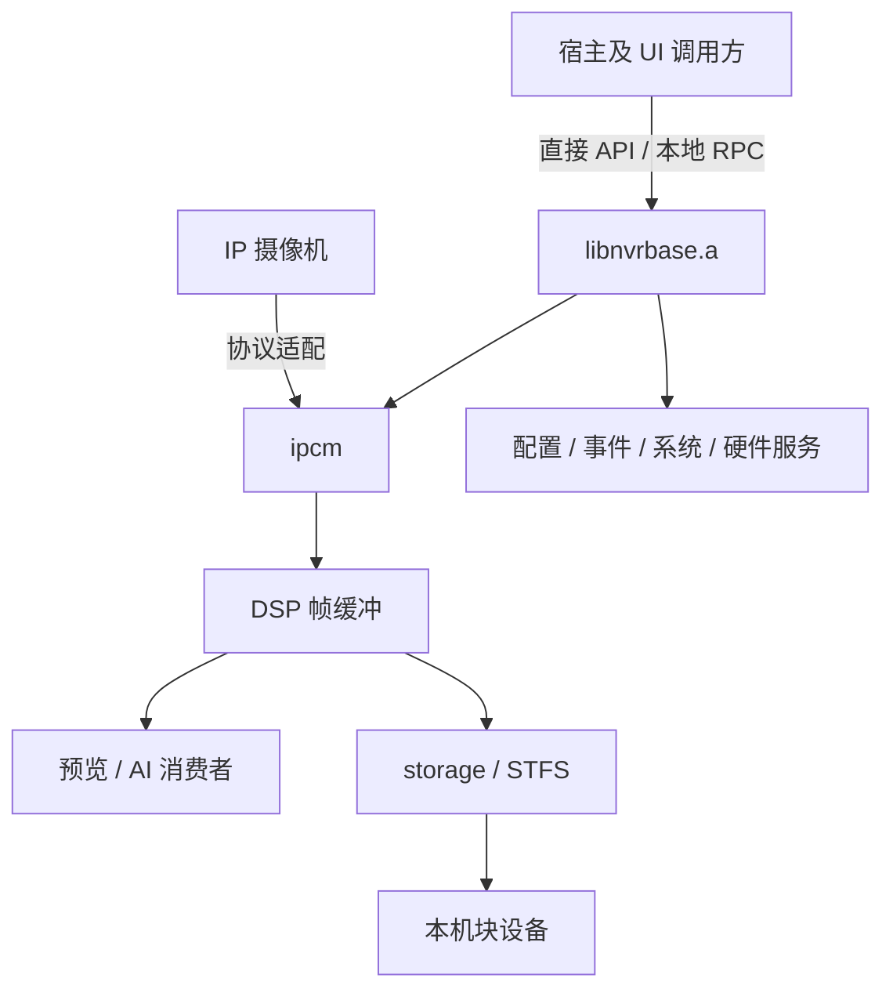
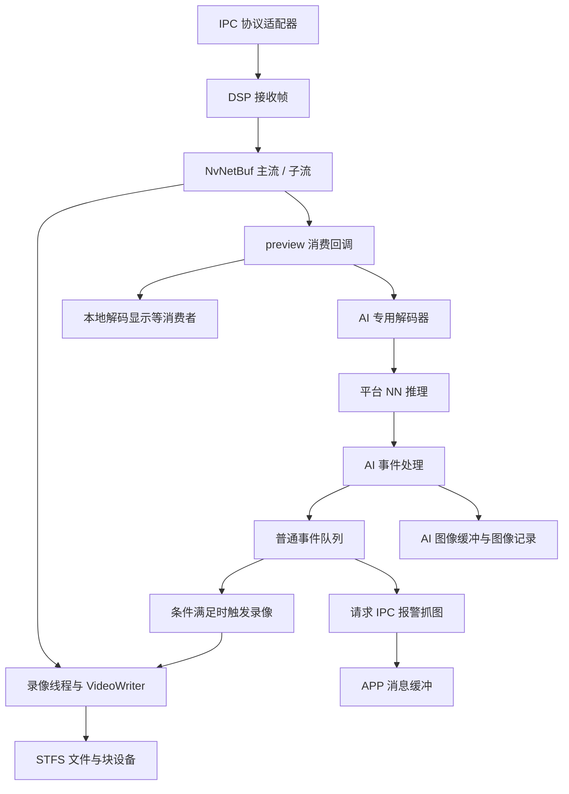

# nvr-base-core 源码深度分析报告

> **分析方式**：原文概述 + 源码核验补充（静态分析，不代表全部实现逐行审计）
>
> **参考源码**：`/home/tronlong/lyp/meari/nvr-base`
>
> **语言**：C / C++（混用，接口层大量使用 `extern "C"`）
>
> **编译目标**：`libnvrbase.a`、`librpcclient.so`、`libnetclient.a`、`netclientapp`、`modclient`

> **补充说明（2026-10-02）**：保留原有 1～15 章及模块概述，在相应章节增加“补充核验”内容；对与源码不符的原句、示例和连线作必要修正。新增第 16 章列出问题与条件，第 17 章记录核验范围和未完成项。未修改参考源码，未执行设备测试。

---

## 目录

1. [项目定位与整体概述](#1-项目定位与整体概述)
2. [目录结构总览](#2-目录结构总览)
3. [整体架构分析](#3-整体架构分析)
4. [系统启动流程](#4-系统启动流程)
5. [核心模块逐一解析](#5-核心模块逐一解析)
   - [5.1 base — 入口与总控](#module-5-1)
   - [5.2 ipcm — IP摄像机管理器](#module-5-2)
   - [5.3 dsp — 数字媒体处理](#module-5-3)
   - [5.4 ai — 人工智能推理](#module-5-4)
   - [5.5 event — 事件总线](#module-5-5)
   - [5.6 storage — 存储子系统](#module-5-6)
   - [5.7 rpcapi — 进程间 RPC 通信](#module-5-7)
   - [5.8 nets — 网络服务器](#module-5-8)
   - [5.9 param — 参数/配置管理](#module-5-9)
   - [5.10 sys — 系统管理](#module-5-10)
   - [5.11 hal — 硬件抽象层](#module-5-11)
   - [5.12 discovery — 设备发现](#module-5-12)
   - [5.13 rtsps — RTSP 推流服务](#module-5-13)
   - [5.14 speaker — 音频采集与对讲](#module-5-14)
   - [5.15 preview / playback / ui — 预览/回放/界面](#module-5-15)
   - [5.16 wlan / wired — 网络连接管理](#module-5-16)
   - [5.17 led / button / upgrade — 外设与升级](#module-5-17)
6. [工具库（util）解析](#6-工具库util解析)
7. [netclient — 网络客户端 SDK](#7-netclient--网络客户端-sdk)
8. [modclient — 调试命令行工具](#8-modclient--调试命令行工具)
9. [关键数据结构](#9-关键数据结构)
10. [外部依赖分析](#10-外部依赖分析)
11. [构建系统分析](#11-构建系统分析)
12. [模块依赖关系图](#12-模块依赖关系图)
13. [数据流图：视频流从IPC到存储/显示](#13-数据流图视频流从ipc到存储显示)
14. [数据流图：报警事件处理流程](#14-数据流图报警事件处理流程)
15. [设计模式与架构特点总结](#15-设计模式与架构特点总结)
16. [源码问题与条件性风险（补充）](#16-源码问题与条件性风险补充)
17. [核验范围、证据与未完成项（补充）](#17-核验范围证据与未完成项补充)

---

## 1. 项目定位与整体概述

`nvr-base-core` 是一款**网络硬盘录像机（NVR）的核心中间件库**。它运行在 Linux 嵌入式平台上，向上提供 RPC 及 UI 回调接口（完整 UI 与宿主部署不在本目录），向下负责连接和管理多路 IP 摄像机（IPC）。

**产品背景**：

- 设备类型：NVR（Network Video Recorder，网络硬盘录像机）
- 平台：面向 Linux 嵌入式，有架构/板型条件；各平台可构建性需完整环境验证
- 云平台接口：有涂鸦（Tuya）相关定义和集成接口，完整云连接链路未在本目录核实
- 通道上限定义：存储接口 `STOR_CHAN_NUMS_SUPPORT = 32`；本机通道数由板型能力决定
- 显示窗口定义：存在 `WIN_NUMS_36 = 36`，本机可用窗口数须查询实际板型能力

**核心职责**：

| 职责 | 说明 |
|------|------|
| IPC 接入 | 管理多路 IP 摄像机连接，定义 5 类接入协议，启用范围和操作能力因构建而异 |
| 视频分发 | 接收 IPC 视频流，供存储、预览及 AI 解码路径消费；RTSP 启动另行核实 |
| 录像存储 | 基于自研 STFS 文件系统写录像/图片/日志到硬盘 |
| 智能分析 | 对视频帧执行 NN 推理（人形/宠物/车辆/包裹检测） |
| 事件告警 | 统一的事件总线，驱动推送、录像、界面刷新 |
| 进程通信 | RPC Server 向 UI 等调用方提供查询和控制接口 |
| 网络服务 | RTSP 流媒体、设备发现、网络配置 |

### 补充核验：架构与产品能力

#### 定位与宿主边界

`libnvrbase.a` 提供 NVR 接入、媒体缓冲、存储、控制和事件等能力，`nv_start_base()` 是库级启动入口。最终运行它的宿主 `main()`、完整 UI 工程、云连接程序和部署脚本不在本次分析范围内。

可以确认存在三种协作方式：

1. 同进程直接调用，例如事件线程调用录像接口。
2. Unix 域套接字 RPC，例如 `StorageRPC` 客户端调用存储服务端。
3. 文件映射的共享数据，例如实时帧、回放帧和消息缓冲。

UI 消息还支持函数指针回调。因此，不能仅凭 RPC 代码就断定所有 UI 功能必在独立进程，或推导 UI 故障与录像完全隔离。

#### 能力来自板型配置

[nvability.cc](/home/tronlong/lyp/meari/nvr-base/mod/param/src/nvability.cc:4) 的能力接口直接转发：

```text
nv_abi_getchannum()         → nv_get_video_in()
nv_abi_getdisknum()         → nv_get_disk_num()
nv_abi_getpreviewvdecnum()  → nv_get_preview_max_wins()
nv_abi_getplaybackvdecnum() → nv_get_playback_max_wins()
```

[nvsystem.cc](/home/tronlong/lyp/meari/nvr-base/mod/sys/src/nvsystem.cc:274) 从 `g_sys_borad` 返回这些参数；文件中有 4、8、9、16、25 路等不同配置赋值，还分别提供码率、缓冲大小、AI 解码器数量、显示窗口、音频和 LED 能力。

必须分开理解：

- `STOR_CHAN_NUMS_SUPPORT=32`：存储接口的通道位图设计上限，注释注明 64 位的一半用于主码流、另一半用于子码流。
- `WIN_NUMS_36=36`：窗口数量定义，不能代替本机可用解码资源。
- `nv_abi_getchannum()`：本次运行配置给出的通道数。
- 吞吐、分辨率、帧率和并发 AI 能力：还受板型、平台 SDK 和实际负载约束。

#### 云与协议的边界

源码有 Tuya PID/设备凭据相关接口、MQTT 状态事件、Tuya/HomeKit 配置清理和 APP 推送缓冲，但没有在本目录追到完整的“云 SDK 接入→消息送达手机”的实现。文档只确认这些集成接口，不把事件入缓冲描述为手机已收到通知。

IPC 的 `NV_FACTORY_NETSDK` 适配器、本目录 `netclient` 客户端和 `mod/nets` TCP 服务应分别阅读；相近名称不证明它们使用同一外部 SDK 或同一传输协议。

---

## 2. 目录结构总览

```
nvr-base-core/
└── nvr-base/
    ├── Makefile                  # 顶层构建入口
    ├── mod/                      # 核心功能模块（编译为 libnvrbase.a）
    │   ├── Makefile
    │   ├── base/                 # ★ 总入口模块
    │   │   ├── inc/nv_api.h      # 对外 API 汇总头文件
    │   │   ├── inc/nv_base.h     # 主入口：nv_start_base / nv_stop_base
    │   │   └── src/
    │   │       ├── nv_base.cc    # 启动序列实现
    │   │       ├── nv_api_action.cc # 各通道控制 API
    │   │       └── nv_api_param.cc  # 参数读写 API
    │   ├── ipcm/                 # ★ IP摄像机管理器
    │   │   ├── inc/nvipcm.h
    │   │   └── src/
    │   │       ├── nvipcm.cc     # 核心调度（4503行）
    │   │       ├── nvipcmtype.h  # 通道状态机定义
    │   │       ├── nvfactory.h/cc# 工厂模式协议分发
    │   │       ├── nvmeari.cc    # Meari 协议实现
    │   │       ├── nvonvif.cc    # ONVIF 协议实现
    │   │       ├── nvrtsp.cc     # RTSP 拉流实现
    │   │       ├── nvmnetsdk.cc  # NETSDK 协议实现
    │   │       ├── nvptrp2.cc    # PRTP v2 协议实现
    │   │       └── nvbattery.cc  # 电池摄像机管理
    │   ├── dsp/                  # 数字媒体处理（帧缓冲）
    │   ├── ai/                   # AI 智能检测
    │   ├── event/                # 事件总线
    │   ├── storage/              # 存储子系统（自研STFS文件系统）
    │   │   ├── inc/              # 接口头文件
    │   │   └── src/
    │   │       ├── nvDataDevice/ # 设备读写与设备内文件区域抽象
    │   │       ├── nvDataFileSystem/ # STFS文件系统（录像/图片/日志/OTA）
    │   │       └── nvDataUtil/   # 线程/消息/时间工具
    │   ├── rpcapi/               # RPC 进程间通信
    │   │   ├── rpcApiServer/     # RPC服务端（运行在本进程）
    │   │   └── rpcApiClient/     # RPC客户端库（供调用方链接）
    │   ├── nets/                 # 网络服务器（远程接入）
    │   ├── param/                # 配置参数持久化
    │   ├── sys/                  # 系统级管理（watchdog/时间/升级/工厂）
    │   ├── hal/                  # 硬件抽象（MTD/设备 ioctl/加密信息）
    │   ├── discovery/            # 局域网设备发现
    │   ├── rtsps/                # RTSP 服务端（对外推流）
    │   ├── speaker/              # 音频采集/输出/对讲
    │   ├── preview/              # 视频预览分发
    │   ├── playback/             # 录像回放
    │   ├── ui/                   # UI 状态管理（屏幕/轮巡/MP4回放）
    │   ├── wlan/                 # Wi-Fi 管理
    │   ├── wired/                # 有线网管理
    │   ├── led/                  # LED 指示灯
    │   ├── button/               # 实体按键
    │   └── upgrade/              # OTA 固件升级
    ├── util/                     # 独立工具库
    │   ├── auth/                 # MD5 / Base64
    │   ├── cjson/                # cJSON 解析器
    │   ├── cstorage/             # C语言存储工具
    │   └── mem_trace/            # 内存泄漏追踪
    ├── netclient/                # 网络客户端 SDK（含 Windows 条件声明）
    │   ├── inc/netclient.h       # 对外统一接口
    │   └── src/netclient.cc
    └── modclient/                # 调试命令行工具（可执行程序）
        └── src/modclient.cc
```

### 补充核验：构建引用与缺失目录

`util/cyclone`、`util/libnvrtools`、`util/uallsyms`、`util/simple_xml`、`util/cmd_srv` 被顶层 Makefile 引用，但当前目录不存在。`mod/Makefile` 的 include 列表还引用 `mod/onvif/inc`，实际 ONVIF 适配实现在 `mod/ipcm/src/nvonvif.cc`。不能把 include 路径列表当成实际目录树。

当前源码中既有 `.c` 也有 `.cc`；存储核心大量使用 C++ 类，不能简单概括成“底层存储全用 C、上层业务用 C++”。部分头文件提供 `extern "C"`，不意味着所有内部类型都能由 C 编译器使用。

---

## 3. 整体架构分析

### 3.1 宏观架构层次图



RPC 承载控制请求，共享映射承载部分媒体和查询数据。图中模块属于库内职责，实际进程边界由宿主部署决定；摄像机接入与本机磁盘写入是不同路径。

### 3.2 关键设计决策

| 设计决策 | 说明 |
|---------|------|
| **宿主进程内多线程** | `libnvrbase.a` 在链接它的宿主进程中运行，每个 IPC 通道有独立连接线程 |
| **工厂模式解耦协议** | IPC 接入协议抽象为 `E_NV_FACTORY`，通过回调函数表实现多态 |
| **事件总线解耦模块** | `nv_event_trigger()` 发送消息，固定 switch 分发，部分消费者由事件线程直接调用 |
| **自研文件系统** | STFS 按块设备偏移组织数据，设备打开优先使用 O_DIRECT；备份、配置等路径另有文件系统操作 |
| **RPC 分离 UI** | 提供本地 RPC 和共享缓冲；UI 部署及故障隔离需结合宿主程序验证 |
| **C/C++ 混用** | C/C++ 混用，存储核心也大量使用 C++；部分头文件提供 C linkage |

---

## 4. 系统启动流程

`nv_start_base()` 是库级入口。启动可按以下阶段阅读；具体调用顺序、编译条件和失败处理以紧随其后的表格为准。

```text
日志 / 信号 / 看门狗 / 硬件
  → 参数与网络基础设置 / 媒体 / 音频输入
  → 事件 / 用户 / DSP / IPC
  → RPC 资源初始化 → 存储启动 → RPC 监听
  → 预览 / 外设 / 条件启用的智能与网络服务
  → 备份 / 发现 / NETSDK / 条件启用的 Wi-Fi
```

部分调用遇 `NV_FAILURE` 退出，另有未检查或被下层包装吞掉的失败。看门狗的存在不能证明任意启动失败都会重启进程。

### 补充核验：启动、停止与看门狗

#### 实际启动顺序

依据 [nv_start_base](/home/tronlong/lyp/meari/nvr-base/mod/base/src/nv_base.cc:160)，顺序如下。表中“检查”指本函数检查是否等于 `NV_FAILURE`；不能代替下层错误传播核验。

| 顺序 | 调用 | 条件及返回处理 |
|---|---|---|
| 1 | `nv_release_version`、日志等级、`nv_init_signals` | 读取版本并安装信号处理 |
| 2 | `nv_start_watchdog` | 检查失败后退出 |
| 3 | `pps_hwl_mtd_init`、`nv_init_hardbord` | 前者直接调用，后者检查 |
| 4 | `nv_button_init` | 仅 BASE/TOUCH，检查 |
| 5 | `nv_init_param` | 检查包装函数返回值 |
| 6 | `nv_factory_init`、`nv_wired_init`、`nv_init_timezone` | 直接调用 |
| 7 | `nv_time_sync` | 非 BASE，检查 |
| 8 | `nv_init_media`、`nv_ip_channel_init` | 前者直接调用，后者检查 |
| 9 | 读取通道、磁盘数；`nv_init_ai` | 初始化本机音频输入，检查 |
| 10 | `nv_init_event`；`nv_init_ai_event` | 后者仅非 BASE，检查 |
| 11 | `nv_init_userm` | 检查 |
| 12 | `nv_start_dsp`、`nv_start_ipcm` | 检查 |
| 13 | `nv_init_rpc_sever(chan_max,disk_max)` | 创建 RPC/存储管理对象，检查 |
| 14 | `nv_start_data_server` | 创建磁盘、录像等服务，检查 |
| 15 | `nv_start_rpc_sever` | 启动 RPC，检查 |
| 16 | `nv_start_preview`、`nv_led_init` | 检查 |
| 17 | `nv_sound_light_create` | 仅 BASE，检查 |
| 18 | `nv_start_intelligence`、`nv_start_netserver`、`nv_start_preview_patrol` | 非 BASE，检查 |
| 19 | `nv_start_backup` | 备份任务调度，检查 |
| 20 | `nv_start_disocvery_sever`、`nv_ipc_discovery` | NVR 被发现与 IPC 发现，检查 |
| 21 | `mnsdk_init` | 直接调用 |
| 22 | `nv_wifi_start` | 仅 BASE/TOUCH，检查 |
| 23 | `g_nv_base_start=true` | 表示已走到启动函数末尾 |

源码特别注明“初始化 RPC → 启动存储 → 启动 RPC”的顺序不能改变。存储通过 RPC 管理对象提供通道数、参数及回调等资源，不能简单把这三步合并成“启动监听”。

#### 成功标志不代表全部后台服务就绪

- `nv_init_param()` 调用多个加载函数，但最终固定返回成功。
- `nv_start_data_server()` 调用各 `*_create()`，没有聚合它们的错误。
- `nv_init_rpc_sever()` 不检查 `Init()` 结果，`nv_start_rpc_sever()` 不检查 `Start()` 结果。
- IPC 的逐通道线程创建未逐个检查结果。
- `nv_start_netserver()` 等待工作线程通知；工作线程在 `bind/start` 失败时直接返回，没有走成功通知。结合外部 signal 实现，存在启动等待不能正常结束的风险。

因此 `nv_is_base_start()` 不是相机在线、磁盘就绪、录像成功或外部客户端可连接的综合健康检查。

证据：[参数初始化](/home/tronlong/lyp/meari/nvr-base/mod/param/src/nvparam.cc:97)、[存储服务入口](/home/tronlong/lyp/meari/nvr-base/mod/storage/src/nvDataServeice.cc:14)、[RPC 包装](/home/tronlong/lyp/meari/nvr-base/mod/rpcapi/rpcApiServer/src/nvRpcManager.cc:24)、[网络启动](/home/tronlong/lyp/meari/nvr-base/mod/nets/src/nvnetserver.cc:93)。注意实际源文件拼写为 `nvDataServeice.cc`。

#### 停止并不对称

[nv_stop_base](/home/tronlong/lyp/meari/nvr-base/mod/base/src/nv_base.cc:319) 仅在非 BASE 分支停止网络服务；`nv_stop_ipcm()` 和 `nv_stop_dsp()` 被注释。它没有按启动顺序逆序停止全部服务，也未清除 `g_nv_base_start`。

`SIGINT/SIGTERM` 处理函数同样只执行部分退出操作，然后 `exit()`。`nv_sys_reboot()` 写日志、等待、调用 `sync()`、调用上述不完整的停止函数、停止喂狗，最后执行系统重启命令。代码中的“安全退出”注释不能视为已实现完整录像收尾。

这是资源生命周期的重要边界：不能把该库描述为已经支持可靠的“同进程 stop 后再次 start”，更不能据此承诺退出时所有录像和配置均已完成提交。

#### 看门狗

[nvwatchdog.cc](/home/tronlong/lyp/meari/nvr-base/mod/sys/src/nvwatchdog.cc:13) 定义最多 8 个被监控模块，超时阈值是 `60*1024` 毫秒。喂狗线程每 `60/4=15` 秒执行硬件喂狗并检查模块时间。

只有 `last_feed_ms` 已从 `INT64_MAX` 更新的模块才参与检查。模块超时通过 `nv_event_trigger(E_EVENT_MSG_REBOOT,...)` 请求重启，所以软件重启链还依赖事件线程。硬件看门狗的配置、超时复位行为须结合 HAL 和设备验证；不能写成“任意死锁都能自动重启进程”。

---

## 5. 核心模块逐一解析

<a id="module-5-1"></a>

### 5.1 base — 入口与总控

**文件**：`mod/base/src/nv_base.cc`、`nv_api_action.cc`、`nv_api_param.cc`

**职责**：

- 提供系统级 API（`nv_start_base/nv_stop_base/nv_sys_reboot`）
- 封装所有通道控制接口（翻转、麦克风、日夜模式、移动侦测、电池相机等）
- 控制接口存在不同保存/下发顺序，不能视作统一的双写事务（见本节补充）

**典型 API 调用模式**：

```c
int nv_set_chan_daynight_mode(int chan, int mode) {
    NV_CHECK(chan < 0 || chan >= nv_abi_getchannum(), return NV_FAILURE);
    NV_CHECK(mode < 0 || mode > 2, return NV_FAILURE);
    return nv_ipcm_set_daynight(chan, mode); // 返回异步命令入队结果
}
```

**通道范围检查宏**：

```c
NV_CHECK(chan < 0 || chan > nv_abi_getchannum() - 1, return NV_FAILURE);
```
许多接口使用该检查；仍有固定数组与动态上限不一致、内部接口漏查负值等情况，见第 16 章。

#### 补充核验：控制 API 的真实语义

依据 [nv_base.cc 通道接口](/home/tronlong/lyp/meari/nvr-base/mod/base/src/nv_base.cc:379)：

| 示例 | 实际动作 | 上层应如何理解 |
|---|---|---|
| `nv_set_chan_daynight_mode` | 检查范围，调用 `nv_ipcm_set_daynight` | 该接口未先保存日夜参数，后续行为见 IPC 调用链 |
| `nv_set_chan_flip_onoff` | 调用 IPC 翻转接口 | 与日夜类似，命令还会排队 |
| `nv_set_chan_motion_dect_sensitivity` | 先调用 IPC 接口，再保存本地级别，返回 IPC 接口结果 | 两个动作不是事务 |
| `nv_set_chan_active_area` | 先保存区域、转换为网格，再下发 | 属于先保存后发送 |
| `nv_set_chan_record_time` | 唤醒、保存本地参数、发送 IPC 命令 | 仍不能证明相机已经应用 |
| `nv_set_chan_power_threshold` | 保存本地值，下发 IPC，返回本地接口结果 | 不能用返回值确认 IPC 执行成功 |
| `nv_set_chan_osd_onoff` | 修改静态 `bool[8]` | 此函数内没有持久化或下发 |

日夜控制可沿实际链路核验：

```text
nv_set_chan_daynight_mode
  → nv_ipcm_set_daynight
  → nv_ipcm_set_daynight_async
  → 通道命令队列
  → nv_ipcm_pro_connect / E_IPCM_MSG_SET_DAY_NIGHT
  → nv_ipcm_set_daynight_do
  → 连接状态满足时调用 nv_factory_set_dev_day_night
  → 成功后更新设备缓存并发送 CHG_DAY_NIGHT 事件
```

[nvipcm.cc:2168](/home/tronlong/lyp/meari/nvr-base/mod/ipcm/src/nvipcm.cc:2168) 说明首层返回值是入队结果；设备未连接时 `_do()` 不执行设置，却仍可能返回成功。调用方必须结合设备状态、事件或再次查询来确认实际效果。

#### 补充核验：API 与内部实现的边界检查

许多外部接口确有通道检查，但内部并非全面覆盖。例如 `nv_dsp_data_alloc/copy/head` 和读取函数只检查 `chan >= g_chan_max`，没有统一检查负数；OSD 数组固定为 8，却按动态通道数检查。具体条件性风险见第 16 章。

能力字段也不能全部解释为位图：`*_cap` 中混合布尔值、位集合和枚举含义，应以单个字段和协议解析为准。`uint8_t aov_fps_cap` 的注释写到了 bit8，而 8 位字段本身不能保存该位，这一点需要协议核对。

---

<a id="module-5-2"></a>

### 5.2 ipcm — IP摄像机管理器

**文件**：`mod/ipcm/src/nvipcm.cc`（4503行，最核心文件）

该模块负责管理各通道 IP 摄像机的连接生命周期、命令队列和低功耗状态。

#### 5.2.1 定义的 5 类接入协议

```c
typedef enum _E_NV_FACTORY_ {
    NV_FACTORY_DEF    = 0,
    NV_FACTORY_MEARI  = 1,  // Meari 协议
    NV_FACTORY_ONVIF  = 2,  // 标准 ONVIF 协议
    NV_FACTORY_MEARI2 = 3,  // PRTP v2
    NV_FACTORY_RTSP   = 4,  // 标准 RTSP 协议
    NV_FACTORY_NETSDK = 5,  // NETSDK 协议（接入客户手机账号下的相机）
    NV_FACTORY_MAX
} E_NV_FACTORY;
```

#### 5.2.2 工厂模式协议分发

`nvfactory.h/cc` 通过协议回调表分发操作。以下以翻转为例（非 BASE 表项）：

```
nv_factory_set_dev_flip(handle, factory, status)
         │
         ├─ if factory == MEARI  → meari_set_dev_flip(...)
         ├─ if factory == ONVIF  → onvif_set_dev_flip(...) [当前无下发实现]
         ├─ if factory == MEARI2 → prtp2_set_dev_flip(...)
         ├─ if factory == RTSP   → (不支持，返回失败)
         └─ if factory == NETSDK → msdk_set_dev_flip(...)
```

每种操作都定义了对应的回调函数类型（如 `set_dev_flip_callback`），实现了 **面向接口编程**。

#### 5.2.3 通道状态机

通道保存连接状态 `status` 和电池相机状态 `batterycam_status`，两者不能合并为一条无条件转移链。

| 状态枚举 | 含义 / 使用边界 |
|---|---|
| `E_IPCM_NONE`、`E_IPCM_CONNECT` | 初始/复位状态、已连接状态 |
| `E_IPCM_ERR_CONN/ERR_RECV/ERR_IP/ERR_PASS` | 连接、收流、地址、密码相关错误定义；各协议实际赋值路径不同 |
| `E_IPCM_TO_EXIT`、`E_IPCM_EXITED` | 请求连接线程退出、退出完成 |
| `E_IPCM_CONNECT_SLEEP`、`E_IPCM_CONNECT_AWAKE` | 电池相机连接后的休眠/唤醒状态 |
| `E_IPCM_DISCONNECT` | 下线状态，枚举注释覆盖常电与电池相机 |

定义见 [nvipcmtype.h](/home/tronlong/lyp/meari/nvr-base/mod/ipcm/src/nvipcmtype.h:21)。连接线程在相应分支发送 `E_EVENT_MSG_IPC_CONNECT` 通知；不能据此认为每次字段赋值都会发送事件。连接和低功耗处理条件见本节后续补充。

#### 5.2.4 线程模型

```c
// 每个通道启动独立连接线程
static int nv_ipcm_connectall() {
    int chan_max = ipcm_maxchan(g_pIpcm);
    for (long i = 0; i < chan_max; i++) {
        void* value = (void*)(i);
        nv_start_thread(nv_ipcm_pro_connect, 50, value);
    }
    return NV_SUCCESS;
}
```

#### 5.2.5 设备能力集（Capability）

`S_NV_DEVICEINFO` 结构体记录了每台 IPC 的硬件能力，其中多个能力字段采用 `uint8_t`；具体含义混合布尔值、位集合和枚举：

| 能力字段 | 含义 |
|---------|------|
| `video_encode_cap` | 支持的视频编码（H264/H265） |
| `ptz_cap` | 是否支持云台 |
| `person_detect_cap` | 是否支持人形检测 |
| `aov_fps_cap` | AOV 单帧间隔能力；注释含 bit8=60 秒，但 uint8_t 不能保存 bit8，需核对协议 |
| `work_mode_cap` | 工作模式：省电/性能/自定义 |
| `bell_cap` | 是否支持门铃 |
| `sound_light_cap` | 是否支持声光报警 |
| `ipc_ai_detect_cap` | 智能检测开关（bit位：人形/宠物/车辆/包裹/布防时间） |

#### 补充核验：IPC 接入与低功耗管理

##### 协议分发

[nvipcm.h](/home/tronlong/lyp/meari/nvr-base/mod/ipcm/inc/nvipcm.h:24) 定义：

| 值 | 协议 | 主要适配文件 |
|---|---|---|
| 0 | `NV_FACTORY_DEF` | 默认占位实现 `nvfactorydef.cc` |
| 1 | `NV_FACTORY_MEARI` | `nvmeari.cc`、相关 client/UDP 文件 |
| 2 | `NV_FACTORY_ONVIF` | `nvonvif.cc` |
| 3 | `NV_FACTORY_MEARI2` | `nvptrp2.cc`，PRTP v2 |
| 4 | `NV_FACTORY_RTSP` | `nvrtsp.cc` |
| 5 | `NV_FACTORY_NETSDK` | `nvmnetsdk.cc` |

[nvfactory.cc](/home/tronlong/lyp/meari/nvr-base/mod/ipcm/src/nvfactory.cc:10) 的 `S_NV_FACTORY_FUNC` 为各协议提供回调表，覆盖初始化、取流、参数、PTZ、升级、对讲、休眠控制及回放等。

各协议表存在大量空回调，不能把统一 API 解释为每个协议都支持所有操作。多数包装对空回调返回失败，但存在例外：`nv_factory_send_preview_hb()` 对空回调直接返回成功。默认适配器还有成功返回的占位函数，不能当作第六种已完成接入协议。

另外，`NV_DEV_BASE` 分支将 **ONVIF 和 RTSP 的回调表置为 `{0}`**；“定义 5 类协议”不能改写成“每个产品都启用 5 类协议”。

##### 通道对象与状态

[nvipcmtype.h](/home/tronlong/lyp/meari/nvr-base/mod/ipcm/src/nvipcmtype.h:21) 将运行时信息分成：

- `config`：IP、端口、账号、密码、factory、常电/电池类型及 RTSP URL 等配置。
- `device`：实际接入协议、设备/流句柄、版本、能力及当前状态。
- `init_handle/init_factory/init_mutex`：预初始化资源。
- `status` 与 `batterycam_status`：连接和电池相机状态分别维护。
- 在线/离线时间、离线原因、告警倒计时、休眠时间和 UI 唤醒辅助状态。

枚举含 `NONE/CONNECT/ERR_CONN/ERR_RECV/ERR_IP/ERR_PASS/TO_EXIT/EXITED/CONNECT_SLEEP/DISCONNECT/CONNECT_AWAKE`。存在某枚举不代表所有重连路径都会赋该值；运行分支以 `nv_ipcm_pro_connect()` 为准。

##### 线程与重连条件

[nvipcm.cc:402](/home/tronlong/lyp/meari/nvr-base/mod/ipcm/src/nvipcm.cc:402) 每通道启动一个 `nv_ipcm_pro_connect`，另外启动电池相机巡检线程。

通道线程先取一条控制消息，再处理连接状态、配置变化和休眠/唤醒：

1. 配置有效才预初始化或取流。RTSP 特判主 URL 非空；其他协议检查 IP、端口和用户名。
2. 连接成功更新设备信息、在线时间、连接状态，并发送 `E_EVENT_MSG_CONNECT_SUCCESS`。
3. 取流失败返回 `-2` 时标记密码错误，否则标记连接错误。
4. 配置变化、接收错误、连接错误、退出或转入非唤醒状态会进入停流/资源处理分支。
5. 有效连接且处于唤醒状态时，约每 8 秒进入设备状态查询条件。
6. `TO_EXIT` 结束通道线程，并设置 `EXITED`；停模块时等待所有通道进入 `EXITED`。

证据：[连接线程](/home/tronlong/lyp/meari/nvr-base/mod/ipcm/src/nvipcm.cc:900)。配置比较包括 IP、账号、密码、端口、`protocl`、factory、主子 RTSP URL、TCP 标志。

等待时间赋值有 1 秒、10 秒、3 秒三个分支，但实际使用的是共享全局变量 `g_ipcm_waite_ms`，不是每通道独立退避参数。因此不能写成“每个相机严格每 10 秒重连一次”；消息到达也会影响循环节奏。

##### 命令队列与低功耗

每通道队列阈值宏 `IPCM_MSG_MAX_QU=32`，入队条件是已有数量 `>32` 时拒绝，故从判断式看数量为 32 时仍会继续入队。底层队列实现来自缺失的公共库，不能进一步声称其整体并发语义已被验证。

低功耗控制既包含预初始化句柄操作，也包含发送给通道线程的消息，维护 wakeup/sleep/hold、按需开关流及预览心跳。`nv_ipcm_stream_on/off()` 与 DSP 读者数量相连，录像和预览都会参与开流需求，不能把“关闭当前预览窗口”直接等同于“相机立刻休眠”。

巡检线程对有效配置且 `protocl==NV_CAM_BATTERY` 的通道发送唤醒命令。电池状态、连接状态、是否有读者、是否收到媒体帧是不同状态，排障时应分别记录。

##### 各适配器的实际差异

| 适配器 | 核验到的接入动作 | 不能统一概括的地方 |
|---|---|---|
| Meari | `meari_start_stream` 建立协议连接并设置/读取码流参数；client 中既有整帧送入，也有 `alloc/copy/head/free` 分段写缓冲路径 | `meari_init` 预初始化只处理电池类型，非电池返回失败；这不等于常电取流入口不存在 |
| ONVIF | `onvif_start_stream` 同步时间、启动事件、设置主子流视频和 PCMU 音频参数，再调用 SDK 启动两路流 | 连接过程会尝试改变前端参数，并非纯读取；各设置返回值也并非全部检查 |
| RTSP | 主 URL 必需，子 URL 非空时才创建子流；调用 `pps_live_rtsp_client_create` | 回调接受 H264/H265/PCM/AAC/PCMU；PCMU 分支可转 PCM，不能把输入编码与存储编码混为一谈 |
| PRTP v2 | 电池预初始化建立 UDP 控制及主/子/图像流对象；启动流时还检查或补充设备序列号和 PID | 控制和媒体有多类资源；序列号不匹配会失败，不能把所有连接失败都归因于网络 |
| NETSDK | 检查预初始化对象、平台域名和 access key，注册媒体/报警/状态回调，登录主子流句柄 | 是否开始预览取决于 DSP 读者数量；它依赖设备 ID/token 与外部 SDK，不是仅凭 IP 建立裸 RTSP |

证据：[Meari 预初始化](/home/tronlong/lyp/meari/nvr-base/mod/ipcm/src/nvmeari.cc:162)、[ONVIF 启动](/home/tronlong/lyp/meari/nvr-base/mod/ipcm/src/nvonvif.cc:374)、[RTSP 回调](/home/tronlong/lyp/meari/nvr-base/mod/ipcm/src/nvrtsp.cc:128)、[PRTP v2 初始化](/home/tronlong/lyp/meari/nvr-base/mod/ipcm/src/nvptrp2.cc:603)、[NETSDK 启动](/home/tronlong/lyp/meari/nvr-base/mod/ipcm/src/nvmnetsdk.cc:815)。

更具体的反例是 [onvif_set_dev_flip](/home/tronlong/lyp/meari/nvr-base/mod/ipcm/src/nvonvif.cc:678)：函数检查句柄、加锁、打印日志后直接返回成功，没有向相机发送翻转设置。`onvif_set_dev_mic` 只改变本地 `audio_on`；`onvif_set_day_night` 调用成像设置但未传播该调用的失败结果。因此，即使回调非空，也要读函数体才能判断能力。

---

<a id="module-5-3"></a>

### 5.3 dsp — 数字媒体处理

**文件**：`mod/dsp/src/nvdsp.cc`、`nvdecode.cc`、`nvsnapshot.cc`

**职责**：

1. **帧缓冲管理**：为每路通道维护主子流 `NvNetBuf`，以 `NetFrameIndex` 描述帧索引，供预览/存储/AI 消费
2. **帧接收**：`nv_dsp_data_pro(FsFrame_t* pframe_header, char* buffer, int size, uint8_t resume_seq)` 接收来自 ipcm 的编码帧
3. **帧分发**：预览使用 `nv_dsp_read_net_frame()`；录像打开同名缓冲并读取连续帧，AI 经预览回调进入专用解码器
4. **解码器管理**：`nvdecode.cc` 管理硬件解码器资源（用于本地预览和 AI）
5. **截图代码状态**：[nvsnapshot.cc](/home/tronlong/lyp/meari/nvr-base/mod/dsp/src/nvsnapshot.cc:1) 全部实现位于 `#if 0` 内，当前不参与编译；头文件声明不能证明此截图功能可用。IPC 抓图是另一条路径，见事件模块。

**支持的帧类型**：

```c
// FsFrame.h：帧类型与编码类型分开表示
// frameType: IFrame / PFrame / AFrame / MFrame / SFrame / EFrame 等
// encType: ENCODE_TYPE_H264 / H265 / NV12 / G711 / PCM / AAC / JPEG
```

#### 补充核验：媒体帧、缓冲与预览

##### 帧头实际定义

[FsFrame.h](/home/tronlong/lyp/meari/nvr-base/mod/storage/inc/FsFrame.h:10) 使用分离的帧类型和编码类型：

- 帧类型：`IFrame/PFrame/AFrame/MFrame`，以及 seek/end 等控制标记。
- 编码：`H264/H265/NV12/G711/PCM/AAC/JPEG` 等 `ENCODE_TYPE_E` 值。
- `FsFrame_t`：帧标志、stream、channel、frameNo、dataLen、pts、UTC 毫秒时间及音视频/图像联合头。
- AOV 帧率以 `AOV_FPS_BASE=1000` 为基数，`VFrameRate>1000` 时用差值表示帧间隔秒数。

帧类型与编码类型是两个独立字段。存在某平台音频编码接口，也不代表该编码在每条存储/推流路径都通用。

##### DSP 的职责是缓冲与分发

[nvdsp.cc](/home/tronlong/lyp/meari/nvr-base/mod/dsp/src/nvdsp.cc:56) 为每通道创建主、子两个 `NvNetBuf`，名称为 `CH%d-Stream%d-net`，容量由板型函数提供。主流创建时设置录像格式标记。

`nv_dsp_data_pro()` 校验初始化、帧类型、buffer、size 和通道上限，按主/子流加写侧锁，更新接收计数、时间和本地帧序，再写入对应缓冲。AOV 分支还会更新断流判断使用的计数，故“该计数严格等于视频 I 帧数量”也需加限定。

它没有直接执行硬件视频解码；解码在 `nvdecode.cc` 和相关媒体 SDK 调用中。写缓冲返回字节数不等于请求大小时没有向上返回失败，外层最终仍可返回成功。

##### 两种环形缓冲不能混为一谈

| 实现 | 路径及用途 | 核验到的特点 |
|---|---|---|
| `NvNetBuf` | 实时主子码流、音频/事件消息等 | `/tmp` 后备文件；两次映射同一数据区，使跨环尾连续访问；独立索引区；消费者使用读索引 |
| `CRingBuf` | 回放及其他共享帧场景 | 有生产者/消费者管理、请求/提交、阻塞者处理和 `flock` |

证据：[NvNetBuf 构造](/home/tronlong/lyp/meari/nvr-base/mod/rpcapi/rpcApiClient/src/nvnetbuf.cc:70)、[CRingBuf::lock](/home/tronlong/lyp/meari/nvr-base/mod/rpcapi/rpcApiClient/src/nvRingBuf.cc:186)。

`NvNetBuf` 注释说明一写多读、读者落后会丢帧并按 I 帧重新定位。共享映射提供访问方式，不等于所有消费者无丢帧，也不等于完整并发安全证明。`/tmp` 在设备上是否挂成 tmpfs 需看部署配置；不能由源码注释断言实际挂载类型。

##### 预览消费与平滑

[preview.cc](/home/tronlong/lyp/meari/nvr-base/mod/preview/src/preview.cc:45) 的每个预览对象保存通道、stream、回调及退出状态，并启动消费线程：

1. 请求 I 帧，以新鲜 I 帧或单 I 帧方式初始化读索引。
2. 用 `nv_dsp_read_net_frame()` 读取编码帧。
3. 根据 PTS、未读数量、接收间隔和唤醒批次调整视频发送等待。
4. 缓存保留帧数限制在 1～15；AOV 分支采用 100ms 的发送间隔。
5. 将帧交给调用者注册的回调；最终用途可以是解码显示或 AI 专用解码等。

这是有条件的播放节奏控制，不能据此保证所有网络抖动下都流畅。`nv_preview_send()` 提供 RTSP 转发包装，但不能据此推断主启动流程已经启用 RTSP。

---

<a id="module-5-4"></a>

### 5.4 ai — 人工智能推理

**文件**：`mod/ai/src/nvIntelligence.cc`、`hl_pps_nn_persondet.c`、`hl_pps_nn_commondet.cc`

**职责**：基于 NN 模型对视频帧进行目标检测。

**支持的检测类型**：

| 检测类型 | 对应事件枚举（不等于实际分发路径） |
|---------|---------|
| 人形检测（Person Detection） | `E_EVENT_MSG_ALARM_NN_PERSON_DECT` |
| 宠物检测（Pet Detection） | `E_EVENT_MSG_ALARM_NN_PET_DECT` |
| 车辆检测（Car Detection） | `E_EVENT_MSG_ALARM_NN_CAR_DECT` |
| 包裹检测（Package Detection） | `E_EVENT_MSG_ALARM_NN_PACKAGE_DECT` |


**检测结果数据结构**：

```c
typedef struct nv_status_box_s {
    float cx, cy;    // 目标中心坐标；单位需结合平台 NN 定义
    float w, h;      // 目标宽高；单位需结合平台 NN 定义
    float score;     // 置信度 0.0~1.0
    int label;       // 目标类别 ID
    int status;      // 目标框状态
} nv_status_box_t;

#define NV_MAX_BOX_NUM (20)  // 单帧最多检测20个目标
```

**推理流程**：

```
已分配 AI 槽位的 NV_AIer
    │
    ├─ 从 preview 获取编码子流送 AI 解码器，再向媒体 SDK 取得 YUV
    ├─ 送入 NN 推理封装（人形或通用检测分支，见下表）
    ├─ 获取检测结果 nv_objs_t
    └─ 触发 nv_aievent → nv_event_trigger() → 存储/推送
```

#### 补充核验：本地 AI 与相机智能事件

##### 名称、编译条件与运行条件

`nv_init_ai()` 在 [audio.cc:258](/home/tronlong/lyp/meari/nvr-base/mod/speaker/src/audio.cc:258)，检查麦克风支持后开启本地采集与音频回调。

真正的智能检测在 [nvIntelligence.cc](/home/tronlong/lyp/meari/nvr-base/mod/ai/src/nvIntelligence.cc:85)：

| 编译分支 | 行为 |
|---|---|
| `NV_PPSNN` | 人形检测封装，输出统一目标结构 |
| `NV_PPSNN_COM` | 通用检测封装，模型 mask 含人、宠物、车辆、包裹 |
| 两者都未启用 | 初始化和检测存在直接返回成功的空实现 |

`nv_start_intelligence()` 还检查 `support_ai`、AI 解码器数量和起始编号。不支持时可直接返回成功。因此“启动成功”不能用于判断 AI 正在推理。

##### 实际数据路径

```text
编码码流 → preview 回调 → AI 分配的解码器
  → pps_media_vdec_recv_frame 取得 YUV
  → hl_pps_nn_* 封装 / 平台 NN 库
  → 目标类别及置信度筛选
  → UI 框数据 + nv_ai_event_trig_status
```

本地 AI 有专门的解码资源规划，不应简单描述为“读取当前 UI 窗口已解码的画面”。初始化按板型申请内存池或预开解码器；每个 `NV_AIer` 保存通道、解码器、最近输入/取帧时刻、ROI 等信息。

`nv_intelligence_open()` 在 AI 资源数组中寻找可用槽位，使用 `nv_preview_create(chan,NV_STREAM_SUB,...)` 取得子码流；没有空槽时失败。这进一步说明本地 AI 并发数量不是简单等于 IPC 通道数。

[nv_intelligence_nn_task](/home/tronlong/lyp/meari/nvr-base/mod/ai/src/nvIntelligence.cc:533) 轮询 AI 通道、设置 CPU 亲和性，并在输入较新和取帧间隔满足条件时检测。每通道 100ms 是取帧门槛，不是任何通道数下都能保证的 10fps 性能承诺；实际还受推理耗时、轮询间隔和资源限制影响。

##### 结果与事件类别

本地目标容器上限 `NV_MAX_BOX_NUM=20`。通用分支由框角点计算中心、宽高，并映射到人/车/宠物/包裹标签；坐标是否归一化需结合平台 NN 定义，不把未附带的 SDK 约定当作事实。

检测结果再次经过用户置信度阈值过滤；UI 画框还受板型能力和画框开关控制。事件图片数据使用单独的 AI 缓冲。

[nvaievent.cc](/home/tronlong/lyp/meari/nvr-base/mod/event/src/nvaievent.cc:337) 的本地入口按类别组织事件，但统一触发 `E_EVENT_MSG_ALARM_NN_PERSON_DECT`，通过附加参数 `box_type` 区分实际类别。不能按枚举名称推断“人、宠物、车、包裹各走一个独立 switch 分支”。

另有 `nv_ai_event_trig_status_for_ipc()` 接收 IPC 提供的智能图像，检查尺寸、像素格式和事件类型。它是前端智能事件链，与 NVR 本地推理链需要区分。

##### AI 图像与普通推送图片

`nv_ai_event_write_frame()` 将事件描述和图像数据写入 `g_ai_event_buf`，后续用于 UI 和图像存储；该函数受初始化、裁剪支持和缓冲可用性检查约束。

普通 APP 报警抓图由 `nv_app_msg_snap_pic()` 请求 IPC 图像，其返回数据进入推送缓冲。两个图像路径并不等价，也不能由其中一个成功推断另一个成功。

---

<a id="module-5-5"></a>

### 5.5 event — 事件总线

**文件**：`mod/event/src/nvevent.cc`、`nvaievent.cc`、`nvmsgpush.cc`、`nvnetmsg.cc`、`nvuimsg.cc`、`nvsoundlight.cc`

**职责**：系统内部的异步事件队列与固定分发器，连接录像、抓图、UI 和消息等处理。

**事件类型（部分）**：

| 枚举值 | 含义 |
|--------|------|
| `E_EVENT_MSG_RECORD` | 录像状态更新 |
| `E_EVENT_MSG_WIFI` | WiFi 信号强度变化 |
| `E_EVENT_MSG_IPC_CONNECT` | IPC 连接状态变化 |
| `E_EVENT_MSG_PLAYBACK` | 回放进度更新 |
| `E_EVENT_MSG_HDCHG` | 硬盘插拔变动 |
| `E_EVENT_MSG_ALARM_MOTION_DECT` | 移动侦测报警（带图） |
| `E_EVENT_MSG_ALARM_NN_PERSON_DECT` | 人形侦测报警 |
| `E_EVENT_MSG_ALARM_NN_PET_DECT` | 宠物侦测报警 |
| `E_EVENT_MSG_ALARM_NN_CAR_DECT` | 车辆侦测报警 |
| `E_EVENT_MSG_ALARM_NN_PACKAGE_DECT` | 包裹侦测报警 |
| `E_EVENT_MSG_NVR_UPGRADE_PROGRESS` | NVR OTA 升级进度 |
| `E_EVENT_MSG_IPC_UPGRADE_PROGRESS` | IPC OTA 升级进度 |
| `E_EVENT_MSG_HD_FORMAT_PROGRESS` | 硬盘格式化进度 |
| `E_EVENT_MSG_MQTT_ONLINE_OFFLINE` | 涂鸦云 MQTT 上下线 |

**事件触发**：`nv_event_trigger(type, chan, stream, a, b, pmsg)` 接收两个附加整数和固定长度字符串；图片走 `nv_event_trigger_by_data()` 或专用图像缓冲。

#### 补充核验：事件分发与消息推送

##### 固定分发器而非通用订阅框架

[nvevent.cc](/home/tronlong/lyp/meari/nvr-base/mod/event/src/nvevent.cc:27) 的事件队列元素包含：消息类型、chan、stream、两个整数和 `char str_value1[NV_COMM_LEN]`。

`nv_event_trigger()` 在锁内检查队列长度、复制参数并入队。`nv_event_pro()` 的固定 `switch` 决定本条事件是否触发录像、抓图、UI、网络客户端、APP 配置消息、灯光或导出日志。

这可以概括为集中式异步事件分发，但没有证据把它描述为任意模块动态注册订阅的通用发布订阅总线。分发线程内直接调用部分消费者，也不代表消费者天然并行。

##### 队列与二进制接口

- 阈值宏为 64，拒绝条件是 `sizeMsg > 64`，不是 `>=64`；已有 64 条时判断仍允许入队。
- `pmsg` 用 `strncpy` 复制成固定长度字符串，不传图片长度或任意二进制块。
- `nv_event_trigger_by_data()` 检查布防和 APP 推送开关，然后直接调用 `nv_app_msg_data_push()`；不经过上述普通事件队列。
- 代码没有为普通队列给出持久化、消费者确认或自动重试机制，不能承诺事件不丢失。

##### 告警到录像和抓图

事件处理不是“收到任何报警就录像并推送”：

1. 根据事件类型设置是否处理录像/抓图等标志。
2. 读取相应通道的检测配置。
3. 经移动、人形、IPC 智能、声音或通用事件条件判断后，调用 `StartMotionRecord(chan,NV_STREAM_MAIN)`。
4. 抓图推送还检查推送准备状态、布防时段和节流条件。
5. 符合条件才请求 IPC 抓图，并更新推送时间；最终数据由后续图像回调进入推送链。

`StartMotionRecord` 在 RPC 管理包装中设置 60 秒；`StartEventRecord` 是另一个入口，传入事件类型及 1 秒参数。不能把普通事件线程实际的 `StartMotionRecord` 调用改写成 `StartEventRecord`。

运动状态 UI 指示还具有约 8 秒无新事件后清除的逻辑，显示图标、录像持续时间、推送节流不是同一个计时器。

##### APP 和 UI 的边界

[nvmsgpush.cc](/home/tronlong/lyp/meari/nvr-base/mod/event/src/nvmsgpush.cc:20) 创建 `app-msg-push` 的 `NvNetBuf`。无数据事件先组成结构体，有数据事件写入具体 payload；“push”在这个模块的可确认含义是写入该缓冲，不是已完成 MQTT 发布。

[nvuimsg.cc](/home/tronlong/lyp/meari/nvr-base/mod/event/src/nvuimsg.cc:14) 保存 UI 函数指针并在发送时调用。未注册回调时也返回成功，故返回值不代表界面已处理。回调执行在持锁范围内，耗时回调可能影响该路径的响应，需结合宿主注册的回调验证。

---

<a id="module-5-6"></a>

### 5.6 storage — 存储子系统

这是主要子系统之一，包含 STFS 录像文件、索引、磁盘和相关服务实现；完整性、性能及断电恢复需另外验证。

#### 5.6.1 STFS 磁盘布局

```text
STFS 设备内布局概览（512 字节扇区）
  LBA 0       ：MBR
  LBA 2000    ：主 STFS 表
  LBA 4000    ：备 STFS 表
  LBA 6144    ：OTA 区，768 MiB
  LBA 2097152 ：录像数据起点
  后续区域    ：由格式化逻辑计算录像文件、索引和日志等位置
```

这些是设备内地址与区域定义，不能全部理解为操作系统分区表中的独立分区。NVR/IPC OTA 文件上限常量分别为 64 MiB、32 MiB；详细换算和格式化分配见本节后文。

#### 5.6.2 存储子系统层次结构

```
nvDataService（顶层服务入口）
    │
    ├─ nvDiskManager（磁盘管理）
    │       └─ 扫描块设备并按源码规则归类，见下文总线说明
    │
    ├─ nvDataVideoRecord（视频录像服务）
    ├─ nvDataImageRecord（图片存储服务）
    ├─ nvDataLogSave（系统日志服务）
    ├─ nvDataPlayback（录像回放服务）
    ├─ nvDataBackup（U盘备份服务）
    ├─ nvDataOtaFile（OTA文件管理）
    └─ nvDataParam（参数存储服务）

存储设备抽象层：
    ├─ DirectIODev / FileSystemDev（StorageDev 派生的设备读写实现）
    └─ SDFile（在 StorageDev 上以起点、长度和当前位置表示文件区域）

STFS 文件系统层：
    ├─ nvRecordFile（录像文件，核心）
    ├─ nvImageFile（图片文件）
    ├─ nvEventFile（事件文件）
    ├─ nvLogFile（日志文件）
    └─ nvOtaFile（OTA升级文件）
```

`SDFile::Open(StorageDev*, offset, fileSize, access_mod)` 的参数与成员明确表示设备内文件区域，见 [SDFile.h](/home/tronlong/lyp/meari/nvr-base/mod/storage/inc/SDFile.h:23)。[FileSystemDev](/home/tronlong/lyp/meari/nvr-base/mod/storage/src/nvDataDevice/nvFileSystemDev.cc:37) 通过 seek/read/write 访问设备，并检查对齐；该类本身不能证明 FAT32/NTFS/exFAT 支持。

总线枚举定义 SATA/eSATA/USB/SDCard，但实际 [磁盘扫描](/home/tronlong/lyp/meari/nvr-base/mod/storage/src/nvDiskManager.cc:1010) 将 MMC 归为 SATA，BASE 构建也将 USB 归为 SATA，后续只按 SATA/USB 分支处理。因此，枚举列表不等于四种接口均已独立实现和验证。

#### 5.6.3 录像接口

```c
// RPC Manager 暴露的录像接口
int32_t StartRecord(int32_t channel, uint32_t stream);     // 手动录像
int32_t StopRecord(int32_t channel, uint32_t stream);
int32_t StartMotionRecord(int32_t channel, uint32_t stream); // 移动侦测录像
int32_t StartEventRecord(int32_t channel, uint32_t stream);  // AI事件录像

// 搜索与回放
int searchRecord(time_t tmStart, time_t tmEnd, int64_t chLst, uint32_t dSourceBits,
                 int32_t recType[], int buf_id);
int playbackPlayByTime(int taskId, time_t startTime, time_t endTime, time_t playTime, int chan);
int playbackPlayByFile(int taskId, FILE_INFO* pFileInfo, time_t startTime, time_t endTime, int chan);
```

#### 5.6.4 录像类型支持

- **计划录像**：有 `set_schedule_record_enable(true)` 和时段判断；当前实现采用逻辑“或”，见下文策略补充
- **移动侦测录像**：由运动事件脉冲触发
- **AI事件录像**：由 NN 检测结果触发
- **循环录像**：`set_cycle_record_enable(true)` 控制允许回收；候选还受数据源和配额等条件限制，不能简化成无条件覆盖全盘最老文件
- **录像保留期**：可设置过期天数 `set_record_expired(days)`

#### 补充核验：录像与磁盘管理

##### 服务组成与主流默认值

[nv_start_data_server](/home/tronlong/lyp/meari/nvr-base/mod/storage/src/nvDataServeice.cc:14) 创建磁盘管理、视频录像、回放、备份、日志写入和日志搜索；非 BASE 还创建图像记录服务。

`STOR_SUB_STREAM_ENABLE=false` 是当前 [IFsApiStorage.h](/home/tronlong/lyp/meari/nvr-base/mod/storage/inc/IFsApiStorage.h:26) 的默认值。录像初始化按最大通道数创建任务，只有该开关启用时才再创建子流任务。定义了子流 API 不能证明当前构建默认双流录像。

##### 录像直接读取同名缓冲

[RecordParam 构造](/home/tronlong/lyp/meari/nvr-base/mod/storage/inc/nvDataVideoRecord.h:83) 按 `CH%d-Stream%d-net` 打开 `NvNetBuf` 读侧，与 DSP 写侧同名；不是每条录像数据都经 RPC 请求搬运。

每个录像参数对象配一个 `VideoWriter`，`nv_rec_Start()` 为每个对象创建录像控制线程。

##### 录像状态机与预录

[nvDataVideoRecord.cc](/home/tronlong/lyp/meari/nvr-base/mod/storage/src/nvDataVideoRecord.cc:375) 的主要路径：

```text
INIT
  ├─ 无可用 STFS：撤销该录像任务的开流需求，等待
  └─ 有可用 STFS：增加开流需求 → WRITING
WRITING
  ├─ 判断录像类型/是否需要录像
  ├─ 读取连续帧 → VideoWriter → STFSRecordFile
  ├─ 空间不足或时间跳变：换文件，再尝试写入
  └─ 磁盘丢失/硬件错误等：STOP
STOP → 收尾并重新初始化
DEINIT → 另一收尾分支
```

缓冲读取采用 `RequestReadContinuousFrames()`，写入完成可再次写时调用 `CommitRead()`。没有新录像需求时会调用 `RecordStop()` 并等待；不能把“录像线程存在”当成“正在写盘”。

从无录像切换到普通录像，读指针定位到较新帧；事件类录像在满足时间条件时按 `GetPreRecordSecond()` 回退。预录受缓冲实际保留的数据约束，不能保证任何码率、缓冲大小下都保存足额预录秒数。

##### 录像策略必须按表达式解释

`nv_rec_GetAndUpdateRecordType()` 处理事件标志、限时报警录像、手动录像和计划录像。当前计划分支是：

```cpp
if (ScheduleRecordEnabled(channel) || nv_rec_InScheduleRecordTime(channel))
```

这里是逻辑“或”。进一步追到 [DataParam 实现](/home/tronlong/lyp/meari/nvr-base/mod/storage/src/nvDataParam.cc:341)：`ScheduleRecordEnabled()` 校验通道后返回全局 `param.bEnableSchedule`；`IsScheduleRecordTime()` 独立检查时段启用位、星期位和起止秒数，结束时间再加 66 秒。因此，在执行到该判断且通道有效时：

| 全局开关 | 命中有效时段（含尾部 66 秒） | 选择计划录像 |
|---|---|---|
| 开 | 任意 | 是 |
| 关 | 是 | 是 |
| 关 | 否 | 否 |

智能事件、尚未到期的报警录像和手动录像在此判断之前处理，故上表只解释计划录像分支。是否符合产品预期需要需求确认；代码本身的“或”语义是明确的。

循环覆盖、保留期都有对应配置及磁盘管理路径。文件分配和错误码处理已存在，但成功录像仍要求磁盘可用、缓冲有效、码流连续、文件可分配且实际写入完成。

##### 磁盘管理与备份盘

[nvDiskManager.cc](/home/tronlong/lyp/meari/nvr-base/mod/storage/src/nvDiskManager.cc:80) 有设备扫描、过期录像检查、STFS 激活、失效设备清理、格式化、搜索和非 STFS 设备处理。非 STFS 备份盘使用 `/mnt/udisk/` 路径及对应挂载/识别流程，不应与 STFS 裸块录像区混淆。

`FormatDisk()` 创建后台格式化任务，返回的是线程启动结果；格式化完成要查询进度和磁盘状态。文件系统类型、最大盘数、SD/USB/SATA 的实际可用性须结合扫描分支和板型，而非仅依据设备抽象类名称。

#### 补充核验：STFS 布局与持久性边界

##### 当前头文件与格式化逻辑

依据 [STFSLayout.h](/home/tronlong/lyp/meari/nvr-base/mod/storage/inc/STFSLayout.h:16)，下表字节位置按 512 字节扇区换算：

| 项目 | LBA / 大小 | 换算与说明 |
|---|---|---|
| MBR | LBA 0 | `mbrtable_s` 结构断言为 512 字节 |
| 主 STFS 表 | LBA 2000 | 字节偏移 1,024,000；表结构 512 字节 |
| 备 STFS 表 | LBA 4000 | 字节偏移 2,048,000；表结构 512 字节 |
| OTA 区 | LBA 6144；768×1024² 字节 | 从 3 MiB 开始，容量 768 MiB |
| 录像数据起点 | LBA 2097152 | 从 1 GiB 开始 |
| 单录像文件索引块 | `4096*2` | 8192 字节/录像文件索引块 |
| NVR OTA 文件上限常量 | `64*1024²` | 64 MiB |
| IPC OTA 文件上限常量 | `32*1024²` | 32 MiB |

OTA 起点和录像起点之间并非全部被 768 MiB OTA 区占满。源码注释的 sector 数与常量可能不一致，计算以有效表达式为准。

##### 不是“录像占剩余全部空间”

[FormatInitSTFSPartitions](/home/tronlong/lyp/meari/nvr-base/mod/storage/src/nvDataFileSystem/nvFileSystem.cc:2599) 还扣除系统日志空间（256 MiB）和保留空间（1024 MiB），计算录像文件数量；随后在录像数据后安排两份索引区，再安排日志区。

关键字段：

```text
recNum       = 由剩余容量及录像文件大小计算
recIndexSize = RECORD_INDEX_SIZE * recNum
recIndexNum  = 2
baseRecLBA   = RECORD_PART_START_LBA
recIndexLBA  = 录像数据尾部按 4096 对齐后换算
sysLogLBA    = 两份索引区尾部按 4096 对齐后换算
```

不能将 8192 字节乘通道数当成索引总开销。实际布局还与录像文件大小、容量、扇区大小和格式版本有关。

##### 元数据和文件类型

`STFS_TABLE_S` 保存 magic、version、覆盖序号、录像区、索引区、日志区、OTA 区和 `security_code`。`STFS_RECIDX_BASEINFO`、`REC_SEGMENT_S`、`STFS_REC_IDX` 分别描述文件基本信息、录像分段和帧索引；代码通过 packed/结构大小断言控制盘上布局。

`nvRecordFile/nvImageFile/nvEventFile/nvLogFile/nvOtaFile` 各处理对应数据。`security_code` 字段及匹配机制不能自动证明磁盘数据已加密；若要宣称加密，需要继续核对实际密码算法、密钥使用和读写变换。

加载时存在主表读取失败后的备表读取路径，格式化也写主备表。主备表能提供一定恢复手段，但不是整盘事务日志或全场景掉电一致性的证明。

##### Direct I/O 的准确含义

[nvStorageDev.cc](/home/tronlong/lyp/meari/nvr-base/mod/storage/src/nvDataDevice/nvStorageDev.cc:54) 首先以 `O_RDWR|O_NONBLOCK|O_DIRECT|O_LARGEFILE` 打开设备，失败后尝试只读打开。

[nvDirectIODev.cc](/home/tronlong/lyp/meari/nvr-base/mod/storage/src/nvDataDevice/nvDirectIODev.cc:12) 检查 512 字节对齐，并提供非对齐情况下的读改写辅助路径。读写通过 `lseek64` 和 `read/write` 执行。

这支持“存在直接访问块设备的实现”。它不能单独证明设备写缓存已落盘、所有元数据更新原子完成、吞吐优于其他方案，或掉电丢帧更少。上述结论需要同步语义、设备缓存策略和故障注入结果。

---

<a id="module-5-7"></a>

### 5.7 rpcapi — 进程间 RPC 通信

**文件**：`mod/rpcapi/rpcApiServer/`、`rpcApiClient/`

这是供 UI 等调用方使用的本地 RPC 接口；实际进程部署由宿主程序决定。

#### 5.7.1 架构

```text
控制请求：调用方 rpcApiClient → Unix 域套接字 → rpcApiServer → 业务接口
数据交换：生产者 → 文件 mmap 共享缓冲 → 消费者
```

RPC 请求/响应与共享数据具有不同的格式和生命周期，不能视作同一条传输通道。

#### 5.7.2 客户端提供的接口类型

- **系统参数**：时区、日期格式、语言、密码复杂度、UI自定义
- **录像控制**：开始/停止录像、搜索录像、按时间/文件回放
- **磁盘管理**：格式化、挂载/卸载U盘、查询磁盘信息
- **日志读写**：`WriteLog()`、`readLog()`、`searchLogBegin()`
- **AI事件搜索**：`searchAiEvent()` 按时间/通道/事件类型搜索
- **备份任务**：`start_backup_task()`、`get_backup_task_info()`

#### 5.7.3 关键工具类

| 类 | 功能 |
|----|------|
| `CRingBuf` | 回放等用途的环形缓冲，使用 flock 文件锁 |
| `CThread` | POSIX 线程封装 |
| `CAppTimer` | 应用层定时器 |
| `nvmemfd` | 指定路径文件的 mmap 共享映射（并非 memfd_create） |
| `nvnetbuf` | 网络帧缓冲，管理多路视频帧索引 |
| `CShareDataBuf`（nvShareBuf.cc） | 映射 `/tmp/ShareDataInfo`，保存共享信息及搜索结果 |

#### 补充核验：RPC 与共享数据

##### 控制面传输

[StorageRPCInner.h](/home/tronlong/lyp/meari/nvr-base/mod/rpcapi/rpcApiClient/inc/StorageRPCInner.h:14) 定义本地端点 `/tmp/nvrbase.rpc`。

[nvSysRPC.cc](/home/tronlong/lyp/meari/nvr-base/mod/rpcapi/rpcApiClient/src/nvSysRPC.cc:12) 的调用为：建立 `AF_UNIX/SOCK_STREAM` 连接 → 写固定大小 `SRPC_Request` → 读固定大小 `SRPC_Response` → 关闭连接。

服务端建立监听套接字，并创建一个接收线程和 **10 个 RPC 工作线程**；工作线程解析命令后调用业务函数。这里的 RPC 是本机套接字通信，不能将其当作网络端口服务。

证据：[createRPCThreads/setupRPCSock](/home/tronlong/lyp/meari/nvr-base/mod/rpcapi/rpcApiServer/src/nvRpcApiServer.cc:1552)。

##### 数据面与 ABI 约束

录像数据不随每条 RPC 请求复制；共享帧和搜索等数据通过共享缓冲实现。`nvmemfd` 采用指定文件名创建映射，前四字节保存长度，映射按 4096 对齐。

固定尺寸请求/响应按 C/C++ 结构体内存布局读写。当前这条传输路径没有显示独立的字段序列化协商层，因此双方必须保持协议头、结构尺寸、编译 ABI 兼容。更新客户端库和服务端时，应核对结构变动；不能仅凭函数签名相同判断兼容。

##### RPC 成功分三个层次

1. 套接字请求和响应是否传完整。
2. `rsp.ret` 所代表的服务端业务函数结果。
3. 若服务端只是创建任务或入队，最终设备操作是否完成。

日夜设置、格式化、升级等不能只检查第一层就宣称完成。

`send_req/read_rsp` 中存在负返回值处理条件问题，可能使累计字节数变负，见第 16 章。该路径也没有明显的 socket 读写超时设置；循环次数限制不等于每次阻塞 `read/write` 有期限。

---

<a id="module-5-8"></a>

### 5.8 nets — 网络服务器

**文件**：`mod/nets/src/nvnetserver.cc`、`nvnetnode.cc`、`nvnetop.cc`、`nv_common_search.cc`

**职责**：提供基于 Cyclone 的自定义 TCP 消息服务；不能等同于外部 NETSDK 或完整云端接入。

**启动接口**：

```c
int nv_start_netserver(void);   // 启动
int nv_stop_netserver(void);    // 停止
int nv_get_all_online_device(void); // 内部调用 get_all_online_device_async(2)
```

#### 补充核验：`mod/nets` TCP 服务

[nvnetserver.cc](/home/tronlong/lyp/meari/nvr-base/mod/nets/src/nvnetserver.cc:28) 使用 Cyclone `TcpServer`，端口来自 `nv_net_get_server_port()`，按 CPU 数启动工作线程。连接分配 node，保存鉴权状态、账号及预览/回放等资源。

收包链是：等待完整消息头 → 校验头 → 计算总长度 → 等待完整报文 → `nv_msg_pro()` 分发 → 丢弃已处理数据。协议定义主要在 `netclient/inc/netmsgdef.h` 和 `nettypedef.h`。

鉴权有 nonce、用户名和密码计算 MD5 的代码，并维护 `m_bauth`。这是认证逻辑，不等同于传输内容加密。命令权限需结合各处理函数的用户权限检查逐项判断。

`nv_msg_pro()` 未鉴权分支调用 `conn->shutdown()` 后没有立即返回，仍会进入 switch。这是确定存在的控制流事实，但能否实际绕过某业务操作还取决于关闭语义及该 handler 的权限检查，不能在未验证时写成已确认的远程漏洞。

---

<a id="module-5-9"></a>

### 5.9 param — 参数/配置管理

**文件**：`mod/param/`

**配置分类**：

| 模块 | 文件 | 内容 |
|------|------|------|
| 基础参数 | `nvparam.cc` | 初始化/恢复出厂 |
| 通道参数 | `nvchanparam.cc` | 每路IPC的各种配置 |
| 网络参数 | `nvnetparam.cc` | 有线/Wi-Fi 网络配置及网络状态相关接口 |
| 用户管理 | `nvuser.cc` | 账号密码权限 |
| 预置点 | `nvpresetparam.cc` | PTZ预置点 |
| 定时重启 | `nvsysreset.cc` | 重启星期/时分配置，以及到时检查与重启触发 |
| 能力集 | `nvability.cc` | 设备能力查询 `nv_abi_getchannum()` |
| LPC参数 | `nvlpcparam.cc` | 低功耗相机专用参数 |
| 普通设置 | `nvnormalset.cc` | 通用设置 |
| 参数基类 | `nvparamhelp.cc` | Baseparam 的 JSON 读取、序列化与文件保存 |

#### 补充核验：配置位置与编码

[nvparam.cc](/home/tronlong/lyp/meari/nvr-base/mod/param/src/nvparam.cc:19) 给出 `/home/cfg/` 下的普通、网络、移动检测、屏幕、复位、存储、预置点及低功耗配置文件。IPC 配置路径是源码中的 `nvipcmonfig.bin`，用户配置是 `nvusrmconfig.bin`。

文件扩展名为 `.bin` 不代表二进制结构体持久化。[Baseparam](/home/tronlong/lyp/meari/nvr-base/mod/param/src/nvparamhelp.cc:21) 的实际路径为：

```text
加载：nv_read_file → cJSON_Parse → 子类 json2stru
失败：defparam → saveconfig
保存：stru2json → cJSON_PrintBufferedLen → nv_write_file
```

`Baseparam::saveconfig()` 未检查 `nv_write_file()` 返回值，固定返回 `NV_SUCCESS`；`defconfig()` 也没有传播保存失败。`nv_write_file` 的实现不在当前目录，无法核实它是否使用临时文件、原子替换或 `fsync`。

因此可确认“配置对象可转 JSON 并调用文件写入”，不能确认“保存成功已落盘”“掉电不会损坏配置”。MTD 模块存在，不代表所有普通配置都直接读写 MTD。

---

<a id="module-5-10"></a>

### 5.10 sys — 系统管理

**文件**：`mod/sys/src/`

| 文件 | 功能 |
|------|------|
| `nvwatchdog.cc` | 看门狗：启动、喂狗、退出喂狗 |
| `nvsystime.cc` | 系统时间：NTP同步、时区设置 |
| `nvcustomer.cc` | 客户定制化：不同品牌/型号配置 |
| `nvfactorymodel.cc` | 工厂模式：出厂测试、老化测试 |
| `nvappscan.cc` | APP扫码添加 IPC 功能 |

---

<a id="module-5-11"></a>

### 5.11 hal — 硬件抽象层

**文件**：`mod/hal/src/`

| 文件 | 功能 |
|------|------|
| `hwl_mtd.c` | MTD（Flash）信息、擦除与读写；普通参数另走 /home/cfg 文件 |
| `pps_hal_strnio.c` | 打开 `/dev/` 下的 STRNIO 设备并通过 ioctl 操作；包含按键等接口 |
| `pps_device_encryption.c` | BASE 条件下读取并解密 MTD 中的扩展设备信息 |

---

<a id="module-5-12"></a>

### 5.12 discovery — 设备发现

**文件**：`mod/discovery/src/discovery.cc`、`pps_nkit_discovery.c`

**职责**：局域网内广播发现 NVR 设备，供手机 APP 和 PC 客户端搜索。实现了 `pps_nkit_discovery` 协议的服务端，使 NVR 可被局域网扫描发现。

#### 补充核验：设备发现的两个方向

- `nv_start_disocvery_sever()`：使 NVR 响应局域网发现。
- `nv_ipc_discovery()` 及 IPC/网络搜索路径：搜索或管理摄像机。

[discovery.cc](/home/tronlong/lyp/meari/nvr-base/mod/discovery/src/discovery.cc:630) 同时使用组播、广播及公共组播套接字，select 监听并随默认接口变化更新组播成员。文件中的 3702、3703 和其他 discovery 头中的 3704 等常量属于不同端点，不能混写成一个服务。

[pps_nkit_discovery.c](/home/tronlong/lyp/meari/nvr-base/mod/discovery/src/pps_nkit_discovery.c) 的实现本地存在，原文把该发现模块整体列为缺失外部依赖不准确。

---

<a id="module-5-13"></a>

### 5.13 rtsps — RTSP 推流服务器

**文件**：`mod/rtsps/src/`

目录内有 RTSP/RTP 服务器实现文件；是否由宿主启动及协议覆盖范围需单独核实：

- `rtsp.c` — RTSP 协议处理及 TCP 监听
- `rtp.c` — RTP 打包
- `rtspservr.c` — 服务创建与发送接口封装
- `mime.c` — MIME 类型
- `bufpool.h` — 内存池

**对外接口**：

```c
int nv_start_rtspserver(void);
int nv_rtsps_send_h264_by_chan(int chan, int stream, int data_type, int enctype,
    uint16_t VWidth, uint16_t VHeight, uint32_t VFrameRate, uint32_t VBitRate,
    char* buf, size_t len, struct timeval* p_tv, int64_t pts, void* param);
```

#### 补充核验：RTSP 服务可达性

当前有 `rtsp.c/rtp.c/rtspservr.c` 和 H264 发送接口。`nv_start_rtspserver()` 调用 `rtsp_create(10,50)`，但本目录没有找到其调用点。

源码端口常量为 `SERVER_RTSP_PORT=18554`（[rtsp_server.h](/home/tronlong/lyp/meari/nvr-base/mod/rtsps/src/rtsp_server.h:14)），[rtsp.c](/home/tronlong/lyp/meari/nvr-base/mod/rtsps/src/rtsp.c:845) 用它绑定 TCP。可以确认实现端口，但默认固件是否调用启动接口并成功监听、对外 URL 和编码覆盖仍未验证。

---

<a id="module-5-14"></a>

### 5.14 speaker — 音频采集与对讲

**文件**：`mod/speaker/src/`

| 文件 | 功能 |
|------|------|
| `audio.cc` | 本机音频输入初始化、采集回调及本地对讲状态控制 |
| `local_speaker.cc` | 本地扬声器输出 |
| `speaker.cc` | 每通道读取对讲缓冲，调用 `nv_ipcm_voice_intercom()` 向 IPC 发送音频 |

RPC 分发中有 `nv_play_audio_up_finish()` 调用，主启动函数本身未调用它；该函数播放开机完成提示音（`Boot_up_finish.pcm`）。

---

<a id="module-5-15"></a>

### 5.15 preview / playback / ui — 预览回放界面

**preview**：管理视频预览分发，将 DSP 缓冲区的视频帧路由到对应的解码器/显示窗口。存在多个窗口布局定义，实际可用布局和解码资源由板型决定。

**playback**：管理录像回放，支持：

- 按时间回放 `playbackPlayByTime()`
- 按文件回放 `playbackPlayByFile()`
- 快进/快退/逐帧 `playbackSetModeEx()`
- 搜索回放月历数据 `playbackGetRecInfoByMonth()`
- 拖动进度条 `playbackSeekTime()`

**ui**：管理界面状态：

- `nvpreviewscreen.cc` — 预览屏幕布局
- `nvplayscreen.cc` — 回放屏幕布局
- `nvpreviewpatrol.cc` — 预览轮巡（自动切换分屏）
- `nvbackup.cc` — U盘备份任务管理
- `nvmp4play.cc` — U盘 MP4 文件回放
- `nvscreenview.cc` — 屏幕视图管理

#### 补充核验：回放、备份与界面状态

##### 两层回放

- `mod/storage/src/nvDataPlayback.cc`：存储侧录像读取与回放服务。
- `mod/playback/src/playback.cc`：消费 `CRingBuf` 帧，处理暂停、单步、发送节奏、速度、seek 和下载状态。

[nv_playback_start](/home/tronlong/lyp/meari/nvr-base/mod/playback/src/playback.cc:432) 先停止旧任务，创建回放共享缓冲，再按 `IS_IPCM(...)` 选择 NVR 本地存储或 IPC 远端回放接口。按文件和按时间启动还走不同分支。

所以“回放”可能读本地硬盘，也可能请求相机录像。查询不到录像时，应先确认数据源、通道、时间范围和任务状态，而不是直接判断 STFS 索引损坏。

##### 回放消费语义

`PlayBackThreadProc()` 调用 `RequestReadFrame` 获取帧，通过消息队列处理暂停/恢复/单步等状态。帧可能为 seek/end 等控制帧，不能全按视频数据处理。消费完成与缓冲提交、销毁配对关系影响其他读写者。

接口中有倍速、单步和定位功能，但最终可用的模式、方向、编码和时间精度应按对应分支测试，不能仅凭方法名承诺任意录像都支持所有操作。

##### 备份与 UI 不等于完整界面

`nv_start_data_server()` 创建存储侧备份服务；[ui/nvbackup.cc](/home/tronlong/lyp/meari/nvr-base/mod/ui/src/nvbackup.cc:47) 另外维护任务列表、添加/删除任务和调度线程。两者分别处理底层备份与上层任务安排。

`nvpreviewscreen/nvplayscreen/nvscreenview` 管理解码和视图状态，`nvpreviewpatrol` 管理轮巡，`nvmp4play` 管理外部 MP4 播放。这些业务文件不是 Qt 控件或完整图形应用的证据。

`nv_stop_backup()` 当前只打印日志并返回成功，没有停止工作线程。调用它不能视作备份线程已经终止。

---

<a id="module-5-16"></a>

### 5.16 wlan / wired — 网络连接管理

**wlan**：

- `nv_wifi_op.c` — Wi-Fi 连接操作（基于 `wpa_cli`）
- `nvipchannel.cc` — IP通道分配
- `netconfig.c` — 网络配置（IP/网关/DNS）
- `mongoose.c` — 嵌入式 HTTP 服务器（Mongoose 框架）
- `http_client.c` — HTTP 客户端
- `iwlib.c` — 无线扩展库（iw工具）
- `aes.c` — AES 加密（Wi-Fi 密码）

**wired**：`nvwired.cc` 管理有线检测、IPv4 和 DHCP 等操作；具体网卡角色由板型及部署决定。

---

<a id="module-5-17"></a>

### 5.17 led / button / upgrade — 外设与升级

**led**：

- `nv_led.c` — NVR 指示灯控制（状态灯/录像灯）
- `pps_device_led_ctrl.c` — 平台LED控制驱动封装

**button**：`nv_button.cc` — 物理按键处理（复位按钮）

**upgrade**：

- `nv_device_upgrade.cc` — NVR/IPC OTA 升级逻辑
- `pps_device_upgrade.c` — 平台升级接口封装

#### 补充核验：升级与恢复出厂

##### 升级阶段

[nv_device_upgrade.cc](/home/tronlong/lyp/meari/nvr-base/mod/upgrade/src/nv_device_upgrade.cc:183) 管理升级文件/缓冲获取、版本检查、任务互斥、执行和释放：

```text
检查入口 nv_sys_updatefw_check
  → 取缓冲 → 固件头解析 / 数据转换 / 取得版本 → 释放与清理

执行入口 nv_sys_updatefw_do
  → 取得升级占用状态 → 创建任务 nv_sys_updatefw_do_task
  → 取缓冲 / 读平台与版本信息 → 尝试保存 OTA 文件
  → NVR: pps_device_upgrade_by_buffer；IPC: nv_ipcm_updatefw
  → 释放缓冲 / 清理状态 → NVR 成功分支发送重启事件
```

[nv_sys_updatefw_do](/home/tronlong/lyp/meari/nvr-base/mod/upgrade/src/nv_device_upgrade.cc:449) 本身没有调用检查入口；`nv_sys_nvr_updatefw_do_check()` 才先比较版本再执行。不能把检查步骤画成所有升级调用必经的统一流程，也不能从这一点推定平台刷写函数没有内部校验。

`nv_sys_updatefw_do_task()` 先调用 `nv_data_ota_file_write()`，但未以它的返回值阻止后续升级，因此 OTA 备份与实际升级不是原子事务。

启用 `NV_MEDIA_BUF_OTA` 时，NVR 升级缓冲申请会卸载预览、配置视图、MP4 和回放视图，再从媒体内存分配；不能承诺升级期间所有显示/回放服务保持可用。

##### 分片完整性与平台边界

[nv_sys_recv_ota_data](/home/tronlong/lyp/meari/nvr-base/mod/upgrade/src/nv_device_upgrade.cc:590) 在 mutex 下处理接收，检查正在使用、空指针、总长为零以及 `offset+size` 上界；offset 为零时重新申请，末块结束位置等于总缓冲长度时置 ready。

该函数内没有覆盖每个分片是否到齐的记录，也没有明确检查负 offset/size 和整数加法溢出。能否由不受信任输入触发，需追踪所有调用者和上游校验。这里确认的是局部校验不完整，不能把“ready”为真写成“已校验全部固件数据”。

固件头解析/转换与最终刷写有平台函数参与。当前这些调用不能证明密码学签名校验、防回滚或断电双分区恢复已经实现。

##### 恢复出厂

[nv_param_default](/home/tronlong/lyp/meari/nvr-base/mod/param/src/nvparam.cc:58) 删除部分云/绑定相关文件，重置多类参数，最后请求重启；简单恢复保留 IPC 配置，完整恢复会重置 IPC 配置。

`nv_factory_param_default(0)` 另有移动保留客户配置、清空配置目录后还原特定文件的流程。普通恢复、工厂恢复、IPC 恢复是不同入口，操作说明应给出具体 API 和参数，避免把它们统一描述成相同的数据保留策略。

---

## 6. 工具库（util）解析

| 工具库 | 说明 |
|--------|------|
| `auth/` | MD5（`nv_md5.c`）和 Base64（`nv_base64.c`）实现，用于摘要和编码；不等同于传输加密 |
| `cjson/` | 开源 cJSON 解析器 + `s2j`（struct to JSON）序列化工具 |
| `cstorage/` | C 语言磁盘、文件系统检测、文件及 OTA 工具；存在录像头文件，但当前目录没有对应 nv_record_video.c 实现 |
| `mem_trace/` | 内存泄漏追踪，支持 MIPS/其他架构的 backtrace |
| `cyclone/`（当前缺失） | 第三方事件循环框架（Cyclone），用于异步 I/O（`using namespace cyclone`） |
| `libnvrtools/`（当前缺失） | NVR 通用工具函数集 |
| `simple_xml/`（当前缺失） | 轻量级 XML 解析，用于 ONVIF 等协议 |
| `cmd_srv/`（当前缺失） | 命令服务（非 x86 平台，嵌入式调试命令接口） |
| `uallsyms/`（当前缺失） | 符号表访问工具（用于crash分析） |

---

## 7. netclient — 网络客户端 SDK

**文件**：`netclient/inc/netclient.h`、`netclient/src/netclient.cc`

**定位**：提供 NVR 网络客户端接口；头文件有 Windows 条件，但当前构建与实现的跨平台可用性尚未验证。

**功能**：

- 已追踪到 TCP 连接与 nonce/MD5 鉴权，不能由接口声明证明 P2P 已实现
- 有密码/摘要相关接口；认证与传输加密必须区分
- 设备控制和录像回放接口，具体能力按实现核对
- 定义了本项目 SDK 错误码（`E_SDK_RET_CODE`）

**说明**：Makefile 单独构建客户端库与测试程序；最终被哪些宿主链接，需结合完整工程确认。

### 补充核验：`netclient`

[netclient.cc](/home/tronlong/lyp/meari/nvr-base/netclient/src/netclient.cc:843) 可追踪的连接流程为分配连接对象、填 IP/端口/账号、启动客户端线程、nonce/MD5 鉴权。命令、预览、回放使用不同连接类型，命令连接需要心跳。

头文件有 Windows 导出条件，但当前 Makefile 和实现依赖 Linux/POSIX 与 Cyclone。可以说“接口保留 Windows 条件”，不能据此保证当前源码可以直接在 Windows 或手机上编译使用，也不能把连接类型枚举当成 P2P 已实现的证据。

---

## 8. modclient — 调试命令行工具

**文件**：`modclient/src/modclient.cc`

**定位**：开发调试用的命令行交互程序，直接链接 `rpcApiClient` 库，通过 RPC 接口验证主进程功能。

**菜单功能包括**：

- 获取系统启动信息（激活状态、开机向导）
- 时区/日期/时间/语言设置
- 用户账户管理（激活、密码修改）
- 声音侦测报警配置
- 录像管理（搜索、回放）
- OTA 升级测试
- GUI 功能测试
- 磁盘格式化

### 补充核验：`modclient` 调试程序

[modclient.cc](/home/tronlong/lyp/meari/nvr-base/modclient/src/modclient.cc:1287) 提供交互菜单，覆盖界面参数、网络、相机接入及测试命令；命令行参数 `1000`、`1001` 分别调用自动 ONVIF 添加和 IP 通道更新接口。它链接 `librpcclient` 和工具库，依赖对应后台服务。

菜单是人工调试入口，不是带断言和隔离环境的回归测试套件。部分菜单可修改设备参数或发起设备操作，不能以“程序跑起来了”代替协议、录像和故障恢复验证。本次未执行这些菜单。

---

## 9. 关键数据结构

### 9.1 设备信息 S_NV_DEVICEINFO

管理单台 IPC 的设备状态和能力信息，存储在通道管理结构中。包含：固件版本、MAC地址、硬件平台、日夜状态、WiFi信号、电池电量和多种能力字段。

### 9.2 通道配置 S_NV_IP_CONFIG

存储 IPC 的连接配置：IP地址、端口、用户名、密码、factory 接入协议及主子 RTSP URL。`protocl` 的常电/电池类型与 factory 协议类型应区分。

### 9.3 通道管理 S_NV_IP_CHAN

每路 IPC 通道的完整运行时状态：连接状态机、设备信息、配置参数、初始化句柄、电池相机辅助定时器等。

### 9.4 STFS 文件系统表 _STFS_TABLE_

磁盘分区元数据，记录各类文件的起始LBA、文件大小、文件数量，以及覆盖写序列号。

### 9.5 帧头 FsFrame_t

统一的媒体帧头，携带：通道号、流类型、帧类型、时间戳、数据长度等。

### 9.6 报警事件检测结果 nv_objs_t

AI 推理输出：包含目标数量和每个目标的位置、置信度、类别标签；坐标约定需核对平台 NN 接口。

---

## 10. 外部依赖分析

以下列出被引用的组件；是否本地包含需逐项区分，不能统称为缺失外部库：

| 外部依赖 | 用途 | 说明 |
|---------|------|------|
| `cy_core`（cyclone） | 事件循环 | `#include <cy_core.h>`，使用 `cyclone` namespace |
| `pps_media_api` | 平台媒体 SDK | `pps_media_api.h`，媒体编解码与帧接口；NN 推理另见 AI 模块封装 |
| `pps_msdk_manage` | 媒体SDK管理 | `pps_msdk_manage.h` |
| `pps_cmd_cli` | 命令行接口 | 嵌入式平台调试命令 |
| `pps_debug` | 调试日志 | 平台日志输出 |
| `pps_nkit_discovery` | 设备发现 | 本目录 mod/discovery 有对应实现 |
| `nvcommon.h` | 公共类型 | `NV_LOG`/`NV_CHECK` 等宏；当前未提供对应公共头实现 |
| `nvdebughelp.h` | 调试工具 | 线程帮助宏 |
| `nvfile.h` | 文件工具 | 文件操作帮助 |
| `avc_or_hevc_sps_parse` | SPS解析 | H.264/H.265 序列参数集解析 |
| **涂鸦相关接口** | 云平台集成 | 有身份参数和 MQTT 状态事件；完整云 SDK 实现未在本目录核实 |
| `wpa_supplicant/wpa_cli` | Wi-Fi 管理 | 系统进程，通过命令行调用 |

### 补充核验：依赖按实际提供位置区分

| 依赖 | 当前可确认的位置或边界 |
|---|---|
| cJSON、s2j、MD5、Base64 | 当前 `util` 中有实现 |
| Cyclone | 代码使用 `cy_core/cy_event/cy_network`，Makefile 指向 `util/cyclone`，但当前缺失 |
| `nvcommon/nvfile/nvmutexhelp/nvthreadhelp/nvmsgqueue` | 使用公共类型、文件、锁、线程和队列工具；当前未找到对应完整公共实现，Makefile 指向缺失的 `util/libnvrtools` 等路径 |
| `pps_media_*`、`pps_msdk_manage`、NN 库 | 媒体/推理接口由外部 include 和平台库提供；本目录有调用及部分算法包装 |
| `pps_onvif_client_*`、`pps_live_rtsp_client_*`、`pps_netsdkclient_*` | 协议适配文件存在，底层 SDK 实现须由外部环境提供 |
| 版本、平台命令与调试接口 | Makefile 指向外部版本/平台头；不能仅凭本目录恢复完整固件环境 |
| wpa_supplicant、网络命令、挂载工具及设备驱动 | 属于目标系统运行环境，接口封装存在不代表命令或驱动在设备上可用 |

外部库调用点可以说明本模块如何使用它们，但不能替它们证明线程安全、超时、协议完整性或安全性。

---

## 11. 构建系统分析

### 11.1 编译环境变量

```makefile
NV_DEV_TYPE   # Makefile 设备类型字符串（如 base），与 NV_DEV_BASE 编译宏不同
NV_CPU_ARCH   # CPU架构（arm/mips/x86/aarch64）
NV_CC         # C编译器
NV_CXX        # C++编译器
NV_CFLAGS     # C编译选项
NV_LDFLAGS    # 链接选项
NV_HOME       # 仓库根目录
```

### 11.2 编译目标

```bash
make fw      # 仅编译工具库（util）
make client  # 编译工具库 + netclient
make all     # util + netclient + mod + rpcApiClient + modclient
```

### 11.3 输出物

```
libnvrbase.a         # 主静态库（mod编译产物）
libnvrtools.a        # 工具库
libnetclient.a       # 当前 Makefile 的网络客户端库
librpcclient.so      # RPC 客户端库
netclientapp         # 网络客户端测试程序
modclient            # 调试命令行工具
```

### 11.4 Git 版本信息嵌入

Makefile 注入 Git 分支、提交时间、提交哈希、本机配置用户名及 dirty 标记；dirty 判定受中文 git status 输出影响。以下输出仅为格式示例：

```
libnvrbase Build:2024-01-15_main_a1b2c3d P James
```

### 补充核验：构建目标与输出

依据 [顶层 Makefile](/home/tronlong/lyp/meari/nvr-base/Makefile:9)：

| 目标 | 子目录构建范围 |
|---|---|
| `make fw` | `CHECK_ENV`、工具库、输出汇总 |
| `make client` | 工具库、`netclient`、输出汇总 |
| `make all` | 工具库、`netclient`、`mod`、`mod/rpcapi/rpcApiClient`、`modclient` |

首个常规目标是 `fw`，无参数 `make` 不能被解释成“默认编译全部”。

| 子工程 | Makefile 明确的主要产物 |
|---|---|
| `mod` | `libnvrbase.a` |
| `mod/rpcapi/rpcApiClient` | `librpcclient.so` |
| `netclient` | `libnetclient.a`、`netclientapp` |
| `modclient` | `modclient` |

输出路径使用 `NV_HOME/lib/$(NV_CPU_ARCH)`、`NV_HOME/bin/$(NV_CPU_ARCH)`，并复制到环境提供的 `NV_LIBDIR`、`NV_LIBDIR_D`、`NV_INCDIR`、`NV_BINDIR` 等位置。构建依赖 `NV_CC/NV_CXX/NV_AR/NV_STRIP`、`NV_CFLAGS/NV_CPPFLAGS/NV_LDFLAGS` 等变量。

证据：[mod/Makefile](/home/tronlong/lyp/meari/nvr-base/mod/Makefile:17)、[RPC 客户端 Makefile](/home/tronlong/lyp/meari/nvr-base/mod/rpcapi/rpcApiClient/Makefile:15)、[netclient/Makefile](/home/tronlong/lyp/meari/nvr-base/netclient/Makefile:17)、[modclient/Makefile](/home/tronlong/lyp/meari/nvr-base/modclient/Makefile:18)。

### 补充核验：产品裁剪不是单一开关

| 条件 | 当前可确认的效果 |
|---|---|
| Makefile：`NV_DEV_TYPE=base` | 不纳入通常的 `ai/src`、`nets/src`、完整 `ui/src`；DSP 选择 `nvdsp.cc/nvdecode.cc`，UI 选择 `nvbackup.cc`；过滤 `nvaievent.cc`、`nvDataImageRecord.cc` |
| C/C++：`NV_DEV_BASE` | 裁剪 NTP 同步调用、AI 事件初始化、本地智能、网络服务、轮巡等启动分支；增加声光创建分支 |
| C/C++：`NV_DEV_BASE` 或 `NV_DEV_TOUCH` | 执行按键初始化和 Wi-Fi 启动分支 |
| Makefile：`NV_CPU_ARCH=x86` | 不纳入 HAL/LED 的 C 文件，顶层不构建 `cstorage/cmd_srv` |
| `NV_PPSNN` / `NV_PPSNN_COM` | 选择人形推理/通用目标推理；都未启用时存在空实现 |
| `NV_MEDIA_BUF_OTA` | NVR 升级借用媒体内存，并卸载多个显示/回放视图 |

`NV_DEV_TYPE=base` 是 Makefile 字符串判断，`NV_DEV_BASE` 是编译宏，必须由外部构建环境保持一致。当前文件不能证明任意架构、任意宏组合都能编译或运行。

### 补充核验：构建可靠性边界

- `CHECK_ENV` 只在 `NV_CPU_ARCH` 等于字面量 `XXX` 时退出，未完整检查工具链、目录及必需变量。
- `all` 把多个子目录列为并列依赖，没有表达所有库与使用者的先后关系；在干净目录执行 `make -j` 存在依赖竞态，需要完整环境复验。
- 编译规则直接从 `.c/.cc` 生成 `.o`，未在这里看到完整的头文件自动依赖管理。旧 `.o` 的存在不证明本次源码可重建。
- Git 元信息宏中 `GIT_AUTHOR` 取自 `git config user.name`，不是最近提交的作者；`GIT_CLEAN` 匹配中文 `git status` 文本，受 Git 语言和输出格式影响。
- 本次没有执行构建：缺失的工具源码目录和外部 SDK 使当前目录不具备独立完整构建条件。

---

## 12. 模块依赖关系图

```
                        ┌─────────────────┐
                        │   nv_base (入口) │
                        └────────┬────────┘
         ┌──────────────────┬────┴──────┬──────────────────────┐
         ▼                  ▼           ▼                       ▼
   ┌──────────┐      ┌──────────┐  ┌───────────┐        ┌───────────┐
   │   ipcm   │      │   dsp    │  │  storage  │        │  rpcapi   │
   │ IP摄像机 │─────▶│ 帧缓冲区 │─▶│(STFS存储) │◀───────│(RPC服务器)│
   │  管理器  │      └──────────┘  └───────────┘        └───────────┘
   └──┬───────┘            │                                   ▲
      │                    │                                   │
      │                    ├─▶ ┌──────────┐             ┌─────┴─────┐
      │                    │   │ preview  │             │rpcApiClient│
      │                    │   │(预览分发)│             │(调用方使用)│
      │                    │   └──────────┘             └───────────┘
      │                    │
      │                    └─▶ ┌──────────┐
      │                        │    ai    │─▶ ┌──────────┐
      │                        │(NN推理)  │   │  event   │
      │                        └──────────┘   │(事件总线)│
      │                                       └────┬─────┘
      └───────────────────────────────────────────▶│
                                                   ▼
                         ┌──────────────────────────────┐
                         │ 事件消费者（固定分发调用）      │
                         │ • nvmsgpush  (消息推送缓冲)  │
                         │ • nvuimsg    (UI 界面刷新)    │
                         │ • nvnetmsg   (网络消息)       │
                         │ • nvsoundlight(声光报警)      │
                         └──────────────────────────────┘

常见依赖（各模块实际依赖不同）：
  param（配置参数）、sys（系统服务）、hal（硬件抽象）
  util/cyclone（事件循环）、util/cjson（JSON）
```

### 补充核验：主要线程与同步关系

| 执行单元 | 工作范围 | 关键边界 |
|---|---|---|
| 每通道 IPC 线程 | 消费控制消息、连接/重连、状态查询 | 同一线程中控制与连接流程互相影响 |
| IPC 巡检线程 | 对低功耗设备周期唤醒 | 无限循环，未见与停止过程配套的退出标志 |
| 事件线程 | 消费普通事件、条件判断、直接调用部分消费者 | 队列有限，不能保证可靠投递 |
| 每录像任务线程 | 判断录像类型、取缓冲、交给 writer、处理错误 | 存在主/子流配置差异 |
| 每预览对象线程 | 取帧、平滑、执行回调 | 与实际消费者及资源释放相关 |
| AI 检测线程 | 轮询解码器输出、推理及事件处理 | 共享资源和互斥锁，性能依赖目标平台 |
| RPC 接收及 10 个工作线程 | 接收连接和调用业务接口 | 业务操作本身还可能异步 |
| 网络服务工作线程 | 连接、收包、分发 | 依赖 Cyclone，启动有等待通知 |
| 磁盘扫描/过期检查、备份等 | 后台设备与数据维护 | 多处启动/停止并非对称 |
| 看门狗线程 | 硬件喂狗、模块超时检查 | 软件重启请求还经过事件队列 |

锁的存在只能证明对应代码尝试保护某些资源。`ipcm` 有读写锁，也有明确标注无锁的初始化句柄访问；DSP 写侧锁、文件锁和回调锁的适用范围不同，不应统一总结为“高并发安全”。

---

## 13. 数据流图：视频流从IPC到存储/显示

媒体主链路与 AI/事件分支如下：



图中 AI 分支受编译宏、板型能力、通道设置和解码资源限制；APP 消息缓冲之后的云端消费未在本目录闭环核实。RTSP 不列作已由主入口启动的默认分支。

---

## 14. 数据流图：报警事件处理流程

普通事件线程实际调用 `StartMotionRecord`；APP 消息写缓冲不等于云端送达。

```text
IPC 上报 / NVR 本地 AI / 系统状态
  ├─ 普通事件 → nv_event_trigger → 有限队列 → nv_event_pro 固定分发
  │    ├─ 录像条件满足 → StartMotionRecord → 录像任务判断/写盘
  │    ├─ 抓图与节流条件满足 → IPC 抓图 → 后续图像回调 → APP 消息缓冲
  │    ├─ 状态通知 → UI 注册回调 / 网络客户端消息
  │    └─ 对应事件分支 → 声光、重启或日志操作
  ├─ 带数据推送 → nv_event_trigger_by_data → 开关检查 → APP 消息缓冲
  └─ AI 图像 → 单独 AI 图像缓冲 → UI / 图像存储

APP 消息缓冲 → 外部消费程序 / 云 SDK → 手机
               [此段未在当前源码目录完成闭环核验]
```

事件条件、推送节流、前端抓图与本地图像记录的差异见 5.4、5.5、5.6 节补充。

---

## 15. 设计模式与架构特点总结

### 15.1 架构模式

| 模式 | 应用位置 | 说明 |
|------|---------|------|
| **工厂模式（Factory）** | `ipcm/nvfactory.h` | 5 类 IPC 接入协议统一抽象，通过回调函数表实现多态分发 |
| **事件队列与固定分发** | `event/nvevent.cc` | `nv_event_trigger` 入队，固定 switch 选择消费者，未见动态订阅框架 |
| **代理模式（Proxy）** | `rpcapi` | rpcApiServer 是本进程代理，rpcApiClient 是远端代理 |
| **门面模式（Facade）** | `base/nv_base.h` | 聚合多个子系统的外部控制与查询接口 |
| **分层架构（Layered）** | 整体 | 可按接口、业务、平台适配划分职责；模块之间仍存在直接调用 |
| **状态机（State Machine）** | `ipcm/nvipcmtype.h` | IPC 通道连接状态机，状态转换驱动事件 |

### 15.2 代码质量特征

- **配置与控制**：保存和下发顺序因接口而异；没有统一事务或掉电不丢失保证
- **参数边界保护**：使用 `NV_CHECK`，但仍有可定位的漏查和边界不一致
- **读写锁**：部分通道状态由 `pthread_rwlock` 保护；不能据此宣称整体并发安全
- **启动顺序依赖**：存在明确顺序要求，但并非所有失败都向上报告
- **C/C++ 兼容**：`extern "C"` 接口，模块可被 C 代码调用
- **多平台条件**：`NV_CPU_ARCH` 参与构建选择，各组合可编译性未验证

### 15.3 系统特色

1. **自研 STFS 文件系统**：存在 O_DIRECT 块设备读写及主备元数据；性能和掉电恢复效果需实测
2. **电池相机专项支持**：单独的唤醒/休眠状态机，低功耗相机的特殊管理逻辑（AOV模式、休眠唤醒命令）
3. **协议回调抽象**：统一回调表，但空回调、空实现及 BASE 裁剪使能力存在差异
4. **UI 通信接口**：提供 RPC 及回调；实际进程隔离和故障影响需宿主程序与测试证明
5. **OTA 磁盘区域**：STFS 定义 768MiB OTA 区域，支持在线升级 NVR 固件和多台 IPC 固件

---

*本次补充以当前源码快照及核心调用链核验为依据；完整审阅范围、缺失依赖和未执行测试见第 17 章。*

## 16. 源码问题与条件性风险（补充）

以下是静态核验结果，**不等同于已在设备上复现的故障或完整安全审计**。只描述证据支持的范围。

| 编号 | 可确认事实 | 条件性影响 / 尚需核实 | 定位 |
|---|---|---|---|
| R1 | OSD 状态数组固定 `bool[8]`，接口按 `nv_abi_getchannum()` 检查 | 当运行配置大于 8 路且访问 chan≥8 时会越过该数组边界；是否有调用路径需核实 | `nv_base.cc`：`g_chan_osd_onoff`、两个 OSD 接口 |
| R2 | 部分 DSP 接口只拒绝通道上界，没有拒绝负值 | 若负 chan 到达这些接口，访问 vector 存在越界风险；正常通道路径不据此认定有错 | `nvdsp.cc`：`nv_dsp_data_alloc/copy/head/read_net_frame` |
| R3 | `Baseparam::saveconfig()` 忽略文件写入结果，固定成功 | 磁盘满、只读、写错误时，调用方可能误判已保存；持久化行为需补公共文件工具 | `nvparamhelp.cc:63` |
| R4 | 初始化/启动包装吞掉部分下层返回值 | 上层“启动成功”掩盖模块未就绪；应注入分配、线程、绑定失败验证 | `nvparam.cc`、`nvDataServeice.cc`、`nvRpcManager.cc` |
| R5 | 网络线程绑定/启动失败直接返回，启动者仍等待通知 | 在 signal 等待无超时的实现下可能启动卡住；该工具实现当前缺失 | `nvnetserver.cc:93` |
| R6 | `nv_stop_base()` 不停止多数服务；`nv_stop_backup()` 无停止实现 | 无法证明 stop/restart 安全，或退出前全部提交完成 | `nv_base.cc:319`、`nvbackup.cc:287` |
| R7 | `ipcm_set_recovery_mode()` 在读锁中修改字段 | 该锁未提供与其他读锁访问者的互斥写保护；是否并发调用需核实 | `nvipcmtype.h` 同名函数 |
| R8 | `g_ipcm_waite_ms` 为全局可写，多个通道线程修改/读取 | 通道间等待参数相互影响；未看到对此变量的同步保护，存在并发访问风险 | `nvipcm.cc:151`、`:236`、连接线程 |
| R9 | 两处入队上限判断使用 `>` | 名义 32/64 阈值对应队列可再接受一条；不能按名称理解为严格容量 | `nvipcm.cc:246`、`nvevent.cc` 入队函数 |
| R10 | `uint8_t aov_fps_cap` 注释涉及 bit8 | 字段无法表达第 9 位，60 秒能力表示需核对协议和解析 | `nvipcmtype.h` 能力结构 |
| R11 | RPC 读写错误判断为 `ret<0 && EAGAIN!=errno && EWOULDBLOCK==errno` | 普通错误未正确 break，随后把负 ret 累加，可能使下一次地址/长度运算无效 | `nvSysRPC.cc:40`、`:58` |
| R12 | 未鉴权调用 `shutdown()` 后继续 switch | 是否仍执行具体命令由连接库行为及 handler 校验决定，不能直接认定权限绕过已复现 | `nvnetop.cc:3127` |
| R13 | 配置变化日志打印旧/新 `pass`；鉴权路径也有调试摘要日志 | 日志等级开启且日志可读时会泄露连接凭据/认证材料；需审查量产日志策略 | `nvipcm.cc`：`ipcm_is_config_change`；`nvnetop.cc` 鉴权 |
| R14 | OTA 分片函数未完整检查负值、溢出和所有分片到齐 | 输入可控程度与上层检查决定风险；末块到达不能单独证明固件完整 | `nv_device_upgrade.cc:590` |
| R15 | DSP 写入长度不匹配未传播错误；部分 callback 未注册仍成功 | 成功返回不能作为帧已保存、UI 已收到的依据 | `nvdsp.cc:325`、`nvuimsg.cc` |
| R16 | Makefile 子目录依赖不完整、缺失目录、Git dirty 文本判定依赖语言 | 干净并行构建/增量构建/版本追踪需要单独验证 | 顶层与 `mod/Makefile` |
| R17 | PRTP v2 初始化创建图像流写入 `m_prtp2_udp_stream[2]`，随后检查的却是 `[1]` | 图像流创建失败可能漏报；后续影响取决于使用路径 | `nvptrp2.cc:635` 附近 |
| R18 | ONVIF 翻转回调没有下发操作却返回成功，部分设置不传播 SDK 错误 | UI/缓存可能表示操作成功而实际相机状态未变；应按协议实测 | `nvonvif.cc:678`、`:702` |
| R19 | 本地对讲数组长度为 64，两个接口只拒绝 `chan > 64`，会接受索引 64 | 若传入 64，getter/setter 都会越过数组边界；实际调用可达性仍需上层路径核验 | [audio.cc](/home/tronlong/lyp/meari/nvr-base/mod/speaker/src/audio.cc:24)、同文件 `nv_get_chan_local_intercom_onoff` |

R11 可以在不运行代码的情况下做局部推演：若 `read()` 返回 `-1` 且 `errno=EINTR`，条件不满足，随后 `got += ret` 使累计值下降，下一轮用 `rsp+got` 作为地址。该事实说明错误处理存在问题；它不表示正常设备通信已经出现此错误。

优先验证顺序建议为：边界与错误返回（R1/R2/R3/R11）、启动退出生命周期（R4/R5/R6）、并发/队列（R7/R8/R9）、网络鉴权和输入/日志（R12/R13/R14）。这只是验证优先级，不是未经量化的漏洞严重性评级。

## 17. 核验范围、证据与未完成项（补充）

本次对 **335 个、137,219 行** C/C++、头文件和 Makefile 做了文件枚举与哈希记录，重点阅读核心调用链。**文件清单不等于全量逐行审阅；目前不能说所有模块和所有异常分支已经分析全面。** 清单见 [source-manifest.tsv](evidence/source-manifest.tsv)。

### 17.1 已完成与未完成

本次已完成：

- 枚举实际源码目录和构建引用，记录所有分析文件的路径、行数及哈希。
- 核对原文主要架构判断、启动流程、类型定义、模块职责、输出物和数据流。
- 沿控制、媒体、AI、事件、录像、RPC、回放、升级链路阅读实现并补充约束。
- 保留原文章节和有效概述，在相应模块下补充实现链路；对已确认错误作局部修正。

本次没有执行：完整构建、自动化运行测试、相机互通测试、性能压测、磁盘操作、升级和断电试验。文档更新只修改分析工作区，未修改参考源码。

### 17.2 进一步闭环所需材料和测试

| 主题 | 需要补充的材料/测试 | 判定重点 |
|---|---|---|
| 可构建性 | 完整公共库、媒体/NN/协议 SDK、工具链、实际环境变量 | 干净串行/并行构建、宏与 `NV_DEV_TYPE` 一致 |
| 启动 | 注入线程失败、端口冲突、参数损坏、映射失败 | 是否正确失败、是否无限等待、健康状态是否准确 |
| API 一致性 | 离线 IPC、队列满、保存失败、重连后的查询 | 入队结果与最终状态区分，错误能否传播 |
| 通道边界 | 实际 4/8/16/25 路配置和边界输入 | OSD 固定数组、DSP 负通道及资源上限 |
| 低功耗 | 预览/录像/APP 多消费者组合、巡检、休眠唤醒 | 读者计数、开停流时序、耗电与重连 |
| 录像 | 手动/计划/报警组合、无盘、满盘、拔盘、时间跳变 | 真实录像类型、文件切换、报警延时和索引可检索 |
| 持久性 | 受控断电、坏扇区、写失败、设备缓存策略 | 主备表/索引恢复，最后提交边界和丢失窗口 |
| AI | 每种宏和板型、类别、阈值、取帧异常、推理耗时 | 是否真正推理、画框/事件/图像三者一致性 |
| RPC | EINTR、断开、短读短写、客户端/服务端版本错配 | 错误路径、超时、结构 ABI 与资源回收 |
| 网络 | 未鉴权命令、报文长度边界、连接关闭时序 | 每个 handler 权限、输入校验及真实服务暴露面 |
| 升级 | 分片乱序/重复/缺失/负值、完整性失败、备份失败 | ready 的含义、失败恢复、签名与刷写由谁负责 |
| 进程隔离 | 宿主 main、UI/云进程启动脚本，强制退出消费者 | 录像是否继续、共享缓冲是否残留、能否重新接入 |
| 停止/重启 | 执行 stop 后检查线程/FD/映射，再重新启动 | 全部生命周期闭合，不能只看 stop 返回成功 |

### 17.3 阅读入口索引

下表提供模块入口，函数名用于源码版本变动后重新检索；行号仅对应本次快照。

| 主题 | 入口 |
|---|---|
| 总入口、控制、停止 | [nv_base.cc](/home/tronlong/lyp/meari/nvr-base/mod/base/src/nv_base.cc:160)、`nv_api_action.cc`、`nv_api_param.cc` |
| 板型能力 | [nvsystem.cc](/home/tronlong/lyp/meari/nvr-base/mod/sys/src/nvsystem.cc:274)、[nvability.cc](/home/tronlong/lyp/meari/nvr-base/mod/param/src/nvability.cc:4) |
| 参数持久化 | [nvparamhelp.cc](/home/tronlong/lyp/meari/nvr-base/mod/param/src/nvparamhelp.cc:21)、[nvparam.cc](/home/tronlong/lyp/meari/nvr-base/mod/param/src/nvparam.cc:97) |
| IPC 连接与异步命令 | [nvipcm.cc](/home/tronlong/lyp/meari/nvr-base/mod/ipcm/src/nvipcm.cc:900)、[nvfactory.cc](/home/tronlong/lyp/meari/nvr-base/mod/ipcm/src/nvfactory.cc:10)、`nvbattery.cc` |
| 实时媒体 | [nvdsp.cc](/home/tronlong/lyp/meari/nvr-base/mod/dsp/src/nvdsp.cc:325)、[preview.cc](/home/tronlong/lyp/meari/nvr-base/mod/preview/src/preview.cc:45)、`nvdecode.cc/nvsnapshot.cc` |
| 智能检测/事件 | [nvIntelligence.cc](/home/tronlong/lyp/meari/nvr-base/mod/ai/src/nvIntelligence.cc:760)、[nvaievent.cc](/home/tronlong/lyp/meari/nvr-base/mod/event/src/nvaievent.cc:337) |
| 普通事件/消息 | [nvevent.cc](/home/tronlong/lyp/meari/nvr-base/mod/event/src/nvevent.cc:27)、[nvmsgpush.cc](/home/tronlong/lyp/meari/nvr-base/mod/event/src/nvmsgpush.cc:20) |
| 录像与磁盘 | [nvDataVideoRecord.cc](/home/tronlong/lyp/meari/nvr-base/mod/storage/src/nvDataVideoRecord.cc:46)、[nvDiskManager.cc](/home/tronlong/lyp/meari/nvr-base/mod/storage/src/nvDiskManager.cc:80)、`nvDataWriter.cc` |
| STFS | [STFSLayout.h](/home/tronlong/lyp/meari/nvr-base/mod/storage/inc/STFSLayout.h:16)、[nvFileSystem.cc](/home/tronlong/lyp/meari/nvr-base/mod/storage/src/nvDataFileSystem/nvFileSystem.cc:2599)、`nvRecordFile.cc` |
| RPC | [nvSysRPC.cc](/home/tronlong/lyp/meari/nvr-base/mod/rpcapi/rpcApiClient/src/nvSysRPC.cc:12)、[nvRpcApiServer.cc](/home/tronlong/lyp/meari/nvr-base/mod/rpcapi/rpcApiServer/src/nvRpcApiServer.cc:1552) |
| 缓冲 | [nvnetbuf.cc](/home/tronlong/lyp/meari/nvr-base/mod/rpcapi/rpcApiClient/src/nvnetbuf.cc:70)、[nvRingBuf.cc](/home/tronlong/lyp/meari/nvr-base/mod/rpcapi/rpcApiClient/src/nvRingBuf.cc:186)、[nvmemfd.cc](/home/tronlong/lyp/meari/nvr-base/mod/rpcapi/rpcApiClient/src/nvmemfd.cc:17) |
| 回放/备份 | [playback.cc](/home/tronlong/lyp/meari/nvr-base/mod/playback/src/playback.cc:432)、`nvDataPlayback.cc/nvDataBackup.cc`、[nvbackup.cc](/home/tronlong/lyp/meari/nvr-base/mod/ui/src/nvbackup.cc:47) |
| TCP 服务/客户端 | [nvnetserver.cc](/home/tronlong/lyp/meari/nvr-base/mod/nets/src/nvnetserver.cc:28)、[nvnetop.cc](/home/tronlong/lyp/meari/nvr-base/mod/nets/src/nvnetop.cc:3127)、[netclient.cc](/home/tronlong/lyp/meari/nvr-base/netclient/src/netclient.cc:843) |
| 升级 | [nv_device_upgrade.cc](/home/tronlong/lyp/meari/nvr-base/mod/upgrade/src/nv_device_upgrade.cc:362)、`pps_device_upgrade.c` |

后续源码有变化时，应先比较清单哈希，再按具体函数重做相关调用链核验。本文以可追溯的实现为依据，不将当前目录缺失的实现、未经测试的运行性质或产品宣传补作代码结论。

### 17.4 尚未完成的静态分析范围

本次补充覆盖主要模块入口和核心业务链，但以下工作尚未完成，不能用文件数量或文档长度代替：

- 尚未对每个导出 API 逐一建立入参、权限、返回码、副作用、资源所有权及调用者对应表。
- 尚未逐条核验所有网络消息、RPC 命令和协议回调的序列化、权限与异常返回路径；文中协议差异以已经追踪的实例为限。
- 尚未完整核验 STFS 所有文件类型的写入顺序、索引修复、图片/日志/OTA 回收和异常中断后的恢复路径。
- Wi-Fi 配网、驱动交互、厂测、客户定制、屏幕布局、音频及外设等当前以职责和主要入口为主，未穷尽全部产品条件分支。
- 未完成全部共享变量、锁顺序、线程退出和资源释放的并发审计，也未完整审计第三方/工具源码。

因此，当前结论是“在原文上补充了有定位依据的核心链路分析”，不是“全部源码已经分析完毕”。

### 17.5 本轮文档复核与修正（2026-10-02）

本轮通读正文，复查概述与补充之间的矛盾，并对以下问题回到实现核验后修正：

| 主题 | 修正结果 | 正文位置 |
|---|---|---|
| 架构与启动 | 分开 IPC 输入和本机磁盘输出；采用一份完整启动顺序表，阶段概览不再另编调用序号 | 第 3、4 章 |
| IPC / DSP 示例 | 补齐连接线程变量和返回值；补全 DSP 四参数签名，区分连接与电池状态 | 5.2、5.3 |
| 截图能力 | 明确 nvsnapshot.cc 实现被 `#if 0` 禁用 | 5.3 |
| 存储抽象与总线 | 修正 SDFile 含义；按扫描代码说明 MMC/USB 归类，撤回由枚举推导完整接口支持的说法 | 5.6 |
| 录像策略 | 追到配置实现，补充全局开关、时段及 66 秒延时的真值表 | 5.6 |
| 参数 / HAL / 音频 | 修正定时重启、JSON 参数基类、STRNIO 设备接口、采集与对讲发送职责 | 5.9、5.11、5.14 |
| RPC / RTSP | 修正共享数据类名和控制/数据示意，补充源码端口 18554 | 5.7、5.13 |
| 升级 | 分开版本检查入口与执行入口，保留对平台内部校验的边界说明 | 5.17 |
| 阅读结构 | 添加模块目录链接，合并重复目录树，整理代码块与列表间距 | 全文 |
| 新发现的源码边界问题 | 补充本地对讲数组索引 64 的越界条件 | 第 16 章 R19 |

文档结构、链接和源码快照复核记录见 [verification.txt](evidence/verification.txt)。这些检查用于发现文档损坏、定位失效和源码变化，不能替代语义审阅或设备测试。尚未完成的分析范围仍按 17.4 节保留。
