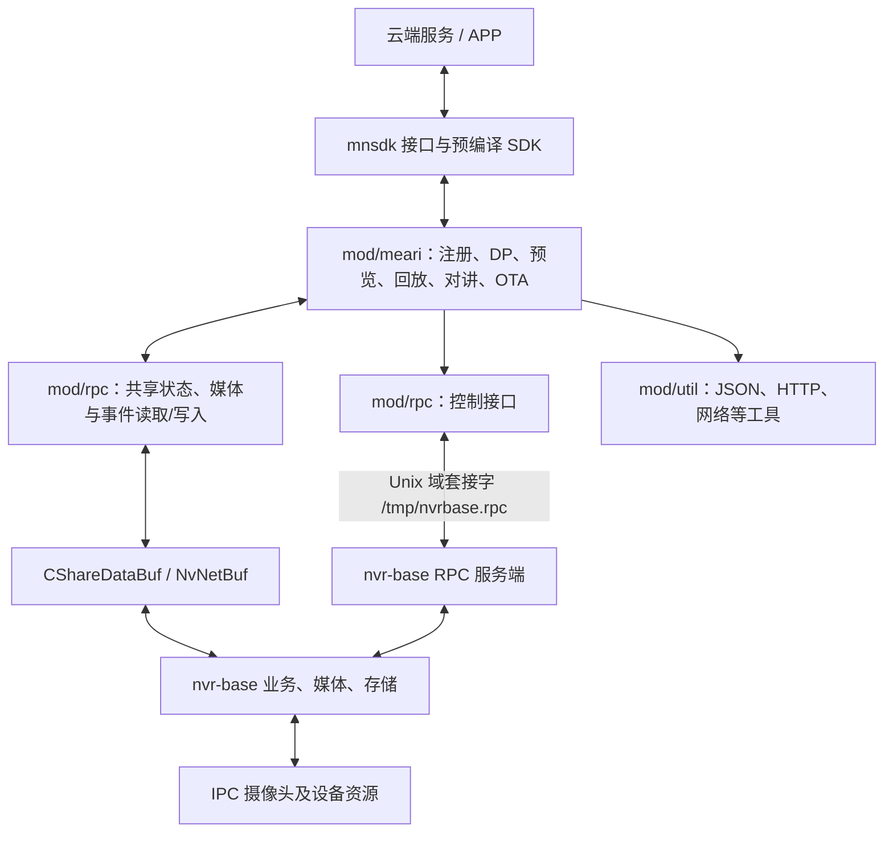
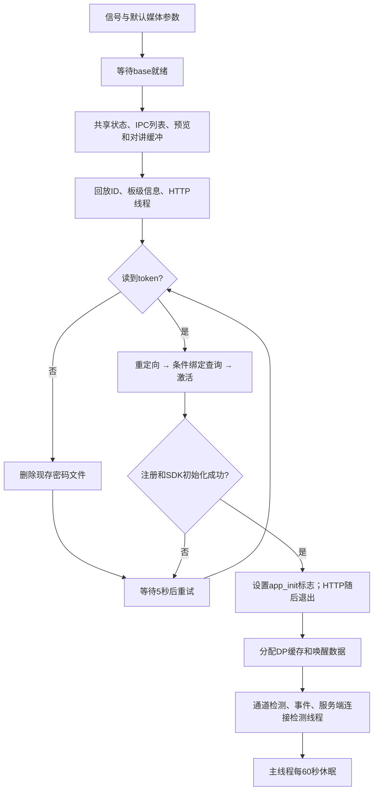

# nvr-mearicloud 仓库源码深度分析报告

> 版权所有：杭州美瑞智联科技有限公司 (Meari Technology Co., Ltd)  
> 修订日期：2026-10-04。分析依据为 `/home/tronlong/lyp/meari/nvr-mearicloud` 当前工作树，并追踪本地 `nvr-base/mod/rpcapi` 的相关实现。
> 本文区分已确认实现、静态发现的问题与待验证行为。未执行交叉编译、目标设备联调或闭源 SDK 内部验证；库名、头文件声明和代码注释不单独构成功能已实现的证据。
> 本次已直接修订原有章节及流程图，并补充 RPC 实现、DP 分派索引、状态转换、资源所有权、异常路径及源码引用；2026-10-04进一步追踪base服务端、IPC管理、存储和升级任务。

---

## 目录

1. [项目概述](#1-项目概述)
2. [整体架构](#2-整体架构)
3. [目录结构详解](#3-目录结构详解)
4. [核心模块分析](#4-核心模块分析)
   - 4.1 [入口与生命周期 (main.c)](#41-入口与生命周期-mainc)
   - 4.2 [云端SDK接口 (mnsdk)](#42-云端sdk接口-mnsdk)
   - 4.3 [设备注册模块 (nvr_register)](#43-设备注册模块-nvr_register)
   - 4.4 [实时预览模块 (nvr_preview)](#44-实时预览模块-nvr_preview)
   - 4.5 [回放模块 (nvr_playback)](#45-回放模块-nvr_playback)
   - 4.6 [DP数据点模块 (nvr_dp)](#46-dp数据点模块-nvr_dp)
   - 4.7 [告警/移动侦测模块 (nvr_motion_detect)](#47-告警移动侦测模块-nvr_motion_detect)
   - 4.8 [双向对讲模块 (nvr_speak)](#48-双向对讲模块-nvr_speak)
   - 4.9 [OTA固件升级模块 (nvr_upgrade)](#49-ota固件升级模块-nvr_upgrade)
   - 4.10 [本地RESTful服务 (nvr_restful_server)](#410-本地restful服务-nvr_restful_server)
   - 4.11 [设备发现模块 (nvr_discovery)](#411-设备发现模块-nvr_discovery)
   - 4.12 [板级初始化 (nvr_device_board)](#412-板级初始化-nvr_device_board)
5. [RPC 通信层](#5-rpc-通信层)
6. [工具库层 (mod/util)](#6-工具库层-modutil)
7. [多平台支持与编译系统](#7-多平台支持与编译系统)
8. [关键数据流图](#8-关键数据流图)
   - 8.1 [启动初始化流程](#81-启动初始化流程)
   - 8.2 [实时预览数据流](#82-实时预览数据流)
   - 8.3 [告警及事件数据流](#83-告警及事件数据流)
   - 8.4 [回放控制与数据流](#84-回放控制与数据流)
   - 8.5 [DP配置及异步响应流程](#85-dp配置及异步响应流程)
9. [线程模型](#9-线程模型)
10. [安全机制](#10-安全机制)
11. [关键常量与配置参数汇总](#11-关键常量与配置参数汇总)
12. [依赖的外部预编译库](#12-依赖的外部预编译库)
13. [代码质量与特点观察](#13-代码质量与特点观察)
14. [总结](#14-总结)

---

## 1. 项目概述

**nvr-mearicloud** 是一个运行在嵌入式 NVR（Network Video Recorder，网络录像机）设备上的**云端接入应用程序**，由美瑞智联（Meari Technology）开发，目标是将其自研 NVR 硬件接入 Meari 云平台，实现：

- 手机 APP 远程实时预览（P2P 视频流）
- 录像回放检索与播放
- 双向对讲（语音对讲）
- 告警推送（移动侦测、人形/车辆/宠物 AI 检测、PIR 等）
- DP 数据点云端配置管理（设备属性的读/写）
- 固件 OTA 在线升级
- 启动绑定阶段的本地 HTTP token 接收接口

该应用程序的默认构建产物是独立可执行文件 `meari_nvr`。它通过 Unix 域套接字发送底层控制请求，通过共享状态与媒体缓冲区获取设备信息、视频帧和事件；硬件、存储和摄像头控制主要由 `nvr-base` 提供。云端网络能力由 SDK 接口承接，不能仅据 SDK 库名认定具体连接拓扑和加密策略。

---

## 2. 整体架构



控制面和数据面是两条通路。`StorageRPC::call()` 每次建立本地套接字连接、发送请求、读取响应并关闭连接；媒体帧不通过每次控制 RPC 的载荷传输。共享状态用于通道信息和检索结果，`NvNetBuf` 用于预览、回放、对讲和事件缓冲。

本地 `nvr-base` 有客户端、服务端和缓冲区源码，不应整体标成闭源。云 SDK 在当前仓库以头文件和预编译库提供；本地缺少实现不等于已经确认其许可证性质。SDK 是否使用某一种 MQTT/WebRTC/TURN 路径、是否必须经过云服务器转发，本文不作未经验证的判断。

源码依据：[mod/rpc/src/nv_meari_rpc.cc](/home/tronlong/lyp/meari/nvr-mearicloud/mod/rpc/src/nv_meari_rpc.cc:77)；[mod/rpcapi/rpcApiClient/src/nvSysRPC.cc](/home/tronlong/lyp/meari/nvr-base/mod/rpcapi/rpcApiClient/src/nvSysRPC.cc:12)；[mod/rpcapi/rpcApiClient/src/nvShareBuf.cc](/home/tronlong/lyp/meari/nvr-base/mod/rpcapi/rpcApiClient/src/nvShareBuf.cc:42).

---

## 3. 目录结构详解

```
nvr-mearicloud/
├── Makefile                  # 顶层 Makefile，分发到子目录
├── auto_build.sh             # 自动化编译脚本（多平台）
├── README.md                 # 简要说明
├── .gitignore
│
├── inc/                      # 公共头文件（对外暴露的SDK接口）
│   ├── mnsdk.h               # Meari云端SDK核心API（回调类型、结构体、函数声明）
│   └── mnsdk_meari.h         # Meari SDK 初始化扩展参数结构体
│
├── config/                   # 各平台编译环境变量配置脚本
│   ├── x86                   # x86 (调试用)
│   ├── ss661q                # Sigmastar ss661q (ARM)
│   ├── t41                   # INGENIC T41
│   ├── mipsel_a1x            # INGENIC A1x (MIPS小端)
│   ├── mipsel_a1nt           # INGENIC A1nt (MIPS小端)
│   └── MTK7628               # MediaTek MT7628 (MIPS)
│
├── lib/                      # 预编译第三方/自研静态库（按平台分目录）
│   ├── INGENIC_A1/           # libmnsdk.a, libmearisdk.a, libmbedtls.a, libsrtp2.a, libWebrtcClient.a ...
│   ├── INGENIC_A1NT/
│   ├── INGENIC_T41/
│   ├── sigmastar/
│   └── MTK7628/
│
├── build/                    # 编译输出目录（按平台存放编译结果）
│   ├── INGENIC_A1/
│   ├── INGENIC_A1_BASE/
│   ├── INGENIC_T41/
│   └── sigmastar/
│
└── mod/                      # 源码主体
    ├── Makefile              # 模块Makefile（编译规则、链接指令）
    │
    ├── meari/                # 业务逻辑主模块
    │   ├── inc/              # 模块内部头文件
    │   │   ├── nvr_common.h      # 公共宏/结构体/枚举
    │   │   ├── nvr_device_board.h
    │   │   ├── nvr_discovery.h
    │   │   ├── nvr_dp.h          # DP数据点定义（400+ 行的DP ID常量）
    │   │   ├── nvr_media.h
    │   │   ├── nvr_motion_detect.h
    │   │   ├── nvr_playback.h
    │   │   ├── nvr_preview.h
    │   │   ├── nvr_register.h
    │   │   ├── nvr_restful_server.h
    │   │   ├── nvr_speak.h
    │   │   ├── nvr_ssl.h
    │   │   ├── nvr_upgrade.h
    │   │   ├── nvr_util.h
    │   │   └── pps_device_time.h
    │   └── src/              # 模块源文件（9357行C代码）
    │       ├── main.c            (363行) 程序入口
    │       ├── nvr_register.c    (703行) 设备注册
    │       ├── nvr_dp.c          (4436行) DP数据点处理（最大文件）
    │       ├── nvr_preview.c     (612行) 实时预览推流
    │       ├── nvr_playback.c    (718行) 录像回放
    │       ├── nvr_motion_detect.c(193行) 告警侦测
    │       ├── nvr_speak.c       (84行)  双向对讲
    │       ├── nvr_upgrade.c     (233行) OTA升级
    │       ├── nvr_restful_server.c(368行) 本地HTTP服务
    │       ├── nvr_discovery.c   (523行) 设备发现
    │       ├── nvr_device_board.c(191行) 板级初始化
    │       ├── nvr_media.c       (52行)  默认媒体参数
    │       ├── nvr_util.c        (515行) 通用工具函数
    │       └── pps_device_time.c (366行) 时间管理
    │
    ├── rpc/                  # C++实现 + C接口头文件（实现2262行）
    │   ├── src/
    │   │   ├── nv_meari_rpc.cc          (1225行) 控制与共享状态
    │   │   ├── nv_meari_playback.cc     (585行) 回放任务与线程
    │   │   ├── nv_meari_preveiw.cc      (174行) 预览缓冲与读帧
    │   │   ├── nv_meari_speak.cc        (104行) 对讲缓冲与写帧
    │   │   ├── nv_meari_pushmsg.cc      (86行) 事件缓冲与读消息
    │   │   └── nv_meari_searchrecord.cc (88行) 录像检索句柄
    │   └── inc/
    │       ├── nv_meari_rpc.h        # 主RPC接口（摄像头控制、存储、设备信息等）
    │       ├── nv_meari_com_def.h    # 通道编号换算宏
    │       ├── nv_meari_preveiw.h    # 预览流RPC
    │       ├── nv_meari_playback.h   # 回放RPC
    │       ├── nv_meari_speak.h      # 对讲RPC
    │       ├── nv_meari_pushmsg.h    # 推送消息RPC
    │       └── nv_meari_searchrecord.h # 录像检索RPC
    │
    └── util/                 # 工具库（源码 + 头文件）
        ├── inc/
        │   ├── pps_osal/     # OS抽象层头文件
        │   └── pps_util/     # 实用工具库头文件
        └── src/              # 工具库源码 (11个.c文件)
            ├── pps_mongoose.c  (5353行) 嵌入式HTTP服务器
            ├── pps_netconfig.c (3483行) 网络配置
            ├── pps_cJSON.c              JSON解析
            ├── pps_md5.c                MD5
            ├── pps_base64.c             Base64
            ├── pps_requests.c           HTTP请求封装
            └── ...
```

---

## 4. 核心模块分析

### 4.1 入口与生命周期 (main.c)

`main.c` 是整个应用程序的控制中枢，负责所有模块的启动序列编排与退出清理。

**启动序列（按代码顺序）：**

```
main()
  │
  ├─ nvr_init_signals()          # 注册信号处理（SIGINT/SIGTERM → nvr_exit_handler）
  ├─ set_media_info()            # 初始化媒体参数（分辨率/码率/编码类型）
  ├─ nv_tuya_wait_nvr_start()    # 阻塞等待底层NVR基础系统就绪
  ├─ nv_tuya_init_share()        # 打开共享状态并读取通道数
  ├─ nv_tuya_init_nvr_ipclist()  # 初始化子设备（IPC摄像头）参数列表
  ├─ nv_tuya_start_preview()     # 启动预览流缓冲区
  ├─ nv_tuya_start_speak()       # 启动对讲缓冲区
  ├─ sleep(2)                    # 等待稳定
  ├─ init_play_id()              # 初始化回放会话ID管理
  ├─ pps_device_board_init()     # 初始化板级身份及能力信息
  ├─ restful_webserver_init()    # 启动本地HTTP服务（80端口）
  │
  └─ 云端注册循环（while(1)）
      ├─ pps_device_get_token()      # 从文件(/home/cfg/device.token)读token
      ├─ pps_register_init()         # 向Meari云注册设备，获取context（含签名、服务器域名等）
      ├─ nvr_mnsdk_init()            # 填充mnsdk_settings_t配置
      └─ mnsdk_init()                # 初始化云端SDK（成功则break出循环）
           失败 → sleep(5) → retry
  │
  ├─ nvr_init_dp_data()          # 分配能力/属性缓存、唤醒信号量存储及搜索数据
  ├─ pthread_create(check_channel_thread)    # 通道连接状态检测线程
  ├─ pthread_create(motion_detect_thread)   # 告警侦测线程
  ├─ pthread_create(online_status_thread)   # 设备与SDK服务端连接状态检测线程
  │
  └─ while(1) sleep(60)          # 主线程守护循环
```

**退出清理（nvr_exit_handler）：**

```
nvr_exit_handler()
  ├─ nvr_deinit_dp_data()    # 释放DP数据
  ├─ live_stop_all()         # 停止所有预览推流线程
  ├─ playback_release()      # 释放回放资源
  ├─ mnsdk_release()         # 释放云端SDK
  └─ pthread_cancel(3个线程)
```

**关键数据结构：**

```c
// 全局上下文，存储注册后的设备信息、签名、服务器地址等
static meari_context_t g_meari_context;

// 主线程管理的3个后台线程句柄
typedef struct {
    pthread_t check_channel_thread;   // 通道连接状态检测
    pthread_t motion_detect_thread;   // 告警检测
    pthread_t online_status_thread;   // SDK服务端连接状态检测
} main_thread_t;
```

**启动和退出的边界：**

- 注册循环在 token 存在时才调用注册/SDK 初始化；无 token 时删除现存访问密码文件并每 5 秒重试，HTTP 入口可接收新的绑定 token。
- SDK 初始化失败调用 `mnsdk_release()`；成功后设置 `g_app_init_success=1`。HTTP 线程观察到该标志后退出，不是常驻后台服务。
- `nv_tuya_init_share()`、预览/对讲初始化和后台线程创建的返回值没有在 main 中形成完整的失败回滚链；流程图表示调用顺序，不代表各步必然成功。
- 三个主后台线程被 detach。退出先释放 DP 数据，再停止预览/回放、释放 SDK，最后 cancel 后台线程；这没有证明后台访问已结束，存在生命周期竞争需要验证。
- `nvr_app_init_set()` 加锁，get 直接读；仅有 setter 的锁不等于读写均受保护。
- SDK 设置 `devicetype=IPC`、`channels=1`。这两项与业务中的动态通道数并存，适配原因须结合 SDK 合约确认，不能直接断定为历史 bug。
- `board_t` 的 licenceid/secretkey 是数组，main 中对其地址判空不能检查空字符串；设备身份有效性还需检查内容与长度。

源码依据：[mod/meari/src/main.c](/home/tronlong/lyp/meari/nvr-mearicloud/mod/meari/src/main.c:121)、[mod/meari/src/main.c](/home/tronlong/lyp/meari/nvr-mearicloud/mod/meari/src/main.c:204).

### 4.2 云端SDK接口 (mnsdk)

`mnsdk` 在当前仓库以**预编译静态库**（`libmnsdk.a`）提供，未见其实现源码，接口涵盖云端连接、媒体发送和配置/事件回调。业务源码还自行发起注册 HTTPS 请求，因此不能把全部网络逻辑都归入该库。本仓库提供 `inc/mnsdk.h`、`inc/mnsdk_meari.h` 及平台预编译库。

**设备类型定义：**

| 宏 | 值 | 含义 |
|---|---|---|
| `MNSDK_DEVICE_TYPE_IPC` | 0 | 常电摄像机 |
| `MNSDK_DEVICE_TYPE_SNAP` | 1 | 电池摄像机 |
| `MNSDK_DEVICE_TYPE_DOORBELL` | 2 | 门铃 |
| `MNSDK_DEVICE_TYPE_NVR` | 3 | 网络录像机 |

> main.c 实际传入 `MNSDK_DEVICE_TYPE_IPC` 且 `channels=1`；其适配含义待 SDK 合约确认，见 4.1。

**媒体流类型：**

| 宏 | 含义 |
|---|---|
| `MNSDK_STREAM_TYPE_PREVIEW` | 实时预览流 |
| `MNSDK_STREAM_TYPE_PLAYBACK` | 录像回放流 |

**编码类型：** H264、H265、G711.A、G711.U、AAC

**视频码流类型：** 主码流（高清）、超清码流、辅码流

**核心回调函数（5个）：**

```c
// 1. 接收媒体流（APP → 设备，如对讲音频）
mnsdk_stream_received_callback
    参数: channel, stream_type, frame_type, encode_type, video_type, data, length, params

// 2. 接收数据命令（APP → 设备，如回放控制命令）
mnsdk_data_received_callback
    参数: channel, sid, data, length, params

// 3. 接收配置请求（APP获取/下发设备配置）
mnsdk_config_request_received_callback
    参数: sid, contact, content, content_length

// 4. 接收配置通知（当前实现与request调用同一个处理函数，也会走响应路径）
mnsdk_config_notify_received_callback
    参数: sid, contact, content, content_length

// 5. 事件回调（当前业务实现解析预览/对讲启停事件）
mnsdk_event_publish_response_received_callback
    参数: channel, sid, eventid, result
```

**核心API（参数顺序示意，完整类型见头文件）：**

```c
int mnsdk_init(mnsdk_settings_t *settings);           // 初始化SDK
int mnsdk_release();                                   // 释放SDK
int mnsdk_stream_send(channel, sid, stream_type, frame_type, encode_type, video_type, stream, length, params); // 发送媒体流
int mnsdk_data_send(channel, sid, data, length, params);  // 发送数据
int mnsdk_config_response(sid, contact, content, content_length); // 响应配置请求
int mnsdk_config_sync_request(sid, content, content_length);       // 同步配置请求
int mnsdk_event_publish_request(sid, eventid, params, content, content_length); // 发布事件（告警）
int mnsdk_server_is_connected();                      // 检查云端连接状态
```

头文件接口并不代表每个业务分支都调用该API。例如本层回放搜索通过 `search->result` 回传结果，而非显式调用 `mnsdk_data_send()`。源码依据：[inc/mnsdk.h](/home/tronlong/lyp/meari/nvr-mearicloud/inc/mnsdk.h:237)。

---

### 4.3 设备注册模块 (nvr_register)

注册不是一个 POST，而是由重定向、绑定关系检查、激活组成的 GET 请求链。token 由 main 读取后填入 `meari_settings`。

| 阶段 | 实际动作 | 失败/状态变化 |
|---|---|---|
| 重定向 | `mnsdk_device_redirect_request()` 获取 application、gwUrl、server_domain、signature | 任一关键字段为空则返回失败 |
| 绑定查询 | `reset == 0` 时调用 `mnsdk_device_bind_state_request()` | 已解绑则删除 token 和访问密码文件；未知状态也返回失败 |
| 激活 | `mnsdk_device_active_request()` 传入身份、版本、能力与 token | 请求失败或 devicecode 为空则返回失败 |
| SDK 配置 | deviceid 使用 licenceid 的第 5 字节起的字符串；填写授权、签名、服务器与回调 | DNS 查询及字段长度需要结合调用约束核验 |
| SDK 初始化 | main 调用 `mnsdk_init()` | 失败释放 SDK、5 秒后重试；成功启动后续业务 |

请求签名使用 MD5 或 HMAC-SHA1/Base64，SSL 请求交给 `uni_ssl_request` / `uni_ssl_request_ex`。连接端口为 443；证书链校验、主机名验证和 TLS 版本策略未从这些调用点得到证明。`mnsdk_sha1()` 对摘要结果使用 `strlen()` 作为 Base64 输入长度，应核对 `uni_hmac_sha1()` 的输出契约，不能仅凭名称认定签名实现正确。

`thread_check_online_status()` 每秒检查 `mnsdk_server_is_connected()`。离线转在线时查询绑定关系：解绑则删凭据并重启，否则同步配置。连接状态改变时调用 `nv_tuya_send_mqtt_online_msg()` 通知底层。这里检测的是设备到服务端连接，不是每个 APP 用户在线情况。

源码依据：[mod/meari/src/nvr_register.c](/home/tronlong/lyp/meari/nvr-mearicloud/mod/meari/src/nvr_register.c:61)、[mod/meari/src/nvr_register.c](/home/tronlong/lyp/meari/nvr-mearicloud/mod/meari/src/nvr_register.c:226)、[mod/meari/src/nvr_register.c](/home/tronlong/lyp/meari/nvr-mearicloud/mod/meari/src/nvr_register.c:519)、[mod/meari/src/nvr_register.c](/home/tronlong/lyp/meari/nvr-mearicloud/mod/meari/src/nvr_register.c:660).

---

### 4.4 实时预览模块 (nvr_preview)

真实预览上下文按通道使用，而不是按 `(channel,sid)` 用户会话使用：

```c
typedef struct {
    int valid;
    int ipc_status;
    int channel;
    int stream;
    int preview_video_encode[2];
    pthread_t main_thread;
    pthread_t sub_thread;
} preview_context_t;
```

全局数组容量为 `NVR_P2P_USER_NUM`，初始化及访问循环却使用 `DEMO_NVR_SUB_DEV_NUM`；必须保证实际通道数不超过数组容量。不能把数组名所用的用户数宏解释成每个预览线程绑定一个用户。

**创建和停止：** 通道检测线程在 `valid==0` 且通道 ONLINE/SLEEP 时创建主码流线程；等待 2 秒后将同一上下文的 stream 改为辅码流，再创建辅码流线程。线程入口各自复制 channel/stream。这里通过延迟协调参数读取，没有互斥或握手保证；线程创建失败也没有完整恢复。通道断线只更新状态和同步配置，不会自动销毁取流线程。`live_stop()` 用 `pthread_cancel()` 取消两线程，没有 `running` 字段或等待结束的 join。

**推流流程：**

```text
thread_live_stream
  → nv_tuya_get_frame
    → nv_tuya_read_net_frame → NvNetBuf::readFrame
  → 无帧/空帧：等待10ms后继续
  → I帧：更新编码类型和分辨率；P帧沿用已记录编码
  → 音频：只取主码流PCM；16kHz时重采样到8kHz，再转G711U
  → 构造时间戳、序号、分辨率或采样信息
  → mnsdk_stream_send(channel, 0, PREVIEW, ...)
```

视频通常复用读取的帧数据地址；音频转换使用线程局部缓冲。SDK 是否同步复制载荷需要接口合约确认，不能从该调用直接推出发送后的缓冲所有权。

APP 预览/对讲事件进入 `nvr_dispose_event_id()`：解析 `eventid` JSON 的 `event_id/video`，执行 PREVIEW_START/STOP 和 TALK_START/STOP 分支。预览开始可涉及低功耗唤醒及码流设置，对讲事件切换 AEC；它不是单纯告警响应函数。停止预览事件与 `live_stop()` 是不同路径。

通道转换宏定义 `chn/5` 为内部通道，余数 0、1 对应主、辅码流，其余返回 0；反向为 `chan*5+(stream-1)`。这是接口适配规则，不应将所有云回调 channel 都先套该换算；实际预览发送直接用 chan。

源码依据：[mod/meari/inc/nvr_preview.h](/home/tronlong/lyp/meari/nvr-mearicloud/mod/meari/inc/nvr_preview.h:28)、[mod/meari/src/nvr_preview.c](/home/tronlong/lyp/meari/nvr-mearicloud/mod/meari/src/nvr_preview.c:81)、[mod/meari/src/nvr_preview.c](/home/tronlong/lyp/meari/nvr-mearicloud/mod/meari/src/nvr_preview.c:225)、[mod/meari/src/nvr_preview.c](/home/tronlong/lyp/meari/nvr-mearicloud/mod/meari/src/nvr_preview.c:561)、[mod/rpc/inc/nv_meari_com_def.h](/home/tronlong/lyp/meari/nvr-mearicloud/mod/rpc/inc/nv_meari_com_def.h:35).

---

### 4.5 回放模块 (nvr_playback)

SDK 数据回调复制 `playback_info_t`、读取 command 和 `reserved[0]`，验证 channel、sid 及 params，再调用搜索或播控处理。复制之前对 data/length 的约束和完整报文长度仍需补强；零填充并不等同于合法短报文校验。

| 命令值 | 枚举 | 当前 main 分派 |
|---:|---|---|
| 0 | SEARCH_BY_DAY | 日检索 |
| 1 | SEARCH_BY_MONTH | 月检索 |
| 2 | SEARCH_BY_TIME | 枚举存在，没有对应 switch 分支 |
| 3 | SEARCH_SD_STATES | 枚举存在，没有对应 switch 分支 |
| 4 | PLAY_START | 创建/替换播放对象并按时间开始 |
| 5 | PLAY_PAUSE | 本地SUSPEND标志，暂停取流线程 |
| 6 | PLAY_RESUME | NORMAL 模式 |
| 7 | PLAY_SEEKTIME | 恢复 NORMAL 并 seek |
| 8 | PLAY_STOP | 销毁对象；在非空对象分支清理槽位 |

**检索协议与资源：** 月检索把日期转成起止时间戳，调用 `nv_tuya_get_rec_bymonth_utc()`，将位图转成 31 个 0/1 的数组字符串。日检索创建 search handle，通过 `StorageRPC::AllocSearchBuf/searchRecord` 请求底层搜索，再从共享数据取得 `FILE_INFO*` 并构造 `HHMMSS-HHMMSS` 字符串数组。完成后释放搜索句柄/底层搜索缓冲。

两者将堆分配字符串放入 `search->result` 后返回；本层没有调用 `mnsdk_data_send()`。SDK 消费结果和释放堆字符串的约定需确认。日检索过滤不属于目标日期、结束秒数不大于开始秒数的条目；夏令时重复时间、跨日录像的展示效果需测试。

**播放对象关系：**

```text
(channel,sid)
  → g_playbakck_paly_id[36] 中的 play_id
  → play_t[play_id]
  → nv_playback_create(play_id,nvr_send_data_cb,MEARI_PLAYBACK_BASEID)
    → userid = play_id + id_base
    → StorageRPC::playbackCreate(userid) 获得底层 taskId
    → 创建信号、消息队列，启动 PlayBackThreadProc，等待启动通知
  → nv_playback_start_bytime：指定一天起止时间和目标播放时刻
  → NvNetBuf::PbRequestReadFrame → nvr_send_data_cb → SDK发送
  → PbCommitRead：提交已消费帧
```

工作线程处理暂停/开始标志、seek 标记、结束帧、目标结束时间及 I/P 帧选择。发送回调返回 `NV_RETRY` 时等待 5ms，保留当前帧重试；正常处理后提交读位置。seek 期间有丢帧和标记处理。销毁对象先停止/销毁底层任务，设置退出标志、投递线程结束消息，再等退出信号并释放资源。

**速率限制：** `reserved[0]` 存到全局 `reserved`。当前线程在其为 1 时对超过 20ms 的帧间隔减去 20ms，之后仍受 speed 和休眠控制，不应描述成绝对“不限速”。该变量跨会话共享，会话隔离尚需验证。

**槽位与异常：** 搜索本身也会调用可能分配新槽位的 `get_play_id()`；搜索结束未清槽。`playback_release()` 销毁非空对象但不清所有 ID。`get_play_sid()` 用 `>=0 || <上限` 错误判断边界，发送回调还有 `>上限` 而非 `>=上限` 的检查，见第13节。

源码依据：[mod/meari/src/main.c](/home/tronlong/lyp/meari/nvr-mearicloud/mod/meari/src/main.c:40)、[mod/meari/src/nvr_playback.c](/home/tronlong/lyp/meari/nvr-mearicloud/mod/meari/src/nvr_playback.c:355)、[mod/meari/src/nvr_playback.c](/home/tronlong/lyp/meari/nvr-mearicloud/mod/meari/src/nvr_playback.c:565)、[mod/rpc/src/nv_meari_playback.cc](/home/tronlong/lyp/meari/nvr-mearicloud/mod/rpc/src/nv_meari_playback.cc:75)、[mod/rpc/src/nv_meari_searchrecord.cc](/home/tronlong/lyp/meari/nvr-mearicloud/mod/rpc/src/nv_meari_searchrecord.cc:37).


#### 4.5.1 回放状态转换及失败后的残留

| 请求/事件 | 当前代码动作 | 结果与资源状态 |
|---|---|---|
| 首次日/月搜索 | get_play_id分配槽位；执行检索 | 搜索句柄可释放，但本地(channel,sid)槽位保留 |
| 首次PAUSE/RESUME/STOP | 同样先get_play_id | 可能创建没有play_t的槽位；STOP只在play_t非空时清槽 |
| START | 先销毁原play_t，再检查是否允许回放，创建新对象、按时间启动 | 被禁止时原播放已经销毁；新建失败或启动失败未统一清理槽位 |
| PAUSE | nv_SetPlayBackMode的SUSPEND分支仅设置is_pause_ | 当前分支不调用底层暂停RPC；不能推断底层写帧任务已停止 |
| RESUME | 清is_pause_/is_step_、投递WakeUp，调用底层NORMAL模式 | 本地恢复和RPC结果需要分别检查 |
| SEEK | 先恢复NORMAL，再设置seek_op_并发送seek RPC | seek失败时标志恢复行为需验证；SFrame用于重置视频序号 |
| 底层END帧 | 适配线程调用回调(buf=NULL,len=0)，commit并清start_playback_ | 业务nvr_send_data_cb先拒绝NULL，没有将该结束载荷发送给SDK |
| STOP | 销毁底层任务，通知并等待本地线程退出，释放缓冲/对象，再清槽 | 只适用于当前非空play_t分支 |
| playback_release | 遍历并销毁非空play_t | 未调用clean_play_id；槽位与播放对象生命周期不完全相同 |

`playback_control_request()` 多处不检查被调用接口返回值，函数最后返回0。因此业务回调返回成功，不能单独证明对象创建、底层开始播放或seek已经成功。RPC适配的暂停只是本地标志，恢复路径才明确下发模式，这与原来的“暂停、恢复都只是速率控制”或“都由底层RPC实现”两种概括都不同。

下层按时间开始播放不要求先走APP检索：RPC服务端收到 `buf_id=-1` 后可使用锁保护的0号搜索缓冲自行检索，再调用存储模块加入播放任务。显式日检索使用单独分配的bufid，二者不要混成一个必须顺序调用的流程。

#### 4.5.2 回放身份、帧数据和时间字段

| 名称 | 来源 | 使用位置 |
|---|---|---|
| sid | SDK回调，当前检查范围1至36 | 用于发送给相应SDK会话 |
| play_id | 本地36槽数组下标 | play_t、编码/序号缓存与发送回调param |
| userid | play_id + MEARI_PLAYBACK_BASEID | 底层创建任务的用户身份、PlayBackUser缓冲命名 |
| taskId | StorageRPC::playbackCreate返回 | 后续底层start/stop/mode/seek/destroy请求 |
| search bufid | AllocSearchBuf返回 | 日检索FILE_INFO共享结果位置，与taskId独立 |

缓冲名实际为 `PlayBackUser%02d`。`CreateCRingBuf()` 返回布尔值，但 `nv_playback_start()` 没有据此停止；分配失败后启动RPC及本地取帧的行为需要处理。底层任务创建同一userid时返回-2、无任务槽时返回-1，不能把它们误认为合法taskId。

业务发送回调将pts截取为32位timestamp；将framems/1000转为本地时间后再加 `tm_gmtoff` 构造t，且视频frame_rate当前固定写10。三者分别是媒体时间戳、展示/协议时间和元数据默认值，不能认为都来自原始实际帧率。I帧更新编码/分辨率，P帧沿用缓存；PCM音频转换为G711U，回放音频采样信息通过传入的宽高字段所对应的联合体约定解释。

[mod/meari/src/nvr_playback.c](/home/tronlong/lyp/meari/nvr-mearicloud/mod/meari/src/nvr_playback.c:355)、[mod/meari/src/nvr_playback.c](/home/tronlong/lyp/meari/nvr-mearicloud/mod/meari/src/nvr_playback.c:188)、[mod/rpc/src/nv_meari_playback.cc](/home/tronlong/lyp/meari/nvr-mearicloud/mod/rpc/src/nv_meari_playback.cc:342)、[mod/rpc/src/nv_meari_playback.cc](/home/tronlong/lyp/meari/nvr-mearicloud/mod/rpc/src/nv_meari_playback.cc:467)、[mod/rpcapi/rpcApiServer/src/nvRpcApiServer.cc](/home/tronlong/lyp/meari/nvr-base/mod/rpcapi/rpcApiServer/src/nvRpcApiServer.cc:2738)、[mod/storage/src/nvDataPlayback.cc](/home/tronlong/lyp/meari/nvr-base/mod/storage/src/nvDataPlayback.cc:62).

---

### 4.6 DP数据点模块 (nvr_dp)

该模块包含设备/通道属性读取、配置写入、能力与状态缓存、IPC 搜索添加、绑定 token 管理和异步进度响应。不能只按头文件中的 DP ID 推断完整功能支持。

**请求外层结构：** `pps_iot_config_request()` 读取 `code/name/action/channel/seq`，仅在 `code==100001` 且 name 为 `iot` 时按 get/set 分派。响应保留外层字段并附带 `iot`。以下为结构示例，不包含真实凭据：

```json
{"code":100001,"name":"iot","action":"get","channel":0,"seq":0,"iot":["50","52"]}
```

- get 的 `iot` 缺失时调用 `pps_iot_get_all()`；存在时要求数组，按字符串 ID 分派。全量查询是代码中显式列举的集合，并非所有宏的自动遍历。
- set 的 `iot` 按对象字段逐项解析，可在一个请求里处理多项。部分值为数字，部分为字符串，OTA/PTZ/添加 IPC 的字段是包含 JSON 文本的字符串，AI 的 141 则直接是含 enable/type 的对象。
- 通常调用 `mnsdk_config_response()`；OTA 开始时可抑制立即响应，后续由进度线程发送。reset/reboot 标志在响应路径之后检查。多数底层 setter 结果未转换成逐字段错误响应，不能把响应产生视作配置已经生效。
- `seq` 还被用作 `g_format[8]` 下标，不能仅视作任意事务号。入口缺少明确范围检查。
- 入口允许 `channel == DEMO_NVR_SUB_DEV_NUM`，而帧回调要求严格小于；整机/IPC 范围需逐分支核对，不应在全部 DP 上套一个未经证明的规则。

已经定位到的通道规则并不完全一致：灯光辅助函数将范围外通道解释为整机操作，翻转函数直接拒绝；IPC能力查询分支仍使用0表示全部、1至N转换成本地下标，状态响应则输出i+1。这些规则与媒体回调的0至N-1并存，是协议适配需要重点核验的部分。翻转setter先更新缓存再调用底层，失败时未在该函数回滚缓存；缓存值不必然代表设备已成功执行。[通道与缓存处理](/home/tronlong/lyp/meari/nvr-mearicloud/mod/meari/src/nvr_dp.c:389)、[IPC能力查询](/home/tronlong/lyp/meari/nvr-mearicloud/mod/meari/src/nvr_dp.c:3437)。

**代表性分支：**

| 分支 | 数据形式/条件 | 处理 |
|---|---|---|
| SN/版本/固件/MAC/时区 | get，字符串 ID | 对应读取辅助函数，构造响应 |
| 用户解绑 `1` | set，字符串 `"0"` | 删除 token，设置 reset 标志 |
| 翻转/日夜/灯光 | set，数字 | 调用对应 pps_set_* 后连接底层接口 |
| 移动/声音/PIR 检测 | set，开关；开关为1时再读灵敏度 | 单独灵敏度字段不一定生效，必须满足当前分支条件 |
| AI `141` | set，`enable` 与 `type.person/pet/car/package` | 分别设置总开关与分类检测 |
| OTA | set，JSON字符串含 url/version | 记录目标 channel，创建升级线程；目标通道缺陷见4.9 |
| PTZ start/stop | set，JSON字符串含 ps/ts/zs | 转换后调用 PTZ 控制 |
| IPC 搜索/添加/删除 | 存在性触发或 JSON字符串 | 请求底层搜索、管理搜索缓存，解析IP及账户信息 |
| AI布防时段 | set，数组含 start_time/stop_time | 遍历并逐次调用设置接口；多段能否累计由底层语义决定 |
| 访问密码 | 清除标志/密码字符串 | 删除或保存密码文件；不代表REST实际校验该文件 |
| 磁盘格式化 | 实际在响应辅助分支中触发 | 按 seq 记录状态，调用底层格式化并创建进度响应线程 |

时区 ID `54` 在已检查的 set 函数中没有处理分支；不能继续把它画成通用“DP54下发直接设置时区”的链路。时区实际设置还涉及注册响应和时间模块。另一个不完整分派是 `DP_WIFI_NAME`：显式get入口转交给响应辅助函数，但后者没有对应分支，不能据入口有分派就声称返回了Wi-Fi名称。

**缓存、唤醒和同步：** `nvr_init_dp_data()` 分配能力/属性缓存、信号量存储、搜索结果数据，并不直接全量同步云端。连接事件更新能力和 DP 缓存，通道变化或重新连云触发同步。低功耗唤醒执行 sem_init → 发唤醒命令 → sem_wait → sem_destroy；连接成功事件 sem_post。此路径没有显式超时，并发唤醒同一通道时的初始化/销毁关系需要核验。

**进度：** 格式化线程每秒读取底层进度。OTA 下载进度来自累计下载字节；后续升级阶段的 `pps_upgrade_get_upgrade_percent()` 每次加5，是软件递增，不是底层刷写进度反馈。见4.9和13节。

源码依据：[mod/meari/src/nvr_dp.c](/home/tronlong/lyp/meari/nvr-mearicloud/mod/meari/src/nvr_dp.c:58)、[mod/meari/src/nvr_dp.c](/home/tronlong/lyp/meari/nvr-mearicloud/mod/meari/src/nvr_dp.c:2512)、[mod/meari/src/nvr_dp.c](/home/tronlong/lyp/meari/nvr-mearicloud/mod/meari/src/nvr_dp.c:2753)、[mod/meari/src/nvr_dp.c](/home/tronlong/lyp/meari/nvr-mearicloud/mod/meari/src/nvr_dp.c:3286)、[mod/meari/src/nvr_dp.c](/home/tronlong/lyp/meari/nvr-mearicloud/mod/meari/src/nvr_dp.c:4421).

**DP 分派源码索引（按当前头文件顺序）：**

下表列出头文件中所有字符串值 `DP_*` 宏，并分别检查显式get入口、set函数及响应辅助函数。链接表示该函数中存在该宏的引用，是源码导航而非无条件支持承诺；`—` 仅表示该列所查函数未引用，不能据此推断其他同步/进度路径不存在。响应辅助可被全量get或同步调用，其条目不一定出现在显式get入口。存在能力开关、嵌套条件和命令副作用的条目仍需按上文规则解释。

| ID/字段 | 宏 | 显式get入口引用 | set函数引用 | 响应辅助引用 |
|---|---|---|---|---|
| `1` | `DP_USER_ID` | — | [L2765](/home/tronlong/lyp/meari/nvr-mearicloud/mod/meari/src/nvr_dp.c:2765) | — |
| `141` | `DP_IPC_AI_NDECT` | [L2676](/home/tronlong/lyp/meari/nvr-mearicloud/mod/meari/src/nvr_dp.c:2676) | [L2806](/home/tronlong/lyp/meari/nvr-mearicloud/mod/meari/src/nvr_dp.c:2806) | [L3518](/home/tronlong/lyp/meari/nvr-mearicloud/mod/meari/src/nvr_dp.c:3518) |
| `143` | `DP_IPC_AI_DECT_SENSITIVITY` | [L2678](/home/tronlong/lyp/meari/nvr-mearicloud/mod/meari/src/nvr_dp.c:2678) | [L2837](/home/tronlong/lyp/meari/nvr-mearicloud/mod/meari/src/nvr_dp.c:2837) | [L3543](/home/tronlong/lyp/meari/nvr-mearicloud/mod/meari/src/nvr_dp.c:3543) |
| `50` | `DP_SN` | [L2624](/home/tronlong/lyp/meari/nvr-mearicloud/mod/meari/src/nvr_dp.c:2624) | — | [L3417](/home/tronlong/lyp/meari/nvr-mearicloud/mod/meari/src/nvr_dp.c:3417) |
| `51` | `DP_FIRMWARE` | [L2626](/home/tronlong/lyp/meari/nvr-mearicloud/mod/meari/src/nvr_dp.c:2626) | — | [L3425](/home/tronlong/lyp/meari/nvr-mearicloud/mod/meari/src/nvr_dp.c:3425) |
| `52` | `DP_VERSION` | [L2628](/home/tronlong/lyp/meari/nvr-mearicloud/mod/meari/src/nvr_dp.c:2628) | — | [L3421](/home/tronlong/lyp/meari/nvr-mearicloud/mod/meari/src/nvr_dp.c:3421) |
| `54` | `DP_TIME_ZONE` | [L2644](/home/tronlong/lyp/meari/nvr-mearicloud/mod/meari/src/nvr_dp.c:2644) | — | [L3429](/home/tronlong/lyp/meari/nvr-mearicloud/mod/meari/src/nvr_dp.c:3429) |
| `55` | `DP_CAPABILITY` | [L2664](/home/tronlong/lyp/meari/nvr-mearicloud/mod/meari/src/nvr_dp.c:2664) | — | [L3449](/home/tronlong/lyp/meari/nvr-mearicloud/mod/meari/src/nvr_dp.c:3449) |
| `56` | `DP_MACADDRESS` | [L2630](/home/tronlong/lyp/meari/nvr-mearicloud/mod/meari/src/nvr_dp.c:2630) | — | [L3433](/home/tronlong/lyp/meari/nvr-mearicloud/mod/meari/src/nvr_dp.c:3433) |
| `61` | `DP_LICENSEID` | [L2632](/home/tronlong/lyp/meari/nvr-mearicloud/mod/meari/src/nvr_dp.c:2632) | — | [L3465](/home/tronlong/lyp/meari/nvr-mearicloud/mod/meari/src/nvr_dp.c:3465) |
| `63` | `DP_DEVICE_TYPE` | [L2634](/home/tronlong/lyp/meari/nvr-mearicloud/mod/meari/src/nvr_dp.c:2634) | — | [L3608](/home/tronlong/lyp/meari/nvr-mearicloud/mod/meari/src/nvr_dp.c:3608) |
| `64` | `DP_PLATFORM_CODE` | [L2636](/home/tronlong/lyp/meari/nvr-mearicloud/mod/meari/src/nvr_dp.c:2636) | — | [L3620](/home/tronlong/lyp/meari/nvr-mearicloud/mod/meari/src/nvr_dp.c:3620) |
| `65` | `DP_UPTIME_SEC` | [L2646](/home/tronlong/lyp/meari/nvr-mearicloud/mod/meari/src/nvr_dp.c:2646) | — | [L3601](/home/tronlong/lyp/meari/nvr-mearicloud/mod/meari/src/nvr_dp.c:3601) |
| `66` | `DP_TP_VALUE` | [L2642](/home/tronlong/lyp/meari/nvr-mearicloud/mod/meari/src/nvr_dp.c:2642) | — | [L3612](/home/tronlong/lyp/meari/nvr-mearicloud/mod/meari/src/nvr_dp.c:3612) |
| `100` | `DP_WIFI_NAME` | [L2694](/home/tronlong/lyp/meari/nvr-mearicloud/mod/meari/src/nvr_dp.c:2694) | — | — |
| `104` | `DP_THROUGHOUT_VIDEO` | [L2705](/home/tronlong/lyp/meari/nvr-mearicloud/mod/meari/src/nvr_dp.c:2705) | [L2970](/home/tronlong/lyp/meari/nvr-mearicloud/mod/meari/src/nvr_dp.c:2970) | [L3647](/home/tronlong/lyp/meari/nvr-mearicloud/mod/meari/src/nvr_dp.c:3647) |
| `825` | `DP_MAIN_ALARM_SWITCH` | [L2707](/home/tronlong/lyp/meari/nvr-mearicloud/mod/meari/src/nvr_dp.c:2707) | [L2976](/home/tronlong/lyp/meari/nvr-mearicloud/mod/meari/src/nvr_dp.c:2976) | [L3650](/home/tronlong/lyp/meari/nvr-mearicloud/mod/meari/src/nvr_dp.c:3650) |
| `67` | `DP_IPC_CAPABILITY` | [L2662](/home/tronlong/lyp/meari/nvr-mearicloud/mod/meari/src/nvr_dp.c:2662) | — | [L3437](/home/tronlong/lyp/meari/nvr-mearicloud/mod/meari/src/nvr_dp.c:3437) |
| `68` | `DP_QR_KEY_VALUE` | [L2737](/home/tronlong/lyp/meari/nvr-mearicloud/mod/meari/src/nvr_dp.c:2737) | — | [L3616](/home/tronlong/lyp/meari/nvr-mearicloud/mod/meari/src/nvr_dp.c:3616) |
| `126` | `DP_IPADDRESS` | [L2640](/home/tronlong/lyp/meari/nvr-mearicloud/mod/meari/src/nvr_dp.c:2640) | — | [L3631](/home/tronlong/lyp/meari/nvr-mearicloud/mod/meari/src/nvr_dp.c:3631) |
| `103` | `DP_LIGHT` | [L2638](/home/tronlong/lyp/meari/nvr-mearicloud/mod/meari/src/nvr_dp.c:2638) | [L2775](/home/tronlong/lyp/meari/nvr-mearicloud/mod/meari/src/nvr_dp.c:2775) | [L3469](/home/tronlong/lyp/meari/nvr-mearicloud/mod/meari/src/nvr_dp.c:3469) |
| `114` | `DP_DISK_STATUS` | [L2648](/home/tronlong/lyp/meari/nvr-mearicloud/mod/meari/src/nvr_dp.c:2648) | — | [L3394](/home/tronlong/lyp/meari/nvr-mearicloud/mod/meari/src/nvr_dp.c:3394) |
| `115` | `DP_DISK_TOTAL` | [L2650](/home/tronlong/lyp/meari/nvr-mearicloud/mod/meari/src/nvr_dp.c:2650) | — | [L3399](/home/tronlong/lyp/meari/nvr-mearicloud/mod/meari/src/nvr_dp.c:3399) |
| `116` | `DP_DISK_FREE` | [L2652](/home/tronlong/lyp/meari/nvr-mearicloud/mod/meari/src/nvr_dp.c:2652) | — | [L3408](/home/tronlong/lyp/meari/nvr-mearicloud/mod/meari/src/nvr_dp.c:3408) |
| `213` | `DP_CHANNEL_MAX` | [L2654](/home/tronlong/lyp/meari/nvr-mearicloud/mod/meari/src/nvr_dp.c:2654) | — | [L3580](/home/tronlong/lyp/meari/nvr-mearicloud/mod/meari/src/nvr_dp.c:3580) |
| `214` | `DP_QR_CODE` | [L2656](/home/tronlong/lyp/meari/nvr-mearicloud/mod/meari/src/nvr_dp.c:2656) | — | [L3604](/home/tronlong/lyp/meari/nvr-mearicloud/mod/meari/src/nvr_dp.c:3604) |
| `215` | `DP_DISK_STATE` | [L2658](/home/tronlong/lyp/meari/nvr-mearicloud/mod/meari/src/nvr_dp.c:2658) | — | [L3624](/home/tronlong/lyp/meari/nvr-mearicloud/mod/meari/src/nvr_dp.c:3624) |
| `216` | `DP_ACCESS_PASSWORD_HAVE` | [L2701](/home/tronlong/lyp/meari/nvr-mearicloud/mod/meari/src/nvr_dp.c:2701) | [L2951](/home/tronlong/lyp/meari/nvr-mearicloud/mod/meari/src/nvr_dp.c:2951) | [L3641](/home/tronlong/lyp/meari/nvr-mearicloud/mod/meari/src/nvr_dp.c:3641) |
| `217` | `DP_ACCESS_PASSWORD_SET` | — | [L2958](/home/tronlong/lyp/meari/nvr-mearicloud/mod/meari/src/nvr_dp.c:2958) | — |
| `223` | `DP_ANTI_JAMMING_SWITCH` | [L2703](/home/tronlong/lyp/meari/nvr-mearicloud/mod/meari/src/nvr_dp.c:2703) | [L2964](/home/tronlong/lyp/meari/nvr-mearicloud/mod/meari/src/nvr_dp.c:2964) | [L3644](/home/tronlong/lyp/meari/nvr-mearicloud/mod/meari/src/nvr_dp.c:3644) |
| `803` | `DP_OTA_UPGRADE` | — | [L2893](/home/tronlong/lyp/meari/nvr-mearicloud/mod/meari/src/nvr_dp.c:2893) | — |
| `1001` | `DP_DOWNLOAD_PERCENT` | — | — | — |
| `1002` | `DP_UPGRADE_PERCENT` | — | — | — |
| `1003` | `DP_OTA_PERCENT` | — | — | — |
| `1004` | `DP_DISK_FORMAT_PERCENT` | — | — | — |
| `1007` | `DP_WIFI_SIGNAL` | [L2696](/home/tronlong/lyp/meari/nvr-mearicloud/mod/meari/src/nvr_dp.c:2696) | — | [L3627](/home/tronlong/lyp/meari/nvr-mearicloud/mod/meari/src/nvr_dp.c:3627) |
| `800` | `DP_REBOOT` | — | [L2888](/home/tronlong/lyp/meari/nvr-mearicloud/mod/meari/src/nvr_dp.c:2888) | — |
| `801` | `DP_RESET` | — | [L2882](/home/tronlong/lyp/meari/nvr-mearicloud/mod/meari/src/nvr_dp.c:2882) | — |
| `102` | `DP_IPC_FLIP` | [L2666](/home/tronlong/lyp/meari/nvr-mearicloud/mod/meari/src/nvr_dp.c:2666) | [L2780](/home/tronlong/lyp/meari/nvr-mearicloud/mod/meari/src/nvr_dp.c:2780) | [L3473](/home/tronlong/lyp/meari/nvr-mearicloud/mod/meari/src/nvr_dp.c:3473) |
| `113` | `DP_IPC_NIGHT` | [L2668](/home/tronlong/lyp/meari/nvr-mearicloud/mod/meari/src/nvr_dp.c:2668) | [L2785](/home/tronlong/lyp/meari/nvr-mearicloud/mod/meari/src/nvr_dp.c:2785) | [L3476](/home/tronlong/lyp/meari/nvr-mearicloud/mod/meari/src/nvr_dp.c:3476) |
| `106` | `DP_IPC_MOTIONDECT` | [L2670](/home/tronlong/lyp/meari/nvr-mearicloud/mod/meari/src/nvr_dp.c:2670) | [L2790](/home/tronlong/lyp/meari/nvr-mearicloud/mod/meari/src/nvr_dp.c:2790) | [L3502](/home/tronlong/lyp/meari/nvr-mearicloud/mod/meari/src/nvr_dp.c:3502) |
| `107` | `DP_IPC_MOTION_SENSITIVITY` | [L2684](/home/tronlong/lyp/meari/nvr-mearicloud/mod/meari/src/nvr_dp.c:2684) | [L2794](/home/tronlong/lyp/meari/nvr-mearicloud/mod/meari/src/nvr_dp.c:2794) | [L3507](/home/tronlong/lyp/meari/nvr-mearicloud/mod/meari/src/nvr_dp.c:3507) |
| `152` | `DP_IPC_SOUND_LIGHT_VOLUME` | [L2727](/home/tronlong/lyp/meari/nvr-mearicloud/mod/meari/src/nvr_dp.c:2727) | [L2982](/home/tronlong/lyp/meari/nvr-mearicloud/mod/meari/src/nvr_dp.c:2982) | [L3716](/home/tronlong/lyp/meari/nvr-mearicloud/mod/meari/src/nvr_dp.c:3716) |
| `183` | `DP_IPC_SOUND_LIGHT_MODE` | [L2690](/home/tronlong/lyp/meari/nvr-mearicloud/mod/meari/src/nvr_dp.c:2690) | [L2870](/home/tronlong/lyp/meari/nvr-mearicloud/mod/meari/src/nvr_dp.c:2870) | [L3570](/home/tronlong/lyp/meari/nvr-mearicloud/mod/meari/src/nvr_dp.c:3570) |
| `108` | `DP_IPC_HUM_DECT` | [L2719](/home/tronlong/lyp/meari/nvr-mearicloud/mod/meari/src/nvr_dp.c:2719) | [L2853](/home/tronlong/lyp/meari/nvr-mearicloud/mod/meari/src/nvr_dp.c:2853) | [L3547](/home/tronlong/lyp/meari/nvr-mearicloud/mod/meari/src/nvr_dp.c:3547) |
| `109` | `DP_IPC_SOUNDDECT` | [L2686](/home/tronlong/lyp/meari/nvr-mearicloud/mod/meari/src/nvr_dp.c:2686) | [L2842](/home/tronlong/lyp/meari/nvr-mearicloud/mod/meari/src/nvr_dp.c:2842) | [L3482](/home/tronlong/lyp/meari/nvr-mearicloud/mod/meari/src/nvr_dp.c:3482) |
| `110` | `DP_IPC_SOUND_SENSITIVITY` | [L2688](/home/tronlong/lyp/meari/nvr-mearicloud/mod/meari/src/nvr_dp.c:2688) | [L2846](/home/tronlong/lyp/meari/nvr-mearicloud/mod/meari/src/nvr_dp.c:2846) | [L3487](/home/tronlong/lyp/meari/nvr-mearicloud/mod/meari/src/nvr_dp.c:3487) |
| `142` | `DP_IPC_AI_DRAW` | [L2672](/home/tronlong/lyp/meari/nvr-mearicloud/mod/meari/src/nvr_dp.c:2672) | [L2801](/home/tronlong/lyp/meari/nvr-mearicloud/mod/meari/src/nvr_dp.c:2801) | [L3498](/home/tronlong/lyp/meari/nvr-mearicloud/mod/meari/src/nvr_dp.c:3498) |
| `125` | `DP_IPC_MOTIONDECT_TIME` | — | — | — |
| `127` | `DP_LOCAL_NETWORK_INTERFACE` | [L2743](/home/tronlong/lyp/meari/nvr-mearicloud/mod/meari/src/nvr_dp.c:2743) | — | [L3479](/home/tronlong/lyp/meari/nvr-mearicloud/mod/meari/src/nvr_dp.c:3479) |
| `144` | `DP_IPC_AIDECT_TIME` | [L2741](/home/tronlong/lyp/meari/nvr-mearicloud/mod/meari/src/nvr_dp.c:2741) | [L3098](/home/tronlong/lyp/meari/nvr-mearicloud/mod/meari/src/nvr_dp.c:3098) | [L3745](/home/tronlong/lyp/meari/nvr-mearicloud/mod/meari/src/nvr_dp.c:3745) |
| `150` | `DP_IPC_PIR_DECT` | [L2709](/home/tronlong/lyp/meari/nvr-mearicloud/mod/meari/src/nvr_dp.c:2709) | [L2995](/home/tronlong/lyp/meari/nvr-mearicloud/mod/meari/src/nvr_dp.c:2995) | [L3653](/home/tronlong/lyp/meari/nvr-mearicloud/mod/meari/src/nvr_dp.c:3653) |
| `151` | `DP_IPC_PIR_SENSITIVITY` | [L2711](/home/tronlong/lyp/meari/nvr-mearicloud/mod/meari/src/nvr_dp.c:2711) | [L2999](/home/tronlong/lyp/meari/nvr-mearicloud/mod/meari/src/nvr_dp.c:2999) | [L3658](/home/tronlong/lyp/meari/nvr-mearicloud/mod/meari/src/nvr_dp.c:3658) |
| `154` | `DP_LOW_POWER_PERCENT` | [L2713](/home/tronlong/lyp/meari/nvr-mearicloud/mod/meari/src/nvr_dp.c:2713) | — | [L3667](/home/tronlong/lyp/meari/nvr-mearicloud/mod/meari/src/nvr_dp.c:3667) |
| `156` | `DP_LOW_POWER_CHARGING` | [L2715](/home/tronlong/lyp/meari/nvr-mearicloud/mod/meari/src/nvr_dp.c:2715) | — | [L3674](/home/tronlong/lyp/meari/nvr-mearicloud/mod/meari/src/nvr_dp.c:3674) |
| `157` | `DP_WIRELESS_BELL_ENABLE` | [L2723](/home/tronlong/lyp/meari/nvr-mearicloud/mod/meari/src/nvr_dp.c:2723) | [L3019](/home/tronlong/lyp/meari/nvr-mearicloud/mod/meari/src/nvr_dp.c:3019) | [L3695](/home/tronlong/lyp/meari/nvr-mearicloud/mod/meari/src/nvr_dp.c:3695) |
| `158` | `DP_WIRELESS_BELL_VOLUME` | [L2725](/home/tronlong/lyp/meari/nvr-mearicloud/mod/meari/src/nvr_dp.c:2725) | [L3031](/home/tronlong/lyp/meari/nvr-mearicloud/mod/meari/src/nvr_dp.c:3031) | [L3709](/home/tronlong/lyp/meari/nvr-mearicloud/mod/meari/src/nvr_dp.c:3709) |
| `159` | `DP_BELL_RING_TONE_LIST` | [L2729](/home/tronlong/lyp/meari/nvr-mearicloud/mod/meari/src/nvr_dp.c:2729) | — | [L3723](/home/tronlong/lyp/meari/nvr-mearicloud/mod/meari/src/nvr_dp.c:3723) |
| `160` | `DP_BELL_RING_TONE_SELECT` | [L2731](/home/tronlong/lyp/meari/nvr-mearicloud/mod/meari/src/nvr_dp.c:2731) | [L3037](/home/tronlong/lyp/meari/nvr-mearicloud/mod/meari/src/nvr_dp.c:3037) | [L3731](/home/tronlong/lyp/meari/nvr-mearicloud/mod/meari/src/nvr_dp.c:3731) |
| `161` | `DP_MECHANICAL_BELL_ENABLE` | [L2733](/home/tronlong/lyp/meari/nvr-mearicloud/mod/meari/src/nvr_dp.c:2733) | [L3025](/home/tronlong/lyp/meari/nvr-mearicloud/mod/meari/src/nvr_dp.c:3025) | [L3702](/home/tronlong/lyp/meari/nvr-mearicloud/mod/meari/src/nvr_dp.c:3702) |
| `192` | `DP_LOW_POWER_THRESHOLD` | [L2717](/home/tronlong/lyp/meari/nvr-mearicloud/mod/meari/src/nvr_dp.c:2717) | [L3007](/home/tronlong/lyp/meari/nvr-mearicloud/mod/meari/src/nvr_dp.c:3007) | [L3681](/home/tronlong/lyp/meari/nvr-mearicloud/mod/meari/src/nvr_dp.c:3681) |
| `201` | `DP_LOW_POWER_WORKMODE` | [L2721](/home/tronlong/lyp/meari/nvr-mearicloud/mod/meari/src/nvr_dp.c:2721) | [L3013](/home/tronlong/lyp/meari/nvr-mearicloud/mod/meari/src/nvr_dp.c:3013) | [L3688](/home/tronlong/lyp/meari/nvr-mearicloud/mod/meari/src/nvr_dp.c:3688) |
| `209` | `DP_DAY_NIGHT_MODE` | [L2692](/home/tronlong/lyp/meari/nvr-mearicloud/mod/meari/src/nvr_dp.c:2692) | [L2876](/home/tronlong/lyp/meari/nvr-mearicloud/mod/meari/src/nvr_dp.c:2876) | [L3575](/home/tronlong/lyp/meari/nvr-mearicloud/mod/meari/src/nvr_dp.c:3575) |
| `806` | `DP_HD_FORMAT` | [L2698](/home/tronlong/lyp/meari/nvr-mearicloud/mod/meari/src/nvr_dp.c:2698) | — | [L3635](/home/tronlong/lyp/meari/nvr-mearicloud/mod/meari/src/nvr_dp.c:3635) |
| `807` | `DP_IPC_PTZ_START` | — | [L2916](/home/tronlong/lyp/meari/nvr-mearicloud/mod/meari/src/nvr_dp.c:2916) | — |
| `808` | `DP_IPC_PTZ_STOP` | — | [L2933](/home/tronlong/lyp/meari/nvr-mearicloud/mod/meari/src/nvr_dp.c:2933) | — |
| `811` | `DP_WIRELESS_BELL_BIND` | — | [L3043](/home/tronlong/lyp/meari/nvr-mearicloud/mod/meari/src/nvr_dp.c:3043) | — |
| `812` | `DP_WIRELESS_BELL_UNBIND` | — | [L3049](/home/tronlong/lyp/meari/nvr-mearicloud/mod/meari/src/nvr_dp.c:3049) | — |
| `830` | `DP_REMOVE_IPC_BY_APP` | — | [L2989](/home/tronlong/lyp/meari/nvr-mearicloud/mod/meari/src/nvr_dp.c:2989) | — |
| `832` | `DP_SERACH_ONLIE_IPC` | — | [L3055](/home/tronlong/lyp/meari/nvr-mearicloud/mod/meari/src/nvr_dp.c:3055) | — |
| `182` | `DP_IPC_SOUND_LIGHT` | [L2674](/home/tronlong/lyp/meari/nvr-mearicloud/mod/meari/src/nvr_dp.c:2674) | [L2864](/home/tronlong/lyp/meari/nvr-mearicloud/mod/meari/src/nvr_dp.c:2864) | [L3565](/home/tronlong/lyp/meari/nvr-mearicloud/mod/meari/src/nvr_dp.c:3565) |
| `118` | `DP_IPC_PRIVACY_MODE` | [L2680](/home/tronlong/lyp/meari/nvr-mearicloud/mod/meari/src/nvr_dp.c:2680) | [L2858](/home/tronlong/lyp/meari/nvr-mearicloud/mod/meari/src/nvr_dp.c:2858) | [L3557](/home/tronlong/lyp/meari/nvr-mearicloud/mod/meari/src/nvr_dp.c:3557) |
| `833` | `DP_ADD_IPC_BY_APP` | — | [L3064](/home/tronlong/lyp/meari/nvr-mearicloud/mod/meari/src/nvr_dp.c:3064) | — |
| `836` | `DP_ADD_IPC_STATUS` | [L2739](/home/tronlong/lyp/meari/nvr-mearicloud/mod/meari/src/nvr_dp.c:2739) | [L3116](/home/tronlong/lyp/meari/nvr-mearicloud/mod/meari/src/nvr_dp.c:3116) | [L3741](/home/tronlong/lyp/meari/nvr-mearicloud/mod/meari/src/nvr_dp.c:3741) |
| `1015` | `DP_IPC_STATUS` | [L2660](/home/tronlong/lyp/meari/nvr-mearicloud/mod/meari/src/nvr_dp.c:2660) | — | [L3582](/home/tronlong/lyp/meari/nvr-mearicloud/mod/meari/src/nvr_dp.c:3582) |
| `1019` | `DP_RESPONSE_SERACH_ONLIE_IPC` | [L2735](/home/tronlong/lyp/meari/nvr-mearicloud/mod/meari/src/nvr_dp.c:2735) | — | [L3739](/home/tronlong/lyp/meari/nvr-mearicloud/mod/meari/src/nvr_dp.c:3739) |
| `1020` | `DP_IPC_LENS_STATUS` | [L2682](/home/tronlong/lyp/meari/nvr-mearicloud/mod/meari/src/nvr_dp.c:2682) | — | [L3562](/home/tronlong/lyp/meari/nvr-mearicloud/mod/meari/src/nvr_dp.c:3562) |


#### 4.6.1 通道规则、字段类型和能力过滤

DP入口允许0至N，媒体回调允许0至N-1，具体辅助函数又采用不同约定。以下按实际分支记录，避免把“channel=0代表NVR整机”当作全局规则：

| 分支 | 通道规则 | 实际字段/限制 |
|---|---|---|
| SN/版本/固件/TP | 范围内读IPC缓存，范围外取this_board | 经DP入口进入时，N可以落入整机分支；0通常仍是第一个IPC |
| 灯光 | 范围内操作IPC，范围外调用整机接口 | set数字转bool；非0均为开 |
| 翻转/日夜 | 仅允许0至N-1 | 本地先更新缓存；日夜还要经过RPC适配枚举转换 |
| reboot | 范围内nv_rpc_ipc_reboot，范围外置g_reboot | DP入口同样允许N；负值会先被入口拒绝 |
| IPC能力67 | 0表示遍历全部，1至N先转本地编号 | 与SN/翻转语义不同 |
| IPC状态列表 | 遍历内部0至N-1，返回channel=i+1 | 输出编号不等于媒体回调编号 |
| 云端主动sync | 内部channel固定0、seq固定0 | 构造code/action/name/iot；没有添加外层channel/seq字段 |
| HD_FORMAT | seq作为磁盘/格式化状态索引 | 在get辅助中执行，g_format容量8；不能传任意seq |

日夜DP到base的转换为 **0→2、1→0、2→1**，getter反向为 **0→1、1→2、2→0**。云端和base的“自动/开/关”编码必须分层解释。非法值在适配层仅记录日志后仍传入RPC，最终base检查0至2才拒绝。

响应辅助函数按能力决定是否添加字段：声音检测看dcb，移动/人形过滤看md，隐私看slp，声光看sla，日夜附加模式看dnm，PIR看pir，低功耗电量/模式看lwm，铃铛相关看rng。字段缺失可能表示能力过滤，而不是JSON解析失败。AI总开关/分类等部分分支没有使用同样的能力过滤模式，不能把这些门槛套到所有DP。

检测关闭时，部分灵敏度响应强制回填中档1；移动检测关闭时人形过滤响应也会回填1。这里返回的是业务默认策略，不能据响应值判断底层当前配置恰好等于该值。

#### 4.6.2 多字段写入、异步配置和缓存一致性

set不是事务：每个字段依次执行，后续失败不会自动撤销前面已经提交的操作。翻转/日夜先写本地缓存，然后下发RPC；底层flip/daynight接口再向IPC管理消息队列投递。RPC成功至少说明该同步调用走到了队列投递返回点，不等于摄像头已完成操作。真正的设备调用成功后，IPC管理更新自身状态并发出CHG_FLIP/CHG_DAY_NIGHT事件；本进程事件线程再更新DP缓存。

```text
云端set → 本进程缓存预更新 → 控制RPC → base参数检查
  → IPC管理消息入队 → 异步设备接口调用
  → 成功后base状态更新/配置事件 → 本进程DP缓存刷新
```

`pps_get_ipc_dp_data()` 在集中读取全部属性之前便设置data_valid；多个getter错误未统一改变该有效标记。因此data_valid意味着缓存被装填过的流程状态，不能单独当作每项读取都成功的保证。原始值、转换值、默认响应值与缓存值需要分别排查。

PTZ当前只识别全0停止、ps=±80左右、ts=±20上下且其他分量为0，未匹配组合退回STOP。虽请求含zs字段，也没有从这段代码证明变焦指令已实现。AI布防数组被逐项调用同一个设置接口，最终是否保留多段需结合底层覆盖语义确认。

#### 4.6.3 搜索、添加IPC和状态回报

云端搜索指令通过 `nv_rpc_get_online_device()` 请求base，并清除旧搜索列表。事件线程收到ONLINE_DEVICE载荷后按 `sizeof(online_ipc_info_t)` 分割、复制到本地搜索缓存；DP查询再从缓存构造列表。发起搜索和拿到结果是不同阶段。

添加IPC按ip和协议类型匹配搜索结果、寻找空闲通道，填入连接参数并调用 `nv_add_ipc_2_ipcham()`。只要user或passwd非空，就按ONVIF路径分类；否则走Meari。当前函数在调用之后将add_status置为SUCCESS，而不按累计ret判断是否改为FAILED，因此“添加状态成功”和返回值/最终连接成功仍须区分。

另一个 `nv_tuya_scan_add_nvr_ipc()` 路径先等待扫描通知最多60秒，再最多60次每次1秒轮询连接；这是特定扫描绑定适配接口的等待规则，不是通用搜索DP的统一超时。原文引用“阻塞120s”只能作为这两个阶段合计的名义上限，还不包括底层RPC自身可能阻塞的时间。

[mod/meari/src/nvr_dp.c](/home/tronlong/lyp/meari/nvr-mearicloud/mod/meari/src/nvr_dp.c:389)、[mod/meari/src/nvr_dp.c](/home/tronlong/lyp/meari/nvr-mearicloud/mod/meari/src/nvr_dp.c:1282)、[mod/meari/src/nvr_dp.c](/home/tronlong/lyp/meari/nvr-mearicloud/mod/meari/src/nvr_dp.c:1917)、[mod/meari/src/nvr_dp.c](/home/tronlong/lyp/meari/nvr-mearicloud/mod/meari/src/nvr_dp.c:2360)、[mod/meari/src/nvr_dp.c](/home/tronlong/lyp/meari/nvr-mearicloud/mod/meari/src/nvr_dp.c:2414)、[mod/meari/src/nvr_dp.c](/home/tronlong/lyp/meari/nvr-mearicloud/mod/meari/src/nvr_dp.c:4190)、[mod/rpc/src/nv_meari_rpc.cc](/home/tronlong/lyp/meari/nvr-mearicloud/mod/rpc/src/nv_meari_rpc.cc:521)、[mod/rpc/src/nv_meari_rpc.cc](/home/tronlong/lyp/meari/nvr-mearicloud/mod/rpc/src/nv_meari_rpc.cc:253)、[mod/ipcm/src/nvipcm.cc](/home/tronlong/lyp/meari/nvr-base/mod/ipcm/src/nvipcm.cc:1864).

---

### 4.7 告警/移动侦测模块 (nvr_motion_detect)

`thread_md_proc()` 初始化 `app-msg-push` 缓冲，用 ReadIdx 读取事件帧；`head.value/channel/dataLen` 分别提供事件类型、通道和载荷长度。无可读消息时等待10ms。它是事件分派线程，职责不止告警。

| 事件组 | 分派行为 |
|---|---|
| 移动、人形、PIR、声音、宠物、车辆、包裹 | 转为 SDK 告警类型并发布 |
| 无图移动/人形/宠物/车辆/包裹 | 外层仍要求事件载荷有效；随后以 NULL/0 发布无图告警 |
| 门铃、低电、磁盘变化 | 可进入告警分支，但转换函数未给这些类型全部建立有效映射，不能视为均成功上报 |
| IPC 连接成功 | 更新连接状态、能力及属性缓存，post 唤醒信号 |
| 翻转、日夜、检测等配置变化 | 调用 `nvr_change_ipc_dp_data()` |
| 在线设备搜索结果 | 保存搜索列表供 DP 查询/添加使用 |

`nv_meari_alarm_do()` 校验通道及 `len < 100*1024`，过滤未知类型，拼接 type/channel/domain/deviceid/userid/secretkey 后调用 `mnsdk_event_publish_request(NULL, ALARM_EVENT_ID, ...)`。图片达到100KiB会被拒绝。“最小间隔60s”只存在于注释，本函数未实现计时限频；是否由底层或SDK限制尚未验证。

载荷地址来自共享缓冲，SDK 是否同步复制需核对。参数中包含身份和密钥字段，当前代码还输出完整参数日志，应避免在日志/文档中传播真实值。事件回调的本地实现负责预览/对讲事件分派，见4.4，不应简单标作告警确认。

源码依据：[mod/meari/src/nvr_motion_detect.c](/home/tronlong/lyp/meari/nvr-mearicloud/mod/meari/src/nvr_motion_detect.c:35)、[mod/rpc/src/nv_meari_pushmsg.cc](/home/tronlong/lyp/meari/nvr-mearicloud/mod/rpc/src/nv_meari_pushmsg.cc:28).

---

### 4.8 双向对讲模块 (nvr_speak)

接收路径为 SDK `stream_received` → `stream_received_to_speak()` → `nv_tuya_send_speak_frame()` → 对应通道 `CH%d-speak` 缓冲 → 底层对讲任务。

业务回调校验 channel，按 `frame_type == MNSDK_FRAME_TYPE_A` 接受音频，将 G711A/G711U 都映射为底层 `ENCODE_TYPE_G711`，AAC 映射为 AAC；其他类型不发送。当前没有检查 stream_type 等于 PREVIEW。params 虽被解析，但 timestamp/t 的提取被注释，传入底层的 pts/now 保持0。

底层适配按通道加锁、递增帧号、构造 `FsFrame_t` 并调用 `NvNetBuf::writeFrame()`，拒绝小于0或大于1024字节的帧。帧头使用 IFrame 是这里的对讲缓冲约定，不能解释成视频I帧。写入长度与请求不等时的检查没有向调用者完整传播错误。

启动时创建各通道缓冲并调用 `nv_tuya_sys_speak_init()` 通知底层。设备→APP 音频走预览线程的主码流PCM转换路径，不能笼统断言所有平台都来自 NVR 本地麦克风。TALK_START/STOP 事件在预览模块中切换 AEC。

源码依据：[mod/meari/src/nvr_speak.c](/home/tronlong/lyp/meari/nvr-mearicloud/mod/meari/src/nvr_speak.c:36)、[mod/rpc/src/nv_meari_speak.cc](/home/tronlong/lyp/meari/nvr-mearicloud/mod/rpc/src/nv_meari_speak.cc:40).

---

### 4.9 OTA固件升级模块 (nvr_upgrade)

```text
DP_OTA_UPGRADE（JSON字符串：url/version，外层channel）
  → pps_device_upgrade_by_url：复制参数、检查URL前缀/升级状态、创建线程
  → pps_firmware_url_upgrade
    → 禁止回放并释放现有回放
    → trylock升级互斥锁，设置下载进度0
    → pps_download_ota
      → http_fopen / http_fsize / http_fseek
      → 分块http_fread → nv_tuya_send_ota_package
      → 累计字节更新下载百分比
    → 下载100%时调用nv_tuya_sys_updatefw_do
    → 恢复回放、释放升级锁
另一路：thread_upgrade_percent_send → SDK配置响应
```

**当前实现的实际限制：**

- 工作线程将 `chan` 固定初始化为 `UINT32_MAX`，没有赋值 `ota_upgrade->channel`。因此入口虽接收通道，不能认定当前业务链已支持正确指定子IPC升级。
- HTTP打开失败、文件大小非正会失败返回；read为负才递减重试计数，read为0时反而重置计数并继续等待。不能笼统描述为所有异常最多重试10次。
- 下载块发送返回值被忽略，下载百分比只代表读取字节累计；升级执行返回值也未作为成功条件。下载完成、底层接收完整、刷写成功是不同阶段。
- 禁止/释放回放在成功拿到锁之前发生，竞争失败分支又允许回放，互斥之外的状态变化仍可能相互干扰。
- URL仅检查 `http` 前缀；本层未建立固件签名验证链。底层是否验签需另行确认。
- 后续“升级进度”通过每次加5模拟，再换算 OTA 百分比，不是已确认的刷写反馈。
- 工作线程有解锁路径，进度线程尾部也调用 `pps_device_upgrade_ctrl(0)`，需检查跨线程/重复解锁问题；工作线程的 join/detach 回收也应核验。

源码依据：[mod/meari/src/nvr_upgrade.c](/home/tronlong/lyp/meari/nvr-mearicloud/mod/meari/src/nvr_upgrade.c:40)、[mod/meari/src/nvr_upgrade.c](/home/tronlong/lyp/meari/nvr-mearicloud/mod/meari/src/nvr_upgrade.c:128)、[mod/meari/src/nvr_dp.c](/home/tronlong/lyp/meari/nvr-mearicloud/mod/meari/src/nvr_dp.c:3124).


#### 4.9.1 分块传输到base的真实链路

业务下载块不是一次完整RPC载荷。`StorageRPC::nv_send_ota_package()` 按 `OTA_PACK_SIZE=1000` 再切分，携带chan、total_len、size、off，经命令200 `SRPC_CMD_send_ota_data` 逐块发送。RPC服务端调用 `nv_sys_recv_ota_data()`，其返回值能逐级回到业务下载函数，但业务当前忽略该返回值。

```text
HTTP读取块 → 业务nv_tuya_send_ota_package
  → rpcclient按1000字节切片 → SRPC_CMD_send_ota_data
  → base nv_sys_recv_ota_data → OTA缓冲
下载结束 → SRPC_CMD_fw_upgrade
  → base nv_sys_updatefw_do → 异步updatefw_do_task
  → 整机pps_device_upgrade_by_buffer / IPC nv_ipcm_updatefw
```

#### 4.9.2 base OTA缓冲状态与目标选择

| base状态/输入 | 接收处理 | 后续含义 |
|---|---|---|
| g_ota_using为真 | 拒绝新数据 | 缓冲正在供升级任务使用 |
| 首块offset=0 | 关闭旧缓冲、按total_len分配、保存chan | 开始一轮接收，旧会话会被替换 |
| 中间块 | 检查offset+size不超过总长及缓冲长，再复制 | 当前实现未维护逐块连续性或全部区域写入位图 |
| 尾块offset+size==g_ota_size | 标记g_ota_ready | 表示尾端到达，不能单独证明每个前置块都已覆盖 |
| 消费ready缓冲 | 设置using，并检查目标chan匹配 | 数据目标与执行升级目标必须一致 |
| 释放/关闭 | 清缓冲、size、chan、ready、using | 与下载重试及新请求需要统一协调 |

base中 `IS_NVR_UPGRADE(chan)` 明确定义为 `(uint32_t)chan == UINT32_MAX`。因此当前云工作线程的固定值会选择**整机升级分支**，并非“未知通道”。请求意图为指定IPC时，目标传递已经在云工作线程丢失；这是源码可确认的路由行为，但具体升级是否继续成功还受固件与底层检查影响。

base的启动接口通过线程创建后返回，实际处理读取OTA或USB来源、提取固件平台/版本信息、保存OTA文件，再分别调用整机刷写接口或IPC发送接口。成功整机分支最终触发重启事件。该启动返回值不等于整个异步升级完成。云进度线程当前未由这些base升级事件驱动，继续使用加5的软件进度，所以不能用APP显示100%证明刷写结果。

本次已追到实际buffer/任务路由；固件头解析、平台匹配与密码学验签是不同检查，不应因存在header_parse就宣称完整签名验证已经建立。刷写接口内部的全部校验仍需单独分析。

[mod/rpcapi/rpcApiClient/inc/StorageRPCInner.h](/home/tronlong/lyp/meari/nvr-base/mod/rpcapi/rpcApiClient/inc/StorageRPCInner.h:570)、[mod/rpcapi/rpcApiClient/src/nvSysRPC.cc](/home/tronlong/lyp/meari/nvr-base/mod/rpcapi/rpcApiClient/src/nvSysRPC.cc:2137)、[mod/rpcapi/rpcApiServer/src/nvRpcApiServer.cc](/home/tronlong/lyp/meari/nvr-base/mod/rpcapi/rpcApiServer/src/nvRpcApiServer.cc:901)、[mod/upgrade/src/nv_device_upgrade.cc](/home/tronlong/lyp/meari/nvr-base/mod/upgrade/src/nv_device_upgrade.cc:35)、[mod/upgrade/src/nv_device_upgrade.cc](/home/tronlong/lyp/meari/nvr-base/mod/upgrade/src/nv_device_upgrade.cc:362)、[mod/upgrade/src/nv_device_upgrade.cc](/home/tronlong/lyp/meari/nvr-base/mod/upgrade/src/nv_device_upgrade.cc:590).

---

### 4.10 本地RESTful服务 (nvr_restful_server)

服务通过 Mongoose 绑定80端口、注册 `/devices`，在子路径 `/wifi` 的 POST 中解析 JSON token 并保存。该路径名称不证明本实现完成了通用Wi-Fi配置。GET 分支的处理调用被注释，其他方法走错误响应。

HTTP线程在 SDK 初始化成功、`nvr_app_init_get()` 为真时退出轮询并释放 manager。它主要服务启动绑定阶段，不能描述为一直运行的设备状态/配置管理服务。

**认证代码现状：** Basic 只解码并拆分用户名密码，真正的 `pps_device_user_auth()` 已注释；Digest 函数直接返回0，其余校验位于 `#if 0`。所以当前不能将其列为有效身份认证保护。`/tvclient`、`/search` 的通用回调免认证返回，也不等于本文件已注册这些业务端点。

Basic解码、用户名/密码拷贝、token的 `strcpy()` 缺少与目的缓冲匹配的显式长度约束，且有敏感日志。通用RECV回调与端点HTTP回调的完整控制关系需要专门验证，本文不将静态问题等同于已经完成网络攻击复现。

源码依据：[mod/meari/src/nvr_restful_server.c](/home/tronlong/lyp/meari/nvr-mearicloud/mod/meari/src/nvr_restful_server.c:61)、[mod/meari/src/nvr_restful_server.c](/home/tronlong/lyp/meari/nvr-mearicloud/mod/meari/src/nvr_restful_server.c:236)、[mod/meari/src/nvr_restful_server.c](/home/tronlong/lyp/meari/nvr-mearicloud/mod/meari/src/nvr_restful_server.c:328).

---

### 4.11 设备发现模块 (nvr_discovery)

当前 `main.c` 中 `disocvery_server_init()` 被注释，旁边说明发现服务移到 base。`nvr_discovery.c` 仍保留且通配符构建规则会选择该源文件，但“被编译”不等于“当前入口启动”。

本进程的发现启动路径可确定未启用；其代码是否被其他构建方式复用，以及底层发现服务的网络协议、生命周期和端口，需要分别跟踪，不能直接断定整个文件为死代码，也不能画进当前进程常驻线程图。

源码依据：[mod/meari/src/main.c](/home/tronlong/lyp/meari/nvr-mearicloud/mod/meari/src/main.c:254)、[mod/Makefile](/home/tronlong/lyp/meari/nvr-mearicloud/mod/Makefile:69).

---

### 4.12 板级初始化 (nvr_device_board)

实际类型是 `board_t`，全局接口是 `extern const board_t *this_board`。licenceid、secretkey、MAC、SN、固件名称/版本、能力、重定向域名等为结构体中的字符数组，而不是原先示意的 char* 字段。

初始化通过辅助函数读取设备信息。licenceid 走 `pps_get_nvr_licenceid()` → `nv_tuya_get_nvr_uuid()`；secretkey 走 `pps_get_nvr_secretkey()` → `nv_tuya_get_nvr_authkey()`。因此本层能确认的是“从底层接口取得”，不能直接指定其物理烧录区域或文件来源。

`print_boadr()` 会打印身份字段，包括secretkey。main用 `!this_board->licenceid` 判断数组地址无法识别空内容，SDK初始化还使用 `licenceid+4`，需要增加内容/长度契约验证。

源码依据：[mod/meari/inc/nvr_device_board.h](/home/tronlong/lyp/meari/nvr-mearicloud/mod/meari/inc/nvr_device_board.h:28)、[mod/meari/src/nvr_device_board.c](/home/tronlong/lyp/meari/nvr-mearicloud/mod/meari/src/nvr_device_board.c:23)、[mod/meari/src/nvr_util.c](/home/tronlong/lyp/meari/nvr-mearicloud/mod/meari/src/nvr_util.c:427).

---

## 5. RPC 通信层

RPC 目录包含六个 C++ 实现，不是仅有头文件。其职责是把业务层 C 接口接到控制RPC、共享状态和多种媒体/事件缓冲，实际参与默认构建。

### 5.1 控制请求与服务端

```text
业务 pps_set_* / nv_tuya_*
  → StorageRPC::<具体操作>
  → 构造 SRPC_Request（cmd + 参数）
  → StorageRPC::call
    → connect(AF_UNIX, /tmp/nvrbase.rpc)
    → send_req / read_rsp
    → close
  → nvRpcApiServer 根据 cmd 分派底层业务
  → SRPC_Response 返回结果
```

请求/响应是本地 C/C++ 结构体协议。维护时需要对照 `StorageRPCInner.h` 的命令及布局、客户端参数填充、服务端提取和返回值；不同平台位宽、结构布局、错误传播不能凭函数声明推断一致。传输层代码有有限次数的读写循环，但不能据此称存在可靠的端到端超时，阻塞套接字和错误处理分支需单独检查。

### 5.2 共享状态与缓冲映射

| 数据 | 适配实现 | 读取/写入与控制 |
|---|---|---|
| 通道状态、检索结果 | nv_meari_rpc.cc | `CShareDataBuf(SDATA_READONLY)`，由共享区取数据 |
| 实时预览 | nv_meari_preveiw.cc | `CH%d-Stream%d-net`；主辅各一个 NvNetBuf，readFrame 返回地址及 NetFrameIndex |
| 对讲 | nv_meari_speak.cc | `CH%d-speak`；按通道锁保护 writeFrame |
| 事件/告警 | nv_meari_pushmsg.cc | `app-msg-push`；用独立 ReadIdx 获取类型/通道/载荷 |
| 回放 | nv_meari_playback.cc | 工作线程使用 PbRequestReadFrame/PbCommitRead，控制操作走 StorageRPC |
| 录像搜索 | nv_meari_searchrecord.cc | AllocSearchBuf/searchRecord 发请求，GetSearchResult 取共享结果，FreeSearchBuf 释放 |

`nv_tuya_init_share()` 从共享数据取得动态通道数。状态只读映射与元数据读写区域需区分：底层 `nvShareBuf.cc` 的头部和数据区使用不同 mmap 设置，不能把“READONLY”解释为进程不修改任何共享管理信息。

### 5.3 六个实现的资源边界

- `nv_meari_rpc.cc`：持有共享数据对象、设备信息和 IPC 列表；列表操作有互斥及搜索通知信号。控制 setter 与直接读共享状态的 getter 不一定具有相同的即时一致性。
- `nv_meari_preveiw.cc`：每通道创建主辅缓冲，读帧借用缓冲地址并提取媒体元数据。初始化中途失败 break 后仍返回成功的路径应检查。
- `nv_meari_speak.cc`：创建缓冲、mutex、帧序号；整体初始化也存在部分失败后继续标记初始化成功的问题。
- `nv_meari_pushmsg.cc`：全局 unique_ptr 管理事件缓冲，destroy 将其置空；业务退出链是否调用该接口需与生命周期一起核对。
- `nv_meari_searchrecord.cc`：本地对象保存底层 bufid；destroy 释放底层搜索缓冲并释放对象。AllocSearchBuf 失败后的使用约束尚需补强。
- `nv_meari_playback.cc`：本地连接编号、底层 taskId、userid、线程/队列/信号各有不同用途；不能用一个 sid 概括所有身份。

源码依据：[mod/rpc/src/nv_meari_rpc.cc](/home/tronlong/lyp/meari/nvr-mearicloud/mod/rpc/src/nv_meari_rpc.cc:34)、[mod/rpc/src/nv_meari_preveiw.cc](/home/tronlong/lyp/meari/nvr-mearicloud/mod/rpc/src/nv_meari_preveiw.cc:50)、[mod/rpc/src/nv_meari_searchrecord.cc](/home/tronlong/lyp/meari/nvr-mearicloud/mod/rpc/src/nv_meari_searchrecord.cc:37)、[mod/rpcapi/rpcApiClient/src/nvSysRPC.cc](/home/tronlong/lyp/meari/nvr-base/mod/rpcapi/rpcApiClient/src/nvSysRPC.cc:12)、[mod/rpcapi/rpcApiServer/src/nvRpcApiServer.cc](/home/tronlong/lyp/meari/nvr-base/mod/rpcapi/rpcApiServer/src/nvRpcApiServer.cc:1575).


### 5.4 主要RPC命令的客户端与服务端对应

下表命令编号来自当前 `StorageRPCInner.h`，服务端处理和业务适配均已定位。它不是独立公网协议，也不应把整数编号直接用于SDK报文。

| 业务 | 客户端接口 / 命令 | 服务端处理 | 最终定位 |
|---|---|---|---|
| 翻转 | set_chan_flip_onoff / 46 | nv_set_chan_flip_onoff | base检查通道→nv_ipcm_set_flip→异步消息→设备接口 |
| 日夜 | set_chan_daynight_mode / 50 | nv_set_chan_daynight_mode | base检查通道与0至2模式→IPC管理异步处理 |
| 分配搜索缓冲 | AllocSearchBuf / 34 | AllocSearchBuf | mutex保护bufid位图分配，耗尽返回-1 |
| 释放搜索缓冲 | FreeSearchBuf / 35 | FreeSearchBuf | 合法bufid恢复位图，范围1至MAX_PB_USER_NUM |
| 创建播放任务 | playbackCreate / 36 | playbackCreate | nv_playback_createPlaybackTask，userid重复返回-2 |
| 销毁播放任务 | playbackDestroy / 37 | playbackDestroy | nv_playback_destroyPlaybackTask，等待底层线程结束 |
| 对讲初始化 | sys_speak_init / 61 | nv_start_speaker | 按共享状态通道数启动底层扬声器任务 |
| 固件执行 | sys_updatefw_do / 60 | nv_sys_updatefw_do(chan,false) | 异步升级线程；整机或IPC分支由chan决定 |
| 固件分块 | nv_send_ota_package / 200 | nv_sys_recv_ota_data | 全局OTA缓冲状态机与分块复制 |

搜索请求的时间从云业务转换为秒级time_t后发出；服务端 `searchRecord(time_t...)` 再乘1000传入毫秒级搜索实现，并写入共享FILE_INFO结果。播放开始把chan转换为 `1<<chan` 掩码，调用playbackByTime后添加存储播放任务。参数名中的chBIT在部分客户端历史接口实际承载单一通道编号，不能仅凭名字就重复按位掩码转换。

源码依据：[mod/rpcapi/rpcApiClient/inc/StorageRPCInner.h](/home/tronlong/lyp/meari/nvr-base/mod/rpcapi/rpcApiClient/inc/StorageRPCInner.h:139)、[mod/rpcapi/rpcApiServer/src/nvRpcApiServer.cc](/home/tronlong/lyp/meari/nvr-base/mod/rpcapi/rpcApiServer/src/nvRpcApiServer.cc:137)、[mod/rpcapi/rpcApiServer/src/nvRpcApiServer.cc](/home/tronlong/lyp/meari/nvr-base/mod/rpcapi/rpcApiServer/src/nvRpcApiServer.cc:293)、[mod/base/src/nv_base.cc](/home/tronlong/lyp/meari/nvr-base/mod/base/src/nv_base.cc:419)、[mod/base/src/nv_base.cc](/home/tronlong/lyp/meari/nvr-base/mod/base/src/nv_base.cc:481)、[mod/rpcapi/rpcApiServer/src/nvRpcApiServer.cc](/home/tronlong/lyp/meari/nvr-base/mod/rpcapi/rpcApiServer/src/nvRpcApiServer.cc:2287).

### 5.5 资源所有权与释放条件

| 资源 | 创建/取得 | 本层所有权 | 正常释放或消费 |
|---|---|---|---|
| 注册token指针 | pps_device_get_token返回g_token | 指向静态数组，不是独立分配 | 下次读取/保存会覆盖；不得按堆指针free |
| FILE_INFO* | GetSearchResult(bufid) | 借用共享区 | 在FreeSearchBuf之前读取/转换；不是普通malloc结果 |
| search->result | 搜索函数calloc字符串 | 回调输出移交边界 | SDK是否释放需要合约；本函数不自行释放成功结果 |
| 预览/事件帧地址 | NvNetBuf::readFrame | 借用缓冲数据 | 数据有效期与底层写入/读指针规则有关 |
| 回放帧地址 | PbRequestReadFrame | 当前读帧借用 | 发送/处理后PbCommitRead；NV_RETRY保留重试 |
| play_handle | nv_playback_create | 本地play_t持有 | nv_playback_destroy等待本地线程并释放缓冲/对象 |
| base taskId | playbackCreate | 底层任务编号 | 必须调用playbackDestroy，释放本地对象本身不会自动替代该RPC |
| ota_upgrade_t副本 | pps_device_upgrade_by_url中calloc | OTA工作线程使用 | 正常/部分失败释放；入口早退和线程创建失败分支需补齐 |
| dp_response_t | 创建进度线程前calloc | 对应进度线程使用 | 线程尾free；格式化尾部仍访问已释放seq是错误 |
| 信号量存储 | nvr_init_dp_data中calloc | 全局数组 | 单次唤醒init/wait/destroy后，退出释放数组；先停访问者 |

SDK数据发送后是否复制载荷决定栈缓冲能否立即复用，SDK搜索回调后是否释放字符串决定result是否泄漏。这些边界要明确合同，不能从C函数返回成功或闭源库名推导。

### 5.6 启动等待与身份读取的前置条件

`nv_tuya_wait_nvr_start()` 每2秒查询 `StorageRPC::is_nvr_start()`，条件成立后额外等待3秒，再获取 `g_nvr_info`。后续uuid/authkey getter只是从这份本地设备信息复制字段，不是每次直接读硬件。共享状态随后提供实际通道数；媒体/事件缓冲容量也来自设备信息字段。

因此“base就绪”需要同时考虑服务可连接、start条件成立、设备信息成功获取、共享区和相关缓冲可打开。当前main没有为这些后续阶段建立统一检查和回滚，不能以一次start查询成功证明所有依赖都已经可用。

源码依据：[mod/rpc/src/nv_meari_rpc.cc](/home/tronlong/lyp/meari/nvr-mearicloud/mod/rpc/src/nv_meari_rpc.cc:346)、[mod/rpc/src/nv_meari_rpc.cc](/home/tronlong/lyp/meari/nvr-mearicloud/mod/rpc/src/nv_meari_rpc.cc:904)、[mod/meari/src/nvr_dp.c](/home/tronlong/lyp/meari/nvr-mearicloud/mod/meari/src/nvr_dp.c:3762).

---

## 6. 工具库层 (mod/util)

### pps_osal（OS 抽象层）

以下为可见头文件接口分类，不能据此认定当前平台实现支持所有 POSIX/RTOS，或业务实际使用了每个接口：

| 头文件 | 功能 |
|---|---|
| `pps_osal_thread.h` | 线程创建/销毁 |
| `pps_osal_mutex.h` | 互斥锁 |
| `pps_osal_sem.h` | 信号量 |
| `pps_osal_msgq.h` | 消息队列 |
| `pps_osal_queue.h` | 通用队列 |
| `pps_osal_socket.h` | Socket封装 |
| `pps_osal_timer.h` | 定时器 |
| `pps_osal_mem.h` | 内存管理 |
| `pps_osal_log.h` | 日志 |
| `pps_osal_list.h` | 链表 |
| `pps_osal_time.h` | 时间 |
| `pps_osal_string.h` | 字符串 |
| `pps_osal_stdc.h` | 标准C扩展 |
| `pps_osal_type.h` | 类型定义 |

### pps_util（功能工具库）

下表为接口目录及用途说明；部分只有声明或由外部库实现。AES、3DES、XXTEA 等头文件的存在，不证明预览/配置业务实际启用了这些算法。

| 模块 | 功能 |
|---|---|
| `pps_cJSON` | 轻量级 JSON 解析/生成 |
| `pps_mongoose` | 嵌入式 HTTP 服务器（5353行，核心）|
| `pps_md5` | MD5 哈希 |
| `pps_sha1` / `pps_hmac_sha1` | SHA1 / HMAC-SHA1 |
| `pps_base64` | Base64 编码/解码 |
| `pps_aes` | AES 对称加密 |
| `pps_des3` / `pps_d3des` | 3DES 加密 |
| `pps_xxtea` / `pps_xxtea_file` | XXTEA 加密 |
| `pps_crypt` | 加密综合接口 |
| `pps_ssl` | SSL 包装（mbedTLS） |
| `pps_requests` | HTTP 请求封装（GET/POST）|
| `pps_http_file` | HTTP 分块文件下载 |
| `pps_http_msg` | HTTP 消息解析 |
| `pps_netconfig` | 网络配置（WiFi/有线）|
| `pps_net` / `pps_net_base_operate` | 底层网络操作 |
| `pps_uri` | URI 解析 |
| `pps_curl` | libcurl 封装（可选）|
| `pps_cbuf` / `pps_circbuf` | 环形缓冲区 |
| `pps_mqueue` | POSIX 消息队列封装 |
| `pps_workqueue` | 工作队列（异步任务）|
| `pps_eventhub` | 事件总线 |
| `pps_cmd_cli` | 命令行接口 |
| `pps_slab` | Slab 内存分配器 |
| `pps_banner` | 启动 Banner 显示 |
| `pps_uptime` | 设备运行时长 |
| `pps_cpu_mem_usage` | CPU/内存使用率监控 |
| `pps_firmware_download` | 固件下载 |
| `pps_factory_check_info` | 产测信息 |
| `pps_common_util` | 通用工具函数集合 |
| `pps_iwlib` / `pps_iwscan` / `wireless` | 无线网络扫描 |
| `pps_getifaddrs` | 网络接口信息 |
| `pps_ipaddr` / `pps_netif_status` | IP 地址 / 网卡状态 |
| `pps_stdout_ctl` | 标准输出控制 |
| `pps_gunzip` | GZIP 解压 |
| `pps_c911` | 911 功能（未知具体用途）|
| `pps_lstLib` | 链表库（VxWorks风格）|
| `pps_checksum` | 校验和计算 |

---

### 6.1 默认媒体参数、格式转换与时间

`nvr_media.c` 的 `set_media_info()` 只初始化默认参数：主码流16fps、GOP32、1920×1080/H264；辅码流30fps、GOP60、640×360/H264；音频PCM/8kHz。实际I帧仍会更新预览编码和分辨率，所以默认值不等于设备当前输出能力。

`nvr_util.c` 包含 PCM/μ-law 转换、JSON字段读取、月天数、网络及设备信息包装。`pps_device_time.c` 将服务器时区偏移转换为系统使用的符号约定，处理含逗号的夏令时形式，并读取 `/etc/TZ`。`pps_device_time_set_devtime()` 先设置时区，再设置时间；前者失败就终止。回放日期转时间戳与 `localtime_r()` 展示依赖这些设置，时区变更及夏令时切换应联合验证。

### 6.2 token 与身份数据的实际存储路径

token 管理实际位于 `nvr_dp.c`：`pps_device_get_token()` 读文件到静态 `g_token[128]` 并返回其地址；`pps_device_save_token()` 设置更新标志并写文件。返回地址不是调用者拥有的独立堆对象。保存函数用 `strlen(token)>sizeof(g_token)` 检查长度，对恰好128字符的输入仍会在 strcpy 复制终止符时超界。HTTP线程与主注册循环都访问这组状态，未见围绕这两函数的完整同步协议。

源码依据：[mod/meari/src/nvr_media.c](/home/tronlong/lyp/meari/nvr-mearicloud/mod/meari/src/nvr_media.c:26)、[mod/meari/src/nvr_util.c](/home/tronlong/lyp/meari/nvr-mearicloud/mod/meari/src/nvr_util.c:97)、[mod/meari/src/pps_device_time.c](/home/tronlong/lyp/meari/nvr-mearicloud/mod/meari/src/pps_device_time.c:106)、[mod/meari/src/nvr_dp.c](/home/tronlong/lyp/meari/nvr-mearicloud/mod/meari/src/nvr_dp.c:3762).

---

## 7. 多平台支持与编译系统

当前配置文件有 `x86`、`ss661q`、`t41`、`mipsel_a1x`、`mipsel_a1nt`、`MTK7628`。它们描述构建环境，不等于本次全部平台都编译通过。平台具体产品型号、ABI和工具链以配置内容为准。

| 层级 | 实际行为 |
|---|---|
| 顶层 Makefile | 检查 NV_CPU_ARCH 不为默认XXX，递归构建mod并打印目录摘要 |
| mod/Makefile 源文件集合 | meari/src/*.c、rpc/src/*.cc、util/src/*.c |
| 默认 all | 构建可执行文件meari_nvr |
| 二进制路径 | NV_HOME/build/NV_CPU_ARCH/meari_nvr |
| 安装动作 | 复制到NV_BINDIR对应目录及TFTPBOOT目标；实际值取决于环境 |
| 静态库 | libmeari_nvr.a有独立规则，输出到BINDIR并复制到LIBDIR，不是默认all产物 |
| 外部依赖 | NV_INCDIR、NV_INCDIR_ARCH、NV_LIBDIR、NV_LIBDIR_D引入配套发布头文件和库 |

`NV_DEV_IPC` 条件改变 media 和 nvrecord 头文件搜索路径。例如 t41 配置使用 IPC 发布目录并定义该宏。因此仓库名不代表所有配置都只用于多通道 NVR 形态。

`auto_build.sh` 根据参数 ssr/mtk/nd7/t41 或交互选择一个平台，不是自动遍历全部平台。脚本先 make clean，再 source 所选配置；如果旧环境不匹配，clean所指向的产物与目标平台可能不同。nd7分支引用 `config/mips_a1`，当前目录没有该文件，需要修正后再验证此分支。

构建环境准备顺序应为：确认目标配置和工具链存在 → 准备匹配的发布头文件/库/安装目录 → 在源码根目录加载对应配置 → 执行构建并检查所有退出码。这里仅描述流程，未运行会复制产物的构建命令。

Git元数据宏包括分支、日期、提交、作者和dirty标记；作者取自git config user.name而非必然为提交作者，dirty检测依赖特定语言的git status文本。它们有追溯用途但不能替代准确的源码版本和工作树变更记录。

源码依据：[Makefile](/home/tronlong/lyp/meari/nvr-mearicloud/Makefile:21)、[mod/Makefile](/home/tronlong/lyp/meari/nvr-mearicloud/mod/Makefile:1)、[auto_build.sh](/home/tronlong/lyp/meari/nvr-mearicloud/auto_build.sh:15)、[config/t41](/home/tronlong/lyp/meari/nvr-mearicloud/config/t41:1).

---

## 8. 关键数据流图

以下流程限定为已定位的业务与本地接口。SDK内部网络拓扑、APP通知服务和固件刷写内部流程没有源码证据，不补画成已确认事实。

### 8.1 启动初始化流程



### 8.2 实时预览数据流

```text
IPC/设备媒体 → base缓冲写入（摄像头接入协议由底层负责）
  → CHn-Streamm-net / NvNetBuf
  → 本进程按通道创建的主、辅取流线程
  → 视频元数据更新 / 主码流PCM转G711U
  → mnsdk_stream_send(channel,sid=0,PREVIEW,...)
  → SDK管理的远程传输
```

### 8.3 告警及事件数据流

```text
base → app-msg-push共享事件缓冲 → thread_md_proc
  ├─ 已映射告警 → 大小/通道检查 → mnsdk_event_publish_request
  ├─ 无图事件 → NULL/0载荷发布
  ├─ 连接成功 → 更新能力/属性缓存 → sem_post唤醒等待者
  ├─ 配置变更 → 更新IPC属性
  └─ 搜索结果 → 保存在线IPC列表
```

### 8.4 回放控制与数据流

```text
SDK数据回调 → command/channel/sid/params检查
  ├─ 月检索 → 月位图 → search->result
  ├─ 日检索 → 分配搜索buf → RPC检索 → 共享FILE_INFO
  │           → 格式化search->result → 释放搜索buf
  └─ 播控 → play_id → 本地play_handle ↔ base taskId
             → 控制RPC：start/pause/resume/seek/stop
             → 数据缓冲：请求读帧 → nvr_send_data_cb → SDK
                           → 成功消费后commit，NV_RETRY保留重试
```

### 8.5 DP配置及异步响应流程

```text
SDK request/notify → pps_iot_config_request
  → 解析code/name/action/channel/seq
  → code=100001,name=iot
    ├─ get → 全量集合或按ID分派 → 读取/构造响应
    │          注意HD_FORMAT分支会触发格式化，不是纯读取
    └─ set → 逐字段解析 → pps_set_* / 文件存储 / IPC管理 / OTA
  → 普通路径mnsdk_config_response
  → reset/reboot后续动作
  → 格式化/OTA进度线程继续响应
```

对应实现与异常边界分别见4.1、4.4—4.9和第5节。

---

## 9. 线程模型

| 线程/任务 | 创建位置与触发 | 退出与共享状态 |
|---|---|---|
| main | 进程入口 | 注册成功后长期休眠；信号处理调用清理 |
| HTTP服务 | restful_webserver_init，在注册前 | detach自身；初始化成功标志后退出 |
| check_channel | 注册后main创建 | detach；按通道状态创建取流线程；退出路径cancel |
| live_main/live_sub | 首次发现通道ONLINE/SLEEP且valid=0 | 每通道两线程，detach；live_stop取消；并非每APP用户创建 |
| motion_detect | 注册后main创建 | detach；事件缓存、DP数据、唤醒信号；退出路径cancel |
| check_online | 注册后main创建 | detach；检查服务端连接、绑定关系及同步；退出路径cancel |
| PlayBack.xxx | nv_playback_create | 消息队列控制暂停/唤醒；退出信号同步销毁 |
| url_upgrade | OTA请求入口pthread_create | 执行下载/升级；需核验线程回收及与进度线程的状态共享 |
| 格式化进度 | DP响应路径 | detach；轮询进度直到负值/100 |
| OTA进度 | DP响应路径 | detach；下载阶段转软件递增升级阶段 |
| SDK内部线程 | 预编译库内部 | 本地接口不足以枚举其数量、回调并发和退出同步 |

互斥与信号：`g_play_lock` 保护部分ID分配/清理，不能自动保护所有play_t及查找读操作；`g_app_init_lock` 只在setter加锁；`g_upgrading_mutex` 用于升级控制，但存在多个线程调用解锁的路径；对讲缓冲有按通道mutex。唤醒信号量按一次请求初始化、等待和销毁，需要处理重复请求、无连接事件和退出场景。

退出顺序不能仅列函数名而认定安全：释放DP缓存发生在取消事件/通道检测线程之前，取消没有join确认。预览主辅线程共享可变入口参数，回放的reserved为全局而非会话字段，进度线程依赖全局g_download/g_format。应按共享对象逐一验证读写与存活期。

源码依据：[mod/meari/src/main.c](/home/tronlong/lyp/meari/nvr-mearicloud/mod/meari/src/main.c:121)、[mod/meari/src/main.c](/home/tronlong/lyp/meari/nvr-mearicloud/mod/meari/src/main.c:297)、[mod/rpc/src/nv_meari_playback.cc](/home/tronlong/lyp/meari/nvr-mearicloud/mod/rpc/src/nv_meari_playback.cc:276)、[mod/meari/src/nvr_dp.c](/home/tronlong/lyp/meari/nvr-mearicloud/mod/meari/src/nvr_dp.c:3133).

---

## 10. 安全机制

本节描述代码证据和限制，不将密码学头文件、库依赖或接口名等同于安全性证明。

| 项目 | 已确认的代码行为 | 限制/待验证 |
|---|---|---|
| 注册SSL请求 | 使用uni_ssl_request系列、443端口 | TLS版本、证书/主机名验证未确认 |
| 请求签名 | MD5、HMAC-SHA1与Base64相关调用 | 摘要长度和签名契约需验证；编码不等于加密 |
| 本地HTTP认证 | Basic解析，Digest入口存在 | 密码校验被注释，Digest直接成功，不能算有效身份校验 |
| token/访问密码 | 文件保存与读取接口 | 文件存在不证明REST使用它校验；权限及持久化原子性需检查 |
| SDK授权/设备密钥 | main有硬编码授权字符串；板级从底层取密钥 | 文档不复制真实值；内容有效性与部署管理未验证 |
| 媒体加密 | 链接SRTP/WebRTC相关库 | 不足以确认每条会话实际启用的加密与密钥管理 |
| AES/3DES/XXTEA | 可见工具接口 | 未证明当前预览/配置路径使用 |
| OTA可信性 | 本层按URL下载并传给底层 | 本层没有完整验签流程证据；需追踪底层包校验 |

静态可见问题包括：HTTP/token拷贝边界、DP seq数组索引、回放下标条件、敏感信息日志、异步对象生命周期。具体位置见第13节。网络可达性、实际利用条件和运行时保护需要在授权测试环境验证；本文只对已读代码作结论。

源码依据：[mod/meari/src/nvr_restful_server.c](/home/tronlong/lyp/meari/nvr-mearicloud/mod/meari/src/nvr_restful_server.c:61)、[mod/meari/src/nvr_register.c](/home/tronlong/lyp/meari/nvr-mearicloud/mod/meari/src/nvr_register.c:61)、[mod/meari/src/nvr_upgrade.c](/home/tronlong/lyp/meari/nvr-mearicloud/mod/meari/src/nvr_upgrade.c:40).

---

## 11. 关键常量与配置参数汇总

| 常量 | 值 | 说明 |
|---|---|---|
| `DEMO_NVR_SUB_DEV_NUM` | `nv_tuya_get_channums()` | 动态获取IPC通道数 |
| `NVR_P2P_USER_NUM` | 36 | 本地会话/相关数组容量；不独立证明SDK并发连接能力 |
| `NVR_HD_INFO_NUM` | 8 | 最大硬盘数量 |
| `DEVICE_TOKEN_FILE` | `/home/cfg/device.token` | Token持久化路径 |
| `ACCESS_PASSWORD_FILE` | `/home/cfg/access_user.password` | 本地密码文件路径 |
| `DEVICE_TZ_CONFIG` | `/etc/TZ` | 时区配置文件 |
| `DEVICE_SSR621Q_WAN_NETWORK` | `eth0` | Sigmastar平台WAN口 |
| `DEVICE_MTK7628_WAN_NETWORK` | `eth2.2` | MTK平台WAN口（VLAN）|
| `QR_TOKEN` | `"nvr"` | 二维码配网Token前缀 |
| `SIZE_BUFF` | 1024 | 通用缓冲区大小 |
| 告警图片长度检查 | 严格小于100 KiB | 等于或大于100×1024字节不发布 |
| 告警间隔注释 | 60秒 | 本层未实现相应计时检查，不能作为已生效约束 |

---

## 12. 依赖的外部预编译库

`mod/Makefile` 实际链接顺序包含：

```text
-lmnsdk -lmearisdk_mts -lmearisdk -lWebrtcClient -lWebrtcUtils -lsrtp2
-lrpcclient -lnvrtools -lmbedtls -lcjson -lpthread -lstdc++ -lrt -ldl -lm
```

| 依赖组 | 当前可见来源 | 分析边界 |
|---|---|---|
| mnsdk/mearisdk/mts | 本仓库平台lib目录 | SDK内部实现未由本次源码阅读确认 |
| WebrtcClient/WebrtcUtils/srtp2/mbedtls | 平台预编译库 | 库名可用于定位依赖，具体版本、来源、许可及启用功能需额外证据 |
| rpcclient | 配套发布库目录；本地nvr-base有RPC源码 | 可继续追客户端/服务端，不应整体标成闭源 |
| nvrtools/cjson | 外部库路径及对应头文件 | 需核对实际链接产物与源码版本匹配 |
| pthread/stdc++/rt/dl/m | 目标工具链与系统运行库 | 静态/动态链接结果需检查最终二进制 |
| nvrecord相关头文件 | NV_DEV_IPC条件下引入发布include目录 | 头文件路径不等于存在一个同名链接项 |

可见 `.a` 不证明所有依赖最终都静态链接；也不能仅靠文件名给库判定许可证。已有二进制和对象文件不证明当前工作树能完整重建。

源码依据：[mod/Makefile](/home/tronlong/lyp/meari/nvr-mearicloud/mod/Makefile:42)、[mod/rpcapi/rpcApiClient/src/nvbaserpc.cc](/home/tronlong/lyp/meari/nvr-base/mod/rpcapi/rpcApiClient/src/nvbaserpc.cc:1).

---

## 13. 代码质量与特点观察

模块按业务、RPC适配和工具层组织，源码能追踪主要功能入口。但当前代码包含边界判断、资源回收、输入处理和异步状态问题，不能据模块划分或注释数量得出“功能完整、异常路径可靠”。

### 13.1 静态问题与验证方向

下文 `C/` 指 `/home/tronlong/lyp/meari/nvr-mearicloud`，`B/` 指 `/home/tronlong/lyp/meari/nvr-base`。

以下是静态可见现象，不等于已在目标设备复现故障，也不意味着已覆盖所有缺陷。

1. **回放槽位边界**：`C/mod/meari/src/nvr_playback.c:93` 的条件为 `play_id >= 0 || play_id < NVR_P2P_USER_NUM`，不能正确限制下标；约 234 行还使用 `>` 而不是 `>=`。需要检查调用方约束及边界测试。
2. **检索占用会话槽位**：`playback_search_request()` 调用会分配槽位的 `get_play_id()`；搜索结束不清槽，`playback_release()` 仅销毁非空播放句柄。只检索不播放、多 sid 切换时的回收机制应明确。
3. **倍速标志为全局变量**：`main.c:55` 写入全局 `reserved`，`mod/rpc/src/nv_meari_playback.cc:170` 读取它。需要明确不同会话对共享速率策略的影响。
4. **预览线程参数共享**：主、辅线程使用同一个 context 地址；通过 `sleep(2)` 后改写 `stream` 来区分。延迟不构成同步保证，需测试极端调度和线程创建失败。
5. **退出次序**：`main.c:125` 先释放 DP 数据，再停止预览/回放和释放 SDK，最后取消三个后台线程。后台线程访问已释放数据的窗口需要检查；`pthread_cancel()` 也不等于已等待线程退出。
6. **DP 协议约束**：`nvr_dp.c:3286` 解析 `code/name/action/channel/seq`，仅在 `code == 100001 && name == iot` 下分派 get/set，格式化和升级还有异步响应线程。只列 DP ID 无法解释协议。
7. **DP 输入边界**：同一函数使用 `strlen(content)` 并访问 `g_format[seq]`，没有在此入口显式检查 seq 上限；channel 检查允许等于通道数。哪些值表示整机、哪些分支访问数组必须逐一核对，不能统一认定边界安全或必然越界。
8. **OTA 返回值与停滞**：`nvr_upgrade.c:75` 未检查 `nv_tuya_send_ota_package()` 返回值；`http_fread()` 返回 0 时重置重试次数并继续等待；执行升级调用也未依据结果判定成功。“下载100%”不能等同于升级成功。
9. **OTA 锁与回放状态**：工作线程在成功取得升级锁之前已经禁止并释放回放；竞争失败分支又允许回放。互斥锁存在不代表整个状态机正确。
10. **HTTP 输入长度**：Basic 解码、用户名密码拷贝和 token 的 `strcpy()` 缺少与目标容量匹配的显式约束。应核查上游限制并补充测试，而不是将这个模块概括为安全保护机制。
11. **日志敏感信息**：板级打印、注册日志、token 接收和告警参数日志包含身份、token、密码或密钥字段。文档可记录位置，不应复制真实凭据值。
12. **告警线程职责更广**：`nvr_motion_detect.c:136` 起还更新 IPC 连接状态、能力/DP 缓存、投递唤醒信号，以及保存在线搜索结果；无图告警也有独立分支。
13. **线程清单缺项**：`nv_meari_playback.cc:276` 创建回放对象并启动 `PlayBackThreadProc`；`nvr_upgrade.c:220` 创建 OTA 工作线程；`nvr_dp.c:3373` 和 3377 创建进度响应线程。这些线程已补入第9节，运行验证还需检查其回收条件。
14. **时区与媒体转换边界**：`pps_device_time.c`、`nvr_media.c`、`nvr_util.c` 有实质业务逻辑。回放使用本地时间转换、跨日片段过滤和夏令时相关处理，具体转换与时间处理见6.1，仍需设备场景验证。

### 13.2 补充追踪发现

| 问题 | 代码事实 | 影响与验证重点 |
|---|---|---|
| 格式化进度线程释放后访问 | free(dp_response)之后读取dp_response->seq | 明确的生命周期错误；保存seq后再释放，并检查并发清理 |
| token长度边界 | save_token用 > sizeof 判断，随后strcpy | 恰好容量长度缺少终止符空间；HTTP入口还有更早的无界拷贝 |
| 板级身份判空 | licenceid/secretkey为数组，main判断数组地址 | 不能检测空身份；还需验证licenceid+4的前提 |
| OTA目标通道丢失 | 工作线程chan未取入参channel | 多通道升级功能不能按接口形状认定完成 |
| 升级进度人为递增 | pps_upgrade_get_upgrade_percent每次加5 | 显示100%不证明底层刷写成功 |
| 升级锁释放路径不一致 | 工作线程与进度线程均有解锁调用 | 核对锁所有权、重复解锁和失败恢复 |
| DP读操作副作用 | HD_FORMAT位于response_iot_get分支 | 调用者不能假定所有get都只读，应明确命令语义 |
| 共享唤醒信号量 | 每次请求init/wait/destroy，连接事件post | 重复请求与无限等待需要超时/生命周期设计 |

源码依据：[mod/meari/src/nvr_dp.c](/home/tronlong/lyp/meari/nvr-mearicloud/mod/meari/src/nvr_dp.c:3187)、[mod/meari/src/nvr_dp.c](/home/tronlong/lyp/meari/nvr-mearicloud/mod/meari/src/nvr_dp.c:3781)、[mod/meari/src/nvr_dp.c](/home/tronlong/lyp/meari/nvr-mearicloud/mod/meari/src/nvr_dp.c:3124)、[mod/meari/src/nvr_upgrade.c](/home/tronlong/lyp/meari/nvr-mearicloud/mod/meari/src/nvr_upgrade.c:128).

### 13.3 本轮补充的具体检查点

- **播放结束事件**：适配层END帧使用空载荷调用业务回调，业务先拒绝NULL；结束通知没有沿当前媒体发送路径传给SDK。
- **暂停行为**：本地暂停标志不等于底层生产暂停，应检查缓冲覆盖、恢复后读位置与时间跳变。
- **云端成功与设备完成**：翻转/日夜底层是异步入队，只有后续设备调用/状态事件能说明实际执行；本地缓存预更新还会提前改变get结果。
- **OTA目标与分块状态**：固定UINT32_MAX路由整机；底层尾块ready标记不追踪全部块覆盖，且云下载忽略底层块发送错误。
- **IPC添加状态**：函数将add_status置SUCCESS未按累计ret判断，不能代替最终CONNECT_SUCCESS事件。
- **实例编号**：sid、play_id、userid、taskId和bufid不是同一个标识；错误日志和资源释放必须保留其映射。

### 13.4 验证范围

本次完成文档与源码的静态对照，没有修改业务源码，没有运行设备程序或触发格式化/升级。后续工程验证应覆盖：无token绑定、断线重连及解绑、并发预览启停、仅搜索导致的槽位耗尽、异常sid/channel/seq、暂停/seek/停止顺序、夏令时和跨日录像、重复唤醒、OTA下载停滞/发送失败/重复请求、进度对象释放和退出竞争。

闭源SDK回调是否串行、发送接口是否复制数据、search->result由谁释放，以及底层固件验证/刷写结果，仍需接口合约或设备联调证据。


### 13.5 分析版本与可复核范围

2026-10-04读取这两个源码目录时，`git rev-parse HEAD`均提示不属于Git仓库，无法提供提交号。因此记录内容摘要，而不使用文件更新时间或已有二进制充当源码版本。

| 集合 | 文件数 | 清单SHA-256 |
|---|---:|---|
| nvr-mearicloud中C/C++源、头文件、Makefile、auto_build.sh和config直属文件 | 130 | `da1042460299c82fa91f7957d03862d00d77ce797ac2fb7bb6b8de31e7cd5e56` |
| 本文追踪的nvr-base关键实现及协议头 | 11 | `21b8d4f9b7761217176ed85d0f8bfd2c65201993c2036de3d0e9db5f74fe58de` |

第二组文件为rpcApiClient的nvSysRPC.cc/nvbaserpc.cc/nvShareBuf.cc/nvnetbuf.cc、StorageRPCInner.h，rpcApiServer的nvRpcApiServer.cc/nvRpcManager.cc，以及nv_base.cc、nvipcm.cc、nvDataPlayback.cc、nv_device_upgrade.cc。摘要算法为：按相对路径排序，每行写入“相对路径、Tab、文件SHA-256、LF”，对整个UTF-8清单再做SHA-256。该摘要用于识别内容变化，不表示已逐行审阅第一组的全部工具库。

正文引用已定位源码行号，跨仓库分析止于明确记录的base/IPC管理/存储/升级调用；SDK内部、设备协议和刷写内部剩余语义在相关章节标明。

---

## 14. 总结

`nvr-mearicloud` 的可见实现包括注册接入、DP属性、预览、回放检索与控制、对讲、事件发布及OTA入口。业务通过本地控制RPC和共享缓冲与base交互，云端传输由SDK接口承接。源码还保留不同产品形态和平台的适配痕迹。

本次修订已把RPC六个实现、真实线程创建方式、绑定阶段HTTP服务、搜索结果返回、DP外层协议和分派索引、共享资源、OTA状态与失败路径融入正文；原有“RPC无源码”“共享内存等同全部RPC”“REST有效认证”“自动构建全部平台”等描述已更正。

当前报告可用于定位源码和理解主要调用链，但不能作为所有功能已经运行验证、安全审计通过或所有平台构建成功的证明。尤其指定IPC升级、升级进度可信性、认证、边界与异步生命周期存在明确待处理项，见对应功能章节及第13节。

*首次报告标注日期：2026-02-28；本次源码核验与正文修订：2026-10-04。依据为本地当前工作树，未将旧构建产物当作当前源码验证结果。*

---
