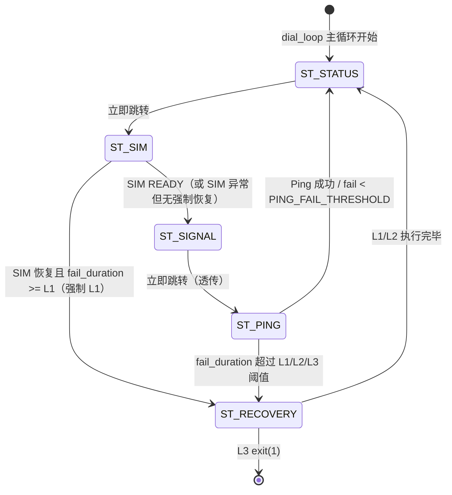
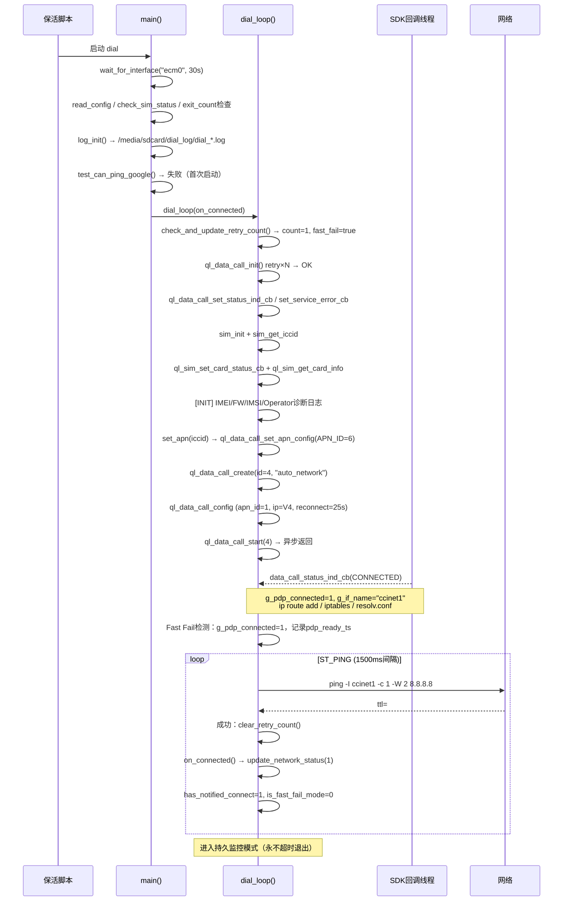
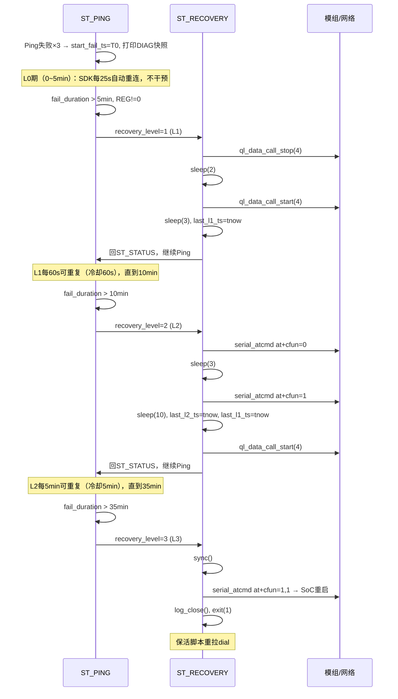
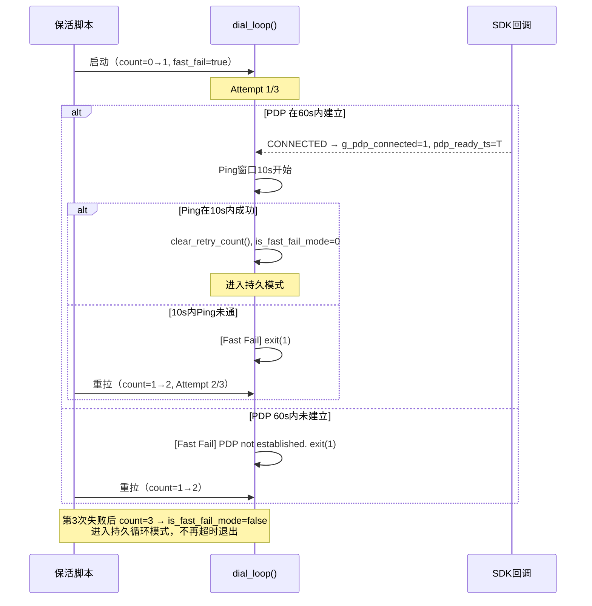

# open_dial 源码深度分析文档

> **版本基准**：HEAD（v1.27.3，MAIN=1 SUB=27 PATCH=3）  
> **最后更新**：2026-05-19（覆盖 v1.26 → v1.27.3 全部变更）  
> **目标平台**：Quectel EC200A / EG25（OpenCPU 模式，aarch64 嵌入式 Linux）  
> **语言**：C（Quectel ql-sdk API）  

---

## 目录

1. [全局架构概览](#1-全局架构概览)
2. [初始化流程](#2-初始化流程)
3. [主状态机](#3-主状态机)
4. [网络检测与恢复机制](#4-网络检测与恢复机制)
5. [各模块详细分析](#5-各模块详细分析)
6. [IPC / 通信协议](#6-ipc--通信协议)
7. [定时器与线程模型](#7-定时器与线程模型)
8. [时序图](#8-时序图)
9. [日志系统](#9-日志系统)
10. [配置系统](#10-配置系统)
11. [已知限制与风险](#11-已知限制与风险)

---

## 1. 全局架构概览

### 1.1 项目定位

`open_dial` 是运行在 Quectel 模组 Linux 系统上的蜂窝网络自动拨号守护进程，核心目标是确保蜂窝数据连接的持续可用性：在 PDP 异常、信号波动、SIM 瞬断、模组内部错误等各种条件下自动检测并分级恢复。

**硬件背景**：EC200A 是 OpenCPU 模式，AP（Cortex-A7，运行 Linux）和 CP（Cortex-R5，运行蜂窝协议栈）封装在同一颗 ASR1803 芯片内。`AT+CFUN=1,1` 复位 CP 等于整颗 SoC 复位，Linux 必然随之重启。

### 1.2 目录结构

```
open_dial/
├── dial.c              # 程序入口 + 主状态机 + Fast Retry + CFUN 控制（1958 行，v1.27.3）
├── dial.h              # dial_mng_t 结构体、状态枚举定义
├── _public.h           # 全局头文件汇总（统一包含所有依赖）
├── misc.c              # 工具函数（AT 命令、进程管理、网络状态文件）
├── misc.h
├── logger_sd.c         # SD 卡日志（自动降级到控制台）
├── logger_sd.h
├── Makefile            # 交叉编译配置（aarch64-linux-gnu-gcc）
├── README.md           # 版本历史
│
├── apn/
│   ├── apn.c           # JSON 格式 APN 数据库加载 + ICCID 精确匹配
│   └── apn.h           # apn_obj_t 结构体、APN_JSON_NAME 宏定义
│
├── data_call/
│   ├── data_call.c     # SDK 连接状态回调 + 路由/DNS/NAT 配置（含 IDLE 处理）
│   └── data_call.h     # DIAL_CALL_NAME 定义、g_if_name/g_pdp_connected 声明
│
├── nw/
│   ├── nw.c            # 网络状态查询（信号/注册/RX 统计）
│   └── nw.h
│
├── sim/
│   ├── sim.c           # SIM 初始化 + ICCID/IMSI 读取
│   └── sim.h
│
├── reboot_conf/
│   ├── dial_reboot_conf.c  # 启动配置持久化 + 前置条件检测
│   └── dial_reboot_conf.h
│
├── cc_deque/           # 双端队列实现（主流程未使用）
│   ├── cc_deque.c / cc_deque.h
│   └── cc_common.c / cc_common.h
│
└── test_utils/         # 调试菜单框架
    ├── test_utils.c
    └── test_utils.h
```

### 1.3 模块依赖关系

```
dial.c（核心）
  ├─ misc.c          AT 命令执行、进程检测、网络状态文件写入
  ├─ logger_sd.c     日志初始化和写入
  ├─ reboot_conf/    启动配置读写、CFUN 限频保护
  ├─ apn/apn.c       APN 数据库加载和 ICCID 匹配
  ├─ sim/sim.c       SIM 初始化、ICCID 读取
  ├─ data_call/      连接状态回调、路由/NAT/DNS 设置
  └─ nw/nw.c         信号强度、注册状态（主流程辅助用）
```

### 1.4 技术栈

| 类别 | 内容 |
|------|------|
| 编译器 | `aarch64-linux-gnu-gcc`（交叉编译） |
| SDK | Quectel ql-sdk（`ql_data_call`、`ql_sim`、`ql_nw`） |
| 第三方库 | `json-c`（APN JSON 解析） |
| 外部工具 | `serial_atcmd`、`ping`、`ip`、`iptables`、`pgrep`、`dmesg` |
| 标准库 | POSIX（`ioctl`、`statvfs`、`sigaction`、`popen`、`clock_gettime`） |

---

## 2. 初始化流程

### 2.1 main() 线性初始化序列

`main()` 按固定顺序串行执行以下 9 个步骤，任何关键步骤失败均 `exit(-1)` 或继续到 `dial_loop()`。

```
main()
  │
  ├─① wait_for_interface("ecm0", 30)
  │   ioctl(SIOCGIFINDEX) 每秒轮询，超时 30s → return -1（保活脚本重拉）
  │
  ├─② read_config() + check_sim_status() + get_signal_csq()
  │   读取 /usrdata/dial_config.txt 持久化配置；
  │   调用 sim_init() + sim_get_iccid()（启动时一次性读 SIM）
  │
  ├─③ check_pid_running(-1)
  │   pgrep -x dial 计数 >= 2 → 退出（单实例保证）
  │
  ├─④ SIGCHLD 注册
  │   sigaction：SA_RESTART|SA_NOCLDSTOP，回收子进程防僵尸
  │
  ├─⑤ exit_count 检查
  │   read_exit_count() 从 /tmp/exit_count.txt 读取；
  │   count >= 20 → 重置计数，调用 restart_cfun()（AT+CFUN=0→sleep(5)→AT+CFUN=1）
  │
  ├─⑥ 版本日志
  │   ALOGI 打印 v1.27.3；
  │   write_version_log("/tmp/dial_version", 1, 27, 3)
  │
  ├─⑦ log_init()
  │   检测 SD 卡挂载状态 + 剩余空间 >= 500MB；
  │   成功则创建 /media/sdcard/dial_log/dial_YYYYMMDD_HHMMSS.log；
  │   失败则仅控制台输出
  │
  ├─⑧ SIGINT 注册
  │   signal(SIGINT, sig_handler)：回调仅设 g_sigint_received=1
  │
  ├─⑨ test_can_ping_google(NULL)
  │   ├─ 成功：进入"已联网保活监控"循环
  │   │   每 6s ping 一次，连续失败 10 次 → break 跳出，进入 dial_loop
  │   └─ 失败：直接进入 dial_loop
  │
  └─ dial_loop(on_network_connected, NULL)
```

### 2.2 dial_loop() 初始化序列

`dial_loop()` 是实际拨号与监控的核心函数，进入后先执行一次性初始化，再进入永不退出的主循环（Fast Retry 模式除外）。

```
dial_loop()
  │
  ├─① check_and_update_retry_count()
  │   读取 /tmp/dial_retry_count；
  │   count < 3 → is_fast_fail_mode=true，count++，写回文件；
  │   count >= 3 → is_fast_fail_mode=false（持久循环模式）
  │
  ├─② ql_data_call_init()
  │   最多重试 200 次，每次 100ms；
  │   每 20 次（约 2s）打印进度日志（防 20s 静默）；
  │   返回 -1001 表示底层服务未就绪，需继续重试
  │
  ├─③ ql_data_call_set_status_ind_cb(data_call_status_ind_cb)
  │   注册 PDP 连接状态变化回调
  │
  ├─④ ql_data_call_set_service_error_cb(data_call_service_error_cb)
  │   注册 SDK CP 侧服务崩溃回调
  │
  ├─⑤ sim_init() + sim_get_iccid()
  │   初始化 SIM 服务；读取 ICCID（最多 20 字符）
  │
  ├─⑥ ql_sim_set_card_status_cb(sim_card_status_cb)
  │   注册 SIM 状态变化回调，替代持续 AT+CPIN? 轮询；
  │   随后调用 ql_sim_get_card_info(QL_SIM_SLOT_1) 主动查询初始状态，
  │   写入 g_sim_app_state / g_sim_app_ready
  │
  ├─⑦ 诊断信息日志（[INIT] 系列）
  │   get_imei_safe (AT+CGSN)
  │   get_cgmr_safe (AT+QGMR，Quectel 私有固件版本命令)
  │   get_csub_safe (AT+CSUB SubEdition)
  │   get_imsi_at_safe (AT+CIMI)
  │   get_operator_safe (AT+COPS?)
  │   get_cfun_safe (AT+CFUN?)
  │   get_cgdcont_safe (AT+CGDCONT?)
  │   get_nw_mode_pref_safe (AT+QNWPREFCFG="mode_pref")
  │
  ├─⑧ set_apn(iccid)
  │   加载 /usr/dial/apn.json；strcmp 精确匹配 ICCID；
  │   命中 → ql_data_call_set_apn_config(APN_ID=6, cfg)；
  │   未命中 → 使用默认 APN "apnpublic"
  │
  ├─⑨ ql_data_call_create(call_id=4, "auto_network", 0)
  │
  ├─⑩ ql_data_call_config(call_id=4, p_cfg)
  │   apn_id=1, ip_version=QL_NET_IP_VER_V4(0), reconnect_mode=NORMAL,
  │   reconnect_interval=[25, 0]（SDK 底层每 25s 自动重连）
  │
  └─⑪ ql_data_call_start(call_id=4)
      异步发起拨号，立即返回；PDP 建立结果由 data_call_status_ind_cb 回调通知
```

---

## 3. 主状态机

### 3.1 状态枚举

```c
enum Stage { ST_STATUS = 0, ST_SIM, ST_SIGNAL, ST_PING, ST_RECOVERY };
```

### 3.2 状态流转图



### 3.3 各状态详细行为

#### ST_STATUS

流转起点，每轮循环进入后立即跳转 ST_SIM，不执行任何实际操作。

#### ST_SIM（间隔 800ms）

SIM 状态检测，优先使用 SDK 回调标志：

```c
if (g_sim_app_ready >= 0) {
    // 优先路径：使用 sim_card_status_cb 回调写入的状态
    sim_ready = (g_sim_app_ready == 1);
    sim_str   = sim_app_state_str(g_sim_app_state);
} else {
    // 降级路径：回调未初始化，调用 AT+CPIN? 一次性查询
    get_cpin_status_str(sim_str_buf, sizeof(sim_str_buf));
    sim_ready = (strcmp(sim_str_buf, "READY") == 0);
}
```

**SIM 异常处理流程：**

1. SIM 由 READY 变为非 READY（`has_notified_connect` 为真时）：
   - 打印 `[ERROR] SIM Card disconnected during runtime`
   - 执行 AT 层快照：`AT+QSIMSTAT?`（判断硬件脱离 vs 软件重置）、`AT+CEREG?`
   - 执行 dmesg 快照：`grep -iE 'sim|uicc|usim'`
   - 清零 `has_notified_connect`、`ping_fail_count`；设置 `sim_error_active=1`
2. 若 `start_fail_ts == 0`，设置 `start_fail_ts = tnow`（SIM 故障启动计时）
3. SIM 从非 READY 恢复为 READY（`sim_error_active` 为真时）：
   - 计算断卡时长并打印 `[INFO] SIM recovered`
   - 在恢复时刻抓取 `AT+QSIMSTAT?` 和 dmesg（SIM 重置完成后才有效）
   - 若 `fail_duration >= LEVEL1_TIMEOUT`：设 `recovery_level=1`，跳 ST_RECOVERY（强制 L1）
   - 若 `fail_duration < LEVEL1_TIMEOUT`：打印提示，等待 SDK 自动重连
   - 清零 `sim_error_active`

SIM 检测完成后，无论 SIM 是否正常，均流转至 ST_SIGNAL。

#### ST_SIGNAL（间隔 800ms，与 ST_SIM 共用 next_ts）

当前版本仅透传，立即流转至 ST_PING。信号强度值由 30s 心跳通过 `get_csq_value_safe()` 独立获取。

#### ST_PING（间隔 1500ms）

调用 `test_can_ping_google(NULL)` 发送 ICMP 包检测连通性。

**Ping 成功路径：**
- 清零 `ping_fail_count`、`start_fail_ts`、`diag_snap_done`、`last_l1_ts`、`recovery_level`
- 若 `start_fail_ts` 原来非零，打印恢复日志（含断网时长和恢复阶段）
- 调用 `clear_retry_count()`（删除 `/tmp/dial_retry_count`）
- 首次成功且 `!has_notified_connect`：调用 `on_connected` 回调，设 `has_notified_connect=1`
- 退出 Fast Fail 模式（`is_fast_fail_mode=0`）

**Ping 失败路径：**
- `ping_fail_count++`；未达 `PING_FAIL_THRESHOLD(3)` → 跳回 ST_STATUS（抖动过滤）
- 达到阈值后首次失败：设 `start_fail_ts=tnow`，打印 SDK 自动重连开始日志，执行 DIAG 快照（一次性）
- 计算 `fail_duration = tnow - start_fail_ts`，按阈值判断恢复等级（见第 4 章）

#### ST_RECOVERY

统一执行恢复动作，按 `recovery_level` 分支：L1/L2/L3（见第 4 章）。执行完毕后重置 `has_notified_connect=0`，跳回 ST_STATUS。

### 3.4 主循环辅助逻辑（每轮执行）

每次 `while(1)` 迭代开始时，在状态机之前执行：

| 检测项 | 触发条件 | 操作 |
|--------|---------|------|
| SIGINT 检测 | `g_sigint_received == 1` | 释放 `p_dial_mng`，`log_close()`，`exit(0)` |
| SDK 服务崩溃 | `g_sdk_service_error == 1` | 打印 `[FATAL]` 日志，清零标志（当前版本 exit 逻辑注释，仅记录） |
| Fast Fail 检测 | `is_fast_fail_mode && !has_notified_connect` | 见 4.5 节 |
| 30s 心跳 | `tnow > next_heartbeat_ts` | 见第 9 章 |
| 5min 扩展心跳 | `has_notified_connect && tnow >= next_ext_heartbeat_ts` | 见第 9 章 |

循环末尾 `usleep(50 * 1000)`（50ms 轮询周期）。

---

## 4. 网络检测与恢复机制

### 4.1 Ping 检测实现

```c
bool test_can_ping_google(const char *interface_name)
```

- 通过 `popen` 执行 `ping -c 1 -W 2 8.8.8.8`（可选 `-I <if>`）
- 逐行读取输出，检测是否包含 `"ttl="` 或 `"TTL="`（不依赖 `system()` 返回值，免疫 SIGCHLD 干扰）
- 读到 TTL 行立即返回 `true`，`pclose()` 返回值被主动忽略

Ping 目标：硬编码 `8.8.8.8`，接口名为空时不绑定接口。

### 4.2 Ping 抖动过滤

`PING_FAIL_THRESHOLD = 3`：连续失败次数达到此阈值才启动故障计时 `start_fail_ts`。前 2 次失败仅累计计数，不触发任何恢复操作。

### 4.3 分级恢复阈值

| 等级 | 阈值 | 触发条件 | 操作 |
|------|------|---------|------|
| L0（SDK 期） | 0 ~ 5min | `fail_duration < LEVEL1_TIMEOUT` | SDK 底层每 25s 自动重连，应用层不干预 |
| L1（软重拨） | 5min | `fail_duration > LEVEL1_TIMEOUT && REG != 0` | `ql_data_call_stop` → sleep(2) → `ql_data_call_start` |
| L2（射频重置） | 10min 或 REG=0 超 5min | 见下方 L2 触发条件 | `AT+CFUN=0` → sleep(3) → `AT+CFUN=1` → sleep(10) → start |
| L3（模块重启） | 35min | `fail_duration > LEVEL3_TIMEOUT` | `AT+CFUN=1,1` → sleep(20) → `exit(1)` |

常量定义（`dial_loop()` 局部变量）：
```c
const uint64_t LEVEL1_TIMEOUT = 5  * 60 * 1000;  // 5分钟
const uint64_t LEVEL2_TIMEOUT = 10 * 60 * 1000;  // 10分钟
const uint64_t LEVEL3_TIMEOUT = 35 * 60 * 1000;  // 35分钟
```

### 4.4 L1 恢复详细逻辑

**触发条件**：`fail_duration > LEVEL1_TIMEOUT && g_last_reg_stat != 0 && (tnow - last_l1_ts > 60s)`

- REG=0（网络注册丢失）时跳过 L1，原因：实测 REG=0 时 `ql_data_call_start` 持续返回 -1001，软重拨无效
- 冷却期：60s（防止每 1.5s Ping 周期重复触发）
- Start 成功：更新 `last_l1_ts`，sleep(3) 等待重连
- Start 失败（含 -1001）：仅更新 `last_l1_ts`，不更新 `last_l2_ts`（不影响 L2 冷却）

**SIM 恢复触发的强制 L1（独立路径）**：  
SIM 从故障恢复且 `fail_duration >= LEVEL1_TIMEOUT` 时，ST_SIM 直接设 `recovery_level=1` 跳 ST_RECOVERY，不受 `g_last_reg_stat` 条件限制。

### 4.5 L2 恢复详细逻辑

**触发条件**：

```c
// 路径A：正常超时
fail_duration > LEVEL2_TIMEOUT

// 路径B：REG=0 且超过 L1 窗口（跳过 L1 直触 L2）
g_last_reg_stat == 0 && fail_duration > LEVEL1_TIMEOUT
```

满足任一路径后，检查冷却期：

```c
uint64_t l2_cooldown = (g_last_reg_stat == 0) ? (90 * 1000) : (5 * 60 * 1000);
if (tnow - last_l2_ts > l2_cooldown) { recovery_level = 2; }
```

- REG=0 时冷却期 90s，注册正常时冷却期 5min
- 执行时同步更新 `last_l1_ts`（L2 后 60s 内抑制 L1，避免 L1 打断 L2 恢复窗口）
- Start 返回 -1013（already connected）视为 SDK 已自动重连成功

### 4.6 L3 恢复详细逻辑

**触发条件**：`fail_duration > LEVEL3_TIMEOUT`，无冷却期（执行后进程退出）

执行序列：
1. `sync()`：同步文件系统，确保日志落盘
2. `system("serial_atcmd at+cfun=1,1")`：触发 CP 软重启，导致整颗 ASR1803 SoC 重启，Linux 随之重启
3. `sleep(20)`：等待重启（实际不会执行到，因为 Linux 已重启）
4. `log_close(); exit(1)`：让保活脚本重拉进程

### 4.7 DIAG 快照机制

故障计时首次启动时（`diag_snap_done` 从 0 → 1），执行一次 6 字段诊断快照：

| AT 命令 | 字段 | 格式 |
|---------|------|------|
| `AT+CESQ` | RSRP/RSRQ | `rsrp_raw-141` / `rsrq_raw/2-19` (dBm/dB) |
| `AT+CREG?` | CID（服务小区） | 第 3/4 对引号间的十六进制值 |
| `AT+CGPADDR` | 分配 IP | 提取第一个 context 的 IP |
| `AT+QTEMP` | 模块温度 | 提取引号对内的数值 |
| `AT+CEER` | 错误原因 | 去掉 `+CEER:` 前缀 |
| `AT+CGACT?` | PDP 激活状态 | 多 context 拼接 |

同一故障周期内只打一次 DIAG（`diag_snap_done` 标志保护）；Ping 成功时清零。

### 4.8 Fast Retry 机制

Fast Retry 在前 3 次启动内生效，通过 `/tmp/dial_retry_count` 持久化计数。

**两个独立超时窗口：**

| 窗口 | 触发条件 | 时长 |
|------|---------|------|
| PDP 等待超时 | PDP 尚未建立 | 60s（`PDP_WAIT_TIMEOUT_MS`） |
| Ping 成功窗口 | PDP 已建立，从 `pdp_ready_ts` 计时 | 10s（`FAST_FAIL_TIMEOUT_MS`） |

**关键实现细节**：
- `pdp_ready_ts` 在 `g_pdp_connected` 首次为真时记录（而非 dial_loop 入口），避免初始化耗时导致误判
- 若 `g_pdp_connected` 中途归零（DISCONNECTED 回调），`pdp_ready_ts` 同步清零，下次 PDP 重新建立时重新计时
- Ping 成功 → `is_fast_fail_mode=0`，退出快速模式，不再执行超时退出逻辑

```
count=0 (首次) → Attempt 1/3, is_fast_fail_mode=true
  ├─ PDP 建立 < 60s，Ping 成功 < 10s → clear_retry_count()，持久模式
  └─ 超时 → exit(1)

count=1 → Attempt 2/3（同上）
count=2 → Attempt 3/3（同上）
count>=3 → is_fast_fail_mode=false，持久循环模式（永不超时退出）
```

### 4.9 restart_cfun() 保护逻辑

`main()` 检测到 `exit_count >= 20` 时调用：

```c
void restart_cfun()  // dial.c 内定义
{
    count = read_cfun_count();       // 读 /tmp/cfun_count.txt
    if (count >= MAX_CALLS(10)) return;  // 上限 10 次

    double current_time = get_system_uptime();  // 读 /proc/uptime
    double last_call = read_last_call_time();   // 读 /tmp/cfun_last_call.txt
    if (current_time - last_call < MIN_INTERVAL(600)) return;  // 间隔 < 600s 不执行

    Ql_SendAT("AT+CFUN=0");
    sleep(5);
    Ql_SendAT("AT+CFUN=1");

    write_cfun_count(count + 1);
    write_last_call_time(current_time);
}
```

---

## 5. 各模块详细分析

### 5.1 dial.c

#### 职责

程序入口 + 主状态机 + Fast Retry + CFUN 保护控制，**1958 行**（v1.27.3）。

#### 关键全局/静态变量

```c
// 文件级静态变量
static int exit_count = 0;                        // 异常退出计数
static dial_mng_t *p_dial_mng = NULL;             // 拨号管理结构体指针
static volatile sig_atomic_t g_sigint_received = 0; // SIGINT 标志

// dial_loop 内部静态变量（回调写入，主循环读取）
static volatile int g_sim_app_ready = -1;   // -1=回调未初始化, 0=非READY, 1=READY
static volatile int g_sim_app_state = 0;    // QL_SIM_APP_STATE_E 整数值（日志用）
static volatile int g_sdk_service_error = 0; // SDK CP 侧服务崩溃标志

// 恢复策略开关
int enable_policy_recovery = 1;  // 0=禁用应用层恢复，仅依赖 SDK 底层重连
static int g_last_reg_stat = -1; // 心跳缓存的最新 REG 状态，供 L1 判断

// dial_loop 内部局部变量（核心状态）
enum Stage stage;           // 当前状态机阶段
uint64_t start_fail_ts;     // 首次故障时间戳（ms，0=无故障）
uint64_t last_l2_ts;        // 上次 L2 执行时间（冷却计时）
uint64_t last_l1_ts;        // 上次 L1 尝试时间（节流计时）
int recovery_level;         // 当前恢复等级（1/2/3）
int has_notified_connect;   // 是否已触发连接成功回调
int is_fast_fail_mode;      // 是否处于 Fast Retry 模式
int ping_fail_count;        // 连续 Ping 失败次数（抖动过滤）
int sim_error_active;       // SIM 当前处于故障状态
int diag_snap_done;         // 当前故障周期是否已打 DIAG 快照
uint64_t pdp_ready_ts;      // PDP 建立时刻（Fast Fail Ping 窗口基准）
```

#### SDK 回调

| 回调 | 注册 API | 触发线程 | 操作 |
|------|---------|---------|------|
| `data_call_status_ind_cb` | `ql_data_call_set_status_ind_cb` | SDK 内部线程 | 按 call_name 过滤，处理 PDP 状态变化 |
| `data_call_service_error_cb` | `ql_data_call_set_service_error_cb` | SDK 内部线程 | 置位 `g_sdk_service_error=1` |
| `sim_card_status_cb` | `ql_sim_set_card_status_cb` | SDK 内部线程 | 写 `g_sim_app_ready`、`g_sim_app_state` |

#### 内部辅助函数（dial.c 文件域）

| 函数 | 说明 |
|------|------|
| `exec_cmd_safe(cmd, buf, size)` | **主流程 AT 查询的实际执行器**：`popen` + `fgets` 单行读取，填入调用方 buffer，去除尾部 `\n`，`pclose`。所有 `get_*_safe()` 函数均调用此函数，而非 misc.c 的 `executeATCommand()` |
| `get_cpu_temp()` | 读 `/sys/class/thermal/thermal_zone0/temp`，原始值除以 1000 得 °C，失败返回 -1 |
| `get_csq_value_safe()` | 解析 `AT+CSQ` 响应，提取 rssi（0-31，99=未知） |
| `get_cereg_status_safe()` | 解析 `AT+CEREG?`，提取第一个逗号后的 stat 值；多行扫描版（v1.27） |
| `get_qiact_status_safe(ip_buf, len)` | 查询 `AT+QIACT?`，匹配 `,1,1,` 判断 PDP 是否激活，可选提取 IP 字符串 |
| `get_cpin_status_str(out, len)` | 解析 `AT+CPIN?`，提取状态字符串（READY/UNKNOWN 等），失败时返回 "ERROR" |
| `get_imei_safe(out, len)` | 解析 `AT+CGSN`，提取 14-16 位纯数字 IMEI |
| `get_imsi_at_safe(out, len)` | 解析 `AT+CIMI`，提取 14-16 位纯数字 IMSI |
| `get_operator_safe(out, len)` | 解析 `AT+COPS?`，提取含 `+COPS:` 的完整行 |
| `get_cesq_safe(out, len)` | 解析 `AT+CESQ`，提取含 `+CESQ:` 的完整行（用于扩展心跳）|
| `get_creg_safe(out, len)` | 解析 `AT+CREG?`，提取含 `+CREG:` 的完整行（含小区 CID）|
| `get_cfun_safe(out, len)` | 解析 `AT+CFUN?`，提取 `+CFUN:` 行（初始化诊断用）|
| `get_cgmr_safe(out, len)` | 解析 `AT+QGMR`，跳过空行/AT/OK/ERROR，取第一条非空内容行（固件版本）|
| `get_csub_safe(out, len)` | 解析 `AT+CSUB`，跳过前缀 "SubEdition:"，取版本号（如 V06）|
| `get_cgdcont_safe(out, len)` | 解析 `AT+CGDCONT?`，多 context 拼接（含竖线分隔符），验证 APN 写入情况 |
| `get_nw_mode_pref_safe(out, len)` | 解析 `AT+QNWPREFCFG="mode_pref"`，提取 `+QNWPREFCFG:` 行 |
| `get_cgpaddr_safe(out, len)` | 解析 `AT+CGPADDR`，多 context 拼接，提取已分配 IP |
| `get_qtemp_safe(out, len)` | 解析 `AT+QTEMP`，提取 `+QTEMP:` 行（模组温度，DIAG 快照用）|
| `get_ceer_safe(out, len)` | 解析 `AT+CEER`，提取最近错误原因（恢复前快照）|
| `get_cgact_safe(out, len)` | 解析 `AT+CGACT?`，多 context 拼接（恢复前快照）|
| `build_ext_line(buf, len, qcsq, cell, ip, temp, ceer, cgact)` | 将 6 个 AT 查询结果格式化为 `KEY:val \| KEY:val` 诊断行；`ceer`/`cgact` 传 NULL 时跳过对应字段（5min 心跳不含这两项） |
| `diag_snapshot(label)` | 检查 `/media/sdcard` 挂载后创建 `/media/sdcard/diag/` 目录，执行 `dmesg > dmesg_<label>_<ts>.log` 和 `logcat -d > logcat_<label>_<ts>.log`；故障确认时以 "fault"，网络恢复时以 "recovery" 为 label 调用 |
| `check_and_update_retry_count()` | 读 `/tmp/dial_retry_count`，count < 3 则自增写回返回 count；count >= 3 返回 -1（进持久模式）；写回时 `fsync()` 确保落盘 |
| `clear_retry_count()` | 成功联网后 `unlink("/tmp/dial_retry_count")` |
| `stage_to_str(s)` | 状态枚举转字符串，供日志使用（`__attribute__((unused))`，调试期使用） |
| `sim_app_state_str(s)` | SDK SIM app state 枚举转字符串，覆盖所有 QL_SIM_APP_STATE_E 枚举值 |

**注意**：`stop_cfun()` 和 `start_cfun()` 也定义在 dial.c，分别执行 `AT+CFUN=0` / `AT+CFUN=1`，带与 `restart_cfun()` 相同的调用次数上限（10 次）和间隔保护（600s）。主流程当前**未调用**这两个函数，属于备用接口。

**`g_dev_name[32] = "ccinet0"`**：全局变量，存储默认网卡名，当前主流程实际使用 `g_if_name`（由 SDK 回调写入），`g_dev_name` 未被主流程引用。

#### 时间参数汇总

| 常量/变量 | 值 | 说明 |
|----------|----|------|
| `PING_INTERVAL_MS` | 1500ms | Ping 检测间隔 |
| `SIM_INTERVAL_MS` | 800ms | SIM 状态检测间隔 |
| `SIG_INTERVAL_MS` | 800ms | 信号检测间隔（透传） |
| `HEARTBEAT_INTERVAL_MS` | 30000ms | 30s 基本心跳间隔 |
| 扩展心跳间隔 | 5min | 首次成功连接后启动 |
| `LEVEL1_TIMEOUT` | 300000ms（5min） | L1 软重拨触发阈值 |
| `LEVEL2_TIMEOUT` | 600000ms（10min） | L2 射频重置触发阈值 |
| `LEVEL3_TIMEOUT` | 2100000ms（35min） | L3 模块重启触发阈值 |
| L1 冷却期 | 60s | L1 节流间隔 |
| L2 冷却期（正常） | 300s（5min） | L2 节流间隔（REG 正常时） |
| L2 冷却期（REG=0） | 90s | L2 节流间隔（注册丢失时） |
| `FAST_FAIL_TIMEOUT_MS` | 10000ms | PDP 建立后 Ping 窗口 |
| `PDP_WAIT_TIMEOUT_MS` | 60000ms | PDP 建立最长等待 |
| SDK `reconnect_interval` | 25s | SDK 底层自动重连间隔 |
| `PING_FAIL_THRESHOLD` | 3 | 连续失败触发故障计时的次数 |
| 主循环轮询周期 | 50ms | `usleep(50 * 1000)` |

---

### 5.2 data_call/data_call.c

#### 职责

SDK 连接状态回调处理中心，负责：连接建立时配置路由/NAT/DNS，连接断开时清理；同时处理 SDK 的 IDLE 伪断开状态。

#### 关键变量

```c
int  g_callid = DATA_CALL_ID_PUBLIC;  // 当前 call_id（参考用）
char g_if_name[32] = {0};             // 当前网卡接口名（如 "ccinet1"）
volatile int g_pdp_connected = 0;     // PDP 建立状态（回调写入，主循环读取）
```

#### data_call_status_ind_cb 处理逻辑

回调按 `call_name` 过滤（`DIAL_CALL_NAME = "auto_network"`），忽略其他 call_name 的事件。SDK 重拨后 call_id 会变，call_name 整个进程生命周期内不变。

**CONNECTED 状态处理：**

```
g_pdp_connected = 1
update_network_status(1)
system("echo 0 > /tmp/dial_Status")
strncpy(g_if_name, p_msg->device, ...)

防御性预清理（处理崩溃/重启后的路由残留）：
  ip route del default dev <device>      ← 指定接口精确删除
  ip -6 route del default dev <device>
  iptables loop(-D POSTROUTING -o <dev> MASQUERADE, max 10次)  ← 清到无为止

IPv4 路由/NAT/DNS（has_addr 时）：
  ip route add default via <gateway> dev <device>
  iptables -t nat -A POSTROUTING -o <device> -j MASQUERADE
  fopen("/tmp/resolv_v4.conf", "w")
    fprintf: "nameserver <dnsp>\n"（LF，非 CRLF）
    fprintf: "nameserver <dnss>\n"（if non-empty）
  fclose
  cat /tmp/resolv_v4.conf >> /etc/resolv.conf（先 echo ""，再 cat）

IPv6 路由/DNS（has_addr6 时，同 IPv4 路径但用 -6 命令）
```

**IDLE（was CONNECTED）状态处理：**

`AT+CFUN=0/4` 关闭射频时，SDK 发送 `CONNECTED → IDLE` 而非 DISCONNECTED 事件。此状态与 DISCONNECTED 执行相同清理逻辑：

```
g_pdp_connected = 0
update_network_status(0)
system("echo 1 > /tmp/dial_Status")
ip route del / ip -6 route del / iptables loop(-D)
g_if_name[0] = '\0'
unlink("/tmp/resolv_v4.conf")
unlink("/tmp/resolv_v6.conf")
```

**DISCONNECTED 状态处理：**

与 IDLE 逻辑完全相同，清理路由、NAT、DNS 临时文件，重置 `g_if_name`。

#### flow_monitor_task

历史遗留函数，读取 `/sys/class/net/<if>/statistics/rx_packets` 判断 120s 内是否有收包。当前版本 `dial_loop()` 主流程未调用。

---

### 5.3 apn/apn.c

#### 职责

从 `/usr/dial/apn.json` 加载 APN 数据库，按 SIM ICCID 精确匹配运营商配置。

#### 文件结构说明

`apn/apn.c` 是一个混合文件（368 行），前 187 行为 Quectel SDK 示例代码遗留的 data call 测试工具函数（`item_ql_data_call_init`、`dump_data_call_config`、`dump_apn_cfg`、`apn_set` 等），这些函数在主流程中**均未调用**。第 189 行起才是主流程使用的 APN 数据库功能（`apn_load_from_json`、`set_apn`）。

#### apn_obj_t 结构体

```c
typedef struct {
    char iccid[32];      // ICCID（精确匹配键）
    char apn[32];        // APN 名称
    char usr_name[32];   // 用户名（可为空）
    char pwd[32];        // 密码（可为空）
} apn_obj_t;
```

#### apn.json 格式

```json
{
  "apn": [
    { "supplier": "中国移动", "iccid": "89860012345678901234", "apn": "cmnet", "usrname": "", "pwd": "" }
  ]
}
```

#### set_apn() 流程

1. 构造路径 `/usr/dial/apn.json`，调用 `apn_load_from_json()` 解析
2. 遍历数组，`strcmp(entry.iccid, iccid)` 精确匹配（区分大小写）
3. 命中：调用 `ql_data_call_set_apn_config(DATA_CALL_APN_PUBLIC=6, &cfg)`
4. 未命中 / JSON 加载失败：使用默认 APN `"apnpublic"`，同样调用 `ql_data_call_set_apn_config`

#### apn_load_from_json() 内存安全

- `malloc(file_size + 1)` 读取文件后补 `'\0'`，防止 `json_tokener_parse` 越界
- 字段读取使用 `strncpy(..., sizeof(field) - 1)` + 手动补 `'\0'`
- JSON 字段使用 `borrowed reference`，不调用 `json_object_put`
- 根对象在函数末尾 `json_object_put(obj)` 释放

---

### 5.4 nw/nw.c

#### 真实定位

nw.c 是一个**测试工具模块**，源自 Quectel SDK 示例代码，包含 1200+ 行 `item_ql_nw_*` 测试菜单函数（`item_ql_nw_init`、`item_ql_nw_network_scan`、`item_ql_nw_set_pref_nwmode_roaming` 等）以及完整的 SDK 事件回调注册框架（语音注册、数据注册、信号强度变化、小区接入状态、NITZ 时间、气象告警、ETWS 告警、网络扫描异步回调）。这些回调和函数在主流程中**均未注册、均未调用**。

#### 主流程唯一实际使用的函数

| 函数 | 调用位置 | 说明 |
|------|---------|------|
| `nw_get_if_statistics_rx_packets(p_rx, if_name)` | `flow_monitor_task()` | 读 `/sys/class/net/<if>/statistics/rx_packets`，`flow_monitor_task` 本身也未被主流程调用 |

#### 导出但主流程未使用的函数

| 函数 | 实际实现 |
|------|---------|
| `nw_get_signal_strength()` | 调用 `ql_nw_get_signal_strength()` 后仅 `printf` LTE 信号信息，无返回值，无文件写入 |
| `nw_get_data_reg_status()` | 调用 `ql_nw_get_data_reg_status()` 后仅 `printf` 注册状态，无返回值 |
| `nw_get_status(call_id)` | 调用 `ql_data_call_get_status()` 后仅 `printf`，无返回值 |
| `nw_mark_network_status(status)` | 写 `/tmp/network_status`（已废弃，主流程统一用 misc.c 的 `update_network_status()`） |
| `get_signal_strength(level)` | SDK 信号强度等级查询，写 `/tmp/network_csq`，主流程未调用 |

心跳日志中的 CSQ 值通过 dial.c 内部的 `get_csq_value_safe()` 直接解析 `AT+CSQ` 响应获取；REG 状态通过 `get_cereg_status_safe()` 直接解析 `AT+CEREG?` 响应获取，两者均不经过 nw.c。

---

### 5.5 sim/sim.c

#### 职责

对 `ql_sim` SDK API 的简单封装，提供 SIM 初始化和 ICCID/IMSI 读取。

#### 实际实现的函数

```c
int sim_init(void);             // ql_sim_init() 封装，失败返回 -1
int sim_deinit(void);           // ql_sim_deinit() 封装，主流程未调用
int sim_get_iccid(char *iccid); // 固定使用 QL_SIM_SLOT_1
int sim_get_imsi(char *imsi);   // 固定使用 QL_SIM_SLOT_1, QL_SIM_APP_TYPE_UNKNOWN
```

#### sim.h 中声明但 sim.c 中未实现的接口

`sim.h` 还声明了 `sim_op()`、`sim_process()`、`sim_op_handler()` 三个函数及相关的 `sim_mng_t` 结构体和 `sim_op_stat_enu` 枚举，这些是早期状态机风格接口的遗留声明，**sim.c 中无对应实现，主流程也未调用**。

运行时 SIM 状态检测改由 SDK 回调 `sim_card_status_cb` 和 AT+CPIN? 查询完成，`sim.c` 仅用于启动时初始化和 ICCID 读取。

---

### 5.6 misc.c

#### 职责

通用工具函数库，包括 AT 命令执行、进程检测、网络状态文件管理、WiFi 感知。

#### 主流程实际调用的函数

| 函数 | 行为 | 注意事项 |
|------|------|---------|
| `executeATCommand(cmd)` | `popen(cmd)` 执行命令，返回堆分配的 `char*`（`malloc(1)` + `realloc` 增长） | 调用方负责 `free()`；dial.c 内部 AT 查询已改用 `exec_cmd_safe()`，此函数仅被 misc.c 内部遗留代码使用 |
| `check_process(name)` | `pgrep -x <name> \| wc -l`，返回进程数量 | `-x` 精确匹配，防止 `pgrep dial` 匹配 `dialog` 等子串 |
| `update_network_status(status)` | 内部调用 `read_status()` 读当前值，相同则跳过，不同则调用 `write_status()` 写入 `/tmp/network_status` | `read_status()` / `write_status()` 是其内部实现，不对外暴露 |
| `isIdleState()` | 检查 wlan0 是否有 WiFi 客户端（AP/STA 模式），内部用 `runCommand()` / `parseOutput()` | wlan0 不存在时返回 1（视为 idle） |
| `restartNetworkServices()` | 双重 fork 重启 ql_rild/ql_netd | 孙进程被 init 收养，中间进程立即 `_exit(0)`，主进程 `waitpid` 回收 |
| `restart_ql_netd()` | 单层 fork 重启 ql_netd | 子进程不被 init 收养，存在僵尸进程风险 |
| `read_exit_count()` / `write_exit_count()` | 读写 `/tmp/exit_count.txt` | 文件不存在时返回 0 |

#### 遗留函数（存在于 misc.c 但主流程未调用）

以下函数均为历史遗留，主流程中无任何调用路径：

| 函数 | 遗留原因 |
|------|---------|
| `extractSignalValue()` | 早期 CSQ 解析，已被 `get_csq_value_safe()` 替代 |
| `checkSimCardStatus()` | 早期 SIM+网络检查（用 AT+CREG? 而非 AT+CEREG?），已被 SDK 回调替代 |
| `checkCommandSuccess()` | 检查 AT 命令是否返回 OK，已被 `exec_cmd_safe()` 替代 |
| `isModuleOK()` | 发送 `serial_atcmd at` 检查模组响应，未集成进主流程 |
| `runCommand()` / `parseOutput()` | 通用命令执行和输出解析，仅被 `isIdleState()` 内部使用 |
| `log_to_file()` | 早期文件日志，已被 `logger_sd.c` 的 `dial_log()` 替代 |
| `readCallIdFromFile()` / `writeCallIdToFile()` | 读写 `/tmp/callid`，早期 call_id 持久化方案，已废弃 |
| `start_ql_netcall()` / `stop_ql_netcall()` / `restart_ql_netcall()` / `is_ql_netcall_running()` | ql_netcall 进程管理，当前版本未使用此进程 |

---

### 5.7 logger_sd.c

#### 职责

SD 卡日志系统，自动降级：SD 卡不可用时仅控制台输出。

#### log_init() 检测序列

1. 检查 `/proc/mounts` 是否包含挂载点 `/media/sdcard`
2. `statvfs("/media/sdcard")` 检查剩余空间 >= 500MB
3. 等待最多 30s（每秒检查一次，每 5s 打印一次等待日志）
4. 满足条件：`mkdir -p /media/sdcard/dial_log`，创建 `dial_YYYYMMDD_HHMMSS.log`
5. 不满足：`system("echo 000 > /tmp/sdcard_avl")`，仅控制台输出

#### dial_log() 特性

- 同时写 stdout 和文件（使用两次 va_list 遍历）
- 每条日志前缀 `[YYYY-MM-DD HH:MM:SS]`
- 每次写入后立即 `fflush()`，防掉电丢数据
- `log_close()` 写入退出时间戳并 `fclose`

---

### 5.8 reboot_conf/

#### 职责

持久化启动配置，记录开机时间和重启标志，防止循环重启。

#### Config 结构体

```c
typedef struct {
    int uptime;             // 持久化：启动时系统 uptime（秒）
    int restart_flag;       // 持久化：是否已执行重启（0/1）
    int first_disconnect;   // 运行时：首次断网标志
    int signal_strength;    // 运行时：CSQ 值
    int sim_status;         // 运行时：sim_init() 返回值
    int ql_netd_status;     // 运行时：ql_netd 状态
} Config;
Config g_config;
```

持久化路径：`/usrdata/dial_config.txt`，格式 `<uptime>,<restart_flag>\n`。

#### 重启触发逻辑（当前版本实际未运行）

`reboot_conf/` 中定义了完整的重启触发链路：

```
handle_dial_up_down()
  └─ check_pre_conditions()：CSQ > 20 && sim_status >= 0 && ql_netd_status == 0
       └─ 满足 → 检查 g_config.uptime 与当前 uptime 之差是否 > THRESHOLD_TIME(1200s)
            └─ 超过 → perform_reboot()：写 /tmp/system_is_rebooting → sleep(10) → system("reboot")
```

**注意**：`handle_dial_up_down()` 在 `main()` 中已被注释（`// handle_dial_up_down();`），该重启逻辑当前**实际未执行**。`ql_netd_status` 字段在 `g_config` 中始终为 0（初始值，无代码更新），即使启用该路径，前置条件中的 `ql_netd_status == 0` 恒为真。

---

## 6. IPC / 通信协议

### 6.1 /tmp 状态文件接口

| 文件路径 | R/W | 内容 | 创建者 |
|---------|-----|------|-------|
| `/tmp/network_status` | R/W | `1`=已连通，`0`=未连通 | misc.c `update_network_status()` |
| `/tmp/dial_Status` | W | `0`=已拨通，`1`=断开 | data_call.c |
| `/tmp/network_csq` | W | 信号强度等级字符串 | nw.c `get_signal_strength()` |
| `/tmp/dial_version` | W | `Version: 1.27.3\r\n` | dial.c `write_version_log()` |
| `/tmp/dial_retry_count` | R/W | Fast Retry 计数（0-3） | dial.c |
| `/tmp/exit_count.txt` | R/W | 异常退出次数（>= 20 触发 CFUN） | misc.c |
| `/tmp/cfun_count.txt` | R/W | restart_cfun() 调用次数（上限 10） | dial.c |
| `/tmp/cfun_last_call.txt` | R/W | 上次 CFUN 调用的 uptime（秒） | dial.c |
| `/tmp/resolv_v4.conf` | W | IPv4 DNS（拨通生成，断开删除） | data_call.c |
| `/tmp/resolv_v6.conf` | W | IPv6 DNS（同上） | data_call.c |
| `/tmp/sdcard_avl` | W | SD 卡不可用时写 `"000"` | logger_sd.c |
| `/tmp/system_is_rebooting` | W | 重启标志（值 `"1\n"`），`handle_dial_up_down()` 当前已注释，实际不写入 | reboot_conf/ |
| `/tmp/callid` | R/W | 早期 call_id 持久化文件，`readCallIdFromFile()`/`writeCallIdToFile()` 读写，当前主流程未调用 | misc.c（遗留） |
| `/etc/resolv.conf` | W | 系统 DNS（从 resolv_v4/v6.conf 合并） | data_call.c |
| `/usr/dial/apn.json` | R | APN 数据库 | apn/apn.c |
| `/usrdata/dial_config.txt` | R/W | `uptime,restart_flag` | reboot_conf/ |
| `/media/sdcard/dial_log/` | W | SD 卡运行日志目录 | logger_sd.c |
| `/proc/uptime` | R | 系统运行时间 | reboot_conf/, dial.c |
| `/proc/mounts` | R | 挂载点（SD 卡检测） | logger_sd.c |
| `/sys/.../net/<if>/statistics/rx_packets` | R | 网卡 RX 统计 | nw.c |
| `/sys/class/thermal/thermal_zone0/temp` | R | CPU/模组温度（毫度） | dial.c `get_cpu_temp()` |

### 6.2 AT 命令接口

通过 `popen("serial_atcmd <cmd>", "r")` 执行，字符串解析提取值。

| AT 命令 | 用途 | 关键解析 |
|---------|------|---------|
| `AT+CSQ` | 信号强度（RSSI） | `+CSQ: <rssi>,<ber>`，提取 rssi（0-31，99=未知） |
| `AT+CEREG?` | LTE/5G 注册状态 | `+CEREG: <n>,<stat>,...`，提取第一个逗号后的 stat |
| `AT+CPIN?` | SIM 卡状态 | 提取 `+CPIN: ` 后的状态字符串 |
| `AT+CESQ` | 3GPP 信号质量 | `rsrp_raw-141`=RSRP(dBm)，`rsrq_raw/2-19`=RSRQ(dB) |
| `AT+CREG?` | 注册状态+小区信息 | 提取第 3/4 个引号间的 CID（十六进制） |
| `AT+CGPADDR` | PDP 分配 IP | 多 context 拼接，提取第一个 IP |
| `AT+QTEMP` | 模组温度 | 提取第二个引号对内的温度值 |
| `AT+CEER` | 最近错误原因 | 提取 `+CEER:` 后的原因文字 |
| `AT+CGACT?` | PDP 激活状态 | 多 context 拼接：`+CGACT: id,state` |
| `AT+QIACT?` | PDP 上下文状态 | `+QIACT: id,1,1,"ip"` 表示激活 |
| `AT+CGSN` | IMEI | 15 位纯数字行 |
| `AT+CIMI` | IMSI | 15 位纯数字行 |
| `AT+COPS?` | 运营商名称+接入技术 | `+COPS: 0,0,"name",act` |
| `AT+QGMR` | 固件版本（Quectel 私有） | 纯文本行，非 `+` 前缀 |
| `AT+CSUB` | 固件子版本 | 含 `SubEdition:` 的行 |
| `AT+CFUN?` | 功能模式 | `+CFUN: 1`（1=全功能，4=飞行模式） |
| `AT+CGDCONT?` | 已配置 PDP 上下文 | 多 context 拼接，验证 APN 写入 |
| `AT+QNWPREFCFG="mode_pref"` | 网络制式偏好 | `AUTO`、`LTE_ONLY` 等 |
| `AT+CFUN=0` | 关闭射频（飞行模式） | L2 恢复使用 |
| `AT+CFUN=1` | 恢复全功能 | L2 恢复使用 |
| `AT+CFUN=1,1` | 模组软重启（SoC 重启） | L3 恢复使用 |
| `AT+QSIMSTAT?` | SIM 插拔状态 | SIM 瞬断诊断使用 |

### 6.3 SDK API 接口

#### ql_data_call 系列

| API | 调用位置 | 关键说明 |
|-----|---------|---------|
| `ql_data_call_init()` | `dial_loop()` | -1001 表示未就绪，最多重试 200 次×100ms |
| `ql_data_call_set_status_ind_cb(cb)` | `dial_loop()` | 注册 PDP 状态变化回调 |
| `ql_data_call_set_service_error_cb(cb)` | `dial_loop()` | 注册 CP 侧服务崩溃回调 |
| `ql_data_call_create(id=4, name, flag)` | `dial_loop()` | name="auto_network"（过滤依据） |
| `ql_data_call_param_alloc/set_*/config/free()` | `dial_loop()` | apn_id=1, ip_ver=V4, reconnect=25s |
| `ql_data_call_start(id=4)` | `dial_loop()`、L1/L2 | 异步；-1013 = already connected |
| `ql_data_call_stop(id=4)` | L1 恢复 | 同步停止 |
| `ql_data_call_set_apn_config(id=6, cfg)` | `apn/apn.c` | APN_ID=6 对应 `DATA_CALL_APN_PUBLIC` |

#### ql_sim 系列

| API | 调用位置 | 说明 |
|-----|---------|------|
| `ql_sim_init()` | `sim/sim.c`、`reboot_conf/` | 初始化 SIM 服务 |
| `ql_sim_get_iccid(slot, buf, len)` | `sim/sim.c` | 固定 QL_SIM_SLOT_1 |
| `ql_sim_get_imsi(slot, app_type, buf, len)` | `sim/sim.c` | 固定 SLOT_1, APP_TYPE_UNKNOWN |
| `ql_sim_set_card_status_cb(cb)` | `dial_loop()` | 注册 SIM 状态变化回调 |
| `ql_sim_get_card_info(slot, info)` | `dial_loop()` | 主动查询初始 SIM 状态 |

---

## 7. 定时器与线程模型

### 7.1 线程模型

程序为单主线程，SDK 内部维护若干线程（具体数量取决于 SDK 实现）：

```
主线程（main/dial_loop）          SDK 内部线程（不可控）
        │                              │
        │  volatile g_pdp_connected    │ ← data_call_status_ind_cb
        │  volatile g_sim_app_ready    │ ← sim_card_status_cb
        │  volatile g_sim_app_state    │ ← sim_card_status_cb
        │  volatile g_sdk_service_error│ ← data_call_service_error_cb
        │  volatile g_sigint_received  │ ← SIGINT 信号处理
        │                              │
        └──────── 仅通过 volatile 变量通信，无 mutex ────────┘
```

**并发安全说明**：所有跨线程共享变量均声明为 `volatile`，依赖目标平台（单核 ARM）的原子写语义。SDK 回调内部禁止调用任何 `ql_data_call_*` / `ql_sim_*` API，只允许写 volatile 标志位。

### 7.2 子进程管理

| 操作 | 方式 | 说明 |
|------|------|------|
| Ping 检测 | `popen/pclose` | pclose 返回值被忽略（SIGCHLD 干扰） |
| AT 命令执行 | `popen/pclose` 或 `executeATCommand` | 命令行工具 serial_atcmd |
| SIGCHLD 处理 | `waitpid(-1, NULL, WNOHANG)` 循环 | SA_RESTART\|SA_NOCLDSTOP，避免僵尸 |
| ql_rild/ql_netd 重启 | 双重 fork | 孙进程被 init 收养，主进程回收中间进程 |

### 7.3 计时实现

所有时间戳使用 `clock_gettime(CLOCK_MONOTONIC)` 转换为毫秒 uint64_t：

```c
static uint64_t now_ms(void) {
    struct timespec ts;
    clock_gettime(CLOCK_MONOTONIC, &ts);
    return (uint64_t)ts.tv_sec * 1000ULL + (uint64_t)ts.tv_nsec / 1000000ULL;
}
```

使用绝对时间戳 + 差值比较（`tnow - last_ts > interval`），不使用 `sleep` 轮询等待。L2 恢复中的 `sleep(3)` 和 `sleep(10)` 是例外，会阻塞主线程（含心跳日志）。

---

## 8. 时序图

### 8.1 冷启动正常拨号时序



### 8.2 三级恢复时序



### 8.3 Fast Retry 时序



---

## 9. 日志系统

### 9.1 日志分级

程序仅使用 `dial_log()` 一个接口，通过前缀标签区分语义：

| 前缀 | 含义 |
|------|------|
| `[INIT]` | 初始化阶段信息 |
| `[EVENT]` | SDK 事件（PDP 状态变化） |
| `[HEARTBEAT]` | 周期性状态快照 |
| `[DIAG]` | 故障诊断快照 |
| `[DIAG-SIM]` | SIM 断卡诊断快照（断卡时刻） |
| `[DIAG-SIM-REC]` | SIM 恢复诊断快照（恢复时刻） |
| `[DIAG-DMESG]` | dmesg 内核日志快照 |
| `[INFO]` | 状态变化通知 |
| `[ALARM]` | 恢复操作触发 |
| `[RECOVERY L1/L2/L3]` | 恢复操作执行 |
| `[WARN]` | 非致命异常 |
| `[ERROR]` | 运行时错误 |
| `[FATAL]` | 致命错误（SDK 崩溃等） |

### 9.2 30s 基本心跳

每 30s 打印一条状态快照，字段说明：

```
[HEARTBEAT] SIM_AT:<cpin> | SIM_CB:<sdk_state> | REG:<cereg_stat> | CSQ:<rssi> | TEMP:<°C> | DownTime:<sec>s
```

| 字段 | 来源 | 说明 |
|------|------|------|
| `SIM_AT` | `AT+CPIN?` | AT 层查询结果（READY/UNKNOWN 等） |
| `SIM_CB` | `g_sim_app_state` | SDK 回调缓存值（双值输出便于比对） |
| `REG` | `AT+CEREG?` | 注册状态码（1=已注册，5=漫游，0=未注册） |
| `CSQ` | `AT+CSQ` | 信号强度（0-31，99=未知） |
| `TEMP` | `/sys/class/thermal/thermal_zone0/temp` | CPU 温度（°C，读取失败为 -1） |
| `DownTime` | `tnow - start_fail_ts` | 断网持续时长（0 表示无故障） |

`g_last_reg_stat` 在此处更新，供 L1/L2 恢复逻辑判断 REG 状态。

### 9.3 5min 扩展心跳

首次成功联网（`has_notified_connect` 设为 1）后启动，之后每 5min 打印一条：

```
[HEARTBEAT] RSRP:<dBm> | RSRQ:<dB> | CID:<hex> | IP:<x.x.x.x>
```

- `RSRP/RSRQ`：从 `AT+CESQ` 解析，公式 `RSRP=rsrp_raw-141`，`RSRQ=rsrq_raw/2-19`；255 表示无效跳过
- `CID`：从 `AT+CREG?` 提取第 3/4 对引号间的服务小区 ID（十六进制）
- `IP`：从 `AT+CGPADDR` 提取第一个 context 的分配 IP

网络恢复时 `next_ext_heartbeat_ts=0`，触发立即打印（记录恢复后状态）。

---

## 10. 配置系统

### 10.1 APN 配置文件

路径：`/usr/dial/apn.json`

```json
{
  "apn": [
    {
      "supplier": "中国移动",
      "iccid": "89860012345678901234",
      "apn": "cmnet",
      "usrname": "",
      "pwd": ""
    }
  ]
}
```

字段约束：`iccid` 最长 31 字符（`apn_obj_t.iccid[32]`），`apn` 最长 31 字符，`usrname`/`pwd` 最长 31 字符。匹配策略：`strcmp` 精确匹配，无通配符。

### 10.2 启动持久化配置

路径：`/usrdata/dial_config.txt`，格式 `<uptime>,<restart_flag>\n`

- `uptime`：启动时 `/proc/uptime` 整数秒
- `restart_flag`：0=未重启，1=已重启（防止循环重启）

### 10.3 运行时计数文件

| 文件 | 格式 | 上限 | 说明 |
|------|------|------|------|
| `/tmp/dial_retry_count` | 整数 | 3 | Fast Retry 计数，成功后删除 |
| `/tmp/exit_count.txt` | 整数 | 20 | 异常退出次数，超过触发 restart_cfun |
| `/tmp/cfun_count.txt` | 整数 | 10 | restart_cfun() 调用次数 |
| `/tmp/cfun_last_call.txt` | float | — | 上次调用时的 uptime 秒数 |

---

## 11. 已知限制与风险

### 11.1 Ping 目标硬编码

`test_can_ping_google()` 目标固定为 `8.8.8.8`，无法适配 Google DNS 不可达的网络环境（私有网络、限制 DNS 访问）。

### 11.2 sleep 阻塞主线程

L2 恢复路径中 `sleep(3)`（CFUN=0 后）和 `sleep(10)`（CFUN=1 后），L1 恢复中 `sleep(2)` 和 `sleep(3)`，均阻塞主线程。阻塞期间心跳日志延迟，`g_sigint_received` 检测延迟，DIAG 快照延迟。

### 11.3 g_sdk_service_error 处理不完整

`data_call_service_error_cb` 触发时设置 `g_sdk_service_error=1`，主循环检测到后打印 `[FATAL]` 日志，但实际的 `log_close(); exit(1)` 逻辑被注释，进程不会主动退出重启。

### 11.4 misc.c::restart_ql_netd 僵尸进程风险

`restart_ql_netd()` 使用单层 fork，子进程执行 `execl`，不被 init 收养。若父进程未调用 `waitpid` 且 SIGCHLD 处理未生效，子进程成为僵尸。

### 11.5 断网后 /etc/resolv.conf 不清理

DISCONNECTED 时删除 `/tmp/resolv_v4.conf` 和 `/tmp/resolv_v6.conf`，但不清空 `/etc/resolv.conf`，断网期间 DNS 解析仍尝试使用过期服务器。

### 11.6 单 SIM 槽位

`sim_get_iccid()` 和 `sim_get_imsi()` 固定使用 `QL_SIM_SLOT_1`，不支持双卡自动切换。

### 11.7 AT+QGMR 平台依赖

`get_cgmr_safe()` 使用 `AT+QGMR`（Quectel 私有命令），在非 Quectel 模组上不可用。代码中注释说明 `AT+CGMR`/`AT+GMR` 在部分固件版本返回无意义占位符，故使用私有命令。

### 11.8 cc_deque 模块未使用

`cc_deque/` 目录包含完整的双端队列实现，主流程未调用，属历史遗留代码。

---

## 12. 版本变更记录（v1.26 → v1.27.3）

以下为 git log 近 15 条提交对应的功能变更，与源码实测结合整理：

| 版本 | Commit | 变更摘要 | 关键文件 |
|------|--------|---------|---------|
| v1.27.0 | 939dbb4 | 三级阈值调整为 5/10/35min；L0 期（0~5min）不干预 SDK 自动重连；SIM 状态改用 `ql_sim_set_card_status_cb` 回调替代 800ms AT+CPIN? 轮询；`ql_sim_get_card_info` 主动查询初始态 | `dial.c` |
| v1.27.0 | 3ff9f9e | REG=0 时跳过 L1、冷却压缩为 90s 直接触发 L2，缩短注册丢失场景恢复时长 | `dial.c` |
| v1.27.0 | 259b37b | 30s 心跳新增 `TEMP` 字段，每 30s 从 `/sys/class/thermal/thermal_zone0/temp` 读取模组温度 | `dial.c` |
| v1.27.0 | bc6b14c | 固件版本查询命令由 `AT+CGMR` 改为 `AT+QGMR`（Quectel 私有，返回真实版本号） | `dial.c` |
| v1.27.0 | d51f798 | 启动时新增 IMEI/FW/SUB/Operator/CFUN/PDP-cfg/NW-mode 诊断日志；SIM 瞬断诊断（QSIMSTAT/CEREG）移至恢复时刻执行（规避断卡时 AT 端口阻塞） | `dial.c` |
| v1.27.0 | ab20799 | SIM 瞬断时同步抓取 AT+QSIMSTAT?/AT+CEREG? 快照及 dmesg 内核日志，SIM 恢复时再次抓取 | `dial.c` |
| v1.27.0 | 94d0fa3 | SIM 断恢复后（已过 L0 期）立即强制触发 L1 重拨，断联时长由约 70s 缩短至约 30s | `dial.c` |
| v1.27.0 | 26342e6 | 新增 `diag_snapshot()`（dmesg+logcat 快照，写 `/media/sdcard/diag/`），故障首次确认时以 "fault" label 触发，网络恢复时以 "recovery" label 触发 | `dial.c` |
| v1.27.0 | 977f204 | 版本号格式升级为三段式（MAIN.SUB.PATCH），`write_version_log()` 同步更新 | `dial.c` |
| v1.27.1 | 90d0ab0 | 新增 `ql_data_call_set_service_error_cb(data_call_service_error_cb)` 注册；回调仅置位 `g_sdk_service_error=1`，实际 `log_close()+exit(1)` 逻辑暂被注释（待确认 SDK 是否自行 kill 进程后启用） | `dial.c` |
| v1.27.2 | d9bb1d7 | 30s 心跳 SIM 状态由单值改为双值输出：`SIM_AT:<AT+CPIN? 查询值>` + `SIM_CB:<SDK 回调缓存值>`，便于比对两者差异，辅助诊断 SIM 状态上报延迟问题 | `dial.c` |
| v1.27.3 | — | 版本号 PATCH_VERSION 从 2 升至 3（代码已更新，git commit 尚未对应写入消息） | `dial.c` |

### 关键新增函数（v1.27.x 一览）

| 函数 | 版本 | 说明 |
|------|------|------|
| `sim_card_status_cb` | v1.27.0 | SDK SIM 状态回调，替代 AT+CPIN? 高频轮询 |
| `data_call_service_error_cb` | v1.27.1 | SDK CP 侧服务崩溃回调 |
| `get_cpu_temp()` | v1.27.0 | 读热区温度节点，供心跳 TEMP 字段 |
| `diag_snapshot(label)` | v1.27.0 | 故障/恢复时保存 dmesg+logcat 到 SD 卡 |
| `build_ext_line(...)` | v1.27.0 | 将 AT 响应格式化为 `KEY:val \| KEY:val` 诊断行 |
| `get_cgmr_safe()`、`get_csub_safe()` | v1.27.0 | 启动诊断：固件版本/子版本读取 |
| `get_imei_safe()`、`get_imsi_at_safe()` | v1.27.0 | 启动诊断：IMEI/IMSI 读取 |
| `get_operator_safe()` | v1.27.0 | 启动诊断：运营商名称读取 |
| `get_cfun_safe()`、`get_cgdcont_safe()`、`get_nw_mode_pref_safe()` | v1.27.0 | 启动诊断：功能模式/PDP 配置/网络制式 |
| `get_cesq_safe()`、`get_creg_safe()`、`get_cgpaddr_safe()` | v1.27.0 | 5min 扩展心跳：信号质量/小区/IP |
| `get_qtemp_safe()`、`get_ceer_safe()`、`get_cgact_safe()` | v1.27.0 | DIAG 快照：温度/错误原因/PDP 激活状态 |
| `get_cpin_status_str()` | v1.27.0 | 心跳 SIM_AT 字段和 ST_SIM 降级路径 |

<!-- GENERATION_COMPLETE: 2026-05-19 -->
