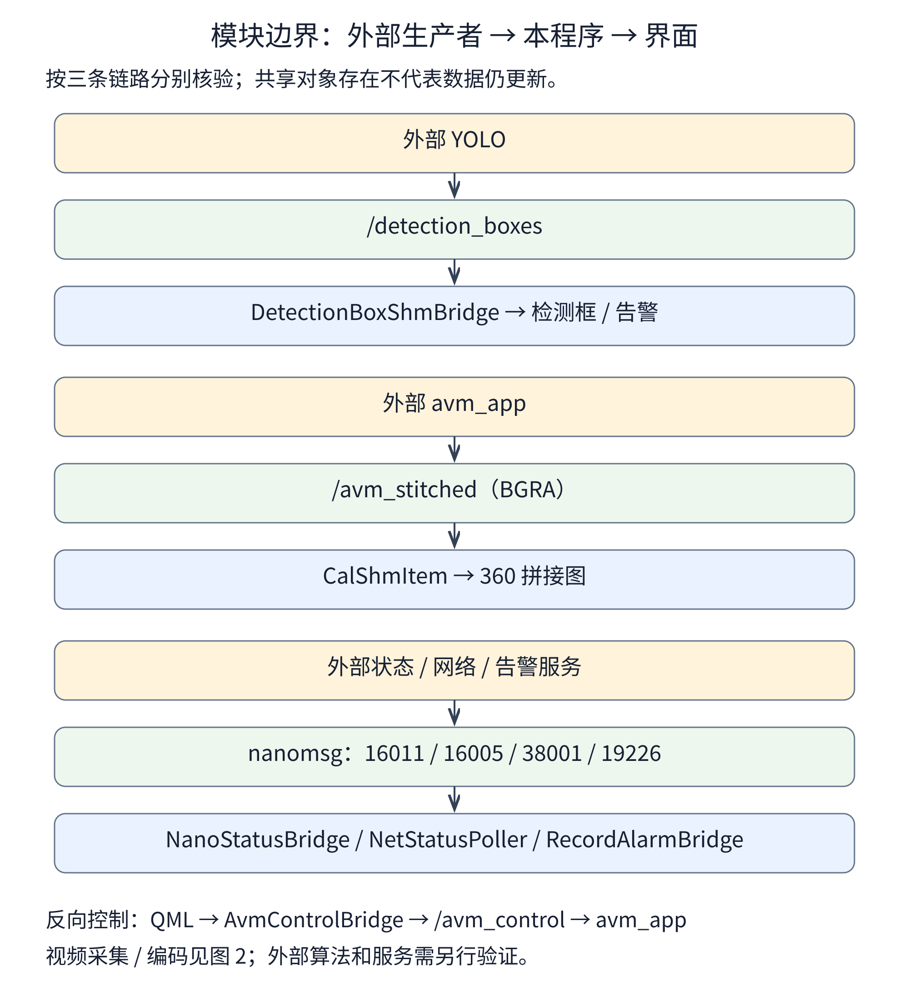
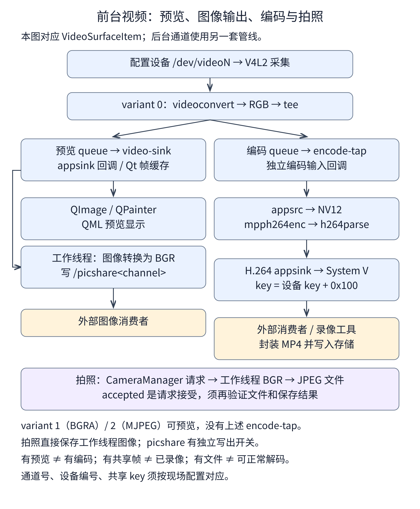
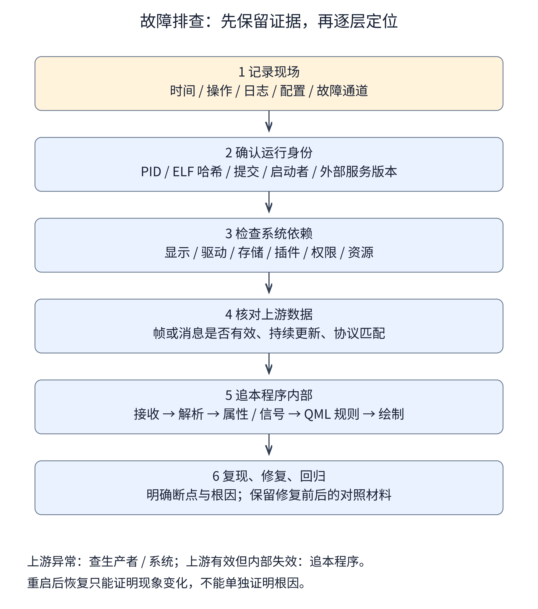

# qt5_qml_c001 源码说明

本说明对应 2026-09-30 核验快照，分支 `feature/startup-update`，提交 `641af2c83ffe8ee9834f6de694c9d44a2de72f81`。源码位于 `/home/tronlong/lyp/code/qt5_qml_c001`，文档位于 `/home/tronlong/lyp/perCode/idevelop_md/qt5_qml_c001`。入口与工作约定见 [AGENTS.md](AGENTS.md)，结果与不确定项见 [核验记录.md](核验记录.md)。

补充核验日期：2026-10-02。源码 HEAD 与 2026-09-30 快照相同，核对结果见核验记录。日常阅读以本文件为主；设备异常直接进入 [故障排查 D01～D15](#device-troubleshooting)，目录附件分工见 [AGENTS.md](AGENTS.md)。

## 项目位置与用途

README 将项目称为“RK3576 360 环视主程序（Qt5 QML）”。从入口和界面代码可确认，它承担车载 HMI、视频采集与预览、共享图像输出、检测与状态数据展示、摄像头标定、配置和升级准备等工作。

“主程序”描述的是界面与多个模块的集成角色。环视拼接和 YOLO 推理由外部可执行程序承担；本仓库也不能单独证明实际制动、网络服务、录像存储与回滚验收结果。判断用途时应同时看入口、编译清单、配置及调用链，不应只看 README、文件名或链接库。

Git 分支 `feature/startup-update` 和跟踪引用 `origin/feature/startup-update` 的 ahead/behind 在本地均为 0；本次未访问远端、未切分支。Git 提交时间是作者记录的时间，不是设备发布或验收时间。最新提交与近期日志涉及启动升级、信号图标、设置落盘和录像告警，但这些日志标题不能替代当前源码核验。

依据：[README](/home/tronlong/lyp/code/qt5_qml_c001/README.md)、[main.cpp](/home/tronlong/lyp/code/qt5_qml_c001/src/main.cpp)、[构建清单](/home/tronlong/lyp/code/qt5_qml_c001/qt5_qml_c001.pro)、[核验记录.md](核验记录.md) 中的历史检查结果。

## 工程构成与运行链路

主 `.pro` 声明 32 个 C++ 源文件、33 个头文件、1 个资源清单和 6 个翻译源文件。目录中共有 36 个 `src/**/*.cpp`，多出的 4 个位于 `src/legacy/`，未列入主 SOURCES；有 30 个 QML 文件，不是每个都由资源清单打包或在启动时加载。`qml.qrc` 的 40 项文件包含 25 项 QML 和 15 项图标。

### 模块边界图



[打开 SVG 模块图放大查看](evidence/diagrams/01_module_boundaries.svg)。文字对照：YOLO → 检测共享内存 → DetectionBoxShmBridge → QML；AVM → 共享拼接图 → CalShmItem → QML；外部状态服务 → nanomsg 桥接 → QML。反向控制为 QML → AvmControlBridge → `/avm_control` → AVM。

图表示源码可识别的数据方向，不代表外部服务已经正常运行。算法和服务自身的实现、版本及状态需另行核验。

### 前台视频分支图



[打开 SVG 视频图放大查看](evidence/diagrams/02_video_paths.svg)。文字对照：variant 0 的 RGB tee 分出预览与编码；预览回调供 Qt 缓存和图像工作线程；工作线程可写 picshare 并处理拍照。独立编码输出 H.264 System V 段，外部消费者负责封装/存储。variant 1/2 可预览但没有该 encode-tap；拍照直接保存工作线程 BGR。

前台 `VideoSurfaceItem` 与后台 `camera_shm_multi` 是两套采集路径，参数和配置开关的生效范围见下文。三张图均提供 2000 像素宽 PNG 和 SVG，Markdown 直接显示 PNG，不依赖 Mermaid 插件。阅读器会缩放图片，需要时打开原图或 SVG；不显示图片时可读图后的文字对照。

### 启动步骤

| 顺序 | 代码中的行为 | 依据 |
| --- | --- | --- |
| 1 | 设置 GStreamer/RGA 相关环境开关、QML 文件读取开关、OpenGL/Wayland 和线程渲染环境 | `main.cpp:246` 起 |
| 2 | 设置应用标识 UbSense / VehicleConsole，安装 AVM 信号处理，创建 `QGuiApplication`，选择字体 | `main.cpp:280` 起 |
| 3 | 读取布局方向、画布配置，注册 `CalShmItem`、`CalShmView`、`VideoSurfaceItem` 类型 | `main.cpp:396` 起 |
| 4 | 创建 `SettingsManager` 并加载配置，强制 AEB 开启；创建 QML 引擎并加载保存的语言 | `main.cpp:432` 起 |
| 5 | 创建摄像头管理、拍照 IPC、状态、检测框、设置、升级、标定、存储、Wi-Fi、环视与密码等桥接对象 | `main.cpp:464` 起 |
| 6 | 加载 `qrc:/qml/main.qml`；根对象为空则返回失败；启动状态轮询 | `main.cpp:580` 起 |
| 7 | 取得 Wayland 原生对象，初始化 GStreamer/GLib，读取摄像头配置，查找 `v0`～`v3` | `main.cpp:597` 起 |
| 8 | 按画布配置设置各前台通道显示属性并启动采集，再应用预览/picshare 开关；启动启用的 4 路及以上后台通道 | `main.cpp:637` 起 |
| 9 | 尝试复制 UI 配置到 `/tmp/ui_config.json`，进入 Qt 事件循环 | `main.cpp:708` 起 |

`main_cal()` 是同文件中的辅助函数，实际应用入口调用的是 `main()`，不能把 `main_cal()` 当作另一个已启用的启动流程。`copyUiConfigToTmp()` 用 `QFile::copy()`，需留意目标已存在时的失败分支；它不是无条件覆盖写。

### C++ 与 QML 接线

`qmlRegisterType()` 使 QML 能创建 C++ 类型；`setContextProperty()` 使 QML 能访问已经创建的对象。`Q_PROPERTY` 是属性接口，`NOTIFY` 信号驱动绑定更新，`Q_INVOKABLE` 暴露可调用方法。修改名字或信号可能使代码仍可编译，但界面失去数据绑定。

| QML 名称 | C++ 实现 / 职责 |
| --- | --- |
| `VideoSurfaceItem`（`com.mycompany.video 1.0`） | `src/VideoSurfaceItem.*`，前台视频显示与相关数据输出 |
| `CalShmItem`、`CalShmView`（`Cal 1.0`） | `src/cal_shm_item.h`，共享图像绘制，同一 C++ 类的两个注册名 |
| `cameraManager` | `CameraManager`，摄像头配置、启动停止、拍照请求 |
| `AppSettings` | `SettingsManager`，报警、DMS、BSD、AEB 与阈值配置 |
| `Settings` | `SettingsData`，通用设置，包括亮度、辅助线、检测框显示/合并 |
| `DetectionShmBridge` | `DetectionBoxShmBridge`，读取检测框共享内存 |
| `nano` | `NanoStatusBridge`，状态请求与定位订阅、图标状态、检测信息联动 |
| `recordAlarm` | `RecordAlarmBridge`，录像相关告警订阅和 UI 状态 |
| `netPoller` | `NetStatusPoller`，读取外部蜂窝网络 JSON 状态和 CSQ |
| `DeviceInfo`、`ServerInfo`、`CameraStatus` | 设备信息、服务器配置、摄像头连接状态数据 |
| `I18n` | `I18nBridge`，翻译加载与保存语言 |
| `Upgrader` | 暂存升级包、写升级标记、取消暂存、请求重启及兼容旧安装路径 |
| `ParamExporter`、`ParamImporter` | 参数文件导出和外置介质导入 |
| `CalibStorage`、`maskUtil`、`HomographyHelper` | 标定 JSON、掩膜、单应矩阵计算和测试映射 |
| `Backlight` | `BrightnessCtl`，sysfs 背光控制 |
| `StorageMonitor`、`WifiScanner` | USB/TF 状态、STA/AP 模式与网络工具调用 |
| `AvmControl` | `/avm_control` 开关及外部 `avm_app` 启动 |
| `PasswordManager` | 密码校验、保存与修改 |
| `proc`、`touchHandler`、`FixedAreaOnLeft` | 外部命令、触摸辅助、布局方向 |

完整注入位置见 [main.cpp](/home/tronlong/lyp/code/qt5_qml_c001/src/main.cpp:464)。`CameraProvider` 和文件/inotify 检测桥 `DetectionBoxBridge` 虽在 SOURCES 中，但当前入口未使用其主预览/检测路径；`GpioCtl.h` 是空文件，GPIO 注入代码为注释。`CalImageProvider` 头文件被包含，不等于已经注册 `image://` provider。

### 页面组织

`qml/main.qml` 是透明全屏窗口，定义主题，常驻加载 `MainPage.qml`，另外通过 Loader 显示警告、密码和设置覆盖层。`MainPage.qml` 自己声明 `v0`～`v3`，不能仅凭存在 `main_video.qml` 就认定主入口使用它。

设置中心涉及标定、通用设置、密码修改、设备信息、升级与其他页面；主页面有告警、DMS、行人、GPS、通信、Wi-Fi、TF/USB 和拼接选择等组件。具体加载关系应检查 `Loader.source`、组件实例及 `qml.qrc`。

启动参数 `--relaunch` 会影响警告层；`--calib` / `--open-calibration` 允许直接打开标定页并跳过相关启动覆盖层。这些是代码中的调试/操作入口，并未实机验证全部启动交互。

依据：[main.qml](/home/tronlong/lyp/code/qt5_qml_c001/qml/main.qml:63)、[SettingsCenter](/home/tronlong/lyp/code/qt5_qml_c001/qml/SettingsCenter.qml)、[qml.qrc](/home/tronlong/lyp/code/qt5_qml_c001/qml.qrc)。

## 视频、共享内存与通信

### 摄像头模板与模块能力边界

| 逻辑通道 | 模板设备 | 模板 enable | previewEnabled（含读取默认值） | picshareWriteEnabled（含读取默认值） | 入口路径 |
| --- | --- | --- | --- | --- | --- |
| 0 | `/dev/video0` | true | true | true | QML `v0` |
| 1 | `/dev/video3` | true | true | true | QML `v1` |
| 2 | `/dev/video13` | true | true | true | QML `v2` |
| 3 | `/dev/video14` | true | false | true | QML `v3` |
| 4 | `/dev/video2` | true | false | true | 后台 `CameraManager.startCamera()` |
| 5 | `/dev/video1` | true | false | true | 后台 `CameraManager.startCamera()` |

这 6 条模板均声明 1280×720、25 fps；这不是对实际采集 caps、预览刷新率或录像帧率的测量。前台 flexible pipeline 没有直接把模板中的 width/height/framerate 全部拼入采集 caps；后台路径显式指定这些字段。

`deviceForChannel()` 通过启用配置建立通道映射，未找到时回退到 `/dev/video<ch>`。前台是否启动主要取决于画布条目，入口该循环没有按摄像头的 `enable` 字段跳过；后台循环有明确 `enable` 检查。不能假定在所有路径上 `enable=false` 一定关闭采集。

各处存在物理方向注释差异：入口给通道 1 默认大屏的注释称“后视”，而阈值和雷达部分注释使用通道 2 为后视。此文保留逻辑通道与设备映射，不替设备布线确定“前后左右”。

依据：[camera_config.json](/home/tronlong/lyp/code/qt5_qml_c001/config/camera_config.json)、[load_config](/home/tronlong/lyp/code/qt5_qml_c001/src/camera_shm_multi.cpp:89)、[前后台启动](/home/tronlong/lyp/code/qt5_qml_c001/src/main.cpp:637)。

### 前台预览与编码

`VideoSurfaceItem::createPipelineImpl()` 按顺序尝试以下变体，启动失败时可继续尝试下一档：

1. RGB flexible：V4L2 → videoconvert → RGB → tee；预览队列和 `video-sink` 允许丢旧帧，另一路 `encode-tap` 供编码。
2. BGRA flexible：V4L2 → videoconvert → BGRA → 预览 appsink。
3. MJPEG：V4L2 → jpegdec → videoconvert → BGRA → 预览 appsink。

只有第一档创建 `encode-tap`，H.264 写线程也有 `capture_variant_index_ == 0` 条件。独立编码管线为 appsrc → queue → videoconvert → NV12 → mpph264enc → h264parse → appsink；当前参数为 VBR，目标 800000、最小 500000、最大 1500000 bit/s。预览队列与编码入口分开，但独立编码管线内部队列仍可丢帧，不能称“保证不丢帧”。

显示类继承 `QQuickPaintedItem`，使用 `QImage`、`QPainter`、裁剪/旋转/缩放、掩膜与缓存；原始 GstBuffer 部分路径用持有映射的 QImage 包装，同时共享内存输出有复制和 OpenCV 颜色转换。`smallPreviewEveryN_` 当前为 1，不能沿用历史说明中的固定抽帧倍率。

依据：[采集变体](/home/tronlong/lyp/code/qt5_qml_c001/src/VideoSurfaceItem.cpp:1629)、[编码管线](/home/tronlong/lyp/code/qt5_qml_c001/src/VideoSurfaceItem.cpp:1786)、[视频类定义](/home/tronlong/lyp/code/qt5_qml_c001/src/VideoSurfaceItem.h)。

### 后台采集

入口为通道 4、5 调用的链路为 `CameraManager::startCamera()` → `start_camera_async()` → `start_camera00()`。该实现除了图像采集和 picshare 写出，还构造了 waylandsink 分支及 H.264 分支，waylandsink 的 alpha 被设为 0。“无 QML 预览”不表示管线完全没有显示分支。

其编码参数也不同于前台独立编码管线；不要用前台码率和回退机制解释所有通道。当前后台包装调用没有传递 `picshareWriteEnabled`，写图像处也没有这一判断，因此“配置开关已全路径生效”不是已确认事实。

依据：[CameraManager](/home/tronlong/lyp/code/qt5_qml_c001/src/camera_manager.cpp:110)、[后台管线](/home/tronlong/lyp/code/qt5_qml_c001/src/camera_shm_multi.cpp:641)、[后台启动包装](/home/tronlong/lyp/code/qt5_qml_c001/src/camera_shm_multi.cpp:1021)。

### 共享内存协议

| 对象 | API / 结构 | 方向与限制 |
| --- | --- | --- |
| `/picshare<channel>` | POSIX shm；BGR 像素后附元数据，持久映射后复制写入 | 本程序写，外部读；不是检测框协议或 `ShmFrameHeader` 协议 |
| `/detection_boxes` | POSIX shm；magic `0xDE7EC710`，4 路，每路最多 64 框，含 seq、坐标、conf、mappedY | 外部检测程序写，本程序只读；读取后组装 QVariantMap/List |
| `/avm_control` | POSIX shm；原子 enabled 和预留字段 | 本程序写，外部 AVM 读；构造时初始化为关闭 |
| `/avm_stitched` | QML 指定名称，`CalShmItem` 使用 `ShmFrameHeader` 读取 BGRA | 外部 AVM 写，本程序绘制；实际写端实现不在本仓库 |
| H.264 环形缓冲 | System V shm；设备编号生成 key，再加 `0x100`；`RingBufferHeader` + 100 个 frame slot | 本程序写，录像工具等读；结构包含进程共享 mutex 与帧信息 |

`extract_shm_key()` 计算 `0x8000 | (video设备编号 & 0x0FFF)`，例如 `/dev/video0` 的 H.264 key 是 `0x8100`。不是按逻辑通道号直接算 key。

`FrameHeader` 使用 packed 布局，包含 frame_id、timestamp_us、frame_size，合计 16 字节；`RingBufferHeader` 还含原子字段和 pthread 对象，其实际大小应由双方目标 ABI 确认，不能直接采信源码中的“64 bytes”注释。

检测数据采用序号前后检查以识别变化与写入冲突；这体现协议设计意图，不构成对外部生产者实现、崩溃恢复或全部并发行为的完整证明。检测定时器源码间隔是 1 ms，实际执行受事件循环和负载影响。

`mappedY` 的 QML 注释和转换以 cm 为输入、显示时除以 100；C++ 日志却追加 `m`。要验证单位应同时检查实际生产者和测试点，此文不把日志单位视为生产者协议证明。

依据：[共享结构](/home/tronlong/lyp/code/qt5_qml_c001/src/camera_shm_multi.h)、[检测结构](/home/tronlong/lyp/code/qt5_qml_c001/src/DetectionBoxShmBridge.h)、[picshare 写出](/home/tronlong/lyp/code/qt5_qml_c001/src/VideoSurfaceItem.cpp:120)、[CalShmItem](/home/tronlong/lyp/code/qt5_qml_c001/src/cal_shm_item.h)、[AVM 控制](/home/tronlong/lyp/code/qt5_qml_c001/src/AvmControlBridge.h)。

### 消息通信

| 本程序对象 | 地址 / 模式 | 启动设置与含义 |
| --- | --- | --- |
| `NanoStatusBridge` | `tcp://127.0.0.1:16011`，REQ 客户端 | 入口设置 1000 ms 状态轮询 |
| 同对象定位订阅 | `tcp://127.0.0.1:16005`，SUB 客户端 | 读取 `location_info.view_nsat` 等定位信息 |
| `NetStatusPoller` | `tcp://127.0.0.1:38001`，REQ 客户端 | 构造时查询，并每 5000 ms 查询蜂窝状态 |
| `RecordAlarmBridge` | `tcp://127.0.0.1:19226`，SUB 客户端 | 入口设置 200 ms；识别 `type=alarm`、`source=aibox_stream`，兼容 framing 和普通 JSON |
| `NanoSnapshotServer` | `ipc:///tmp/cam_snapshot.ipc`，REP 服务端 | JSON `cmd=snapshot`，channel 只允许 0～3；name 可为绝对路径，或相对 `/tmp` 的路径 |
| 告警发送测试 | `tcp://127.0.0.1:19225`，PUB 客户端 | 经外部 relay 转发；仅测试工具使用此发送端口 |

REQ/REP、PUB/SUB 模式不能互换。本机 TCP 地址说明访问的是本设备上的服务，不证明服务本身位于远端或已在线；`server_config.json` 中的地址也不是上述端口连接的替代配置。

录像告警无有效消息超过 5000 ms 时恢复未知状态。网络图标用 CSQ 的 0～31 值分档，99 表示未知；主界面另按 SIM 和网络状态做显示限制。对象中 `Online` 来源是外部 JSON 的 `network_online` 字段，此对象不自行建立业务服务器会话。

拍照回复 `ok=true,msg=accepted` 表示请求接受，保存是异步的；要证明拍照成功需随后确认文件存在、可解码及像素内容，不能把 accepted 当保存完成。

依据：[通信接线](/home/tronlong/lyp/code/qt5_qml_c001/src/main.cpp:468)、[网络轮询](/home/tronlong/lyp/code/qt5_qml_c001/src/NetStatusPoller.cpp)、[录像告警](/home/tronlong/lyp/code/qt5_qml_c001/src/RecordAlarmBridge.cpp)、[拍照服务](/home/tronlong/lyp/code/qt5_qml_c001/src/NanoSnapshotServer.cpp:115)。

## 配置、标定、语言与外部环境

### 配置模板与实际路径

| 文件 / 路径 | 用途与读取或写入方 |
| --- | --- |
| `camera_config.json` | 摄像头模板，通道/设备/采集参数/开关；`load_config()` |
| `canvas_config.json` | 窗口形状、位置、大小等；入口 `loadShapeConfig()` |
| `ui_config.json` | 报警、DMS、行人等 UI 配置模板；AppSettings 默认使用 `/root/cameras/ui_config.json` |
| `/tmp/ui_config.json` | 运行时 UI/控制信息；与持久文件不等同 |
| `settings.json` | 通用设置；SettingsData 的持久路径与模板读取分开 |
| `device_info.json`、`server_config.json` | 设备和服务器展示配置；JSON 中示例版本、ID、地址不能当作设备实测值 |
| `polygons.json` | 主页面多边形/边框配置；QML 中使用 `/root/cameras/polygons.json` |
| `output.json` | 存在视频地址/端口模板；本次未确认它参与当前主入口的数据输出，不据文件名断言流媒体已启用 |
| `touch_event.txt` | 触摸辅助文件；`simulate_touch.h` 指定 `/root/cameras/touch_event.txt`，实际调用需另核对 |
| `/root/cameras/crop_config.json` | 入口指定的裁剪配置路径；仓库当前没有同名模板 |
| `/userdata/calibration_<ch>*.json`、`matrix_<ch>_1280x720.txt`、`mask<ch>.png` | 标定、矩阵、掩膜产物 |
| `/userdata/password.txt` | 密码持久文件；实现是文本存储，并有默认值与固定维护密码逻辑 |
| `/userdata/etc` | 参数导入实际目标；不等同于应用所有配置的读取目录 |
| `<外置介质或/userdata>/export_params/` | 参数导出目录；时间戳拼接代码当前已注释 |
| `/usrdata/upgrade/` | 暂存升级包、升级标记与日志 |

`resolveBundledConfig()` 的相对 `config/` 基于当前工作目录；从独立构建目录运行不保证能找到源码中的模板。该查找规则也不覆盖密码、升级、默认 AppSettings 等所有路径。

`SettingsManager` 写持久 JSON 时只重建其已知配置节；`I18nBridge` 在所选 UI 配置路径上保存 `i18n.locale`。当二者操作同一文件时，前者可能去掉后者写入的语言字段；两者路径选择也可能不同。这里是源码交互分析，尚未执行设置-语言-重启回归。

### 标定

标定页保存原始点及派生 1280×720 坐标数据，调用 `HomographyHelper.computeAndSave()`；后者读取含 px、py、realX、realY 的点，至少需要 4 对，调用 `cv::findHomography(..., cv::RANSAC, 3.0, ...)`，写出 3×3 矩阵并提供映射测试。

RANSAC 是从点中筛选一致模型的稳健估计方法；单应矩阵用于平面投影关系。实际距离准确性还取决于点坐标、单位、平面假设、摄像头状态与外部消费者，不能由“成功保存矩阵”推断测距准确。

页面可调用 `proc.restartYoloObjectDetect()`，实现会终止候选 YOLO 进程并在 `/root/cameras/` 寻找可执行程序重新启动；本次没有执行该操作。

依据：[标定页](/home/tronlong/lyp/code/qt5_qml_c001/qml/CalibrationPage.qml:734)、[矩阵实现](/home/tronlong/lyp/code/qt5_qml_c001/src/homography_calib.cpp)、[进程控制](/home/tronlong/lyp/code/qt5_qml_c001/src/ProcRunner.cpp)。

### 国际化和系统依赖

`.pro` 列出 zh_CN、en_US、ko_KR、ru_RU、es_ES、de_DE 六个 TS。当前 checkout 没有 QM 文件，`.gitignore` 忽略 `*.qm`；TS 可解析不代表翻译已全部完成。`I18nBridge` 实际只返回程序目录下的文件系统 QM 路径，源码中提到资源回退的注释没有对应执行实现。仅执行主 qmake/make 不能据此保证 QM 生成和部署。

`tools/i18n_build_zh.sh` 用 lupdate 提取、Python 填充及外部机翻、lrelease 编译中文 QM；脚本会改变翻译源且需相关工具/网络，本次只做语法检查。板端字体安装脚本和主入口字体选择都需与目标设备字体实况一起验证。

Wi-Fi 类通过 `wpa_cli`、`wpa_supplicant`、`hostapd`、`udhcpc`、`ip`、insmod 等工具及 `/root/wifi/*.ko` 配置 STA/AP 模式；并涉及 `/etc/` 下的网络配置。存储监控读取 `/sys/block` 等信息；摄像头状态页面读取 `/proc/tp2855_status`；背光使用 `/sys/class/backlight/backlight/brightness`，设置时限制在 50～255。这些是板端外部依赖，不应在开发主机上直接启动程序来验证。

依据：[I18nBridge](/home/tronlong/lyp/code/qt5_qml_c001/src/I18nBridge.cpp)、[Wi-Fi](/home/tronlong/lyp/code/qt5_qml_c001/src/WifiScanner.cpp)、[存储](/home/tronlong/lyp/code/qt5_qml_c001/src/StorageDeviceMonitor.cpp)、[背光](/home/tronlong/lyp/code/qt5_qml_c001/src/BrightnessCtl.cpp)。

## 升级与部署

当前 UI 新路径为：选择包 → 检查根分区可用空间大于 500×1024×1024 字节 → 拷贝到 `/usrdata/upgrade/` → 拷贝成功后立即写 `_upgrade_mode` → 提示重启确认。标记写入发生在用户点击重启之前；取消升级会清理标记及已暂存的包。

重启后 `S90upgrade_boot` 根据标记进入升级，准备 Wayland/背光，尝试外部 `/usr/bin/tpad_upgrade_ui`，必要时退回 `/usr/bin/install.sh`；后者解压包并执行包内 `install.sh`。脚本有空间、UI 启动和总体超时等检查，但 magic 检查失败只告警，不是签名验签。

`S95usb_restore` 搜索恢复包并调用外部恢复界面，确认后暂存、标记并重启。`S201_wifi` 是另一板端 Wi-Fi 初始化脚本。脚本注释涉及 S49weston、S99led_control 及 S98/S99z 回滚门禁，这些外部启动组件不能用本仓库文件证明实际存在或部署顺序正确。

`Upgrader.start()` 的旧直接执行安装脚本接口仍存在，新 UI 使用的是暂存/重启路径。升级包内安装器、完整包布局、外部升级/恢复 UI、回滚门禁和整机发布物未在本次验收。包扩展名搜索含 zip，但当前安装入口使用 tar 解压；不能把“可搜索扩展名”写成“所有格式均已支持安装”。

`install_to_cameras.sh` 是有限部署助手，按代码复制可执行文件和 `config/` 文件，再按权限复制系统安装入口。若采用源码外构建，需先处理它固定从源码根目录找二进制的问题；它还可能覆盖目标配置，并未部署全部外部组件。

依据：[Upgrader](/home/tronlong/lyp/code/qt5_qml_c001/src/Upgrader.cpp:78)、[UpgradePage](/home/tronlong/lyp/code/qt5_qml_c001/qml/UpgradePage.qml)、[升级启动脚本](/home/tronlong/lyp/code/qt5_qml_c001/deploy/S90upgrade_boot)、[安装入口](/home/tronlong/lyp/code/qt5_qml_c001/deploy/install.sh)、[部署助手](/home/tronlong/lyp/code/qt5_qml_c001/deploy/install_to_cameras.sh)。

## 构建、测试与排查

构建方法和实际失败见 [AGENTS.md](AGENTS.md) 与 [核验记录.md](核验记录.md)。当前主机 SDK 的 GStreamer、OpenCV、TurboJPEG、nanomsg 和 Qt private header 已找到，但 `.pro` 残留路径导致默认主构建失败；不能据此推断只补一条 include 后一定能链接成功。

| 测试文件 | 实际作用 / 边界 |
| --- | --- |
| `test_h264_shm_record.cpp/.pro` | 从现有 H.264 System V 环形共享内存取帧并封装 MP4；需要生产者已运行。本次 qmake 因 `.pro:10` 的 `SYSROOT ?=` 语句失败，尚未编译 |
| `test_h264_record_verify.cpp/.pro` | 独立打开视频设备录像并比较时长/帧数；本次 qmake/make 成功，未上板运行；不是对现有 HMI 管线的完全替代验证 |
| `record_30s.sh`、`record_300s.sh` | 调用共享内存录像工具录 30/300 秒；错误提示引用未随仓库提供的 `Makefile.h264_record` |
| `test_camera_shm_multi.cpp` | 历史摄像头辅助代码；调用的 `start_camera` 参数与当前头文件声明不同，未确认可独立构建 |
| `test_shm_read.cpp` | 历史共享内存读取/流输出示例，key `0x1234`、640×480、环头结构与当前主协议不同 |
| `send_alarm_test.cpp`、`recv_alarm_test.cpp` | 告警发送与接收辅助工具，依赖外部 relay |
| `scripts/check_memory_leaks.sh`、`run_rss_ab.sh` | 内存与 A/B 观察脚本；存在脚本不等于本次证明无泄漏 |

板端共享内存录像示例（未在本次执行，必须先满足 SDK/插件/生产者条件）：

```bash
./tests/test_h264_shm_record --device /dev/video0 -d 30 -o /tmp/ch0.mp4
ffprobe -v error -count_frames -select_streams v:0 \
  -show_entries stream=nb_read_frames,avg_frame_rate \
  -show_entries format=duration -of default=noprint_wrappers=1 /tmp/ch0.mp4
```

注意独立录像验证工具的设备参数是 `-d`，时长是 `-t`，与共享内存录像工具不同；不要混用。直接打开摄像头的工具还应先确认设备未被其他采集者占用。

| 问题 | 优先查看的证据 |
| --- | --- |
| 编译找不到 gst/Qt private/OpenCV 头 | 实际 Makefile/编译命令、SDK 路径；source 环境不自动改写 `.pro` 的硬编码 |
| QML 加载失败 | rootObjects 检查、qrc 文件路径、模块版本、Qt Quick Controls 1.4 等运行插件 |
| 检测框不更新 | 生产者启动先后、`/detection_boxes` 大小/magic、seq 变化、定时器是否启动、QML 通道数据 |
| 有预览但无 H.264 | 选中采集变体、encode-tap、mpph264enc 和 h264parse、编码初始化日志及共享 key |
| 拍照 accepted 但没有文件 | 采集线程请求消费、保存路径权限、文件是否真正写入及图像解码 |
| 设置重启后丢失 | 具体对象、持久路径、保存返回/日志、语言字段是否被 SettingsManager 重建覆盖 |
| 翻译不生效 | 程序目录 i18n/QM、translator.load 结果、TS unfinished、字体实际覆盖 |
| 信号文字/图标异常 | 38001 回复中的 sim_present、imsi/iccid、network_online、csq；不要直接等同服务器会话 |
| 升级没有进入预期路径 | 暂存包、标记、根空间、启动脚本实际安装、Wayland socket、boot_status/current/ui 日志与外部安装器 |

<a id="device-troubleshooting"></a>

## 设备故障排查

本章针对“设备异常可能与此程序有关”的情况，按当前源码核对排查入口、数据链路和判断依据。**本次没有连接设备执行这些命令，也没有完成板端故障复现。** 文中的代码事实、可疑点和现场根因不是同一层结论；必须用设备实际版本和日志补齐证据。

### 阅读顺序与故障索引

先完成现场取证，再按下表进入对应小节。当前 `evidence/diagrams/` 只保留流程图；核验结果摘要见 [核验记录.md](核验记录.md)，原始附件已按用户要求删除。

| 入口 | 现象 | 首先区分 |
| --- | --- | --- |
| [D01](#d01) | 起不来、反复退出/重拉 | 加载器、Qt/QML、配置、信号还是崩溃 |
| [D02](#d02) | 整屏黑、触摸无反馈 | 显示/背光、覆盖层、输入还是主线程 |
| [D03](#d03) | 某路黑屏、错位、翻转、状态不符 | 通道映射、设备、采集还是绘制 |
| [D04](#d04) | 设置/标定返回后冻结 | preview、visible、覆盖层、缓存还是断流 |
| [D05](#d05) | 卡顿、CPU/内存/资源增长 | 同步阻塞、媒体负载、共享页还是真实泄漏 |
| [D06](#d06) | 段错误、堆损坏、随机崩溃 | 首个错误、线程栈、符号与运行产物是否匹配 |
| [D07](#d07) | 检测框、距离、告警异常 | YOLO、协议、桥接、单位、QML 规则 |
| [D08](#d08) | 360 图黑屏或不更新 | AVM 启动、控制、共享图像还是缓存 |
| [D09](#d09) | 有预览没录像、时长错、录像告警 | 编码、共享缓冲、消费、封装还是存储 |
| [D10](#d10) | 拍照 accepted 无文件、标定不生效 | 接受、消费、保存、矩阵生成与外部重载 |
| [D11](#d11) | 设置/语言重启丢失、密码修改异常 | 实际对象、路径、写入结果、字段覆盖 |
| [D12](#d12) | 翻译、字体、图标缺失 | QM、字体、资源清单或外部路径 |
| [D13](#d13) | 信号、GPS、通信、Wi-Fi 异常 | 外部响应、字段含义、UI 条件或系统工具 |
| [D14](#d14) | USB、TF、背光异常 | 识别、挂载、可读、可写、节点和权限 |
| [D15](#d15) | 升级/恢复卡住、重启不进界面 | 暂存、标记、启动脚本、安装器或显示环境 |



[打开 SVG 原图放大查看](evidence/diagrams/03_fault_triage.svg)。文字顺序：保留现场 → 确认运行版本 → 查系统依赖 → 查上游帧/消息 → 追本程序接收、解析、绑定和绘制 → 复现、修复、回归。

### 现场信息、程序身份与日志

记录故障时间/时区、硬件和系统镜像版本、具体通道/页面、复现步骤、出现频率、是否自动恢复、故障前的升级/配置变化，以及 YOLO、AVM、录像和网络服务的版本与启动顺序。先保存现场，再做重启、清理共享内存、导入配置或升级等会改变证据的操作。

下列是板端只读检查示例。先用 `command -v 工具名` 确认工具存在；Buildroot/BusyBox 可能缺少选项，命令不支持或权限不足不能直接当成应用故障。

```sh
date
uptime
uname -a
ps
pidof qt5_qml_c001
df -h
df -i
cat /proc/meminfo
dmesg | tail -n 100
```

有多个 PID 时先查重复实例/守护重拉，选定一个实例，不能把多个 PID 拼进同一 `/proc` 路径。

```sh
# 1234 为占位值，替换成现场确认的一个 PID
HMI_PID=1234
readlink "/proc/$HMI_PID/exe"
readlink "/proc/$HMI_PID/cwd"
tr '\000' ' ' < "/proc/$HMI_PID/cmdline"
printf '\n'
cat "/proc/$HMI_PID/status"
cat "/proc/$HMI_PID/limits"
ls -l "/proc/$HMI_PID/fd/1" "/proc/$HMI_PID/fd/2"
sha256sum "/proc/$HMI_PID/exe"
```

磁盘程序可能已更新而进程仍运行旧映像，所以要对照运行 ELF 哈希、发布产物哈希、提交和未裁剪符号。分支名、界面版本字符串和文件修改时间不能单独证明设备运行的是本文 HEAD。

本仓库没有统一的应用日志文件写入器。Qt 日志及 g_print/perror 通常写 stdout/stderr，日志去向取决于实际启动者。根据 fd 1/2 和设备启动脚本查找，不假定存在 systemd/journalctl，也不把下面的 `/tmp/hmi_diag.log` 当成现有文件。

共享数据分两类：POSIX 具名对象在常见 Linux 部署中可从 `/dev/shm` 查看；System V 整数 key 的段使用 `ipcs -m` 或 `/proc/sysvipc/shm`。对象存在和文件 mtime 都不足以证明生产者持续写帧。

```sh
ls -ld /dev/shm /tmp /root/cameras /userdata /usrdata/upgrade
ls -l /dev/shm/detection_boxes /dev/shm/avm_control /dev/shm/avm_stitched
ls -l /dev/shm/picshare*
cat /proc/sysvipc/shm
cat /proc/mounts
```

若原日志丢弃，可在允许暂停业务的窗口，处理实际守护重拉并停止旧实例后，受控启动一次。保留原启动参数和 Wayland 环境，确认真实程序路径；启动本身会写配置、共享对象并操作系统接口，属于复现实验。

```sh
cd /root/cameras || exit 1
GST_DEBUG='2,v4l2*:4,app*:4' \
GST_DEBUG_NO_COLOR=1 \
QT_DEBUG_PLUGINS=1 \
QML_IMPORT_TRACE=1 \
QT_MESSAGE_PATTERN='[%{time yyyy-MM-dd hh:mm:ss.zzz}][pid=%{pid}][tid=%{threadid}][%{type}] %{message}' \
./qt5_qml_c001 > /tmp/hmi_diag.log 2>&1
```

日志采够后停用详细级别并检查剩余空间。GStreamer 可按类别开日志，详细日志会增加开销；类别以目标插件实际注册为准。`GST_DEBUG_DUMP_DOT_DIR` 配合 gst-launch 可生成管线图，但应用内还需相应导出调用，当前源码未找到 `GST_DEBUG_BIN_TO_DOT_FILE`，不能承诺仅设变量就会导出本程序管线。参见 [GStreamer 官方调试说明](https://gstreamer.freedesktop.org/documentation/tutorials/basic/debugging-tools.html)。Qt 插件和导入诊断见 [Qt 5 调试说明](https://doc.qt.io/qt-5/debug.html)。

入口会强制设置 `QT_QPA_PLATFORM=wayland-egl`、OpenGL ES 和线程渲染，外部 export offscreen/software 不证明程序最终采用了它。`GST_DEBUG` 的默认 setenv 代码被注释，日志里出现 default=2 也不证明真正设置了级别。保留完整日志；主机筛选只用于找线索：

```bash
rg -n 'QML|plugin|Cannot|ERROR|WARN|failed|Invalid|PLAYING|snapshot|shm|NetStatusPoller|DetectionBoxShmBridge|Upgrader' hmi_diag.log
```

<a id="d01"></a>

### D01 启动失败或反复退出

1. 确认是否执行到入口：核对 ELF 架构、权限、动态加载器、库和真实路径。板端有工具时可运行 `file /root/cameras/qt5_qml_c001`、`ldd /root/cameras/qt5_qml_c001`；主机用对应 SDK 的 readelf 静态检查，不用主机 ldd 尝试加载 AArch64 产物。
2. 查 Qt 平台插件、Wayland socket、QML import、qrc 资源及属性错误。`engine.rootObjects()` 为空会返回 `-1`，未进入正常事件循环。
3. 核对实际 `canvas_config.json` 和摄像头配置。画布条目为空可返回 0；摄像头配置加载失败返回 `-1`。因此退出码 0 不充分证明正常启动。
4. 对照 PID 更换、守护日志和 dmesg，区分 OOM、段错误、信号、升级脚本主动终止。SIGINT/SIGTERM 处理会尝试终止 `avm_app` 并 `_exit(128+signo)`，不经过通常的 Qt 清理路径。

加载环境出错先处理部署；有效配置仍能触发应用异常再转 D06。回归冷启动、守护重拉、重复实例和首次进入主界面，不只检查 PID 存在。依据：[入口与信号](/home/tronlong/lyp/code/qt5_qml_c001/src/main.cpp:222)、[QML 加载](/home/tronlong/lyp/code/qt5_qml_c001/src/main.cpp:580)、[摄像头配置](/home/tronlong/lyp/code/qt5_qml_c001/src/main.cpp:616)。

<a id="d02"></a>

### D02 整屏黑、只有背景或触摸无反馈

先分别观察背光、Weston/其他界面、本程序进程和按钮文字。其他界面也异常时优先查显示/驱动/供电；仅视频区异常转 D03。

```sh
pidof weston
ls -l /run/wayland-* /var/run/wayland-*
cat /sys/class/backlight/backlight/brightness
cat /sys/class/backlight/backlight/bl_power
cat /proc/bus/input/devices
```

socket 名称和目录以实际 `XDG_RUNTIME_DIR`、`WAYLAND_DISPLAY` 为准；通配路径不存在不等于 Weston 未运行，登录 shell 的环境也可能不同于守护启动环境。

源码有 `overlayBlocking`、warnLoader/passcodeLoader/pageLoader 和 blackout。若画面被覆盖，查这些状态、Loader 对象和 z/visible；触摸则区分原始事件是否到达、MouseArea 是否被覆盖、主线程是否阻塞。可用设备已有的输入测试工具观察事件，不用模拟触摸代替输入链路检查。

回归警告关闭、密码层、设置返回和各触摸区域。依据：[覆盖层](/home/tronlong/lyp/code/qt5_qml_c001/qml/main.qml:101)、[显示环境](/home/tronlong/lyp/code/qt5_qml_c001/src/main.cpp:263)、[背光](/home/tronlong/lyp/code/qt5_qml_c001/src/BrightnessCtl.cpp)。

<a id="d03"></a>

### D03 某路视频黑屏、错位、翻转或状态不符

逐段对应逻辑通道 → 配置设备 → 实际节点 → 管线变体 → 输出帧 → 绘制区域。模板映射不等于现场配置。

```sh
cat /root/cameras/camera_config.json
cat /root/cameras/canvas_config.json
ls -l /dev/video0 /dev/video3 /dev/video13 /dev/video14 /dev/video2 /dev/video1
cat /proc/tp2855_status
# 有这些工具时只查询；不要用 --set-* 修改现场
v4l2-ctl -d /dev/video0 --all
v4l2-ctl -d /dev/video0 --list-formats-ext
fuser /dev/video0
```

核对 `deviceForChannel()` 的缺省回退、QML objectName v0～v3、画布位置和尺寸、`/root/cameras/crop_config.json`、fixedRectMode、旋转和裁剪。前台与后台启动路径不同，前台 enable/picshare 处理不能推广到所有通道。

日志按 trying pipeline variant → pipeline OK → PLAYING ok → 持续帧核对；pipeline OK 只证明构造阶段。RGB/BGRA/MJPEG 的协商条件不同，一条独立 gst-launch 成功不证明全部变体健康。前台启动后将 bus 设置 flushing，运行中缺少 bus error 也不证明无故障。

状态页面读取 `/proc/tp2855_status`，硬编码 video0..3 → 0x46、video11..14 → 0x44，并按 `kUiToConfigIdx={0,2,3,1}` 对配置数组位置映射。配置顺序或驱动规则改变时，状态页和实际画面可能不一致；断开也可能来自状态解析失败。

独立采集前先释放设备，使用相同 caps 并记录负载。若独立采集也无帧，优先设备/输入/占用；若源帧稳定且 HMI 不更新，追 onNewSample、缓存和 paint。后台 4/5 路不绑定主 QML 视频控件。回归各路、重插、启动先后、裁剪/翻转和状态对应。依据：[映射](/home/tronlong/lyp/code/qt5_qml_c001/src/camera_shm_multi.cpp:79)、[采集启动](/home/tronlong/lyp/code/qt5_qml_c001/src/VideoSurfaceItem.cpp:576)、[状态映射](/home/tronlong/lyp/code/qt5_qml_c001/src/CameraStatusData.cpp:161)、[绘制](/home/tronlong/lyp/code/qt5_qml_c001/src/VideoSurfaceItem.cpp:1074)。

<a id="d04"></a>

### D04 设置/标定返回后冻结或不恢复

记录进入的页面、普通/AVM 模式、其他图标与触摸是否仍更新。检查主页面是否常驻、overlay 黑幕、previewEnabled/visible；`onOverlayExit()` 会延迟调用 `ensurePreviewEnabled()`，需确认实际调用和对象有效。

前台 previewEnabled=false 分支仍保留最新图像并约每 100 ms 向图像工作线程供帧；正常分支有约 40 ms 限流。这不等于停止采集和拍照，也不能用它推导独立编码 fps。分别记录采集 PTS/帧序号、backImg/frameReady、update 和 paint 的变化，找第一个停止的环节。

CalShmItem 读不到有效帧时保留旧缓存，屏上有图不证明生产者仍供帧。回归警告、密码、设置、标定反复进出及普通/AVM 切换，同时验证拍照和编码恢复。依据：[页面恢复](/home/tronlong/lyp/code/qt5_qml_c001/qml/main.qml:118)、[预览关闭分支](/home/tronlong/lyp/code/qt5_qml_c001/src/VideoSurfaceItem.cpp:224)、[缓存](/home/tronlong/lyp/code/qt5_qml_c001/src/cal_shm_item.h:105)。

<a id="d05"></a>

### D05 卡顿、CPU 高、内存或资源持续增长

用同一 PID、相同场景做带时间戳的连续采样，比较预热后、静置、模式切换和反复进入退出的趋势。单张 top 截图不足以判定泄漏。

```sh
top -b -n 1
cat "/proc/$HMI_PID/status"
cat "/proc/$HMI_PID/smaps_rollup"
ls "/proc/$HMI_PID/fd" | wc -l
ls "/proc/$HMI_PID/task" | wc -l
cat /proc/sysvipc/shm
df -h /dev/shm /tmp
```

无 smaps_rollup 时记录 smaps/status。RSS 包含共享页等，不能把多个进程 RSS 相加当独占内存；共享段逻辑大小也不等于实际驻留内存。结合 PSS、私有页、系统可用内存、线程、fd 和共享段数量判断。字段含义见 [Linux /proc 文档](https://docs.kernel.org/filesystems/proc.html)。

当前可疑点包括：ProcRunner 的 `waitForFinished(-1)`、YOLO 重启的 400 ms 等待、Wi-Fi 同步工具调用、Nano/网络轮询的等待、检测桥 1 ms 定时器、QVariant 组装、图像复制/缩放/OpenCV 转换和编码线程。它们是采样入口，不是死锁或性能根因的现成结论。详细媒体日志也会增加负载，需关闭后对照。

生命周期方面核对 picshare 静态映射、H.264 附着、缓存及线程。前台析构未找到对应 H.264 shmdt，进程退出会释放附着；需在反复创建/销毁对象时看增长，不能据此直接宣布所有场景均泄漏。拍照服务用 BlockingQueuedConnection，结合全线程栈检查等待关系；普通 futex 等待也可能只是空闲。

`run_rss_ab.sh` 会启动/终止应用；其 DISABLE_FOREGROUND_PLAYBACK、DISABLE_BG_CHANNELS 在当前 src/qml 未找到消费位置，A/B 名称不能证明实际禁用了模块。`check_memory_leaks.sh` 文本匹配只提供候选，不证明无泄漏。真正隔离需使用代码实际消费的开关，或独立诊断版本。

回归同时检查 CPU、RSS/PSS、fd、线程、共享段、fps 和延迟。依据：[同步命令](/home/tronlong/lyp/code/qt5_qml_c001/src/ProcRunner.cpp:7)、[前台析构](/home/tronlong/lyp/code/qt5_qml_c001/src/VideoSurfaceItem.cpp:498)、[A/B 脚本](/home/tronlong/lyp/code/qt5_qml_c001/scripts/run_rss_ab.sh)。

<a id="d06"></a>

### D06 段错误、堆损坏、随机崩溃

先区分退出、信号、OOM kill 和崩溃，保存退出状态、守护记录、内核日志及崩溃前输出。SIGKILL 通常不会产生 core。是否有 core 取决于目标进程限额、core_pattern、目录权限和空间：

```sh
cat /proc/sys/kernel/core_pattern
cat "/proc/$HMI_PID/limits"
dmesg | tail -n 150
```

修改当前 shell 的 ulimit 不会改变已运行进程。受控启动前配置 core，并保留匹配 ELF、共享库、未裁剪符号和 core。卡死可在允许暂停业务的窗口附加板端 GDB；附加会暂停进程，取栈后 detach。下面是 GDB 交互命令，1234 为现场 PID 占位值：

```gdb
attach 1234
set pagination off
info threads
thread apply all bt full
detach
quit
```

分析 core 时用匹配架构 GDB 加载对应 ELF/core。一次线程栈只说明采样位置，重复栈和等待关系才有助于确认阻塞。命令见 [GDB Backtrace 文档](https://sourceware.org/gdb/current/onlinedocs/gdb.html/Backtrace.html)。

源码候选包括共享协议/尺寸不匹配、stride/映射边界、停止/析构与回调并发、映射失败检查。前台 H.264 shmat 后判断空指针，后台也有同类写法；Linux 的失败返回值是 `(void*)-1`，见 [shmat 手册](https://man7.org/linux/man-pages/man2/shmat.2.html)。这是可识别的检查问题，但是否触发现场崩溃仍需失败返回、地址和栈证明；库位于栈顶也不证明根因在库。

仓库有 `qt5_qml_c001_asan.pro`，本次未构建/运行 ASan 版本。解决工具链和依赖后，在独立诊断产物中复现，保留首个错误及分配/释放栈；普通版本也须回归，避免诊断开销改变时序后遗漏问题。依据：[映射检查](/home/tronlong/lyp/code/qt5_qml_c001/src/VideoSurfaceItem.cpp:654)、[后台映射](/home/tronlong/lyp/code/qt5_qml_c001/src/camera_shm_multi.cpp:606)、[ASan 工程](/home/tronlong/lyp/code/qt5_qml_c001/qt5_qml_c001_asan.pro)。

<a id="d07"></a>

### D07 检测框不更新、距离或告警异常

按 YOLO → `/detection_boxes` → 桥接 peopleData → QML 显示/报警规则检查。框存在不证明报警条件满足，界面报警不证明外部执行器已动作。

1. 核对外部 YOLO 进程、输入和日志。对象存在不证明 seq 更新；生产者算法和写端不在本仓库，需要对应产物资料。
2. 对照头文件的 magic、4 路、每路最多 64 框、布局/字段和 atomic seq；读端跳过奇数、未变化或前后不一致的序号。用双方同协议编译的只读工具采样，不猜偏移，也不用 mtime 代替帧新鲜度。
3. 查 Initialized shared memory、size mismatch、Invalid magic 和 Failed to initialize。构造时只有 initShm 成功才连接并启动定时器；readFromShm 虽有重试代码，但必须被调用。当前默认入口未找到首次失败后持续触发重试的路径，需复现 UI 先起、YOLO 后起。
4. 已映射后未见比较新 inode 并自动重映射的逻辑；生产者 unlink/recreate 后可能读旧对象。对照实际映射、对象身份和 seq 验证，不能只重启后看是否恢复。
5. 核对 currentChannel、show_boxes/merge_boxes、缩放/裁剪/旋转、原始图像尺寸、阈值和可见性。mappedY 在 QML 按除以 100 显示，C++ 调试文本却追加 m；日志后缀不能证明生产者单位。

保留同一目标的生产值、桥接值、界面值与实测距离。回归无目标/多目标、四通道、迟启动/重启、模式切换和阈值边界。依据：[协议](/home/tronlong/lyp/code/qt5_qml_c001/src/DetectionBoxShmBridge.h)、[初始化/读取](/home/tronlong/lyp/code/qt5_qml_c001/src/DetectionBoxShmBridge.cpp:36)、[QML 规则](/home/tronlong/lyp/code/qt5_qml_c001/qml/MainPage.qml)。

<a id="d08"></a>

### D08 360 拼接图黑屏或停止更新

拼接由外部 avm_app 生成，先区分普通视频与 AVM 是否同时异常。

```sh
pidof avm_app
ls -l /root/cameras/avm_app/avm_app
ls -l /dev/shm/avm_control /dev/shm/avm_stitched
```

AvmControlBridge 用绝对路径启动，工作目录 `/root/cameras/avm_app`、参数 `.`，进程检查依赖 `/usr/bin/pgrep`。查 startDetached 结果和控制写入；enabled 已改变不证明外部启动成功。初始化会把控制标志置 0，重复实例/UI 重启可能影响状态。

setEnabled 同值直接返回，当前类未见持续监控外部进程并重拉的定时器。enabled=true 不证明 AVM 死后自动恢复。CalShmItem 首次未映射成功会重试，已有映射时直接复用；需检查外部重建共享对象后是否仍读旧映射。

对照 shm_preview.h 的 magic、BGRA、width/height/stride 和像素区长度，记录 seq/内容更新、QML item 可见性和尺寸。无有效帧时保留旧缓存，旧图会掩盖断流。源更新但 UI 不更新才追读取/复制/update/paint；源不更新先查外部 AVM 与输入。回归迟启动、外部重启、对象重建、退出重进及 UI 重启。依据：[控制](/home/tronlong/lyp/code/qt5_qml_c001/src/AvmControlBridge.cpp:87)、[协议](/home/tronlong/lyp/code/qt5_qml_c001/src/shm_preview.h)、[读取缓存](/home/tronlong/lyp/code/qt5_qml_c001/src/cal_shm_item.h:99)。

<a id="d09"></a>

### D09 有预览没录像、时长错误、录像告警

按采集 → encode-tap → appsrc/编码 → H.264 appsink → System V 环形段 → 外部消费 → 封装文件定位。实际录像服务/存储的完整实现不在本仓库。

1. 前台 variant 0 才提供 encode-tap 和对应写线程；variant 1/2 可预览但不能证明编码输出。查 skip writer、encode pipeline parse failed、enc-src missing、h264-sink missing、PLAYING failed。
2. first-frame encode pipeline ready 只证明初始化，需持续统计输入/输出帧、字节、PTS 和关键帧。前台 bus flushing 使运行时 bus 错误观测不完整，结合 GST_DEBUG 或诊断计数。
3. 设备编号 N 对应 key=`0x8000 | (N & 0xFFF)`，H.264 再加 0x100；不是按 UI 通道直接算。查段大小、权限、附着和双方布局，不无差别 ipcrm 破坏现场。
4. MAX_FRAMES=100，生产快于消费会覆盖旧帧。核对读写索引、帧长、时间戳、关键帧/SPS/PPS及进程共享 mutex/ABI。图像协议另含 size_t，不能把它和 H.264 头混用。旧测试二进制的存在也不证明与当前生产协议兼容。
5. 有 H.264 而无文件时查消费者、挂载点、可写性、空间/inode 和封装日志。文件存在/增长还须验证可解码、画面、帧数和时长；有 ffprobe 时分析样本，否则复制到主机。区分 PTS、steady_clock 与墙钟，不能直接减不同原点时间。

RecordAlarmBridge 从 19226 SUB 接收 type=alarm、source=aibox_stream，超过约 5 秒无有效消息回到未知态。未知/正常/告警不同；测试 PUB 19225 需要 relay 到 19226，不向生产系统注入假告警作常规诊断。

先前仅 `test_h264_record_verify` 交叉编译成功，未上板运行；共享内存录像测试的 `.pro` 因 `SYSROOT ?=` 在 qmake 阶段失败。回归各路、覆盖层/模式切换、消费者重启、慢消费/存储不足及恢复。依据：[采集/写线程](/home/tronlong/lyp/code/qt5_qml_c001/src/VideoSurfaceItem.cpp:579)、[编码](/home/tronlong/lyp/code/qt5_qml_c001/src/VideoSurfaceItem.cpp:1767)、[头部](/home/tronlong/lyp/code/qt5_qml_c001/src/camera_shm_multi.h)、[告警](/home/tronlong/lyp/code/qt5_qml_c001/src/RecordAlarmBridge.cpp)。

<a id="d10"></a>

### D10 拍照 accepted 无文件、标定不生效

拍照经过 NanoSnapshotServer → 主线程 CameraManager 设置请求 → 有 BGR 帧的工作线程消费 → JPEG 保存。accepted 只表示异步请求接受，须再核对返回路径、文件 mtime、JPEG 可读性和 snapshot saved/failed 日志。

IPC 只接受 0～3 通道，相对 name 以 `/tmp` 为基准，绝对路径按请求处理并尝试创建父目录。核对通道、目录权限/空间、采集是否继续。前台直接保存工作线程 BGR，不从 picshare 取图；同一路只有一个请求标志和路径槽，连续请求可能合并/覆盖，要专项验证，不能当完整队列。

标定依次核对取样图、点位 JSON、矩阵求解/保存、外部 YOLO 重载。屏幕到源图坐标的缩放/旋转、通道、点序和真实单位都需一致。至少四个有效对应点不等于精度达标；检查 RANSAC 结果，并用未参与拟合的点验证误差。平面单应矩阵有平面假设，距离验收要用实测值。

导入文件不证明内存对象已重载。标定页面触发 YOLO 重启涉及 ProcRunner 的外部终止和等待，需验证实际重启及 D07 的共享对象恢复。回归各路、覆盖层/AVM、保存失败、重复请求、保存后重进/重启。依据：[异步回复](/home/tronlong/lyp/code/qt5_qml_c001/src/NanoSnapshotServer.cpp:166)、[请求槽](/home/tronlong/lyp/code/qt5_qml_c001/src/camera_manager.cpp:154)、[JPEG](/home/tronlong/lyp/code/qt5_qml_c001/src/VideoSurfaceItem.cpp:1019)、[矩阵](/home/tronlong/lyp/code/qt5_qml_c001/src/HomographyHelper.cpp)、[外部重启](/home/tronlong/lyp/code/qt5_qml_c001/src/ProcRunner.cpp:24)。

<a id="d11"></a>

### D11 设置/语言重启丢失、密码修改异常

先区分 AppSettings/SettingsManager 与 Settings/SettingsData，再区分 `/tmp/ui_config.json` 和持久化文件。

```sh
ls -l /root/cameras/ui_config.json /tmp/ui_config.json
ls -l /root/cameras/settings.json /userdata/settings.json
sha256sum /root/cameras/ui_config.json /tmp/ui_config.json
df -h /root/cameras /userdata /tmp
cat /proc/mounts
```

SettingsData 优先存在的 `/root/cameras` 目录，否则程序目录，最后 `/userdata/settings.json`。路径不存在应追实际分支，不直接创建空文件。备份后比较修改前、确认后、改语言后、返回页面和正常重启后的字段/哈希。

- AEB 每次启动强制开启，其开关不持久化；这是当前实现。外部模块是否消费运行配置仍需核对。
- SettingsManager 保存会重组已知区段，I18nBridge 在同一路径写 i18n.locale。需复现“改语言 → 保存其他设置 → 重启”，检查 locale 是否被覆盖。
- SettingsManager 持久化保存返回 void；SettingsData 返回 bool 但未完整检查 write 字节数。密码先改内存再调用无结果返回的 save，UI 成功不充分证明持久写入。检查只读、满盘及写失败分支。
- `QFile::copy()` 不覆盖已存在的 `/tmp/ui_config.json`，还须结合此前 SettingsManager 写入判断，不能将这一步失败直接等同配置整体未生成。

密码文件为明文且存在默认/主密码逻辑；排查存在性、权限和分支即可，不把密码正文放入问题材料。回归多设置组合、持久/运行配置一致性、语言交叉操作和异常写入。依据：[路径/写入](/home/tronlong/lyp/code/qt5_qml_c001/src/SettingsData.cpp:15)、[持久化](/home/tronlong/lyp/code/qt5_qml_c001/src/SettingsManager.cpp:645)、[语言](/home/tronlong/lyp/code/qt5_qml_c001/src/I18nBridge.cpp:63)、[密码](/home/tronlong/lyp/code/qt5_qml_c001/src/PasswordManager.cpp:21)。

<a id="d12"></a>

### D12 翻译、字体或图标缺失

运行时从程序目录 `i18n/app_<locale>.qm` 加载，TS 是翻译源。查 `[i18n] load ... => false`、locale、文件、权限和部署版本；仓库有 TS 不等于设备有 QM。

六个 TS 可解析但有 unfinished/缺译文，数量见核验记录。局部原文可能是缺译文、加载失败或字符串未经过翻译接口，逐条核对 context/source；不把 TS 数量当实机覆盖率。缺字查实际字体、fallback 和字符集；图标区分 qrc 资源与外部文件路径，核对大小写、格式和加载日志。图标状态错误还需 D13。

回归各语言主要页面、长文本布局、单位/符号、软键盘和字体，普通/升级启动都检查部署目录。依据：[翻译加载](/home/tronlong/lyp/code/qt5_qml_c001/src/I18nBridge.cpp:12)、[资源清单](/home/tronlong/lyp/code/qt5_qml_c001/qml.qrc)、[字体检查脚本](/home/tronlong/lyp/code/qt5_qml_c001/scripts/check_korean_fonts.sh)。

<a id="d13"></a>

### D13 信号、GPS、通信、Wi-Fi 异常

先确定数据来源，再区分连接、响应格式、字段值和 QML 显示条件。普通 TCP 监听不证明 nanomsg 模式和业务响应正常。

| 数据 | 来源 | 检查重点 |
| --- | --- | --- |
| 图标/AEB 状态 | REQ 16011，约 1 秒轮询 | statusIcons:*、aeb:* 响应、超时与绑定 |
| GPS 可见卫星数 | SUB 16005，location_info.view_nsat | 持续发布和字段类型；卫星数不替代定位有效性 |
| 蜂窝/SIM/online | REQ 38001，约 5 秒轮询 | network/cellular、csq、SIM 标识、network_online |
| 录像告警 | SUB 19226 | relay、类型/source、alarm_type/state、5 秒过期 |
| Wi-Fi | WifiScanner 与系统工具 | STA/AP、驱动、wpa/hostapd/udhcpc、返回码 |

```sh
ip addr
ip route
ss -lntp
ps
ls -l /etc/wpa_supplicant.conf /etc/hostapd.conf
```

无 ip/ss 时用设备已有的 ifconfig/route/netstat。先看服务自身日志和已有响应；必要的协议客户端在隔离环境使用，不随意向生产服务发送控制消息。

serverOnline 来自外部 network_online，不能据本仓库证明业务服务器会话正常。信号图标还受 SIM 和 online 条件限制，CSQ 99 表示未知。NanoStatusBridge 部分接收失败日志被注释，无 warning 不证明通信健康。

Wi-Fi 类启动约 10 秒后检测模式，部分操作会重载驱动并同步等待工具，可能影响主线程。脚本文件名 S201_wifi，日志前缀却为 S101_wifi，hostapd 输出 `/tmp/hostapd_S101_wifi.log`。回归服务断开/恢复、未知字段、SIM 缺失、GPS 发布间隔、STA/AP 和启动先后。依据：[状态桥](/home/tronlong/lyp/code/qt5_qml_c001/src/NanoStatusBridge.cpp)、[网络语义](/home/tronlong/lyp/code/qt5_qml_c001/src/NetStatusPoller.cpp:192)、[Wi-Fi](/home/tronlong/lyp/code/qt5_qml_c001/src/WifiScanner.cpp)、[脚本](/home/tronlong/lyp/code/qt5_qml_c001/deploy/S201_wifi)。

<a id="d14"></a>

### D14 USB、TF、背光异常

存储按内核识别 → 分区 → 挂载 → 可读 → 可写 → 空间/inode 检查。StorageDeviceMonitor 的 TF 可用判断含系统节点分支，UI 显示可用不证明录像目录实际可写。

```sh
cat /proc/partitions
cat /proc/mounts
ls -l /sys/block
df -h
df -i
dmesg | tail -n 100
ls -l /sys/class/backlight/backlight/brightness
cat /sys/class/backlight/backlight/brightness
```

挂载点以现场为准。需要写测试时用测试目录的独立样本，核对返回和文件，避免覆盖已有录像/升级包。导入/导出检查 QML 选择路径、实际目标及返回结果；注释中的时间戳目录方案不等于当前实现。

背光默认节点 `/sys/class/backlight/backlight/brightness`，写值约束 50～255；核对板级节点、max_brightness、权限、保存值和启动恢复。整屏黑仍需 D02。回归插拔、只读/满盘、分区差异、导入后重载与亮度重启恢复。依据：[存储探测](/home/tronlong/lyp/code/qt5_qml_c001/src/StorageDeviceMonitor.cpp)、[背光](/home/tronlong/lyp/code/qt5_qml_c001/src/BrightnessCtl.cpp)、[导入](/home/tronlong/lyp/code/qt5_qml_c001/src/ParamImporter.cpp)、[导出](/home/tronlong/lyp/code/qt5_qml_c001/src/ParamExporter.cpp)。

<a id="d15"></a>

### D15 升级/恢复卡住、重启不进界面

区分普通 HMI、升级 UI、恢复确认 UI。Upgrader 负责暂存/标记，启动脚本负责阶段调度，外部安装器与门禁负责安装/验收，不能由本仓库单独证明端到端升级/回滚通过。

```sh
ls -la /usrdata/upgrade
cat /usrdata/upgrade/boot_status.log
tail -n 100 /usrdata/upgrade/current.log
tail -n 100 /usrdata/upgrade/previous.log
tail -n 100 /usrdata/upgrade/ui.log
tail -n 100 /usrdata/upgrade/restore_usb.log
ls -l /etc/init.d/S90upgrade_boot /etc/init.d/S95usb_restore
ls -l /usr/bin/tpad_upgrade_ui /usr/bin/tpad_restore_ui
df -h / /usrdata/upgrade
```

日志缺失要结合阶段解释。核对部署脚本版本、包哈希/大小、`_upgrade_mode` 标记、供电/重启、安装器日志和 pending_commit/回滚记录。

- 暂存前检查根分区约 500 MiB 可用空间，复制到 `/usrdata/upgrade`；暂存阶段已写标记，不能认为最后确认之前没有状态变化。取消也需验证包/标记清理。
- 重启优先向 `/proc/sysrq-trigger` 写 b，再回退 reboot，不能视为普通 Qt 退出清理。排查阶段不要直接调用 rebootToUpgrade。
- S90 在 Weston 后、HMI 前；UI 约 30 秒未进入安装视作卡住，整体约 1800 秒超时。显示未就绪/UI 卡死可走无界面安装，看 boot_status、ui、current 区分，不能以无界面判断未安装。
- 无标记时 S90 会清理暂存包，重启前先保留包和日志。搜索扩展名包含 ZIP 不证明后续提取/安装支持所有 ZIP，需沿实际分支核验。
- S95 同步运行恢复确认 UI，识别 `tpad_restore_update.tar.gz`，确认/取消/超时/显示未就绪各有分支；实际 UI 产物要另核对。
- S98/S99z 门禁和包内安装器完整实现不在本仓库，取得实际部署代码/日志才能判断安装、版本验收和回滚。

受控回归包括正常启动、确认/取消/超时、空间不足、复制失败、无显示回退、安装失败和版本/回滚验收。掉电恢复按实际安装协议设计测试。本次未执行升级、恢复、重启或掉电实验。依据：[Upgrader](/home/tronlong/lyp/code/qt5_qml_c001/src/Upgrader.cpp)、[升级脚本](/home/tronlong/lyp/code/qt5_qml_c001/deploy/S90upgrade_boot)、[恢复脚本](/home/tronlong/lyp/code/qt5_qml_c001/deploy/S95usb_restore)。

### 如何确认是本程序的问题

重启恢复、单条错误、截图或可疑函数都不足以单独证明根因。结论应同时有版本、复现条件、明确断点和修复前后对照；缺证据时保留候选原因。

| 判断 | 需要的证据 | 后续处理 |
| --- | --- | --- |
| 系统/外部输入异常 | 同一时间窗源帧/消息缺失、驱动/显示/存储异常能解释程序所见 | 修复对应依赖，再验证界面恢复 |
| 本程序内部异常 | 上游有效且协议匹配，内部接收/解析/线程/绑定/绘制在明确步骤失效 | 最小修复，复现和回归前后对照 |
| 版本/协议不兼容 | 双方产物与布局/字段/单位不同，匹配组合正常 | 明确版本约束，检查其他消费者 |
| 暂不能归因 | 只有现象变化或关键断点缺失 | 补有限日志/计数/采样，保留下次现场 |

问题材料至少包含：时间/时区、硬件/镜像、各产物哈希/提交、步骤与预期/实际结果、配置差异、进程与启动顺序、同一时间窗应用/内核/外部服务日志、资源趋势、必要的栈/core/图像/消息样本及尝试措施。保留原件，另提供脱敏副本。

回归覆盖原复现、相邻通道/页面、服务迟启动/重启、配置持久化、稳定运行；媒体问题补帧率/延迟/解码性，升级问题补实际协议的失败与回滚。先声明验收阈值，再记录结果。

### 验证范围

代码行为和路径经过静态核对，文档链接、shell 命令块语法及图像另做交付检查。语法正确不证明目标 BusyBox 支持全部选项，也不证明权限、插件、驱动或外部服务可用。本次没有执行板端命令、GDB/ASan、拍照/网络注入或设备回归。设备根因仍须以上述现场证据确认。


## 术语补充

| 名词 | 在本项目中的解释 |
| --- | --- |
| RK3576 / AArch64 | 工程面向的 Rockchip 平台和目标 64 位 ARM 架构；主机则是 x86_64 |
| Buildroot | 提供目标 Linux 文件系统、工具链和 sysroot 的构建环境；不是本仓库自行构建整个操作系统 |
| Qt private header / QPA | Qt 内部平台接口和平台抽象；入口使用 qplatformnativeinterface，构建需匹配 Qt 内部头文件版本 |
| OpenGL ES / 场景图 | 嵌入式图形接口及 Qt Quick 渲染结构；环境变量选择相应运行路径，不能单独证明性能 |
| GLib main loop | GStreamer 所依赖生态中的事件循环；入口创建分离线程运行它 |
| appsink / appsrc | GStreamer 向应用交付数据和从应用接收数据的元素；连接采集与 C++ 编码/封装逻辑 |
| tee / queue / caps | 数据分支、队列、协商的媒体格式/尺寸/帧率；queue 的丢帧策略与不同支路性能有关 |
| RGB/BGR/BGRA/NV12/YUYV | 不同颜色通道顺序、位宽或亮色差布局；QImage/OpenCV/GStreamer 协议必须匹配，不能只按宽高解释内存 |
| stride | 一行占用的字节数，可能含填充；不能始终假定等于宽×像素字节数 |
| mmap / memcpy | 将共享对象或缓冲映射到地址空间 / 实际复制字节；使用 mmap 不代表整条链路没有 memcpy |
| seqlock / acquire-release | 用序号检测并发写入的协议思路 / 原子读写的内存顺序；需要双方实现匹配 |
| ABI / packed | 二进制结构的大小、对齐和调用约定 / 紧凑结构布局；跨进程读取不能仅靠结构字段名字相同 |
| ring buffer | 循环复用槽位的缓冲结构；本协议有读写索引和计数，慢消费者及多消费者语义需另行验证 |
| RGA / MPP / RKNN | 图像处理加速相关硬件/接口、媒体处理框架、推理运行时；本工程设置 RGA 环境开关、使用 mpph264enc 并声明 RKNN 库，实际运行能力分别验证 |
| VBR / CBR / bit/s | 可变码率 / 固定码率 / 每秒比特数；与图像帧率不同 |
| PTS / DTS / EOS | 呈现时间戳 / 解码时间戳 / 数据流结束信号；用于视频时间线和封装收尾，不等于墙钟录像时长 |
| CSQ / RSSI / SIM / IMSI / ICCID | 信号质量字段 / 接收信号强度 / 用户身份模块 / 用户身份标识 / 卡标识；这里使用外部服务提供值 |
| STA / AP / DHCP / DNS | Wi-Fi 客户端 / 热点 / 动态地址分配 / 名称解析；相关类调用板端网络工具配置 |
| sysfs / procfs / sysrq | Linux 系统设备接口 / 状态伪文件系统 / 内核特殊控制接口；背光、摄像头状态、重启操作依赖这些接口 |
| TF / USB / mount point | MicroSD 存储卡、USB 外设接口、文件系统挂载路径；“检测到设备”与“可写、已挂载、有足够容量”是不同条件 |
| ASan / RSS | 地址错误检测工具 / 进程驻留内存统计；仅有编译配置或 RSS 脚本不能证明无内存错误或泄漏 |
| inotify | Linux 文件变更通知机制；备用检测桥相关实现存在，当前入口未启用 |
| qrc / qsTr / retranslate | Qt 编译资源路径、QML 翻译标记、重新计算翻译；与外部文件路径和 QM 部署需区分 |
| magic / version | 协议标识及版本字段；magic 匹配不等于结构和并发行为全部兼容，也不是密码学完整性验证 |

上述释义用于阅读源码；具体库版本、生产者行为、设备连接和测量指标仍须按核验记录中的边界处理。

### 故障排查中使用的术语

| 名词 | 含义与使用边界 |
| --- | --- |
| ELF / ABI | Linux 可执行文件格式 / 二进制接口约定。共享结构、对齐、位数和库版本必须匹配；同一文件名不证明相同产物 |
| PID / fd | 进程编号 / 文件描述符。用于确认具体实例、日志去向和资源数量；进程退出后 PID 可能被复用 |
| core / 符号 / backtrace | 崩溃时的进程映像 / 地址到函数行号的信息 / 调用栈。分析必须匹配运行版本；栈顶不是根因的充分证明 |
| GDB / ASan | 调试器 / AddressSanitizer 内存错误检测工具。附加或诊断构建会影响运行时序，需要在可控环境使用 |
| RSS / PSS | 驻留内存 / 按比例分摊共享页的内存统计。都要结合趋势和私有页，不能把共享段大小当独占物理内存 |
| OOM | 内存不足；内核可能终止进程。需内核记录确认，与程序主动退出、段错误区分 |
| seq / seqlock | 序号 / 用写前后序号识别并发变化的协议。必须核对双方布局和写入约定；文件存在不证明序号持续更新 |
| inode / mmap / shmat | 文件对象标识 / 文件或 POSIX 对象映射 / System V 段附着。对象重建后，同名路径可能与旧映射指向不同对象 |
| caps / stride | 媒体格式协商信息 / 图像每行的字节跨度。分辨率相同仍可能格式或行布局不同 |
| appsrc / appsink / tee | GStreamer 应用输入、应用输出、分支元素。采集、UI 与独立编码是不同环节，不能互相替代验收 |
| stale / watchdog | 数据过期 / 健康监测与恢复机制。过期变未知不等于检测出业务故障；属性 enabled 也不证明有进程重拉机制 |
| RANSAC / 回归验证 | 剔除异常点的鲁棒拟合方法 / 修复后复测原问题和相邻场景。矩阵求解成功与实测精度达标是不同结果 |
