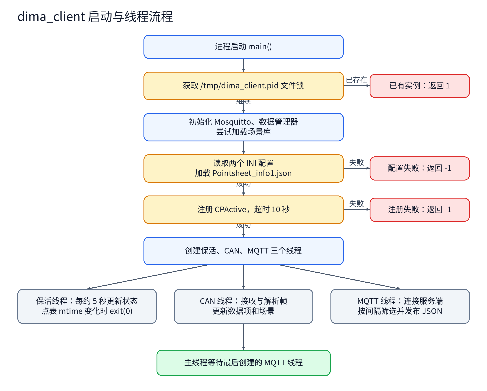
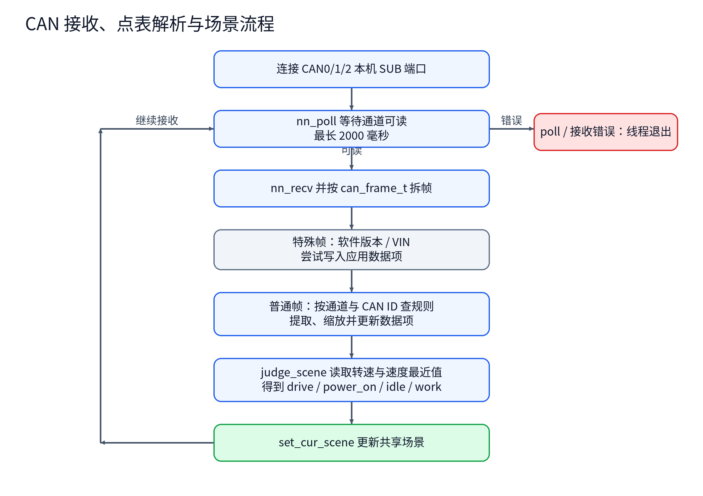
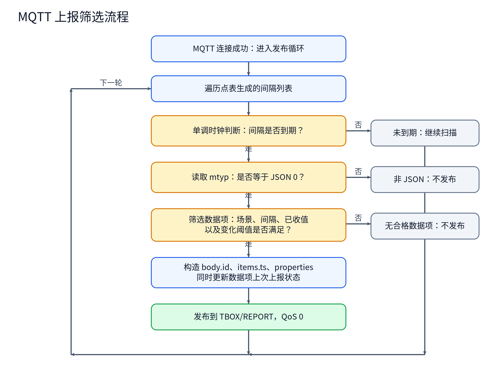
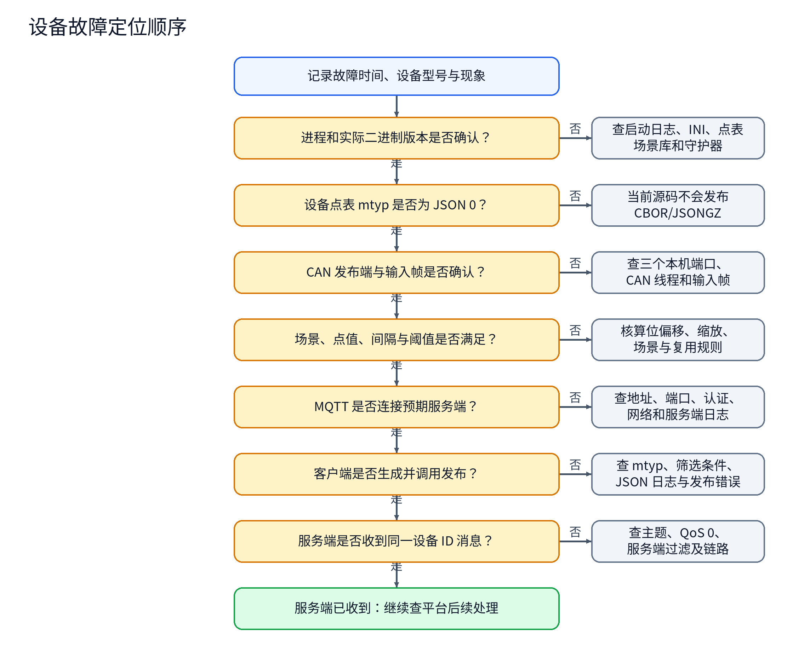

# dima_client 源码分析与逻辑流程

> 分析基线：`rtms_sdk` 仓库分支 `develop/rtms_sdk_v1.3_20240408`，提交 `bc60961e`；源码目录 `apps/dima_client/`。本文依据该提交的源码与仓库内可见配置样例进行静态分析，没有在目标设备上运行程序。下文把“源码执行路径”“仓库样例”和“现场待核对项”分别标明。

阅读顺序：第 1～3 节了解程序和依赖，第 4～7 节追踪 CAN 到 MQTT 的数据流，第 8～9 节查看构建与已确认的实现边界；设备故障可直接从第 10 节的定位流程图开始。

<!-- rtms-analysis-guide:start -->

## 文档目录

本报告对应 `rtms_sdk/apps/dima_client/` 在 `bc60961e` 的源码；跨项目关系见[源码分析总览](../../源码分析总览.md)。下文原章节编号保留，先用概述、目录、架构、模块和流程五节建立整体脉络。

- [项目概述](#project-overview)
- [源码目录总览](#source-overview)
- [核心架构设计](#core-architecture)
- [核心模块深度分析](#core-modules)
- [关键流程与数据流](#key-flows)
- [1. 程序边界和组成](#analysis-1)
- [2. 启动和进程生命周期](#analysis-2)
- [3. 外部文件和接口](#analysis-3)
- [4. 点表加载与内部数据结构](#analysis-4)
- [5. CAN 接收、特殊报文与场景](#analysis-5)
- [6. 复用数据项](#analysis-6)
- [7. MQTT 发布条件与消息格式](#analysis-7)
- [8. 构建和部署事实](#analysis-8)
- [9. 已确认的实现边界与验证清单](#analysis-9)
- [10. 设备故障排查手册](#analysis-10)

**顺读方式：**先读下面五节，再从原第 1 节起顺序阅读详细分析；需要查特定模块时，可用模块表跳到对应章节。

<a id="project-overview"></a>

## 项目概述

`dima_client` 从本机接收 CAN 帧，按点表提取字段、调用场景库判断状态，再把符合场景与间隔条件的数据作为 JSON 发布到 MQTT；设备点表和服务端接收结果需要另核。

<a id="source-overview"></a>

## 源码目录总览

以下路径相对于该提交的 `apps/dima_client/`；“职责”只描述源码中的构建或调用角色。

| 路径 | 职责 |
| --- | --- |
| `main.c`、`CMakeLists.txt` | 启动、线程、保活及两个构建目标 |
| `src/can_mng/` | 读取配置并装载场景库 |
| `src/can_server/` | 订阅三路本机 CAN 消息 |
| `src/data_process/` | 点表解析、字段换算与 JSON 生成 |
| `src/scene/`、`src/scene_lib/` | 场景库加载与场景判定 |
| `src/mosquitto/` | MQTT 连接、定时筛选与发布 |
| `src/list/` | 点表规则使用的链表 |

<a id="core-architecture"></a>

## 核心架构设计

```text
/opt/配置与点表 ───────→ main / can_mng → data_process 规则
                                  └→ 加载 libscene 的 judge_scene
本机 CAN 发布端 ──────→ can_server ─┬→ data_process 更新数据项
                                    └→ judge_scene 更新当前场景
数据项 + 当前场景 ───────────────→ mosquitto 筛选 / 组 JSON
                                    └→ TBOX/REPORT → MQTT 服务端
```

顶层 WITH_DIMA_CLIENT 默认关闭；当前有效发布路径为 JSON。场景库加载失败、点表异常和服务端接收结果分别按正文核对。图中箭头表示源码中的数据或控制方向；外部服务和设备效果以正文标明的证据边界为准。

<a id="core-modules"></a>

## 核心模块深度分析

下表给出主链路模块的入口、关键判断和详细分析位置；具体函数、常量与失败路径以所链章节中的源码引用为准。

| 模块 | 源码入口 | 关键判断与输出 | 详细分析 |
| --- | --- | --- | --- |
| 启动与配置 | `main.c`、`src/can_mng/` | 配置和点表加载失败会影响启动；场景库加载结果未完整向上处理 | [进入章节](#analysis-2) |
| CAN 与点表 | `src/can_server/`、`src/data_process/` | 按通道和 CAN ID 匹配规则，处理特殊报文及位提取 | [进入章节](#analysis-5) |
| 场景与复用项 | `src/scene_lib/`、`src/data_process/` | 场景决定可上报项；复用项仍受点表完整性约束 | [进入章节](#analysis-6) |
| MQTT 发布 | `src/mosquitto/` | 场景、间隔、变化阈值和 mtyp 共同决定是否生成并发布 JSON | [进入章节](#analysis-7) |

<a id="key-flows"></a>

## 关键流程与数据流

~~~text
配置和点表加载 → 三路 CAN 订阅
每帧 → 特殊帧处理 → 普通点表解析 → 场景判定
数据项 + 场景 → 间隔/变化阈值筛选 → JSON 组帧 → MQTT 发布
~~~

具体分支依次见[启动与线程](#analysis-2)、[CAN 与场景图](#analysis-5)、[MQTT 条件](#analysis-7)。这里的“发布”指本地 MQTT 调用，平台接收仍需外部证据。

<!-- rtms-analysis-guide:end -->

<a id="analysis-1"></a>

## 1. 程序边界和组成

`dima_client` 是设备侧可执行程序。它订阅本机 CAN 数据，按 JSON 点表提取数据项，调用场景库判断当前状态，然后在满足场景、间隔与变化条件时向 MQTT 发布 JSON。`scene` 是单独构建的共享库，程序运行时从 `/usr/lib/libscene.so` 查找 `judge_scene`。代码还含 CAN 请求发送、CBOR、schema 和另一种 JSON 生成函数，但默认运行路径没有启动或调用这些功能。

| 部分 | 入口与职责 | 证据 |
| --- | --- | --- |
| 主程序 | 单实例、配置加载、线程启动、保活 | `main.c:25-129` |
| 设备管理 | 读取两个 INI、初始化共享状态、加载场景库 | `src/can_mng/can_mng.c:10-98` |
| CAN 接收 | 三个 nanomsg SUB 连接，拆分帧并更新数据项 | `src/can_server/can_server.c:10-92` |
| 点表与上报数据 | 解析规则、提取数据、特殊帧、复用数据、生成 JSON | `src/data_process/data_process.c:193-1522` |
| 场景 | `dlopen`/`dlsym` 和 `judge_scene` 判定 | `src/scene/scene.c:7-43`、`src/scene_lib/scene_judge.c:76-97` |
| MQTT | 配置认证、连接回调、间隔扫描、发布 | `src/mosquitto/client_mosquitto.c:42-254` |
| 辅助容器 | 点表规则使用的链表；哈希表由 `uthash` 宏提供 | `src/list/cc_slist.c`、`src/data_process/data_process.h` |

### 主逻辑流程图



文字路径：启动 → 文件锁 → 初始化与加载配置 → 注册保活 → 启动三个线程；配置或注册失败退出，点表修改后由保活线程退出进程。

图中的场景库加载失败不会让 `can_mng_init()` 返回失败：它忽略了 `load_libscene()` 的返回值。若后续收到 CAN 帧，代码仍会直接调用函数指针。图中的线程创建调用也未检查返回码；主线程只对最后一次赋值的 `pthread_t tid` 调用 `pthread_join()`。（`main.c:91-127`、`src/can_mng/can_mng.c:83-98`、`src/can_server/can_server.c:37-40`）

<a id="analysis-2"></a>

## 2. 启动和进程生命周期

1. `is_instance_existing()` 对 `/tmp/dima_client.pid` 执行 `open(O_CREAT|O_RDWR)` 和非阻塞 `flock`；只在 `EWOULDBLOCK` 时判为已有实例。代码没有检查 `open()` 失败，也没有把文件描述符显式关闭；锁随进程结束释放。（`main.c:53-68`）
2. `main()` 初始化日志和 Mosquitto 库，根据 CMake 生成的版本宏打印 `1.5`，初始化 `can_mng_t`/`data_process_mng_t`。数据管理器初始场景为 `power_on`。（`main.c:70-100`、`src/data_process/data_process.c:1752-1769`）
3. 先读 `/opt/conf.ini` 中的 `dev:id`，再读 `/opt/conf_dima.ini` 的 MQTT 地址、端口、用户名、密码；任一 INI 加载失败，主函数退出。源码虽给配置键设回退值，但回退值只在文件成功加载且键不存在时有机会使用。（`src/can_mng/can_mng.c:10-64`）
4. `load_pointsheet_json()` 必须能够读取并解析固定路径 `/opt/Pointsheet_info1.json`，否则主函数退出。部分规则无效时解析器可能仅跳过相应规则，并不保证整份点表被完整验证。（`main.c:102-112`、`src/data_process/data_process.c:1109-1202`）
5. 程序注册 CPActive，超时参数为 10 秒；保活线程约每 5 秒更新时间。它记录点表文件的 `st_mtime`，之后检测到变化就 `exit(0)`。若 `stat()` 失败，本轮只跳过比较；删除、短暂缺失或内容改变但 mtime 不变，不构成代码中的重载触发条件。（`main.c:25-51,114-125`）

<a id="analysis-3"></a>

## 3. 外部文件和接口

| 路径或接口 | 读写与作用 | 限制 |
| --- | --- | --- |
| `/opt/conf.ini` | 读 `dev:id`，用于 MQTT 客户端 ID 和 JSON `body.id` | 缺文件会退出；键缺失有源码回退值 |
| `/opt/conf_dima.ini` | 读 `remote:ip`、`remote:port`、`remote:username`、`remote:password` | 缺文件会退出；代码会把用户名和密码打印到标准输出，本文不复制源码中的默认凭据 |
| `/opt/Pointsheet_info1.json` | 读点表；运行时监测 mtime | 固定路径；设备使用的具体文件须在目标设备核对 |
| `/usr/lib/libscene.so` | 运行时加载 `judge_scene` | 固定路径；加载失败后调用点存在空指针风险 |
| `/tmp/dima_client.pid` | 单实例文件锁 | 文件名虽带 pid，代码没有写入 PID 数值 |
| `tcp://127.0.0.1:16002/16003/16004` | nanomsg SUB 接收 CAN0/1/2 | 需本机其他进程提供发布端 |
| MQTT 服务器 | 地址、端口与认证信息由 INI 提供 | 连接和发布结果须结合服务端验证 |
| `TBOX/REPORT` | 当前 JSON 上报主题，QoS 0，retain=false | 其他 `local/data/...` 主题在 `#if 0` 中 |

仓库的 `todel/opt/device_apps/{HAC,NAC,NEWCAC,NTC,RC,STC}/Pointsheet_info1.json` 是**已提交的格式样例**，但其中没有 `dima_client` 应用配置，`mtyp` 均为 1。这些样例不能证明设备上 `/opt/Pointsheet_info1.json` 的内容，也不能当作当前 `dima_client` 已能发布的配置：当前 MQTT 的 CBOR 分支被 `#if 0` 屏蔽。`todel/package_install/...` 还有对应打包副本。样例数据的具体点位、数量和车型关系不应直接套用到本程序的现场部署。

<a id="analysis-4"></a>

## 4. 点表加载与内部数据结构

### 点表字段

| 字段层级 | 代码读取的字段 | 形成的内部状态 |
| --- | --- | --- |
| 根对象 | `mver`、`sver`、`pver`、`mtyp`、`sce` | 机器版本、schema/点表版本、消息类型和场景列表。`mtyp` 枚举在代码中为 0 JSON、1 CBOR、2 JSONGZ；当前运行发布仅处理 0。 |
| `dev[]` | `slot`、`typ`、`msg[]` | 每个 `slot` 的 CAN 规则哈希表 `data_rule[3]`；`typ` 赋给单个 `slot_type` 字段，但在当前发布路径没有进一步使用。 |
| `msg[]`/`rls[]` | `typ`、`ofs`、`len`、`val`、子 `rls[]`、`pts[]` | 顶层规则按 `val` 放入哈希表；子规则递归保存。`val` 为 `#` 前缀时按十六进制转为内存字节，其他字符串按整数处理。 |
| `pts[]` | `nm`、`ofs`、`len`、`bo`、`sign`、`ptyp`、`sc`、`pofs`、`min`、`max`、`udif`、`sce`、`scems`、可选 `cbidx` | CAN 数据项的名称、位提取方式、数值换算、边界、变化阈值以及场景/频率。 |
| `app[]` | `nm`、`params[]`；参数含 `nm`、`ptyp`、`udif`、`sce`、`scems`、`cbidx`、可选 `multiplex` | 只处理 `nm` 精确为 `dima_client` 的项；应用数据规则使用 `UINT32_MAX` 作为哈希键，放在通道 0。默认 `NOT_USED_SCHEMA=ON` 时，应用参数缺少 `cbidx` 会调用 `exit(-1)`。 |

点表中的场景列表和 `scems` 数组由相同下标关联。解析器把出现过的间隔去重放到哈希表并排序，MQTT 线程据此扫描。源码定义 `SCENE_MAX=10`、通道规则数组长度 3、复用帧指针数组长度 8，但解析数组时没有完整的长度约束；文档不能据此推断任意点表都安全有效。（`src/data_process/data_process.h:9-147`、`src/data_process/data_process.c:307-616,1109-1202`）

`load_general_param()` 能解析另一种通用参数/CBOR schema 文件，但 `main()` 没调用它。`cbor_model_schema_generate()` 和 `cbor_work_data_generate()` 也在源码中，却不在默认 JSON 上报链路中。不要把这些函数的存在解释成现场已启用。（`src/data_process/data_process.c:1041-1102,1569-1750`）

### CAN 帧解释

本机消息中的 `can_frame_t` 依次包含 32 位 `can_id`、16 位 `can_dlc`、16 位 `rsv_ms`、8 字节 `data`、32 位 `timestamp`；在当前结构体布局下，`data` 从结构体第 8 字节开始。点表中的 `ofs` 是按整个结构体起算的位偏移，不能未经核对就按 `data[0]` 起算。代码先按 `bo` 提取位段，对有符号值做补码扩展，然后执行 `物理值 = 原始值 × sc + pofs`，再按 `min`/`max` 裁剪。`ptyp` 支持整数、布尔、数值、字符串和 JSON 字符串。（`src/can_server/can_server.h:15-22`、`src/data_process/data_process.c:745-850`）

<a id="analysis-5"></a>

## 5. CAN 接收、特殊报文与场景



文字路径：连接三个 CAN 订阅端口 → 收帧 → 处理软件版本/VIN 特殊帧 → 按点表解析普通帧 → 判断并更新场景 → 继续收帧。

- SUB 订阅过滤条件是空字符串，即接收该连接发布的全部消息；一条 nanomsg 消息可包含多个完整 `can_frame_t`。不足一个结构体的尾部字节不会进入帧循环。CAN 线程遇到非 `EAGAIN` 接收错误或 poll 错误会返回，主程序没有重启该线程。（`src/can_server/can_server.c:10-92`）
- `parse_special_msg()` 识别带扩展帧标志的 `0x1CFDD1FD` 软件版本，取 `data[1..4]` 形成 `xx.xx` 字符串，变化时写入 `Sr0001`；识别 `0x18ECFFEE` 的 TP.BAM 和 `0x18EBFFEE` 的 TP.DT，限定总长 17、3 帧、PGN `0xFEEC` 后尝试组合 VIN，变化时写入 `Sr0002`。应用项必须在本设备点表中存在才会被保存；调用方没有检查设置结果。（`src/data_process/data_process.c:967-1028`）
- 当前 VIN 组合使用函数内的非静态 `curr_vin[18]`，而 TP.DT 的三个包分三次函数调用到达；数组未在调用之间保存内容。这是源码直接可见的重组缺陷，因此不能把 `Sr0002` 正常上报当作已确认行为。`parse_special_msg()` 声明返回 `int`，实现末尾没有返回值；当前调用方忽略返回值。（`src/data_process/data_process.c:967-1028`）
- 普通点表解析只在顶层哈希表按 CAN ID 找规则；进入命中的规则后，若有子 `rls[]`，代码递归处理所有子规则，没有再次用子规则的 `val` 判别报文字段。因此点表看似定义的子规则筛选条件，不等于当前实现确实执行了相应筛选。（`src/data_process/data_process.c:433-616,745-860,1029-1039`）
- 场景库对 `0x171` 读取发动机转速，对 `0x172` 读取速度，均从位偏移 64 提取 16 位小端原始值。判定优先级：速度大于 0 为 `drive`；否则发动机转速为 0 是 `power_on`，1～800 是 `idle`，大于 800 是 `work`。两个值保存在库内静态数组，其他 CAN 帧也会用最近值重新判定，没有超时清零、物理量缩放或通道条件。（`src/scene_lib/scene_judge.c:30-97`）

<a id="analysis-6"></a>

## 6. 复用数据项

点表 `app[].params[].multiplex` 可引用一个数量项 `count` 和若干 `frame` 数据项；引用的数据项先按 CAN 规则更新，`set_multiplex_data_item()` 在接收过程中把各帧数值放入临时数组。只有所有单元都标记为已收到、且至少一项达到其变化阈值时，代码才构造 `{名称_1: 值, ...}` JSON 字符串，写到一个 `VALUE_TYPE_JSON_STRING` 应用项。发布阶段再把这个字符串解析成 JSON 对象加入 `properties`，并跳过被复用项直接上报。（`src/data_process/data_process.c:193-306,616-745,1205-1332`）

这一路径高度依赖点表完整性。`get_common_data_item()` 遍历多个通道时，后续未找到的结果可能覆盖先前找到的指针；`find_common_data_item()` 递归子规则时也没有找到即停止。`frame` 数组写入固定 8 项指针时没有边界检查。数量项还会决定运行时分配规模。上述都是静态分析可见的边界，实际是否触发取决于现场点表。（`src/data_process/data_process.c:139-306,616-745`）

发布筛选函数中的 `skip_pub` 定义在数据项循环外，一旦某个被复用项把它设为 `true`，同一规则列表内后续数据项也会被跳过。这是当前控制流的直接结果；受影响的具体字段需依据现场点表排列确认。（`src/data_process/data_process.c:1205-1227`）

<a id="analysis-7"></a>

## 7. MQTT 发布条件与消息格式



文字路径：MQTT 连接成功 → 间隔到期 → `mtyp=0` → 数据项满足场景和变化条件 → 构造 JSON → 发布到 `TBOX/REPORT`。

具体条件由 `check_data_item_value_json()` 实现：场景必须匹配点表 `sce`；当前扫描间隔必须等于该场景下的 `scems`；数据项必须至少接收过一次。首次满足条件可加入载荷。以后 `udif=0` 时每次间隔到期可加入；非零时数值变化绝对值要达到阈值，字符串要与上次上报值不同。布尔值按非零转为 JSON true。`VALUE_TYPE_JSON_STRING` 会再次执行 `cJSON_Parse`，解析成功才插入对象。没有合格数据项时 `json_work_data_generate()` 返回空指针，不调用发布。（`src/data_process/data_process.c:1205-1332,1483-1522`）

当前 JSON 的**结构**由源码明确给出：

```json
{
  "body": {
    "id": "<来自 dev:id 的设备 ID>",
    "items": [
      {
        "ts": 0,
        "properties": {"<符合条件的数据项名>": "<按 ptyp 决定的值类型>"}
      }
    ]
  }
}
```

上面 `ts: 0` 仅是结构占位，实际值是 `CLOCK_REALTIME` 得到的毫秒时间戳；`properties` 中的键和值由现场点表与当时 CAN 数据决定，不能从源码单独列全。间隔判断使用 `CLOCK_MONOTONIC`，两种时钟用途不同。（`src/data_process/data_process.c:84-103,1483-1522`）

MQTT 创建客户端时以设备 ID 为客户端 ID，配置用户名和密码，设置 `clean_session=true`，连接调用的 keepalive 参数为 30 秒，断线重连延迟设置为 30～90 秒。`mqtt_cfg.keepalive=60` 虽被赋值，实际 `mosquitto_connect()` 传入局部变量 30。网络循环由 `mosquitto_loop_start()` 启动。发布调用传入 QoS 0、retain=false；返回成功只表示本地调用成功，代码没有对应的端到端接收确认与持久化补发机制。（`src/mosquitto/client_mosquitto.c:104-254`）

默认 `NOT_USED_SCHEMA=ON` 时，schema 订阅与首次发布代码被条件编译排除。即使关闭该选项，当前 `client_mosquitto.h` 中相关主题宏也位于 `#if 0`，且 JSONGZ/CBOR 的发布 `case` 仍在 `#if 0`，不能仅靠改一个选项就断言这些路径可用。（`CMakeLists.txt:13-17`、`src/mosquitto/client_mosquitto.h:4-12`、`src/mosquitto/client_mosquitto.c:42-102,176-240`）

<a id="analysis-8"></a>

## 8. 构建和部署事实

顶层 `apps/CMakeLists.txt:52-54` 的 `WITH_DIMA_CLIENT` 默认关闭；本目录 CMake 最低版本 3.11、C99、项目版本 1.5，生成 `dima_client` 与 `scene` 两个目标。可执行程序通过 `GLOB_RECURSE` 收集 `src/*/*.c`，再排除 `scene_judge.c`；场景代码独立构建为共享库。程序链接 nanomsg、Mosquitto、OpenSSL、cJSON、cn-cbor、tbox-common、appmng、pthread 等；链接库出现不表示相应功能都在当前执行路径使用。安装规则将可执行程序置于 `usr/bin`，场景库与列出的依赖库置于 `usr/lib`。（`CMakeLists.txt:1-77`）

交叉编译分支明确识别 `EC200A`、`EG25G`、`MCIMX6Y2CVM08AB` 的 `QL_MODULE_PLATFORM`；其他值触发 CMake 错误。本文没有执行完整交叉编译，因为目标 SDK 环境和设备依赖需要匹配。目录中没有专用自动化测试目标。（`CMakeLists.txt:19-45`）

<a id="analysis-9"></a>

## 9. 已确认的实现边界与验证清单

| 源码可确认的现象 | 对运行判断的影响 | 应核对的证据 |
| --- | --- | --- |
| 场景库加载失败返回值被忽略，CAN 接收处仍调用 `judge_scene` | 有 CAN 帧时存在无效函数指针调用风险 | 设备 `/usr/lib/libscene.so`、导出符号、启动日志 |
| VIN 多帧缓冲区是每次调用新建的局部数组 | 不能仅凭 TP.BAM/TP.DT 帧到达就认定 VIN 已正确重组 | 三帧输入与最终 `Sr0002` 值的设备测试 |
| 子规则 `rls[]` 在命中顶层 CAN ID 后全部递归处理 | 点表中的子筛选值可能没有生效 | 具体点表规则、输入帧和产出的数据项 |
| 默认只发布 `mtyp=0` 的 JSON | `mtyp=1/2` 点表不会走当前 MQTT 发布 `case` | 设备点表的 `mtyp` 和实际 MQTT 流量 |
| MQTT 断开回调只改状态，点值没有离线队列 | 离线期间数据没有源码定义的持久化补传保证 | 断网重连测试与服务端记录 |
| 数据项时间和前值在构造 JSON 时更新 | 发布失败后变化阈值判断仍可能以新值为基准 | 失败发布后的下一轮载荷与日志 |
| CAN 接收失败使线程返回，主线程未监控重启 | 进程存活不证明 CAN 接收仍工作 | CAN 线程日志、进程保活与实际接收计数 |
| CAN 与 MQTT 线程直接共享点表状态，未见互斥锁 | 读取、更新可能并发发生；无法仅据源码保证一致快照 | 在高频输入与频繁上报条件下观察载荷 |
| 点表文件变化以 `st_mtime` 判断并 `exit(0)` | 是否恢复运行依赖外部守护机制；不存在进程内热加载 | 守护配置和点表更新后的进程、版本日志 |
| 点表索引和复用单元的边界校验不完整 | 不可信或错误配置可能造成越界或异常资源使用 | 点表字段范围审查、目标环境测试 |
| 复用项筛选标志没有在每个数据项开始时重置 | 同一列表中后续字段可能一起被跳过 | 包含复用字段的现场点表及输出对照 |

验证现场行为的最小路径：先获取目标设备**实际** `/opt/Pointsheet_info1.json` 与两个 INI（处理凭据时做脱敏），确认 `mtyp`、场景、`slot` 和数据项；再核对场景库、三个本机 CAN 发布端和 MQTT 服务器；最后用受控 CAN 帧验证位提取、场景切换、间隔/阈值、断网重连和点表改动后的重启。未取得这些设备资料前，本文只能完整描述当前源码和已提交样例，不能给出真实设备的全部点位与端到端上报结论。

<a id="analysis-10"></a>

## 10. 设备故障排查手册

本节用于**已怀疑 `dima_client` 异常**的现场排查。先记录故障发生时间、设备型号、程序版本、实际点表版本、CAN 是否持续输入、MQTT 服务端是否收到数据。不要只根据“进程在运行”或“本地 publish 返回成功”认定链路正常：这两项分别只能证明进程存在、客户端本地发布调用已返回。（`main.c:70-125`、`src/mosquitto/client_mosquitto.c:193-246`）



文字路径：先确认进程与配置 → 再确认场景库和 CAN 输入 → 再确认点表 `mtyp`、场景/间隔/阈值 → 再确认 MQTT 连接、发布与服务端接收。每一步都保留时间戳和对应证据，避免把上游缺数据误判成下游网络问题。

### 10.1 首轮只读检查

以下是排查**方法示例**，应在目标设备提供相应命令时使用。先从 `ps` 读出真实 PID，再将示例中的 `1234` 改为该值。只读检查不要输出 `remote:password`，不要把含用户名、密码的原始启动日志直接发给不相关人员。不同系统的日志服务和进程守护程序不在本目录源码中定义，须结合该设备实际启动脚本确认。

```sh
ps | grep '[d]ima_client'
DIMA_PID=1234
readlink "/proc/$DIMA_PID/exe"
ls "/proc/$DIMA_PID/task"
ls -l /opt/conf.ini /opt/conf_dima.ini /opt/Pointsheet_info1.json /usr/lib/libscene.so
ls -l /tmp/dima_client.pid
```

`/tmp/dima_client.pid` 是锁文件，不是可靠的 PID 来源；应以 `ps` 或 `/proc` 确认进程。`/proc/$DIMA_PID/task` 可帮助判断是否仍有多个线程，但线程存在也不证明 CAN 正在收帧或 MQTT 正在上报。若设备有 `stat`，可记录点表大小与修改时间，和故障发生时间对比；若设备有 `md5sum`/`sha256sum`，可对照部署包核验文件一致性，但先确认文件版本对应哪个车型与目标设备。（`main.c:53-68,120-125`）

进一步检查点表消息类型和连接状态时，可按设备现有工具选择以下只读命令。点表内容可能很大，所以先只取关键字段；`ss` 或 `netstat` 显示的 TCP 连接只能证明传输层状态，不能证明 MQTT 鉴权、订阅或平台业务接收成功。

```sh
grep -n '"mtyp"' /opt/Pointsheet_info1.json
grep -n -e '"mver"' -e '"pver"' /opt/Pointsheet_info1.json
cat "/proc/$DIMA_PID/status"
ss -tn
# 若没有 ss，可在设备提供 netstat 时执行：netstat -tn
```

日志收集时优先查目标设备的进程守护器、标准输出/标准错误接收处和平台日志。源码同时使用 `LOG_*`、`printf`、`fprintf(stderr, ...)`，本文不能从本目录断言它们最终都写入同一个日志文件。搜索下列**源码原样关键词**可快速定位阶段，但“找不到某条日志”本身并不等于对应代码没执行：

| 关键词 | 来源与可能含义 |
| --- | --- |
| `APP Version:`、`schema not used` | 主函数已进入初始化；后者说明构建定义了 `NOT_USED_SCHEMA`。 |
| `get device config error` | 两个 INI 的读取链失败；应先确认文件存在、可读，再检查配置格式。 |
| `load pointsheet error` | 点表文件读取失败或顶层 JSON 解析失败；不代表所有字段已经逐项校验。 |
| `dlopen:`、`dlsym:` | 场景库路径、依赖或 `judge_scene` 符号加载失败；后续 CAN 处理存在风险。 |
| `connected to can0 port`、`connected to can1 port`、`connected to can2 port` | 对应通道的本地 `nn_connect()` 调用返回成功；不证明发布端持续发帧。 |
| `mqtt connected`、`mqtt connect error`、`client connect error` | 分别对应连接回调成功、服务端拒绝或连接调用失败；进一步看服务端记录与网络状态。 |
| `mosquitto_publish:` | MQTT 发布调用报错；若无报错，也不能据此证明平台收到。 |
| `Pointsheet change, restart program!` | 保活线程检测到点表 mtime 变化并调用 `exit(0)`。 |
| `failed to update access time in CPActive` | 保活更新时间失败；需看守护器是否随后重启进程。 |

### 10.2 按现象定位

| 现场现象 | 顺序检查 | 源码依据与判断界限 |
| --- | --- | --- |
| 进程未启动或反复重启 | 先查同名实例、两份 INI、点表文件、CPActive 注册日志和守护器记录；再核对可执行文件及依赖库 | `main()` 对配置、点表、保活注册失败直接返回；点表 mtime 变化会 `exit(0)`。若是场景库加载失败，它的返回值被忽略，故障可能在首批 CAN 帧后表现为崩溃。 |
| 报“已有实例”但看不到正常进程 | 用 `ps` 与 `/proc` 核对真实进程和命名空间，再看锁文件是否被进程持有 | `is_instance_existing()` 只根据 `flock` 的 `EWOULDBLOCK` 返回“已有实例”，锁文件存在本身不等于锁仍被持有。 |
| 进程在，但没有任何 CAN 数据 | 查本机 CAN 发布进程及 `16002/16003/16004` 连接、CAN 线程错误日志和实际输入帧；核对帧结构、通道和 CAN ID | `nn_connect()` 成功日志只说明连接调用成功；`can_msg_process()` 错误后线程退出，主线程没有重建 CAN 线程。 |
| CAN 有数据，但场景不对 | 对照收到的 `0x171`/`0x172` 原始帧与场景库位偏移 64、长度 16、小端提取结果；核对共享库版本 | 场景由库内最近的两个原始值决定；`drive` 优先级最高，既没有超时清零，也没有按通道过滤。不能直接按点表的物理缩放值推算场景。 |
| CAN 有数据，但数值不对或字段缺失 | 核对实际点表的 `slot`、顶层 `val`、`ofs/len/bo/sign/sc/pofs/min/max`、`nm`，然后检查 `sce/scems/udif` 与复用配置 | 位偏移从整个 `can_frame_t` 起算；顶层按 CAN ID 查找，子规则没有再次按 `val` 判断；复用项可能影响同列表后续字段。 |
| 软件版本或 VIN 字段缺失 | 检查输入帧 ID、扩展帧标志、应用点名 `Sr0001`/`Sr0002` 是否在点表中，以及 `app[].nm` 是否为 `dima_client` | 特殊分支写应用项，但调用方不检查返回值；VIN 当前多帧缓冲未跨调用保存，不应把接收三帧等同于成功重组。 |
| MQTT 从未连接 | 查设备配置中的地址/端口/账户、网络路由、服务端监听和鉴权拒绝原因；对应 `client connect error`、`mqtt connect error` 日志 | 连接调用的 keepalive 参数为 30 秒；认证由 `client_opts_set()` 设置。仅凭本地网络通，不足以证明服务端接受客户端 ID。 |
| MQTT 已连接但完全不发布 | **先查点表 `mtyp` 是否为 0**；再查是否存在有效 `scems`、场景匹配项、已收到的 CAN 值以及阈值条件 | 当前 `switch` 只启用 `MSG_TYPE_JSON=0`；若设备点表为 1 或 2，当前代码不会进入可用发布分支。无合格数据项时也不构造载荷。 |
| 只上报一部分字段或频率异常 | 对照场景下每项 `scems` 与 `udif`；检查是否首次已上报、数值变化是否达到阈值、是否为复用项 | 调度先按间隔列表扫描，再逐项按场景/间隔/变化筛选；同一规则列表中的 `skip_pub` 标志存在持续生效问题。 |
| 本地显示发布成功，平台没有数据 | 先确认客户端连接的是预期服务器、主题确为 `TBOX/REPORT`、平台订阅/鉴权配置；再对照客户端时间和平台接收记录 | 发布为 QoS 0，返回值不提供端到端接收保证；源码没有平台确认回调或持久化补发。 |
| 断网恢复后缺历史数据 | 对照断网前后服务端接收记录与客户端日志 | 代码没有将离线数据写入持久化队列；构造 JSON 时即更新上次上报状态，因此不能预期补齐断网期间的每次样本。 |
| 修改点表后程序消失 | 核对 `st_mtime` 变化与 `Pointsheet change...` 日志，并检查外部守护器是否重新拉起；若重新拉起仍失败，查 JSON、字段和配置 | 保活线程主动 `exit(0)`，不热加载；守护策略不由本项目源码定义。 |

### 10.3 从“有帧”追到“平台收到”的证据链

1. **先定版本。**核对运行程序路径、启动日志中的版本、场景库版本以及实际点表文件的 `mver/pver/mtyp`。源码分支和提交只说明开发机分析基线，不自动等于设备正在运行的二进制版本。
2. **确认源头帧。**从设备 CAN 服务的只读记录取得某一时刻、某一通道的完整帧，记录 CAN ID、DLC、数据 8 字节和时间。仅凭 `connected to can0 port` 不足以证明该帧已到达本进程。若现场允许临时诊断，优先在发布端或独立订阅端观察，不要直接改变运行中的点表。
3. **手工核算一个数据项。**从设备点表查该帧对应 `slot`、顶层 `val`、数据项 `ofs/len/bo/sign/sc/pofs`，按第 4 节公式算出物理值，并与应出现的 `properties` 字段比较。若只有某一组字段异常，重点看子 `rls[]`、复用关系与数据类型。
4. **核对场景和发布门槛。**用 `0x171`、`0x172` 的最近原始值推导场景，再查目标点在该场景下的 `scems` 和 `udif`。数据值不变、变化未达阈值或场景不匹配，都是源码定义的“不发布该项”条件；若场景库本身未加载，先处理库问题。
5. **核对 MQTT 客户端行为。**确认设备点表 `mtyp=0`、日志出现 `mqtt connected`、目标服务端收到连接，并观察 `TBOX/REPORT` 是否有该设备 ID 的消息。源码的 `LOG_D("json msg:...")` 是否可见，取决于设备日志级别；日志不可见时不能直接推断 JSON 未生成。（`src/data_process/data_process.c:1511-1518`）
6. **用服务端记录闭环。**记录同一条消息的设备 ID、时间戳和字段，与服务端实际接收内容对照。若客户端调用返回成功而服务端没收到，继续核查连接目标、主题、QoS 0 丢失、网络与服务端过滤规则；若服务端收到但业务页面无数据，应转查服务端后续处理，不应继续把故障归给本进程。

### 10.4 复现和定位源码问题的方式

| 怀疑点 | 最小复现思路 | 判定标准 |
| --- | --- | --- |
| 场景库加载失败 | 在隔离测试环境使用缺失或无 `judge_scene` 符号的库启动，再输入一帧 | 观察加载日志与 CAN 帧后的进程行为；不要在生产设备替换共享库做试验。 |
| VIN 多帧重组 | 向隔离的 CAN 输入端依次提供符合代码条件的 TP.BAM、TP.DT 1/2/3 帧 | 对照期望 17 字节 VIN 和应用项 `Sr0002`；当前局部缓冲实现无法提供可靠跨帧保存。 |
| 子规则筛选 | 选一个有多个 `rls[]` 分支的受控点表和一帧仅应匹配其中一支的数据 | 对照 `properties` 是否出现其他子分支字段。 |
| 复用项连带跳过 | 构造同一规则列表中“复用来源项后跟普通项”的测试点表 | 对照普通项是否在满足场景/间隔/阈值时仍缺失。 |
| MQTT 断线后的数据 | 在测试环境控制 broker 中断、CAN 值改变、再恢复连接 | 对照恢复后的第一条消息与断线期间样本；源码没有离线持久化重放。 |
| 点表更新退出 | 在测试设备上用受控流程替换点表并保留前后 mtime，观察进程与守护器 | `exit(0)` 是程序内明确动作，是否自动重启需由外部守护配置证明。 |

以上复现应使用测试设备或隔离环境，并保存原始点表、输入帧和服务端记录。现场排障的结果要写成“输入证据 → 命中代码路径 → 实际输出”，这样才能区分配置、依赖服务与 `dima_client` 自身缺陷。
