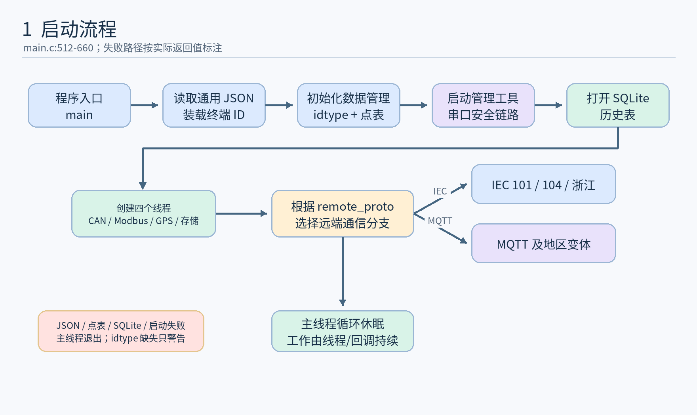
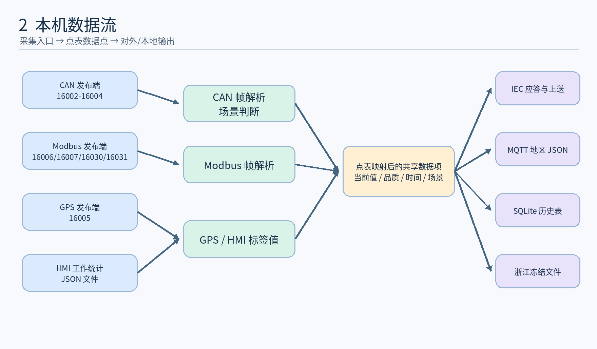
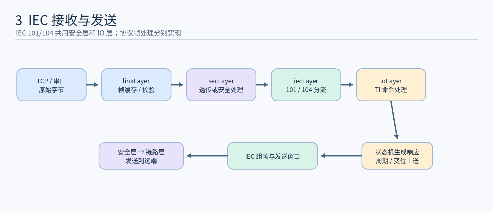
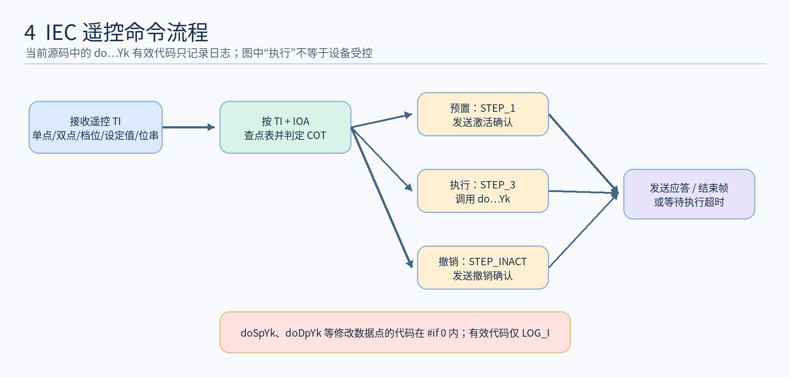
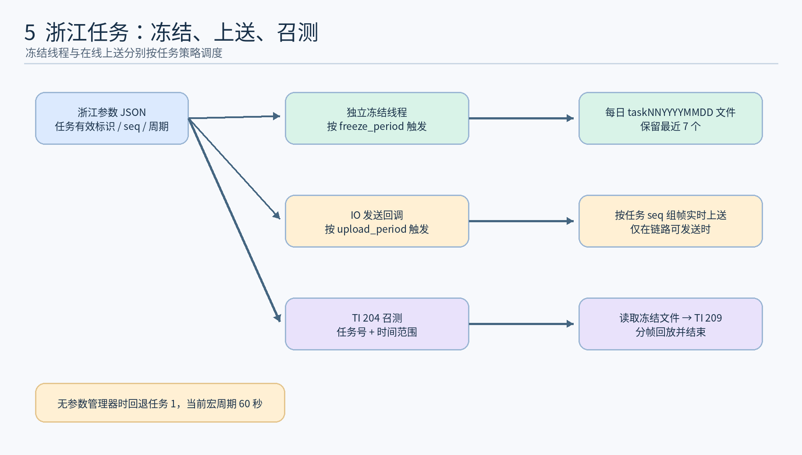
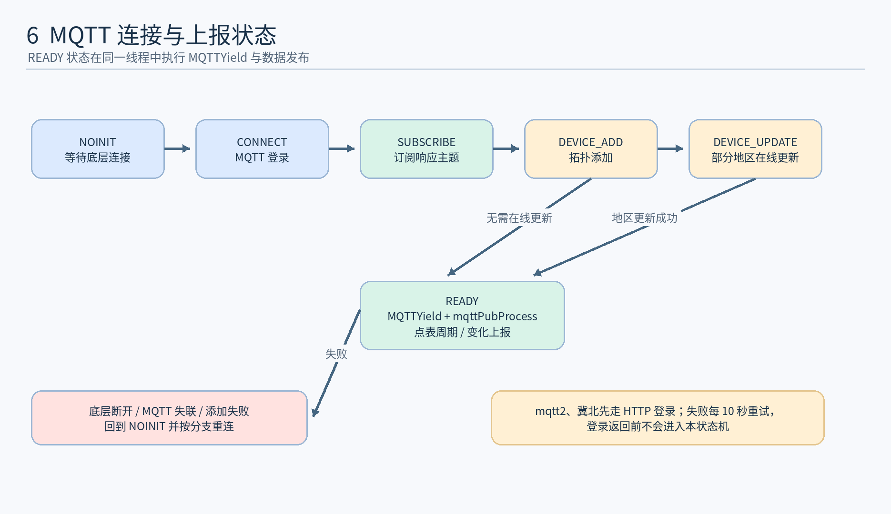

# iec_app 源码逻辑全景分析

> 核对基线：`rtms_sdk` 仓库分支 `rk3568_ubuntu_20241218`，提交 `dcd34abb`；源码目录 `apps/iec_app`。本文依据该提交的源码、CMake 和随附配置静态分析。流程图表达代码中的控制和数据调用关系，不代表已在设备上完成联调。下文的 `文件:行号` 均相对 `apps/iec_app`。

<!-- rtms-analysis-guide:start -->

## 文档目录

本报告对应 `rtms_sdk/apps/iec_app/` 在 `dcd34abb` 的源码；跨项目关系见[源码分析总览](../../源码分析总览.md)。下文原章节编号保留，先用概述、目录、架构、模块和流程五节建立整体脉络。

- [项目概述](#project-overview)
- [源码目录总览](#source-overview)
- [核心架构设计](#core-architecture)
- [核心模块深度分析](#core-modules)
- [关键流程与数据流](#key-flows)
- [1. 结论与边界](#analysis-1)
- [2. 构建与代码分区](#analysis-2)
- [3. 启动与整体数据流](#analysis-3)
- [4. 配置、外部资源与失败条件](#analysis-4)
- [5. IEC 通信链路](#analysis-5)
- [6. MQTT 链路与地区分支](#analysis-6)
- [7. 持久化、线程和时间来源](#analysis-7)
- [8. 有源码证据的限制和核对点](#analysis-8)
- [9. 术语与追源码入口](#analysis-9)
- [10. 设备现场故障排查](#analysis-10)

**顺读方式：**先读下面五节，再从原第 1 节起顺序阅读详细分析；需要查特定模块时，可用模块表跳到对应章节。

<a id="project-overview"></a>

## 项目概述

`iec_app` 从本机 CAN、Modbus 和 GPS 发布端汇集数据，依点表形成数据点，再按 `remote_proto` 选择 IEC 或 MQTT 对外链路。

<a id="source-overview"></a>

## 源码目录总览

以下路径相对于该提交的 `apps/iec_app/`；“职责”只描述源码中的构建或调用角色。

| 路径 | 职责 |
| --- | --- |
| `main.c`、`CMakeLists.txt` | 启动、协议分支和构建 |
| `src/config/`、`etc/` | 协议配置和随附样例 |
| `src/can_server/`、`src/modbus_server/`、`src/app_server/` | 订阅本机 CAN、Modbus、GPS 数据 |
| `src/data_process/` | 点表映射和数据点管理 |
| `src/iecLayer/`、`src/ioLayer/`、`src/linkLayer/` | IEC 101/104 及链路/设备接口 |
| `src/mqttLayer/`、`src/http/` | MQTT 地区分支及部分登录链路 |
| `src/db/` | SQLite 历史数据 |

<a id="core-architecture"></a>

## 核心架构设计

```text
本机 CAN / Modbus / GPS 发布端 → 订阅模块 → 点表 / 数据点
                                               ├→ 通用历史存储 → SQLite
                                               └→ remote_proto（择一）
                                                   ├→ IEC 101 / IEC 104 / 浙江扩展 → 主站
                                                   │                       └→ 仅浙江分支：冻结文件 / 定时任务
                                                   └→ MQTT / 地区分支 → 平台
```

remote_proto 选择对外链路；源文件中的 server 命名不表示该模块直接监听 CAN 或 Modbus 设备。地区配置与设备联调结果需分别核对。图中箭头表示源码中的数据或控制方向；外部服务和设备效果以正文标明的证据边界为准。

<a id="core-modules"></a>

## 核心模块深度分析

下表给出主链路模块的入口、关键判断和详细分析位置；具体函数、常量与失败路径以所链章节中的源码引用为准。

| 模块 | 源码入口 | 关键判断与输出 | 详细分析 |
| --- | --- | --- | --- |
| 采集与映射 | `src/can_server/`、`src/modbus_server/`、`src/data_process/` | 把本机消息按点表映射为数据点 | [进入章节](#analysis-3) |
| IEC 链路 | `src/iecLayer/`、`src/linkLayer/` | 依据协议模式处理链路状态、报文与遥控 | [进入章节](#analysis-5) |
| MQTT 分支 | `src/mqttLayer/`、`src/http/` | 地区分支、注册/登录和主题处理受配置选择 | [进入章节](#analysis-6) |
| 历史与时间 | `src/db/`、`src/data_process/` | 持久化和定时任务应结合启动条件判断 | [进入章节](#analysis-7) |

<a id="key-flows"></a>

## 关键流程与数据流

~~~text
配置 / 点表 / SQLite 初始化 → CAN、Modbus、应用消息、存储线程
共享数据点 → SQLite 历史采样
remote_proto → IEC 101 / 104（仅浙江分支另启冻结任务）
             或 MQTT / 地区分支 → 对外发送
~~~

[启动与采集图](#analysis-3)给出线程和数据点入口；[IEC 链路](#analysis-5)、[MQTT 分支](#analysis-6)应按实际配置选读；[存储与时间](#analysis-7)区分 SQLite 和浙江冻结。

<!-- rtms-analysis-guide:end -->

<a id="analysis-1"></a>

## 1. 结论与边界

`iec_app` 是设备数据汇聚及对外通信进程。它从本机 nanomsg 发布端订阅 CAN、Modbus、GPS 消息；用 JSON 点表把原始数据映射为遥信、遥测等数据点；再根据通用配置只选择 **IEC 101 / IEC 104 / 浙江 IEC 104** 或 **MQTT 及地区变体** 中的一类对外链路。与此同时，它运行串口管理工具通道和 SQLite 历史存储任务。浙江分支另有按任务配置冻结、实时上送和历史召测。入口及分支判断见 `main.c:512-650`。

此处的 `can_server`、`modbus_server` 是源文件及函数名：实现上均使用 `NN_SUB` 连接 `127.0.0.1` 的发布端，**并未在该模块里直接监听 CAN 设备或 Modbus 协议端口**（`src/can_server/can_server.c:94-126`，`src/modbus_server/modbus_server.c:108-140`）。对外服务器或客户端角色由 `tcp_mode` 决定，不能由应用名称推断。

<a id="analysis-2"></a>

## 2. 构建与代码分区

`CMakeLists.txt:1-56` 定义版本 `2.23`、目标 `iec_app`，递归收集 `src/*.c`，依赖 nanomsg、cjson、cn-cbor、curl、sqlite，链接 pthread、rt、stdc++。交叉编译只接受 `QL_MODULE_PLATFORM=RK3568_UBUNTU` 分支。构建生成启动级别 `1` 的 JSON；安装可执行程序到 `usr/local/bin`，安装 `iec_app_general.json`、`iec_app_pointsheet.json`、`iec_app_zj_paras.json` 到 `usr/local/etc`，并安装指定动态库。顶层 `apps/CMakeLists.txt:21` 纳入本项目。

| 目录/文件 | 代码职责 | 主要入口 |
| --- | --- | --- |
| `main.c` | 启动、配置、线程和协议分支 | `main`、`start_mng_tool_sevice`、`start_iec_app`、`start_mqtt_app` |
| `src/config/`、`src/iniparser/` | 通用 JSON 与 `/opt/conf.ini` | `load_general_config`、`GetEncConfig` |
| `src/can_server/`、`src/modbus_server/`、`src/app_server/` | 本机 CAN、Modbus、GPS 订阅；应用统计值 | `start_can_server`、`start_modbus_server`、`app_msg_task` |
| `src/data_process/` | 点表装载、原始帧解析、场景与数据点、IEC/MQTT/历史数据生成 | `data_mng_init`、`parse_common_msg`、`parse_modbus_msg`、各 `*_work_data_generate` |
| `src/scene/`、`src/scene_lib/` | 根据 CAN 帧判断 `power_on`、`idle`、`work`、`drive` 场景 | `load_libscene`、`judge_scene` |
| `src/linkLayer/` | TCP 客户端/服务端和串口收发；安全链路组帧 | `startLinkLayer`、`linkLayerProcData` |
| `src/secLayer/` | 透传或安全报文、证书/管理工具处理、安全芯片接口 | `startSecLayer`、`secLayerRecvCb` |
| `src/iecLayer/`、`src/ioLayer/` | IEC 101/104 帧状态、ASDU 分发、命令应答及上送 | `iecLinkProcess`、`ioLayerRecvCb`、`ioLayerSendCb` |
| `src/ioLayer/iec_zj_param.c`、`iec_zhejiang.c` | 浙江参数读写、任务调度、冻结文件和召测 | `zj_param_mng_load`、`zj_history_task_start` |
| `src/mqttLayer/`、`src/MQTTPacket/`、`src/http/` | MQTT 连接状态、订阅/拓扑注册、地区 JSON 上报、HTTP 登录 | `mqttLinkProcess`、`mqttPubProcess`、`httpLogin` |
| `src/db/`、`src/common/`、`src/list/` | SQLite、消息/定时器/队列及容器等支撑代码 | `db_open_db`、`queue`、`appTimer` |

`src/MQTTPacket/` 提供 MQTT 报文序列化/解析，`src/iniparser/` 和 `src/list/` 提供基础库实现；它们被 CMake 一并编入目标，但不是独立进程。

### C 源文件覆盖索引

按 `src/` 下的 `.c` 文件清单逐项核对，共 47 个。每行中省略目录的文件名沿用该行首个文件的目录。此表说明文件在项目中的职责和本文对应的分析位置；支撑库的内部每个函数不在主流程图中单独展开。

| 文件 | 核对结果与本文位置 |
| --- | --- |
| `src/app_server/app_server.c`、`gps.c` | 应用消息线程、GPS/HMI 数据入口；见第 3 节。 |
| `src/can_server/can_server.c`、`src/modbus_server/modbus_server.c` | 本机 nanomsg 订阅、帧转发至数据解析；见第 3 节。 |
| `src/common/appTimer.c`、`common.c`、`ipc_pubsub.c`、`queue.c`、`sany_list.c` | 定时器、十六进制转换、nanomsg 封装、队列、链表工具；服务上层模块，本身没有独立启动流程。 |
| `src/config/general_config.c`、`ini_process.c` | 通用 JSON 和 `/opt/conf.ini` 读取；见第 3、4 节。 |
| `src/data_process/data_mng.c`、`data_process.c`、`data_store.c` | 点表管理与解析、各协议数据生成、SQLite 采样任务；见第 3、4、7 节。 |
| `src/db/db.c` | SQLite 建表、写入和清理；见第 7 节。 |
| `src/http/http_login.c` | MQTT2/冀北前置 HTTP 登录；见第 6 节。 |
| `src/iecLayer/iec101.c`、`iec104.c`、`iecLayer.c` | 两类 IEC 链路状态机和公共分派/消息队列；见第 5 节。 |
| `src/iniparser/dictionary.c`、`iniparser.c` | INI 键值字典与解析器，由 `ini_process.c` 使用；见第 4 节。 |
| `src/ioLayer/iec_zhejiang.c`、`iec_zj_param.c`、`ioLayer.c` | 浙江任务/参数、IEC 命令和上送状态机；见第 5 节。 |
| `src/linkLayer/linkLayer.c`、`serial.c` | TCP/串口链路及 termios 串口基础操作；见第 5 节。 |
| `src/list/cc_common.c`、`cc_slist.c` | 单向链表及通用比较等容器支撑；点表解析使用 `cc_slist`。 |
| `src/mqttLayer/MQTTClient.c`、`MQTTLinux.c`、`mqttLayer.c` | MQTT 客户端报文循环/保活/订阅发布、Linux 计时与网络读写适配、项目状态与地区业务；见第 6 节。 |
| `src/MQTTPacket/MQTTConnectClient.c`、`MQTTConnectServer.c`、`MQTTDeserializePublish.c`、`MQTTFormat.c`、`MQTTPacket.c`、`MQTTSerializePublish.c`、`MQTTSubscribeClient.c`、`MQTTSubscribeServer.c`、`MQTTUnsubscribeClient.c`、`MQTTUnsubscribeServer.c` | CONNECT、PUBLISH、SUBSCRIBE、UNSUBSCRIBE 等 MQTT 报文的编码/解码与格式处理；由 MQTT 客户端层调用，见第 6 节。 |
| `src/scene/scene.c`、`src/scene_lib/scene_judge.c` | 场景配置及 CAN 数据驱动的场景判断；见第 3 节。 |
| `src/secLayer/secLayer.c`、`s1161y.c`、`s1161y_test.c`、`spi.c` | 安全报文及认证处理、芯片命令、特殊测试入口、SPI 底层；见第 3、5、8 节。 |

`src/MQTTPacket/` 与 `src/mqttLayer/MQTTClient.c` 是 MQTT 协议支撑代码；实际地区业务分支在 `mqttLayer.c`。以上文件职责可从各自实现及上层调用核对，例如 `src/mqttLayer/MQTTClient.c:253-401,480-753`、`src/mqttLayer/MQTTLinux.c:24-142`、`src/secLayer/s1161y.c:99-124,606-731`、`src/secLayer/spi.c:21-140`、`src/common/ipc_pubsub.c:9-78`。

<a id="analysis-3"></a>

## 3. 启动与整体数据流



1. `main.c:512-533` 先处理以 `s1161y_test` 名称调用的特殊入口；正常入口设置日志及版本。`SIGUSR1` 处理函数的实际动作被 `#if 0` 禁用（`main.c:33-42`）。
2. `load_general_config` 从固定路径读取 JSON；读不到或解析失败返回空指针，`main` 退出。`GetEncConfig` 从 `/opt/conf.ini` 取 `dev:id`、`dev:secret`；只有读得非空设备 ID 才覆盖通用配置里的 `terminal_id`。其返回值在 `main` 中未用于阻止启动（`main.c:534-558`，`src/config/ini_process.c:7-45`）。
3. `data_mng_init` 先尝试装载 idtype，再装载点表。idtype 失败只记录警告；点表失败使初始化返回空指针（`src/data_process/data_mng.c:8-36`）。随后 `start_mng_tool_sevice` 创建安全串口通道；`data_store_init` 打开 SQLite 并创建历史表，失败则 `main` 退出（`main.c:560-573`）。
4. CAN、Modbus、应用消息、存储四个线程依次创建；创建失败则退出。之后按 `remote_proto` 建立唯一的远端协议分支，最后主线程无限循环休眠（`main.c:574-660`）。

### 本机采集到数据点的路径



**读图边界：**图中的 IEC、MQTT、浙江冻结是数据点的潜在去向，并非同一配置下同时运行。`main.c:586-651` 通过 `remote_proto` 在 IEC 与 MQTT 分支间择一；浙江冻结任务只在 `iec104_zhejiang` 分支启动（`main.c:148-185`）。SQLite 历史存储任务则在协议分支选择前启动（`main.c:564-588`）。

CAN 接收线程按 3 个通道轮询，解析帧后同时调用 `parse_common_msg` 和 `judge_scene`；场景判断读取 CAN ID `0x171`、`0x172` 的速度类值并输出四种场景（`src/can_server/can_server.c:42-89`，`src/scene_lib/scene_judge.c:84-97`）。Modbus 线程按 4 个通道订阅并按从站 ID 查找点表规则（`src/modbus_server/modbus_server.c:54-103`）。GPS 消息及 HMI 工作时长/次数由应用消息线程转成带 `tag` 的应用数据点（`src/app_server/app_server.c:24-151`）。

点表解析读取设备、通道、原始报文规则和数据点定义，包括偏移、长度、字节序、符号、缩放、偏置、上下限、IEC TI/IOA、场景、上送阈值和周期等字段（`src/data_process/data_process.c:149-640,1947-2100`）。`parse_common_msg`/`parse_modbus_msg` 依端口及 CAN ID/从站 ID 找规则；匹配后把原始值转换并写到数据点当前值、品质和接收时间（`src/data_process/data_process.c:1662-1693`）。点表装载后，未收到采集数据的点以 IV（无效）位初始化，避免把初始值误判成一次变位自发上报（`src/data_process/data_process.c:1766-1817`）。IEC、MQTT、DB 生成函数均从该数据管理器取数；因此改点表会同时影响多个输出路径。

<a id="analysis-4"></a>

## 4. 配置、外部资源与失败条件

| 资源 | 代码中的用途 | 缺失/失败时的实际分支 |
| --- | --- | --- |
| `/usr/local/etc/iec_app_general.json` | 远端协议、TCP、地址、IEC 参数、MQTT 凭据等，见 `src/config/general_config.h` | 启动退出 |
| `/opt/conf.ini` | `dev:id` 覆盖 `terminal_id`；还读取 `dev:secret` | 文件或 ID 不可读时保留通用 JSON 中的 ID；若 ID 已读出但 secret 读取失败，`main` 仍会用该 ID 覆盖，因为它只检查 ID 是否非空 |
| `/usr/local/etc/iec_app_pointsheet.json` | 采集规则和数据点映射 | `data_mng_init` 失败，启动退出 |
| `/usr/local/etc/iec_app_idtype.json` | `idtypeindex` 对应设备类型信息 | 装载失败只警告；CMake 未安装此文件 |
| `/usr/local/etc/iec_app_zj_paras.json` | 浙江终端/设备参数及任务策略；固化写参数时写回 | 装载失败返回空管理器；浙江逻辑存在回退任务配置，行为应按部署环境核实 |
| `/root/iec_app.db` | SQLite `history_table(id,timestamp,name,value)` | 打开/建表失败，启动退出 |
| `/root/iec_app/HISTORY/TASK/` | 浙江任务每日冻结文件、历史召测回放 | 冻结时尝试创建；文件打开失败记录错误 |
| `/root/car_fei_3d/data/hmi_work_stats.json` | HMI 统计值 | 该轮工作时长/次数不更新 |
| `/dev/ttyS8`、`/dev/spidev0.0` | 管理工具串口、安全芯片 SPI | 由相应线程及芯片初始化分支处理，依目标设备 |
| 本机 nanomsg 发布端 | CAN、Modbus、GPS 消息来源 | 各订阅线程连接失败时返回，主线程未监测其后续退出 |

`general_config.c` 对缺失的部分字段设置默认值（如 `remote_proto=iec104`、`secure_mode=transparent`、`tcp_mode=tcp_client`、端口 `24068`），但前提是通用 JSON 文件本身能被读取并解析。配置结构及具体读取项见 `src/config/general_config.h:9-48`、`src/config/general_config.c:55-270`。`remote_proto` 的可识别值由 `main.c:590-651` 明确限定。`data_process.c` 中另有 `load_general_param` 和 `cbor_work_data_generate` 的实现，但在本项目当前源码中只找到定义/声明，未找到调用点；不能把它们写成当前主流程（`src/data_process/data_process.c:1696-1759,8567-8740`）。

<a id="analysis-5"></a>

## 5. IEC 通信链路

`start_iec_app` 为 `iec101`、`iec104`、`iec104_zhejiang` 选择 `app_proto`；由 `secure_mode` 选择安全链路或透传；由 `tcp_mode` 选择 TCP 客户端或服务端，并配置地址、端口、T0。`MAX_SESSION_COUNT` 当前为 `1`（`src/linkLayer/linkLayer.h:10-11`）。每个会话配置安全层、IEC 层和 IO 层，向下注册回调，最后调用 `startIoLayer → startIecLayer → startSecLayer → startLinkLayer`。IEC 层为处理线程创建 System V 消息队列，链路层启动 TCP/串口接收线程（`main.c:124-330`，`src/iecLayer/iecLayer.c:74-110`）。另有独立的 `/dev/ttyS8` 管理工具串口通道，即使远端协议为 MQTT 也会先启动（`main.c:85-121,564-568`）。



安全链路接收时，链路层缓存流数据并按 `0xEB...0xD7` 帧头尾、长度和校验拆包；透传时直接交安全层（`src/linkLayer/linkLayer.c:327-426`）。安全层依模式解密/分派管理工具或主站报文：应用类型 `0x00-0x08` 进入主站 IEC/MQTT 数据处理，`0x20-0x2F` 走网关处理，`0x30-0x4F` 走管理工具处理，`0x50-0x7F` 走主站管理处理；透传模式把数据交 IEC 或 MQTT 已注册的回调（`src/secLayer/secLayer.c:1661-1803`）。安全模式下，TCP 连通并不立即向 IEC/MQTT 报告“上层已连接”；收到主站 `0x60` 认证应用类型且后续条件满足时，才触发上层连接回调（`src/secLayer/secLayer.c:1097-1134,1805-1836`）。在 ARM/AArch64 上，`startSecLayer` 仍调用 `s1161y_init`，这一点不以 `secure_mode=transparent` 为条件（`src/secLayer/secLayer.c:1980-2010`）。

IEC 101 与 104 在 `iecLayerRecvCb` 分流。IEC 104 接收端识别 I/S/U 帧并投递到消息队列，处理线程管理序号、启动/停止/测试帧、T1/T2/T3 定时及发送窗口；I 帧 ASDU 解析 TI、VSQ、COT、COA、IOA 后回调 IO 层。IEC 101 使用独立的链路控制、确认及一级/二级数据流程（`src/iecLayer/iecLayer.c:200-214`，`src/iecLayer/iec104.c:450-620`，`src/iecLayer/iec101.c:413-610`）。

IEC 101 接收单字节 `0xE5`、固定长度 `0x10...0x16` 和可变长度 `0x68...0x16` 帧，校验和通过后入消息队列；其处理线程检查链路地址并处理链路复位、一级/二级轮询和重发。IEC 104 的报告定时事件只有在连接处于 STARTED 且发送窗口尚有余量时才触发 IO 发送；T1 超时重置会话，T2 触发 S 帧确认，T3 触发测试帧（`src/iecLayer/iec101.c:413-592,614-703`，`src/iecLayer/iec104.c:655-700`）。

`ioLayerRecvCb` 依据 TI 处理总召唤、计数召唤、单点读取、时钟同步/读取、测试、复位、延时，以及单点/双点、档位、归一化/标度/短浮点、位串遥控；浙江扩展再处理任务召测、读参数、写参数（`src/ioLayer/ioLayer.c:1493-1625`）。这些命令通常先更新 `io_proc` 状态和优先级，随后由 `ioLayerSendCb`/`io_do_pior_send` 分步发送确认、数据和结束帧，而不是简单同步返回（`src/ioLayer/ioLayer.c:32-142,3810-3930`）。常规 IEC 连接首次上送全量数据，之后检查遥信/遥测变位及周期上送；IEC 101 非平衡模式还区分一级/二级数据请求（`src/ioLayer/ioLayer.c:3892-3946`）。

### 常规 IEC 命令的实际执行边界

总召唤 `C_IC_NA_1` 在 `QOI=20` 时进入总召流程，`QOI=21-36` 时进入分组召唤流程；发送侧先发激活确认，再按 TI 分段发送数据，最后发结束帧，受发送窗口约束（`src/ioLayer/ioLayer.c:304-370,2605-2720`）。计数召唤、单点读取、时钟同步、测试、复位和延时均有独立的 `io_dn_*` 接收处理及 `io_up_*` 响应处理，不能把这些命令都理解为同一个“总召”路径（`src/ioLayer/ioLayer.c:371-920,2836-3360`）。



单点/双点、档位和设定值命令解读预置/执行位，按点表 TI+IOA 查找目标；点不存在时设置 `COT_UNKNOWN_IOA`。单点/双点还检查 `QU`，当前 `QU != 0` 的分支留有 TODO。发送状态机在预置确认后等待执行，单点/双点的等待时限为 10 秒（`src/ioLayer/ioLayer.c:1072-1190,1193-1415,2937-2990`）。**执行回调当前未真正操作输出或修改点值**：`doSpYk`、`doDpYk`、`doStYk`、`doMeNaYk`、`doMeNbYk`、`doMeNcYk`、`doBoYk` 的修改逻辑位于 `#if 0` 内，有效代码只 `LOG_I`。因此源码能证明“收到命令并走应答流程”，不能证明现场设备受控（`src/ioLayer/ioLayer.c:922-1070,1419-1490`）。

时钟同步 `doClockSync` 一面启动向 MCU 发送设时命令的线程，一面执行 `date -s` 修改本机系统时间（`src/ioLayer/ioLayer.c:587-700`）。`C_RP_NA_1` 且 `QRP=1` 的复位命令通过 `iec_delay_reset` 安排约 3 秒的定时事件；IEC 101/104 的超时处理在重置会话后调用 `exit(0)`，因此最终是**整个进程退出**，不是仅清理当前会话（`src/ioLayer/ioLayer.c:823-875`，`src/iecLayer/iecLayer.c:310-328`，`src/iecLayer/iec101.c:98-105,691-700`，`src/iecLayer/iec104.c:127-133,689-700`）。

### 浙江 IEC 104 扩展

此分支装载 `iec_app_zj_paras.json` 的终端/设备参数和任务策略；其读写参数 TI 为 `202/203`，任务召测 TI 为 `204`，历史冻结响应 TI 为 `209`。写参数采用预置、固化、撤销流程，固化时全量写回 JSON（`src/ioLayer/iec_zj_param.c:223-250,1069-1095,1098-1265`）。



冻结线程按每任务 `freeze_base/freeze_period` 调度，不依赖 IEC 在线状态；实时上送按每任务 `upload_base/upload_period` 在 IO 发送回调中调度（`src/ioLayer/iec_zhejiang.c:1139-1291`）。冻结文件目录为 `/root/iec_app/HISTORY/TASK`，每任务每天一个文件，默认值按十六进制字节串记录，代码按文件数保留最近 7 个匹配文件（`src/ioLayer/iec_zhejiang.h:39-49`，`src/ioLayer/iec_zhejiang.c:566-696`）。**不能直接把头文件开头“每 5 分钟”的说明当作当前固定周期**：实际配置以 JSON 任务策略为准；无参数管理器时回退宏 `ZJ_TASK_PERIOD_SEC` 当前为 `60` 秒。TI 204 召测按时间范围回放 TI 209 帧，并受 IEC 发送窗口约束（`src/ioLayer/iec_zhejiang.c:1009-1136`）。

<a id="analysis-6"></a>

## 6. MQTT 链路与地区分支

`start_mqtt_app` 将 `mqtt`、`mqtt2` 和宁夏、湖南、福建、河南、新疆、冀北、重庆配置映射为不同 `app_proto`；配置 TCP/安全层及终端 ID、客户端 ID、用户名、口令、位置字段和地区保留字段，再注册 MQTT 回调（`main.c:333-509`）。`mqtt2` 与冀北在非 `TEST_MQTT_JSON` 模式下先调用 HTTP 登录；冀北还读取安全芯片序列号（`main.c:605-647`）。

`httpLogin`/`httpLoginEx` 内部遇到失败会休眠 10 秒后再次请求，循环直至响应 `code=2000` 才返回；因此在这两个配置分支中，登录持续失败会阻塞后续 `start_mqtt_app`，而不是立即进入 MQTT 重连状态机（`src/http/http_login.c:252-298`，`main.c:605-647`）。



`startMqttLayer` 默认只创建 `mqttLinkProcess` 线程；独立发布线程由 `ENABLE_MQTT_PUB_TASK` 控制，当前宏值为 `0`，所以 READY 状态同一循环中调用 `MQTTYield` 和 `mqttPubProcess`（`src/mqttLayer/mqttLayer.h:15-31`，`src/mqttLayer/mqttLayer.c:2227-2265,2398-2423`）。接收字节进入队列，MQTT 客户端从队列取数据；响应主题由 `mqttMessageHandler` 分派到添加/更新设备解析器（`src/mqttLayer/mqttLayer.c:347-397,2352-2377`）。

| 配置值 | 源码分支与上报要点 |
| --- | --- |
| `mqtt` | 旧四川协议；使用单一 `device_id`，旧 JSON 上报。 |
| `mqtt2` | `PROTO_MQTT_SICHUAN`；同时走新旧数据格式，使用多个子设备 ID。 |
| `mqtt_ningxia`、`mqtt_hunan`、`mqtt_henan`、`mqtt_xinjiang`、`mqtt_chongqing` | 地区专用拓扑 JSON、设备 ID 匹配及数据/状态/事件生成函数；主题和服务类型不完全相同。 |
| `mqtt_fujian` | 采用 `/v1/{termId}/topo/request` 和 `/v1/{termId}/topo/response` 类型的拓扑请求/响应，解析 `CMD_TOPO_*`。 |
| `mqtt_jibei` | 单设备 ID 处理，登录使用芯片序列号；有专用上报函数。 |

上述差异来自 `main.c:358-377`、`src/mqttLayer/mqttLayer.c:66-397,1290-1440,1515-2265`。除旧协议外，发布流程按点表中的周期或变化触发生成地区 JSON；READY 的 `MQTTYield` 时间新协议为 5 秒、旧协议为 30 秒，因此代码循环节奏不同（`src/mqttLayer/mqttLayer.c:1430-1501,2227-2265`）。发布前一般要求底层连接且状态为 READY。`TEST_MQTT_JSON` 非 `0` 时进入测试 JSON 循环，填入测试设备 ID 并跳过真实登录与连接状态检查；这是代码里的测试路径，不能据此证明真实平台可用（`src/mqttLayer/mqttLayer.h:10-14`，`src/mqttLayer/mqttLayer.c:1535-1551`）。

<a id="analysis-7"></a>

## 7. 持久化、线程和时间来源

普通历史数据存于 `/root/iec_app.db` 的 `history_table`；`data_store_task` 用系统 uptime 控制约 10 秒采样一次，通过 `db_work_data_generate` 取点值并批量插入。启动时表行数超过 `15,552,000` 才删除 `1,555,200` 行，常量注释分别对应约 30 天和 5 天的设计估算；实际保留时长取决于每轮产生的行数（`src/data_process/data_store.c:10-94`，`src/data_process/data_store.h:4-12`，`src/db/db.c:28-131`）。浙江冻结是**另一套文件存储**，其计时使用墙上时间及各任务的策略，与该 SQLite 任务不同。

| 持续执行单元 | 创建位置 | 主要工作 |
| --- | --- | --- |
| 主线程 | `main.c:512` | 初始化后循环休眠；无统一线程监督或优雅退出逻辑 |
| 串口管理通道线程 | `start_mng_tool_sevice → startSecLayer → startLinkLayer` | `/dev/ttyS8` 安全管理工具报文 |
| CAN/Modbus/GPS/SQLite 四线程 | `main.c:574-588` | 本机订阅、点值更新、历史写入 |
| 远端链路接收线程 | `startLinkLayer` | TCP 客户端重连或服务端收发 |
| IEC 处理线程 | `startIecLayer` | System V 队列中的 IEC 101/104 帧、定时与 IO 回调 |
| MQTT 处理线程 | `startMqttLayer` | MQTT 状态机、订阅、拓扑与上报 |
| 浙江冻结线程 | `zj_history_task_start` | 按任务策略离线冻结和清理文件 |

<a id="analysis-8"></a>

## 8. 有源码证据的限制和核对点

1. **配置和启动失败路径**：通用 JSON、点表、SQLite、管理工具通道启动失败会使 `main` 退出；idtype 文件缺失只警告。`iec_app_idtype.json` 未列入当前 CMake 安装规则。参见 `main.c:534-573`、`src/data_process/data_mng.c:8-36`、`CMakeLists.txt:53-56`。
2. **运行副作用**：ARM/AArch64 的 `startSecLayer` 初始化 S1161Y；IEC 时钟同步执行 `date -s` 并向 MCU 发送设时命令，`QRP=1` 复位命令最终会使整个进程退出；浙江参数固化可重写配置文件。MQTT CONNECT 多次失败会调用 `systemctl restart Linux_tunnel.service`；宁夏分支长期无法建立底层连接时还会结束 `ctl_svr`、`proxy_client` 进程。参见 `src/secLayer/secLayer.c:1980-2010`、`src/ioLayer/ioLayer.c:587-874`、`src/iecLayer/iec101.c:691-700`、`src/iecLayer/iec104.c:689-700`、`src/ioLayer/iec_zj_param.c:1069-1095`、`src/mqttLayer/mqttLayer.c:1554-1647`。
3. **日志中的敏感字段**：`GetEncConfig` 记录 `devSecret`，MQTT 初始化成功路径记录配置中的 `password`。这是当前源码行为，部署时应审视日志访问权限（`src/config/ini_process.c:43`，`main.c:493-506`）。
4. **运行可观察性**：主线程没有监控四个订阅/存储工作线程的后续退出；成功调用 `pthread_create` 仅说明线程已创建。静态阅读无法证明外部发布进程、平台响应、设备节点、时钟与权限在目标机上均满足要求（`main.c:574-660`）。
5. **测试覆盖**：当前 `CMakeLists.txt` 没有 `enable_testing` 或测试目标；源码含 S1161Y 测试入口及 MQTT JSON 测试模式，但它们不等于 IEC、各地区 MQTT、冻结回放的完整自动化验证。

<a id="analysis-9"></a>

## 9. 术语与追源码入口

| 名词 | 含义 |
| --- | --- |
| TI / COT / COA / IOA | IEC 信息类型、传送原因、公共地址、信息体地址。`ioLayerRecvCb` 按 TI 分派；ASDU 解析还检查 COA/IOA。 |
| 遥信 / 遥测 / 遥控 | 状态量、测量量和下行控制操作；此项目在 `ioLayer.c` 中分别处理变位/周期上送及控制应答。 |
| `remote_proto` | 通用配置里选择远端协议的字符串，只在 `main.c` 指定的分支中生效。 |
| 点表 | `iec_app_pointsheet.json`，定义原始帧如何变成项目内部数据点，并影响 IEC、MQTT 和历史输出。 |
| 透传 / 安全模式 | `secure_mode` 控制数据直接交上层还是经安全链路组帧及安全层处理。 |
| 冻结 / 召测 | 浙江扩展按策略保存历史快照；主站按任务号与时间范围请求回放。 |

建议追踪顺序：`main.c` → `src/config/general_config.c` → `src/data_process/data_mng.c` / `data_process.c` → 采集入口 → `linkLayer.c` / `secLayer.c` → 所选 `iecLayer`+`ioLayer` 或 `mqttLayer` → `data_store.c` / 浙江文件路径。每条分支的具体报文格式仍以对应实现、点表和现场平台规范共同核对；本篇覆盖项目的主要调用链、状态与资源边界，不宣称逐条复述约 3.6 万行源码。

<a id="analysis-10"></a>

## 10. 设备现场故障排查

### 10.1 先记录现场，再定位故障层

以下命令在**故障设备**执行，默认用于读取信息；工具是否安装、日志是否由 journald 保存，取决于设备镜像。不要根据“服务在线”直接认定数据链全通：主线程进入休眠循环后，不监督 CAN、Modbus、GPS 或 SQLite 工作线程是否已经退出（`main.c:574-660`）。排查时先记下故障开始时间、设备时间/时区、程序版本、配置的 `remote_proto`、主站/平台地址、一个具体异常点的 tag 或 TI+IOA，以及最近一次正常上报时间。若多台设备共用平台，先比较故障是否同时发生。

```sh
date -Is
pidof iec_app
ps -ef | grep '[i]ec_app'
journalctl -t iec_app --since '1 hour ago' --no-pager
```

`main.c:529-532` 以 `iec_app` 为标识调用 `openlog`，`src/common/log_macro.h:5-11` 将 `LOG_D/I/W/E/F` 映射到 syslog。若 `journalctl` 不可用，查看设备实际的 syslog 收集方式（例如 `logread` 或 `/var/log` 下日志）；源码没有规定固定日志文件。日志可能含 `dev:secret`、MQTT 密码、设备 ID、报文内容（`src/config/ini_process.c:43`，`main.c:493-506`，`src/mqttLayer/mqttLayer.c:357-358`），导出前遮盖这些字段。

建议按以下顺序缩小范围；每步只在上一层有证据时继续：

| 现象 | 首先看什么 | 判断方向 |
| --- | --- | --- |
| 进程不存在或反复启动 | `start iec_app version` 后的第一条错误、进程退出时间 | 配置、点表、管理串口、SQLite 初始化，或远端分支启动失败；见 10.2。 |
| 进程在，但所有点都不更新 | 本机发布端、订阅线程、点表匹配 | 采集/解析层；见 10.3。 |
| 点值在变，但主站/平台没有数据 | TCP 状态，再看安全认证、IEC STARTDT 或 MQTT READY | 远端链路/协议层；见 10.4、10.5。 |
| 只有某些点错误或漏报 | 设备/端口/帧规则、tag、TI/IOA、品质、阈值/周期 | 点表和数据生成条件；见 10.3、10.6。 |
| 历史数据或浙江召测异常 | SQLite/冻结文件、任务配置、时间 | 持久化与时间；见 10.7。 |

### 10.2 进程起不来、反复退出或看似卡住

先确认实际执行文件及配置文件是否存在、能被运行身份读取，并核对启动日志中的版本。部署服务名由镜像决定，**不要预设**一定叫 `iec_app.service`。若使用 systemd，可先用 `systemctl status` 查询现场实际单元；没有单元时依据 `ps` 的父进程与启动脚本追踪。`CMakeLists.txt:42-56` 给出构建和安装路径，`main.c:512-660` 给出初始化顺序。

```sh
command -v iec_app
ls -l /usr/local/etc/iec_app_general.json /usr/local/etc/iec_app_pointsheet.json /usr/local/etc/iec_app_zj_paras.json /opt/conf.ini /dev/ttyS8
ls -ld /root /root/iec_app /root/iec_app/HISTORY /root/iec_app/HISTORY/TASK
df -h /root
```

| 日志或观察 | 对应代码路径 | 下一步 |
| --- | --- | --- |
| `failed to init p_data_mng` 紧随版本日志 | 实际是通用配置加载失败时的日志文字；`main.c:534-538` | 核查 `iec_app_general.json` 是否存在且 JSON 可解析；不要按日志文字误判为点表故障。 |
| `failed to init data_mng` | 点表装载/管理器初始化失败；`main.c:553-557`、`src/data_process/data_mng.c:8-36` | 核查点表 JSON、数据结构与读取权限；idtype 加载失败只有警告，不能单凭该警告解释退出。 |
| `failed to start mng tool service` | 安全芯片初始化或管理通道线程创建失败；`main.c:85-121,559-563`、`src/secLayer/secLayer.c:1980-2010` | 先查 `failed to init s1161y`、SPI 设备及线程创建错误。串口线程稍后才打开 `/dev/ttyS8`，因此该日志本身不能证明串口设备打开失败。 |
| `open db failed!` / `create tab failed!` / `failed to init data store` | `/root/iec_app.db` 打开或建表失败；`src/data_process/data_store.c:10-42`、`main.c:564-568` | 核查 `/root` 可写性、空间、文件权限和 SQLite 报错；先保留数据库副本。 |
| `invalid remote proto` | `remote_proto` 不在 `main` 支持列表；`main.c:590-655` | 核对 JSON 实际值与拼写。 |
| 进程仍在，反复 `http login failed and retry...` | `mqtt2` / `mqtt_jibei` 在远端 MQTT 初始化前循环 HTTP 登录；`main.c:605-647`、`src/http/http_login.c:252-298` | 核查 `http_url`、DNS/网络、HTTP 返回体的 `code` 与分配的服务地址；此时尚不能按 MQTT READY 问题处理。 |
| `IEC101/IEC104 Process Reset by Remote! Exit!` | 复位命令的定时路径最终 `exit(0)`；`src/iecLayer/iec101.c:691-700`、`iec104.c:689-700` | 核对主站是否发送 `C_RP_NA_1` 且 `QRP=1`，并联系主站操作时间；不能仅凭退出码 0 判为正常无故障。 |

`/opt/conf.ini` 的 `dev:id` 非空时会覆盖通用 JSON 中 `terminal_id`，因此排查身份不一致时应同时看两份配置（`main.c:540-551`，`src/config/ini_process.c:7-45`）。可用 `python3 -m json.tool 文件名` 或 `jq empty 文件名` 做**语法**检查；语法通过不表示必需字段、点表语义及平台身份都正确。检查配置时不要把密码和 secret 直接粘贴到工单。

### 10.3 CAN、Modbus、GPS 或点值不更新

本程序订阅本机 `tcp://127.0.0.1` 发布端；`nn_connect` 成功只代表订阅端建立连接请求，**不能证明持续收到有效帧**。源码中的端口如下（`src/can_server/can_server.h:9-11`，`src/modbus_server/modbus_server.h:9-12`，`src/app_server/gps.c:7-29`）：

| 来源 | 本程序订阅的端口 | 代码路径 |
| --- | --- | --- |
| CAN0/1/2 | 16002 / 16003 / 16004 | `src/can_server/can_server.c:94-126` |
| Modbus1/2/3/4 | 16006 / 16007 / 16030 / 16031 | `src/modbus_server/modbus_server.c:108-140` |
| GPS | 16005 | `src/app_server/gps.c:7-29` |

现场可用 `ss -lntp` 查看发布端是否在对应端口监听，再核对发布进程本身的状态和日志；`ss` 只证明 TCP 端口状态，不能证明 nanomsg 消息格式正确。订阅代码在 CAN/Modbus 的 `nn_poll` 或 `nn_recv` 遇到非暂时性错误会返回，工作线程随之结束；主线程仍可存活（`src/can_server/can_server.c:42-90`，`src/modbus_server/modbus_server.c:55-104`）。所以要查 `nn_poll`、`nn_socket`、`nn_connect` 错误，并结合 `/proc/<PID>/task` 的线程数变化判断；单次线程数不能区分具体哪个线程。

若发布端有数据，挑一个已知异常点沿着“物理源 → 本机发布端 → CAN ID/Modbus 从站与寄存器 → 点表原始规则 → 内部 tag/数据点 → IEC/MQTT 输出”逐项比对。CAN 解析按通道和 CAN ID 匹配，Modbus 解析还按从站 ID 匹配；某一规则不匹配可导致**部分点**不更新，而进程与网络仍正常（`src/data_process/data_process.c:149-640,1460-1693`）。核对点表的字节序、有无符号、偏移、长度、比例/偏置、上下限、场景及质量位，并看该点最近接收时间。初始点带 IV 无效品质，不能把“有点定义”误认为已收到有效采集数据（`src/data_process/data_process.c:1766-1817`）。GPS 另走 `gps_item_set`；HMI 工作统计从固定 JSON 文件读取，文件缺失时该轮只影响相应统计点（`src/app_server/app_server.c:24-151`）。

### 10.4 IEC 101/104 在线、掉线、无遥测或遥控无效

先从 `remote_proto`、`tcp_mode`、`secure_mode` 和端口确定当前走哪一条链路。IEC 101/104 的 TCP 客户端会记录 `start connect server`、`socket connect ... failed/success`，服务端接入会记录 `connected from ...`；断开会有 `recv error`/`select error`（`src/linkLayer/linkLayer.c:478-617`）。检查设备和主站两侧的实际地址/端口、监听/连接状态及防火墙。`ss -ntp` 可查看 TCP 状态；连接成功仅说明链路层已通。

下一步看安全层。如果配置安全模式，TCP 建立后仍需主站认证消息，安全层才通知上层连接；看认证/芯片相关错误，不要把“TCP ESTABLISHED”当作“IEC 已在线”（`src/secLayer/secLayer.c:1097-1134,1805-1836`）。ARM/AArch64 上即便是透传配置，启动安全层仍调用 `s1161y_init`；芯片/SPI 故障可能影响启动或安全流程，需结合返回值与设备节点核查（`src/secLayer/secLayer.c:1980-2010`，`src/secLayer/s1161y.c:99-124`）。

IEC 104 上层再看是否收到主站 STARTDT、是否进入 STARTED、是否总召/定时发送、是否卡在 T1/T2/T3 或发送窗口。可检索 `start cmd by master`、`start iec104 process after connected`、`start reports the full data once...`、`IEC104 Connection T1 timeout!` 等标志（`src/iecLayer/iec104.c:98-113,616-686`，`src/ioLayer/ioLayer.c:3892-3946`）。IEC 101 应另核查串口/链路地址、单字节及定长/变长帧校验、一级/二级数据请求，关注 `invalid linkAddr`、`invalid pubaddr`（`src/iecLayer/iec101.c:367,413-703`）。对于“链路在线但个别点不出”，再核对 COA、TI、IOA、点表品质、变化阈值和周期，不要只看 TCP。

若主站能下发遥控、看到 `YK: ioa ...` 却设备没有动作，先确认这份源码中 `doSpYk` 等执行回调的有效代码只有日志，真实输出操作位于 `#if 0`；“收到/应答”不能证明驱动了现场设备（`src/ioLayer/ioLayer.c:922-1070,1419-1490`）。若日志为 `COT_UNKNOWN_IOA`，先核对 TI+IOA 点表映射；单点/双点还要核对预置/执行顺序、10 秒执行等待及 `QU` 值（`src/ioLayer/ioLayer.c:1072-1190,2937-2990`）。

### 10.5 MQTT 登录、连接、订阅、注册与发布

按状态依次定位：**HTTP 登录（仅 MQTT2/冀北）→ TCP/安全层 → MQTT CONNECT/CONNACK → SUBSCRIBE → 添加/更新设备响应 → READY → PUBLISH**。日志中的 `start mqtt connect...`、`Connect to mqtt rc = ...`、`Subscribed ... ret = ...`、`mqtt link ready!` 分别是不同阶段，前一阶段成功不等于数据已被平台接收（`src/mqttLayer/mqttLayer.c:1595-1705,1770-2228`）。MQTT 接收处理依赖匹配的响应主题；订阅成功后仍应确认平台确有添加/更新设备响应（`src/mqttLayer/mqttLayer.c:205-397`）。

若 CONNECT 反复失败，核对 HTTP 返回的远端地址、端口和 client ID，以及用户名/口令、终端 ID、网络连接和安全模式；源码多次 CONNACK 失败会尝试重启 `Linux_tunnel.service`，这也是反复掉线时要关联的时间点（`src/http/http_login.c:99-108,252-298`，`src/mqttLayer/mqttLayer.c:1595-1647`）。若已 READY 而无数据，查 `mqtt publish ... failed`、订阅/注册回应、发布主题以及点表的变化/周期条件；地区分支的主题和 JSON 不同，按第 6 节对应配置值追踪。`TEST_MQTT_JSON` 模式能发送测试 JSON，但不能作为真实采集和平台注册成功的证据（`src/mqttLayer/mqttLayer.h:10-14`，`src/mqttLayer/mqttLayer.c:1535-1551`）。

### 10.6 单个点值异常或上送频率不符

固定一个具体点，记录**源通道、CAN ID 或 Modbus 从站/寄存器、原始字节、点表规则、内部 tag、TI/IOA、平台侧最终值和各自时间戳**。先验证原始帧，之后按点表的字节序、符号位、缩放和偏置手算一次，再对比上报值；这样能区分采集错误、映射错误和协议编码错误（`src/data_process/data_process.c:149-640,1947-2100`）。若值正确但不按预期上报，核对品质 IV、场景条件、变化阈值、周期及 IEC 连接/窗口状态或 MQTT READY 状态。源码里存在未在当前主流程调用的生成函数，不要将它们当成现场上报路径（`src/data_process/data_process.c:1696-1759,8567-8740`）。

### 10.7 SQLite、浙江冻结与历史召测

普通历史表在 `/root/iec_app.db`；约每 10 秒尝试采样一次。若表没有新增行，先分清是 `data_store_task` 已退出、`db_work_data_generate` 没生成记录，还是 SQLite 插入失败；看 `failed to insert db`、空间/权限和点表状态（`src/data_process/data_store.c:45-94`，`src/db/db.c:56-131`）。若设备上有 `sqlite3` 命令，可只读查询：

```sh
sqlite3 'file:/root/iec_app.db?mode=ro' 'SELECT count(*), max(timestamp) FROM history_table;'
```

此命令的 `mode=ro` 用于避免排查时写入数据库；不存在数据库或不支持该 URI 模式时不要用普通打开方式临时建库。数据库清理只在启动时检查行数阈值，不能把“超过 30 天”直接当成清理失败，保留时间由每轮入库条数决定（`src/data_process/data_store.c:34-41`）。

浙江冻结另存于 `/root/iec_app/HISTORY/TASK/`。看 `zj history task started`、`zj task ... freeze triggered`、`zj store snapshot -> ...` 或 `zj failed to open history file`，并核对任务号、点表映射、任务策略、系统时间、目录空间/权限（`src/ioLayer/iec_zhejiang.c:566-696,1240-1291`）。若冻结有文件但召测为空，核对 TI 204 请求的任务号、起止时间与文件日期，以及主站 COA/发送窗口；回放完成日志为 `zj interrogate done`（`src/ioLayer/iec_zhejiang.c:847-1136`）。冻结和任务触发使用墙上时间，IEC 时钟同步会修改系统时间；时间跳变可能改变任务触发和召测范围，应比较设备时间与主站时间（`src/ioLayer/ioLayer.c:587-700`，`src/ioLayer/iec_zhejiang.c:1139-1291`）。

### 10.8 形成可复现证据与处理结论

排查记录至少包括：故障时间窗、软件版本/构建、实际配置的协议分支、脱敏配置摘要、一个受影响点的完整映射、对应发布端状态、链路阶段日志、平台/主站响应、SQLite 或冻结文件的时间证据。把结论写成“**在哪一层首次观察到异常**”和“**该层上游是否正常**”，不要仅凭单条 `connected`/`ready` 日志认定全部功能正常。需修改配置或重启进程时，先保存现状和日志，确认现场运维窗口及回退方案；复位、清库、改系统时间、抓取含凭据的完整报文均可能改变现场状态。本文的命令是通用只读示例，实际镜像中的进程管理器、日志后端和工具可用性仍应在设备上确认。

### 10.9 进程崩溃、高负载或进程在却不工作

**进程反复消失**时，先把“正常代码调用 `exit`”与“信号崩溃/系统终止”分开。源码明确的进程退出路径包括初始化失败、非法 `remote_proto`、冀北芯片序列号获取失败，以及 IEC 远程复位后的 `exit(0)`（`main.c:534-655`，`src/iecLayer/iec101.c:691-700`，`src/iecLayer/iec104.c:689-700`）。如没有这些对应日志，再检查设备内核是否报告段错误、OOM 或进程被外部服务重启。下面命令仅查询；是否有 coredump 取决于设备设置：

```sh
journalctl -k --since '1 hour ago' --no-pager
coredumpctl info iec_app
```

看到 `Segmentation fault` 或 core 文件后，应保存**与故障设备二进制完全对应**的构建版本和符号文件，再用回溯定位线程与调用栈；本篇静态阅读无法给出具体崩溃行。看到 OOM 记录时同时采集故障前后内存、进程 RSS 和 SQLite/冻结文件所在文件系统空间，不能把所有自动重启都归因于程序崩溃。若日志中只有 `start iec_app version` 周期性出现，还要确认是进程自身退出，还是外部进程管理器定时拉起。

**进程仍在但长时间没有业务进展**时，比较两次采样，而不是仅看一次 PID。`main` 本身始终休眠；CAN/Modbus 线程等待 nanomsg，IEC 线程读 System V 消息队列，MQTT 线程按状态循环，数据库线程按 uptime 采样，因此等待状态不一定是死锁（`main.c:657-665`，`src/can_server/can_server.c:42-90`，`src/modbus_server/modbus_server.c:55-104`，`src/iecLayer/iecLayer.c:27-38`，`src/mqttLayer/mqttLayer.c:1530-1552,2227-2265`，`src/data_process/data_store.c:82-94`）。现场可按实际 PID 查询：

```sh
ps -o pid,ppid,stat,etime,%cpu,%mem,nlwp,rss,cmd -p 1234
ps -T -p 1234 -o pid,tid,stat,%cpu,wchan:24,comm
ls -l /proc/1234/fd
ipcs -q
```

示例中的 `1234` 要替换为 `pidof iec_app` 查到的实际 PID。连续比较线程数、CPU、RSS、文件描述符数与最新业务日志；线程数下降提示某工作线程退出，持续高 CPU 要定位具体 TID，RSS/FD 持续增长要结合时间和负载判断。IEC 初始化会在 `/tmp/iec-key-<句柄地址>/` 创建路径，再由 `ftok`/`msgget` 创建消息队列；启动失败可能只写 `stderr` 中的 `Creat Key Error`、`Creat Message Error`，要同时查看进程管理器收集的标准错误，核查 `/tmp` 和消息队列资源（`src/iecLayer/iecLayer.c:74-110`）。`ipcs -q` 只能说明队列存在，不能证明 IEC 线程在处理报文；不要在诊断时直接删除队列。

### 10.10 本排查指南的覆盖边界

以上步骤覆盖本仓库可由源码确定的启动条件、资源路径、主要日志、采集和协议状态机、持久化及明确退出路径。它们**不能单独证明**外部 CAN/Modbus 发布程序、主站、MQTT 平台、芯片固件和现场接线的行为；这些环节需要对应进程日志、主站记录、平台响应或经过授权的现场测试交叉验证。若某个症状没有落在表中，仍按第 10.1 节的层次顺序找首次异常点，并以实际设备版本对应的源码核对，避免把本分支静态结论套用到不同构建。
