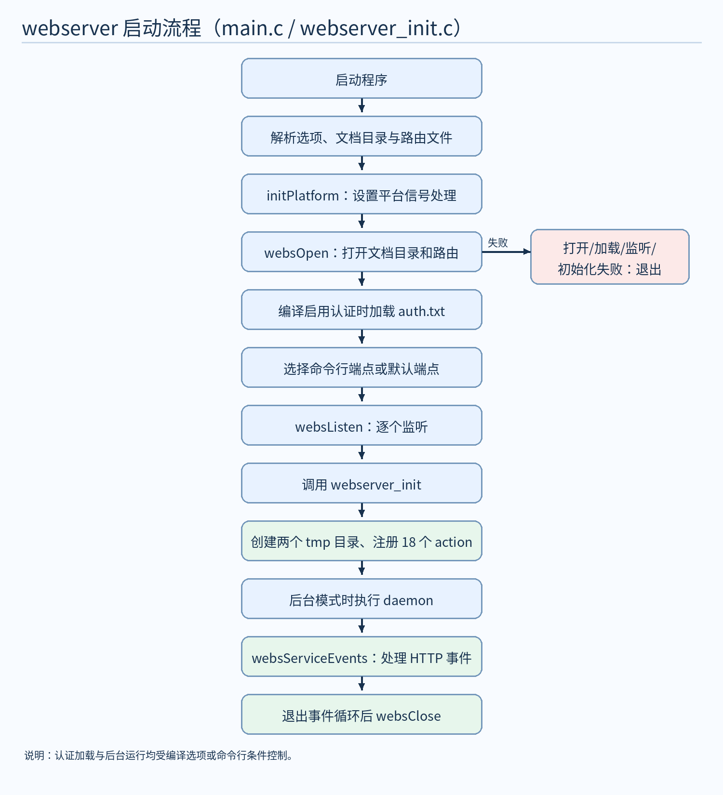
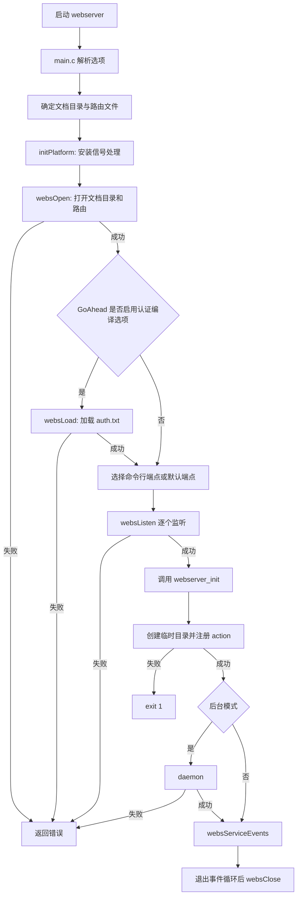
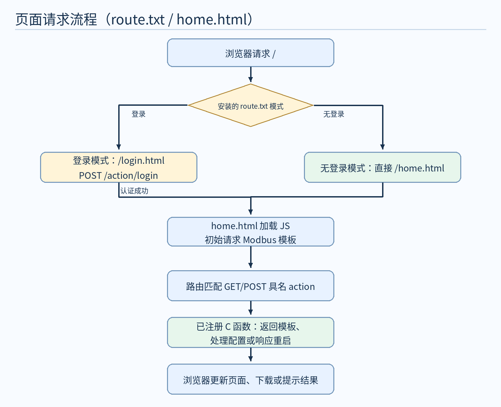
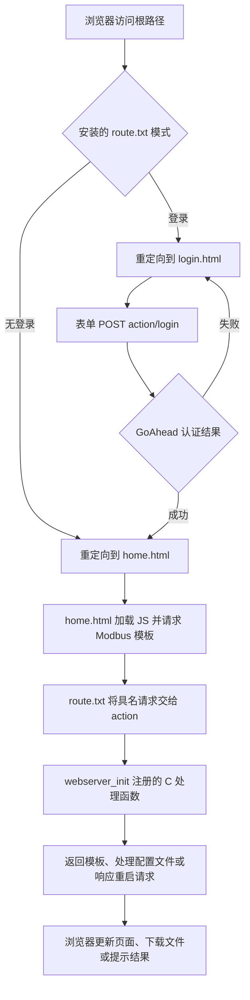
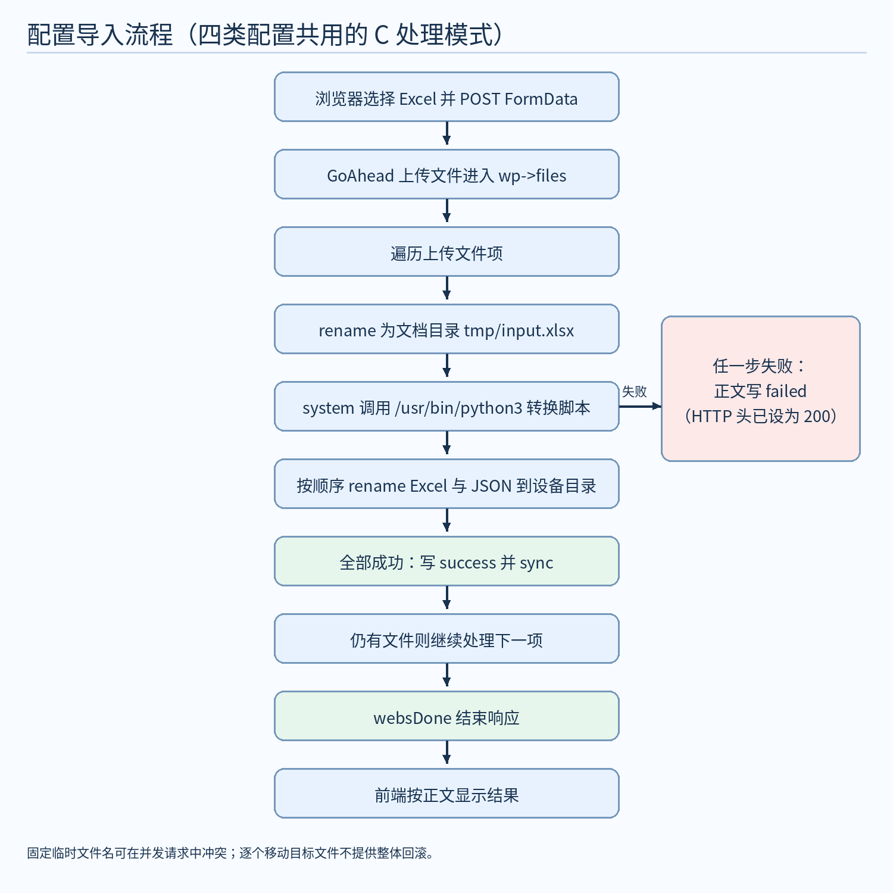
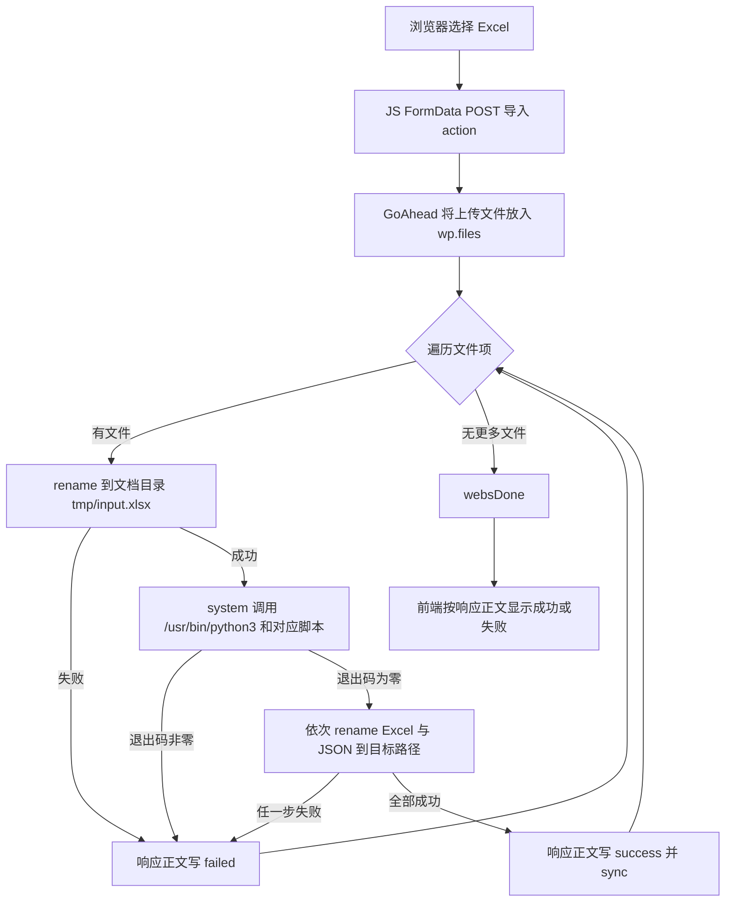
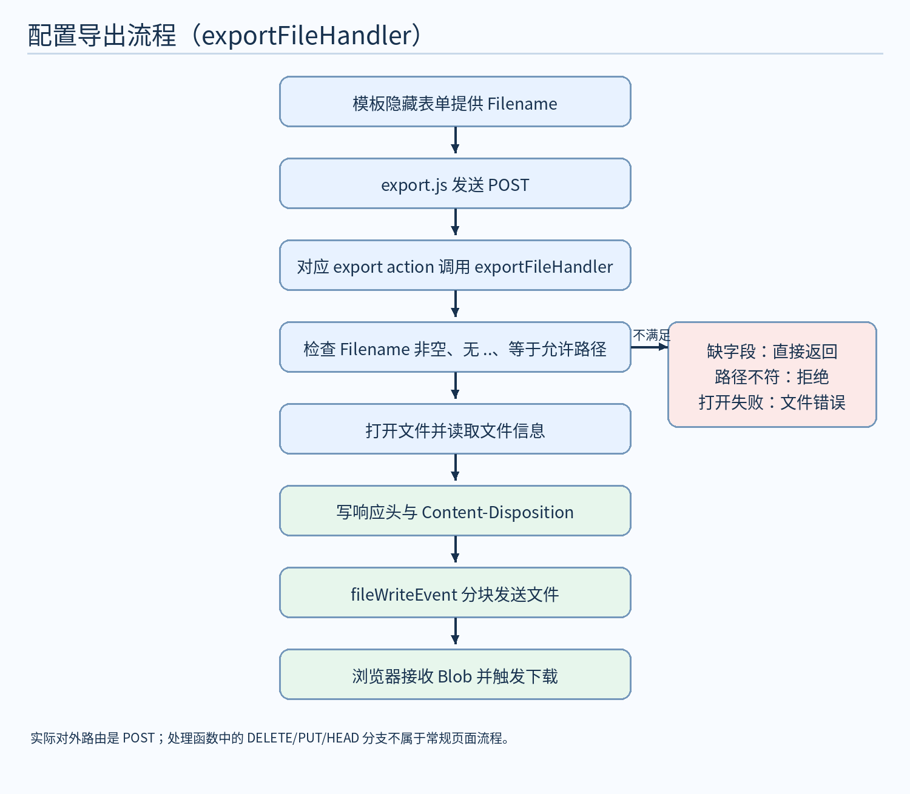
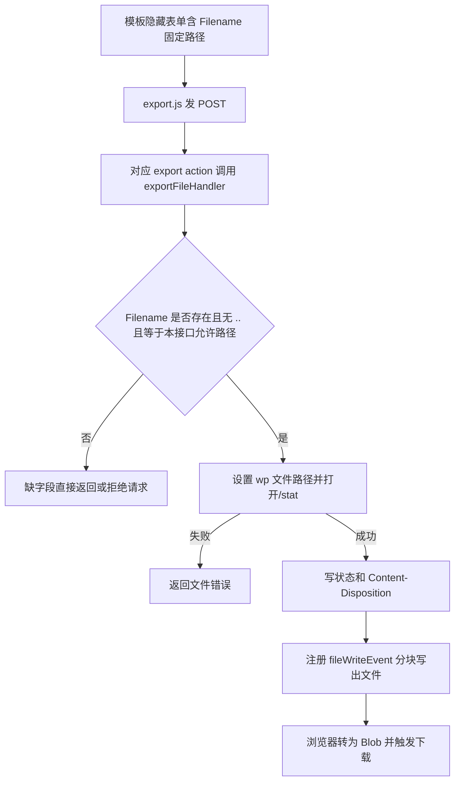

# webserver 源码分析

**流程图导航：**[启动流程](#32-启动流程图) · [页面请求流程](#41-页面请求流程图) · [导入流程](#51-导入流程图) · [导出流程](#53-导出流程图)。每节先嵌入 PNG 图片，普通 Markdown 预览器即可显示；后附 Mermaid 源码供修改。

<!-- rtms-analysis-guide:start -->

## 文档目录

本报告对应 `rtms_sdk/apps/webserver/` 在 `dcd34abb` 的源码；跨项目关系见[源码分析总览](../../源码分析总览.md)。下文原章节编号保留，先用概述、目录、架构、模块和流程五节建立整体脉络。

- [项目概述](#project-overview)
- [源码目录总览](#source-overview)
- [核心架构设计](#core-architecture)
- [核心模块深度分析](#core-modules)
- [关键流程与数据流](#key-flows)
- [1. 分析范围与结论边界](#analysis-1)
- [2. 系统组成和职责](#analysis-2)
- [3. 构建、安装与运行入口](#analysis-3)
- [4. HTTP 路由与页面流程](#analysis-4)
- [5. action 清单与文件去向](#analysis-5)
- [6. 页面与代码中的已确认限制](#analysis-6)
- [7. 设备故障排查：从现象定位到代码](#analysis-7)
- [8. 核对依据与验证状态](#analysis-8)

**顺读方式：**先读下面五节，再从原第 1 节起顺序阅读详细分析；需要查特定模块时，可用模块表跳到对应章节。

<a id="project-overview"></a>

## 项目概述

`webserver` 基于 GoAhead 提供设备配置页面，处理 Excel 配置导入、固定配置文件导出与重启请求；实际认证效果受安装路由和运行库配置影响。

<a id="source-overview"></a>

## 源码目录总览

以下路径相对于该提交的 `apps/webserver/`；“职责”只描述源码中的构建或调用角色。

| 路径 | 职责 |
| --- | --- |
| `main.c`、`CMakeLists.txt` | GoAhead 初始化、构建和安装 |
| `src/webserver_init.c` | 临时目录和 action 注册 |
| `src/action_handle.c`、`src/action_handle.h` | 页面、导入、导出及重启处理 |
| `src/auth_pam.c` | 认证扩展函数；效果受路由与 GoAhead 配置制约 |
| `www/route_auth.txt`、`www/route_noauth.txt` | 安装时二选一的路由配置 |
| `www/template/`、`www/js/`、`www/scripts/` | 页面模板、浏览器脚本与 Excel 转换 |
| `3rdparty/goahead/` | SDK 随附的第三方服务器源码包，位于应用目录外 |

<a id="core-architecture"></a>

## 核心架构设计

```text
浏览器 → GoAhead 路由 / 认证 → webserver_init 注册的 action
                                     ↓
             action_handle → 模板 / Excel 转换 / 配置文件
                                     ↓
                              HTTP 响应或设备文件
```

安装的路由受 ENABLE_LOGIN_AUTH 影响；设备实际链接的 GoAhead 构建、认证和文件权限仍需现场核对。图中箭头表示源码中的数据或控制方向；外部服务和设备效果以正文标明的证据边界为准。

<a id="core-modules"></a>

## 核心模块深度分析

下表给出主链路模块的入口、关键判断和详细分析位置；具体函数、常量与失败路径以所链章节中的源码引用为准。

| 模块 | 源码入口 | 关键判断与输出 | 详细分析 |
| --- | --- | --- | --- |
| HTTP 入口 | `main.c`、`src/webserver_init.c` | 加载文档目录和路由，监听后注册 action | [进入章节](#analysis-3) |
| 页面与路由 | `www/`、`src/webserver_init.c` | URL、前端请求和注册函数三者需对应 | [进入章节](#analysis-4) |
| 导入与导出 | `src/action_handle.c`、`www/scripts/` | 上传、转换、部署与下载为不同阶段 | [进入章节](#analysis-5) |
| 认证边界 | `src/auth_pam.c`、`www/route_auth.txt` | 认证效果受编译配置、路由和实际库共同约束 | [进入章节](#analysis-6) |

<a id="key-flows"></a>

## 关键流程与数据流

~~~text
启动 → GoAhead 加载文档目录 / 路由 → 监听并注册 action
浏览器请求 → 路由 / 认证 → 对应 action
  ├→ 导入：上传文件 → 转换脚本 → 配置文件
  └→ 导出：读取目标文件 → 分块写回 → 浏览器下载
~~~

图和实现细节分别见[启动](#analysis-3)、[页面请求](#analysis-4)、[导入及导出](#analysis-5)；安装路由的认证模式由构建配置选择，设备上的实际效果还须结合[认证边界](#analysis-6)。

<!-- rtms-analysis-guide:end -->

<a id="analysis-1"></a>

## 1. 分析范围与结论边界

- 源码位置：`rtms_sdk/apps/webserver`；核对时 Git 分支为 `rk3568_ubuntu_20241218`，提交为 `dcd34abb`。本文依据该版本中的 `CMakeLists.txt`、`main.c`、`src/`、`www/` 文本源码和配置，以及 SDK 随附的 `3rdparty/goahead/goahead-6.0.4.tar.gz` 中相关源码撰写。
- `www/bootstrap/`、jQuery、`www/libgo.so`、`www/webserver` 是随目录放置的第三方资源或二进制；本文只说明它们在项目中的引用和安装方式，不把它们的内部实现当作已核实的源码事实。
- 以下“会执行”“会写入”指代码到达相应分支时的行为。随附 GoAhead 源码可解释路由与认证的实现，但设备实际链接的库、默认监听值、文件权限及服务启动方式还需现场核对；不能仅凭仓库源码断言设备上的实际效果。

<a id="analysis-2"></a>

## 2. 系统组成和职责

| 层次 | 源码 | 可确认的职责 |
| --- | --- | --- |
| 构建 | `CMakeLists.txt`、`global_config.h.in` | 生成 `webserver`，选择安装的认证/非认证路由，安装网页和库。 |
| HTTP 入口 | `main.c` | 解析参数、调用 GoAhead、监听端点、进入事件循环。 |
| action 注册 | `src/webserver_init.c` | 创建两个临时目录，注册配置和重启 action。 |
| 业务处理 | `src/action_handle.c/.h` | 返回 HTML 片段、接收上传、运行转换脚本、导出固定文件、请求重启。 |
| 认证扩展 | `src/auth_pam.c`、`www/auth.txt` | 定义名为 `authPamVerify` 的函数及 GoAhead 用户/角色数据；实际调用与认证效果还受 GoAhead 构建影响。 |
| 浏览器端 | `www/home.html`、`www/login.html`、`www/template/`、`www/js/` | 导航、表单、异步请求、下载、登录/退出界面。 |
| 路由 | `www/route_auth.txt`、`www/route_noauth.txt` | 设置 URL、HTTP 方法、处理器、认证标记与重定向。 |
| 数据转换 | `www/scripts/xlsx2json1.py` 至 `xlsx2json4.py` | 使用 `openpyxl` 把四类 Excel 工作簿转换为 JSON。 |

该服务负责配置文件的网页管理；本目录没有实现 Modbus、IEC、MQTT 或 CAN 通信栈。主页的“MQTT/IEC上数配置”只是页面标签，不能据此推断本服务直接执行上数协议。

### 2.1 GoAhead 是什么，与本程序是什么关系

**GoAhead 是嵌入式 HTTP/Web 服务器软件。** SDK 在 `3rdparty/goahead/` 中放有 GoAhead 6.0.4 源码包与构建脚本；本项目 `CMakeLists.txt` 查找并链接 `goahead` 库。设备上的 `webserver` 是本项目编译出的应用程序，GoAhead 是它使用的服务器库；浏览器访问的是运行中的 `webserver` 进程，而不是独立运行的“GoAhead 页面”。

按当前代码，一次请求依次涉及：`main.c` 调用 `websOpen` 加载文档目录和路由并用 `websListen` 监听；GoAhead 根据 `route.txt` 选择文件处理器或 action 处理器；文件处理器读取 `www/` 页面资源，action 处理器调用本项目在 `webserver_init.c` 注册的 C 函数；函数处理配置文件并通过 GoAhead API 写 HTTP 响应。`websServiceEvents` 持续处理事件。换言之，**GoAhead 提供 HTTP 基础能力，本项目决定页面内容和设备配置操作**。这些调用可在 `main.c:108-174`、`src/webserver_init.c:29-55`、`src/action_handle.c` 直接核对。

源码中能逐项对应的接口如下：

| 调用/对象 | 由谁使用 | 在本项目中的作用 |
| --- | --- | --- |
| `websOpen(documents, route)` | `main.c` | 初始化 GoAhead，将文档目录交给服务器并加载路由文件。随附 GoAhead `src/http.c` 在此期间初始化 action、文件、上传和认证等已编译功能。 |
| `websListen(endpoint)` | `main.c` | 在给定 HTTP 端点监听；具体端口来自启动参数或编译宏。 |
| `websServiceEvents(&finished)`、`websClose()` | `main.c` | 处理请求事件，结束后释放服务器资源。 |
| `websDefineAction(name, fn)` | `src/webserver_init.c` | 把 action 名字和 C 函数放入 GoAhead 的 action 表；随附 GoAhead `src/action.c` 根据请求路径查表并调用函数。 |
| `Webs *wp` | `src/action_handle.c` | 当前 HTTP 请求上下文；代码从中读取请求方法、表单字段和上传文件，并向其中写状态、响应头和响应正文。 |
| `websGetDocuments()` | 初始化和导入处理器 | 获取文档目录，用于创建上传目录和拼接脚本、临时文件路径。 |
| `websSetStatus`、`websWriteHeaders`、`websWrite`、`websDone` | 业务处理器 | 依次设置状态、写响应头和正文、结束请求；导出文件另用背景写回调分块发送。 |

例如，浏览器请求 `GET /action/load_modbus_app_web`：`route.txt` 选择 `handler=action`，GoAhead 从路径取出 `load_modbus_app_web`，在注册表中找到同名函数，再由本项目的 `load_template` 读取 `template/modbus_app_web_template.html` 并返回 HTML。浏览器请求 `POST /action/import_modbus_app_settings` 时，GoAhead 解析上传请求并将文件信息交给 `Webs *wp`，本项目函数再移动文件、调用 Python 脚本、部署配置。**文件是否成功导入是本项目逻辑的结果，HTTP 连接、路由和请求分发则由 GoAhead 提供。**

几个容易混淆的词：`route.txt` 是 URL 到处理方式的规则表；`action` 是按名字注册、由 `/action/<名字>` 分发的 C 回调；“文档目录”是 GoAhead 读取网页资源的根路径；“工作目录”是进程解释 `route.txt`、`auth.txt`、`template/...` 等相对路径时所在目录，两者可能不同。随附 GoAhead `src/action.c` 会按 action 名查注册表，查不到时产生 404；其 `src/auth.c` 在初始化认证时注册内置的 `login/logout` action。

**版本边界：**上面关于 GoAhead 内部的描述已核对 SDK 随附的 `goahead-6.0.4.tar.gz`；设备实际加载的 `libgo.so` 是否由同一配置、同一源码构建，应以设备二进制和部署记录核对。不能把 SDK 源码包的默认宏值直接当作设备上的监听端口或认证配置。

<a id="analysis-3"></a>

## 3. 构建、安装与运行入口

### 3.1 构建与安装

`CMakeLists.txt:1-46` 要求 CMake 3.11，项目版本 1.10；查找 nanomsg 1.2、cjson 1.7.15、cn-cbor 1.0、curl 7.69.1、sqlite 3.39.0、goahead 6.0.4。`main.c` 与递归收集的 `src/*.c` 组成目标，`global_config.h.in` 生成版本宏；链接命令列有 nanomsg、cjson、pthread、rt、stdc++、cn-cbor、curl、sqlite3 和 goahead。列表表示构建要求，不能推断各库都由本目录业务代码直接调用。

交叉编译时 CMake 只接受环境变量 `QL_MODULE_PLATFORM=RK3568_UBUNTU`，否则配置失败；工具链、库目录和其他 `MY_*` 变量由上层构建环境提供。`STARTUP_LEVEL_APP` 设为 1，构建前写出 `webserver_startup_level.json`。本目录只生成该文件，没有显示其安装规则；设备如何读取启动级别需查上层工程。

`ENABLE_LOGIN_AUTH` 为缓存变量，默认 `0`，只允许 `0/1`。安装时以 `route_noauth.txt` 或 `route_auth.txt` 生成 `usr/local/www/route.txt`；同时安装两个原始路由文件、`www/` 资源、目标程序与动态库（`CMakeLists.txt:48-74`）。源码中的 `www/route.txt` 内容与 `route_noauth.txt` 相同，但被 `install(DIRECTORY www ...)` 的模式排除，安装所用路由由开关决定。`www/` 内另有预置的 `webserver` 和 `libgo.so` 二进制；不能把它们当作当前源码编译结果来分析。

### 3.2 启动流程图



Mermaid 源码：



依据 `main.c:46-179`、`src/webserver_init.c:7-55`。`main.c` 默认路由名为 `route.txt`、认证文件名为 `auth.txt`；默认文档目录和端点来自 GoAhead 宏。`--home` 会在打开服务前切换进程工作目录。参数可指定文档目录及一个或多个端点；未指定时遍历默认端点，未启用 SSL 编译选项会跳过包含 `https` 的端点。Unix 分支在退出事件循环前处理 `SIGTERM`，忽略 `SIGPIPE`。后台模式在注册 action 后调用 `daemon(0,0)`。具体宏值和设备启动命令不在本目录中。

`webserver_init` 先尝试建立工作目录的 `tmp/`，再建立 `websGetDocuments()/tmp`；失败返回 -1。随后调用 `websDefineAction` 注册 18 个 action（Modbus 4、IEC 5、显示 5、摄像头 3、重启 1）。已存在目录仅凭 `EEXIST` 视作成功，代码未进一步验证它确实是目录。

<a id="analysis-4"></a>

## 4. HTTP 路由与页面流程

| 模式 | `/` | `/login.html` | `/home.html` | 配置/重启 action |
| --- | --- | --- | --- | --- |
| `ENABLE_LOGIN_AUTH=0` | 重定向到 `/home.html` | 重定向到 `/home.html` | 文件处理 | 按 GET/POST 路由；没有 `auth=form` 标记 |
| `ENABLE_LOGIN_AUTH=1` | 重定向到 `/login.html` | 文件处理 | `auth=form`，失败重定向登录页 | 具名路由带 `auth=form`；登录/退出 action 另列 |

两套路由都将 `/js`、`/css`、`/bootstrap` 交给文件处理器，也在末尾写有宽泛的 `route uri=/action handler=action` 与 `route uri=/`。本目录未包含 GoAhead 路由匹配实现，因此不能仅据这些行断言宽泛路由的访问控制效果；上线时需要结合实际 GoAhead 构建验证。

登录模式的 `POST /action/login` 和 `POST /action/logout` 来自路由配置，`src/webserver_init.c` 未注册同名业务函数；SDK 随附的 GoAhead `src/auth.c` 在 `websOpenAuth` 中注册了这两个内置 action。随附源码默认文件认证分支使用 `websVerifyPasswordFromFile`，它会核对用户与密码摘要；PAM 是另一条由编译选项和认证存储配置决定的分支。`main.c` 只有在 `ME_GOAHEAD_AUTH` 编译为真时才调用 `websLoad(auth.txt)`。本项目 `src/auth_pam.c:8-29` 的 `authPamVerify` 不调用 PAM，也不比较输入密码；在随附 GoAhead 的默认认证注册链中没有看到它被调用，因此**不能把这个函数等同于当前登录校验**。实际设备认证模式仍需核对其 `libgo.so` 构建配置。`www/auth.txt` 存在静态用户数据，文档不复制其中凭据。

`home.html` 加载 Modbus、IEC、显示/摄像头和导出脚本，初始请求 Modbus 片段；点击导航时异步 GET 对应 `load_*_web`，成功后将返回的 HTML 插入 `#content_data`。显示配置模板内同时放有摄像头表单，页面没有单独的摄像头加载动作。主页请求 `/login.html`，根据最终 URL 判断是否隐藏 Logout；在其认为是登录模式时设置 5 分钟无活动自动提交 `/action/logout`。这是前端界面逻辑，不等于服务端会话过期策略。

### 4.1 页面请求流程图



Mermaid 源码：



该图只展示路由中声明的登录/重定向分支和主页实际请求链。`action/login` 的认证结果由 GoAhead 处理，本目录没有该 action 的 C 实现；图中“成功/失败”对应 `route_auth.txt` 配置的 `200/401` 重定向，**并不证明**当前构建一定能正确完成认证。

<a id="analysis-5"></a>

## 5. action 清单与文件去向

下表的请求方法来自 `www/route_*.txt`；处理函数名来自 `src/webserver_init.c`。导入表中的 JSON 是转换脚本实际生成后由 C 代码移动到设备目录的文件。

| 类别 | 加载 GET | 导入 POST / 脚本 | 导出 POST / 目标文件 |
| --- | --- | --- | --- |
| Modbus | `load_modbus_app_web` | `import_modbus_app_settings` / `xlsx2json1.py` | `export_modbus_app_excel_settings` → `/usr/local/etc/modbus_app_config.xlsx`；`export_modbus_app_json_settings` → `/usr/local/etc/modbus_app_config.json` |
| IEC | `load_iec_app_web` | `import_iec_app_settings` / `xlsx2json2.py` | `export_iec_app_excel_settings` → `/usr/local/etc/iec_app_config.xlsx`；`export_iec_app_gen_json_settings` → `/usr/local/etc/iec_app_general.json`；`export_iec_app_pts_json_settings` → `/usr/local/etc/iec_app_pointsheet.json` |
| 显示 | `load_display_app_web` | `import_display_app_settings` / `xlsx2json3.py` | `export_display_app_excel_settings` → `/root/final_config/display_config.xlsx`；`export_display_app_mdb_json_settings` → `/root/final_config/modbus_config.json`；`export_display_app_can_json_settings` → `/root/final_config/can_config.json` |
| 摄像头 | **没有实现的加载函数** | `import_camera_app_settings` / `xlsx2json4.py` | `export_camera_app_excel_settings` → `/root/car_fei_3d/data/sources.xlsx`；`export_camera_app_json_settings` → `/root/car_fei_3d/data/sources.json` |
| 设备 | — | `request_reboot`：POST | — |

IEC 导入还生成 `/usr/local/etc/iec_app_idtype.json`，但路由、注册函数及模板中都没有对应的导出接口。摄像头的 `load_camera_app_web` 写在两个路由文件里，却未在 C 代码定义或注册；其业务表单位于显示模板。`UPGRADE_WEB_TEMPLATE`、`www/template/upgrade_web_template.html`、`www/js/upgrade.js` 和 `www/scripts/start_upgrade.sh` 存在，但 `load_upgrade_web`、`start_upgrade` 没有 C 实现或路由/注册，主页也未加载 `upgrade.js`；从当前网页入口不能确认升级功能可用。

### 5.1 导入流程图



Mermaid 源码：



依据 `src/action_handle.c:323-380,409-472,503-564,587-645` 与四个 `www/js/*_app.js`。C 处理器先写 HTTP 200 和 `text/plain` 头，再检查方法是否为 POST；对 `wp->files` 每项执行同类步骤。上传文件被移动为 `文档目录/tmp/input.xlsx`；脚本路径和输出 JSON 路径也拼接在文档目录下。转换命令通过 `system()` 执行，并依赖 `/usr/bin/python3`、`openpyxl`。成功时 `sync()`，错误时返回正文 `failed`；没有上传文件时不写成功或失败文字。这里的“成功”只表示本处理函数走到所有 `rename()` 成功分支，不表示下游应用已加载新配置。

四种导入共用固定的 `tmp/input.xlsx`、`tmp/output1.json` 等文件名，没有请求级隔离。多个请求交错时可能互相覆盖或读取彼此的临时文件；这是由固定路径和逐请求复用直接推出的并发风险。Excel 和 JSON 按顺序分别 `rename()`，其中一步失败不会回滚先前已移动的文件，因此可能留下部分更新。代码未显式创建目标配置目录，也未清理转换失败留下的临时文件。

### 5.2 转换脚本的数据规则

| 脚本 | 输入工作表与关键列 | 输出结构 |
| --- | --- | --- |
| `xlsx2json1.py` | 活动工作表；`port`、`baudrate`、`data_bit`、`stop_bit`、`parity`、`description`、`slave_id`、`function_code`、`read_address`、`read_quantity` | 以 `port` 为键聚合串口参数和 `modbus_point.point` 数组；没有 `port` 的行跳过。 |
| `xlsx2json2.py` | `general`、`pointsheet`、`idtype` 三个工作表 | 分别输出通用配置对象、含 `sce/dev/app` 的点表对象、`idtype` 数组对象。 |
| `xlsx2json3.py` | `modbus_config` 与 `can_config` 工作表，各自按首行列名取值 | 两个 JSON 数组，分别是 Modbus 点位和 CAN 点位。 |
| `xlsx2json4.py` | 活动工作表，至少有 `name`、`url` 列 | 摄像头对象数组；写 JSON 时设置 `ensure_ascii=False`。 |

`xlsx2json2.py` 对 `general` 只读取第 2 行；第 33 列及其后统一转字符串，若干指定字段也转字符串。`pointsheet` 取 `A1:AC1` 作为列名，按 `scene` 的逗号和 `interval_ms` 的冒号拆分值；将 `sign`、`value_type` 转为数字编码，并为缺少 `cbor_idx` 的点从 50 起分配编号。非 `app` 点按 `port`（代码索引范围 0–3）放入 `dev`，`app` 点放入 `app`；`idtype` 表输出 `index/equipId/equipType/unitId/unitType`。脚本直接索引工作表和列名，未对缺表、缺列、非法端口和空值做完整预检查；异常由 `run_convert` 捕获并以非零退出码交给 C 层。`general` 无第 2 行时，`config_tmp` 未赋值即被返回，也会进入错误分支。

### 5.3 导出流程图



Mermaid 源码：



依据 `src/action_handle.c:131-314,382-393,474-491,566-583,647-658`、`www/js/export.js`。每个导出函数传入唯一允许路径；处理器先拒绝包含 `..` 或与允许路径不相等的 `Filename`，再打开、查询并通过背景写回调按最多 8192 字节读取发送。响应写入 `Content-Disposition`，前端将响应转成 Blob 并尝试从该头提取文件名。缺少 `Filename` 时函数直接返回 0；具体最终 HTTP 响应由 GoAhead 后续逻辑决定，本目录不能确认。源码还保留 DELETE、PUT、目录、HEAD、条件请求分支，但具名导出路由只允许 POST，不能将这些分支描述为当前页面上的常规功能。

### 5.4 重启

`www/js/reboot.js` POST `/action/request_reboot`；`request_reboot` 先发送正文 `success` 并结束响应，然后同步执行 `system("sleep 5; reboot")`（`src/action_handle.c:661-674`）。所以前端看到 200/`success` 只说明 HTTP 处理器已响应，不能证明设备已经成功重启。不要在开发主机上直接调用该入口。

<a id="analysis-6"></a>

## 6. 页面与代码中的已确认限制

1. **认证结论需要运行时验证。** `ENABLE_LOGIN_AUTH` 只控制安装哪份路由；`ME_GOAHEAD_AUTH`、`auth=form` 和设备上实际链接的 GoAhead 库共同决定登录行为。随附 GoAhead 源码有文件密码校验实现，项目的 `authPamVerify` 函数自身没有密码检查，且未见其在默认认证注册链中被引用。宽泛的 `route uri=/action handler=action` 没有显式 `auth=form`；其实际访问效果应在目标设备上核对，不能仅按具名路由推断所有 action 都受保护。
2. **同名 JS 函数覆盖。** `home.html` 顺序加载 `modbus_app.js`、`iec_app.js`、`display_app.js`，三者都在全局定义 `exportExcel()`；后加载的显示版本覆盖前两者。它们均提交当前片段中的 `id_form_2`，所以部分页面仍可能完成下载，但日志函数名和真实模块不一定一致。当前片段中的通用 `id_form` 等 ID 被复用，页面一次只插入一个配置片段。
3. **固定临时文件和非原子部署。** 导入复用同名文件并依次移动目标，存在请求交错及部分更新风险，见 5.1 节。
4. **错误反馈粒度有限。** 导入错误通常仍以 HTTP 200 返回正文 `failed`；浏览器只比较 `success` 字符串，没有展示 Python 详细错误。导出前端只按 HTTP 成功与否显示结果。
5. **模板加载存在字符串边界问题。** `load_template` 按文件长度执行 `calloc(1, length)`、`fread(..., length, ...)`，随后用 `%s` 输出；文件读满缓冲区时没有预留结尾的 `\0`，可能越界读取（`src/action_handle.c:41-68`）。这是源码层面的内存安全风险，本文未通过运行测试量化影响。
6. **资源与入口不一致。** 摄像头加载路由和升级资源的情况见第 5 节；存在文件不等于存在可用 HTTP 功能。
7. **依赖部署环境。** 目标目录可写、Python 和 `openpyxl` 可用、GoAhead 宏及链接库正确，是功能运行所需条件；本目录源码未证明这些条件在设备上全部成立。

<a id="analysis-7"></a>

## 7. 设备故障排查：从现象定位到代码

以下命令用于**目标设备**上的只读检查；示例中的 `<PID>`、`<端口>` 要换成现场值。先记录故障时间、URL、请求方法、HTTP 状态、响应正文、浏览器 Network/Console 信息和服务日志，再做任何重启或重新导入。不要把密码、会话 Cookie、含敏感配置的完整文件贴进公开日志。设备是否由 systemd 管理、服务名和日志路径不由本目录定义，先查实际启动方式。

### 7.1 第一层：进程、版本、工作目录、监听

```sh
ps -ef | grep '[w]ebserver'
readlink -f /proc/<PID>/exe
readlink -f /proc/<PID>/cwd
tr '\0' ' ' < /proc/<PID>/cmdline
ss -ltnp
```

先确认进程是否存在、实际执行的是哪个二进制、启动参数是否带 `--home`/`--route`/`--auth`/端点，以及实际监听端口。不要预设端口是 80：`main.c` 可从命令行接收端点，未给端点时又取决于编译进 GoAhead 的默认宏。若进程不存在，检查启动日志中 `Cannot change directory`、`Cannot initialize server`、`Cannot load`、`Cannot create directory`、`Cannot run as daemon` 等信息；它们分别对应 `main.c` 的工作目录切换、`websOpen`、`websLoad`、`webserver_init` 和 `daemon` 分支。库加载失败时可在设备上用 `ldd /usr/local/www/webserver` 检查缺失的动态库，但二进制实际路径应以 `/proc/<PID>/exe` 或启动配置为准。

SDK 随附的 `3rdparty/goahead/build.sh` 构建命令设置了 `ME_COM_SSL=0`；若 HTTPS 无法监听，先核对设备用的库是否按该脚本构建，再查服务端点，勿把源码包中的默认 HTTPS 端点当成当前设备一定支持的功能。

**特别检查后台模式：**`main.c` 在初始化后调用 `daemon(0,0)`。该调用通常会把工作目录改为 `/`；而 `load_template` 以相对路径 `template/...` 打开文件。若后台进程的 `/proc/<PID>/cwd` 不是包含 `template/` 的目录，页面片段可能 404。这是由调用顺序和相对路径得出的排查方向，须以设备进程的工作目录及日志验证。`main.c` 的 `logHeader` 会记录当前 Directory、Documents、版本、构建类型等信息；这些字段有助于比对部署，但记录发生在进入后台模式之前，不能代替检查当前 `/proc/<PID>/cwd`。

### 7.2 第二层：HTTP 是否到达程序

确认实际端口后，只对安全的 GET 地址做探测：

```sh
curl -i http://127.0.0.1:<端口>/
curl -i http://127.0.0.1:<端口>/login.html
curl -i http://127.0.0.1:<端口>/home.html
```

连接失败：优先看进程、监听地址/端口、端口占用和网络转发；这还未到业务 action。收到重定向：与安装的 `route.txt` 模式核对。首页或静态资源 404：检查文档目录的 `home.html`、`js/`、`css/`、`bootstrap/` 是否存在且可读，以及运行时使用的路由文件是否为安装版；`CMakeLists.txt` 的 `ENABLE_LOGIN_AUTH` 只在构建/安装时决定复制哪个文件，不能从源码默认值推断现场模式。模板 GET 404：再检查工作目录下 `template/...` 与 `load_template` 的相对路径。

可在设备上只读比较路由文件：

```sh
ls -l /usr/local/www/route*.txt /usr/local/www/home.html /usr/local/www/template
diff -u /usr/local/www/route_auth.txt /usr/local/www/route.txt
diff -u /usr/local/www/route_noauth.txt /usr/local/www/route.txt
```

如果实际文档目录不是 `/usr/local/www`，上述路径应按 `Documents` 日志和进程参数调整。探测 `GET /action/load_modbus_app_web` 可区分“静态首页可读”与“action 注册/模板读取异常”；仅在确认访问授权后进行。GoAhead 随附源码在 action 未注册时会返回 `Action ... is not defined` 的 404。摄像头独立加载 action 当前确实未实现，不能将其 404 当成设备偶发故障。

### 7.3 第三层：登录与权限

登录页能显示但登录失败时，按顺序检查：实际 `route.txt` 是否为认证版；实际 GoAhead 构建是否启用了 `ME_GOAHEAD_AUTH`；进程读到的 `auth.txt` 路径、文件存在与权限；浏览器中 `POST /action/login` 的状态及跳转。随附 GoAhead 源码会注册内置 `login/logout`，默认文件认证分支校验用户与密码摘要；本项目的 `authPamVerify` 不应被当成有效密码校验的证据。不要为了排障在文档或工单中展示 `auth.txt` 的口令/摘要。

若“具名 action 需要登录，但另一路径似乎可访问”，重点核对 `route_auth.txt` 末尾没有 `auth=form` 的宽泛 `/action` 路由。随附 GoAhead 的路由代码按顺序匹配规则，并仅在匹配路由有认证类型时调用 `websAuthenticate`；具体部署是否存在绕过，要在隔离环境以未登录会话验证，不能仅凭浏览器界面或此处推断安全结论。`home.html` 的 5 分钟自动退出是前端计时，不表示服务端会话恰好 5 分钟过期。

### 7.4 第四层：导入 Excel 失败或导入后不生效

浏览器显示 `Import failed!` 时，先看 Network 中导入请求的响应正文。C 处理函数通常先设置 HTTP 200，再在具体错误处写 `failed`；所以 **HTTP 200 不能代表导入成功**。结合日志定位阶段：

| 日志/现象 | 对应源码阶段 | 优先核对 |
| --- | --- | --- |
| `Cannot rename uploaded file`，目的地为 `tmp/input.xlsx` | GoAhead 上传临时文件 → 文档目录 | 文档目录下 `tmp/` 是否为目录、可写；空间和挂载点；源/目标是否跨文件系统。 |
| `exec: /usr/bin/python3 ...` 后 `failed to exec cmd` | 运行 `xlsx2jsonN.py` | `/usr/bin/python3`、`openpyxl`、脚本及输入工作簿是否可读；工作表/列名是否符合第 5.2 节。 |
| `Cannot rename uploaded file`，目的地为设备配置文件 | 逐个部署 Excel/JSON | 目标目录是否存在、可写、剩余空间与挂载点；此前文件可能已经移动成功。 |
| 响应 `success`，下游应用仍读旧配置 | 本服务已移动文件并 `sync()` | 核对目标文件内容/时间，再查消费该文件的应用是否重新加载；本目录没有通知下游重载的代码。 |

只读检查示例：

```sh
ls -ld /usr/local/www/tmp /usr/local/etc /root/final_config /root/car_fei_3d/data
df -h /usr/local/www /usr/local/etc /root/final_config
python3 -c 'import openpyxl; print(openpyxl.__version__)'
ls -l /usr/local/etc/modbus_app_config.xlsx /usr/local/etc/modbus_app_config.json
python3 -m json.tool /usr/local/etc/modbus_app_config.json >/dev/null
```

这些路径只是代码中的默认目标与安装路径示例，现场文档目录和故障模块要按实际情况替换。`rename()` 跨文件系统可能失败；日志给出的 `errno` 比“导入失败”提示更有定位价值。脚本没有完整的表头和数据预校验，缺少工作表、列或错误类型会使 Python 返回非零；不要反复向生产设备上传同一个文件来试错。需要复现时先备份现有配置，并在隔离目录运行对应 `xlsx2jsonN.py`，检查其退出码与 JSON 结构。

### 7.5 第五层：导出、页面与重启

- **导出 403：**`exportFileHandler` 发现 `Filename` 含 `..` 或与该导出接口允许的固定路径不完全相等。比较模板隐藏表单的值、实际 POST 字段和 C 常量。**导出 404：**文件打开或查询失败，检查相应目标文件是否存在、可读。前端 `Export failed!` 也可能是网络错误；以 Network 状态与响应为准。缺少 `Filename` 时函数直接返回，最终状态需看实际 GoAhead 响应。
- **页面空白或配置片段不显示：**先看 `GET /action/load_*_web` 的状态，再看进程当前工作目录和 `template/` 文件。`load_template` 失败时由代码返回 404 和 `Page not found!`；JS 只有在 200 时才插入片段。浏览器 Console 若有脚本错误，还需核对 `www/js/` 文件是否实际加载。已确认的全局 `exportExcel()` 覆盖问题见第 6 节。
- **点击重启后设备未重启：**`request_reboot` 先回 `success`，再执行 `sleep 5; reboot`。HTTP 200 只能说明 action 已响应；结合 `system going to reboot after 5 seconds` 日志、设备启动记录和系统权限判断命令是否执行。排障时不要用 POST 重启接口作无害探测。

### 7.6 日志、复现和交接记录

`main.c` 支持 `--log <日志文件:级别>`、`--verbose`（设为 `stdout:2`）、`--route`、`--auth`、`--home` 和端点参数。先从现有进程参数或设备启动脚本确认日志去向；如果由 systemd 托管，再按实际服务名读取 `journalctl`。不要在仍有生产进程监听时另起同端口实例，也不要直接把日志改到未授权的目录。

定位后留下一份最小证据：设备软件/二进制版本、进程命令行与工作目录、实际监听端点、安装版路由、请求 URL/方法/状态/响应、相关日志时间点、目标文件的存在与修改时间、Python 版本及转换脚本退出码。把现象归到“未启动/未监听 → 路由或认证 → action/文件路径 → Python 转换 → 目标文件部署 → 下游应用”中的一个阶段，再去修改对应源码或部署配置。

<a id="analysis-8"></a>

## 8. 核对依据与验证状态

已静态核对：本项目构建与安装规则、18 个已注册 action、两个路由版本、三个实际加载的页面脚本、四个转换脚本、模板中的表单路径、`main.c` 的启动分支，以及 SDK 随附 GoAhead 6.0.4 源码包中的 action 注册、认证与路由代码。流程图按这些调用顺序绘制，缺失功能单独标明。未在目标设备执行启动、上传、下载、登录或重启测试；因此诊断章节给出的是可核查的定位路径，而不是设备故障已经发生或已被复现的结论。
