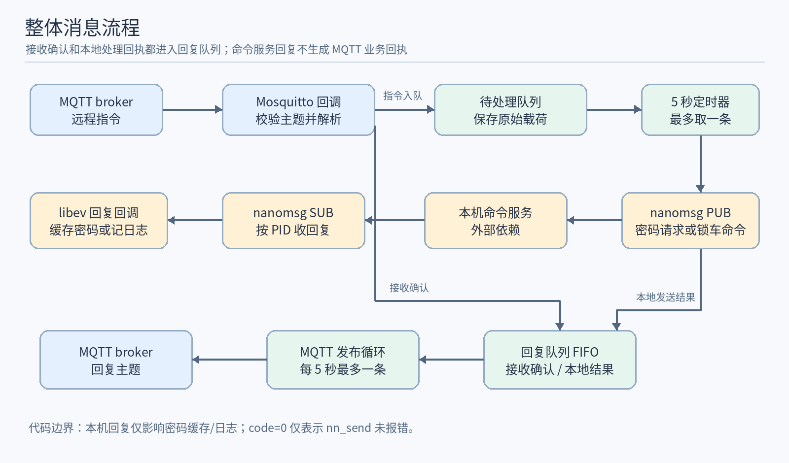
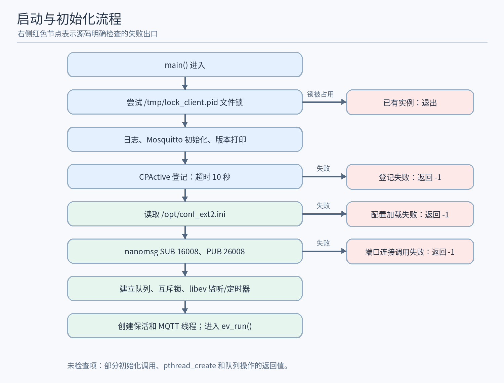
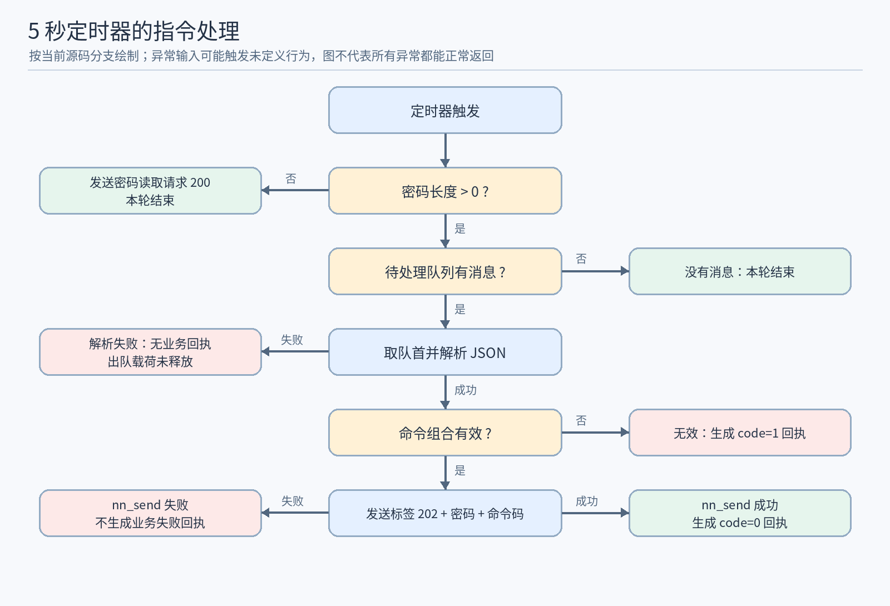
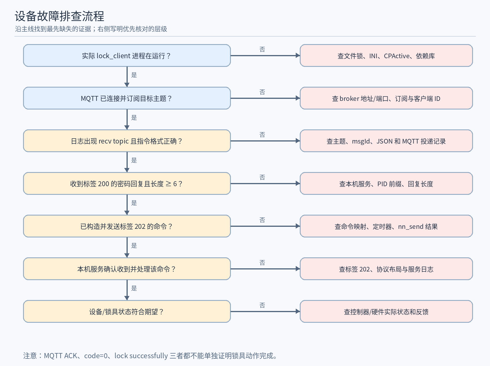

# lock_client 源码全面分析

<!-- rtms-analysis-guide:start -->

## 文档目录

本报告对应 `rtms_sdk/apps/lock_client/` 在 `bc60961e` 的源码；跨项目关系见[源码分析总览](../../源码分析总览.md)。下文原章节编号保留，先用概述、目录、架构、模块和流程五节建立整体脉络。

- [项目概述](#project-overview)
- [源码目录总览](#source-overview)
- [核心架构设计](#core-architecture)
- [核心模块深度分析](#core-modules)
- [关键流程与数据流](#key-flows)
- [1. 分析范围与结论依据](#analysis-1)
- [2. 项目用途和进程边界](#analysis-2)
- [3. 启动与初始化](#analysis-3)
- [4. MQTT 链路和消息生命周期](#analysis-4)
- [5. JSON 解析与命令映射](#analysis-5)
- [6. 本机 nanomsg 协议和回复处理](#analysis-6)
- [7. 队列、时序和状态](#analysis-7)
- [8. 失败路径和源码可见风险](#analysis-8)
- [9. 构建、打包与部署约束](#analysis-9)
- [10. 核对与维护路线](#analysis-10)
- [11. 设备故障排查：如何定位到本程序](#analysis-11)

**顺读方式：**先读下面五节，再从原第 1 节起顺序阅读详细分析；需要查特定模块时，可用模块表跳到对应章节。

<a id="project-overview"></a>

## 项目概述

`lock_client` 接收 MQTT 锁控指令并经本机 nanomsg 向命令服务下发，同时生成接收和本地发送阶段的回执；锁具动作需下游证据。

<a id="source-overview"></a>

## 源码目录总览

以下路径相对于该提交的 `apps/lock_client/`；“职责”只描述源码中的构建或调用角色。

| 路径 | 职责 |
| --- | --- |
| `main.c`、`CMakeLists.txt` | 入口、定时器、线程和构建 |
| `src/lock_mgr/` | 共享状态、配置与 socket 初始化 |
| `src/mosquitto/` | MQTT 指令和回执队列 |
| `src/lock/` | JSON 命令映射、ACK 与业务结果 |
| `src/cmd/` | 本机 nanomsg 命令帧及回复 |
| `src/list/`、`src/common/` | FIFO 容器与时间辅助 |

<a id="core-architecture"></a>

## 核心架构设计

```text
配置的 MQTT Broker → 接收队列 → lock 解析 / 映射
                           ├→ 接收 ACK / 本地发送结果 → 回执队列 → Broker
                           └→ cmd / nn_send → 本机命令服务 → 锁具
本机命令回复 → cmd 本地日志或密码状态；不生成硬件完成的 MQTT 回执
```

ACK、nn_send 成功、命令服务回复与锁具实际状态是四个不同证据阶段。图中箭头表示源码中的数据或控制方向；外部服务和设备效果以正文标明的证据边界为准。

<a id="core-modules"></a>

## 核心模块深度分析

下表给出主链路模块的入口、关键判断和详细分析位置；具体函数、常量与失败路径以所链章节中的源码引用为准。

| 模块 | 源码入口 | 关键判断与输出 | 详细分析 |
| --- | --- | --- | --- |
| MQTT 生命周期 | `src/mosquitto/` | 按主题接收指令并异步发布两类回执 | [进入章节](#analysis-4) |
| JSON 与映射 | `src/lock/` | 字段合法性、锁车/绑定映射与定时处理分别判定 | [进入章节](#analysis-5) |
| 本机协议 | `src/cmd/` | 标签、帧布局和回复条件须与实际命令服务核对 | [进入章节](#analysis-6) |
| 队列与风险 | `src/lock_mgr/`、`src/list/` | 内存队列、节奏和失败出队影响可靠性 | [进入章节](#analysis-7) |

<a id="key-flows"></a>

## 关键流程与数据流

~~~text
MQTT 指令 → 接收队列 / 接收 ACK
定时回调 → 解析与命令映射 → nanomsg 发送本机命令
本地发送结果 → 回执队列 → MQTT 回复主题
本机服务回复 → 本地日志或密码状态；锁具动作需下游证据
~~~

依次看[整体结构图](#analysis-2)、[MQTT 生命周期](#analysis-4)、[定时处理图](#analysis-5)和[本机协议](#analysis-6)。接收 ACK、命令发送结果和锁具动作不能合并成一次“执行成功”。

<!-- rtms-analysis-guide:end -->

<a id="analysis-1"></a>

## 1. 分析范围与结论依据

本文分析 `/home/tronlong/lyp/code/rtms_sdk/apps/lock_client/` 的当前检出源码。仓库分支为 `develop/rtms_sdk_v1.3_20240408`，提交为 `bc60961e`，工程版本为 1.1。文中“会”“不会”均指这一份源码可见的执行路径；MQTT broker、本机命令服务和锁具固件不在本目录，无法仅据本目录判定设备动作成功。

本目录由 `main.c`、`CMakeLists.txt`、`global_config.h.in` 及 `src/{lock_mgr,mosquitto,lock,cmd,list,common}/` 组成。`src/list/` 是内嵌的 Collections-C 单向链表实现；分析只涉及本应用实际调用的建表、尾部追加、首部移除与求长度，未把链表库其余 API 当作本应用功能。

| 要核对的结论 | 主要源码依据 |
| --- | --- |
| 启动、单实例、保活、线程和事件循环 | `main.c:16-79` |
| 配置、nanomsg 连接、队列和 5 秒定时器 | `src/lock_mgr/lock_mgr.c:10-69` |
| MQTT 主题、连接、回调、入队和发布 | `src/mosquitto/client_mosquitto.h:4-5`、`src/mosquitto/client_mosquitto.c:16-151` |
| JSON 解析、命令映射、回执与定时处理 | `src/lock/lock.c:8-214` |
| 本机帧、PID 订阅、密码请求和锁车发送 | `src/cmd/cmd.h:7-61`、`src/cmd/cmd.c:12-197` |
| FIFO 行为 | `src/list/cc_slist.c:136-139,181-205,538-550` |
| 构建与安装 | `CMakeLists.txt:1-62` |

<a id="analysis-2"></a>

## 2. 项目用途和进程边界

`lock_client` 是设备侧的协议桥接进程：从 MQTT 指令主题接收 JSON，把其中的锁车/绑定意图映射成一个命令字节，通过本机 nanomsg PUB 发给命令服务；并在 MQTT 回复主题发布接收确认和本地处理回执。锁具控制、密码生成和命令服务对锁车请求的执行均不在本目录实现。`main.c` 未读取命令行参数，传入的 `argc/argv` 没有参与配置。项目名和输出可执行文件名均为 `lock_client`，版本宏由 `global_config.h.in` 生成。参见 `main.c:43-79`、`CMakeLists.txt:1-2,37-39`。

源码中有三条并行执行路径：主线程运行 libev，接收本机命令回复并执行 5 秒定时回调；一个线程更新 CPActive 保活；另一个线程负责 MQTT 连接、后台网络循环的启动和回复队列发布。Mosquitto 自身的 `mosquitto_loop_start()` 还会启动库管理的网络循环；消息回调属于该网络循环，不能把它误认为主线程的 libev 回调。线程创建和 Mosquitto 循环启动的返回值没有在 `main()` 中检查。参见 `main.c:72-75`、`src/mosquitto/client_mosquitto.c:124-150`。

### 2.1 总体结构图



图中的“本机命令服务”是外部依赖。`CmdCb` 对锁车回复只写成功日志，不产生 MQTT 业务结果；回复队列里的 `code=0` 是发送调用返回成功时生成的。参见 `src/cmd/cmd.c:104-111`、`src/lock/lock.c:193-207`。

### 2.2 本应用函数覆盖核对

| 模块 | 当前执行路径中的函数 | 本文对应章节 |
| --- | --- | --- |
| `main.c` | `main()`、`is_instance_existing()`、`cpactive_task()` | 第 3、7、8 节 |
| `src/lock_mgr/lock_mgr.c` | `get_dev_config()`、`lock_mgr_new()` | 第 3、6 节 |
| `src/mosquitto/client_mosquitto.c` | `start_mqtt_task()`、连接/断开/订阅/消息四类回调 | 第 4、7、8 节 |
| `src/lock/lock.c` | `convert_lock_cmd()`、`parse_lock_payload()`、`make_lock_reply()`、`ev_timeout_cb()` | 第 4、5、7、8 节 |
| `src/cmd/cmd.c` | `pub_client_new()`、`sub_client_new()`、`cmd_recv()`、`send_lock_passwd_request()`、`send_lock_cmd()` | 第 3、6、8 节 |
| `src/common/common.c` | `hex_dump()` 用于本机帧和密码的日志；`sany_get_clock_time_ms()` 用于回执时间戳 | 第 4、6、8 节 |

`src/common/common.c` 还定义 `sany_get_tick_count_ms()` 和 `set_clock_time_ms()`，但本应用源码没有调用它们；因此本进程没有通过这些函数执行系统时钟设置。`src/list/cc_common.c` 的字符串比较工具函数以及 `cc_slist.c` 的其他通用 API 也未被本应用业务路径调用。这些是随目录编译的辅助代码，不能直接算作当前锁车流程。参见 `src/common/common.c:52-81`、`src/list/cc_common.c:33-36`、`CMakeLists.txt:37-39`。

<a id="analysis-3"></a>

## 3. 启动与初始化

1. `is_instance_existing()` 打开或创建 `/tmp/lock_client.pid`，对文件描述符尝试非阻塞排他 `flock`；只有 `flock` 失败且 `errno == EWOULDBLOCK` 时才认定已有实例并退出。文件名虽含 `.pid`，本函数没有写入 PID。`open()` 或其他 `flock` 失败未被视为启动失败。参见 `main.c:20-30,47-50`。
2. 进程设置日志标签，调用 `mosquitto_lib_init()`，根据 CMake 生成的宏打印版本。`mosquitto_lib_init()` 的返回值没有检查。参见 `main.c:52-58`。
3. 创建 CPActive 对象并登记进程名、版本和 10 秒超时；登记失败时 `main()` 返回 `-1`。`create_cpactive()` 的返回值没有先检查。保活线程以后每约 5 秒调用 `cpactive_upt_atime()`，失败仅记录日志并继续。CPActive 证明的是本地活动时间更新，不能证明消息链路或锁具动作。参见 `main.c:16-18,32-41,60-64`。
4. `lock_mgr_new()` 分配共享对象，读取 `/opt/conf_ext2.ini`。文件不能加载则初始化失败；在文件可加载的前提下，`mgw:local_ip` 缺失回退为 `127.0.0.1`，`mgw:local_port` 缺失回退为 `1883`。它们用于 MQTT broker，不用于 nanomsg 端口。参见 `src/lock_mgr/lock_mgr.c:10-39`。
5. 创建 nanomsg SUB 并调用 `nn_connect()` 连接 `tcp://127.0.0.1:16008`，以本进程 PID 的 4 字节值设置订阅过滤，再取得 `NN_RCVFD` 供 libev 监听；随后创建 PUB 并调用 `nn_connect()` 连接 `tcp://127.0.0.1:26008`。调用失败使 `lock_mgr_new()` 返回空指针，但没有完整释放此前已分配的资源；调用成功也不能单独证明对端服务正在提供锁车能力。参见 `src/cmd/cmd.c:14-86`、`src/lock_mgr/lock_mgr.c:42-54`。
6. 初始化两条链表及对应互斥锁，注册命令回复 `ev_io` 和首次 5 秒后触发、以后每 5 秒触发的 `ev_timer`。链表、互斥锁、事件对象的初始化结果没有逐项检查。`main()` 再创建保活/MQTT 线程，最后进入 `ev_run()`。参见 `src/lock_mgr/lock_mgr.c:56-69`、`main.c:72-75`。

### 3.1 启动流程图



图只表示源码明确检查的退出条件。`pthread_create()`、链表创建等未检查的调用发生异常时，源码没有对应的受控失败分支。

<a id="analysis-4"></a>

## 4. MQTT 链路和消息生命周期

MQTT 客户端 ID 固定为 `lock_client`，clean session 参数为 `true`，keepalive 为 30 秒。源码没有调用设置认证或 TLS 的 Mosquitto API。`mosquitto_connect()` 若立即返回错误，线程每 2 秒重试；调用成功后把状态设为 `STATUS_CONNECTING` 并启动网络循环。连接确认回调把状态设为 `STATUS_CONNACK_RECVD`，随后以 QoS 1 调用 `mosquitto_subscribe()` 订阅 `v4/s/set/thing/lock/json/1.0`，但没有检查该调用的返回值。订阅回调仅打印 broker 授予的 QoS，不据此改变连接状态；所以 `connected to broker` 不能证明订阅成功。断开回调把状态置为 `STATUS_DISCONNECTED`；源码没有在发布循环里显式调用 `mosquitto_reconnect()`，库自身的重连行为需按实际库版本验证，不能仅据本文件断言总能自动恢复。参见 `src/mosquitto/client_mosquitto.c:16-55,87-131`。

消息回调只处理 `payloadlen > 0` 且主题与 `LOCK_CMD_SET_TOPIC` 完全相同的消息。它先调用 `parse_lock_payload()`；只要得到 `msgId`，就构造 `isAck=true` 回执放入回复队列。随后又复制 `payloadlen` 字节到待处理队列，无论首次解析是否成功。这里没有对 `msgId` 去重、没有检查队列长度、没有检查 `malloc()`/`cc_slist_add()` 返回值。参见 `src/mosquitto/client_mosquitto.c:57-85`。

回复发布循环只有在状态为 `STATUS_CONNACK_RECVD` 时运行：持有回复队列互斥锁，从队首取一条，以 QoS 1、`retain=false` 发布到 `v4/p/resp/set/thing/lock/json/1.0`，每轮末尾睡眠 5 秒，因此每轮最多发布一条。`mosquitto_publish()` 成功后立即释放本地字符串；失败时队列项已移除，既不重入队，也不释放该字符串。成功只说明本地库接受发布调用，不等同于远端业务已收到。参见 `src/mosquitto/client_mosquitto.c:133-150`。

### 4.1 MQTT 指令和两类回执

输入示例，`lock=true`、`bind=null`、`level=2` 会映射到 `0x32`：

```json
{"header":{"msgId":"example-001"},"body":{"lock":{"lock":true,"bind":null,"level":2,"delay":0}}}
```

接收确认示意：`{"header":{"msgId":"example-001","ts":<生成时的毫秒时间>},"body":{"hasError":0,"isAck":true}}`。本地处理回执示意：`{"header":{"msgId":"example-001","ts":<生成时的毫秒时间>},"body":{"hasError":0,"isAck":false,"results":{"id":"","lock":{"code":0}}}}`。这里的 `<...>` 是说明性占位符，不是合法 JSON 字面量。`ts` 调用 `CLOCK_REALTIME` 取得 Unix 毫秒时间；`hasError` 固定为 0；`results.id` 固定为空字符串。参见 `src/lock/lock.c:136-175`、`src/common/common.c:63-72`。

`isAck=true` 只表示回调把确认报文排入本地队列；`isAck=false, code=0` 只表示转换为命令后 `nn_send()` 返回非负值。命令组合无效时用 `code=1`；本机发送失败、JSON 解析失败及密码未到达时当前代码不会生成相应的失败业务回执。命令服务的实际锁车回复没有进入上述业务结果。参见 `src/lock/lock.c:177-214`、`src/cmd/cmd.c:104-111,189-197`。

<a id="analysis-5"></a>

## 5. JSON 解析与命令映射

`parse_lock_payload()` 用 cJSON 解析顶层对象，取 `header.msgId`；然后取 `body.lock` 对象内的 `lock`、`bind`、`level`、`delay`。`lock` 和 `bind` 的初始值均为 `-1`，字段缺失或为 JSON `null` 时保持 `-1`；其他非 null 值交给 `cJSON_IsTrue()`，只有 JSON `true` 得到 1，`false` 及类型不符的值会得到 0。`level` 和 `delay` 通过 `cJSON_GetNumberValue()` 取数，再赋给 `int`；不存在严格的类型、范围或整数性校验。`delay` 只写日志，后续不用于等待或下发。参见 `src/lock/lock.c:77-133`。

| `lock` 内的锁车字段 | `bind` | `level` | 结果 `cmd_bytes[6]` | 源码含义 |
| --- | --- | --- | --- | --- |
| 缺失 / `null` | `true` | 忽略 | `0x10` | 绑定 |
| 缺失 / `null` | `false` | 忽略 | `0x20` | 解绑 |
| `true` | 缺失 / `null` | 1、2、3 | `0x31`、`0x32`、`0x33` | 一级、二级、三级锁车 |
| `true` | `true` | 1、2、3 | `0x51`、`0x52`、`0x53` | 绑定并按级别锁车 |
| `false` | 缺失 / `null` | 忽略 | `0x40` | 解锁 |
| `false` | `false` | 忽略 | `0x60` | 解绑并解锁 |
| 其他组合 | 任意 | 任意 | `-1`，不下发 | 业务回执 `code=1` |

具体映射见 `src/lock/lock.c:8-75`。枚举还定义 `0x00` 和 `0x90`，但这段 JSON 转换逻辑不会产生它们。`level` 转换为 `int` 后才进入 `switch`，因此非整数数值可能被截断成 1、2、3；这是代码路径推导，不应把它当作协议允许的输入。

### 5.1 指令处理流程图



这张图只覆盖 `ev_timeout_cb()` 的可见分支。消息回调里的接收确认在它之前独立入队；缺失 `msgId`、非终止字符串等输入可触发未定义行为，不能保证图中异常分支都能平稳执行。参见 `src/lock/lock.c:177-214`。

<a id="analysis-6"></a>

## 6. 本机 nanomsg 协议和回复处理

本进程用 `NN_PUB` 连接 `127.0.0.1:26008` 发送请求，用 `NN_SUB` 连接 `127.0.0.1:16008` 接收回复。SUB 以 `getpid()` 的前 4 字节作为订阅前缀；这要求服务端发布的回复从相同 PID 字节开始。连接地址均固定为本机回环地址，不读取 MQTT 的 `mgw:local_ip`。参见 `src/cmd/cmd.c:14-86`。

请求头在源码中定义为 `pid:uint32`、`cmd_tag:uint16`、`cmd_idx:uint8`、`cmd_len:uint8`、`rsv[4]`，其后为变长 `cmd_bytes[]`；回复头对应增加 `error:uint8`、`crc:uint8`、`rsv[2]`。在通常的当前目标 ABI 上两个固定头各占 12 字节，但源码按 `sizeof` 和内存布局直接传输，没有显式序列化、字节序或结构版本字段。对接方必须使用相容定义。参见 `src/cmd/cmd.h:35-54`。

`global_cmd_idx` 是进程内静态 `int`，写入 8 位 `cmd_idx` 时按低 8 位循环；代码没有用它匹配回复。读取密码请求标签为 200，`cmd_len=0`；锁车请求标签为 202，`cmd_len=8`，载荷的第 0～5 字节复制密码、第 6 字节放映射命令码、第 7 字节因 `calloc` 为 0。该函数只按 `nn_send() < 0` 判断失败。参见 `src/cmd/cmd.h:29-32`、`src/cmd/cmd.c:12,146-197`。

收到 nanomsg 回复时，`cmd_recv()` 以 `NN_DONTWAIT` 读一条消息并打印十六进制内容。标签 202：若数据域首字节为 0，就打印 `lock successfully`，没有在回调中再次核对 PID、请求序号、回复头错误码/CRC，也没有通知 MQTT 回执队列；非零时没有相应的错误日志或业务回执。标签 200：把回复数据域当作密码缓存；长度大于 0 后，定时器开始处理远程指令。其他标签忽略。参见 `src/cmd/cmd.c:89-144`。

### 6.1 下游服务的可核对范围

同仓库 `apps/cloud_client/src/nn_sock/nn_sock.h`、`apps/version_client/src/nn_sock/nn_sock.h` 对 200/201/202/203 的标签编号与本应用一致；`apps/io_mng/src/cmd/cmd.h` 却把 `CMD_TAG_LOCK` 定义为 200。在所查 `io_mng` 源码中未见标签 202 的专门锁控执行分支。`apps/io_mng/src/io_mng/io_mng.h` 虽有 `16008/26008` 地址，端口相同并不能证明当前设备上的服务实现与 `lock_client` 匹配。设备固件/服务端的确切锁车处理、密码生成和实际锁具状态需要查看运行中的服务及下游协议。以上是代码间的兼容性检查结果，不是对设备功能的断言。

<a id="analysis-7"></a>

## 7. 队列、时序和状态

`cc_slist_add()` 实际追加到尾部，`cc_slist_remove_first()` 从头部移除，因此两条队列各自是 FIFO。MQTT 消息回调持有 `recv_list_mutex` 添加待处理消息；libev 定时器持同一锁移除并处理。回执由 MQTT 回调或 libev 定时器在 `send_list_mutex` 下添加；MQTT 线程在同一锁下移除并发布。源码没有持久化、容量上限或队列长度监控。参见 `src/list/cc_slist.c:136-139,181-205,538-550`、`src/mosquitto/client_mosquitto.c:70-82,135-147`、`src/lock/lock.c:187-214`。

| 阶段 | 源码节奏 | 说明 |
| --- | --- | --- |
| CPActive | 保活线程每轮更新后 `sleep(5)` | 更新失败继续循环，不会使主线程退出。 |
| 命令定时器 | 启动 5 秒后首次触发，此后间隔 5 秒 | 无密码则每轮请求一次；有密码则每轮最多处理一条。 |
| MQTT 发布 | 无限循环，每轮末尾 `sleep(5)` | 已连接时每轮最多取一条；断开时队列暂留内存。 |
| MQTT 连接调用失败 | 每次失败后 `sleep(2)` 再调 `mosquitto_connect()` | 这是初次连接调用的显式重试；后续网络循环重连不由本文件显式实现。 |
| Mosquitto keepalive | 30 秒 | 这是 MQTT 连接参数，不是 CPActive 超时。 |

接收确认通常先入队，业务结果在后续定时器中入队；但实际发布时间还受已有队列、网络状态和线程调度影响。QoS 1 的至少一次交付可能造成重复指令；本程序没有按 `msgId` 去重，业务结果也没有等平台确认。参见 `src/mosquitto/client_mosquitto.c:57-82,133-150`。

<a id="analysis-8"></a>

## 8. 失败路径和源码可见风险

以下逐项是源码行为或由具体未检查操作直接导出的风险；风险项不表示已在设备上复现。

| 位置 | 条件与可见结果 |
| --- | --- |
| `main.c:20-30` | `open()` 返回 `-1` 或 `flock()` 因非 `EWOULDBLOCK` 原因失败时，函数仍返回“没有其他实例”；单实例约束可能失效。 |
| `main.c:60-75` | `create_cpactive()`、`mosquitto_lib_init()`、两个 `pthread_create()` 的结果没有完整检查；初始化失败未形成清晰的统一退出/清理流程。`ev_run()` 返回后也未先停止并等待工作线程。 |
| `src/lock_mgr/lock_mgr.c:37-69` | 配置文件不存在使程序无法初始化；nanomsg 连接失败后，已创建的对象/套接字没有完整回收；链表和互斥锁创建结果未逐项判断。 |
| `src/mosquitto/client_mosquitto.c:61-69` | 回调把 MQTT `payload` 作为 C 字符串打印并交给 cJSON 解析，但没有基于 `payloadlen` 显式限定字符串边界；若库未提供终止字节，可能越界读取。 |
| `src/mosquitto/client_mosquitto.c:69-82` | 即使首次 JSON 解析失败，仍复制并入队。复制只申请 `payloadlen` 字节，没有补 `\0`，下一次按 C 字符串解析存在确定的边界缺口；`malloc()`、`cc_slist_add()` 的失败未处理。 |
| `src/lock/lock.c:91-95,190-211` | `header` 存在但 `msgId` 缺失或非字符串时，`strdup(NULL)` 可能出错；`header` 缺失时定时回调的局部 `msg_id` 未初始化却会被用于回执和 `free()`。 |
| `src/lock/lock.c:101-129` | 布尔字段非 `true` 且非 null 时可能被视为 `false`；`level` 由浮点值转为 `int`，没有协议层类型/范围拒绝；`delay` 只打印，不实现延迟。 |
| `src/lock/lock.c:193-212` | 解析失败后已出队消息未释放，也没有失败回执；`make_lock_reply()` 返回值及队列追加结果未检查，低内存情况下可能将未定义的指针加入队列。 |
| `src/cmd/cmd.c:95-127` | 收到的回复长度未先与固定头及 `cmd_len` 比较就复制；标签 202 的 `cmd_len=0` 时仍读取首个数据字节；格式异常的回复可能越界读取。密码相同分支提前 `break` 未释放临时回复；密码变化时旧密码未释放，比较还使用新长度。 |
| `src/cmd/cmd.c:125-130,181-186` | 仅检查缓存密码长度大于 0，发送时固定复制前 6 字节；不足 6 字节会越界读取。收到的密码和发送帧会被十六进制写入日志，日志含敏感内容。 |
| `src/mosquitto/client_mosquitto.c:135-145` | 发布失败后队列项已出队且未释放/重试；发布成功后即释放，没有等待业务端确认。 |
| `src/mosquitto/client_mosquitto.c:22-38,113-149` | `mqtt_status` 在 Mosquitto 回调和本程序 MQTT 线程之间读写，未使用原子操作或互斥锁；从 C 线程模型看存在数据竞争风险。该状态也没有保存“订阅已成功”的独立标志。 |

`lock_mgr_t` 把两条队列、互斥锁、两个 nanomsg socket、事件监听器、broker 地址和密码保存在同一个共享对象中。进程长时间断网、密码始终取不到或远端指令速率高于每 5 秒一条的处理速率时，队列可能持续增长；源码没有背压或丢弃策略。参见 `src/lock_mgr/lock_mgr.h:8-26`、`src/lock/lock.c:177-214`。

<a id="analysis-9"></a>

## 9. 构建、打包与部署约束

本目录 CMake 要求最低版本 3.11、C99，查找 libev 4.33、nanomsg 1.2、OpenSSL 1.1.1、cJSON 1.7.15、appmng 1.0、tbox-common 1.0、Mosquitto 2.0.15。源码列表通过 `src/*/*.c` 递归收集，生成头文件 `global_config.h`。交叉编译分支支持环境变量 `QL_MODULE_PLATFORM=EC200A` 或 `EG25G`，并使用各自 SDK 路径和库；其他值配置时报错。安装规则把 `lock_client` 放到安装前缀 `opt/`，把指定依赖共享库放到 `usr/lib/`。参见 `CMakeLists.txt:1-62`。

当前仓库 `apps/CMakeLists.txt` 未把 `lock_client` 加为子目录，顶层构建不会因本目录存在而自动生成该目标。仓库 `todel/opt/device_apps/` 的若干设备分类和 `todel/file.info` 中存在名为 `lock_client` 的预置产物/路径记录；不能据文件名判断这些 ARM 二进制与当前检出源码、版本宏或目标设备运行的文件一致。构建本目录之前，应核对交叉工具链、依赖查找路径和目标设备所需库；部署时还要确认配置文件及外部本机命令服务。此文档仅作源码分析，未执行交叉编译或设备联调。

<a id="analysis-10"></a>

## 10. 核对与维护路线

| 任务 | 应联查的代码和事实 |
| --- | --- |
| 改 MQTT 主题、回执结构 | `src/mosquitto/client_mosquitto.h/.c`、`src/lock/lock.c`；分别核对订阅 QoS、发布 QoS、`isAck` 与 `code` 的语义。 |
| 改锁车/绑定规则 | `src/lock/lock.c:8-75,77-133`、`src/cmd/cmd.c:168-197`，并取得下游服务对命令码和密码长度的协议定义。 |
| 改本机命令帧 | `src/cmd/cmd.h/.c`、设备上实际监听 `16008/26008` 的服务；核对标签 200/202、PID 前缀、结构布局、错误码和 CRC。 |
| 查“MQTT 有 ACK 但锁没动作” | 先区分接收确认、`nn_send()` 的本地成功回执和设备实际回复；再看密码是否达到 6 字节、定时器队列、下游服务标签/端口及硬件记录。 |
| 查消息延迟或丢失 | 查看两条队列是否积压、5 秒节奏、MQTT 连接状态、发布失败的出队行为，以及 JSON/回复帧长度异常。 |

若要把本文扩展成真正的端到端锁控说明，还需获取设备上实际运行的命令服务源码或协议文档、配置与日志，并用目标设备验证密码回复、标签 202、锁车命令码以及硬件状态反馈。当前仓库内 `io_mng` 的标签差异是必须先澄清的对接点。

<a id="analysis-11"></a>

## 11. 设备故障排查：如何定位到本程序

这部分用于现场出现“远程锁车/绑定无效、延迟、重复、无回执或进程异常”时定位故障层级。判断依据是本程序当前源码的日志、状态和接口；设备上具体日志命令、进程管理方式、命令服务名称及硬件反馈方式需以实际固件为准。排查时先确认运行中的二进制版本与本文分析的提交相符，否则以下常量和日志可能不适用。



### 11.1 先固定证据，避免误判

1. 记录故障发生时间、设备时间与时区、设备标识、期望动作、MQTT 指令的 `msgId`，并区分“未收到指令”“收到但未下发”“已下发但设备未动作”。回执的 `ts` 是本进程生成报文时的系统实时时钟毫秒值，不是 broker 或硬件确认时间；若设备时钟错误，先不要按时间戳直接断言消息顺序。参见 `src/lock/lock.c:136-165`、`src/common/common.c:63-72`。
2. 确认进程是否正在运行以及实际可执行文件路径、构建版本。源码只打印 `APP Version: 1.1`，仓库 `todel` 下也有同名预置二进制；文件名一致不足以证明它对应此提交。`/tmp/lock_client.pid` 只是锁文件，没有写入 PID，不能据文件存在判断进程在线。参见 `main.c:20-30,54-58`。
3. 保留故障前后的日志片段，同时对原始报文、日志和转储文件限制访问。`src/cmd/cmd.c` 会把密码回复及含密码前 6 字节的下发帧写成十六进制日志；向外传递前应遮盖这些字节，不要把完整密码贴进工单。参见 `src/cmd/cmd.c:125-130,181-186`。
4. 分别收集 MQTT broker 侧的主题消息记录、本机命令服务的接收/回复记录和锁具或控制器的状态记录。只有三段证据连起来，才能区分本程序、下游服务和硬件；本程序的 ACK 或 `code=0` 不能单独充当锁车完成证据。

若目标系统提供常见 Linux 工具，可以先执行只读检查；以下命令中的 PID 和配置路径需按设备实际环境替换，缺少命令时使用系统等价工具：

```sh
ps -ef | grep '[l]ock_client'
ls -l /opt/conf_ext2.ini /tmp/lock_client.pid
ss -tnp | grep -E ':(1883|16008|26008)'
```

`ss` 只能帮助观察 TCP 连接，不能证明 MQTT 已订阅或 nanomsg 对端能执行标签 202；broker 端口可能由 INI 改写，检查前应先读 `mgw:local_port`。若要对照运行中的二进制，可用实际 PID 查看 `/proc/<PID>/exe` 指向的文件；不要把路径名或版本字符串当作二进制同源性的最终证据。

### 11.2 按症状逐层定位

| 现场现象 | 先看什么 | 与本程序相关的源码分支 | 如何判定下一层 |
| --- | --- | --- | --- |
| 程序起不来或反复退出 | 是否有 `another instance is running`、`failed to add process info to CPActive`、`failed to new lock mgr`；检查 `/opt/conf_ext2.ini` 是否存在可读 | 文件锁、CPActive 登记、配置加载和 nanomsg 初始化在启动阶段；`main.c:20-70`、`src/lock_mgr/lock_mgr.c:10-54` | 若配置和本机端口调用均正常，再核对依赖库、运行二进制及进程管理日志；不要仅凭 `.pid` 文件判断重复实例。 |
| 进程在线，但 MQTT 未连 | `connecting to broker`、`client connect error: ...`、`connect error: ...`、`connected to broker`；核对 INI 中的 IP/端口及 broker 侧连接记录 | 初次 `mosquitto_connect()` 调用失败每 2 秒重试；连接确认才订阅；`src/mosquitto/client_mosquitto.c:24-33,87-131` | 若 broker 拒绝或网络不通，先处理 broker/网络/配置；本程序未设置 MQTT 用户名、密码或 TLS。断线后的自动恢复需结合实际 Mosquitto 库观察。 |
| MQTT 已连接却收不到目标指令 | 是否出现 `subscribed (mid: ...)`，核对回调打印的授权 QoS 和 broker 侧订阅结果；broker 是否确实向 `v4/s/set/thing/lock/json/1.0` 发布了非空载荷 | 连接确认后调用订阅但不检查返回值；消息回调只处理完全相同的主题和 `payloadlen>0`；`client_mosquitto.c:24-55,57-85` | broker 有发布但进程无 `recv topic` 时，检查订阅结果、客户端 ID 冲突和当前连接；固定客户端 ID `lock_client` 在同一 broker 上可能互相顶掉。 |
| 出现 `recv topic`，却没有接收确认 | 该报文是否有字符串 `header.msgId`；是否有 `failed to publish reply msg`、断线或回复队列积压 | 只有解析取得 `msgId` 才入队 `isAck=true`；发布循环每 5 秒最多取一条；`client_mosquitto.c:65-82,133-150` | 格式不合法时不能把无 ACK 归因于 broker；`header`/`msgId` 异常还可能触发进程崩溃。先保存并隔离异常载荷，在测试环境复现。 |
| 有 ACK，但一直没有业务结果 | 是否每 5 秒出现密码读取请求；是否收到标签 200 的密码回复且长度至少 6 字节 | 无密码时定时器只发 `CMD_TAG_PASS_RD`，不处理待处理队列；`src/lock/lock.c:177-184`、`src/cmd/cmd.c:113-132` | 无密码回复先查本机服务、PID 订阅前缀和标签 200；密码已到则查 JSON 解析及命令组合。ACK 仅表示本地确认已排队。 |
| 有密码，业务结果 `code=1` | 对照第 5 节映射表检查 `lock`、`bind`、`level`；确认是否把非布尔值误写成字符串或数字 | 组合映射返回 `-1` 时产生 `code=1`；`src/lock/lock.c:24-75,193-207` | 这是本程序的输入/映射层拒绝；`delay` 无效，级别只支持映射到 1～3。核对原始 JSON，勿直接改动现场锁控命令试错。 |
| 有密码，既无 `code=1` 也无 `code=0` | 查 `invalid lock payload`、`failed to send lock/bind cmd`、进程是否崩溃或队列积压 | 解析失败会出队但不回执；`nn_send()` 失败也无业务失败回执；`src/lock/lock.c:193-212`、`src/cmd/cmd.c:189-197` | 有解析错误先定位载荷边界和字段；有发送错误则查本机命令服务和 nanomsg 连接。两者都无时看定时器是否运行和密码是否有效。 |
| 收到 `code=0`，设备却没动作 | 查标签 202 的本机请求是否到达服务，服务是否回复、回复的真实错误码和硬件状态 | `code=0` 在 `nn_send()` 未报错时就入队，早于设备回复；`src/lock/lock.c:193-203` | 重点核对设备所用服务的标签定义。当前仓库 `io_mng` 头文件把锁标签定义为 200，与本程序的 202 不同；不能仅凭端口连通判定协议匹配。 |
| 日志出现 `lock successfully`，设备仍异常 | 对照本机回复完整帧和硬件记录 | 本程序只因回复数据域首字节为 0 打印该日志；没有核对 `cmd_idx`、头部 `error`/`crc` 或锁具状态；`src/cmd/cmd.c:101-111` | 该日志也不是硬件完成证明。需由下游服务/控制器给出实际状态和关联请求号。 |
| 回执延迟、重复或重启后消失 | 看两条队列积压、MQTT 重连、设备进程重启与 broker QoS 1 重投递 | 每 5 秒最多处理/发布一条；无去重、无持久化；发布失败出队不重试；`src/mosquitto/client_mosquitto.c:133-150`、`src/lock/lock.c:177-214` | 依 `msgId` 串起 broker 记录与本地日志，区分原始重复发布、QoS 重投递和进程内重试；本进程未实现业务去重。 |
| 内存上涨或偶发崩溃 | 看是否有畸形 JSON、缺失 `msgId`、短密码回复、异常命令回复长度及长期队列积压 | 第 8 节列出未终止字符串、越界读取、出队泄漏及无界队列等源码风险 | 先在隔离环境用同版本二进制和脱敏输入复现；若有 core，按敏感材料管理，再结合调用栈与源码行定位。不要在生产锁具上用异常指令做试验。 |

### 11.3 日志关键字与“能证明到哪一步”

| 关键字（源码原文） | 能证明的本地阶段 | 不能证明的事 |
| --- | --- | --- |
| `APP Version: 1.1` | 主程序运行到版本打印处；`main.c:56-58` | 不能证明运行文件对应本文 Git 提交。 |
| `connected to broker`、`subscribed (mid: ...)` | 分别说明收到 MQTT 连接确认、订阅回调；后者还需检查实际授权 QoS；`client_mosquitto.c:24-55` | 仅有 `connected to broker` 不证明订阅成功；两条日志都不能证明某条锁车指令已到达或被处理。 |
| `recv topic:` | MQTT 回调收到非空载荷并准备检查主题；`client_mosquitto.c:57-65` | 不能证明 JSON 合法、ACK 已发布或命令已执行。 |
| `send lock passwd request:` | 调用本机密码请求发送前已构造帧；`cmd.c:146-165` | 不能证明服务端收到或返回了密码。 |
| `lock passwd:` | 进入密码回复缓存分支；`cmd.c:113-132` | 不能证明密码长度足够 6 字节或密码能通过设备校验；该日志含敏感数据。 |
| `send lock/bind cmd:` | 已构造锁车请求帧，即将调用 `nn_send()`；`cmd.c:168-196` | 不能证明 `nn_send()` 成功或硬件动作完成；该日志含密码字节。 |
| `lock successfully` | 收到标签 202、数据域首字节为 0 的回复；`cmd.c:104-111` | 不能证明它对应本次 `msgId` 或锁具实际状态。 |
| `failed to publish reply msg` | 本地 Mosquitto 发布调用失败；`client_mosquitto.c:138-145` | 不能据没有该日志推断远端业务已收到。 |

### 11.4 确认问题属于哪一层

- **本程序输入/处理层**：broker 确认投递了正确主题和载荷，本进程也记录 `recv topic`，但解析失败、组合被拒绝、定时器未处理或进程异常。用同版本源码和脱敏报文核对第 5、8 节。
- **本程序与命令服务接口层**：密码未取得、`nn_send()` 报错、标签 202 或帧布局不被设备上的服务识别。检查 PID 前缀、端口角色、密码长度和设备服务协议；不能只检查 TCP 端口在线。
- **下游执行层**：本程序已下发标签 202 且收到匹配的服务记录，但锁具状态未改变。这时应查看服务对密码/命令码的解释、控制器回复及硬件状态。本目录无法替代这些证据。
- **回执链路层**：命令已下发而平台没看到 ACK 或业务回执。核对回复队列、MQTT 连接状态、每 5 秒一条的发送节奏和发布失败后的消息丢失路径，别把平台无回执自动等同于命令未下发。

现场闭环应把同一条指令的 `msgId`、broker 收发时间、本程序接收/下发记录、本机服务请求/回复及设备状态按时间排序。若缺少任一环节，就将结论限定在已证实的阶段，并标明仍需补采的证据。
