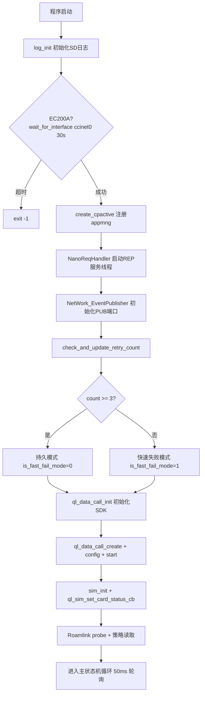
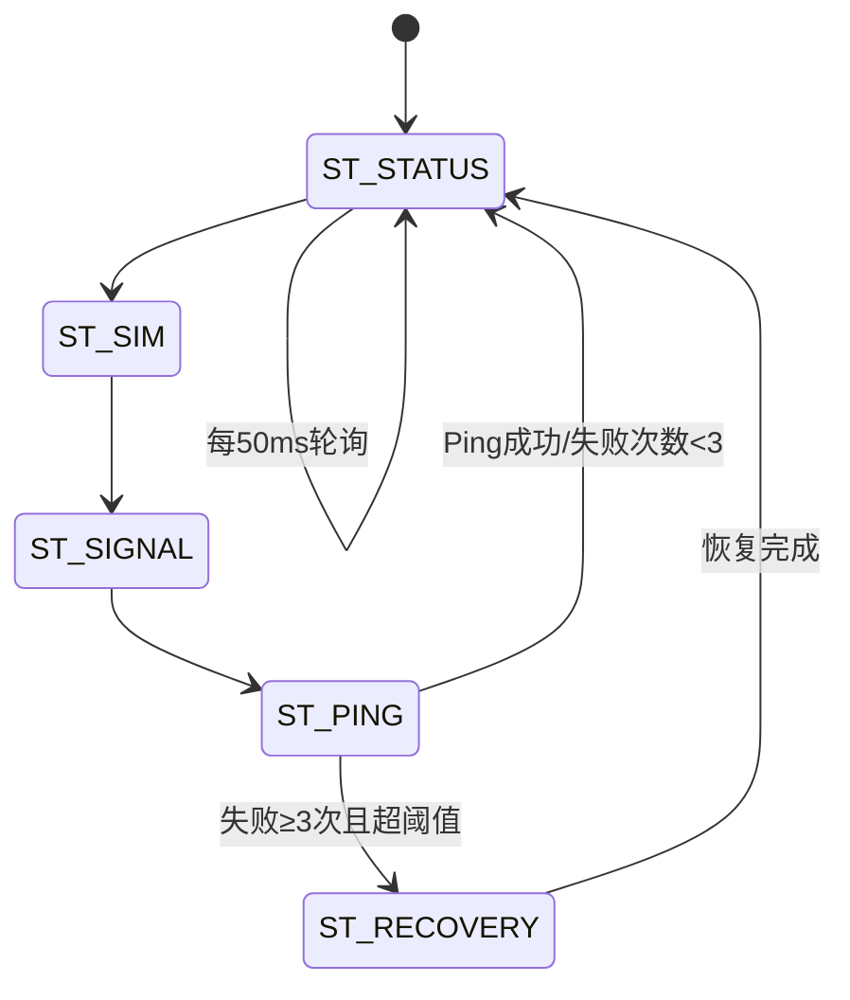
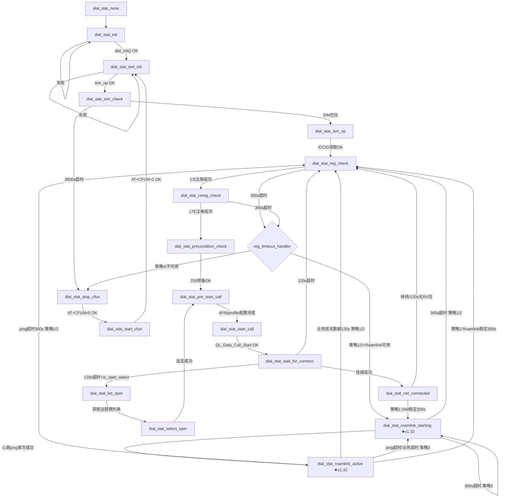
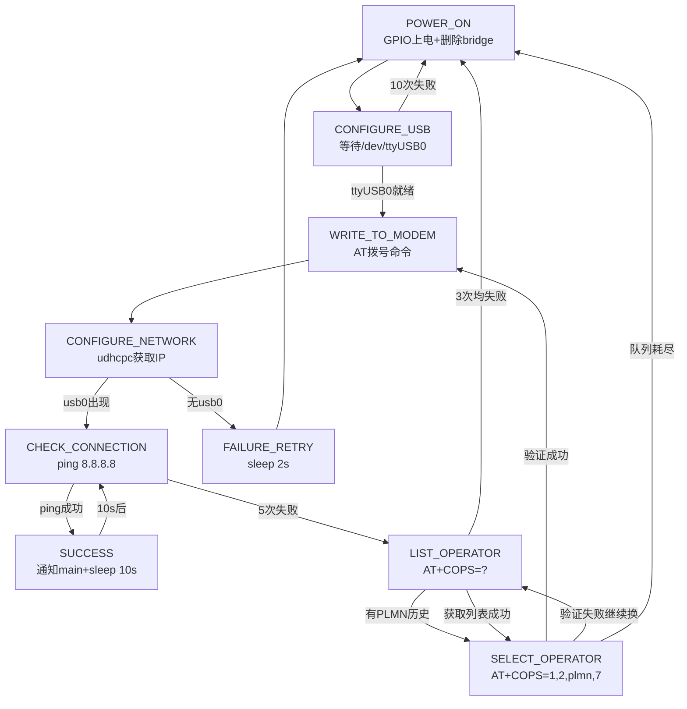
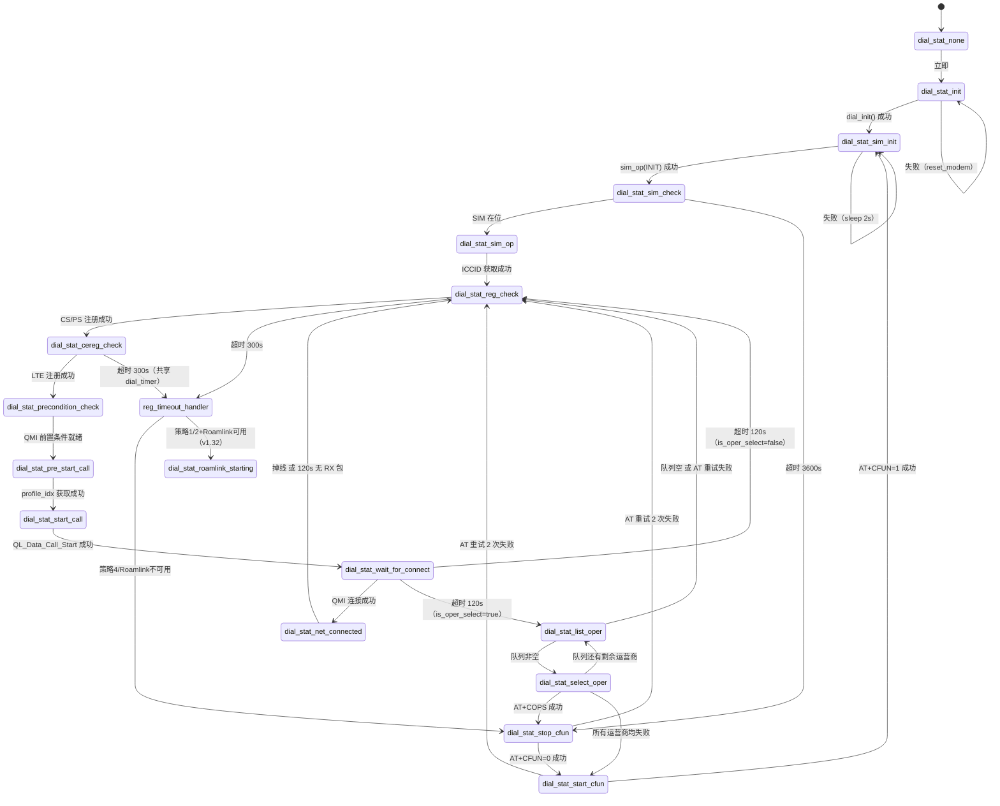

# modem_mng 主分析文档（Master Analysis）

> **生成时间**：2026-05-19（最后更新）  
> **基于版本**：工作区磁盘最新源码（含未提交修改 + 新增目录 roamlink/（双平台统一）、status/；v1.32 新增 roamlink_starting/active 状态及 rx_packets 业务层监测）  
> **目标平台**：EC200A / EG25G / i.MX6ULL  
> **分析深度**：函数级逐行分析，魔数解释，新旧差异标注

---

## 目录

1. [第一章：项目总览](#第一章项目总览)
2. [第二章：架构设计](#第二章架构设计)
3. [第三章：核心启动流程](#第三章核心启动流程)
4. [第四章：主状态机深度分析（EC200A 为主）](#第四章主状态机深度分析ec200a-为主)
5. [第五章：分层恢复策略](#第五章分层恢复策略)
6. [第六章：EG25G 平台实现](#第六章eg25g-平台实现)
7. [第七章：各平台实现对比](#第七章各平台实现对比)
8. [第八章：关键子模块逐行解读](#第八章关键子模块逐行解读)
9. [第九章：运行时状态文件与日志系统](#第九章运行时状态文件与日志系统)
10. [第十章：已知问题与待完善项](#第十章已知问题与待完善项)

---

## 第一章：项目总览

### 1.1 项目定位

`modem_mng` 是一个嵌入式 Linux 上的 **4G/LTE 调制解调器管理守护进程**，负责：

- 建立并维护 4G 数据拨号连接（Data Call）
- 通过 nanomsg REQ/REP（端口 38001）对外暴露蜂窝状态查询接口
- 通过 nanomsg PUB/SUB（端口 48001）发布网络事件（超限、断网等）
- 统计并持久化流量数据（SQLite）
- 多级别故障自动恢复（L1 软重拨 / L2 RF 复位 / L3 模块重启）
- 向进程管理框架（`appmng`）注册心跳保活
- 双卡切换（Roamlink 虚拟 SIM ↔ 物理 SIM）【已更新：新增模块】

### 1.2 三平台矩阵完整对比表

| 对比维度 | EC200A | EG25G | i.MX6ULL |
|---|---|---|---|
| **编译宏** | `USE_EC200A_DIAL` | `USE_EG25_DIAL` | `USE_IMX6U_DIAL` |
| **平台宏** | `QL_MODULE_PLATFORM_EC200A` | `QL_MODULE_PLATFORM_EG25G` | `QL_MODULE_PLATFORM_MCIMX6Y2CVM08AB` |
| **编译入口** | `dialer_ec200a.cpp` | `dialer_eg25.c` | `dialer_imx6ull.cpp` |
| **C++ 标准** | C++14 | C++11 | 系统默认 |
| **SDK 依赖** | Quectel OpenSDK（`ql_data_call_*`/`ql_sim_*`/`ql_nw_*`） | QMI+MCM（`QL_Data_Call_*`/`QL_MCM_NW_*`） | 无SDK，纯 AT 命令（ttyUSB） |
| **交叉编译器** | `arm-openwrt-linux` | `arm-oe-linux-gnueabi` | `arm-linux-gnueabihf` |
| **拨号方式** | `ql_data_call_start()` SDK 直接调用 | `QL_Data_Call_Start()` QMI 接口 | AT+QNETDEVCTL / AT+CGACT |
| **恢复机制** | L1(5min)/L2(10min)/L3(35min)，SDK L0窗口(25s重连) | L1(60s)/L2(5min)/L3(30min)，更激进 | 基本恢复逻辑 |
| **APN 配置** | `set_apn(iccid)` 基于 ICCID 匹配 | `apn_op()` QMI profile | `AT+CGDCONT` |
| **SIM 管理** | `ql_sim_*` SDK API + `sim_card_status_cb` 回调 | `QL_MCM_NW_*` + AT+CIMI | `AT+CIMI` / `AT+QCCID` |
| **nanomsg 集成** | `NanoReqHandler` C++ 线程 | `NanoReqHandlerWrapper` C 包装层 | 同 EC200A 共用 nanomsg_process.cpp |
| **流量统计** | SQLite (`traffic_sql/`) | SQLite (`traffic_sql/`) | SQLite (`traffic_sql/`) |
| **Roamlink** | `roamlink/roamlink.c`（【已更新】双平台统一模块，`#ifdef USE_EC200A_DIAL`） | `roamlink/roamlink.c`（同上，`#ifdef USE_EG25_DIAL`） | 无 |
| **LED 控制** | `led_control.hpp` + `led_control_c_api.h` | 同左 | 同左 |
| **主要特性** | SDK 自动重连L0层、CFUN限流、详细心跳诊断、SIM状态回调 | 三级恢复更激进、QMI协议、AT 串口持锁 | USB CDC-NCM、GPIO 上下电、AT 串口收发 |

### 1.3 CMakeLists.txt 完整分析

**文件**：`CMakeLists.txt`（共 211 行）

#### 1.3.1 全局依赖声明（第 4-11 行）

```cmake
find_package(libev "4.33" REQUIRED)      # 事件循环库（仅 EC200A 使用 -lev）
find_package(nanomsg "1.2" REQUIRED)     # IPC 通信库（三平台均用）
find_package(openssl "1.1.1" REQUIRED)   # 加密库（EC200A 链接 -lcrypto）
find_package(tbox-common "1.0" REQUIRED) # 工具库（EC200A/EG25G 用）
find_package(cjson "1.7.15" REQUIRED)    # JSON 解析（nanomsg 状态组包用）
find_package(uthash "2.3.0" REQUIRED)    # 哈希表
find_package(appmng "1.0" REQUIRED)      # 进程保活（心跳注册）
find_package(ledcontrol "1.0" REQUIRED)  # LED 控制库
```

#### 1.3.2 编译选项（第 15-27 行）

| 选项 | 默认值 | 宏定义 | 用途 |
|---|---|---|---|
| `ENABLE_DISPATCH_OPTIMIZE` | ON | `-DENABLE_DISPATCH_OPTIMIZE` | 调度性能优化 |
| `ENABLE_SPI_DUMMY` | OFF | `-DENABLE_SPI_DUMMY` | 虚拟 SPI 数据（无硬件测试） |
| 固定 | 强制 | `-D_GNU_SOURCE` | GNU 扩展 |

#### 1.3.3 平台选择逻辑（第 29-152 行）

通过 `$ENV{QL_MODULE_PLATFORM}` 环境变量在 `if/elseif/else` 块中选择平台：

**EC200A 平台（第 31-62 行）**
- 宏：`-DUSE_EC200A_DIAL -DQL_MODULE_PLATFORM_EC200A`
- 头文件：`$ENV{QL_SYSROOT_DIR}/usr/include{,/ql-sdk}` + `ec200a/` 子目录 + `status/`
- 创建共享库 `dialer_lib`（apn/data_call/nw/sim/test_utils）
- 可执行文件源码（第 158 行，`target_sources`）：  
  `dialer_ec200a.cpp`, `nanomsg_process.cpp`, `ec200a/*.c`, `roamlink/roamlink.c`（【已更新】统一模块，替代旧 `ec200a/roamlink/roamlink_ec200a.c`）, `traffic_sql/traffic_sql_interface.cpp`, `fault_report/*.cpp`, `logger_sd.c`, `status/dial_status.c`
- 链接库（第 169 行）：`-lev -lnanomsg -lcrypto -ljson-c -ltbox-common -lpthread -lappmng -lledcontrol -lsqlite3 -lz` + Quectel SDK 库

**EG25G 平台（第 64-131 行）**
- 宏：`-DUSE_EG25_DIAL -DQL_MODULE_PLATFORM_EG25G`
- 头文件：`$ENV{QL_SDKPATH}/../ql-ol-extsdk/include` 及多个 QMI 头文件目录 + `roamlink`（【已更新】替代旧 `eg25/roamlink`）+ `status/`
- 使用 `file(GLOB_RECURSE SRC_FILES "eg25/*.c" "cc_deque/*.c" "status/*.c")` 自动收集 eg25/ 源码；`roamlink/roamlink.c` 作为独立源文件显式加入 `add_executable`（【已更新】不再通过 GLOB 收集）
- 可执行文件（第 130 行）：`dialer_eg25.c` + `nanomsg_process_wraper.cpp` + `nanomsg_process.cpp` + `traffic_sql/` + `logger_sd.c` + `${SRC_FILES}`
- 链接库（第 131 行）：`-lpthread -lm -lql_sys_log -lcjson -ljson-c -lrt -lappmng -lnanomsg -lsqlite3 -lledcontrol -lz -ltbox-common -llog` + QMI/MCM 动态库

**i.MX6ULL 平台（第 134-146 行）**
- 宏：`-DUSE_IMX6U_DIAL -DQL_MODULE_PLATFORM_MCIMX6Y2CVM08AB`
- 可执行文件：`dialer_imx6ull.cpp` + nanomsg + traffic_sql + cc_deque + fault_report
- 链接库：`-lpthread -lm -lcjson -lrt -lappmng -lnanomsg -lsqlite3`

#### 1.3.4 strip 与 install（第 194-210 行）

| 平台 | strip 命令 |
|---|---|
| EC200A | `arm-openwrt-linux-strip` |
| EG25G | `arm-oe-linux-gnueabi-strip` |
| i.MX6ULL | `arm-linux-gnueabihf-strip` |

- `startup_level.json`：pre-build 生成，值为 `1`
- `install(TARGETS ${PROJECT_NAME} DESTINATION usr/bin)`
- `install(FILES ... libledcontrol.so ... DESTINATION usr/lib)`

### 1.4 配置文件 /etc/config/config.json 结构（parse_config.hpp）

**文件**：`parse_config.hpp`（89 行，仅头文件，无对应 .cpp）

#### 1.4.1 设计目标

`parse_config.hpp` 提供一个轻量级 JSON 配置读取器，专门用于解析形如：

```json
{"config":{"data":{"C020102":250,"C020501":"192.168.0.100"}}}
```

的小型配置文件。注释中明确说明 *"适用于这样的小文件解析"*，不考虑大文件流式读取。

#### 1.4.2 Variant_Config 类（第 15-30 行）

```cpp
class Variant_Config {
public:
    Variant_Config() : intValue(0), isString(false) {}   // 默认：整型 0
    Variant_Config(int value) : intValue(value), isString(false) {}
    Variant_Config(std::string value) : strValue(value), isString(true) {}

    bool        is_string() const { return isString; }
    int         get_int()   const { return intValue; }
    std::string get_string() const { return strValue; }

private:
    int         intValue;
    std::string strValue;
    bool        isString;   // 类型标志：true=字符串，false=整型
};
```

**设计说明**：

| 特点 | 说明 |
|---|---|
| 类型标志 `isString` | 用布尔量区分整型/字符串，避免引入 C++17 `std::variant`（注释中已注释掉 `#include <variant>`） |
| 整型存储 | `valuedouble` 强制转 `(int)`，JSON 数字统一按 double 解析，再截断为 int |
| 默认构造 | `intValue=0, isString=false`，用于 `std::map` 值初始化时不崩溃 |
| 无 `double` 支持 | 只支持 int 和 string，浮点配置项需自行转换 |

#### 1.4.3 ConfigParser 类（第 32-87 行）

**构造函数**：

```cpp
ConfigParser(const std::string &filename)
{
    std::ifstream file(filename);
    std::string content(
        (std::istreambuf_iterator<char>(file)),
        std::istreambuf_iterator<char>()
    );
    parse(content);
}
```

- 使用 `istreambuf_iterator` 一次性将整个文件读入 `std::string`——无缓冲区上限，文件过大时占用全部内存
- 文件打开失败（`file.fail()`）时 `content` 为空字符串，`cJSON_Parse("")` 返回 nullptr，`parse()` 打印错误后静默返回，`data` 为空 map

**parse() 内部逻辑（第 52-84 行）**：

```
root = cJSON_Parse(content)
  └─ config = root["config"]
       └─ config_data = config["data"]
            └─ 遍历 config_data 的所有子节点 item:
                 ├─ cJSON_IsNumber(item) → data[item->string] = Variant_Config((int)item->valuedouble)
                 └─ cJSON_IsString(item) → data[item->string] = Variant_Config(string(item->valuestring))
cJSON_Delete(root)   // 释放 cJSON 树
```

**getValue() 方法**：

```cpp
Variant_Config getValue(const std::string &key) const {
    auto it = data.find(key);
    if (it != data.end())
        return it->second;
    else
        throw std::invalid_argument("Key not found");  // 键不存在时抛异常
}
```

- 调用方必须 `try/catch std::invalid_argument`，否则程序直接终止
- `data` 成员是 `std::map<std::string, Variant_Config>`，查询复杂度 O(log n)

#### 1.4.4 配置键完整列表

键的命名遵循 `C<模块><分组><序号>` 格式。经过完整源码搜索（`grep -rn "getValue\|getIntValue\|C020102\|\"C0[0-9]"` 遍历所有 .cpp/.c/.hpp/.h 文件），确认的实际使用键如下：

| 键名 | 值类型 | 默认值/未配置时行为 | 使用模块 | 调用位置 | 业务含义 |
|---|---|---|---|---|---|
| `C020102` | `int` | `ConfigParser::getValue()` 抛异常，`getIntValue()` 捕获后 `output` 不变（实为 0 或 `0xffff`，取决于调用方初始值）| EC200A `dialer_ec200a.cpp:2455`；EG25G `dialer_eg25.c:63`；IMX6 `dialer_imx6ull.cpp:962`；均写入 `TrafficMonitor::PacketLimit` | 流量告警阈值：当历史流量包数超过此值时触发 PUB 事件 `NETWORK/overlimit`；设为 `0xffff`（65535）表示无限制（`"not define packet limit"` 日志） |
| `C020501` | `string` | 暂未有实际调用 | 无（仅在注释中作为格式示例出现：`{"C020501":"192.168.0.100"}`） | — | 设计预留（可能为某 IP 地址配置项，业务功能待实现） |

> **注意**：`C020102` 是当前代码中**唯一实际使用**的配置键。`C020501` 仅出现在 `parse_config.hpp` 的注释示例中，未在任何运行时代码路径中调用。其他以 `C<模块><分组>` 命名的键为平台预留格式，当前版本均未实现。

**`C020102` 完整调用链**：
```
/etc/config/config.json
  → ConfigParser("/etc/config/config.json")（三平台均在 main() 启动时读取）
  → getIntValue(parser, "C020102", TrafficMonitor::PacketLimit)
  → TrafficMonitor::PacketLimit（静态成员变量，全局共享）
  → TrafficMonitor::check_4g_overlimit() 中与实际流量比较
  → 超限时 NetWork_EventPublisher::pub("NETWORK", "...", code) 发布事件
```

**配置文件格式**（`/etc/config/config.json`）：
```json
{
  "config": {
    "data": {
      "C020102": 10240,
      "C020501": "192.168.0.100"
    }
  }
}
```
解析层级：`root["config"]["data"]["<key>"]`，仅支持 number 和 string 类型，不支持嵌套对象/数组。

#### 1.4.5 已知问题与限制

| 问题 | 描述 |
|---|---|
| 文件路径硬编码 | 调用方传入 `/etc/config/config.json`，无环境变量覆盖机制 |
| 无文件不存在提示 | `std::ifstream` 打开失败时无错误日志，`data` 静默为空 |
| 无重载/缺省值 | `getValue()` 抛异常而非返回默认值，调用方需捕获 |
| 整型精度截断 | `(int)item->valuedouble`：JSON 大整数（>2^31）被截断，无告警 |
| 非线程安全 | `ConfigParser` 对象创建后 `data` map 为 const，读取安全；但构造阶段若多线程并发会有竞争 |
| 不支持嵌套 `data` | 只解析 `config.data` 的直接子节点，不支持更深层嵌套 |

---

## 第二章：架构设计

### 2.1 模块依赖关系图

```mermaid
graph TD
    MAIN["main() / dial_task()"]

    subgraph EC200A平台
        DA["dialer_ec200a.cpp<br/>EC200ADialer::dial_loop()"]
        RL_EC["roamlink/<br/>roamlink.c（统一双平台）"]
        DC["ec200a/data_call/<br/>data_call.c"]
        NW_EC["ec200a/nw/nw.c"]
        SIM_EC["ec200a/sim/sim.c"]
        APN_EC["ec200a/apn/apn.c"]
        TU["ec200a/test_utils/test_utils.c"]
    end

    subgraph EG25G平台
        DE["dialer_eg25.c<br/>dial_task()"]
        RL_EG["roamlink/<br/>roamlink.c（统一双平台）"]
        DIAL["eg25/dial/dial.c"]
        NW_EG["eg25/nw/nw.c"]
        SIM_EG["eg25/sim/sim.c"]
        APN_EG["eg25/apn/apn.c"]
        AT["eg25/at/at.c"]
        DS_EG["eg25/roamlink_dial/<br/>dialStrategy.c"]
        TZ["eg25/tz/tz.c"]
    end

    subgraph 公共模块
        NM["nanomsg_process.cpp<br/>NanoReqHandler"]
        NMW["nanomsg_process_wraper.cpp<br/>C接口层"]
        LOG["logger_sd.c<br/>dial_log()"]
        PC["parse_config.hpp<br/>ConfigParser"]
        FR["fault_report/<br/>NetworkMonitor<br/>SimSignalMonitor<br/>SimMonitor"]
        TS["traffic_sql/<br/>TrafficDatabase"]
        CCR["cc_deque/<br/>CC_Deque"]
        ST["status/dial_status.c ★新增"]
        RB["reboot_conf/<br/>dial_reboot_conf.c"]
    end

    DA --> DC
    DA --> NW_EC
    DA --> SIM_EC
    DA --> APN_EC
    DA --> TU
    DA --> RL_EC
    DA --> ST

    DE --> DIAL
    DIAL --> AT
    DIAL --> NW_EG
    DIAL --> APN_EG
    DIAL --> SIM_EG
    DIAL --> RL_EG
    DIAL --> DS_EG
    DIAL --> TZ
    DIAL --> ST

    MAIN --> DA
    MAIN --> DE
    MAIN --> NM
    MAIN --> LOG
    MAIN --> PC
    MAIN --> FR
    MAIN --> TS

    NMW --> NM
    NM --> TS
    NM --> CCR
```



### 2.2 平台抽象接口 dialer.hpp 逐行解读

**文件**：`dialer.hpp`（共 1369 行）

#### 2.2.1 dial_stat_enu 枚举（第 21-40 行）

```cpp
typedef enum {
    dial_stat_none,              // 0: 未初始化
    dial_stat_init,              // 1: 初始化中
    dial_stat_sim_init,          // 2: SIM 初始化
    dial_stat_sim_check,         // 3: SIM 检查
    dial_stat_sim_op,            // 4: SIM 操作
    dial_stat_reg_check,         // 5: 注册检查
    dial_stat_precondition_check,// 6: 前置条件检查（CEREG）
    dial_stat_pre_start_call,    // 7: 拨号前准备
    dial_stat_start_call,        // 8: 正在拨号
    dial_stat_stop_call,         // 9: 停止拨号
    dial_stat_stop_cfun,         // 10: 关闭射频（CFUN=0）
    dial_stat_start_cfun,        // 11: 开启射频（CFUN=1）
    dial_stat_list_oper,         // 12: 列出运营商
    dial_stat_select_oper,       // 13: 选择运营商
    dial_stat_wait_for_connect,  // 14: 等待连接建立
    dial_stat_net_connected,     // 15: 已联网
} dial_stat_enu;
```

注意：此枚举仅用于 EG25G / i.MX6ULL 平台（`#if !USE_EC200A_DIAL`）。EC200A 平台使用 `ec200a/_public.h` 中定义的独立枚举。

#### 2.2.2 Dialer 抽象基类（第 46-87 行）

```cpp
class Dialer {
public:
    virtual void startDialing() = 0;   // 启动拨号（设置状态为 dial_stat_call_init）
    virtual void stopDialing() = 0;    // 停止拨号
    virtual int  modem_init() = 0;     // 模块初始化（检查信号强度，初始化 SDK 服务）
    virtual int  create_call() = 0;    // 创建 Data Call 上下文（配置 APN/IP版本/重连策略）
    virtual int  start_call() = 0;     // 启动 Data Call（ql_data_call_start）
    virtual void stop_call() = 0;      // 停止 Data Call（ql_data_call_stop）
    virtual void stop_cfun() = 0;      // AT+CFUN=0（关射频）
    virtual void start_cfun() = 0;     // AT+CFUN=1（开射频）
    // 拨号主循环：cpactive=心跳句柄，interface_name=网卡名输出，callback=首次联网回调
    virtual void dial_loop(void *cpactive, std::string &interface_name,
                           std::function<void()> callback) = 0;
    DialStatEun getStatus() const;     // 读取当前状态（线程安全读）
protected:
    void setStatus(DialStatEun status);// 设置当前状态（子类调用）
};
```

#### 2.2.3 EC200ADialer 子类关键成员（第 117-563 行）

**静态成员变量**（跨线程共享，由回调写入）：

| 变量名 | 类型 | 含义 |
|---|---|---|
| `dev_name` | `static std::string` | 网卡名（ccinet0），由 `data_call_status_ind_cb` 写入 |
| `imsi` | `static std::string` | IMSI |
| `imei` | `static std::string` | IMEI |
| `operatorName` | `static std::string` | 运营商名称 |
| `plmn` | `static std::string` | PLMN（MCC+MNC） |
| `iccid` | `static std::string` | SIM ICCID |

**CFUN 限流方法**（第 373-423 行）：

| 方法 | 功能 |
|---|---|
| `get_system_uptime()` | 读 `/proc/uptime` 获取系统启动秒数（double） |
| `read_last_call_time()` | 读 `/tmp/cfun_last_call.txt`（上次 CFUN 调用时间） |
| `write_last_call_time(t)` | 写 `/tmp/cfun_last_call.txt` |
| `read_cfun_count()` | 读 `/tmp/cfun_count.txt`（CFUN 调用次数） |
| `write_cfun_count(n)` | 写 `/tmp/cfun_count.txt` |
| `restart_cfun_safe()` | 主 CFUN 限流入口：count<10 且间隔>600s 才执行 CFUN 切换 |

**快速失败方法**（第 383-423 行）：

| 方法 | 功能 |
|---|---|
| `check_and_update_retry_count()` | 读写 `/tmp/dial_retry_count`；≥3 返回 -1（持久模式）；否则计数+1 返回当前值 |
| `clear_retry_count()` | 首次 ping 成功后删除 `/tmp/dial_retry_count` |

**网卡就绪检测方法**：

| 方法 | 功能 |
|---|---|
| `is_interface_present(ifname)` | 创建临时套接字，用 `ioctl(SIOCGIFINDEX)` 检测网卡是否存在 |
| `wait_for_interface(ifname, timeout_sec)` | 循环轮询网卡存在，每 1s 检测一次，超时返回 0 |

**data_call_status_ind_cb 静态回调**（第 398-519 行）：SDK 内部线程触发，在连接成功时：写 `/tmp/dial_Status=0`、`/tmp/network_status=1`，设置默认路由、DNS、NAT 规则；断开时写反向值。

#### 2.2.4 Imx6uDialer 子类（第 608-1368 行）

i.MX6ULL 平台的 AT 命令完全通过 `sendATCommand(cmd, serialPortPath)` 直接操作串口（`/dev/ttyUSB0~5`），包含 GPIO 上下电逻辑（GPIO_POWER=130，GPIO_PWRKEY=128）。

---

### 2.3 EC200A 平台头文件关键定义

**`ec200a/_public.h`** 中定义的关键宏：

| 宏 | 值 | 含义 |
|---|---|---|
| `DATA_CALL_ID_PUBLIC` | `4` | 默认 Data Call ID（与 `g_call_id` 初始值对应） |
| `DATA_CALL_APN_PUBLIC` | `1` | APN 配置槽位（`ql_data_call_set_apn_config` 的 `apn_id` 参数） |
| `APN_JSON_NAME` | `"apn.json"` | APN 映射表文件名，路径为 `/usr/dial/apn.json` |
| `APN_NAME_PUBLIC` | `"internet"` | 默认 APN 名（无 ICCID 匹配时的 fallback） |
| `NW_STATUS_PATH` | `"/tmp/network_status"` | 网络状态文件路径 |
| `NW_CSQ_PATH` | `"/tmp/network_csq"` | CSQ 缓存文件路径（`nw_get_signal_strength` 写入） |
| `NW_IF_STATISTICS_RX_PACKETS_PATH` | `"/sys/class/net/%s/statistics/rx_packets"` | 网卡 RX 包统计 sysfs 路径 |
| `DIAL_TIMEOUT_SECONDS` | `120` | 【已更新】实际值为 120s（非 300）。EG25G 的 `dial_stat_net_connected` 中仍活跃使用（120s 无 RX 包 → redial）；EC200A 的 `flow_monitor_task` 已被 ST_PING 替代，此处为死代码 |
| `QL_SIM_ICCID_LENGTH` | `20` | ICCID 字符串最大长度 |

**`ec200a/_public.h`** 中关键 SDK 枚举（来自 Quectel OpenSDK）：

```c
// dial_stat_enu — EC200A 平台内部状态机枚举（与 dialer.hpp 中 EG25/IMX6 共用的不同）
typedef enum {
    dial_stat_none,             // 0
    dial_stat_call_init,        // 1: ql_data_call_init 完成
    dial_stat_apn_init,         // 2: APN 已配置
    dial_stat_call_create,      // 3: ql_data_call_create 完成
    dial_stat_call_start,       // 4: ql_data_call_start 已发出
    dial_stat_wait_for_connect, // 5: 等待连接建立（旧状态机用）
    dial_stat_net_connected,    // 6: 已连接（旧状态机用）
    dial_stat_stop,             // 7: 停止（旧状态机触发重拨）
    dial_stat_stop_cfun,        // 8
    dial_stat_start_cfun,       // 9
} dial_stat_enu;

// QL_NET_DATA_CALL_STATUS_E 关键值
// QL_NET_DATA_CALL_STATUS_NONE       = 0
// QL_NET_DATA_CALL_STATUS_CONNECTED  = 6（dial_connected）
// QL_NET_DATA_CALL_STATUS_DISCONNECTED = 7（dial_disconnected）
```

**`get_error_msg(errcode)` 错误码映射**（`dialer_ec200a.cpp` 第 42-64 行）：

| 错误码 | 宏名 | 含义 |
|---|---|---|
| -1001 | `QL_ERR_FAILED` | 通用失败 |
| -1002 | `QL_ERR_INTERNAL` | 内部错误 |
| -1011 | `QL_ERR_INVALID_INDEX` | 非法索引（如 call_id 不存在） |
| -1012 | `QL_ERR_INVALID_REQUEST` | 非法请求 |
| -1013 | `QL_ERR_INVALID_STATE` | 状态不对（L2 后重拨时若 SDK 已自动重连会返回此值） |
| -1018 | `QL_ERR_INVALID_PINID` | 无效 PIN ID |
| -1019 | `QL_ERR_INVALID_CALL_ID` | call_id 无效 |
| -1023 | `QL_ERR_INVALID_TRANSITION` | 状态机非法转换 |

---

## 第三章：核心启动流程

### 3.1 EC200A main() 函数逐行分析（dialer_ec200a.cpp，第 2380 行起）

```
main()
  ├── log_init()                        # 初始化 SD 卡日志（SD 挂载且空间 ≥500MB）
  ├── EC200ADialer::wait_for_interface("ccinet0", 30)  # 等待 ccinet0 网卡就绪（最多30s）
  │     # 若 30s 内不出现，exit(-1)
  ├── create_cpactive()                  # 向 appmng 注册进程（心跳超时60s）
  ├── cpactive_add_pinfo(cpactive, 60, "modem_mng", "1.30", NULL)
  ├── logSetTag("modem_mng")
  ├── dial_log("Program started. Version: 1.30")
  ├── NanoReqHandler NanoReqHandle("tcp://127.0.0.1:38001")  # REQ/REP 服务端
  ├── nano_msg_thread = std::thread([&NanoReqHandle]{ NanoReqHandle.processModemRequests(); })
  ├── NetWork_EventPublisher::getInstance().init("tcp://127.0.0.1:48001")  # PUB 端口
  ├── TrafficMonitor monitor("")
  ├── EC200ADialer dial
  ├── pdial = &dial                      # 全局指针，SIGTERM/SIGINT 信号处理用
  ├── signal(SIGTERM/SIGINT, signal_handler)
  ├── std::string interface_name
  ├── dialThread = std::thread([&]{ dial.dial_loop(cpactive, interface_name, callback); })
  └── dialThread.join()
```

**callback** 函数（首次联网触发）：  
- 调用 `setInterfaceName(NanoReqHandle, monitor, interface_name)` 设置网卡名
- 启动 `monitor.check_4g_overlimit()` 和 `monitor.check_4g_hasTraffic()` 流量监控线程（detach）

### 3.2 EG25G main() 函数逐行分析（dialer_eg25.c，第 37 行起）

```
main()
  ├── log_init()                       # SD 卡日志初始化
  ├── create_cpactive()                # appmng 注册
  ├── cpactive_add_pinfo(..., "modem_mng", "1.33", NULL)  # 注意：EG25 版本号为 1.33
  ├── logSetTag("modem_mng")
  ├── ConfigParser_create("/etc/config/config.json")      # 读网络阈值
  ├── startNanoReqHandler("tcp://127.0.0.1:38001")
  ├── NetWork_EventPublisher_init(publisher, "tcp://127.0.0.1:48001")
  ├── dial_mng_new()                   # 分配 dial_mng_t，初始化 AT 串口(at_init())，
  │                                    # 初始化 Roamlink（探测+读策略）
  ├── create_TrafficMonitor("")
  ├── pthread_create(&newthread, NULL, dial_task, p_dial_mng)  # 拨号主线程
  └── while(true) { # 信号监控主循环
        csq = nw_at_get_csq(smd_fd)
        if (csq < 20 for 5min)  → pub("SIGNAL", "Signal strength low", 208)
        if (csq > 25 for 5min)  → pub("SIGNAL", "Signal strength recovered", 209)
        sleep(5)
      }
```

### 3.3 Fast-fail Retry 机制（EC200A）

```
check_and_update_retry_count()
  ├── 读 /tmp/dial_retry_count（不存在→count=0）
  ├── 若 count >= MAX_FAST_RETRY_TIMES(3)：返回 -1（持久模式）
  └── count++，写回文件，返回 count（1/2/3）

dial_loop 入口：
  ├── current_launch_count = check_and_update_retry_count()
  ├── is_fast_fail_mode = (current_launch_count != -1)
  │
  ├── 快速失败检测（主循环内，每次 50ms 迭代）：
  │     ├── PDP 未建立：等待 PDP_WAIT_TIMEOUT_MS(60000ms=60s)
  │     └── PDP 已建立：等待 FAST_FAIL_TIMEOUT_MS(10000ms=10s) 内 Ping 成功
  │
  └── Ping 成功后：clear_retry_count()  # 删除 /tmp/dial_retry_count，下次从 1 重新计数
```

**计数 ≥ 4（持久模式）**：`is_fast_fail_mode=0`，跳过所有 Fast-fail 检测，程序永久运行。

**业务含义**：
- 前 3 次启动，若 60+10 秒内无 Ping 则以 exit(1) 退出，依赖 watchdog/init 重启，加快故障收敛
- 第 4 次及以后，推测是网络长期不可用（如基站覆盖差），切换为持久模式不再快速退出

### 3.4 启动流程 Mermaid 图



### 3.5 i.MX6ULL main() 与 dial_loop() 完整分析

**文件**：`dialer_imx6ull.cpp`（1082 行）

#### 3.5.1 main() 启动序列

```
1. create_cpactive()                    → 注册 appmng 心跳（30s 超时，版本 "1.24"）
2. NanoReqHandler("tcp://127.0.0.1:38001") → 启动 REP 服务线程
3. NetWork_EventPublisher::init("tcp://127.0.0.1:48001") → PUB 端口
4. ConfigParser("/etc/config/config.json")
   getIntValue("C020102", TrafficMonitor::PacketLimit)
5. TrafficMonitor monitor("")            → 流量监控（接口名延迟填入）
6. Imx6uDialer dial; signal(SIGINT/SIGTERM, handler)
7. std::thread dialThread(dial.dial_loop(..., callback))
   → callback 在首次拨号成功后调用 setInterfaceName() 填充 netif_name="usb0"
8. cv.wait_for(lock, 360s, isInterfaceSet)
   → 超时则 dial.set_isExist(true) 退出拨号线程
9. monitor.check_CCINet_FlowOverLimit()  → 阻塞，监控流量超限
10. dialThread.join()
11. exit(0)   ← 直接 exit，nano_msg_thread.join() 在此之后（死代码）
```

**已知问题**：`exit(0)` 之后的 `NanoReqHandle.set_isExit(true)` 和 `nano_msg_thread.join()` 永远不会执行，nanomsg 线程泄漏（依赖 OS 回收）。

#### 3.5.2 dial_loop() 状态机

i.MX6ULL 的 `dial_loop()` 采用**显式 enum State 状态机**（而非 EC200A 的 5 阶段轮询），状态如下：

```
enum State {
    POWER_ON,          // 给模块上电（GPIO 控制）
    CONFIGURE_USB,     // 等待/配置 USB 设备节点
    WRITE_TO_MODEM,    // 发送 AT 命令配置模块
    CONFIGURE_NETWORK, // 启动 udhcpc 获取 IP
    CHECK_CONNECTION,  // Ping 测试 + 更新运营商信息
    SUCCESS,           // 连接成功，每 10s 重新校验
    LIST_OPERATOR,     // 获取可用运营商列表
    SELECT_OPERATOR,   // 按顺序选择运营商发 AT+COPS
    FAILURE_RETRY,     // 失败后 2s 重置到 POWER_ON
};
```

**完整状态转换**：

```
POWER_ON
  → powerOnModule() + system("brctl delif bridge0 usb0")
  → CONFIGURE_USB

CONFIGURE_USB
  → configureUSBModule() == 0 → WRITE_TO_MODEM
  → 失败：轮询 /dev/ttyUSB0 最多 10次×3s=30s
    → 超时：回 POWER_ON

WRITE_TO_MODEM
  → ATE0（关回显）
  → AT+QCFG="usbnet",1（USB ECM/RNDIS 网卡模式）
  → AT+QNETDEVCTL=3,1,1（发起拨号）
  → CONFIGURE_NETWORK

CONFIGURE_NETWORK
  → killall -9 udhcpc（清旧 DHCP 进程）
  → 轮询 ifconfig -a 检查 usb0 出现（最多5次×2s=10s）
  → 失败：FAILURE_RETRY
  → 成功：udhcpc -i usb0 & + sleep(5) → CHECK_CONNECTION

CHECK_CONNECTION
  → test_can_ping_google()
    → OK（ping 8.8.8.8 成功）：
        touch /tmp/dial_success
        每 10 次（oper_cnt%10==1）更新 plmn（AT+COPS? + PLMN_MAP 匹配）
        → SUCCESS
    → 失败（<4次）：计数+1，pub 事件码 7（网络丢失）
    → 失败（≥4次）：重置计数，pub 事件码 7 → LIST_OPERATOR

SUCCESS
  → dev_name = "usb0"; interface_name = "usb0"; callback()
  → sleep(10)
  → CHECK_CONNECTION（持续监控）

LIST_OPERATOR
  → 若历史 plmn 非空：
        AT+QNETDEVCTL=0 + AT+CFUN=0 + AT+CFUN=1 + AT+COPS=1,2,"<plmn>",7
        plmn.clear() → WRITE_TO_MODEM
  → 若无历史 plmn：
        adapterAT + AT+QNETDEVCTL=0 + CFUN0/1
        AT+COPS=? （最长180s超时，最多3次重试）
        parse_oper_list_info() → CC_Deque
        → 有运营商：SELECT_OPERATOR
        → 无运营商：POWER_ON

SELECT_OPERATOR
  → cc_deque 取首个运营商 PLMN
  → AT+QNETDEVCTL=0 + AT+CFUN=0 + AT+CFUN=1
  → AT+COPS=1,2,<plmn>,7（选择运营商，60s 超时）
  → AT+COPS? 验证（isCopsResponseNormal）
    → 成功：WRITE_TO_MODEM
    → 失败：LIST_OPERATOR（下一轮尝试下一个运营商）
  → deque_remove_first（消耗已尝试的运营商）

FAILURE_RETRY
  → rm /tmp/dial_success
  → sleep(2)
  → POWER_ON
```

#### 3.5.3 关键 AT 命令与用途

| AT 命令 | 用途 |
|---|---|
| `AT+QCFG="usbnet",1` | 配置模块 USB 模式为 ECM（网卡模式） |
| `AT+QNETDEVCTL=3,1,1` | 激活 PDP 上下文，建立数据连接 |
| `AT+QNETDEVCTL=0` | 断开数据连接（切换运营商前必须先断开） |
| `AT+CFUN=0` / `AT+CFUN=1` | RF 下电 / 上电（切换运营商时复位 RF） |
| `AT+COPS=1,2,"<plmn>",7` | 手动指定运营商（数字格式），`7`=NR5G |
| `AT+COPS=?` | 扫描所有可用运营商（最长约180s） |
| `AT+COPS?` | 查询当前注册运营商 |
| `AT+QLTS=1` | 获取网络时区（格式：`"YYYY/MM/DD,HH:MM:SS+TZ,DST"`） |
| `AT+CIMI` | 获取 IMSI |
| `AT+CGSN` | 获取 IMEI |
| `AT+QCCID` | 获取 ICCID |
| `ATE0` | 关闭 AT 回显（所有初始化时必须先执行） |

**串口映射**：

| 串口 | 用途 |
|---|---|
| `/dev/ttyUSB0` | AT 命令（拨号控制） |
| `/dev/ttyUSB5` | 查询命令（IMEI/IMSI/ICCID/COPS/QLTS，避免干扰拨号） |

#### 3.5.4 PLMN 持久化机制

```cpp
// 读取：read_plmn_from_file("/usrdata/plmn")
cJSON* root = cJSON_Parse(file_content);
result = cJSON_GetObjectItemCaseSensitive(root, "plmn")->valuestring;

// 写入：write_plmn_to_file(plmn, "/usrdata/plmn")
cJSON* root = cJSON_CreateObject();
cJSON_AddStringToObject(root, "plmn", plmn.c_str());
// 写入格式：{"plmn": "46001"}
```

`/usrdata/plmn` 跨重启保留，下次启动时优先用历史 PLMN 直接配置运营商，跳过耗时的 `AT+COPS=?` 扫描（避免 180s 等待）。

#### 3.5.5 工具函数

| 函数 | 功能 |
|---|---|
| `Imx6uDialer::sendATCommand(cmd, port, timeout)` | 向指定串口发 AT 命令，返回响应字符串 |
| `Imx6uDialer::executeCommand(cmd)` | `popen()` 执行 shell 命令，返回 stdout |
| `Imx6uDialer::powerOnModule()` / `powerOffModule()` | GPIO 控制模块上/下电 |
| `Imx6uDialer::adapterAT(port, retries)` | 发 `ATE0`/`AT` 测试串口是否就绪 |
| `isVendorPresent(vendorID)` | 检查 USB vendor ID（`2c7c` = Quectel）是否在位 |
| `test_can_ping_google()` | `ping -c 1 8.8.8.8`，检测是否有互联网连接 |
| `fetchAndSaveTimezone(port)` | 一次性获取并保存时区（`tz_fetched_` 标志防重入） |
| `parse_oper_list_info(deque, str)` | 解析 `AT+COPS=?` 响应，填充运营商 PLMN 队列 |
| `find_operator_code(name)` | 在 `operator_map`（哈希表）中按运营商名查 PLMN |
| `cc_deque_free_all(deque)` | 释放 CC_Deque 及其所有元素 |

#### 3.5.6 与 EC200A/EG25G 的关键差异

| 方面 | i.MX6ULL | EC200A | EG25G |
|---|---|---|---|
| 拨号接口 | AT 命令（纯串口） | SDK（`ql_data_call_start`） | QMI/MCM |
| 上网接口 | `usb0`（USB CDC-NCM） | `ccinet0` | `rmnet_data0` |
| IP 获取 | `udhcpc -i usb0` | SDK 回调提供 | `QL_Data_Call_Info_Get` |
| 运营商选择 | 手动 `AT+COPS=1,2` | 自动（SDK） | 自动（QMI） |
| 恢复机制 | 状态机回 POWER_ON | L1/L2/L3 分级 | L1/L2/L3 分级 |
| 模块控制 | GPIO 上下电 | SDK CFUN | AT CFUN |
| Roamlink | 不支持 | 支持（虚拟 SIM） | 支持（虚拟 SIM） |
| 心跳版本 | `1.24` | `1.30` | - |

### 3.6 守护进程生命周期管理（appmng + watchdog）

#### 3.6.1 appmng 框架概述

`appmng`（Application Manager）是嵌入式系统的进程保活框架，通过 `libappmng.so` 提供 API。`modem_mng` 在启动时向 appmng 注册，并在主循环中周期性发送心跳。若心跳超时，appmng 将自动重启该进程。

#### 3.6.2 注册调用分析

**EC200A**（`dialer_ec200a.cpp` 第 2415-2426 行）：
```c
void *cpactive = create_cpactive();         // 创建 appmng 客户端句柄
int timeout = 60;                            // 心跳超时：60 秒
const char *pname = "modem_mng";            // 进程名（appmng 识别标识）
const char *pversion = "1.30";              // 版本号（记录用）
cpactive_add_pinfo(cpactive, timeout, pname, pversion, NULL);
// 第5个参数 NULL：startup_level 由 JSON 文件提供，此处不硬编码
```

**EG25G**（`dialer_eg25.c` 第 46-55 行）：
```c
void *cpactive = (void *)create_cpactive();
int timeout = 60;                            // 心跳超时：60 秒
const char *pname = "modem_mng";
const char *pversion = "1.33";              // EG25G 版本号
cpactive_add_pinfo(cpactive, timeout, pname, pversion, NULL);
```

`cpactive_add_pinfo()` 参数含义：
| 参数 | 类型 | 含义 |
|---|---|---|
| `cpactive` | `void *` | `create_cpactive()` 返回的客户端句柄 |
| `timeout` | `int` | 心跳超时阈值（秒）；超过此时间未调用 `cpactive_upt_atime()` 则 appmng 认为进程异常 |
| `pname` | `const char *` | 进程识别名称，appmng 用此名称查找并重启进程 |
| `pversion` | `const char *` | 版本字符串，仅供 appmng 日志记录，不影响保活逻辑 |
| `NULL`（第5参数） | — | startup_level 指针，传 NULL 表示从对应 JSON 文件读取 |

#### 3.6.3 心跳续约

- **EC200A**：在 `dial_loop()` 主循环第 1674 行：`cpactive_upt_atime(cpactive)`，每 50ms 轮询一次，心跳必然在 60s 内续约。
- **EG25G**：在 `dial_task()` 第 567 行：`cpactive_upt_atime(p_dial_mng->cpa)`，`sleep(1)` 主循环确保每秒一次续约。

#### 3.6.4 STARTUP_LEVEL JSON 文件

**CMakeLists.txt** 第 182-187 行：
```cmake
set(STARTUP_LEVEL_APP 1)
target_compile_definitions(${PROJECT_NAME} PRIVATE STARTUP_LEVEL=1)
add_custom_command(TARGET ${PROJECT_NAME} PRE_BUILD
    COMMAND echo '{"startup_level": 1}' > ${CMAKE_CURRENT_BINARY_DIR}/modem_mng_startup_level.json
)
```

**作用**：appmng 在系统启动时读取各进程的 `*_startup_level.json` 文件，按 `startup_level` 数值升序拉起进程（数值越小越先启动）。`modem_mng` 的 `startup_level=1` 意味着它属于较早启动的一批守护进程（与网络基础设施同级别）。

#### 3.6.5 完整重启链条

```
modem_mng 调用 exit(1)（L3 恢复、快速失败、注册失败等）
    ↓
appmng 检测到 modem_mng 进程退出（PID 消失）
    ↓
appmng 查找 modem_mng_startup_level.json（startup_level=1）
    ↓
appmng 按 startup_level 顺序重新执行 modem_mng 可执行文件
    ↓
modem_mng 重新启动：读取 /tmp/dial_retry_count（Fast-fail 机制）
    ↓
若 retry_count < 3：10s 内无 ping 则再次 exit(1) → 继续循环
若 retry_count >= 3：进入持久运行模式（不再快速失败）
```

**特殊路径**：EG25G 的 L3 恢复会在 `exit(1)` 前发送 `AT+CFUN=1,1` 重置模组，配合 appmng 重启，实现完整的软硬件重置链。

---

## 第四章：主状态机深度分析（三平台）

### 4.1 50ms 轮询主循环整体结构

```
while(1) {
    tnow = now_ms();              // 毫秒级时间戳
    cpactive_upt_atime(cpactive); // 心跳续约（60s超时）

    // === SDK 服务崩溃检测 ===
    if (g_sdk_service_error) { dial_log("[FATAL]..."); }

    // === Fast Fail 精细化检测 ===
    if (is_fast_fail_mode && !has_notified_connect) { ... }

    // === Part Roamlink: 通道监控与超时回切 ===
    if (is_roamlink_active) { ... }
    if (license_pending) { ... }

    // === Part A: 30s 心跳日志 ===
    if (tnow > next_heartbeat_ts) { ... }

    // === Part A2: 5min 扩展心跳 ===
    if (has_notified_connect && tnow >= next_ext_heartbeat_ts) { ... }

    // === 五阶段状态机 ===
    switch(stage) {
        case ST_STATUS:   ...
        case ST_SIM:      ...
        case ST_SIGNAL:   ...
        case ST_PING:     ...
        case ST_RECOVERY: ...
    }

    // === LED 控制 ===
    switch(currentLEDState) { ... }

    usleep(50 * 1000); // 50ms 节拍
}
```

### 4.2 五阶段详细分析

#### 4.2.1 ST_STATUS（拨号状态读取）

**触发条件**：每轮循环起点（无节流）  
**执行逻辑**：
```cpp
case ST_STATUS: {
    int st = g_last_call_status;  // 读取 SDK 回调写入的全局状态
    stage = ST_SIM;               // 直接进入下一阶段
    break;
}
```
**关键变量**：
- `g_last_call_status`：volatile int，由 `data_call_status_ind_cb` 在 SDK 内部线程写入
- `data_call_status_ind_cb`：连接成功时写 `/tmp/dial_Status=0`、`/tmp/network_status=1`，并设置路由/DNS；断开时写 `1`/`0`

**QL_NET_DATA_CALL_STATUS 枚举关键值**：
- `QL_NET_DATA_CALL_STATUS_NONE = 0`
- `QL_NET_DATA_CALL_STATUS_CONNECTED`
- `QL_NET_DATA_CALL_STATUS_DISCONNECTED`

#### 4.2.2 ST_SIM（SIM 卡检测，800ms 周期）

**触发条件**：`tnow >= next_ts`，`next_ts` 每次更新为 `tnow + 800`

**执行逻辑**：
```cpp
case ST_SIM: {
    if (tnow < next_ts) break;
    next_ts = tnow + SIM_INTERVAL_MS;  // 800ms

    // 优先使用 SDK 回调标志（避免高频 AT+CPIN? 轮询）
    if (g_sim_app_ready >= 0) {
        sim_ready = (g_sim_app_ready == 1);
        sim_str = sim_app_state_str((QL_SIM_APP_STATE_E)g_sim_app_state);
    } else {
        // 降级：AT+CPIN? 一次性查询
        get_cpin_status_str(sim_str_buf, sizeof(sim_str_buf));
        sim_ready = (strcmp(sim_str_buf, "READY") == 0);
    }

    if (!sim_ready) {
        // 打印 SIM 断开诊断信息 + DIAG 快照
        // 标记 sim_error_active = 1，start_fail_ts = tnow
    } else if (sim_error_active) {
        // SIM 恢复：若断开时间 >= L1(5min)，立即触发 L1 恢复
    }
    stage = ST_SIGNAL;
    break;
}
```

**`sim_card_status_cb` 回调**（第 883 行）：SDK 内部线程触发，仅写 `g_sim_app_state`（枚举整数） 和 `g_sim_app_ready`（-1/0/1），不调用任何 SDK API。

#### 4.2.3 ST_SIGNAL（信号强度，800ms 周期）

**执行逻辑**：
```cpp
case ST_SIGNAL: {
    if (tnow < next_ts) break;
    next_ts = tnow + SIG_INTERVAL_MS;  // 800ms

    int rssi = get_csq_value_safe();
    // rssi: 0-31 正常，99 无信号，-1 获取失败
    // 仅打印日志，不触发恢复（信号弱由更高层的 L2/L3 处理）
    stage = ST_PING;
    break;
}
```

**`get_csq_value_safe()` 实现**（第 168 行）：
```c
FILE *fp = popen("serial_atcmd at+csq", "r");
// 逐行读取，找到 "+CSQ:" 前缀
// 解析格式："+CSQ: 31,99" → 取第一个数字 31
// 返回 rssi 值（-1=失败，99=无信号）
```

#### 4.2.4 ST_PING（连通性检测，1500ms 周期）

**执行逻辑**：
```cpp
case ST_PING: {
    if (tnow < next_ts) break;
    next_ts = tnow + PING_INTERVAL_MS;  // 1500ms

    bool ok = test_can_ping_google();
    if (ok) {
        ping_fail_count = 0;
        // 断网统计：网络恢复时记录本次断网时长
        if (start_fail_ts != 0) {
            outage_count++; last_outage_sec = (tnow-start_fail_ts)/1000;
        }
        start_fail_ts = 0; last_l1_ts = 0; last_l2_ts = 0; recovery_level = 0;
        clear_retry_count();  // 成功后清零重启计数

        // 双卡回切逻辑（300s 稳定后回切）
        // 首次联网回调
        has_connected_once = 1;
    } else {
        ping_fail_count++;
        if (ping_fail_count < PING_FAIL_THRESHOLD) break;  // 3次才启动故障计时

        if (start_fail_ts == 0) {
            start_fail_ts = tnow;
            // 打印 DIAG 快照（首次断网）
        }

        // 双卡切换（SIM 失败 3min）
        // L1/L2/L3 分级恢复判断
    }
    stage = ST_STATUS;
    break;
}
```

**`test_can_ping_google()` 实现**（dialer.hpp 第 215 行）：
```cpp
FILE *fp = popen("ping -c 1 -W 2 8.8.8.8 2>/dev/null", "r");
while (fgets(line, sizeof(line), fp)) {
    if (strstr(line, "ttl=") || strstr(line, "TTL=")) {
        is_success = true; break;
    }
}
pclose(fp);  // 忽略返回值，只信任输出内容
```
**关键设计**：通过判断输出中是否含 `ttl=` 而非 `pclose()` 返回值来确定成功，免疫 SIGCHLD 信号处理导致的误判。

**PING_FAIL_THRESHOLD = 3**：连续 3 次 ping 失败才启动故障计时，防止单次网络抖动触发恢复机制（Jitter filter）。

#### 4.2.5 ST_RECOVERY（分级恢复，策略4 专用）

**触发条件**：`stage = ST_RECOVERY; break;`（从 ST_PING 的失败路径跳转）

**EC200A 阈值（策略4，FORCE_SIM）**：

| 级别 | 阈值 | 行动 | 节流条件 |
|---|---|---|---|
| L0 | 0-5min | SDK 自动重连（25s间隔） | 不干预 |
| L1 | > 5min | 软重拨：`ql_data_call_stop` + `ql_data_call_start` | 60s 冷却 |
| L2 | > 10min 或 REG=0 | 射频重置：`AT+CFUN=0` → `AT+CFUN=1` | L2 冷却（REG=0时90s，正常5min） |
| L3 | > 35min | `AT+CFUN=1,1` + `exit(1)` | 无冷却 |



### 4.3 dial_loop() 完整实现分析

`dial_loop()` 是 `EC200ADialer` 最核心的函数，定义于 `dialer_ec200a.cpp` 第 1307-2336 行，约 1030 行，包含以下完整阶段：

#### 4.3.1 函数签名与参数

```cpp
void EC200ADialer::dial_loop(
    void *cpactive,                   // appmng 心跳句柄，每次循环调用 cpactive_upt_atime()
    std::string &interface_name,      // 输出参数：首次联网后写入网卡名（"ccinet0"）
    std::function<void()> callback    // 首次 Ping 成功回调（启动 TrafficMonitor）
)
```

#### 4.3.2 入口阶段：快速失败判定

```cpp
int current_launch_count = check_and_update_retry_count();
// current_launch_count == -1 → 持久模式（已重试≥3次）
// current_launch_count == 1/2/3 → 快速失败模式
int is_fast_fail_mode = (current_launch_count != -1);
```

#### 4.3.3 Data Call 初始化内部重试循环（while(1) 第一段）

最长容忍 `INIT_MAX_FAIL_DURATION_MS = 5 * 60 * 1000`（5分钟）失败，超过则 `return`（退出 dial_loop，watchdog 拉起重启）。

步骤顺序：

1. `ql_data_call_init()` — 单次内部最多轮询 20s（100ms 间隔，最多 200 次），`QL_ERR_SERVICE_NOT_READY` / `-1001` 则重试
2. `ql_data_call_set_status_ind_cb(data_call_status_ind_cb)` — 注册连接状态变化回调
3. `ql_data_call_set_service_error_cb(data_call_service_error_cb)` — 注册 CP 侧崩溃回调
4. `ql_data_call_create(g_call_id=4, "auto_network", 0)` — 创建 Data Call 上下文
5. `ql_data_call_param_alloc()` + 参数配置：
   - `apn_id = 1`（DATA_CALL_APN_PUBLIC）
   - `ip_ver = QL_NET_IP_VER_V4`（IPv4 Only）
   - `reconnect_mode = QL_NET_DATA_CALL_RECONNECT_NORMAL`
   - `reconnect_interval = [25, 0]`（SDK L0 层每 25s 自动重连）
6. `ql_data_call_config(g_call_id, p_cfg)` — 提交配置
7. `ql_data_call_start(g_call_id)` — 发起拨号

全部成功后退出初始化循环，任何一步失败则 `sleep(5)` 后重试，并更新 `init_fail_start_ms`。

#### 4.3.4 SIM 初始化（初始化循环成功后）

```cpp
sim_init();                                     // 初始化 SIM SDK 服务
ql_sim_set_card_status_cb(sim_card_status_cb);  // 注册 SIM 状态变化回调
ql_sim_get_card_info(QL_SIM_SLOT_1, &card_info) // 主动获取一次初始 SIM 状态
// → 写入 g_sim_app_state / g_sim_app_ready 全局标志
```

#### 4.3.5 诊断打印（进入主循环前）

通过七条 `dial_log("[INIT] ...")` 打印模块信息：

| 日志标签 | AT 命令 | 内容 |
|---|---|---|
| `[INIT] IMEI:` | `AT+CGSN` | 国际移动设备识别码（15位数字） |
| `[INIT] FW:` | `AT+QGMR` | Quectel 专用固件版本（避免 AT+CGMR 返回占位符） |
| `[INIT] SUB:` | `AT+CSUB` | 固件子版本（提取 "SubEdition:" 后内容） |
| `[INIT] IMSI:` | `AT+CIMI` | 国际移动订阅识别码（15位数字） |
| `[INIT] Operator:` | `AT+COPS?` | 运营商名称（含接入技术类型） |
| `[INIT] CFUN:` | `AT+CFUN?` | 当前功能模式（1=全功能，0=最小功能） |
| `[INIT] PDP cfg:` | `AT+CGDCONT?` | 已配置的 PDP 上下文（验证 APN 写入是否成功） |
| `[INIT] NW mode:` | `AT+QNWPREFCFG="mode_pref"` | 网络制式偏好（LTE/WCDMA/Auto等） |

#### 4.3.6 主循环变量一览（作用域：dial_loop 函数内）

| 变量 | 类型 | 初始值 | 含义 |
|---|---|---|---|
| `stage` | `enum Stage` | `ST_STATUS` | 当前状态机阶段 |
| `next_ts` | `uint64_t` | 0 | ST_SIM/ST_SIGNAL/ST_PING 的下次执行时间戳 |
| `next_heartbeat_ts` | `uint64_t` | 0 | 30s 心跳下次触发时间戳 |
| `next_ext_heartbeat_ts` | `uint64_t` | 0 | 5min 扩展心跳下次触发时间戳 |
| `start_fail_ts` | `uint64_t` | 0 | 首次 Ping 失败的绝对毫秒时间戳；0=网络正常 |
| `ping_fail_count` | `int` | 0 | 连续 Ping 失败计数（抖动过滤器）  |
| `last_l1_ts` | `uint64_t` | 0 | 上次 L1 执行时间（60s 冷却） |
| `last_l2_ts` | `uint64_t` | 0 | 上次 L2 执行时间（REG=0 时 90s 冷却，正常 5min） |
| `recovery_level` | `int` | 0 | 当前应触发的恢复级别（0=不触发，1/2/3） |
| `has_connected_once` | `int` | 0 | 首次 Ping 成功后置 1，解锁 L1/L2/L3 路径 |
| `has_notified_connect` | `int` | 0 | 首次联网回调已发送标志 |
| `diag_snap_done` | `int` | 0 | 本次断网 DIAG 快照已采集标志 |
| `outage_count` | `int` | 0 | 本次运行累计断网次数 |
| `g_last_reg_stat` | `int` | -1 | 最近一次 `AT+CEREG?` 返回的注册状态码 |
| `pdp_ready_ts` | `uint64_t` | 0 | Fast-fail 模式中 PDP 首次建立的时间戳 |
| `network_policy` | `int` | 读自配置 | Roamlink 策略（1-4） |
| `is_roamlink_active` | `bool` | false | 当前是否在 Roamlink 通道 |
| `roamlink_start_ts` | `uint64_t` | 0 | 切换到 Roamlink 的绝对时间戳 |
| `roamlink_last_ping_ts` | `uint64_t` | 0 | Roamlink 通道最后一次 Ping 成功时间戳 |
| `license_pending` | `bool` | false | 正在等待 license 文件下载 |
| `currentLEDState` | `int` | -1 | LED 状态机当前状态（0/1/2） |

**全局变量**（`dialer_ec200a.cpp` 文件作用域，多线程共享）：

| 变量 | 类型 | 写入者 | 读取者 | 含义 |
|---|---|---|---|---|
| `g_call_id` | `int` | main 线程（L1时stop后++） | dial_loop | 当前 Data Call ID，初始为 4 |
| `g_last_call_status` | `volatile int` | `data_call_status_ind_cb`（SDK线程） | dial_loop | 连接状态（NONE/CONNECTED/DISCONNECTED） |
| `g_sim_app_ready` | `volatile int` | `sim_card_status_cb`（SDK线程） | ST_SIM | -1=未初始化, 0=未就绪, 1=就绪 |
| `g_sim_app_state` | `volatile int` | `sim_card_status_cb`（SDK线程） | ST_SIM | `QL_SIM_APP_STATE_E` 枚举整数 |
| `g_sdk_service_error` | `volatile int` | `data_call_service_error_cb` | dial_loop | SDK CP侧崩溃标志 |
| `g_is_default_network` | `int` | 静态初始化 | `data_call_status_ind_cb` | 是否配置系统路由/DNS，默认为 1 |
| `enable_policy_recovery` | `int` | 静态初始化 | ST_PING | L1/L2/L3 分级恢复开关，默认为 1 |

#### 4.3.7 主循环内各部分执行顺序

每次 `while(1)` 迭代（50ms 节拍），按顺序执行：

1. `tnow = now_ms()` — 获取当前毫秒时间戳
2. `cpactive_upt_atime(cpactive)` — 心跳续约（60s 超时）
3. `g_sdk_service_error` 检测 — 打 FATAL 日志（当前仅打日志，不退出，是已知问题）
4. **Fast-fail 精细化检测**（`is_fast_fail_mode && !has_notified_connect`）:
   - PDP 已连接（`g_last_call_status == CONNECTED`）：开始计时 `FAST_FAIL_TIMEOUT_MS=10000ms`，超时则 `exit(1)`
   - PDP 未连接：若从入口起超过 `PDP_WAIT_TIMEOUT_MS=60000ms`，则 `exit(1)`
5. **Roamlink 通道守护**（`is_roamlink_active`）：检测 300s 连通超时 / 300s 断流超时
6. **License 下载等待监控**（`license_pending`）：60s 轮询，300s 总超时
7. **30s 心跳日志**（`tnow > next_heartbeat_ts`）
8. **5min 扩展心跳**（`has_notified_connect && tnow >= next_ext_heartbeat_ts`）
9. **五阶段状态机** `switch(stage)`
10. **LED 控制** `switch(currentLEDState)`
11. `usleep(50 * 1000)` — 50ms 睡眠

#### 4.3.8 30s 心跳日志完整格式

```
[HEARTBEAT] SIM_AT:<CPIN状态> | SIM_CB:<SDK回调状态> | REG:<CEREG值> | CSQ:<0-31,99,-1> | TEMP:<摄氏度> | DownTime:<秒>s
```

**字段说明**：

| 字段 | 来源 | 含义 |
|---|---|---|
| `SIM_AT` | `AT+CPIN?`（`get_cpin_status_str()`） | READY/SIM PIN/SIM PUK/NOT INSERTED 等 |
| `SIM_CB` | `g_sim_app_state` SDK 回调标志 | READY/INIT/PIN1_REQ/UNKNOWN/CB_UNINIT 等 |
| `REG` | `AT+CEREG?`（`get_cereg_status_safe()`） | 0=未注册, 1=本地注册, 2=搜索中, 3=注册被拒, 5=漫游注册 |
| `CSQ` | `AT+CSQ`（`get_csq_value_safe()`） | 0-31（信号强度），99（无信号），-1（AT失败） |
| `TEMP` | `/sys/class/thermal/thermal_zone0/temp`（`get_cpu_temp()`） | CPU 温度（°C），失败返回 -1 |
| `DownTime` | `(tnow - start_fail_ts) / 1000` | 当前断网持续秒数；0 表示网络正常 |

心跳后紧跟写入 `/tmp/dial_status`（原子替换），以及在 `REG==3` 时打印 `[WARNING] Registration Denied! Code 3.`。

#### 4.3.9 5min 扩展心跳（连网后启动）

```
[HEARTBEAT] RSRP:<dBm> | RSRQ:<dB> | CID:<小区ID十六进制> | IP:<当前IP> | Temp:<模块温度>
```

AT 命令来源：
- `RSRP/RSRQ`：`AT+CESQ`（3GPP TS 27.007）→ `+CESQ: 99,99,255,255,rsrq,rsrp`，换算：`RSRP = rsrp_raw - 141`，`RSRQ = rsrq_raw/2 - 19`
- `CID`：`AT+CREG?` → 解析第三对引号之间的十六进制小区 ID
- `IP`：`AT+CGPADDR` → 解析 `+CGPADDR: 1,"x.x.x.x"` 中的 IP 地址
- `Temp`：`AT+QTEMP` → 解析 `+QTEMP: "mdm","temp"` 中第二个引号对内的温度值

`build_ext_line()` 函数负责将上述原始 AT 响应组合成 `key:val | key:val` 格式。

#### 4.3.10 DIAG 快照（首次断网时自动触发）

触发条件：`start_fail_ts` 从 0 变为非 0（连续 3 次 Ping 失败后首次触发），且 `diag_snap_done == 0`。

采集的 AT 命令及含义：

| AT 命令 | 函数 | 采集内容 |
|---|---|---|
| `AT+CESQ` | `get_cesq_safe()` | LTE 标准信号质量 → RSRP/RSRQ |
| `AT+CREG?` | `get_creg_safe()` | 注册状态 + LAC + CellID |
| `AT+CGPADDR` | `get_cgpaddr_safe()` | 所有 PDP 上下文分配的 IP 地址 |
| `AT+QTEMP` | `get_qtemp_safe()` | 模块各传感器温度 |
| `AT+CEER` | `get_ceer_safe()` | 上次呼叫/注册失败的错误原因码 |
| `AT+CGACT?` | `get_cgact_safe()` | 所有 PDP 上下文的激活状态（0=未激活，1=激活） |

输出格式：`[DIAG] RSRP:<值> | RSRQ:<值> | CID:<值> | IP:<值> | Temp:<值> | CEER:<错误原因> | PDP:<激活状态>`

**SIM 断开诊断**（`has_notified_connect` 时 SIM 变为非 READY 触发）：
- `[DIAG-SIM] <QSIMSTAT结果> | <CEREG?结果>` — 区分硬件脱离 vs 软件重置
- `[DIAG-DMESG] <dmesg中最后一条SIM/UICC相关内核日志>`

#### 4.3.11 Fast-fail 精细化检测完整逻辑

```
if (is_fast_fail_mode && !has_notified_connect):
    PDP 已建立 (g_last_call_status == CONNECTED):
        首次建立 → pdp_ready_ts = tnow，打 "[INIT] PDP connected, start Ping window"
        若 (tnow - pdp_ready_ts) > FAST_FAIL_TIMEOUT_MS(10000ms):
            打 "[INIT] Fast Fail: PDP up but no Ping success" → exit(1)
    PDP 未建立:
        pdp_ready_ts = 0（重置，避免后续重连时基准时间错误）
        若 (tnow - start_loop_ts) > PDP_WAIT_TIMEOUT_MS(60000ms):
            打 "[INIT] Fast Fail: PDP not established" → exit(1)
```

**设计意图**：旧版从 `dial_loop` 入口统一计时，PDP 建立本身（SDK 握手）可能需要 20-30s，会误消耗 10s 窗口导致误判。新版将计时起点移到 PDP 成功建立后，仅对 Ping 窗口限时 10s，对 PDP 等待限时 60s，分两阶段精细控制。

#### 4.3.12 LED 控制状态机

LED 控制基于 `LEDControl` 库，在 `dial_loop` 入口初始化：

```cpp
LEDControlHandle handle = LEDControl_create("tcp://127.0.0.1:26008");
int led_type = LEDControl_getLedIdType(handle);  // 0=PRO型号, 其他=VBOX型号
LED_ID_t ledId;
if (led_type == 0) ledId.pro = LED_NET_GREEN;
else               ledId.vbox = EX_GPIO_LED_NET;
LEDControl_blinkLight(handle, ledId, 0x01, 0xf4); // 初始：闪烁
```

主循环内状态机：

| `currentLEDState` | 触发条件 | LED 行为 |
|---|---|---|
| `-1` | 初始状态 | 不控制（保持闪烁） |
| `0` | Ping 失败（断网） | `LEDControl_controlLight(handle, ledId, 0)` → 灭灯 |
| `1` | 未使用（保留） | 双重 `blinkLight` + `sleep(1)` → 慢闪 |
| `2` | Ping 成功（联网） | `LEDControl_controlLight(handle, ledId, 1)` → 常亮 |

Roamlink 通道切换时也调用 `LEDControl_blinkLight` 恢复闪烁（切换期间网络不可用）。

#### 4.3.13 Roamlink 通道监控完整逻辑（EC200A）

> 源文件：`dialer_ec200a.cpp`，Roamlink 相关代码分散于三处：
> - 初始化段（第 1550–1652 行）：变量声明、`probe()`、通道选择
> - 主循环守护块（第 1710–1779 行）：每 50ms 执行一次
> - `ST_PING` 阶段（第 2062–2203 行）：ping 成功/失败触发的切换动作

##### 4.3.13.1 Roamlink 相关变量声明（dial_loop 局部变量）

```cpp
// 双卡切换状态（第 1550-1572 行）
int      network_policy       = roamlink_read_policy(); // 1-4，默认4
bool     roamlink_available   = false;  // probe() 结果：RBMaster+conf+license 均就绪
bool     is_roamlink_active   = false;  // 当前是否使用 Roamlink 虚拟 SIM 通道
uint64_t roamlink_start_ts    = 0;      // 切换到 Roamlink 的时间点（ms）
uint64_t roamlink_last_ping_ts= 0;      // Roamlink 通道最后一次 Ping 成功时间（ms）
uint64_t sim_fallback_ts      = 0;      // 进入 SIM 备用时刻（策略1：300s后回切Roamlink）
uint64_t roamlink_fallback_ts = 0;      // 进入 Roamlink 备用时刻（策略2：300s后回切SIM）

// license 下载等待状态（第 1568-1572 行）
bool     license_pending      = false;  // probe==LICENSE_MISSING 且备份恢复失败
uint64_t license_wait_ts      = 0;      // 进入 license_pending 的时刻
uint64_t license_check_ts     = 0;      // 上次轮询 license 文件的时刻
bool     rbmaster_started     = false;  // SIM 联网后是否已启动 RBMaster（只一次）

int      roamlink_fail_count  = 0;      // Roamlink 通道失败并切回 SIM 的累计次数
```

超时常量来自 `roamlink.h`，在本文件内定义为毫秒版本（第 1560–1566 行）：

| 宏（ms 版） | 来源（_SEC） | 值 |
|---|---|---|
| `ROAMLINK_CONNECT_TIMEOUT_MS` | `ROAMLINK_CONNECT_TIMEOUT_SEC=300` | 300,000 ms |
| `ROAMLINK_FAIL_TIMEOUT_MS` | `ROAMLINK_FAIL_TIMEOUT_SEC=300` | 300,000 ms |
| `ROAMLINK_SWITCH_TIMEOUT_MS` | `ROAMLINK_SWITCH_TIMEOUT_SEC=180` | 180,000 ms |
| `SIM_FALLBACK_RETRY_MS` | `SIM_FALLBACK_RETRY_SEC=300` | 300,000 ms |
| `ROAMLINK_FALLBACK_RETRY_MS` | `ROAMLINK_FALLBACK_RETRY_SEC=300` | 300,000 ms |
| `LICENSE_WAIT_TIMEOUT_MS` | `LICENSE_WAIT_TIMEOUT_SEC=300` | 300,000 ms |
| `LICENSE_CHECK_INTERVAL_MS` | `LICENSE_CHECK_INTERVAL_SEC=60` | 60,000 ms |

##### 4.3.13.2 probe() 四态初始化处理（第 1575–1622 行）

```cpp
roamlink_probe_result_e pr = roamlink_probe();
switch (pr) {
case ROAMLINK_PROBE_OK:
    roamlink_available = true;                      // 直接可用
    break;

case ROAMLINK_PROBE_NO_PACKAGE:                    // RBMaster 二进制不存在
case ROAMLINK_PROBE_CONF_MISSING:                  // /opt/conf.ini 缺失
    roamlink_available = false;
    network_policy     = NET_POLICY_FORCE_SIM;     // 永久降级，不再切换
    break;

case ROAMLINK_PROBE_LICENSE_MISSING:
    if (roamlink_license_restore_from_backup()) {  // 尝试从 /data/ufs/license.cer 恢复
        roamlink_probe_result_e re_pr = roamlink_probe(); // re-probe
        if (re_pr == ROAMLINK_PROBE_OK) {
            roamlink_available = true;             // 恢复成功，正常可用
            break;
        }
        // 恢复后 re-probe 仍失败（conf.ini 消失或备份损坏）
        roamlink_available = false;
        network_policy     = NET_POLICY_FORCE_SIM;
        break;
    }
    // 备份恢复失败：进入 license_pending 模式
    roamlink_available = false;
    license_pending    = true;
    license_wait_ts    = now_ms();
    network_policy     = NET_POLICY_FORCE_SIM;     // 临时强制 SIM，等 RBMaster 下载 license
    break;
}
```

##### 4.3.13.3 启动时通道选择（第 1624–1652 行）

```cpp
// 1. 若策略为 SIM 优先/强制，停止残留 RBMaster（避免读到虚拟 SIM ICCID）
if (policy == PREFER_SIM || policy == FORCE_SIM) {
    if (roamlink_is_master_running()) {
        roamlink_stop_service();
        sleep(2);
    }
}

// 2. 无论何种策略，先标记通道为 SIM
roamlink_mark_network_type(NETWORK_TYPE_SIM);  // 写 /tmp/network_type=1

// 3. 若策略为 PREFER_ROAMLINK(1)/FORCE_ROAMLINK(3) 且 available，直接切 Roamlink
if (roamlink_available && (policy == PREFER_ROAMLINK || policy == FORCE_ROAMLINK)) {
    roamlink_start_master();
    if (roamlink_start_service()) {
        /* 成功 */
    } else {
        /* 失败：is_roamlink_active 仍设为 true，让守护块负责后续超时处理 */
    }
    is_roamlink_active = true;
    roamlink_start_ts  = now_ms();
}
```

**注意**：策略1/3 启动失败时，`is_roamlink_active=true` 仍然被设置，守护块会在 300s 后触发超时处理（策略1切回SIM，策略3重启服务）。

##### 4.3.13.4 主循环守护块：Roamlink 超时检测（每 50ms，第 1710–1753 行）

此块在主循环每次迭代中都会执行（位于 `switch(stage)` 之前）。

```cpp
if (is_roamlink_active) {
    // 连接超时：切换后从未 Ping 成功，且已超过 300s
    bool roamlink_connect_timeout =
        (roamlink_last_ping_ts == 0 &&
         tnow - roamlink_start_ts > ROAMLINK_CONNECT_TIMEOUT_MS);   // 300s

    // 失联超时：曾经 Ping 成功，但已超过 300s 没有新的 Ping 成功
    bool roamlink_fail_timeout =
        (roamlink_last_ping_ts != 0 &&
         tnow - roamlink_last_ping_ts > ROAMLINK_FAIL_TIMEOUT_MS);  // 300s

    if (roamlink_connect_timeout || roamlink_fail_timeout) {
        roamlink_fail_count++;

        if (policy == PREFER_ROAMLINK || policy == PREFER_SIM) {
            // 策略1/2：切回 SIM，记录 sim_fallback_ts 供策略1的300s回切计时
            LEDControl_blinkLight(...);
            roamlink_stop_service();
            is_roamlink_active    = false;
            roamlink_last_ping_ts = 0;
            sim_fallback_ts       = tnow;   // 进入 SIM 备用时刻
            roamlink_fallback_ts  = 0;
            start_fail_ts         = 0;
            ping_fail_count       = 0;
            ql_data_call_start(g_call_id);  // 重新拨 SIM 号

        } else {
            // 策略3（FORCE_ROAMLINK）：只重启服务，不切 SIM
            LEDControl_blinkLight(...);
            roamlink_stop_service();
            sleep(5);
            roamlink_start_ts     = tnow;   // 重置连接超时计时
            roamlink_last_ping_ts = 0;
            roamlink_start_master();
            roamlink_start_service();
        }
    }
}
```

##### 4.3.13.5 主循环：license_pending 监控（每 50ms，第 1755–1779 行，EC200A 独有）

```cpp
if (license_pending) {
    uint64_t elapsed = tnow - license_wait_ts;

    if (elapsed > LICENSE_WAIT_TIMEOUT_MS) {            // 超过 300s
        license_pending = false;                        // 放弃等待，保持 FORCE_SIM 继续运行
    } else if (license_check_ts == 0 ||
               tnow - license_check_ts > LICENSE_CHECK_INTERVAL_MS) {  // 每 60s 检测一次
        license_check_ts = tnow;
        if (roamlink_license_appeared()) {              // 检测文件大小是否稳定
            roamlink_license_backup_and_reboot();       // 备份 license 并重启系统（不返回）
        }
    }
}
```

`rbmaster_started` 延迟启动（第 2120–2129 行，在 ST_PING 成功路径中）：

```cpp
// 首次 Ping 成功（SIM 联网后）才启动 RBMaster，利用现有网络下载 license
if (license_pending && !rbmaster_started) {
    roamlink_start_master();
    rbmaster_started = true;   // 只启动一次，断线重连不重复启动
}
```

##### 4.3.13.6 ST_PING 成功路径：双卡回切（第 2062–2108 行）

**步骤1**：更新 Roamlink 通道 Ping 时间戳（守护块用此值判断失联超时）：
```cpp
if (is_roamlink_active) roamlink_last_ping_ts = tnow;
```

**步骤2**：策略1（PREFER_ROAMLINK）—— SIM 备用稳定 300s 后尝试回切 Roamlink：
```cpp
if (!is_roamlink_active && roamlink_available &&
    network_policy == NET_POLICY_PREFER_ROAMLINK &&
    sim_fallback_ts > 0 &&
    tnow - sim_fallback_ts >= SIM_FALLBACK_RETRY_MS) {       // 300s
    ql_data_call_stop(g_call_id);  sleep(2);
    roamlink_start_master();
    if (roamlink_start_service()) {
        is_roamlink_active    = true;
        roamlink_start_ts     = tnow;
        roamlink_last_ping_ts = 0;
        sim_fallback_ts       = 0;
        start_fail_ts         = 0;  ping_fail_count = 0;
    } else {
        roamlink_fail_count++;
        sim_fallback_ts = tnow;     // 重置计时，稍后再试
    }
}
```

**步骤3**：策略2（PREFER_SIM）—— Roamlink 备用稳定 300s 后尝试回切 SIM：
```cpp
else if (is_roamlink_active && roamlink_available &&
         network_policy == NET_POLICY_PREFER_SIM &&
         roamlink_fallback_ts > 0 &&
         tnow - roamlink_fallback_ts >= ROAMLINK_FALLBACK_RETRY_MS) {  // 300s
    roamlink_stop_service();
    is_roamlink_active   = false;
    roamlink_fallback_ts = 0;
    sim_fallback_ts      = tnow;    // 重置 SIM 备用计时（本次 SIM 重新开始计稳定时间）
    ping_fail_count      = 0;
    sleep(2);
    ql_data_call_start(g_call_id);
}
```

##### 4.3.13.7 ST_PING 失败路径：SIM→Roamlink 切换（第 2169–2203 行）

触发条件（**同时满足**）：
- `!is_roamlink_active`（当前在 SIM 通道）
- `roamlink_available == true`
- `network_policy == PREFER_SIM 或 PREFER_ROAMLINK`（注：FORCE_ROAMLINK 不在此处，策略3启动时已走Roamlink路径）
- `fail_duration >= ROAMLINK_SWITCH_TIMEOUT_MS`（连续断网 **≥3分钟**）

```cpp
uint64_t fail_duration = tnow - start_fail_ts;

if (!is_roamlink_active && roamlink_available &&
    (policy == PREFER_SIM || policy == PREFER_ROAMLINK) &&
    fail_duration >= ROAMLINK_SWITCH_TIMEOUT_MS) {
    ql_data_call_stop(g_call_id);  sleep(2);
    roamlink_start_master();
    if (roamlink_start_service()) {
        is_roamlink_active    = true;
        roamlink_start_ts     = tnow;
        roamlink_last_ping_ts = 0;
        roamlink_fallback_ts  = tnow;   // 记录进入 Roamlink 备用时刻（策略2回切计时用）
        sim_fallback_ts       = 0;
        start_fail_ts         = 0;  ping_fail_count = 0;
    } else {
        roamlink_fail_count++;
        start_fail_ts = tnow;           // 重置，避免每 1.5s 重复触发
    }
    stage = ST_STATUS;  break;
}
```

##### 4.3.13.8 ST_PING 失败路径：L1/L2/L3 分级恢复（第 2205–2238 行）

仅在 `!is_roamlink_active && enable_policy_recovery==1 && has_connected_once` 时执行（实质上是**策略4**专用路径）。

| 级别 | 阈值 | 触发条件补充 | 操作 | 节流保护 |
|---|---|---|---|---|
| L1 | 5 min | `g_last_reg_stat != 0`（已注册才软拨） | `ql_data_call_stop` + `sleep(2)` + `ql_data_call_start` | 上次 L1 后 60s 内不重复 |
| L2 | 10 min（REG=0 时降至 90s 冷却） | 独立条件 | `AT+CFUN=0` → `sleep(3)` → `AT+CFUN=1` → `sleep(10)` → `ql_data_call_start` | 上次 L2 后按冷却期判断 |
| L3 | 35 min | — | `sync()` → `AT+CFUN=1,1` → `sleep(20)` → `exit(1)` | — |

**注**：L0 期（0–5min）SDK 每 25s 自动重连，应用层不干预。EC200A 的 L1/L2/L3 阈值（5/10/35min）比 EG25G（60s/5min/30min）保守，因为 EC200A SDK 的 L0 自动重连期已处理了大量瞬态断线。

##### 4.3.13.9 四策略完整行为对比表

| 策略 | 值 | 初始通道 | SIM 断线 3min | Roamlink 超时 300s | SIM 稳定 300s | Roamlink 稳定 300s | SIM 断线 L1/L2/L3 |
|---|---|---|---|---|---|---|---|
| `PREFER_ROAMLINK` | 1 | **Roamlink** | → 切 Roamlink | → 切回 SIM，记 `sim_fallback_ts` | 尝试回切 Roamlink | — | 不触发 |
| `PREFER_SIM` | 2 | **SIM** | → 切 Roamlink，记 `roamlink_fallback_ts` | → 切回 SIM，记 `sim_fallback_ts` | — | 尝试回切 SIM | 不触发 |
| `FORCE_ROAMLINK` | 3 | **Roamlink** | 不处理（此策略无SIM路径） | → 重启 Roamlink（不切SIM） | — | — | 不触发 |
| `FORCE_SIM` | 4 | **SIM** | — | — | — | — | **触发 L1/L2/L3** |

**策略1流程**：  
`Roamlink(初始)` → 超时300s → `SIM(备用)` → 稳定300s → `Roamlink(恢复)` → 循环

**策略2流程**：  
`SIM(初始)` → 断线3min → `Roamlink(备用)` → 稳定300s → `SIM(恢复)` → 循环

**策略3流程**：  
`Roamlink(强制)` → 超时300s → `重启Roamlink` → 循环（永不使用物理SIM）

**策略4流程**：  
`SIM(强制)` → 断线5min→L1→10min→L2→35min→L3→`exit(1)` → watchdog 重启

---

### 4.4 EG25G 平台状态机深度分析

#### 4.4.1 状态机概述

EG25G 使用 **19 个状态**的线性状态机（`dial_stat_enu`，定义于 `eg25/dial/dial.h`），运行在 `dialer_eg25.c` 的单一 `while(1)` 循环中，每轮循环末尾 `sleep(1)` 节拍（非 EC200A 的 50ms 轮询）。状态转移通过直接赋值 `p_dial_mng->dial_st` 实现，无事件队列。

> **v1.32 新增**：枚举新增两个 Roamlink 专用状态（17=`roamlink_starting`、18=`roamlink_active`），旧版中由 bool `is_roamlink_active` + 心跳守护块承担的职责，现迁移至独立 case handler，状态机与 bool 同步维护。

关键常量（`eg25/dial/dial.h` + `roamlink/roamlink.h`）：
| 宏 | 值 | 文件 | 含义 |
|---|---|---|---|
| `DIAL_TIMEOUT_SECONDS` | `120` | `dial.h` | 拨号建立超时（`wait_for_connect`）及无流量断网超时（`net_connected`） |
| `SIM_CHECK_TIMEOUT_SECONDS` | `3600` | `dial.h` | SIM 卡检测失败后 CFUN 复位间隔（1小时） |
| `REG_CHECK_TIMEOUT_SECONDS` | `300` | `dial.h` | 网络注册超时（5分钟）；超时后按 Roamlink 策略分派 |
| `PING_FAIL_THRESHOLD` | `3` | `dial.c` | EG25G 连续 Ping 失败多少次才启动故障计时 |
| `ROAMLINK_CONNECT_TIMEOUT_SEC` | `300` | `roamlink.h` | 进入 `roamlink_starting` 后等待首次 ping 通的最长时间 |
| `ROAMLINK_NO_DATA_TIMEOUT_SEC` | `120` | `roamlink.h` | **v1.32 新增**：`rmnet_data*` rx_packets 无增长的业务层切换阈值 |

#### 4.4.2 19 状态详细说明

| 序号 | 状态名 | 入口来源 | 核心操作 | 成功转移 | 失败转移 |
|---|---|---|---|---|---|
| 0 | `dial_stat_none` | 初始值 | 无操作 | → `dial_stat_init` | — |
| 1 | `dial_stat_init` | `none` | `dial_init()`：初始化 QMI NW client、打开 AT 串口（`smd_fd`）、注册 DSI 回调 | → `sim_init`；同时置 `sim_initialized=true` | `modem_need_reset=true`（触发 `modem_reset_if_needed`） |
| 2 | `dial_stat_sim_init` | `init` 成功；`start_cfun` 成功；Roamlink→SIM 回切（已初始化时从此重入） | `sim_op(SIM_OP_INIT, NULL)`：初始化 QL_SIM SDK；重置 `dial_timer` | → `sim_check` | `modem_need_reset=true`；`sleep(2)` |
| 3 | `dial_stat_sim_check` | `sim_init` 成功 | `nw_get_sim_card_status(h_nw_client)`：轮询 QMI SIM 状态；超过 `SIM_CHECK_TIMEOUT_SECONDS`（3600s）→ CFUN 复位 | → `sim_op` | `modem_need_reset=true`；`sleep(2)` |
| 4 | `dial_stat_sim_op` | `sim_check` 成功 | `sim_op_handler(sim_op_stat_get_iccid)`：读取 ICCID；重置 `dial_timer`（开始计 `REG_CHECK_TIMEOUT_SECONDS`） | → `reg_check` | `modem_need_reset=true` |
| 5 | `dial_stat_reg_check` | `sim_op` 成功；断线重连；CFUN 复位后；Roamlink→SIM 回切后 | `nw_reg_status_check(h_nw_client)`：QMI CS 域注册检查；超过 `REG_CHECK_TIMEOUT_SECONDS`（300s）→ `reg_timeout_handler` | → `cereg_check` | `modem_need_reset=true`；`sleep(2)` |
| 6 | `dial_stat_cereg_check` | `reg_check` 成功 | `nw_at_get_cereg_stat(smd_fd)`：AT+CEREG? LTE/EPS 注册检查；共享 `REG_CHECK_TIMEOUT_SECONDS` 计时器 | → `precondition_check` | `modem_need_reset=true` |
| 7 | `dial_stat_precondition_check` | `cereg_check` 成功 | `QL_Data_Call_Init_Precondition()`：DSI 预备检查（QMI 服务可达性）；重置 `profile_idx=-1` | → `pre_start_call` | `modem_need_reset=true` |
| 8 | `dial_stat_pre_start_call` | `precondition_check` 成功 | `apn_get_apn_obj(iccid)` + `apn_scan_idx()`：按 ICCID 匹配 APN 并获取 profile_idx；`QL_Data_Call_Set_Default_Profile()` | → `start_call` | `modem_need_reset=true` |
| 9 | `dial_stat_start_call` | `pre_start_call` 完成 | `dail_start_data_call(p_dial_mng)`：`QL_Data_Call_Start(profile_idx)`；重置 `dial_timer` | → `wait_for_connect` | 停在此状态重试 |
| 10 | `dial_stat_stop_call` | 掉线等异常 | `QL_Data_Call_Stop(profile_idx)` | — | — |
| 11 | `dial_stat_stop_cfun` | SIM 检测超时；注册超时（策略4）；SIM→Roamlink 切换时清理残余呼叫 | `AT+CFUN=0`（超时 15s）；`sleep(5)` | → `start_cfun` | 重试最多 `AT_RETRY_NB` 次，超限 → `reg_check` |
| 12 | `dial_stat_start_cfun` | `stop_cfun` 成功 | `AT+CFUN=1`（超时 15s）；`sleep(5)` | → `sim_init`（完整重走 SIM 初始化路径） | 重试最多 `AT_RETRY_NB` 次 |
| 13 | `dial_stat_list_oper` | `wait_for_connect` 超时（`is_oper_select=true`）；`select_oper` 失败 | `AT+COPS=?`（超时 180s）：枚举运营商列表，写入 `deque_oper` 双端队列 | → `select_oper` | → `reg_check`（AT失败超过 `AT_RETRY_NB=2` 次） |
| 14 | `dial_stat_select_oper` | `list_oper` 成功 | `AT+COPS=1,2,plmn,7`：按历史 PLMN 或队列首选运营商强制注册；再查 `AT+COPS?` 验证 | → `write_to_modem` / `reg_check` | → `list_oper`（失败则换下一个运营商） |
| 15 | `dial_stat_wait_for_connect` | `start_call` 成功 | `nw_get_connect_state(profile_idx)`：轮询 QMI 数据连接状态；超过 `DIAL_TIMEOUT_SECONDS`（120s）→ 回退重注册；连接成功时同步触发 `license_pending` RBMaster 延迟启动 | → `net_connected`；执行 `get_tz_after_connected` + `ipv4_data_call_info_init` + `nw_mark_network_status(1)` | → `list_oper`（`is_oper_select=true`）或 → `reg_check` |
| 16 | `dial_stat_net_connected` | `wait_for_connect` 成功 | **流量监控**：`nw_get_if_statistics_rx_packets(ifa_name)` 监控 RX 包计数；有新包则重置 `dial_timer`；超过 `DIAL_TIMEOUT_SECONDS`（120s）无新包 → `reg_check`；掉线检测：`nw_get_connect_state<=0` → `reg_check`；`sleep(5)` 节拍 | 心跳循环（L1/L2/L3 恢复由 `dialer_eg25.c` 上层实现） | → `reg_check`（掉线或无流量120s） |
| 17 | `dial_stat_roamlink_starting` | **v1.32 新增**：初始通道选择走 Roamlink、SIM→Roamlink 切换成功、Policy1/2 回切 Roamlink 成功、reg_timeout_handler 切 Roamlink 成功后 | **case handler**（每 1s）：检测 `diff(roamlink_start_ts, cur_timer) > ROAMLINK_CONNECT_TIMEOUT_SEC(300s)`；超时按策略处理；状态转移到 `roamlink_active` **由心跳 ping 成功驱动** | → `roamlink_active`（心跳 ping 首次成功时，同时初始化 rx_packets 基准） | ping 超时 300s → `reg_check`（策略1/2）或重启服务留在 `roamlink_starting`（策略3） |
| 18 | `dial_stat_roamlink_active` | **v1.32 新增**：`roamlink_starting` 心跳 ping 首次成功后 | **case handler**（每 1s）：两层检测：①ping 层：`diff(roamlink_last_ping_ts, cur_timer) > 300s`；②业务层：`diff(roamlink_no_data_timer, cur_timer) > ROAMLINK_NO_DATA_TIMEOUT_SEC(120s)` | 持续运行，心跳每 30s 更新 `roamlink_last_ping_ts` 和 `roamlink_rx_packets` | ping 超时/业务层无数据 → `reg_check`（策略1/2）或重启→`roamlink_starting`（策略3） |

#### 4.4.3 注册超时分派（`reg_timeout_handler`）

`reg_check` 或 `cereg_check` 超过 300s 仍未成功，`goto reg_timeout_handler` 跳转到此处理块。

> **v1.32 死代码清理**：旧版本此处存在一段死代码守卫：
> ```c
> // 旧代码（已删除）：
> if (p_dial_mng->dial_st == dial_stat_roamlink_starting ||
>     p_dial_mng->dial_st == dial_stat_roamlink_active) {
>     // 仅重置 dial_timer，认为 SIM 注册失败是正常现象
>     p_dial_mng->dial_timer = cur_timer;
>     goto dial_loop_continue;
> }
> ```
> 这段代码永远不可达：`reg_timeout_handler` 只能从 `case dial_stat_reg_check:` 和 `case dial_stat_cereg_check:` 触发，因此到达此处时 `dial_st` 必然是 `reg_check` 或 `cereg_check`，绝不可能是 `roamlink_starting` 或 `roamlink_active`。当 `is_roamlink_active=true` 时，状态机正处于 `roamlink_starting`/`roamlink_active`，不会进入 `reg_check`，也就不会触发 `reg_timeout_handler`。v1.32 已将此死代码完整删除。

当前（v1.32）`reg_timeout_handler` 按以下逻辑处理：

```
policy==PREFER_ROAMLINK 或 PREFER_SIM
  且 roamlink_available==true
  且 license_pending==false
  → dail_stop_data_call() 清理 SIM 悬挂呼叫
  → roamlink_start_master() + roamlink_start_service()
  → 成功：dial_st = roamlink_starting；is_roamlink_active=true；重置 dial_timer
  （日志：[REG TIMEOUT] policy=X, switching to Roamlink）

其他（策略4 / Roamlink不可用 / license_pending）
  → is_func_called=true（CFUN复位后重新走 QL_Data_Call_Init+Start）
  → dial_st = dial_stat_stop_cfun
  （日志：[REG TIMEOUT] policy=X, cfun reset and retry）
```

**注意**：策略3（FORCE_ROAMLINK）的注释说明"不涉及"（不走物理 SIM 路径），但实际 `reg_timeout_handler` 条件只检查 `PREFER_ROAMLINK || PREFER_SIM`，若策略3因为某种原因进入 `reg_check`，会走 `else`（cfun 重置）路径。

#### 4.4.4 EG25G 状态机流程图



#### 4.4.5 EG25G Roamlink 通道切换完整逻辑

> 源文件：`eg25/dial/dial.c`，Roamlink 相关代码分散于：
> - `dial_mng_new()`（第 40–146 行）：probe 与初始化
> - `dial_task()` 启动段（第 545–607 行）：初始通道选择 + license_pending 监控
> - `dial_task()` 30s 心跳块（第 613–849 行）：ping 成功状态驱动（starting→active）、rx_packets 监测、双卡回切、SIM→Roamlink 切换、L1/L2/L3
> - `dial_task()` switch-case（第 1300 行起）：`case roamlink_starting` / `case roamlink_active` 超时检测（每 1s）【v1.32 新增】

与 EC200A 的核心架构差异：EG25G 使用 `time_t`（秒级）时间戳和 `struct timespec`（CLOCK_MONOTONIC）双套计时。**v1.32 起**，Roamlink **超时检测**迁移到 case handler（每 1s），心跳（30s）只负责正向状态驱动（ping 成功 → starting→active 转移）和 rx_packets 监测；EC200A 所有 Roamlink 逻辑仍在每 50ms 主循环中执行。

##### 4.4.5.1 dial_mng_new() Roamlink 初始化（第 40–146 行）

```c
// 注册 EG25 AT 串口 fd（roamlink_start_service 内部发 AT+COPS=0 需要此 fd）
roamlink_set_fd(p_dial_mng->smd_fd);              // 【已更新】新增 API

p_dial_mng->network_policy = roamlink_read_policy();

roamlink_probe_result_e pr = roamlink_probe();
switch (pr) {
case ROAMLINK_PROBE_OK:
    p_dial_mng->roamlink_available = true;
    break;

case ROAMLINK_PROBE_NO_PACKAGE:
case ROAMLINK_PROBE_CONF_MISSING:
    p_dial_mng->roamlink_available = false;
    p_dial_mng->network_policy     = NET_POLICY_FORCE_SIM;
    break;

case ROAMLINK_PROBE_LICENSE_MISSING:
    if (roamlink_license_restore_from_backup()) {
        roamlink_probe_result_e re_pr = roamlink_probe();
        if (re_pr == ROAMLINK_PROBE_OK) {
            p_dial_mng->roamlink_available = true;  break;
        }
        // re-probe 失败
        p_dial_mng->roamlink_available = false;
        p_dial_mng->network_policy     = NET_POLICY_FORCE_SIM;
        break;
    }
    // 备份恢复失败：license_pending 模式
    p_dial_mng->roamlink_available   = false;
    p_dial_mng->license_pending      = true;
    clock_gettime(CLOCK_MONOTONIC, &p_dial_mng->license_wait_start);
    p_dial_mng->network_policy       = NET_POLICY_FORCE_SIM;
    break;
}

// 若策略为 SIM 优先/强制，停止残留 RBMaster
if (policy == PREFER_SIM || policy == FORCE_SIM) {
    if (roamlink_is_master_running()) roamlink_stop_service();
}

roamlink_mark_network_type(NETWORK_TYPE_SIM);
p_dial_mng->is_roamlink_active = false;
```

**与 EC200A 差异**：EG25G 必须先调用 `roamlink_set_fd(smd_fd)` 注册 AT 串口，因为 `roamlink_start_service()` 在 EG25 路径下通过 `Ql_SendAT(g_smd_fd, "AT+COPS=0", ...)` 发命令（持 `g_at_port_mutex`），而 EC200A 路径使用 `system("serial_atcmd at+cops=0")`，无需 fd。

##### 4.4.5.2 dial_task() 启动段：初始通道选择（第 545–607 行）

```c
// 策略1/3（PREFER_ROAMLINK/FORCE_ROAMLINK）：启动时直接激活 Roamlink
if (p_dial_mng->roamlink_available &&
    (policy == NET_POLICY_PREFER_ROAMLINK || policy == NET_POLICY_FORCE_ROAMLINK)) {
    roamlink_start_master();
    if (roamlink_start_service()) {
        p_dial_mng->is_roamlink_active = true;
        clock_gettime(CLOCK_MONOTONIC, &p_dial_mng->roamlink_start_ts);
        memset(&p_dial_mng->roamlink_last_ping_ts, 0, sizeof(struct timespec));
    } else {
        // 启动失败：is_roamlink_active 保持 false，仍走 SIM 路径
        // （与 EC200A 行为不同：EC200A 失败时也设 is_roamlink_active=true 让守护块处理）
    }
}
```

**license_pending 监控循环**（每次 `dial_task` 主循环迭代都执行，第 579–607 行）：

```c
if (p_dial_mng->license_pending) {
    long wait_elapsed = diff(license_wait_start, cur_timer).tv_sec;

    if (wait_elapsed > LICENSE_WAIT_TIMEOUT_SEC) {       // 超过 300s
        p_dial_mng->license_pending = false;             // 放弃，保持 FORCE_SIM
    } else if (elapsed_since_last_check >= LICENSE_CHECK_INTERVAL_SEC) {  // 每 60s
        p_dial_mng->license_check_timer = cur_timer;
        if (roamlink_license_appeared()) {
            roamlink_license_backup_and_reboot();        // 不返回，系统重启
        }
    }
}
```

**EG25G 的 `rbmaster_started` 机制**（`dial.c` 第 1109–1119 行，位于 `dial_stat_wait_for_connect` 状态的成功分支）：

```c
// 连接成功，即将切换到 dial_stat_net_connected
p_dial_mng->dial_st = dial_stat_net_connected;

// license_pending 模式下 RBMaster 的延迟启动：
// SIM 已联网，现在才启动 RBMaster，让它利用现有 SIM 网络下载 license。
// rbmaster_started 保证只在首次进入 net_connected 时启动一次。
if (p_dial_mng->license_pending && !p_dial_mng->rbmaster_started) {
    dial_log("[ROAMLINK] SIM connected, starting RBMaster for license download\n");
    roamlink_start_master();
    p_dial_mng->rbmaster_started = true;   // 置位，后续断线重连不重复启动
}
```

**与 EC200A 的相同点**：两个平台均有 `rbmaster_started` 标志，均在首次联网成功后才启动 RBMaster，均防止重复启动。  
**与 EC200A 的差异**：EC200A 在 `ST_PING` 成功路径中执行（ping 通即触发），EG25G 在 `wait_for_connect` → `net_connected` 状态转移时执行（QMI 连接成功即触发，早于首次 ping）。

##### 4.4.5.3 30s 心跳：Roamlink 状态驱动（v1.32 重构）

> **v1.32 重构说明**：旧版（v1.31）在心跳块内有一个统一的"Roamlink 守护块"，用 bool `is_roamlink_active` + 本地变量判断 `connect_timeout`/`fail_timeout` 并直接执行切换动作。该守护块在 v1.32 中**完整删除**，替换为两个独立的 case handler（`case dial_stat_roamlink_starting:` 和 `case dial_stat_roamlink_active:`），负责超时检测。心跳本身保留的唯一 Roamlink 动作是：**ping 成功时驱动状态机转移**。
>
> 删除守护块的原因：
> - 守护块和 case handler 共存会导致超时判断路径重复、时序不确定
> - case handler 每 1s 执行一次，比心跳（30s）响应更及时
> - 状态明确（dial_st 携带通道阶段语义），比 bool 守护更清晰

在 `now - last_heartbeat >= 30` 的心跳块内，当 ping 成功时：

```c
if (net_ok) {
    // ...通用的 ping 成功逻辑（清 start_fail_ts、更新 LED 等）...

    /* ── Roamlink 状态机驱动（v1.32）── */
    if (p_dial_mng->dial_st == dial_stat_roamlink_starting) {
        // 首次 ping 成功：starting → active，初始化业务层监控基准
        dial_log("[ROAMLINK] Ping OK in starting state, channel now active\n");
        p_dial_mng->roamlink_last_ping_ts = cur_timer;
        nw_get_rmnet_rx_packets_sum(&p_dial_mng->roamlink_rx_packets);  // 初始基准
        p_dial_mng->roamlink_no_data_timer = cur_timer;
        p_dial_mng->dial_st = dial_stat_roamlink_active;

    } else if (p_dial_mng->dial_st == dial_stat_roamlink_active) {
        // 持续 ping 成功：更新 ping 时间戳，检查 rmnet_data* rx_packets 增长
        p_dial_mng->roamlink_last_ping_ts = cur_timer;
        uint64_t cur_rx = 0;
        if (nw_get_rmnet_rx_packets_sum(&cur_rx)) {
            if (cur_rx > p_dial_mng->roamlink_rx_packets) {
                // 有新流量：更新基准和计时器
                p_dial_mng->roamlink_rx_packets    = cur_rx;
                p_dial_mng->roamlink_no_data_timer = cur_timer;
            } else {
                // 无增长：打日志，留给 case handler 判断是否超阈值
                long no_data_sec = diff(p_dial_mng->roamlink_no_data_timer, cur_timer).tv_sec;
                dial_log("[ROAMLINK] Biz rx_packets no growth for %lds (threshold %ds)\n",
                         no_data_sec, ROAMLINK_NO_DATA_TIMEOUT_SEC);
            }
        }
    }
    // ...回切逻辑（见 §4.4.5.5）...
}
```

**与旧版本关键差异**：
- 旧版：心跳执行超时判断 + 切换动作（30s 粒度）
- 新版：心跳只驱动正向转移（starting→active）和更新时间戳/计数；超时判断由 case handler 每 1s 执行一次

##### 4.4.5.4 30s 心跳：SIM→Roamlink 切换

```c
// 触发条件（同时满足）：
if (!net_ok && start_fail_ts > 0 && !p_dial_mng->is_roamlink_active &&
    p_dial_mng->roamlink_available &&
    (policy == PREFER_SIM || policy == PREFER_ROAMLINK ||
     policy == FORCE_ROAMLINK) &&                   // 注：包含 FORCE_ROAMLINK，EC200A 不含
    downtime_sec >= ROAMLINK_SWITCH_TIMEOUT_SEC) {  // 断网 >= 3分钟（180s）

    roamlink_start_master();
    if (roamlink_start_service()) {
        p_dial_mng->dial_st            = dial_stat_roamlink_starting;  // v1.32：设枚举状态
        p_dial_mng->is_roamlink_active = true;                         // 同步 bool
        p_dial_mng->roamlink_start_ts  = cur_timer;
        memset(&p_dial_mng->roamlink_last_ping_ts, 0, sizeof(struct timespec));
        roamlink_fallback_ts = now;   // 记录进入 Roamlink 备用时刻（策略2回切计时）
        sim_fallback_ts      = 0;
        start_fail_ts        = 0;  ping_fail_count = 0;
        dial_log("[ROAMLINK] Switched to Roamlink channel (starting)\n");
    } else {
        p_dial_mng->roamlink_fail_count++;
        start_fail_ts = now;          // 重置，避免每 30s 重复触发
        dial_log("[ROAMLINK] Switch failed\n");
    }
}
```

**v1.32 变化**：成功分支新增 `p_dial_mng->dial_st = dial_stat_roamlink_starting`（旧版无此赋值），bool `is_roamlink_active` 继续同步维护；日志从无改为 `"Switched to Roamlink channel (starting)"`。

**FORCE_ROAMLINK 包含在此条件中的原因**：策略3 启动时走 Roamlink 路径（§4.4.5.2），但若启动失败（`roamlink_start_service()` 返回 false），`is_roamlink_active` 为 false，系统会暂时落到 SIM 路径。此条件允许心跳检测到 SIM 断线后强制切回 Roamlink，避免在 FORCE_ROAMLINK 策略下长期停留在 SIM。

##### 4.4.5.5 30s 心跳：Ping 成功双卡回切

**策略1（PREFER_ROAMLINK）—— SIM 备用稳定 300s 后回切 Roamlink**：

触发条件：`dial_st == dial_stat_net_connected`（当前在 SIM 通道且已联网）+ `roamlink_available` + `sim_fallback_ts > 0` + 距 `sim_fallback_ts` 超过 300s。

```c
if (p_dial_mng->dial_st == dial_stat_net_connected &&  // v1.32：改用 dial_st 判断
    p_dial_mng->roamlink_available &&
    policy == NET_POLICY_PREFER_ROAMLINK &&
    sim_fallback_ts > 0 && (now - sim_fallback_ts) >= SIM_FALLBACK_RETRY_SEC) {
    roamlink_start_master();
    if (roamlink_start_service()) {
        p_dial_mng->dial_st            = dial_stat_roamlink_starting;  // v1.32：设枚举状态
        p_dial_mng->is_roamlink_active = true;                         // 同步 bool
        p_dial_mng->roamlink_start_ts  = cur_timer;
        memset(&p_dial_mng->roamlink_last_ping_ts, 0, sizeof(struct timespec));
        sim_fallback_ts = 0;  start_fail_ts = 0;  ping_fail_count = 0;
        dial_log("[ROAMLINK] Switched back to Roamlink channel (starting)\n");
    } else {
        p_dial_mng->roamlink_fail_count++;
        sim_fallback_ts = now;
    }
}
```

**策略2（PREFER_SIM）—— Roamlink 备用稳定 300s 后回切 SIM**：

触发条件：`dial_st == dial_stat_roamlink_active`（v1.32 改用 dial_st 判断，旧版用 is_roamlink_active）+ `roamlink_fallback_ts > 0` + 超过 300s。

```c
else if (p_dial_mng->dial_st == dial_stat_roamlink_active &&  // v1.32
         p_dial_mng->roamlink_available &&
         policy == NET_POLICY_PREFER_SIM &&
         roamlink_fallback_ts > 0 &&
         (now - roamlink_fallback_ts) >= ROAMLINK_FALLBACK_RETRY_SEC) {
    roamlink_stop_service();
    p_dial_mng->dial_st            = dial_stat_reg_check;
    p_dial_mng->is_roamlink_active = false;
    memset(&p_dial_mng->roamlink_start_ts,     0, sizeof(struct timespec));
    memset(&p_dial_mng->roamlink_last_ping_ts, 0, sizeof(struct timespec));
    roamlink_fallback_ts = 0;  sim_fallback_ts = now;  ping_fail_count = 0;
    clock_gettime(CLOCK_MONOTONIC, &p_dial_mng->dial_timer);
    p_dial_mng->is_func_called = true;
    dail_start_data_call(p_dial_mng);
    dial_log("[ROAMLINK] Switched back to SIM channel\n");
}
```

**与旧版本差异**：v1.32 策略1 的触发条件从 `!is_roamlink_active` 改为 `dial_st == net_connected`（只在稳定 SIM 通道状态下才触发，避免在 reg_check 等中间状态误触发）；策略2 从 `is_roamlink_active` 改为 `dial_st == roamlink_active`（仅在 Roamlink 已稳定后才回切，不在 starting 阶段误切）。

**与 EC200A 差异**：EG25G 策略2 回切 SIM 时，显式调用 `dail_start_data_call()` 并重置 `dial_timer`；EC200A 只调用 `ql_data_call_start(g_call_id)`。

##### 4.4.5.6 30s 心跳：L1/L2/L3 分级恢复

仅在以下条件**同时成立**时执行：

```c
!net_ok && start_fail_ts > 0 && has_connected_once &&
p_dial_mng->dial_st != dial_stat_roamlink_starting &&  // v1.32：改用 dial_st 判断
p_dial_mng->dial_st != dial_stat_roamlink_active        // v1.32：屏蔽 Roamlink 两个状态
```

> **v1.32 变更**：旧版条件为 `!is_roamlink_active`，v1.32 改为同时排除 `roamlink_starting` 和 `roamlink_active` 两个状态。语义等价（`is_roamlink_active` 在进入两个新状态时同步设 true），但更精确——防止将来若 bool 与状态机出现不同步时产生误触发。

**SIM 故障立即 L1**（无需等 60s）：
```c
if (sim_error_active && sim_ok && start_fail_ts != 0) {
    sim_error_active = 0;
    recovery_level = 1;   // 跳过 60s 等待，立即 L1
}
```

| 级别 | 阈值 | 操作 | 节流 |
|---|---|---|---|
| L1 | **60s**（EC200A 5min） | `dail_stop_data_call` + `sleep(2)` + `dail_start_data_call` | `last_l1_ts` + 60s 间隔；REG 未就绪时跳过 |
| L2 | **5min**（EC200A 10min） | `AT+CFUN=0`→`sleep(2)`→`AT+CFUN=1`→`sleep(10)`→`dail_start_data_call`（全程持 `g_at_port_mutex`） | `last_recovery_ts` + 5min 间隔 |
| L3 | **30min**（EC200A 35min） | `sync()`→`AT+CFUN=1,1`→`sleep(20)`→`exit(1)` | — |

**阈值更激进的原因**（代码注释，第 799–801 行）：EC200A 有 SDK L0 自动重连期（每 25s 重试，持续 5min），应用层可以等 SDK 先行处理；EG25G 无此机制，需要更早介入。

##### 4.4.5.7 case handler：roamlink_starting / roamlink_active（v1.32 新增）

主循环 `switch(p_dial_mng->dial_st)` 中新增两个 case，每 1s 执行一次。

**`case dial_stat_roamlink_starting:`**（负责连通超时检测）

```c
case dial_stat_roamlink_starting:
    if (p_dial_mng->roamlink_start_ts.tv_sec != 0) {
        dif_timer = diff(p_dial_mng->roamlink_start_ts, cur_timer);
        if (dif_timer.tv_sec > ROAMLINK_CONNECT_TIMEOUT_SEC) {   // 300s
            p_dial_mng->roamlink_fail_count++;
            if (policy == PREFER_ROAMLINK || policy == PREFER_SIM) {
                // 策略1/2：切回 SIM
                dial_log("[ROAMLINK] Connect timeout (%ds), switching to SIM\n",
                         ROAMLINK_CONNECT_TIMEOUT_SEC);
                roamlink_stop_service();
                p_dial_mng->dial_st            = dial_stat_reg_check;
                p_dial_mng->is_roamlink_active = false;
                memset(&roamlink_start_ts,     0, ...);
                memset(&roamlink_last_ping_ts, 0, ...);
                sim_fallback_ts = time(NULL);   roamlink_fallback_ts = 0;
                start_fail_ts = 0;  ping_fail_count = 0;
                clock_gettime(CLOCK_MONOTONIC, &p_dial_mng->dial_timer);
            } else {
                // 策略3（FORCE_ROAMLINK）：重启服务，保持 starting
                dial_log("[ROAMLINK] FORCE_ROAMLINK: connect timeout, restarting service\n");
                roamlink_stop_service();  sleep(5);
                p_dial_mng->roamlink_start_ts = cur_timer;   // 重置计时器
                memset(&roamlink_last_ping_ts, 0, ...);
                roamlink_start_master();  roamlink_start_service();
            }
        }
    }
    break;
```

**`case dial_stat_roamlink_active:`**（负责 ping 层超时 + 业务层超时双重检测）

```c
case dial_stat_roamlink_active:
    /* ── ping 层超时：上次 ping 通后超过 ROAMLINK_CONNECT_TIMEOUT_SEC(300s) ── */
    if (p_dial_mng->roamlink_last_ping_ts.tv_sec != 0) {
        dif_timer = diff(p_dial_mng->roamlink_last_ping_ts, cur_timer);
        if (dif_timer.tv_sec > ROAMLINK_CONNECT_TIMEOUT_SEC) {   // 300s
            p_dial_mng->roamlink_fail_count++;
            if (policy == PREFER_ROAMLINK || policy == PREFER_SIM) {
                dial_log("[ROAMLINK] Channel fail timeout (%ds), switching to SIM\n", ...);
                roamlink_stop_service();
                p_dial_mng->dial_st            = dial_stat_reg_check;
                p_dial_mng->is_roamlink_active = false;
                // 清空所有 Roamlink 字段（含 rx_packets）
                memset(&roamlink_start_ts, 0, ...);
                memset(&roamlink_last_ping_ts, 0, ...);
                p_dial_mng->roamlink_rx_packets = 0;
                memset(&roamlink_no_data_timer, 0, ...);
                sim_fallback_ts = time(NULL);
                // ...重置其他状态...
            } else {
                dial_log("[ROAMLINK] FORCE_ROAMLINK: channel timeout, restarting service\n");
                roamlink_stop_service();  sleep(5);
                p_dial_mng->dial_st           = dial_stat_roamlink_starting;  // 回退
                p_dial_mng->roamlink_start_ts = cur_timer;
                memset(&roamlink_last_ping_ts, 0, ...);
                p_dial_mng->roamlink_rx_packets = 0;
                memset(&roamlink_no_data_timer, 0, ...);
                roamlink_start_master();  roamlink_start_service();
            }
        }
    }

    /* ── 业务层超时：rmnet_data* rx_packets 超过 ROAMLINK_NO_DATA_TIMEOUT_SEC(120s) 无增长 ── */
    /* 注：此检测在 ping 层超时分支之后执行，且有 dial_st==roamlink_active 的再次确认防止
     * 上面 ping 层已经切换状态后业务层再次误触发 */
    if (p_dial_mng->dial_st == dial_stat_roamlink_active &&
        p_dial_mng->roamlink_no_data_timer.tv_sec != 0) {
        dif_timer = diff(p_dial_mng->roamlink_no_data_timer, cur_timer);
        if (dif_timer.tv_sec > ROAMLINK_NO_DATA_TIMEOUT_SEC) {   // 120s
            p_dial_mng->roamlink_fail_count++;
            if (policy == PREFER_ROAMLINK || policy == PREFER_SIM) {
                dial_log("[ROAMLINK] Biz layer no data for %lds, switching to SIM\n", ...);
                roamlink_stop_service();
                p_dial_mng->dial_st            = dial_stat_reg_check;
                p_dial_mng->is_roamlink_active = false;
                // 清空所有 Roamlink 字段
                // ...
            } else {
                dial_log("[ROAMLINK] FORCE_ROAMLINK: biz no data, restarting service\n");
                roamlink_stop_service();  sleep(5);
                p_dial_mng->dial_st           = dial_stat_roamlink_starting;
                p_dial_mng->roamlink_start_ts = cur_timer;
                // 清空 rx 字段...
                roamlink_start_master();  roamlink_start_service();
            }
        }
    }
    break;
```

**业务层监测工作原理**：

Roamlink 激活后（EG25 目标硬件），虚拟 SIM 通道流量走 `rmnet_data*` 系列接口（`rmnet_data0`、`rmnet_data1` 等）。ICMP ping 通不等于业务流量正常——可能出现 ping 通但数据通道静默（如虚拟 SIM 注册失败、NAT 问题等）的情况。`nw_get_rmnet_rx_packets_sum()` 扫描 `/sys/devices/virtual/net/rmnet_data*/statistics/rx_packets` 并累加，每 30s 心跳检测一次增长，120s 内无增长视为业务层失效。

**EC200A 不实现此功能的原因**：EC200A Roamlink 激活后流量仍走 `ccinet0` 接口（共享接口），无法从 `rx_packets` 中区分哪些包属于 Roamlink 通道，业务层监测无意义。

##### 4.4.5.8 EC200A vs EG25G Roamlink 实现对比

| 维度 | EC200A | EG25G（v1.32） |
|---|---|---|
| Roamlink 超时检测执行位置 | 每 50ms 主循环守护块 | **v1.32**：独立 case handler（每 1s），不再在心跳中检测 |
| 心跳中的 Roamlink 动作 | ping 成功更新 `roamlink_last_ping_ts`，守护块检测超时 | **v1.32**：ping 成功驱动 starting→active 转移、更新 `roamlink_last_ping_ts` 和 `roamlink_rx_packets` |
| 时间戳类型 | `uint64_t` ms（`now_ms()`） | `time_t` 秒（`time(NULL)`）+ `struct timespec`（CLOCK_MONOTONIC） |
| AT 命令方式 | 无需 fd 注册，`system("serial_atcmd at+cops=0")` | 需 `roamlink_set_fd(smd_fd)` 注册，`Ql_SendAT(g_smd_fd,...)` 持 `g_at_port_mutex` |
| Roamlink 状态粒度 | bool `is_roamlink_active` | **v1.32**：bool + 枚举状态（`roamlink_starting` / `roamlink_active`） |
| FORCE_ROAMLINK 在 SIM→Roamlink 切换条件中 | **不含**（只 PREFER_SIM/PREFER_ROAMLINK） | **含**（PREFER_SIM/PREFER_ROAMLINK/FORCE_ROAMLINK） |
| 切回 SIM 触发方式 | 主循环守护块超时 | **v1.32**：case handler ping 超时（300s）或业务层无数据超时（120s） |
| 切回 SIM 后重拨方式 | `ql_data_call_start(g_call_id)` | 设 `dial_st=reg_check`，走完整 SIM 注册状态机 |
| 策略1 回切 Roamlink 触发条件 | `!is_roamlink_active` | **v1.32**：`dial_st == net_connected` |
| 策略2 回切 SIM 触发条件 | `is_roamlink_active` | **v1.32**：`dial_st == roamlink_active` |
| 业务层 rx_packets 监测 | **无**（ccinet0 不区分 Roamlink 流量） | **v1.32 新增**：`nw_get_rmnet_rx_packets_sum()` 扫描 `rmnet_data*`，120s 无增长切换 |
| L1/L2/L3 屏蔽条件 | `!is_roamlink_active` | **v1.32**：`dial_st != roamlink_starting && dial_st != roamlink_active` |
| EC200A roamlink_state 状态文件 | **v1.32**：`ping_ts==0` → `starting`，否则 `active` | — |
| 启动失败时 is_roamlink_active 行为 | 设为 `true`（让守护块处理） | 保持 `false`（SIM 路径继续运行） |
| license_pending RBMaster 启动时机 | `ST_PING` 成功路径中（首次 ping 通后） | `wait_for_connect` → `net_connected` 转移时（QMI 连接成功即触发） |
| L1 阈值 | 5 min | 60 s |
| L2 阈值 | 10 min | 5 min |
| L3 阈值 | 35 min | 30 min |

---

### 4.5 i.MX6ULL 平台状态机深度分析

#### 4.5.1 状态机概述

i.MX6ULL 使用 9 状态的事件驱动状态机（`enum State`，定义于 `dialer.hpp` 第610行），运行在 `dialer_imx6ull.cpp` 的 `Imx6uDialer::dial_loop()` 函数中。与 EC200A/EG25G 不同，i.MX6ULL 通过 USB ECM 接口（`usb0`）和纯 AT 命令操作调制解调器，无专用 SDK。每轮循环末尾 `sleep(2)`。

初始状态 `POWER_ON`；历史 PLMN 持久化至 `/usrdata/plmn`，重启后优先使用历史运营商避免重新扫描（节省约 180s）。

#### 4.5.2 9 状态详细说明

| 状态 | 入口来源 | 核心操作 | 成功转移 | 失败转移 |
|---|---|---|---|---|
| `POWER_ON` | 初始值；`FAILURE_RETRY`；所有异常回退 | `powerOnModule()`：GPIO 拉高模组电源；`brctl delif bridge0 usb0`：防止 usb0 被 bridge0 占用 | → `CONFIGURE_USB` | — |
| `CONFIGURE_USB` | `POWER_ON` | `configureUSBModule()`：等待 `/dev/ttyUSB0` 出现；最多 10 次尝试（`maxAttempts=10`）；`adapterAT("/dev/ttyUSB0", 10)` 适配 AT 端口波特率 | → `WRITE_TO_MODEM` | → `POWER_ON`（超限） |
| `WRITE_TO_MODEM` | `CONFIGURE_USB` 成功；`LIST_OPERATOR`/`SELECT_OPERATOR` 完成运营商切换 | AT 拨号命令序列：`AT+QNETDEVCTL=1,3,1` 或等效命令，通过 `/dev/ttyUSB0` 发送；建立 USB ECM 数据通道 | → `CONFIGURE_NETWORK` | — |
| `CONFIGURE_NETWORK` | `WRITE_TO_MODEM` | `udhcpc -i usb0`：DHCP 获取 IP；等待 `usb0` 网卡出现并配置 IP | → `CHECK_CONNECTION` | → `FAILURE_RETRY`（找不到 usb0） |
| `CHECK_CONNECTION` | `CONFIGURE_NETWORK`；`SUCCESS`（10s 后周期检查） | `test_can_ping_google()`：ping 8.8.8.8；最多 5 次连续失败（`checkConnectionAttempts`）进入运营商切换流程 | → `SUCCESS` | → `LIST_OPERATOR`（5次失败） |
| `SUCCESS` | `CHECK_CONNECTION` ping 成功 | `dev_name="usb0"`；`interface_name=dev_name`；`callback()`（通知 main 线程网卡名）；`touch /tmp/dial_success`；`sleep(10)` | → `CHECK_CONNECTION`（周期重检） | — |
| `LIST_OPERATOR` | `CHECK_CONNECTION` 5次失败 | 若有历史 PLMN → 直接跳 `SELECT_OPERATOR` 路径；否则 `AT+CFUN=0` + `AT+CFUN=1` + `AT+COPS=?`（超时180s）最多 3 次；解析运营商列表写入 `deque_oper` | → `SELECT_OPERATOR` | → `POWER_ON`（3次均空） |
| `SELECT_OPERATOR` | `LIST_OPERATOR` 成功 | `cc_deque_get_at(deque_oper, 0, &p_oper)`：取队首运营商 PLMN；`AT+CFUN=0/1` + `AT+COPS=1,2,plmn,7`；`AT+COPS?` 验证 | → `WRITE_TO_MODEM`（成功）；`cc_deque_remove_first` 弹出已尝试项 | → `LIST_OPERATOR`（验证失败继续下一个）；→ `POWER_ON`（队列耗尽） |
| `FAILURE_RETRY` | `CONFIGURE_NETWORK` 无法找到 usb0；`LIST_OPERATOR` AT 适配失败 | `rm /tmp/dial_success`；`sleep(2)` | → `POWER_ON` | — |

**重要说明**：`SUCCESS` 中获取运营商列表的代码被 `#if 0` 包裹（第644行），已永久禁用，原因注释："这种方法会导致断网，暂时不用"。历史运营商通过 `/usrdata/plmn` 文件持久化，避免每次重新 `AT+COPS=?` 扫描。

#### 4.5.3 i.MX6ULL 状态机流程图



#### 4.5.4 i.MX6ULL 与其他平台的关键差异

| 对比项 | i.MX6ULL | EC200A | EG25G |
|---|---|---|---|
| 连接协议 | USB ECM（`usb0`），`udhcpc` | QMI OpenSDK（`ql_data_call_*`） | QMI MCM（`QL_Data_Call_*`） |
| AT 接口 | `/dev/ttyUSB0-5`，纯文本 | SDK 封装（`Ql_SendAT`） | `/dev/smdX`，专用串口 |
| 流量监控 | ping 8.8.8.8（`CHECK_CONNECTION`），周期 12s（10s+2s） | ping 8.8.8.8，每 1500ms | RX 包计数，`sleep(5)` 节拍；120s 无新包 → redial |
| 运营商选择 | 主动枚举并存储历史 PLMN | 不主动枚举 | 可选（`is_oper_select` 控制） |
| 恢复机制 | 无分级，状态机自然回退到 `POWER_ON` | L0~L3 四级（SDK/软重拨/CFUN/exit） | L1~L3 三级（软重拨/CFUN/exit） |
| nanomsg 退出 | `exit(0)` 前未 join nanomsg 线程（已知缺陷，见第十章） | 同样有此缺陷 | 不适用（EG25G 无此结构） |

---

## 第五章：分层恢复策略

### 5.0 两平台恢复策略对比与原因说明

#### 5.0.1 阈值对比表

| 层级 | EC200A 阈值 | EC200A 动作 | EC200A 冷却时间 | EG25G 阈值 | EG25G 动作 | EG25G 冷却时间 |
|---|---|---|---|---|---|---|
| **L0（SDK层）** | 0s 起，每 25s | SDK 自动重连（`reconnect_interval=25s`） | 自动 | 无此层 | — | — |
| **L1（软重拨）** | > 5min（300s） | `ql_data_call_stop` + `ql_data_call_start` | 每次至少 5min（L1节流：`last_l1_ts`，冷却 300s） | > 60s | `dail_stop_data_call` + `dail_start_data_call` | 每次至少 60s（`last_l1_ts`，冷却 60s） |
| **L2（射频复位）** | > 10min（600s）；若 REG=0 且 > 5min 则加速触发 | `restart_cfun_safe()`（CFUN=0→1），最多 10 次/uptime，两次间隔 ≥ 600s | REG正常路径：5min；REG=0 加速路径：90s | > 5min（300s） | AT+CFUN=0 → AT+CFUN=1 | `last_recovery_ts` 冷却 5min（300s） |
| **L3（硬重启）** | > 35min（2100s） | `AT+CFUN=1,1` + `exit(1)`，watchdog 重拉起 | 一次性触发 | > 30min（1800s） | `AT+CFUN=1,1` + `exit(1)` | 一次性触发 |

> **注**：EC200A 阈值常量定义于 `dialer_ec200a.cpp` 第 2210-2212 行：  
> `LEVEL1_TIMEOUT = 5*60*1000ms`，`LEVEL2_TIMEOUT = 10*60*1000ms`，`LEVEL3_TIMEOUT = 35*60*1000ms`。  
> EG25G 阈值常量定义于 `eg25/dial/dial.c` 第 805 行：  
> `LEVEL1 = 60s`，`LEVEL2 = 5*60s`，`LEVEL3 = 30*60s`。

#### 5.0.2 差异原因说明

**EC200A 的 L1 可推迟到 5min 的根本原因**：EC200A 基于 Quectel OpenSDK，SDK 内部实现了 **L0 自动重连层**（通过 `ql_data_call_param_set_reconnect_interval` 配置，间隔 25s）。在连接断开后的 0-5min 内，SDK 会以 25s 间隔不断尝试自动重建 PDP 上下文，应用层无需干预。因此应用层 L1 可以等待 SDK 穷尽重试后（约 5min）才介入，避免干扰 SDK 自动恢复。

**EG25G 的 L1 必须从 60s 介入的原因**：EG25G 通过 QMI/MCM 接口调用 `QL_Data_Call_Start()`，**没有 SDK 的 L0 自动重连机制**。一旦数据呼叫断开，应用层需要完全自主地检测并重新发起拨号。为了缩短断网恢复时间，EG25G 的 L1 阈值设置为仅 60s，一旦 ping 持续失败 60s 即立刻软重拨。

**L3 差异（35min vs 30min）**：EC200A 由于有 L0 + L1 + L2 三层缓冲，L3 可以等更长时间（35min）再执行硬重启；EG25G 仅有 L1 + L2 两层，30min 触发 L3 更为合理。

### 5.1 EC200A 平台（策略4，FORCE_SIM）

**L0 窗口（0-5min）**：SDK 配置 `reconnect_interval=25s`，调用 `ql_data_call_param_set_reconnect_interval`，底层每 25s 自动重试一次。应用层不干预，等待 SDK 处理。

**L1（> 5min，软重拨）**：
```cpp
case 1: {
    dial_log("[RECOVERY L1] Stopping Data Call... REG=%d\n", g_last_reg_stat);
    ql_data_call_stop(g_call_id);   // 停止当前 Data Call
    sleep(2);
    ret = ql_data_call_start(g_call_id);  // 重新启动
    last_l1_ts = tnow;              // 记录 L1 执行时间（60s 冷却）
}
```

**L2（> 10min，射频重置）**：
```cpp
case 2: {
    last_l2_ts = last_l1_ts = tnow;
    Ql_SendAT("AT+CFUN=0");        // 关闭射频（飞行模式）
    sleep(3);
    Ql_SendAT("AT+CFUN=1");        // 开启射频
    sleep(10);                      // 等待重新注册
    ql_data_call_start(g_call_id);  // 重新拨号
}
```
`Ql_SendAT()` 等价于 `system("serial_atcmd AT+CFUN=0")`。

**L3（> 35min，模块重启）**：
```cpp
case 3:
    dial_log("[RECOVERY L3] FATAL: Network down 35mins. Sending AT+CFUN=1,1 then exit.\n");
    sync();
    Ql_SendAT("AT+CFUN=1,1");      // AT 命令重启模块
    sleep(20);
    log_close();
    exit(1);                         // 进程退出，watchdog 重拉起
```

**REG=0 加速触发 L2**：当 `g_last_reg_stat == 0`（注销状态），L2 从标准 10min 降至 L1+90s 即触发，快速处理注册丢失场景。

### 5.2 restart_cfun_safe() 完整实现（第 349-373 行）

此函数用于旧版 `stop_cfun`/`start_cfun` 路径（现已被直接在 ST_RECOVERY 中内联替代，但函数仍保留）：

```c
void EC200ADialer::restart_cfun_safe() {
    // 步骤1：检查调用次数上限
    int count = read_cfun_count();           // 读 /tmp/cfun_count.txt
    if (count >= MAX_CFUN_CALLS) {           // MAX_CFUN_CALLS = 10（每次上电周期最多10次）
        dial_log("CFUN 调用次数已达到上限");
        return;
    }

    // 步骤2：检查最小间隔
    double current_time = get_system_uptime();    // 读 /proc/uptime
    double last_call_time = read_last_call_time(); // 读 /tmp/cfun_last_call.txt
    if (current_time - last_call_time < MIN_CFUN_INTERVAL) {  // MIN_CFUN_INTERVAL = 600s
        dial_log("CFUN 调用间隔不足 600 秒");
        return;
    }

    // 步骤3：执行 CFUN 切换
    Ql_SendAT("AT+CFUN=0");
    sleep(5);
    Ql_SendAT("AT+CFUN=1");

    // 步骤4：更新计数和时间
    write_cfun_count(count + 1);
    write_last_call_time(current_time);
    dial_log("重置 CFUN\n");
}
```

**魔数解释**：
- `MAX_CFUN_CALLS = 10`：防止频繁重置射频损伤模块；10次上限意味着理论上最多10次完整恢复尝试
- `MIN_CFUN_INTERVAL = 600s`（10分钟）：与旧版 L2 阈值对应，确保两次 CFUN 之间有足够间隔
- `sleep(5)`：CFUN=0 需要约 3-5s 完成注销，过早发 CFUN=1 会失败

### 5.3 checkDialAttemptTime() 机制（dialer.hpp 第 320-361 行）

```
/tmp/dial_attempt_time.txt 的读写逻辑：
  ├── 文件不存在 → 写入当前时间戳，返回 0（首次）
  └── 文件存在 → 读取时间戳
        ├── 时差 > TIME_DIFF_THRESHOLD(120s) → 更新时间，返回 1（超过2分钟）
        └── 时差 ≤ 120s → 返回 0（2分钟内）
```

**含义**：此机制用于判断两次拨号尝试之间是否间隔超过 2 分钟，用于节流频繁重拨场景。

---

## 第六章：EG25G 平台实现

### 6.1 dialer_eg25.c main() 函数概述

EG25G 的 main() 采用 C 风格实现：创建 `dial_mng_t` 结构体（包含 AT 串口 fd、Roamlink 状态、拨号状态机），在独立 `pthread` 中运行 `dial_task()`，main 线程负责信号监控。

**版本号 1.33 vs EC200A 的 1.30**（旧文档未记录此差异）【已更新】。

#### 6.1.1 dial_mng_t 结构体完整字段

> 源文件：`eg25/dial/dial.h`，当前有效定义为第 91-162 行的 `dial_mng_t`（旧版 `dial_mng_t_00` 已废弃）。

| 字段名 | 类型 | 含义 | 写入线程 | 读取线程 | 锁保护 |
|---|---|---|---|---|---|
| `dial_st` | `dial_stat_enu` | 当前状态机状态（**v1.32 起为 19 态枚举**，含 17=roamlink_starting、18=roamlink_active） | `dial_task` 线程 | `dial_task` 线程 | 无（单线程独占） |
| `h_nw_client` | `nw_client_handle_type` | MCM NW 客户端句柄（`QL_MCM_NW_Client_Init` 返回） | `dial_task` 初始化阶段 | `dial_task`、nw 模块 | 无 |
| `p_ipv4_data_call_info` | `ql_data_call_info_s *` | QMI 数据呼叫信息（IP/网关/DNS），连接成功后填充 | `dial_data_call_state_callback`（QMI 回调线程） | `dial_task` | 无（存在竞态风险） |
| `p_ifaddrs` | `struct ifaddrs *` | 网络接口地址链表（`getifaddrs` 结果） | `dial_task` | `dial_task` | 无 |
| `u64_if_rx_packets` | `uint64_t` | 网络接口 RX 包计数（用于检测数据流量） | `dial_task` | `dial_task` | 无 |
| `rsv[2]` | `uint8_t[2]` | 预留对齐字节 | — | — | — |
| `nw_node_name[NAME_MAX]` | `char[]` | 网络设备名（如 `rmnet0`），由 `QL_Data_Call_Start` 填充 | `dail_start_data_call` | `dial_task`、路由配置 | 无 |
| `profile_idx` | `int` | QMI profile 索引（APN profile ID） | `dial_mng_new`、`apn_op` | `dail_start_data_call` | 无 |
| `p_sim_mng` | `sim_mng_t *` | SIM 管理对象指针（含 ICCID/IMSI/状态） | `dial_mng_new` | `dial_task`、SIM 模块 | 无 |
| `dial_timer` | `struct timespec` | 通用状态计时器（注册超时、拨号超时起点） | `dial_task` 各状态入口 | `dial_task` | 无 |
| `smd_fd` | `int` | AT 串口文件描述符（`/dev/smd8`，`at_init()` 返回） | `dial_mng_new` | `Ql_SendAT`（持 `g_at_port_mutex`） | `g_at_port_mutex`（在 `Ql_SendAT` 内） |
| `deque_oper` | `CC_Deque *` | 运营商列表双端队列（`AT+COPS=?` 扫网结果） | `dialStrategy` 扫网逻辑 | `dial_task` 的 `list_oper`/`select_oper` 状态 | 无 |
| `monitor` | `TrafficMonitorWrapper *` | 流量监控对象（SQLite 接口包装层） | `dial_mng_new` | `dial_task`（流量统计回调） | 无 |
| `cpa` | `void *` | appmng 心跳句柄（`cpactive_add_pinfo` 返回） | `dialer_eg25.c main()` | `cpactive_upt_atime`（每次心跳） | 无 |
| `should_dial` | `bool` | 拨号使能开关（预留，目前始终 true） | `dial_mng_new` | `dial_task` | `mutex` |
| `mutex` | `pthread_mutex_t` | 保护 `should_dial` 的互斥锁 | — | — | 自身即锁 |
| `cond` | `pthread_cond_t` | 与 `mutex` 配合的条件变量 | — | — | `mutex` |
| `p_apn_obj` | `apn_obj_t *` | APN 配置对象（ICCID → APN 映射） | `dial_mng_new`、`apn_op` | `dail_start_data_call` | 无 |
| `is_func_called` | `bool` | 标记 `QL_Data_Call_Init` 是否需要调用（防止重复初始化） | `dail_start_data_call`（调用后置 false）；L2 重置时置 true | `dail_start_data_call` | 无 |
| `status_mutex` | `pthread_mutex_t` | 保护 `net_is_up`/`sim_present`/`signal_strength` | — | — | 自身即锁 |
| `net_is_up` | `int` | 网络连接状态（0=断开，1=已连） | `dial_task`（ping 结果） | main 线程（CSQ 轮询上报）、nanomsg 查询 | `status_mutex` |
| `sim_present` | `int` | SIM 卡存在标志（0=无卡，1=有卡） | `dial_task`（SIM 检测） | main 线程、nanomsg 查询 | `status_mutex` |
| `signal_strength` | `int` | 信号强度（CSQ 原始值；-1=未知） | `dial_task`（CSQ 轮询） | main 线程（PUB 发布）、nanomsg 查询 | `status_mutex` |
| `network_policy` | `int` | 双卡策略（`/usrdata/network.ini` 的 `network_select`：0=PREFER_ROAMLINK，1=FORCE_SIM，2=FORCE_ROAMLINK） | `dial_mng_new` | `dial_task`（Roamlink 切换逻辑） | 无 |
| `roamlink_available` | `bool` | Roamlink 模块可用标志（`probe()` 结果） | `dial_mng_new` | `dial_task` | 无 |
| `is_roamlink_active` | `bool` | 当前是否使用 Roamlink 虚拟 SIM 通道 | `dial_task` | `dial_task`、main 线程 | 无（存在竞态风险） |
| `roamlink_start_ts` | `struct timespec` | Roamlink 通道启动时间（用于连接超时检测） | `dial_task`（发出 start 命令时） | `dial_task` | 无 |
| `roamlink_last_ping_ts` | `struct timespec` | Roamlink 通道上最近一次 ping 成功时间（tv_sec=0=从未成功） | `dial_task`（心跳 ping 成功时） | `dial_task`（case handler ping 超时判断） | 无 |
| `roamlink_rx_packets` | `uint64_t` | **v1.32 新增**：业务层基准：进入 `roamlink_active` 时及每次 `rmnet_data*` rx_packets 有增长时更新 | `dial_task`（心跳 starting→active 转移时初始化，active 状态下有增长时更新） | `dial_task`（case handler 业务层超时检测，状态文件写入） | 无 |
| `roamlink_no_data_timer` | `struct timespec` | **v1.32 新增**：上次 rx_packets 增长时刻（tv_sec=0=从未增长）；进入 active 时初始化，切回 SIM/重启时清零 | `dial_task` | `dial_task`（case handler 业务层超时计算） | 无 |
| `sim_initialized` | `bool` | `QL_MCM_NW_Client_Init` 是否已调用过（防重入） | `dial_task`（sim_init 状态） | `dial_task` | 无 |
| `license_pending` | `bool` | 首次激活等待 license 下载标志 | `dial_mng_new`（probe 返回 `LICENSE_MISSING` 时） | `dial_task`（License 监控循环） | 无 |
| `license_wait_start` | `struct timespec` | 进入 license 等待的起始时间 | `dial_mng_new` | `dial_task` | 无 |
| `license_check_timer` | `struct timespec` | 上次轮询 license 文件的时间（每 60s 一次） | `dial_task` | `dial_task` | 无 |
| `rbmaster_started` | `bool` | RBMaster 进程是否已启动（license 等待模式专用，防重复启动） | `dial_task`（首次联网后） | `dial_task` | 无 |
| `outage_count` | `int` | 本次运行断网次数（写入 `/tmp/dial_status`） | `dial_task`（检测到断网时递增） | `dial_task`、nanomsg 查询 | 无 |
| `last_outage_sec` | `long` | 上次断网持续秒数 | `dial_task` | `dial_task` | 无 |
| `total_outage_sec` | `long` | 本次运行累计断网秒数 | `dial_task` | `dial_task` | 无 |
| `roamlink_fail_count` | `int` | Roamlink 切回物理 SIM 的次数 | `dial_task`（每次 Roamlink 回切时递增） | `dial_task` | 无 |

**关键并发风险提示**：
- `p_ipv4_data_call_info` 由 QMI 回调线程（`dial_data_call_state_callback`）写入，由 `dial_task` 线程读取，**无锁保护**，存在竞态条件。
- `is_roamlink_active`、`dial_st` 由 `dial_task` 写入，可能被 main 线程读取（status 查询），**无 `status_mutex` 保护**。v1.32 虽然增加了 `dial_st` 精度，但并发风险同旧版。
- `roamlink_rx_packets`、`roamlink_no_data_timer`（v1.32 新增）：仅 `dial_task` 单线程访问，无竞态。
- `net_is_up`/`sim_present`/`signal_strength` 三字段有 `status_mutex` 保护，是结构体中唯一有锁保护的数据组。

#### 6.1.2 双线程架构与并发安全分析

> 源文件：`dialer_eg25.c`（main 线程）、`eg25/dial/dial.c`（dial_task 线程）、`eg25/nw/nw.c`（AT 操作函数）。

**线程架构**：EG25G 采用双线程模型（不含 nanomsg 服务线程）。

```
main()
  ├── pthread_create(&newthread, NULL, dial_task, p_dial_mng)  → dial_task 线程
  └── main 线程：while(true) { sleep(5); CSQ 轮询; 信号事件 PUB }
```

**main 线程职责**（`dialer_eg25.c` 第 106-151 行，每 5s 一次）：
- `nw_at_get_csq(p_dial_mng->smd_fd)`：读取 CSQ 信号值（持 `g_at_port_mutex`）
- 更新 nanomsg handler 中的 CSQ 缓存（`get_eg25_csq(handler)`）
- 信号强度监控：CSQ < 20 持续 5min → PUB `SIGNAL/208`（信号弱）
- CSQ > 25 持续 5min → PUB `SIGNAL/209`（信号恢复）
- 流量监控启动：等待 `get_interface(monitor)` 非空后才启动 `check_4g_hasTraffic`

**dial_task 线程职责**（`eg25/dial/dial.c`，每 1s 或更长）：
- 完整的 **19 态**拨号状态机（None→Init→SIM→REG→拨号→已连接→roamlink_starting→roamlink_active）
- 每 30s 心跳：ping 检测、SIM/REG/CSQ 状态、L1/L2/L3 恢复；ping 成功驱动 Roamlink 状态转移和 rx_packets 监测
- Roamlink 双卡切换逻辑（case handler 每 1s 检测超时）
- `/tmp/dial_status` 写入（每次心跳）
- `cpactive_upt_atime()` 心跳续约

**`g_at_port_mutex` 完整保护边界**：

| 调用位置 | 保护的 AT 命令 | 是否持锁 | 备注 |
|---|---|---|---|
| `nw_at_get_csq()`（`nw.c:114`） | `AT+CSQ` | 是 | main 线程调用（每 5s） |
| `nw_at_get_cereg_stat()`（`nw.c:382`） | `AT+CEREG?` | 是 | dial_task 线程（`cereg_check` 状态） |
| `dial_task` L2 恢复（`dial.c:831-836`） | `AT+CFUN=0`、`AT+CFUN=1` | 是 | dial_task 线程 |
| `dial_task` L3 恢复（`dial.c:842-844`） | `AT+CFUN=1,1` | 是 | dial_task 线程 |
| `dial_stat_list_oper`（`dial.c:1179`） | `AT+COPS=?`（超时 180s） | 是 | dial_task 线程 |
| `dial_stat_select_oper`（`dial.c:1222`） | `AT+COPS=1,2,<PLMN>`（超时 30s） | 是 | dial_task 线程 |
| `dial_stat_stop_cfun`（`dial.c:1269`） | `AT+CFUN=0` | 是 | dial_task 线程 |
| `dial_stat_start_cfun`（`dial.c:1293`） | `AT+CFUN=1` | 是 | dial_task 线程 |
| `get_tz_after_connected()`（`dial.c:1405`） | `AT+QLTS=1` | 是 | dial_task + main 线程均可调用（has_run 保证只执行一次） |

**裸访问 AT 端口的情况**：`sim_op_handler()`（内部调用 `QL_SIM_*` MCM API，不走 `smd_fd` AT 串口，因此无需 `g_at_port_mutex`）。`nw_reg_status_check()`、`nw_get_sim_card_status()` 均通过 MCM 句柄，也不使用 AT 串口。

**`dial_mng_t` 无锁并发访问风险字段**：

| 字段 | 写线程 | 读线程 | 风险等级 | 说明 |
|---|---|---|---|---|
| `p_ipv4_data_call_info` | QMI 回调线程 | dial_task | 高 | 指针赋值非原子，读写无锁 |
| `is_roamlink_active` | dial_task | main 线程（间接） | 中 | bool 读写通常原子，但无内存屏障 |
| `smd_fd` | `dial_mng_new`（初始化后不变） | 多线程 | 低 | 初始化后只读，安全 |
| `profile_idx` | dial_task（pre_start_call） | dial_task | 无（单线程） | — |

**与 EC200A 单线程+SDK 回调的架构对比**：

| 维度 | EC200A | EG25G |
|---|---|---|
| 主循环模型 | 单线程（`dial_loop()`），50ms 轮询 | 双线程（main 5s + dial_task 1s） |
| 回调/中断 | SDK 异步回调（`data_call_status_ind_cb`）写 `g_last_call_status` | QMI 回调（`dial_data_call_state_callback`）写 `/tmp/network_status` |
| AT 串口并发 | 无（SDK 内部管理，不直接用 `smd_fd`） | `g_at_port_mutex` 保护 `smd_fd` 并发写 |
| 状态同步机制 | `g_last_call_status`（volatile int，主循环 50ms 轮询） | `status_mutex` 保护三字段 + `nw_get_connect_state()` 主动轮询 |
| 线程安全性 | 较高（单线程主循环，SDK 回调只写原子变量） | 存在若干无锁竞态（`p_ipv4_data_call_info`） |

### 6.2 eg25/dial/dial.c 关键函数分析

#### 6.2.1 dial_mng_new()（第 40-146 行）

初始化 `dial_mng_t` 结构体并完成 Roamlink 探测：

```c
dial_mng_t *dial_mng_new(void) {
    p_dial_mng->smd_fd = at_init();           // 打开 AT 串口（/dev/smd8）
    cc_deque_new(&p_dial_mng->deque_oper);    // 运营商选择队列
    p_dial_mng->is_func_called = true;        // 首次启动需调用 QL_Data_Call_Init

    // Roamlink 初始化（四态探测）【已更新：统一 API，原 roamlink_eg25_*】
    roamlink_set_fd(p_dial_mng->smd_fd);          // 新增：注册 EG25 AT 串口 fd（roamlink_start_service 内部使用）
    p_dial_mng->network_policy = roamlink_read_policy();
    roamlink_probe_result_e pr = roamlink_probe();
    switch(pr) {
        case ROAMLINK_PROBE_OK: p_dial_mng->roamlink_available = true; break;
        case ROAMLINK_PROBE_NO_PACKAGE: force SIM; break;
        case ROAMLINK_PROBE_CONF_MISSING: force SIM; break;
        case ROAMLINK_PROBE_LICENSE_MISSING:
            // 先尝试备份恢复；失败则进入 license_pending 模式
    }

    // 如果策略为 PREFER_SIM/FORCE_SIM，停止残留 RBMaster
    roamlink_mark_network_type(NETWORK_TYPE_SIM);  // 写 /tmp/network_type = 1
}
```

#### 6.2.2 dail_start_data_call()（第 199-238 行）

```c
bool dail_start_data_call(dial_mng_t *p_dial_mng) {
    if (p_dial_mng->is_func_called) {
        QL_Data_Call_Init(dial_data_call_state_callback);  // 仅首次调用
    }
    // 使用 profile_idx + AUTO_REDIAL 方式
    data_call.reconnect = true;  // 自动重拨（EG25 SDK 层面）
    QL_Data_Call_Start(&data_call, &err);
    p_dial_mng->is_func_called = false;  // 成功后置 false，避免重复 Init
}
```

**与旧文档的差异**【已更新】：`is_func_called` 标志确保 `QL_Data_Call_Init` 只在首次或 L2 重置后才再次调用。

#### 6.2.2.1 dial_data_call_state_callback() 完整分析

> 源文件：`eg25/dial/dial.c` 第 157-193 行。

**函数签名**：
```c
void dial_data_call_state_callback(ql_data_call_state_s *state)
```

**参数**：
- `state->profile_idx`：QMI profile ID（与 `p_dial_mng->profile_idx` 对应）
- `state->ip_family`：`QL_DATA_CALL_TYPE_IPV4` 或 IPv6
- `state->state`：`QL_DATA_CALL_CONNECTED` 或断开状态
- `state->err`：断开时的错误码
- `state->v4.ip/gateway/pri_dns/sec_dns`：IPv4 连接信息
- `state->name`：接口名（IPv6 路径）

**连接成功时（`QL_DATA_CALL_CONNECTED`）**：
```c
// IPv4 路径
LOG_I: 打印 IP/网关/DNS 地址（仅日志，不写文件，不配路由）
nw_mark_network_status(1);  // 写 /tmp/network_status = 1
// IPv6 路径
LOG_I: 打印 IPv6 地址/网关/DNS（通过 inet_ntop 格式化）
nw_mark_network_status(1);  // 同上
```

**断开时**：
```c
LOG_I: "Net disconnected, and reason code 0x%x"
nw_mark_network_status(0);  // 写 /tmp/network_status = 0
```

**注意**：EG25G 的 `dial_data_call_state_callback` **仅做日志记录和 `/tmp/network_status` 文件更新**，不做路由、NAT 规则、DNS 配置。路由和 DNS 由 QMI 框架（`QL_Data_Call_Start`）自动完成。

**与 EC200A `data_call_status_ind_cb` 的差异对比**：

| 对比项 | EC200A `data_call_status_ind_cb` | EG25G `dial_data_call_state_callback` |
|---|---|---|
| **触发线程** | SDK 内部回调线程（OpenSDK 异步） | QMI 框架回调线程 |
| **全局变量更新** | 更新 `g_last_call_status`（供主循环 ST_STATUS 读取） | 不更新全局变量（状态机通过 `nw_get_connect_state()` 轮询） |
| **路由配置** | 手动执行 `ip ro add default via <gw> dev <if>`（`system()` 调用） | 无（QMI 自动配置） |
| **NAT 规则** | `iptables -t nat -A POSTROUTING -o <if> -j MASQUERADE`（iptables） | 无 |
| **DNS 配置** | 写 `/tmp/resolv_v4.conf` + 追加至 `/etc/resolv.conf` | 无（QMI 自动或系统处理） |
| **状态文件** | `echo 0 > /tmp/dial_Status` + `echo 1 > /tmp/network_status` + `nw_mark_network_status(1)` | 仅 `nw_mark_network_status(1/0)` |
| **IPv6 支持** | 有（`has_addr6` 路径，配 ip -6 路由和 DNS） | 有（日志，通过 `inet_ntop` 打印） |
| **持 `g_at_port_mutex`** | 否（SDK 回调，无 AT 串口操作） | 否（无 AT 串口操作） |
| **架构影响** | 写 `g_last_call_status` 后由主循环 ST_STATUS 段读取，形成回调→轮询的间接通知机制 | 纯状态标记，主循环通过 `nw_get_connect_state()` 主动轮询 QMI |

#### 6.2.3 dial_task() 主循环（第 460-900 行）

EG25 的主循环基于 `time_t`（秒级），而非 EC200A 的 `clock_gettime`（毫秒级），循环节拍为 `sleep(1)` 或 6s，心跳间隔 30s：

```
while (true) {
    cpactive_upt_atime()     // 心跳续约
    get_tz_after_connected() // 连网后获取时区
    clock_gettime(&cur_timer)

    // License 下载等待监控（300s 超时，60s 轮询）
    // 心跳日志（30s 间隔）：sim_ok/reg_ok/csq/net_ok + 断网时长
    // Roamlink 通道守护（300s 超时回切或重启）
    // 双卡回切逻辑（稳定300s后回切）
    // L1(60s)/L2(5min)/L3(30min) 分级恢复【已更新：三级恢复为新增功能】
    // 写 /tmp/dial_status

    // EG25 状态机（与 EC200A 不同，完整实现在 dial_task 中）
    switch (p_dial_mng->dial_st) { /* 见下方完整分析 */ }
}
```

**EG25 三级恢复阈值**【已更新：与旧文档（只有L1）相比新增L2/L3】：

| 级别 | 阈值 | 行动 | 说明 |
|---|---|---|---|
| L1 | 60s | `dail_stop_data_call` + `dail_start_data_call` | 更激进，EC200A是5min |
| L2 | 5min | `AT+CFUN=0` → `AT+CFUN=1`（通过 `Ql_SendAT(smd_fd,...)`，持锁） | EC200A是10min |
| L3 | 30min | `AT+CFUN=1,1` + `exit(1)` | EC200A是35min |

EG25 更激进的原因：EG25 使用 QMI 协议，无 EC200A SDK 的自动重连 L0 层，需更早介入。

#### 6.2.3.1 dial_task() 19 态状态机完整逐态分析（v1.32）

> 源文件：`eg25/dial/dial.c`，`switch (p_dial_mng->dial_st)` 块位于第 943 行起。  
> 状态枚举定义于 `eg25/dial/dial.h`，**v1.32 起共 19 个值**（含 `dial_stat_cereg_check` + v1.32 新增的 `dial_stat_roamlink_starting`(17)、`dial_stat_roamlink_active`(18)）。  
> 主循环节拍：`sleep(1)`（正常路径），部分状态有额外 `sleep`。下表列出 0-16 号原有状态；17/18 号新状态的详细 case handler 见 §4.4.5.7。

| 状态 | 触发条件/来源 | 执行操作 | AT命令/SDK调用 | 超时逻辑 | 跳转目标 |
|---|---|---|---|---|---|
| `dial_stat_none` | 初始状态（`dial_mng_new()` 设置） | 无操作 | — | — | → `dial_stat_init` |
| `dial_stat_init` | 来自 `none` 或初始化失败重试 | `dial_init()`：调用 `QL_MCM_NW_Client_Init` + `sim_op(SIM_OP_INIT)` | `QL_MCM_NW_Client_Init()` | 失败时 `modem_need_reset=true`（触发 `reset_modem()`，目前为 no-op） | 成功 → `sim_init`；失败 → 停留 |
| `dial_stat_sim_init` | 来自 `init` 成功或 `start_cfun` 完成 | `sim_op(SIM_OP_INIT, NULL)`：通过 MCM 初始化 SIM 操作 | `QL_SIM_GetCardStatus()`（内部） | 失败 sleep(2) 后重试；`modem_need_reset=true` | 成功 → `sim_check`；失败 → 停留 |
| `dial_stat_sim_check` | 来自 `sim_init` 成功 | `nw_get_sim_card_status(h_nw_client)`：轮询 SIM 插入状态 | MCM `QL_MCM_NW_GetSimStatus` | **1小时超时**（`SIM_CHECK_TIMEOUT_SECONDS=3600s`）→ `stop_cfun` | 成功 → `sim_op`；超时 → `stop_cfun`；失败 sleep(2) 重试 |
| `dial_stat_sim_op` | 来自 `sim_check` 成功 | `sim_op_handler(p_sim_mng, sim_op_stat_get_iccid)`：读取 ICCID/IMSI | `AT+QCCID`（内部通过 `Ql_SendAT`） | 失败时 `modem_need_reset=true` 停留重试 | 成功 → `reg_check`（重置 `dial_timer`） |
| `dial_stat_reg_check` | 来自 `sim_op`/断线后/超时回跳 | `nw_reg_status_check(h_nw_client)`：检查 CS/PS 注册状态 | MCM `QL_MCM_NW_GetRegistrationStatus` | **5分钟超时**（`REG_CHECK_TIMEOUT_SECONDS=300s`）→ `reg_timeout_handler` | 成功 → `cereg_check`；超时 → `reg_timeout_handler`；失败 sleep(2) 重试 |
| `dial_stat_cereg_check` | 来自 `reg_check` 成功（新增状态） | `nw_at_get_cereg_stat(smd_fd)`：通过 AT 确认 LTE EPS 注册（`AT+CEREG?` stat=1 或 5） | `AT+CEREG?`（持 `g_at_port_mutex`） | **与 reg_check 共享同一 `dial_timer`**，超时 300s → `reg_timeout_handler`；失败 sleep(10) 重试 | 成功 → `precondition_check`；超时 → `reg_timeout_handler` |
| `dial_stat_precondition_check` | 来自 `cereg_check` 成功 | `QL_Data_Call_Init_Precondition()`：检查 QMI 框架就绪条件 | QMI 内部调用 | 失败 `modem_need_reset=true` 重试 | 成功 → `pre_start_call`（`profile_idx=-1`） |
| `dial_stat_pre_start_call` | 来自 `precondition_check` 成功 | 第1次进入：`apn_get_apn_obj(iccid)` + `apn_scan_idx()` 获取 profile；第2次进入：`QL_Data_Call_Set_Default_Profile()` | `apn_op()` + QMI profile | profile_idx==-1 时等待下次循环取得 APN | 获得 profile 后 → `start_call` |
| `dial_stat_start_call` | 来自 `pre_start_call` 完成 | `dail_start_data_call()`：若 `is_func_called` 则 `QL_Data_Call_Init` + `QL_Data_Call_Start` | `QL_Data_Call_Init(callback)` + `QL_Data_Call_Start()` | 失败停留（`is_func_called` 保持 true 可重试） | 成功 → `wait_for_connect`（重置 `dial_timer`） |
| `dial_stat_wait_for_connect` | 来自 `start_call` 成功 | `nw_get_connect_state(profile_idx)==1`：轮询 QMI 连接状态；成功后 `ipv4_data_call_info_init` + `nw_mark_network_status(1)` | QMI `QL_Data_Call_GetCurrentCalls` | **120s 超时**（`DIAL_TIMEOUT_SECONDS`）；若 APN 的 `is_oper_select=true` → `list_oper`，否则 → `reg_check` | 成功 → `net_connected`；超时 → `list_oper` 或 `reg_check` |
| `dial_stat_net_connected` | 来自 `wait_for_connect` 成功 | `nw_get_connect_state(profile_idx)<=0`：检测连接是否掉线；同时统计 RX 包计数（`nw_get_if_statistics_rx_packets`）；`sleep(5)` | QMI 连接状态 + `/proc/net/dev` | **120s 无 RX 包超时**（`DIAL_TIMEOUT_SECONDS`）→ `reg_check` | 掉线 → `reg_check`；120s 无数据 → `reg_check` |
| `dial_stat_list_oper` | 来自 `wait_for_connect` 超时（`is_oper_select=true`）或 `select_oper` 失败后队列非空 | `AT+COPS=?` 扫描可用运营商，`parse_oper_list_info()` 解析入 `deque_oper`；仅在队列空时发送 AT | `AT+COPS=?`（持锁，**超时 180s**）| AT 失败重试 2 次（`AT_RETRY_NB=2`），超过 → `reg_check` | 队列非空 → `select_oper`；队列空 → `reg_check` |
| `dial_stat_select_oper` | 来自 `list_oper`（队列非空） | 取队列头部运营商 PLMN，发送 `AT+COPS=1,2,<PLMN>`；成功后出队（`cc_deque_remove_first`）；失败重试 2 次后出队并看队列是否为空 | `AT+COPS=1,2,<PLMN>`（持锁，**超时 30s**）| AT 失败：重试 2 次，超过 → 出队当前运营商；队列空 → `start_cfun`；队列非空 → `list_oper` | 成功 → `stop_cfun`；失败队列耗尽 → `start_cfun` |
| `dial_stat_stop_cfun` | 来自 `select_oper` 成功、`sim_check` 1小时超时、`reg_timeout_handler`（策略4/Roamlink不可用） | `AT+CFUN=0`：关闭 RF，等待 5s | `AT+CFUN=0`（持锁，**超时 15s**）| 失败重试 2 次，超过 → `reg_check` | 成功 → `start_cfun` |
| `dial_stat_start_cfun` | 来自 `stop_cfun` 成功或 `select_oper` 队列耗尽 | `AT+CFUN=1`：开启 RF，等待 5s；`is_func_called=true` 重置（由调用方在前设置） | `AT+CFUN=1`（持锁，**超时 15s**）| 失败重试 2 次，超过 → `reg_check` | 成功 → `sim_init`（从头走 SIM 初始化） |

**注册超时处理（`reg_timeout_handler`，在 `reg_check`/`cereg_check` 超 300s 后跳转）**：

> **v1.32 说明**：旧版第一条"Roamlink 激活状态仅重置 dial_timer"为死代码（`reg_timeout_handler` 只能从 `reg_check`/`cereg_check` 进入，此时 `dial_st` 不可能是 Roamlink 状态），已在 v1.32 中完整删除。

- ~~若当前已是 Roamlink 激活状态：仅重置 `dial_timer`~~（**v1.32 删除，死代码**）
- 若策略 1/2（PREFER）且 Roamlink 可用且无 `license_pending`：停止 SIM 数据呼叫，`dial_st = roamlink_starting`，切换 Roamlink（日志：`[REG TIMEOUT] policy=X, switching to Roamlink`）
- 否则（策略 4 / Roamlink 不可用 / license_pending）：`is_func_called=true` + → `stop_cfun`（CFUN 重置重试）（日志：`[REG TIMEOUT] policy=X, cfun reset and retry`）



### 6.3 eg25/roamlink_dial/dialStrategy.c 漫游拨号策略

> **定位说明**：`dialStrategy.c` 是 EG25G 的**旧版双卡切换决策模块**（Strategy 设计模式实现），主要通过 `should_dial` + `mutex`/`cond` 机制向 `dial_task` 发送切换信号，以及通过 netcat 向 RBMaster 发送控制命令。与新版 `roamlink/roamlink.c`（直接 TCP API 调用）相比，本文件属于已半废弃的旧路径，仅 `change_dial_status()` 仍被引用。

#### 6.3.1 CC_Deque 数据结构

**定义**：`cc_deque/cc_deque.h`（Collections-C 开源库），底层为**环形动态数组**，支持两端 O(1) 插入/删除，随机访问 O(1)。

| 字段/特性 | 说明 |
|---|---|
| 元素类型 | `void *`（指向堆分配的 `char *` PLMN 字符串，如 `"46001"`） |
| 初始容量 | 默认（Collections-C 为 8，可通过 `cc_deque_conf_init` 配置） |
| 动态扩容 | 容量不足时自动翻倍（均摊 O(1)） |
| 线程安全 | **无内置锁**，由调用方保证单线程访问 |
| 存储内容 | `AT+COPS=?` 解析出的可用运营商 PLMN 号码字符串（如 `"46000"`、`"46001"`） |
| 生命周期 | 在 `dial_mng_new()` 中创建（`cc_deque_new()`），进程退出时 `cc_deque_free_all()` 释放 |

在 `dial_mng_t` 中通过 `deque_oper` 字段持有：`CC_Deque *deque_oper`。

#### 6.3.2 触发 `AT+COPS=?` 扫网的条件和时机

扫网在 `dial_stat_list_oper` 状态下触发，进入该状态的路径：
1. `dial_stat_wait_for_connect` 超时 120s 且 `p_dial_mng->p_apn_obj->is_oper_select == true`
2. `dial_stat_select_oper` 选网成功出队后队列仍有剩余（继续轮询）
3. `dial_stat_select_oper` AT 失败超过 `AT_RETRY_NB=2` 次且队列非空

**触发条件**：仅当 `cc_deque_size(deque_oper) == 0`（队列为空）时才发送 `AT+COPS=?`；若队列非空（上次扫网结果未消费完），直接跳到 `select_oper`。

**`is_oper_select` 来源**：`apn_get_apn_obj(iccid)` 从 APN 配置文件读取，表示该 APN/ICCID 是否需要手动选网（通常为海外漫游卡）。

#### 6.3.3 扫网结果如何入队

`parse_oper_list_info()` 函数（`dial.c` 第 297-356 行）解析 `AT+COPS=?` 响应：

```
+COPS: (2,"CHN-UNICOM","UNICOM","46001",2),(1,"CHINA MOBILE","CMCC","46000",0),,(0-4),(0-2)
```

解析逻辑：
- 以括号 `( )` 为单元，逐个解析运营商条目
- 格式：`stat, long_name, short_name, numeric_plmn, act`
- **仅将 `stat==1`（available，可用）的运营商入队**（`stat==2` 为当前注册运营商，也跳过）
- 入队内容：`numeric_plmn`（如 `"46001"`），`calloc` 堆分配后 `cc_deque_add_last()`
- 入队顺序：按 `AT+COPS=?` 响应顺序（模块返回顺序，非优先级排序）

#### 6.3.4 运营商选择优先级规则

`dial_stat_select_oper` 始终取队列**头部**（`cc_deque_get_at(deque, 0, ...)`），即**先入先出（FIFO）**，按扫网响应顺序依次尝试。**无优先级评分机制**，第一个 `stat==1` 的运营商最先被尝试。

发送 `AT+COPS=1,2,<PLMN>` 手动注册：
- 成功：出队当前运营商，→ `stop_cfun`（进行 CFUN 重置使注册生效）
- 失败（重试 2 次）：出队当前运营商，尝试下一个；若队列耗尽 → `start_cfun`

#### 6.3.5 选网失败后的出队重试策略

```
选网失败（AT+COPS 超时/ERR）
    ↓
retry_nb++，若 retry_nb >= AT_RETRY_NB(2)：
    ↓
cc_deque_remove_first(deque_oper, ...)  // 出队失败的运营商（释放内存）
free(p_oper);
    ↓
若 cc_deque_size == 0：
    → dial_stat_start_cfun  // 所有运营商均失败，CFUN 复位后重走 SIM 初始化
否则：
    → dial_stat_list_oper   // 队列非空，打印剩余并继续 select_oper
```

重试窗口：`AT+COPS=?` 超时 180s，`AT+COPS=1,2` 超时 30s，均持 `g_at_port_mutex`。

#### 6.3.6 dialStrategy.c 的策略模式实现

`dialStrategy.c` 实现了简单的 Strategy 设计模式：

```c
typedef struct { bool (*dial)(void *context); } DialStrategy;
typedef struct { DialStrategy base; } SimDialStrategy;
typedef struct { DialStrategy base; } RoamlinkDialStrategy;

// SIM 拨号策略
bool dial_via_sim(void *context) {
    stop_roamlink();  // system("echo 'RBstopServiceMaster' | nc 127.0.0.1 5568")
    change_dial_status(ptr_dial_mng, true);  // should_dial=true，唤醒 dial_task
}

// Roamlink 拨号策略
bool dial_via_roamlink(void *context) {
    change_dial_status(ptr_dial_mng, false); // should_dial=false，暂停 dial_task
    start_roamlink(); // system("echo 'RBstartServiceMaster' | nc 127.0.0.1 5568")
}
```

`change_dial_status()` 持 `p_dial_mng->mutex` 修改 `should_dial` 并发出 `cond` 信号（线程安全）。

切换策略：`SWITCH_INTERVAL=600s`（10分钟），`CHECK_INTERVAL=10s`，通过 `ping -c 4 8.8.8.8` 判断连通性。

> **注意**：`main_test()` 仅为测试入口，不会在正常运行时调用。旧版 dialStrategy 的主循环逻辑已被 `dial_task()` 中的心跳+Roamlink 守护逻辑替代。`change_dial_status()` 在新版代码中仍被引用（通过 `p_dial_mng->mutex` 安全写入 `should_dial`）。

#### 6.3.7 【已更新】`read_config_and_determine_dial_method()` 返回值 Bug 修复（commit `3bc83208`）

`read_config_and_determine_dial_method()` 读取 `/opt/conf.ini` 中的 `network_select` 字段，返回 `NETWORK_SIM` 或 `NETWORK_ROAMLINK`。原始代码存在逻辑错误：

```c
// 修复前（总是返回 NETWORK_SIM，忽略 Roamlink 配置）：
if (config.network_select == NETWORK_SIM) {
    ret = NETWORK_SIM;     // ret=1
} else {
    ret = NETWORK_ROAMLINK; // ret=2，但下面的 return 不受 ret 控制
}
return NETWORK_SIM;  // Bug：硬编码返回 NETWORK_SIM，Roamlink 配置永远不生效

// 修复后（正确传递选择结果）：
return (ret == -1) ? NETWORK_SIM : ret;
// ret==-1 表示配置文件读取失败（fopen 失败或字段不存在），安全降级到 NETWORK_SIM
// ret==NETWORK_ROAMLINK(2) 时正确返回 2
```

**影响范围**：`main_test()` 中的 `network_select` 变量、`main()` 循环中的 `if (network_select == NETWORK_SIM)` 分支判断，以及 `isRoamlinkAvailable` 检查。修复前该文件的 Roamlink 切换路径完全死代码；修复后 `dialStrategy.c` 中的 `main_test()` 才能正确根据配置文件选择通道。注意该文件属旧版路径，生产代码实际通过 `roamlink/roamlink.c` 的新 API 实现切换。

#### 6.3.8 与 i.MX6ULL LIST_OPERATOR/SELECT_OPERATOR 状态的对比

| 对比项 | EG25G（`dial.c`） | i.MX6ULL（`dialer_imx6ull.cpp`） |
|---|---|---|
| 触发条件 | `wait_for_connect` 超时 120s 且 `is_oper_select=true` | 状态机固定路径（每次拨号前必过） |
| 存储结构 | `CC_Deque *deque_oper`（动态数组，FIFO） | 内部数组或 vector |
| 运营商过滤 | `stat==1`（available）才入队 | 从 AT 响应直接解析 |
| 选择策略 | FIFO（无优先级） | 固定顺序或配置驱动 |
| 失败处理 | 出队 + 重试，耗尽后 → `start_cfun` | 回到 POWER_ON 状态重置 |
| 网络绑定 | `AT+COPS=1,2,<PLMN>` + CFUN 重置 | `AT+COPS=1,2,<PLMN>` 直接 |

### 6.4 roamlink/roamlink.c（双平台统一 Roamlink 模块）【已更新】

见第八章第 8.1 节详细分析。原 `ec200a/roamlink/roamlink_ec200a.c` 和 `eg25/roamlink/roamlink_eg25.c` 已合并删除，由顶层 `roamlink/roamlink.c` 统一替代。

### 6.5 eg25/at/at.c — AT 串口驱动层

**文件**：`eg25/at/at.c`（122 行）+ `eg25/at/at.h`（71 行）

#### 6.5.1 设计背景

EG25G 平台使用 `/dev/smd8`（高通 SMD 串口）与模块通信，而非 EC200A 的 SDK 回调方式。AT 命令通过 `write()`/`read()` + `select()` 轮询发送和接收。

```c
#define QUEC_AT_PORT "/dev/smd8"       // SMD8：高通 Shared Memory Driver 虚拟串口
#define AT_MSG_LENGTH_MAX (1024)       // AT 收发缓冲区最大长度
```

#### 6.5.2 `at_init()` — 单例串口初始化

```c
int at_init(void) {
    static int smd_fd = -1;      // 静态局部变量，进程生命周期内只初始化一次
    if (smd_fd >= 0) return smd_fd;

    smd_fd = open(QUEC_AT_PORT, O_RDWR | O_NONBLOCK | O_NOCTTY);
    if (smd_fd < 0) return smd_fd;

    Ql_SendAT(smd_fd, "ATE0", "OK", 1000, NULL);  // 关闭命令回显
    Ql_SendAT(smd_fd, "AT",   "OK", 1000, NULL);  // 基础测试
    Ql_SendAT(smd_fd, "ATI",  "OK", 1000, NULL);  // 查询模块信息
    return smd_fd;
}
```

**`O_NONBLOCK`**：非阻塞模式，`read()` 立即返回；由 `select()` 负责等待可读事件。  
**`O_NOCTTY`**：防止 `/dev/smd8` 成为进程的控制终端（嵌入式标准做法）。  
**静态 fd**：确保整个进程只 `open` 一次，避免并发调用时重复打开导致资源泄漏。

#### 6.5.3 `Ql_SendAT()` — AT 命令收发核心

**函数签名**：

```c
int Ql_SendAT(int smd_fd, char *atCmd, char *finalRsp,
              long timeout_ms, char *p_rsp_msg);
```

**参数**：

| 参数 | 含义 |
|---|---|
| `smd_fd` | SMD 串口文件描述符（由 `at_init()` 返回） |
| `atCmd` | AT 命令字符串，如 `"AT+CSQ"` |
| `finalRsp` | 期望的最终响应前缀，如 `"OK"` |
| `timeout_ms` | 超时时间（毫秒） |
| `p_rsp_msg` | 响应内容缓冲区（NULL 表示不关心响应内容） |

**执行流程**：

```
1. 构造 strAT = atCmd + "\r\n"（若尾部无 CR/LF）
2. 构造 strFinalRsp = "\r\n" + finalRsp
3. 配置 select() 超时：tv_sec = timeout_ms/1000, tv_usec = timeout_ms%1000
   ⚠️ BUG：tv_usec 单位是微秒，但此处赋值 timeout_ms%1000（毫秒余数），
      应为 (timeout_ms%1000)*1000。实际超时比预期短 1000 倍。
4. 预先 read() 清空缓冲（丢弃旧数据）
5. write(smd_fd, strAT, iLen) 发送命令
6. while(1) select 循环：
   ├─ 超时(-0) → return 1
   ├─ 错误(-1) → return -1
   └─ 可读：read() 最多 AT_MSG_LENGTH_MAX 字节
       ├─ 若包含 strFinalRsp / "+CME ERROR" / "+CMS ERROR" / "ERROR"
       │    → 复制到 p_rsp_msg（若非NULL），bRcvFinalRsp=TRUE
       └─ usleep(10000) 后继续 do-while 读剩余数据
7. bRcvFinalRsp → break → return 0
```

**已知 BUG — `iLen = sizeof(atCmd)` (第19行)**：

```c
iLen = sizeof(atCmd);        // ← 错误：sizeof(指针) = 4 或 8（指针大小）
strncpy(strAT, atCmd, iLen); // 仅复制 4/8 字节，长命令被截断
// ...
iLen = strlen(atCmd);        // 第28行重新赋值，覆盖了上面的错误
```

第 19 行的错误在第 28 行被 `iLen = strlen(atCmd)` 覆盖，实际发送的命令是完整的。但如果命令长度 ≤ 4/8 字节，`strncpy` 的截断恰好也是正确的——这是偶然正确。

**并发保护**：`nw_at_get_csq()`、`nw_at_get_cereg_stat()` 等调用方在调用 `Ql_SendAT` 前后加 `pthread_mutex_lock(&g_at_port_mutex)`，防止多线程同时操作同一 fd。

---

### 6.6 eg25/nw/nw.c — EG25G 网络状态模块

**文件**：`eg25/nw/nw.c`（399 行）

#### 6.6.1 SIM 卡状态检测

```c
bool nw_get_sim_card_status(nw_client_handle_type nw_client) {
    QL_MCM_SIM_CARD_STATUS_INFO_T t_info = {0};
    QL_MCM_SIM_GetCardStatus(nw_client, E_QL_MCM_SIM_SLOT_ID_1, &t_info)
    sim_card_app_status = t_info.card_app_info.app_3gpp.app_state - 0xB00;
    if (sim_card_app_status == SIM_CARD_READY) return true;
}
```

**`0xB00` 偏移量**：QMI MCM 中 `app_state` 枚举值以 `0xB00` 为基础偏移。`SIM_CARD_READY` 定义为基础态，减去 `0xB00` 后得到 0 表示就绪。

#### 6.6.2 网络注册检测

```c
bool nw_reg_status_check(nw_client_handle_type nw_client) {
    QL_MCM_NW_REG_STATUS_INFO_T t_info = {0};
    QL_MCM_NW_GetRegStatus(nw_client, &t_info);
    return t_info.data_registration_valid;  // 仅检查数据注册有效位
}
```

#### 6.6.3 CSQ 获取与缓存（`nw_at_get_csq()`）

```c
int nw_at_get_csq(int smd_fd) {
    static int pre_csq = -1;    // 上次 CSQ 值，避免重复写文件
    pthread_mutex_lock(&g_at_port_mutex);
    Ql_SendAT(smd_fd, "AT+CSQ", "OK", 1000, rsp_msg);
    pthread_mutex_unlock(&g_at_port_mutex);
    sscanf(p_csq, "+CSQ: %d,%d", &csq, &ber);
    if (pre_csq != csq) {
        sprintf(echo_cmd, "echo %d > %s", csq, NW_CSQ_PATH);
        system(echo_cmd);   // 写 /tmp/nw_csq 文件
        pre_csq = csq;
    }
    return csq;
}
```

**`NW_CSQ_PATH`**（`/tmp/nw_csq`）：nanomsg 查询线程从此文件读取 CSQ，而非每次发 AT 命令，减少串口争用。  
**`pre_csq` 优化**：CSQ 不变时跳过 `system()` 调用，减少不必要的子进程开销。

#### 6.6.4 网络状态标记（`nw_mark_network_status()`）

```c
void nw_mark_network_status(int net_status) {
    int fd = open(NW_STATUS_PATH, O_WRONLY | O_CREAT);  // ← 无 O_TRUNC
    sprintf(br_str, "%d", net_status);
    write(fd, br_str, strlen(br_str));
    close(fd);
}
```

**已知 BUG（同 EC200A nw.c）**：`O_CREAT` 但无 `O_TRUNC`，若文件存在且内容比新写入内容长（如从 `"1"` 变为 `"0"` 时两者长度相同，无问题；但若从 `"10"` 变为 `"1"` 时会残留 `"1\n"` 变成 `"10"` 的残留字节）。实际上 0/1 都是单字节，当前代码无实际影响，但设计上存在隐患。

#### 6.6.5 PLMN 标记（`nw_mark_plmn()`）

```c
void nw_mark_plmn(char *mcc, char *mnc) {
    sprintf(echo_cmd, "echo %s%s > %s", mcc, mnc, NW_PLMN_PATH);
    system(echo_cmd);   // 写 MCC+MNC 到 /tmp/nw_plmn
}
```

使用 `system()` + shell `echo` 重定向，而非直接文件写入——存在 shell 注入风险（若 mcc/mnc 来自不可信来源），EG25G 中无等价于 EC200A `is_valid_ifname()` 的验证。

#### 6.6.6 网络接口统计（`nw_get_if_statistics_rx_packets()`）

读取 `/sys/class/net/<if_name>/statistics/rx_packets`，与 EC200A `nw.c` 中实现相同，同为 sysfs 接口读取。用于 `dial_stat_net_connected` 状态下的物理 SIM 数据流量监控（与 Roamlink 业务层监控无关，接口名由 QMI 连接信息决定）。

#### 6.6.6b Roamlink 业务层统计（`nw_get_rmnet_rx_packets_sum()`，v1.32 新增）

**文件**：`eg25/nw/nw.c`（v1.32 新增，声明在 `eg25/nw/nw.h`）

**用途**：专用于 Roamlink 激活后的业务层数据流量监测，仅在 `dial_stat_roamlink_active` 状态下调用。

**实现**：

```c
bool nw_get_rmnet_rx_packets_sum(uint64_t *p_sum)
{
    DIR *dir = opendir("/sys/devices/virtual/net");
    // 遍历 /sys/devices/virtual/net/ 下所有以 "rmnet_data" 开头的目录
    while ((entry = readdir(dir)) != NULL) {
        if (strncmp(entry->d_name, "rmnet_data", 10) != 0) continue;
        // 构造路径：/sys/devices/virtual/net/<name>/statistics/rx_packets
        // open() + read() 读取文件内容（ASCII 数字），strtoull() 转 uint64_t
        // 累加到 *p_sum
    }
    closedir(dir);
    return found;  // true=至少找到一个接口，false=接口不存在或全部读取失败
}
```

**返回值语义**：
- `true`：至少找到一个 `rmnet_data*` 接口且成功读取，`*p_sum` 为累计值（可为 0）
- `false`：`/sys/devices/virtual/net` 打开失败，或所有 `rmnet_data*` 接口读取失败，`*p_sum = 0`

**调用时序**：

| 时机 | 调用 | 作用 |
|---|---|---|
| 心跳 ping 首次成功（starting→active 转移时） | `nw_get_rmnet_rx_packets_sum(&p_dial_mng->roamlink_rx_packets)` | 初始化基准值 |
| 每次 30s 心跳 ping 成功（active 状态） | `nw_get_rmnet_rx_packets_sum(&cur_rx)` | 与上次基准对比，判断增长 |

**与 `nw_get_if_statistics_rx_packets()` 的区别**：

| | `nw_get_if_statistics_rx_packets()` | `nw_get_rmnet_rx_packets_sum()` |
|---|---|---|
| 用途 | 物理 SIM 数据流量监控（net_connected 状态） | Roamlink 业务层监控（roamlink_active 状态） |
| 接口名来源 | QMI 连接返回的接口名（如 `rmnet0`） | 扫描 `/sys/.../rmnet_data*`（硬编码前缀） |
| 读取方式 | 单一指定接口 | 遍历多个接口，累加 |
| sysfs 路径 | `/sys/class/net/<name>/statistics/rx_packets` | `/sys/devices/virtual/net/<name>/statistics/rx_packets` |

#### 6.6.7 CEREG 注册状态（`nw_at_get_cereg_stat()`）

```c
Ql_SendAT(smd_fd, "AT+CEREG?    ", "OK", 1000, rsp_msg);  // ⚠ 命令后有多余空格
sscanf(p_cereg, "+CEREG: %d,%d", &cereg_n, &stat_cereg);
return (stat_cereg == 1) || (stat_cereg == 5);  // 1=已注册本地，5=已注册漫游
```

**注意**：`"AT+CEREG?    "` 中有 4 个尾部空格，实际发送时 `sprintf(strAT, "%s\r\n", atCmd)` 会带上这些空格，高通模块能容忍此类格式（模块侧做了 trim 处理）。

---

### 6.7 eg25/sim/sim.c — EG25G SIM 卡管理

**文件**：`eg25/sim/sim.c`（372 行）

#### 6.7.1 模块概述

EG25G SIM 卡操作通过 MCM（Modem Configuration Manager）API 实现，与 EC200A 的 `ql_sim_*` OpenSDK 接口完全不同。核心 handle：

```c
static sim_client_handle_type h_sim;  // MCM SIM 客户端句柄（模块级全局）
```

#### 6.7.2 `sim_op()` — 统一操作分发

```c
int sim_op(int cmdIdx, char *buf) {
    switch (cmdIdx) {
    case 0:  // SIM_OP_INIT
        ret = QL_MCM_SIM_Client_Init(&h_sim);
    case 1:  // SIM_OP_DEINIT
        ret = QL_MCM_SIM_Client_Deinit(h_sim);
    case 2:  // SIM_OP_GET_IMSI
        t_info.e_slot_id = E_QL_MCM_SIM_SLOT_ID_1;   // 卡槽 1
        t_info.e_app = E_QL_MCM_SIM_APP_TYPE_3GPP;   // 3GPP 应用（GSM/LTE）
        ret = QL_MCM_SIM_GetIMSI(h_sim, &t_info, buf, SIM_BUF_SIZE);
    case 3:  // SIM_OP_GET_ICCID
        ret = QL_MCM_SIM_GetICCID(h_sim, E_QL_MCM_SIM_SLOT_ID_1, buf, SIM_BUF_SIZE);
    }
}
```

与 EC200A `sim.c` 的关键差异：EG25G 使用 `E_QL_MCM_SIM_APP_TYPE_3GPP` 作为 IMSI 查询的 app_type，而 EC200A 用 `QL_SIM_APP_TYPE_UNKNOWN(0)`（见第 8.13 节）。EG25G 此处更规范。

#### 6.7.3 MCM 错误码表

`sim.c` 内嵌完整的 125 条 MCM 错误码字符串数组 `errorcode[]`（第 58-185 行），用于将 `QL_MCM_SIM_GetICCID` 返回的整型错误码转为可读字符串打印日志。范围从 `MCM_SUCCESS(0)` 到 `MCM_ERROR_SIM_PIN_PERM_BLOCKED(124)`。

#### 6.7.4 `sim_process()` — 带重试的 ICCID/IMSI 获取

```c
int sim_process(char *buf_iccid, char *buf_imsi) {
    int retry = 20;
    // 获取 ICCID，最多重试 20 次，每次间隔 100ms（总超时 2s）
    while (E_QL_OK != sim_op(SIM_OP_GET_ICCID, buf_iccid)) {
        usleep(100000);  // 100ms
        if ((retry--) <= 0) return -1;
    }
    retry = 20;
    // 获取 IMSI，同样逻辑
    while (E_QL_OK != sim_op(SIM_OP_GET_IMSI, buf_imsi)) { ... }
    return 0;
}
```

注意：`sim_op(SIM_OP_DEINIT)` 的调用被注释掉——与 EC200A 类似，MCM SIM 客户端在进程生命周期内保持打开状态。

#### 6.7.5 `sim_deinit()` — 带重试的反初始化

```c
int sim_deinit(void) {
    int retry = 10;
    while ((E_QL_OK != sim_op(SIM_OP_DEINIT, NULL)) && (0 != retry)) {
        usleep(100000);
        retry--;
    }
    return (retry != 0) ? 0 : -1;
}
```

最多重试 10 次（总超时约 1s）。

---

### 6.8 eg25/tz/tz.c — 时区信息获取与持久化

**文件**：`eg25/tz/tz.c`（85 行）+ `tz.h`（6 行）

#### 6.8.1 设计目标

嵌入式设备上 RTC 可能未同步，通过模块 AT 命令 `AT+QLTS` 获取网络时区信息，持久化到 INI 文件供其他模块读取。

#### 6.8.2 文件路径

```c
#define TZ_SAVE_PATH "/usr/dial/tz.ini"   // INI 格式：[dev]\ntz = <值>
```

#### 6.8.3 `parse_tz_info()` — AT 响应解析

```c
bool parse_tz_info(char *p_tz_str, int *p_tz) {
    // 输入格式："+QLTS: \"2023/12/05,09:43:17+32,0\""
    // 提取规则：在两个 '"' 之间，用 sscanf 跳过日期时间部分，提取时区偏移整数
    sscanf(p_start, "%*d/%*d/%*d,%*d:%*d:%*d%d,%*d", p_tz);
    // 成功返回 true，p_tz 填入时区值（如 +32 表示 UTC+8，1个单位=15分钟）
}
```

**时区编码**：`+32` = UTC+8（北京时间），每单位 15 分钟（32 × 15min = 480min = 8h）。

#### 6.8.4 `save_tz_info()` — INI 持久化

```c
void save_tz_info(int tz) {
    // 1. 若文件不存在，创建默认：[dev]\ntz = 32（UTC+8）
    system("mkdir -p /usr/dial");   // 确保目录存在
    // 2. iniparser_load() 读取现有 INI
    // 3. 若 ini_tz != tz，更新值（避免不必要的磁盘写入）
    // 4. iniparser_dump_ini() 写回文件
    sync();    // 强制 flush 文件系统缓冲，防止掉电丢失
}
```

**`sync()` 调用**：嵌入式系统掉电风险高，写 INI 后调用 `sync()` 确保数据落盘。

#### 6.8.5 已知问题

| 问题 | 描述 |
|---|---|
| `parse_tz_info` 时区单位未转换 | 返回原始值（如 32），未转为秒或字符串 "Asia/Shanghai"，需调用方自行处理 |
| `save_tz_info` 无解析触发 | 函数独立，需外部传入已解析的 `int tz`；调用链：`AT+QLTS` → `parse_tz_info` → `save_tz_info` |
| INI 库来自 `opt_iniparser/` | `iniparser_set` 接口与标准 iniparser 略有差异，注意版本兼容性 |
| `system("mkdir -p /usr/dial")` | 在每次调用时执行，即使目录已存在；建议改为 `access()` 预检 |

#### 6.8.6 时区同步完整业务闭环

**AT+QLTS 返回格式和解析**（EG25G，`eg25/tz/tz.c`）：

```
AT+QLTS=1
+QLTS: "2023/12/05,09:43:17+32,0"
OK
```

解析规则（`parse_tz_info()`，`tz.c` 第 56-84 行）：
- 提取 `+QLTS:` 后双引号内的字符串
- 使用 `sscanf(p_start, "%*d/%*d/%*d,%*d:%*d:%*d%d,%*d", p_tz)` 提取 `+32` 整数部分
- **单位**：1单位 = 15分钟（Quectel AT命令规范）；`+32` = UTC+32×15min = UTC+480min = **UTC+8**（北京时间）
- 负值表示西时区，如 `-20` = UTC−5（美国东部标准时间）

**保存路径和格式**：
```ini
# /usr/dial/tz.ini
[dev]
tz = 32
```
`save_tz_info(tz)` 流程：
1. 若 `/usr/dial/tz.ini` 不存在：`mkdir -p /usr/dial`，写入默认内容 `[dev]\ntz = 32\n`（默认 UTC+8）
2. `iniparser_load(TZ_SAVE_PATH)` 加载现有文件
3. 对比 `dev:tz` 值，若与新值不同则 `iniparser_set` 更新
4. `iniparser_dump_ini(ini, fp)` 写回文件
5. `sync()` 确保持久化到存储介质

**谁来读取 `/usr/dial/tz.ini`**：经过完整代码库搜索，在 `modem_mng` 代码仓库内**没有任何其他模块**调用 `iniparser_load(TZ_SAVE_PATH)` 读取该文件。该文件的读取者在其他应用程序（如上层业务 App）中，通过 iniparser 或直接文件读取获得时区值，modem_mng 仅负责写入。

**是否有内核时间同步**：经搜索，`modem_mng` 代码中**没有** `settimeofday()`、`clock_settime()`、`adjtimex()`、`date -s` 或 `ntpdate` 调用。时区信息仅持久化到文件，**不主动同步内核时钟**。系统时间同步由其他机制（如 NTP 客户端或上层应用读取 `tz.ini` 后调用 `settimeofday`）负责。

**EC200A（`date -R` 系统命令解析）vs EG25G（`AT+QLTS`）的实现差异**：

| 对比项 | EC200A（`dialer_ec200a.cpp` + `dialer.hpp`） | EG25G（`eg25/tz/tz.c` + `eg25/dial/dial.c`） | i.MX6ULL（`dialer_imx6ull.cpp` + `dialer.hpp`） |
|---|---|---|---|
| **数据来源** | `date -R` 系统命令（读取已设置的系统时间，格式：`Mon, 16 Jun 2025 11:10:35 +0800`） | `AT+QLTS=1` 从模组获取网络时间（格式：`+QLTS: "2023/12/05,09:43:17+32,0"`） | `AT+QLTS=1` 从模组串口获取（同 EG25G 格式） |
| **解析实现** | C++ `parseTimezone()`：从字符串末尾提取 `+HHMM`，小时数×4得单位值（`dialer.hpp` 第 149 行） | C `parse_tz_info()`：`sscanf` 从 `+QLTS:` 响应中直接提取整数时区单位（`tz.c` 第 56 行） | C++ `parseTimezone()`：同 EC200A（共享 `dialer.hpp` 中的实现） |
| **保存实现** | C++ `saveTimezone()`：`dialer.hpp` 第 172 行，逻辑与 EG25G 相同（iniparser 写 `/usr/dial/tz.ini`） | C `save_tz_info()`：`tz.c` 第 9 行，相同的 iniparser 流程 | C++ `saveTimezone()`：同 EC200A |
| **触发时机** | 首次 ping 成功后（`ST_PING` → `fetchAndSaveTimezone()`，`dial_loop` 第 2112 行） | 主循环每次迭代调用 `get_tz_after_connected()`，`has_run` 标志保证只执行一次 | 首次连接成功后（`fetchAndSaveTimezone`） |
| **依赖条件** | 依赖系统时钟已被网络同步（`date -R` 反映系统时间） | 直接从基站网络获取时间（模组内部有实时时钟） | 依赖 AT 串口发送 `AT+QLTS=1` 成功 |
| **持 AT 锁** | 不适用（`date -R` 是系统命令，不用 AT 串口） | 持 `g_at_port_mutex`（`dial.c` 第 1405 行） | 不持锁（单线程顺序发送） |

---

## 第七章：各平台实现对比

| 对比维度 | EC200A | EG25G | i.MX6ULL |
|---|---|---|---|
| **宏定义** | `USE_EC200A_DIAL` | `USE_EG25_DIAL` | `USE_IMX6U_DIAL` |
| **入口文件** | `dialer_ec200a.cpp` | `dialer_eg25.c` | `dialer_imx6ull.cpp` |
| **C++ 标准** | C++14 | C++11 | 系统默认 |
| **SDK 方式** | Quectel OpenSDK `ql_data_call_*` | QMI `QL_Data_Call_*` + MCM | 无SDK，直接 AT 命令 |
| **拨号接口** | `ql_data_call_start(call_id)` | `QL_Data_Call_Start(&data_call, &err)` | `AT+QNETDEVCTL=3,1,1` |
| **恢复机制** | L0(0-5min SDK)/L1(5min)/L2(10min)/L3(35min) | L1(60s)/L2(5min)/L3(30min) | 基础恢复（尚未完整） |
| **L1 行动** | `ql_data_call_stop/start` | `dail_stop/start_data_call` | - |
| **L2 行动** | `AT+CFUN=0→1`（`serial_atcmd`） | `AT+CFUN=0→1`（`Ql_SendAT(smd_fd,...)`，持锁） | - |
| **L3 行动** | `AT+CFUN=1,1` + `exit(1)` | `AT+CFUN=1,1` + `exit(1)` | - |
| **APN 配置** | `set_apn(iccid)` 基于 ICCID 匹配运营商表 | `apn_op(SIM_OP_SET_APN)` QMI profile | `AT+CGDCONT=1,"IPV4V6","internet.lte.cxn"` |
| **SIM 管理** | `ql_sim_*` SDK API + `sim_card_status_cb` 回调 | AT+CIMI / MCM `QL_MCM_NW_*` | `AT+CIMI` / `AT+QCCID` |
| **nanomsg 集成** | C++ `NanoReqHandler` 直接创建 | C `NanoReqHandlerWrapper` 包装层 | C `NanoReqHandlerWrapper` 包装层 |
| **心跳日志** | 每30s：SIM_AT/SIM_CB/REG/CSQ/TEMP/DownTime | 每30s：SIM/REG/CSQ/DownTime/PingFail | - |
| **扩展心跳** | 每5min：RSRP/RSRQ/CID/IP/温度 | - | - |
| **流量统计** | SQLite `traffic_sql/` | SQLite `traffic_sql/` | SQLite `traffic_sql/` |
| **Roamlink** | `roamlink/roamlink.c`（【已更新】双平台统一，`#ifdef USE_EC200A_DIAL`） | `roamlink/roamlink.c`（同上，`#ifdef USE_EG25_DIAL`） | 无 |
| **状态输出** | `/tmp/dial_status`（INI格式，新增） | `/tmp/dial_status`（INI格式，新增） | - |
| **构建依赖** | `ql_sdk/libql_sdk.a` + UC 系列库 | `libdsi_netctrl.so/libqmi*.so/libmcm.so` | 无额外 SDK 库 |
| **AT 命令方式** | `system("serial_atcmd AT+XXX")` | `Ql_SendAT(smd_fd, "AT+XXX", "OK", 5000, rsp)` | `write(fd, cmd, len)` + `select()` 读 |

### 7.1 各平台独有特性

**EC200A 独有**：
- SDK 自动重连 L0 层（25s间隔，5min窗口），应用层可推迟 L1 到 5min
- `data_call_service_error_cb`：SDK CP 侧服务崩溃检测
- `g_sdk_service_error` 标志位：检测到崩溃后打 FATAL 日志
- `PDP_WAIT_TIMEOUT_MS=60s`：Fast-fail 区分 PDP 等待阶段和 Ping 窗口阶段
- `DIAG` 快照：首次断网时采集 CESQ/CREG/CGPADDR/QTEMP/CEER/CGACT
- 5min 扩展心跳：RSRP/RSRQ/CID/IP/模块温度

**EG25G 独有**：
- `pthread_mutex_t g_at_port_mutex`：AT 串口互斥锁，L2 CFUN 操作必须持锁
- `dial_mng_t` 结构体集中管理所有状态（与 EC200A 的分散全局变量不同）
- `test_can_ping_google()` 使用 `system("ping -c 1 8.8.8.8 > /dev/null")` 检查返回值（与 EC200A 的 popen+ttl 方式不同）
- Roamlink 切换超时阈值使用 `struct timespec`（CLOCK_MONOTONIC），EC200A 使用 `uint64_t` 毫秒

**i.MX6ULL 独有**：
- GPIO 上下电（GPIO_POWER=130, GPIO_PWRKEY=128）
- `configureUSBModule()`：向 `/sys/bus/usb-serial/drivers/option1/new_id` 注册设备 ID
- `sendATCommand()` 直接读写串口 fd（非 popen），使用 `select()` 设置超时
- `isVendorPresent()`：`lsusb` 检测 USB 设备
- `networkRegStatus`/`apn`/`csq` 等静态成员由专用 `get_*()` 方法填充

---

## 第八章：关键子模块逐行解读

### 8.1 roamlink/roamlink.c（双平台统一 Roamlink 模块）【已更新】

> **重构说明**：原 `ec200a/roamlink/roamlink_ec200a.c`（496行）和 `eg25/roamlink/roamlink_eg25.c`（`eg25/roamlink/` 目录）已于 commit c920ebcc 删除，合并为顶层 `roamlink/roamlink.c`。平台差异通过 `#ifdef USE_EC200A_DIAL` / `#ifdef USE_EG25_DIAL` 在同一文件中区分。

**头文件关键宏**（`roamlink/roamlink.h`）：

| 宏 | 值 | 含义 |
|---|---|---|
| `ROAMLINK_MASTER_PATH` | `/usrdata/roamlink/RBMaster` | RBMaster 可执行文件路径 |
| `ROAMLINK_WORKDIR` | `/usrdata/roamlink` | RBMaster 工作目录（依赖相对路径 .so） |
| `ROAMLINK_CTRL_HOST` | `127.0.0.1` | RBMaster 控制端口地址 |
| `ROAMLINK_CTRL_PORT` | `5568` | RBMaster 控制端口（TCP） |
| `ROAMLINK_CTRL_TIMEOUT_SEC` | `5` | TCP 连接超时（秒） |
| `ROAMLINK_CMD_START` | `"RBstartServiceMaster"` | 启动虚拟SIM命令 |
| `ROAMLINK_CMD_STOP` | `"RBstopServiceMaster"` | 停止虚拟SIM命令 |
| `ROAMLINK_LICENSE_PATH` | `/usrdata/roamlink/etc/.pconfig/license.cer` | License 主路径 |
| `ROAMLINK_LICENSE_BACKUP_PATH` | `/data/ufs/license.cer` | License 备份路径 |
| `ROAMLINK_CONF_PATH` | `/opt/conf.ini` | factoryApp 预置配置 |
| `NETWORK_TYPE_PATH` | `/tmp/network_type` | 当前网络通道标记文件 |
| `NET_POLICY_CONF_PATH` | `/usrdata/network.ini` | 策略配置文件 |
| `NET_POLICY_DEFAULT` | `4` | 默认策略（FORCE_SIM） |

**超时常量**（原散落在各 `dialer_*.cpp` 局部 `#define`，现统一在 `roamlink.h`）：

| 宏 | 值 | 含义 |
|---|---|---|
| `ROAMLINK_CONNECT_TIMEOUT_SEC` | `300` | 启动 Roamlink 后等待首次 ping 通的最长时间 |
| `ROAMLINK_FAIL_TIMEOUT_SEC` | `300` | ping 通后再次失联超时切回 SIM |
| `ROAMLINK_SWITCH_TIMEOUT_SEC` | `180`（3×60） | SIM 失败多久后切 Roamlink |
| `SIM_FALLBACK_RETRY_SEC` | `300` | 策略1：SIM 备用稳定后回切 Roamlink |
| `ROAMLINK_FALLBACK_RETRY_SEC` | `300` | 策略2：Roamlink 备用稳定后回切 SIM |
| `LICENSE_WAIT_TIMEOUT_SEC` | `300` | license 下载等待总超时 |
| `LICENSE_CHECK_INTERVAL_SEC` | `60` | license 文件轮询间隔 |

**四态探测枚举**：

```c
typedef enum {
    ROAMLINK_PROBE_OK = 0,           // RBMaster + conf.ini + license 均就绪
    ROAMLINK_PROBE_NO_PACKAGE,       // RBMaster 不存在（永久 FORCE_SIM）
    ROAMLINK_PROBE_CONF_MISSING,     // conf.ini 缺失（等待 factoryApp 运行）
    ROAMLINK_PROBE_LICENSE_MISSING,  // license 缺失（触发备份恢复或自动下载）
} roamlink_probe_result_e;
```

**关键函数分析**：

`roamlink_probe()`：三步检查（`access(RBMaster, X_OK)` → `access(conf.ini, F_OK)` → `stat(license)` 非空），返回四态结果。

`roamlink_is_master_running()`：双重检测
1. 扫描 `/proc/<pid>/cmdline` 找 "RBMaster"（检测进程存在）
2. 非阻塞 connect 到 `127.0.0.1:5568`，`select(1s)` + `getsockopt(SO_ERROR)` 确认端口可达

**双重检测原因**：僵尸进程的 cmdline 仍可读但不持有端口；只凭 /proc 扫描会误判崩溃进程为存活。

`roamlink_start_master()`：
```c
pid = fork();
if (pid == 0) {
    pid_t grandchild = fork();    // 二次 fork：孙进程执行 RBMaster
    if (grandchild > 0) _exit(0); // 子进程立即退出（孙进程成为 init 的孤儿，不产生僵尸）
    // 孙进程：chdir(WORKDIR) + dup2(/dev/null) + execl(RBMaster, NULL)
}
waitpid(pid, NULL, 0);  // 等子进程退出（子进程立即退出，不阻塞）
sleep(3);               // 等 RBMaster 初始化
```

`roamlink_send_cmd(cmd)`：非阻塞 TCP 连接到 5568，`select(ROAMLINK_CTRL_TIMEOUT_SEC=5s)` 超时，成功后 `send(cmd)` 发送命令字符串。

`roamlink_start_service()`：平台差异通过 `#ifdef` 区分——
- **EC200A**：`system("serial_atcmd at+cops=0")`，无需 fd
- **EG25**：`pthread_mutex_lock(&g_at_port_mutex)` + `Ql_SendAT(g_smd_fd, "AT+COPS=0", ...)` + `unlock`（`g_smd_fd` 由 `roamlink_set_fd()` 预先注册）
- 两平台均发 `RBstartServiceMaster` + 写 `/tmp/network_type=2`

`roamlink_set_fd(int smd_fd)`：**仅 EG25 平台需要调用**，在 `at_init()` 之后、首次 `roamlink_start_service()` 之前注册 AT 串口 fd。EC200A 调用此函数为空操作（`(void)smd_fd`）。

`roamlink_stop_service()`：发 `RBstopServiceMaster` + 写 `/tmp/network_type=0` + `sleep(3)`（给模组时间完成注销）。

`roamlink_license_appeared()`：两次 `stat()` 检测文件大小一致（间隔 2s），防止 RBMaster 正在写入时误判完成。

`roamlink_license_backup_and_reboot()`：将 license 从主路径备份到 `/data/ufs/license.cer`（带 `fsync`）→ `sync()` → `reboot(RB_AUTOBOOT)`。此函数不返回。

`roamlink_mark_network_type(int type)`：原子写 `/tmp/network_type`（`O_WRONLY|O_CREAT|O_TRUNC`）；type 值：0=切换中，1=物理SIM，2=Roamlink。

### 8.2（已合并）

> 原 8.2 节分析 `eg25/roamlink/roamlink_eg25.c`，该文件已于 commit c920ebcc 删除并合并入 `roamlink/roamlink.c`。内容见上方 8.1 节。

### 8.3 status/dial_status.c（新增）

> 源文件：`status/dial_status.c`（210 行）+ `status/dial_status.h`（136 行）  
> EC200A 和 EG25G 两平台共用，均通过 `dial_status_write()` 每 30s 心跳写入。

#### 8.3.1 dial_status_t 结构体完整字段（dial_status.h 第 68–111 行）

| INI 段 | 字段 | 类型 | 含义 |
|---|---|---|---|
| `[dial]` | `version` | char[16] | 版本号，如 "1.30" |
| `[dial]` | `uptime_sec` | long | 进程启动至今秒数 |
| `[dial]` | `state` | char[32] | 状态机当前状态名，如 "net_connected" |
| `[dial]` | `policy` | int | 策略值 1–4 |
| `[dial]` | `policy_name` | char[24] | 策略文字，如 "PREFER_SIM"（由 `dial_policy_name()` 填充） |
| `[dial]` | `channel` | char[16] | 当前通道："SIM" / "ROAMLINK" / "NONE" |
| `[dial]` | `roamlink_available` | int | 0/1，probe() 结果 |
| `[dial]` | `license_pending` | int | 0/1，1=正在等待 license 下载 |
| `[dial]` | `license_wait_sec` | long | license_pending=1 时已等待秒数 |
| `[sim]` | `iccid` | char[24] | SIM ICCID |
| `[sim]` | `csq` | int | 0–31，99=未知，-1=读取失败 |
| `[sim]` | `apn` | char[64] | 当前 APN |
| `[sim]` | `profile_idx` | int | 拨号 profile 索引（EG25G 专用） |
| `[sim]` | `plmn` | char[16] | PLMN（MCC+MNC），如 "46001" |
| `[network]` | `net_status` | int | 0=断，1=通 |
| `[network]` | `net_type` | int | `/tmp/network_type` 值：1=SIM，2=Roamlink |
| `[network]` | `ip` | char[20] | 当前 IP（Roamlink 激活时写 "n/a"） |
| `[network]` | `ifname` | char[16] | 接口名，如 "ccinet0"（Roamlink 激活时写 "n/a"） |
| `[counters]` | `tcp_fail_count` | int | 物理 SIM 通道断网次数 |
| `[counters]` | `roamlink_fail_count` | int | Roamlink 切回物理 SIM 次数 |
| `[counters]` | `roamlink_rx_packets` | uint64_t | Roamlink 通道累计收包数 |
| `[roamlink]` | `roamlink_state` | char[24] | "none"/"starting"/"active" |
| `[roamlink]` | `biz_no_data_sec` | long | 业务层无新数据持续秒数 |
| `[roamlink]` | `roamlink_connect_wait_sec` | long | Roamlink starting 状态已等待秒数 |
| `[roamlink]` | `rbmaster_pid` | int | RBMaster 进程 PID，0=未运行 |
| `[stats]` | `outage_count` | int | 本次运行断网次数 |
| `[stats]` | `last_outage_sec` | long | 上次断网持续秒数 |
| `[stats]` | `total_outage_sec` | long | 本次运行累计断网秒数 |
| `[stats]` | `current_outage_sec` | long | 当前正在断网的秒数，0=已联网 |

#### 8.3.2 dial_status_write() 实现要点（dial_status.c 第 113–209 行）

**原子写入**（先写临时文件，再 rename，POSIX 保证原子性）：
```c
pthread_mutex_lock(&g_status_mutex);          // 内部互斥锁，线程安全

fp = fopen(DIAL_STATUS_TMP_PATH, "w");        // /tmp/dial_status.tmp
fprintf(fp, "# dial status - auto generated by modem_mng v%s\n", s->version);
fprintf(fp, "# updated: %Y-%m-%d %H:%M:%S\n");   // 本地时间戳（localtime_r）
// ... 各段写入 ...
fflush(fp);  fclose(fp);

rename(DIAL_STATUS_TMP_PATH, DIAL_STATUS_PATH);   // 原子替换到 /tmp/dial_status
pthread_mutex_unlock(&g_status_mutex);
```

**Roamlink 通道特殊处理**（第 167–174 行）：
```c
if (s->net_type == NETWORK_TYPE_SIM) {
    fprintf(fp, "ip=%s\n",     s->ip[0]     ? s->ip     : "0.0.0.0");
    fprintf(fp, "ifname=%s\n", s->ifname[0] ? s->ifname : "none");
} else {
    fprintf(fp, "ip=n/a\n");      // Roamlink 激活时不暴露 SIM 接口残留 IP
    fprintf(fp, "ifname=n/a\n");  // 避免外部模块误用
}
```

#### 8.3.3 辅助函数

**`dial_get_rbmaster_pid()`**（第 67–104 行）：遍历 `/proc/*/cmdline`，找到包含 "RBMaster" 字符串的进程，返回 PID（0=未运行）。注意：`cmdline` 中参数间用 `\0` 分隔，`read()` 读取后用 `strstr()` 搜索。

**`dial_eg25_stat_name(int stat)`**（第 21–44 行）：`dial_stat_enu` 整数 → 可读字符串，与 `eg25/dial/dial.h` 枚举顺序严格对应（0=none … 16=net_connected）。

**`dial_policy_name(int policy)`**（第 49–58 行）：策略值 1-4 → "PREFER_ROAMLINK"/"PREFER_SIM"/"FORCE_ROAMLINK"/"FORCE_SIM"。

### 8.4 fault_report/SimSignalMonitor.cpp（完整分析）

`SimSignalMonitor` 实现了一个策略模式的信号强度监控器，由 `main()` 中的测试代码块（当前被注释）实例化，实际生产代码中 EC200A 的信号监控由 `dial_loop` 内 `ST_SIGNAL` 阶段承担。

#### 8.4.1 类层次结构

```cpp
class SignalChecker {                    // 抽象接口
    virtual int checkSignal() = 0;
};

class EC200ASignalChecker : SignalChecker {  // EC200A 实现
    int checkSignal();  // serial_atcmd at+csq → 解析 "+CSQ: 31,99" → 31
    std::string executeCommand(const std::string &cmd);  // popen wrapper
    int extractSignalValue(const std::string &output);   // 字符串解析
};

class IMX6ULLSignalChecker : SignalChecker {  // IMX6ULL 实现
    int checkSignal();  // Imx6uDialer::get_csq("/dev/ttyUSB5") → Imx6uDialer::csq
};

// EG25G: 头文件注释为 "TODO"，实际由 dialer_eg25.c main() 中的信号监控循环实现
```

#### 8.4.2 SimSignalMonitor 监控循环（位于 SimSignalMonitor.h）

```cpp
class SimSignalMonitor {
    void monitorLoop() {
        while (!stopFlag) {
            int signalValue = signalChecker->checkSignal();
            monitorSignal(signalValue);
            sleep_for(1s);  // 每秒采样一次
        }
    }

    void monitorSignal(int signalValue) {
        auto now = steady_clock::now();
        if (signalValue < 20) {         // 信号弱阈值：CSQ < 20（约等于 -93dBm）
            if (!signalLow) {
                signalLow = true;
                lowSignalStartTime = now;
            } else if (duration(now - lowSignalStartTime) >= 5min) {
                pub("SIGNAL", "Signal strength low", 208);  // 持续5min才发布事件
            }
        } else {
            signalLow = false;          // CSQ >= 20 则重置计时
        }

        if (signalValue > 25) {         // 恢复阈值：CSQ > 25（迟滞防抖）
            if (!signalHigh) {
                signalHigh = true;
                highSignalStartTime = now;
            } else if (duration(now - highSignalStartTime) >= 5min) {
                pub("SIGNAL", "Signal strength recovered", 209);
            }
        } else {
            signalHigh = false;
        }
    }
};
```

**设计要点**：低信号阈值（<20）和恢复阈值（>25）之间存在 5 个单位的迟滞区间（20-25），防止信号在边界值附近抖动时反复触发事件（迟滞比较器设计）。

**100ms 过滤数据结构**（根据 commit `98428d2f`）：头文件中新增了用于 100ms 过滤的 `lowSignalStartTime`/`highSignalStartTime`（`std::chrono::time_point<std::chrono::steady_clock>`），记录状态转变的精确时间点，供 duration_cast 计算持续时长，实现毫秒级精度的过滤窗口。

#### 8.4.3 【已更新】`executeCommand()` 返回类型修复（commit `3bc83208`）

`executeCommand()` 的返回类型为 `std::string`，但原始代码在 `popen()` 失败时写的是：

```cpp
// 修复前（类型错误）：
return 0;  // int 0 隐式转换为 std::string("") — 行为未定义，MSVC 报错

// 修复后（明确空字符串）：
return "";
```

此修复消除了隐式 int→string 转换，行为由编译器实现定义改为标准 C++ 保证的空字符串构造。该路径在 pipe 打开失败（如 popen 找不到 `serial_atcmd` 命令）时触发，修复后 `extractSignalValue("")` 会因无法找到 `"+CSQ: "` 而返回 `-1`，行为正确。

---

### 8.5 fault_report/NetworkMonitor.cpp（完整分析）

#### 8.5.1 类层次结构

```cpp
class NetworkChecker {          // 抽象接口
    virtual bool checkNetwork() = 0;
};

class PingNetworkChecker : NetworkChecker {
    bool checkNetwork();
    // 执行 "ping -c 1 8.8.8.8"
    // 在输出中查找 "1 packets transmitted, 1 received" 字符串
    // 注意：与 dial_loop 的 test_can_ping_google() 不同（后者查找 "ttl="）
    std::string executeCommand(const std::string &cmd);
};
```

#### 8.5.2 NetworkMonitor 监控循环

```cpp
void NetworkMonitor::monitorLoop() {
    while (!stopFlag) {
        bool isNetworkUp = networkChecker->checkNetwork();
        monitorNetwork(isNetworkUp);
        sleep_for(5s);  // 每5秒检测一次
    }
}

void NetworkMonitor::monitorNetwork(bool isNetworkUp) {
    time_t now = time(nullptr);
    if (!isNetworkUp) {
        if (!networkDown) {
            networkDown = true;
            networkDownStartTime = now;  // 记录断网开始时间
        } else if (difftime(now, networkDownStartTime) >= 600) {  // 10分钟
            pub("NETWORK", "Unable to establish 4G network connection", 210);
        }
    } else {
        if (networkDown) {
            pub("NETWORK", "4G Network connection recovered", 211);
        }
        networkDown = false;
    }
}
```

**与 dial_loop 的区别**：`NetworkMonitor` 是独立于主拨号逻辑的辅助监控器，当前在 `main()` 中被注释掉（`//N_monitor.startMonitoring();`），实际网络监控由 `dial_loop` 的 ST_PING 阶段承担。两者 Ping 判断方式不同：`PingNetworkChecker` 检查 "1 received"，`test_can_ping_google()` 检查 "ttl="，后者更快（发现 `ttl=` 就可以退出读取，无需等待完整行）。

---

### 8.6 fault_report/SimMonitor.cpp（完整分析）

#### 8.6.1 类层次结构

```cpp
class SimChecker {               // 抽象接口
    virtual bool checkSim() = 0;
};

class EC200ASimChecker : SimChecker {
    bool checkSim();
    // sim_init() → 成功后 sim_get_iccid(buf)
    // 返回 strlen(iccid) > 0（ICCID 非空则 SIM 存在）
};

class IMXSimChecker : SimChecker {
    bool checkSim();
    // 若 Imx6uDialer::iccid 为空则调用 get_iccid("/dev/ttyUSB5")
    // 返回 !Imx6uDialer::iccid.empty()
};

// EG25G: 注释 "直接在eg25程序里面加"，未实现独立类
```

#### 8.6.2 SimMonitor 实现

```cpp
class SimMonitor {
    pthread_mutex_t mtx;  // 使用 POSIX mutex（其他模块用 std::mutex，此处不一致）

    void checkAndReportSimStatus() {
        bool isSimDetected = simChecker->checkSim();
        pthread_mutex_lock(&mtx);
        if (!isSimDetected) {
            pub("SIM", "Unable to read SIM card number", 206);
        } else {
            pub("SIM", "SIM card number detected: ", 207);  // 注意消息末尾有空格
        }
        pthread_mutex_unlock(&mtx);
    }
};
```

**设计特点**：`SimMonitor` 不是持续监控循环，而是单次检测后发布事件（`checkAndReportSimStatus`），在 `main()` 中同样被注释掉。EC200A 的 SIM 状态变化通过 SDK 回调 `sim_card_status_cb` 实时推送，无需轮询。

### 8.7 ec200a/data_call/data_call.c（完整分析）

#### 8.7.1 全局变量

```c
int  g_callid = DATA_CALL_ID_PUBLIC;  // 默认 call_id = 4（本文件内部用，主线程用 g_call_id）
char g_if_name[32] = {0};            // 网卡名，由回调写入（如 "ccinet0"）
extern volatile int g_last_call_status; // 声明外部变量，在 dialer_ec200a.cpp 定义
```

#### 8.7.2 data_call_status_ind_cb 回调（完整逻辑）

```c
void data_call_status_ind_cb(int call_id,
    QL_NET_DATA_CALL_STATUS_E pre_call_status,
    ql_data_call_status_t *p_msg)
```

参数说明：

| 参数 | 含义 |
|---|---|
| `call_id` | 对应的 Data Call ID |
| `pre_call_status` | 前一个状态（用于 printf 打印状态转换） |
| `p_msg` | 指向当前状态结构体（含 `call_status`、`device`、`has_addr`、`addr`、`has_addr6`、`addr6`） |

连接成功时（`p_msg->call_status == QL_NET_DATA_CALL_STATUS_CONNECTED`）：

```
1. 全局状态：g_last_call_status = CONNECTED
2. 写文件：echo 0 > /tmp/dial_Status；echo 1 > /tmp/network_status
3. 安全校验：is_valid_ifname(p_msg->device) — 仅允许字母/数字/'-'/'_'/'.'，长度1-15
4. 拷贝网卡名到 g_if_name（如 "ccinet0"）
5. 若有 IPv4 地址（p_msg->has_addr）：
   a. nw_mark_network_status(1) — SDK写 /tmp/network_status（与 system("echo 1>...") 双写，以防竞态）
   b. 安全校验 gateway（is_valid_ip — 仅允许数字/'.'/'.'）
   c. ip ro add default via <gateway> dev <ifname>
   d. iptables -t filter -F（清空 filter 表规则）
   e. iptables -t nat -A POSTROUTING -o <ifname> -j MASQUERADE（NAT转发）
   f. 写 /tmp/resolv_v4.conf：nameserver <dnsp>\r\nnameserver <dnss>\r\n
   g. 合并写 /etc/resolv.conf：先清空，再 cat resolv_v4.conf + resolv_v6.conf
6. 若有 IPv6 地址（p_msg->has_addr6）：类似步骤，写 /tmp/resolv_v6.conf
```

断开时（`DISCONNECTED`）：
```
echo 1 > /tmp/dial_Status
echo 0 > /tmp/network_status
```

**安全注入防护**：`is_valid_ifname()` 和 `is_valid_ip()` 分别对网卡名和 IP 地址做白名单校验，防止 SDK 返回恶意字符串导致 `system()` 命令注入。这是本次 git diff 的核心修改。

#### 8.7.3 `flow_monitor_task()`（旧版流量监控，已被 dial_loop 的 Ping 机制取代）

```c
dial_stat_enu flow_monitor_task(struct timespec *dial_timer) {
    nw_get_if_statistics_rx_packets(&if_rx_packets, g_if_name);
    // 若 RX 包数增加 → 更新 dial_timer（重置超时计时）
    dif_timer = diff(*dial_timer, cur_timer);
    if (dif_timer.tv_sec > DIAL_TIMEOUT_SECONDS) { /* 实际值 120s，定义在 ec200a/dial.h */
        // USE_PING_GOOGLE=0: 直接返回 dial_stat_stop
        // USE_PING_GOOGLE=1: ping 8.8.8.8，失败才返回 dial_stat_stop
    }
    usleep(4900 * 1000); // 约 5s 节拍（旧版主循环）
    return dial_stat_net_connected;
}
```

此函数在当前 `dial_loop` 版本中已不再调用（已被 ST_PING 阶段替代），但代码仍保留。

#### 8.7.4 其他工具函数

| 函数 | 功能 |
|---|---|
| `checkSimCardStatus()` | 发 `AT+CREG?` 和 `AT+CPIN?`，返回 0=正常/1=SIM异常/2=网络异常 |
| `isModuleOK()` | 发 `AT` 基础命令，返回值含 "OK" 则模块正常 |
| `isIdleState()` | 检测 wlan0 是否有 STA 连接（用于判断是否可以重启网络服务） |
| `restartNetworkServices()` | kill `ql_rild` + `ql_netd`，再 fork/exec 重启（空闲时才执行） |
| `restart_ql_netcall()` | 重启 `ql_netcall` 进程（旧版用，现版本未使用） |
| `check_process(name)` | `pgrep name | wc -l` 统计进程数 |
| `update_network_status(new)` | 读 `/tmp/network_status` 当前值，相同则跳过，不同则写入（状态去抖） |

---

### 8.8 ec200a/nw/nw.c（完整分析）

`nw.c` 是 Quectel OpenSDK 的网络模块接口封装，主要提供 SDK 层面的网络查询和回调注册。该文件共约 1550 行，核心公开函数：

#### 8.8.1 `nw_mark_network_status(int net_status)`

```c
void nw_mark_network_status(int net_status) {
    char br_str[16] = {0};
    int fd;
    fd = open(NW_STATUS_PATH, O_WRONLY | O_CREAT);  // "/tmp/network_status"
    sprintf(br_str, "%d", net_status);
    write(fd, br_str, strlen(br_str));
    close(fd);
}
```

**注意**：使用 `open(O_WRONLY | O_CREAT)` 而非 `fopen("w")`，`O_TRUNC` 缺失会导致若新值字节数少于旧值时残留旧字节（例如从 "1" 变为 "0" 正常，但若从 "10" 变为 "1" 则可能残留 "10"）。这是一个潜在 bug，旧文档未记录。

#### 8.8.2 `get_signal_strength(QL_NW_SIGNAL_STRENGTH_LEVEL_E *level)`

```c
int get_signal_strength(QL_NW_SIGNAL_STRENGTH_LEVEL_E *level) {
    ql_nw_get_signal_strength(&info, level);  // SDK 调用，不需要 AT 命令
    // 将 level 字符串（POOR/MODERATE/GOOD/GREAT）写入 /tmp/network_csq
}
```

此函数仅在 `modem_init()` 初始化阶段调用，主循环改用 `get_csq_value_safe()`（`AT+CSQ`）。

**【已更新】命令注入防御修复（commit `3bc83208`）**：

```c
// 修复前（命令注入风险）：
char echo_cmd[64];
sprintf(echo_cmd, "echo %s > %s", level_info, NW_CSQ_PATH);
system(echo_cmd);
// level_info 若含特殊字符（如 "; rm -rf /"），可执行任意 shell 命令

// 修复后（直接文件写入）：
FILE *csq_fp = fopen(NW_CSQ_PATH, "w");
if (csq_fp) {
    fprintf(csq_fp, "%s\n", level_info);
    fclose(csq_fp);
}
```

`level_info` 来自 SDK 枚举字符串（`"POOR"/"MODERATE"/"GOOD"/"GREAT"`），本身无注入风险，但修复后也同时消除了 `fork/exec` 开销，代码更简洁。

#### 8.8.3 `nw_get_if_statistics_rx_packets(uint64_t *p_rx_packets, char *if_name)`

```c
// 读取 /sys/class/net/<ifname>/statistics/rx_packets
// 返回 true 表示读取成功，rx_packets 存入 *p_rx_packets
```

#### 8.8.4 SDK 回调注册函数（item_ql_nw_set_*_ind_cb 系列）

这些函数仅在旧版测试框架中使用，主循环未注册。已注册的回调：`nw_voice_reg_event_ind_cb`、`nw_data_reg_event_ind_cb`、`nw_signal_strength_event_ind_cb`（均通过 `printf` 打印日志，无业务逻辑）。

#### 8.8.5 【已更新】`internal_nw_get_service_option()` 指针运算 Bug 修复（commit `3bc83208`）

`internal_nw_get_service_option()` 将 5G 服务选项（TDD/SUB6/MMWAVE/NSA/SA）拼接成管道分隔字符串，修复前存在双重指针错误：

```c
// 修复前（双重错误）：
strcat(buf + (buf_len - remain_len), "NR5G_TDD|");   // 错误1：已填充部分长度应用 strlen(buf)，而非 buf_len - remain_len
remain_len = buf_len - strlen("NR5G_TDD|");           // 错误2：remain_len 应递减（-=），不是赋新值

// 修复后（正确实现）：
strcat(buf, "NR5G_TDD|");          // strcat 总是追加到 '\0' 位置，无需手动偏移
remain_len -= strlen("NR5G_TDD|"); // 剩余空间递减
```

两个 bug 叠加效果：每次拼接都会从 `buf + (buf_len - remain_len)` 写入（下标随 `buf_len - 固定值` 计算，越来越偏离实际末尾），且 `remain_len` 被重置为固定值导致边界检查形同虚设，实际上可能超出 `buf` 边界写入。修复后五个选项均正确追加并更新剩余长度。

---

### 8.9 APN 配置对比（ec200a/apn/apn.c vs eg25/apn/apn.c）

#### 8.9.1 EC200A：`apn.c` 完整分析

APN 配置文件路径：`/usr/dial/apn.json`，JSON 格式：

```json
{
  "apn": [
    { "supplier": "中国移动", "apn": "cmnet", "iccid": "8986", "usrname": "", "pwd": "" },
    { "supplier": "中国联通", "apn": "3gnet", "iccid": "8985", "usrname": "", "pwd": "" },
    { "supplier": "中国电信", "apn": "ctnet", "iccid": "8989", "usrname": "", "pwd": "" }
  ]
}
```

**APN 匹配机制**：`strncmp(p_apn_obj[i].iccid, iccid, strlen(p_apn_obj[i].iccid))` — 使用配置项 ICCID 的长度做前缀匹配，允许 4-5 位前缀精确匹配。

**`apn_obj_t` 结构体字段**：

```c
typedef struct {
    char apn[64];       // APN 名称（如 "cmnet"）
    char iccid[24];     // ICCID 前缀（如 "8986"）
    char usr_name[32];  // 用户名（通常为空）
    char pwd[32];       // 密码（通常为空）
} apn_obj_t;
```

**`set_apn(char *iccid)` 执行逻辑**：

```
1. 读取 /usr/dial/apn.json → apn_load_from_json()
2. 遍历条目，strncmp 前缀匹配
3. 匹配成功 → ql_data_call_set_apn_config(DATA_CALL_APN_PUBLIC=1, &apn_cfg)
4. 匹配失败 → 使用默认 APN "internet"（APN_NAME_PUBLIC），ip_ver=IPv4
5. 返回 QL_ERR_OK 表示成功（即使使用默认 APN）
```

**`apn_get_apn_obj(char *iccid)` 执行逻辑**：

```
1. 同样读取 /usr/dial/apn.json
2. 前缀匹配成功 → malloc 一个 apn_obj_t，memcpy 后返回
3. 匹配失败 → calloc 一个空 apn_obj_t 返回（apn[0]=='\0'）
4. 调用者负责 free() 返回指针
```

在 `dial_loop` 心跳中：`apn_get_apn_obj(tmp_iccid)` 用于填写 `/tmp/dial_status` 的 `[sim].apn` 字段。

#### 8.9.2 EG25G `apn.c` 完整分析（含 commit `3bc83208` 安全修复）【已更新】

EG25G 的 `eg25/apn/apn.c` 与 EC200A 共享同一 JSON 配置文件路径（`/usr/dial/apn.json`），但底层 APN 设置接口不同（使用 `QL_APN_Set` / `QL_APN_Add` QMI 系列接口，而非 EC200A 的 `ql_data_call_set_apn_config`）。该文件在 commit `3bc83208` 中经历了 4 处安全修复，涉及 4 个函数。

**函数 1：`apn_set()`（设置 APN 参数）**

```c
// 修复前（缓冲区溢出风险）：
sprintf(apn_name, "apn%d", apn.profile_idx);  // apn_name[16]，若 profile_idx 超大则溢出
strcpy(apn.username, usr_name);               // 无长度限制，可覆盖相邻字段
strcpy(apn.password, pwd);

// 修复后（有界写入）：
snprintf(apn_name, sizeof(apn_name), "apn%d", apn.profile_idx);
strncpy(apn.username, usr_name, sizeof(apn.username) - 1);
apn.username[sizeof(apn.username) - 1] = '\0';  // 显式终止，防止 strncpy 不终止边界情况
strncpy(apn.password, pwd, sizeof(apn.password) - 1);
apn.password[sizeof(apn.password) - 1] = '\0';
```

**函数 2：`apn_load_from_json()`（从 JSON 加载 APN 表）**

```c
// 修复前（三处错误）：
str = (char *)malloc(len);          // 错误1：少分配 1 字节，写 str[len]='\0' 时越界
if (fread(str, 1, len, fp) < 0)    // 错误2：fread 返回 size_t（无符号），< 0 恒假；malloc 失败后直接 fread 空指针
{
    free(str); fclose(fp); return NULL;
}
// 错误3：str 末尾无 '\0'，json_tokener_parse 可能读越界

// 修复后：
str = (char *)malloc(len + 1);
if (!str) { fclose(fp); return NULL; }         // malloc NULL 检查
if (fread(str, 1, len, fp) != (size_t)len) {   // 正确的无符号比较
    QLOGI(NW_LOG_TAG, "fread");
    free(str); fclose(fp); return NULL;
}
str[len] = '\0';  // 确保字符串终止
```

**函数 3：`apn_add()`（向模块添加 APN profile）**

```c
// 修复前：
strcpy(apn.apn_name, p_apn_obj->apn);    // 三处 strcpy 无长度保护
strcpy(apn.username, p_apn_obj->usr_name);
strcpy(apn.password, p_apn_obj->pwd);

// 修复后：
strncpy(apn.apn_name, p_apn_obj->apn, sizeof(apn.apn_name) - 1);
apn.apn_name[sizeof(apn.apn_name) - 1] = '\0';
strncpy(apn.username, p_apn_obj->usr_name, sizeof(apn.username) - 1);
apn.username[sizeof(apn.username) - 1] = '\0';
strncpy(apn.password, p_apn_obj->pwd, sizeof(apn.password) - 1);
apn.password[sizeof(apn.password) - 1] = '\0';
```

**函数 4：`apn_scan_from_json()`（扫描 JSON 按 ICCID 匹配）**

与 `apn_load_from_json()` 类似，追加修复：
- `malloc(len)` → `malloc(len + 1)` + NULL 检查
- `fread < 0` → `fread != (size_t)len`，错误路径补全 `free(str); fclose(fp)`
- `str[len] = '\0'` 终止
- `fclose(fp)` 提前（在 `cJSON_Parse` 之前）；`free(str)` 移至 parse 后立即释放
- `cJSON_Delete(json_root)` 在 `json_apn_array` 检查失败时补充调用（修复内存泄漏）

**EC200A vs EG25G apn.c 对比**

| 对比项 | EC200A | EG25G |
|---|---|---|
| APN 设置接口 | `ql_data_call_set_apn_config(apn_id, &cfg)` SDK | `QL_APN_Set()` / `QL_APN_Add()` QMI 接口 |
| 默认 APN | `"internet"`（`APN_NAME_PUBLIC`） | 空字符串（`cnst_default_apn = {"","","",""}`） |
| ICCID 匹配文件 | `/usr/dial/apn.json` | 同路径（`/usr/dial/apn.json`） |
| 触发时机 | `dial_loop` 心跳中获取 APN 名填状态文件（`apn_get_apn_obj()`） | `dial_task` `sim_op` 状态中调用 `apn_op()` → `apn_get_idx()` → `apn_scan_idx()` |
| 新增函数 | `apn_get_apn_obj()`（返回 malloc 的 `apn_obj_t*`，供 dial_status 使用） | `apn_scan_from_json()`（cJSON 版本，按 ICCID 直接返回匹配对象） |
| 安全修复（3bc83208） | `apn_get_apn_obj()`：realloc 错误处理 | 4 个函数：snprintf/strncpy/malloc NULL 检查/fread 类型修复/fclose 补全 |

### 8.10 logger_sd.c：SD 卡日志系统完整实现

**挂载检测**（`is_sdcard_mounted()`）：
```c
FILE *fp = fopen("/proc/mounts", "r");
// 逐行解析，检查挂载点是否为 "/media/sdcard"
```

**空间检测**（`check_sdcard_available()`）：
```c
statvfs(SDCARD_PATH, &stat);
free_bytes = stat.f_bavail * stat.f_frsize;
free_mb = free_bytes / (1024 * 1024);
if (free_mb < MIN_FREE_SPACE_MB(500)) return 0;  // 500MB 门槛
```

**日志初始化**（`log_init()`）：
```c
// 1. 确保目录存在（【已更新】commit 3bc83208：system() 返回值检查）
char cmd[128];
snprintf(cmd, sizeof(cmd), "mkdir -p %s", LOG_DIR);
if (system(cmd) != 0) {                               // 修复前：返回值被忽略，目录创建失败时继续执行
    printf("[LogInit] Failed to create log directory: %s\n", LOG_DIR);
    return;                                            // 修复后：早返回，避免后续 fopen 失败
}

// 2. 生成文件名并打开
snprintf(filename, sizeof(filename), "%s/dial_%04d%02d%02d_%02d%02d%02d.log",
         LOG_DIR, year, mon, day, hour, min, sec);
g_log_fp = fopen(filename, "w");
if (g_log_fp) {
    fprintf(g_log_fp, "=== Dial Program Started [timestamp] ===\n");
    fflush(g_log_fp);
}
```

**`dial_log(fmt, ...)` 实现**：
```c
// 1. 格式化时间戳 [YYYY-MM-DD HH:MM:SS]
// 2. printf() 输出到 stdout
// 3. 若 g_log_fp != NULL，fprintf() 到文件 + fflush()（防掉电丢失）
// 注意：va_list 只能遍历一次，需重新 va_start 再 vfprintf
```

### 8.11 nanomsg_process.cpp：IPC 服务端完整协议文档

#### 8.11.1 REQ/REP 协议（端口 38001）

客户端发送 JSON 请求，`NanoReqHandler::processModemRequests()` 在独立线程中循环接收并分发给 `ModemReqHandler`。

**getStatus 响应完整 JSON Schema**（字段、来源、默认值）：

> 源码：`nanomsg_process.cpp` 第 19-154 行，`ModemReqHandler::getStatus()`。

```json
{
  "cellular": {
    "model":          "string — 模块型号，从 /etc/quectel-project-version 的 'Project Name:' 行读取",
    "md_sw_ver":      "string — 固件版本，从 /etc/quectel-project-version 的 'Project Rev :' 行读取",
    "md_hw_ver":      "string — 硬件平台标识，编译期确定（EC200A/EG25/imx6/empty）",
    "imei":           "string — 国际移动设备识别码（15位数字），空时返回 '000'",
    "imsi":           "string — 国际移动用户识别码（15位数字），空时返回 '000'",
    "iccid":          "string — SIM卡唯一识别码（20位数字），空时错误返回 imsi 值（Bug）",
    "phonenum":       "string — 手机号码（硬编码为 '186'，未实现）",
    "lac":            "string — 位置区码（十六进制，EC200A: AT+CREG? 解析；EG25/IMX6: 硬编码 '0'；长度<3时EC200A返回 '271a'）",
    "cellid":         "string — 小区ID（十六进制，EC200A: AT+CREG? 解析；EG25/IMX6: 硬编码 '5'；长度<3时EC200A返回 '0d176547'）",
    "csq":            "number — 信号质量（0-31，99=无效；EC200A: AT+CSQ；EG25: /tmp/network_csq 文件；IMX6: 串口 AT+CSQ）",
    "roaming":        "number — 漫游状态（0=国内，1=漫游；AT+CREG? stat==5 时为1）",
    "operator":       "string — 运营商名称（EC200A/IMX6: PLMN→名称映射表；EG25: AT+COPS? 60s缓存；无法获取时返回 'Unknown'）",
    "register":       "string — 注册状态字符串（如 'registered'/'not registered'）",
    "network_type":   "number — 接入技术（AT+CREG? act字段：0=GSM,2=UMTS,7=LTE/4G）",
    "plmn":           "string — 公共陆地移动网络编号（EC200A: AT+COPS? 解析；EG25: 硬编码 'eg25todo'；IMX6: PLMN映射表；空时写入null）",
    "network_online": "number — 互联网连通状态（0=断开，1=已连；ping 8.8.8.8 结果）",
    "ip":             "string — 4G接口IPv4地址（ip addr show <ifname> 解析；若无则字段缺失）",
    "dns1":           "string — 首选DNS（从 /etc/resolv.conf 读取第一行，去除 '# 注释'；空时默认 '8.8.8.8.'，末尾多点为已知Bug）",
    "dns2":           "string — 备选DNS（从 /etc/resolv.conf 读取第二行；空时默认 '8.8.8.8'）",
    "gateway":        "string — 默认网关（ip_4g 最后一段改为1，如 '100.64.x.1'；若无IP则字段缺失；此算法为已知错误简化）",
    "apn":            "string — 接入点名称（SDK/配置文件读取；空时字段缺失）",
    "tx":             "number — 历史发送流量（KiB，TrafficMonitor::get_history_tx_bytes()/1024，SQLite 持久化）",
    "rx":             "number — 历史接收流量（KiB，TrafficMonitor::get_history_rx_bytes()/1024，SQLite 持久化）"
  }
}
```

**注意**：顶层结构实际上直接是 `cellular` 对象的内容（无 `cellular` 包装层），上面使用 `cellular` 包装层仅为说明用途。

**硬编码字段**（源码确认）：
- `"phonenum": "186"` — `nanomsg_process.cpp` 第 56 行，`cJSON_AddStringToObject(cellular, "phonenum", "186")`，永远返回此值
- EC200A `lac` 长度不足时 → `"271a"`（第 62 行）；`cellid` 长度不足时 → `"0d176547"`（第 68 行）
- EG25/IMX6 的 `lac` → 硬编码 `"0"`，`cellid` → 硬编码 `"5"`（`nanomsg_process.cpp` 第 311-312 行）
- EG25 `plmn` → 硬编码 `"eg25todo"`（方法未实现完整）

**字段为空时的默认值**：
| 字段 | 为空时的返回值 |
|---|---|
| `imei` | `"000"` |
| `imsi` | `"000"` |
| `iccid` | 错误返回 `imsi` 的值（Bug，见第 53 行） |
| `dns1` | `"8.8.8.8."` （末尾多余一个点，Bug，见第 114 行） |
| `dns2` | `"8.8.8.8"` |
| `operator` | `"Unknown"` |
| `ip` | 字段缺失（不写入 JSON） |
| `gateway` | 字段缺失（依赖 ip_4g 非空） |
| `apn` | 字段缺失（依赖 local_apn 非空） |

**真实示例 JSON**（EC200A 平台，已连接状态）：
```json
{
  "model": "EC200ACNLAR",
  "md_sw_ver": "EC200ACNTAR02A04M16",
  "md_hw_ver": "EC200A",
  "imei": "864297050000001",
  "imsi": "460031234567890",
  "iccid": "89860031191234567890",
  "phonenum": "186",
  "lac": "271a",
  "cellid": "0d176547",
  "csq": 22,
  "roaming": 0,
  "operator": "CHINA TELECOM",
  "register": "registered",
  "network_type": 7,
  "plmn": "46003",
  "network_online": 1,
  "ip": "100.65.128.200",
  "dns1": "223.5.5.5 ",
  "dns2": "8.8.8.8",
  "gateway": "100.65.128.1",
  "apn": "ctnet",
  "tx": 1024,
  "rx": 8192
}
```

**已知问题**（见第十章）：
- `iccid` 为空时返回 `imsi` 值（行 53-54 bug）
- `lac`/`cellid` 在 EG25/IMX6 平台硬编码为 "0"/"5"
- `dns1` 空时返回 `"8.8.8.8."`（末尾多点，行 114）
- `lac`/`cellid` 在 EC200A 长度 < 3 时返回硬编码默认值 "271a"/"0d176547"
- `gateway` = IP 最后一位改为 1，这是一个错误的简化（真实网关由 `AT+CGPADDR` 或路由表确定）

**各字段的平台差异**：

| 字段 | EC200A | EG25G | IMX6ULL |
|---|---|---|---|
| imei | `AT+CGSN` popen | `Ql_SendAT AT+CGSN` + 正则 | `Imx6uDialer::imei` 静态成员 |
| imsi | `AT+CIMI` popen | `QL_MCM_SIM_GetIMSI` | `Imx6uDialer::imsi` 静态成员 |
| iccid | `iccid` 成员变量 | `QL_MCM_SIM_GetICCID` | `Imx6uDialer::iccid` 静态成员 |
| csq | `AT+CSQ` popen | `/tmp/network_csq` 文件读取 | `Imx6uDialer::get_csq("/dev/ttyUSB5")` |
| operator | PLMN 映射表 | `AT+COPS?` 带缓存（60s） | PLMN 映射表 |
| lac/cellid | `AT+CREG?` popen | 硬编码 "0"/"5" | 硬编码 "0"/"5" |

#### 8.11.2 PUB 事件类型完整列表（端口 48001）

`NetWork_EventPublisher::pub(topic, message, code)` 发布三元组事件：

| topic | code | message | 触发者 | 触发条件 |
|---|---|---|---|---|
| `"SIM"` | 206 | "Unable to read SIM card number" | `SimMonitor` | SIM ICCID 为空 |
| `"SIM"` | 207 | "SIM card number detected: " | `SimMonitor` | SIM 正常 |
| `"SIGNAL"` | 208 | "Signal strength low" | `SimSignalMonitor` | CSQ<20 持续 5min |
| `"SIGNAL"` | 209 | "Signal strength recovered" | `SimSignalMonitor` | CSQ>25 持续 5min |
| `"NETWORK"` | 210 | "Unable to establish 4G network connection" | `NetworkMonitor` | Ping 失败持续 10min |
| `"NETWORK"` | 211 | "4G Network connection recovered" | `NetworkMonitor` | Ping 恢复 |
| `"SIGNAL"` | 208 | "Signal strength low" | `dialer_eg25.c` main() | EG25 CSQ<20 持续 5min |
| `"SIGNAL"` | 209 | "Signal strength recovered" | `dialer_eg25.c` main() | EG25 CSQ>25 持续 5min |

#### 8.11.3 ModemReqHandler 各方法实现要点

| 方法 | 实现要点 |
|---|---|
| `getStatus()` | 组装完整 JSON，调用多个子方法 |
| `getImei()` | EC200A: `AT+CGSN` popen + 正则；EG25: `Ql_SendAT` + 静态缓存 |
| `getImsi()` | EC200A: `AT+CIMI` popen；EG25: `QL_MCM_SIM_GetIMSI` + 静态缓存 |
| `getIccid()` | EC200A: 成员变量 `iccid`；EG25: `QL_MCM_SIM_GetICCID` + 静态缓存 |
| `getOperatorName()` | EC200A: PLMN→字符串映射（仅支持 46000/46001）；EG25: `AT+COPS?` 60s缓存 |
| `getPlmn()` | EC200A: `AT+COPS?` 解析第一对引号；EG25: 未实现（返回 "eg25todo"） |
| `getCsq()` | EC200A: `AT+CSQ` 解析；EG25: 读 `/tmp/network_csq` 文件 |
| `getCellInfo(lac, ci)` | EC200A: `AT+CREG?` popen + 字符串解析；EG25/IMX6: 返回 "0"/"5" |
| `get4gIp()` | `ip addr show <ifname>` → 解析 "inet " 后到 "/" 的内容 |
| `isRoaming()` | `AT+CREG` stat 字段：5=漫游注册 → `true` |
| `isConnectedToInternet()` | 读 `/tmp/network_status` 文件值（0/1） |
| `getDns()` | 读 `/etc/resolv.conf` 前两个 "nameserver" 行 |

#### 8.11.4 线程模型

```
main() 线程：
  ├── NanoReqHandler("tcp://127.0.0.1:38001") 构造（创建 REP socket）
  ├── nano_msg_thread = thread(NanoReqHandle.processModemRequests)  ← REQ/REP 独立线程
  ├── NetWork_EventPublisher::getInstance().init("tcp://127.0.0.1:48001")  ← PUB socket（单例）
  └── dialThread = thread(dial.dial_loop(...))  ← 拨号主循环线程

nano_msg_thread:
  while(true) {
    nn_recv(38001 socket, buf, NN_MSG, 0)  ← 阻塞等待客户端请求
    req = parse(buf)                        ← 解析命令字符串
    resp = modemReqHandlerPtr->dispatch(req) ← 调用对应 get*() 方法
    nn_send(socket, resp)                   ← 回复
  }

dial_loop（主拨号线程）:
  写 EC200ADialer::dev_name（网卡名）后 callback() 触发 NanoReqHandle 设置 net_interface
  无直接 nanomsg 调用；状态通过 /tmp/ 文件共享
```

### 8.12 nanomsg_process_wraper.cpp：C 接口封装

将 C++ 的 `NanoReqHandler`/`TrafficMonitor`/`NetWork_EventPublisher` 类封装为 C 函数，供 EG25G（C语言）的 `dialer_eg25.c` 调用：

```c
NanoReqHandlerWrapper *startNanoReqHandler(const char *addr);
void stopNanoReqHandler(NanoReqHandlerWrapper *wrapper);
NetWork_EventPublisherWrapper *NetWork_EventPublisher_getInstance();
bool NetWork_EventPublisher_init(NetWork_EventPublisherWrapper *w, const char *addr);
void NetWork_EventPublisher_pub(NetWork_EventPublisherWrapper *w, ...);
TrafficMonitorWrapper *create_TrafficMonitor(const char *ifname);
```

---

### 8.13 ec200a/sim/sim.c（完整分析）

`sim.c` 是 EC200A 平台 SIM 卡操作的 SDK 封装层。

#### 8.13.1 `sim_init()`

```c
int sim_init(void) {
    int ret = ql_sim_init();  // 初始化 SIM SDK 服务（建立 IPC 连接）
    // 返回 QL_ERR_OK=0 表示成功，其他值表示失败
    return (ret == QL_ERR_OK) ? QL_ERR_OK : -1;
}
```

**调用时机**：
1. `EC200ADialer::dial_loop()` 初始化段（Data Call 启动后）
2. `EC200ADialer::ec200a_set_apn()`（旧路径）
3. `EC200ASimChecker::checkSim()`（故障监控模块）

#### 8.13.2 `sim_get_iccid(char *iccid)`

```c
// 内部调用 ql_sim_get_iccid(QL_SIM_SLOT_1, iccid)
// ICCID 字符串长度最大 QL_SIM_ICCID_LENGTH(20)+1
// 成功返回 0，失败返回 -1
```

#### 8.13.3 `sim_get_imsi(char *imsi)`

```c
// 参数：slot=QL_SIM_SLOT_1, app_type=QL_SIM_APP_TYPE_UNKNOWN(0)
// 调用 ql_sim_get_imsi(slot, app_type, imsi)
// IMSI 字符串长度最大 QL_SIM_IMSI_LENGTH+1
```

**注意**：`app_type` 硬编码为 `QL_SIM_APP_TYPE_UNKNOWN(0)`，实际应使用 `QL_SIM_APP_TYPE_3GPP(1)` 更精确，这是一个已知不影响功能的次优选择。

#### 8.13.4 `sim_deinit()`

```c
int sim_deinit(void) {
    return (ql_sim_deinit() == QL_ERR_OK) ? 0 : -1;
}
```

当前版本的 `dial_loop` 退出时未调用 `sim_deinit()`（直接 `exit(1)`），由进程退出隐式释放资源。

#### 8.13.5 SIM 状态回调与全局标志协作机制

`sim_card_status_cb`（在 `dialer_ec200a.cpp` 中定义，不在 `sim.c` 中）通过 SDK 内部线程调用，写 `g_sim_app_state` 和 `g_sim_app_ready` 两个 `volatile int` 全局变量。主循环 `ST_SIM` 阶段优先读取这两个标志（O(1) 内存读），避免每 800ms 发 `AT+CPIN?`（约 100-500ms 阻塞 AT 端口）。

`QL_SIM_APP_STATE_E` 枚举转字符串（`sim_app_state_str()`）：

| 枚举值 | 字符串 | 含义 |
|---|---|---|
| `QL_SIM_APP_STATE_UNKNOWN` | "UNKNOWN" | 未知状态 |
| `QL_SIM_APP_STATE_DETECTED` | "DETECTED" | SIM 已检测到但未初始化 |
| `QL_SIM_APP_STATE_PIN1_REQ` | "PIN1_REQ" | 需要 PIN1 |
| `QL_SIM_APP_STATE_PUK1_REQ` | "PUK1_REQ" | 需要 PUK1 |
| `QL_SIM_APP_STATE_INITALIZATING` | "INIT" | 初始化中 |
| `QL_SIM_APP_STATE_PERSO_CK_REQ` | "PERSO_CK" | 需要网络锁 CK |
| `QL_SIM_APP_STATE_PERSO_PUK_REQ` | "PERSO_PUK" | 需要网络锁 PUK |
| `QL_SIM_APP_STATE_PERSO_PERMANENTLY_BLOCKED` | "PERSO_BLOCKED" | 网络锁永久锁定 |
| `QL_SIM_APP_STATE_PIN1_PERM_BLOCKED` | "PIN1_BLOCKED" | PIN1 永久锁定 |
| `QL_SIM_APP_STATE_ILLEGAL` | "ILLEGAL" | SIM 非法（被网络拒绝） |
| `QL_SIM_APP_STATE_READY` | "READY" | 正常就绪（g_sim_app_ready=1） |

---

### 8.14 ec200a/test_utils（诊断工具框架）

`test_utils.h` 和 `test_utils.c` 提供 Quectel SDK 测试框架的基础工具函数，供 `data_call.c`、`nw.c`、`sim.c` 等模块的测试入口函数使用。

**核心数据结构**：

```c
typedef void (*item_handler_f)(void);  // 测试用例函数指针类型

typedef struct {
    const char *name;         // 测试用例名称（如 "ql_data_call_init"）
    item_handler_f handle;    // 测试函数指针
} t_item_t;

typedef struct {
    const char *name;         // 模块名称（如 "nw", "sim", "datacall"）
    int item_len;             // 测试用例数量
    t_item_t *item_list;      // 测试用例数组
} t_module_t;
```

每个子模块末尾都定义了一个 `t_module_t` 静态变量（如 `ql_nw_module`、`ql_sim_module`），列出所有可测试函数。这是 Quectel SDK 统一的模块化测试框架。

**工具函数列表**：

| 函数 | 功能 |
|---|---|
| `t_get_int(int *val)` | 从 stdin 读取一个整数（用于交互式测试） |
| `t_get_hex(uint32_t *val)` | 从 stdin 读取十六进制值 |
| `t_get_char(int *val)` | 从 stdin 读取单个字符 |
| `t_get_string(char *buf, int len)` | 从 stdin 读取字符串 |
| `t_get_int_list(int *buf, int *len)` | 从 stdin 读取整数列表 |
| `t_get_float_list(float *buf, int *len)` | 从 stdin 读取浮点列表 |
| `struct timespec diff(start, end)` | 计算 timespec 时差 |
| `ql_data_call_state_str(int state)` | 将 data call 状态整数转为字符串 |
| `get_error_msg(int errcode)` | SDK 错误码转字符串（与 dialer_ec200a.cpp 同名但不同实现） |
| `Ql_SendAT(char *atCmd)` | 声明（实现在 dialer_ec200a.cpp）：调用 `serial_atcmd` |

**宏**：
```c
#define T_ARRAY_SIZE(items) (sizeof(items)/sizeof(items[0]))  // 数组长度计算
```

**在业务代码中的实际使用**：`data_call.c` 中的 `flow_monitor_task()` 和各辅助函数使用 `runCommand()`、`parseOutput()` 等工具；`nw.c` 使用 `t_get_int()` / `t_get_hex()` 供交互式测试。这些函数在嵌入式生产环境中不对外暴露，仅在开发调试时通过串口菜单驱动。

---

### 8.15 reboot_conf/dial_reboot_conf.c（掉线重启守卫）

**文件**：`reboot_conf/dial_reboot_conf.c`（206 行）+ `dial_reboot_conf.h`（43 行）

#### 8.15.1 设计目标

当主拨号循环长时间无法恢复网络连接，且基本前提条件（有信号、SIM 就绪、ql_netd 运行）均正常时，作为兜底的**硬件级重启触发器**。区别于 `dialer_ec200a.cpp` 中的软恢复机制（CFUN toggle），本模块直接调用 `system("reboot")`。

#### 8.15.2 关键常量（dial_reboot_conf.h）

```c
#define CONFIG_FILE   "/usrdata/dial_config.txt"  // 持久化配置，掉电不丢
#define REBOOT_FILE   "/tmp/system_is_rebooting"   // 重启标志文件（临时）
#define THRESHOLD_TIME 1200  // 20分钟（秒）：断网超过此时长则触发重启
```

**说明**：`CONFIG_FILE` 写入 `/usrdata/`（非 `/tmp/`），可以跨重启保留；`REBOOT_FILE` 写入 `/tmp/`，重启后消失，用于防止重启中途的重复触发。

#### 8.15.3 Config 结构体

```c
typedef struct {
    int uptime;           // 断网时刻的系统 uptime（秒），用于计算断网时长
    int restart_flag;     // 0=未重启过，1=已重启过（防止重复重启）
    int first_disconnect; // 首次断网标志（内存态，不持久化）
    int signal_strength;  // 当前 CSQ（运行时填充，不持久化）
    int sim_status;       // SIM 状态 0=OK（运行时填充，不持久化）
    int ql_netd_status;   // ql_netd 状态 0=运行中（运行时填充，不持久化）
} Config;
```

**重要**：`write_config()` 只持久化 `uptime` 和 `restart_flag`（格式 `"%d,%d\n"`），其余字段仅运行时有效。

#### 8.15.4 关键函数分析

**`read_config()`**：

```
fopen(CONFIG_FILE, "r")
├─ 文件不存在：
│    g_config.uptime = get_uptime()
│    g_config.restart_flag = 0
│    g_config.first_disconnect = 0
│    write_config()   ← 创建文件，记录"本次断网起始时刻"
│    return
└─ 文件存在：
     fscanf(file, "%d,%d", &g_config.uptime, &g_config.restart_flag)
     g_config.first_disconnect = 0  ← 始终重置
```

**`get_uptime()`**：读取 `/proc/uptime`，以 `float` 解析后取整返回。系统重启后 uptime 归零，因此 `uptime` 字段记录的是**本次开机中断网时刻的 uptime**，而非绝对时间戳。

**`get_signal_csq()`**：`popen("serial_atcmd at+csq", "r")` → 解析 `"+CSQ: %d,"` → 返回 CSQ 值。与 `SimSignalMonitor.cpp` 中的实现完全相同，是重复实现。

**`check_sim_status()`**：平台条件编译：

| 平台 | 实现 |
|---|---|
| EC200A | `sim_init()` + `sim_get_iccid(iccid)`，`g_config.sim_status = ret`（0=OK） |
| EG25G | `nw_get_sim_card_status(p_dial_mng->h_nw_client)`，返回非零时 `sim_status=0` |

注释说明："只在程序运行时调用一次"——即启动时一次性采样，非周期轮询。

**`check_pre_conditions()`**：

```c
g_config.signal_strength = get_signal_csq();
if (g_config.signal_strength > 20 &&    // CSQ > 20（约 -87dBm 以上）
    g_config.sim_status >= 0 &&          // SIM OK（EC200A: ret==0，EG25: ret==0）
    g_config.ql_netd_status == 0)        // ql_netd 运行中
    return 1;  // 前置条件满足
return 0;
```

**`handle_dial_up_down()`**（核心逻辑）：

```
check_pre_conditions() == 0 → 前置不满足，直接返回（不重启）
restart_flag == 1 → 已重启过，直接返回（防止循环重启）
restart_flag == 0：
    current_uptime = get_uptime()
    if (current_uptime - g_config.uptime > 1200s):
        g_config.restart_flag = 1
        write_config()           ← 持久化重启标志，防止重启循环
        perform_reboot()
```

**`perform_reboot()`**：

```c
fopen(REBOOT_FILE, "w") → fprintf("1\n") → fclose()
sleep(10)               // 等待 10 秒（给其他进程清理机会）
system("reboot")        // 系统重启
```

#### 8.15.5 调用时机与集成方式

`handle_dial_up_down()` 在 `dialer_ec200a.cpp` 和 `dialer_eg25.c` 的掉线处理分支中被调用。典型调用序列：

```
1. 系统启动 → read_config()（若无配置文件则创建，记录当前 uptime）
2. 检测到断网 → 定期调用 handle_dial_up_down()
3. 若 20 分钟内恢复 → 软恢复机制处理，无触发
4. 若 20 分钟后仍断网且前置条件满足 → 写 restart_flag=1 → sleep(10) → reboot
5. 重启后 read_config() 读到 restart_flag=1 → 不再重复重启
```

#### 8.15.6 已知问题

| 问题 | 描述 |
|---|---|
| `uptime` 溢出逻辑 | 若系统运行超过 ~68 年（int 范围），uptime 溢出；实际嵌入式设备此风险极低 |
| 重启后 `CONFIG_FILE` 未清理 | 重启后 `restart_flag=1` 永久保留，除非手动删除 `/usrdata/dial_config.txt` |
| `ql_netd_status` 未赋值 | 结构体初始化为 0（OK），实际无代码更新此字段，前置条件中 `ql_netd_status==0` 始终成立 |
| `get_signal_csq` 重复实现 | 与 `SimSignalMonitor.cpp` 完全相同逻辑，未复用 |
| `perform_reboot` 失败无处理 | `fopen(REBOOT_FILE)` 失败时函数 return，但 `system("reboot")` 不会执行 |

---

### 8.16 traffic_sql/（流量数据库模块）

**文件**：`sql_traffic.hpp`（397 行）+ `traffic_sql_interface.h`（32 行）+ `traffic_sql_interface.cpp`（49 行）

#### 8.16.1 架构概述

采用**单例模式**封装 SQLite3，通过 C 接口层（`traffic_sql_interface`）向 C 代码（EG25G 平台的 `dialer_eg25.c`）暴露操作接口。

```
C 调用方（dialer_eg25.c）
    ↓ traffic_database_create/insert/update/query
traffic_sql_interface.cpp（extern "C" 包装）
    ↓ reinterpret_cast<TrafficDatabase*>
TrafficDatabase 单例（sql_traffic.hpp）
    ↓ sqlite3_exec / sqlite3_prepare_v2
SQLite3 文件：/usrdata/traffic_record.db
```

#### 8.16.2 TrafficData 与 TrafficRecord 结构

```cpp
// C++ 内部数据结构（sql_traffic.hpp）
struct TrafficData {
    double totalValue;        // 总流量（字节）
    double sentValue;         // 发送流量
    double receivedValue;     // 接收流量
    double trafficThreshold;  // 流量阈值
    std::string recordTime;   // "YYYY-MM-DD HH:MM:SS"
};

// C 接口结构（traffic_sql_interface.h）
typedef struct TrafficRecord {
    int    id;
    char   table[256];
    double total;
    double sent;
    double received;
    double threshold;
    char   time[64];          // "YYYY-MM-DD HH:MM:SS"
} TrafficRecord;
```

#### 8.16.3 数据库表结构

```sql
-- 月度流量表（滚动记录，按分钟粒度，1*60=60条初始行）
CREATE TABLE IF NOT EXISTS MonthlyTraffic (
    ID               INTEGER PRIMARY KEY AUTOINCREMENT,
    TotalValue       REAL,
    SentValue        REAL,
    ReceivedValue    REAL,
    TrafficThreshold REAL,
    RecordTime       TEXT NOT NULL    -- "YYYY-MM-DD HH:MM:SS"
);

-- 历史流量表（结构同 MonthlyTraffic，用于跨月归档）
CREATE TABLE IF NOT EXISTS HistoryTraffic (
    ID INTEGER PRIMARY KEY AUTOINCREMENT,
    -- 同 MonthlyTraffic 字段
);
```

初始化时 `fillTableWithDefaultData()` 向每张表插入 `1*60 = 60` 条零值记录（`RecordTime='1970-01-01 00:00:00'`），作为环形缓冲的预留槽位。

**数据库路径**：`/usrdata/traffic_record.db`（硬编码；注释中有被注释掉的按月分文件方案 `traffic_YYYY-MM.db`）

#### 8.16.4 TrafficDatabase 单例

```cpp
static TrafficDatabase *instance;  // 唯一实例

static TrafficDatabase *getInstance() {
    if (!instance)
        instance = new TrafficDatabase();  // 非线程安全的懒汉式单例
    return instance;
}
```

构造函数：

```cpp
TrafficDatabase() {
    system("mkdir -p /media/sdcard/traffic/");  // 创建 SD 卡目录（即便 DB 在 /usrdata）
    openTrafficDatabase();                       // 打开 /usrdata/traffic_record.db
}
```

注意：`system("mkdir -p /media/sdcard/traffic/")` 创建的目录与实际 DB 路径 `/usrdata/traffic_record.db` 不一致——该目录为旧版设计残留，当前未使用。

#### 8.16.5 核心方法

| 方法 | SQL 操作 | 说明 |
|---|---|---|
| `insert(table, ...)` | `INSERT INTO <table>` | 追加新记录 |
| `updateOldestRecord(table, ...)` | `UPDATE ... WHERE ID=<oldest>` | 环形覆盖最旧记录 |
| `update(table, id, ...)` | `UPDATE ... WHERE ID=<id>` | 按 ID 更新 |
| `remove(table, id)` | `DELETE ... WHERE ID=<id>` | 按 ID 删除 |
| `query(table)` | `SELECT * FROM <table>` | 全表打印到 stdout |
| `getLastRecordFromDB(db, table)` | `SELECT ... ORDER BY RecordTime DESC LIMIT 1` | 取最新记录 |

**`updateOldestRecord()` 的 BUG**：

```cpp
std::string findOldestSql = "SELECT ID FROM " + table + " ORDER BY RecordTime ASC LIMIT 1;";
int oldestId = getCount(findOldestSql.c_str());  // ← 错误：getCount 执行 COUNT(*) 回调
                                                  //   不能用于获取 ID，始终返回行数而非 ID
```

`getCount()` 的回调是 `countCallback`，将第一列结果作为 int 返回，而这里的查询返回的是 `ID`（整数），`countCallback` 会将 ID 值误当计数值——在初始 60 条记录全都是 `1970-01-01` 时，最旧记录的 ID 为 1，`getCount` 恰好返回 1，偶然正确；但随着记录增加，`ORDER BY RecordTime ASC LIMIT 1` 返回的 ID 不总是 1，此时 `getCount` 的行数统计逻辑将返回错误的 ID。

#### 8.16.6 C 接口层（traffic_sql_interface.cpp）

```cpp
extern "C" {
    TrafficDatabaseC* traffic_database_create() {
        return reinterpret_cast<TrafficDatabaseC*>(TrafficDatabase::getInstance());
    }
    // 所有方法均通过 reinterpret_cast<TrafficDatabase*>(db)->method() 转发
    
    void traffic_database_destroy(TrafficDatabaseC* db) {
        // delete reinterpret_cast<TrafficDatabase*>(db);  ← 已注释！永不释放
    }
}
```

`traffic_database_destroy()` 的 `delete` 被注释掉，单例永不析构——SQLite 连接在进程退出时由 OS 回收，功能上无害，但正式关闭 DB 前的 `sqlite3_close()` 不会被调用，可能导致未 flush 的 WAL 数据丢失。

#### 8.16.7 1970年时间哨兵逻辑

多处方法检查时间戳是否为 `"1970-01-01 00:00:00"`：

```cpp
bool isTime1970(const std::string &timeStr) {
    struct tm timeInfo;
    strptime(timeStr.c_str(), "%Y-%m-%d %H:%M:%S", &timeInfo);
    return timeInfo.tm_year == 70;  // 70 代表 1970（tm_year 以 1900 为基准）
}
```

这是针对**嵌入式系统 RTC 未同步时间**的保护：若系统时间为 1970（epoch 0），则跳过月度对比逻辑，避免将所有历史数据误判为"上个月数据"而触发清空。

#### 8.16.8 已知问题汇总

| 问题 | 位置 | 描述 |
|---|---|---|
| `updateOldestRecord` BUG | `sql_traffic.hpp:252` | `getCount()` 用于取 ID，语义错误 |
| 单例非线程安全 | `getInstance()` | 双重检查锁未实现，多线程并发初始化时竞争 |
| `system("mkdir -p /media/sdcard/traffic/")` | 构造函数 | 目录与 DB 路径不符，系死代码 |
| `traffic_database_destroy` 空实现 | interface.cpp:44 | 永不关闭 SQLite 连接 |
| SQL 字符串拼接 | `insert/update` | 使用字符串拼接而非 prepared statement，表名来自调用方，存在 SQL 注入风险（若调用方可控） |
| 60条初始记录的假设 | `fillTableWithDefaultData` | `1*60` 硬编码，注释掉的设计意图是"按分钟记录 1 小时"，实际使用时可能语义不符 |

---

## 第九章：运行时状态文件与日志系统

### 9.1 /tmp/ 状态文件完整列表

| 文件路径 | 格式 | 写入者 | 读取者 | 写入时机 |
|---|---|---|---|---|
| `/tmp/dial_Status` | `"0"` 或 `"1"` | `data_call_status_ind_cb`（`system("echo 0 > ...")`） | 外部进程 | 连接状态变化时；0=connected, 1=disconnected |
| `/tmp/network_status` | `"0"` 或 `"1"` | `data_call_status_ind_cb` / `nw_mark_network_status()` | 外部进程 | 连接状态变化时；0=down, 1=up |
| `/tmp/dial_retry_count` | 整数文本 | `check_and_update_retry_count()` / 删除：`clear_retry_count()` | `dial_loop` 入口 | 每次程序启动时读取并+1；首次 ping 成功后删除 |
| `/tmp/cfun_count.txt` | 整数文本 | `write_cfun_count()` | `restart_cfun_safe()` | 每次 CFUN 切换时+1；系统重启后重置（tmpfs） |
| `/tmp/cfun_last_call.txt` | 浮点数（uptime秒） | `write_last_call_time()` | `restart_cfun_safe()` | 每次 CFUN 切换时记录 `/proc/uptime` 值 |
| `/tmp/dial_attempt_time.txt` | Unix 时间戳（整数） | `writeCurrentTimeToFile()` | `checkDialAttemptTime()` | 拨号尝试时记录；每2分钟更新 |
| `/tmp/callid` | 整数文本 | `writeCallIdToFile()` | 外部诊断 | `ql_data_call_stop()` 后 callid++ 时写入 |
| `/tmp/dial_status` | INI 格式（多段） | `dial_status_write()` | 外部诊断工具（cat /tmp/dial_status） | 每30s心跳时更新（原子 rename） |
| `/tmp/network_type` | `"0"/"1"/"2"` | `roamlink_*_mark_network_type()` | 外部进程 | 通道切换时；0=未知, 1=物理SIM, 2=Roamlink |
| `/tmp/network_plmn` | PLMN 文本 | `nw_mark_plmn()`（推测） | `dial_loop` 心跳读取填入 dial_status | 注册成功时 |

### 9.2 SD 卡日志系统完整分析

| 项目 | 值 |
|---|---|
| 挂载检测方式 | 解析 `/proc/mounts`，查找挂载点 `/media/sdcard` |
| 挂载点 | `/media/sdcard` |
| 日志目录 | `/media/sdcard/dial_log/` |
| 文件命名 | `dial_YYYYMMDD_HHMMSS.log`（启动时刻时间戳） |
| 空间门槛 | `MIN_FREE_SPACE_MB = 500`（500MB） |
| 空间检测 | `statvfs(SDCARD_PATH)` → `f_bavail * f_frsize / 1024 / 1024` |
| 日志格式 | `[YYYY-MM-DD HH:MM:SS] message` |
| 刷新策略 | 每条日志立即 `fflush()`，防止掉电丢失最近日志 |
| 不可用时 | 仅输出到 stdout，不影响程序运行 |

### 9.3 日志等级与关键日志点

| 前缀 | 含义 | 触发条件 |
|---|---|---|
| `[INIT]` | 初始化阶段 | 程序启动、IMEI/FW/APN 打印 |
| `[HEARTBEAT]` | 周期心跳 | 每30s：SIM/REG/CSQ/DownTime |
| `[RECOVERY L1/L2/L3]` | 故障恢复 | 各级恢复触发时 |
| `[ROAMLINK]` | 双卡切换 | 探测、切换、停止等 |
| `[STATUS]` | 状态文件写入 | `dial_status_write()` 失败时 |
| `[DIAG]` | 诊断快照 | 首次断网时采集多个 AT 命令结果 |
| `[DIAG-SIM]` | SIM 断开诊断 | SIM Card disconnected 时 |
| `[FATAL]` | 致命错误 | SDK 服务崩溃、L3 触发 |
| `[EVENT]` | 网络事件 | 首次联网回调时 |
| `[WARNING]` | 警告 | REG=3（注册被拒绝）等 |

---

## 第十章：已知问题与待完善项

### 10.1 被注释掉的重启调用

| 文件路径:行号 | 问题 | 风险/建议 |
|---|---|---|
| `dialer_ec200a.cpp:764` | `reset_modem()` 函数体内第一行 `return;`（完全禁用） | L3 实际走 `AT+CFUN=1,1` + `exit(1)`，reset_modem 的逻辑已绕过 |
| `eg25/dial/dial.c:428` | `reset_modem()` 中 `system("reboot -f")` 被注释，改为仅打日志 | EG25 L3 已改为 `AT+CFUN=1,1` + `exit(1)`，整机重启被刻意禁用 |
| `dialer_ec200a.cpp:2292` | `Ql_SendAT("AT+CFUN=1,1")` + `exit(1)` 在 L3 中已启用 | 与 `reset_modem` 互相独立，两者功能类似但路径不同 |

### 10.2 TODO / FIXME 标记

| 文件路径 | 问题描述 | 风险/建议 |
|---|---|---|
| `dialer_eg25.c:153` | `//内存释放， TODO` | `dial_mng_new()` 申请的内存在 pthread_create 失败时未释放 |
| `dialer.hpp:700` | `// 关闭3.8V电源供电 TODO lml` | i.MX6ULL powerOffModule 未完整实现 |
| `dialer.hpp:1073` | `isVendorPresent()` 中 `// 查找供应商ID是否在结果中` 仅通过字符串查找，无具体 ID 校验 | 可能误匹配 |
| `nanomsg_process.cpp:54` | `cJSON_AddStringToObject(cellular, "iccid", getImsi().c_str())` — iccid 为空时错误返回 IMSI | 数据污染，调试困难 |
| `nanomsg_process.cpp:115` | `dns1 = "8.8.8.8."` — 末尾多一个点 | DNS 地址格式错误 |

### 10.3 硬编码路径和魔数

| 文件路径:行号 | 硬编码内容 | 建议 |
|---|---|---|
| `logger_sd.c:14` | `#define SDCARD_PATH "/media/sdcard"` | 支持配置文件注入 |
| `logger_sd.c:16` | `#define MIN_FREE_SPACE_MB 500` | 支持运行时配置 |
| `dialer_ec200a.cpp:282` | `#define TIME_DIFF_THRESHOLD 120` | 含义注释已有，但值不可配置 |
| `dialer_ec200a.cpp:279` | `#define MAX_CFUN_CALLS 10` | 与产品运维经验相关，应可配 |
| `dialer_ec200a.cpp:280` | `#define MIN_CFUN_INTERVAL 600` | 同上 |
| `dialer_ec200a.cpp:2210-2212` | `LEVEL1=5min/LEVEL2=10min/LEVEL3=35min` | 可从 `/etc/config/config.json` 读取 |
| `nanomsg_process.cpp:63` | `cJSON_AddStringToObject(cellular, "lac", "271a")` — 默认值硬编码 | 应返回 null 或空字符串 |
| `nanomsg_process.cpp:69` | `"cellid", "0d176547"` — 同上 | 同上 |
| `eg25/dial/dial.c:805` | `const int LEVEL1=60, LEVEL2=5*60, LEVEL3=30*60` — EG25 阈值与 EC200A 不同 | 不同平台不一致，文档应明确 |
| `dialer_ec200a.cpp:1514` | `HEARTBEAT_INTERVAL_MS = 30000` | 合理，但不可配置 |

### 10.4 潜在竞态条件或资源泄漏

| 文件路径:行号 | 问题描述 | 风险/建议 |
|---|---|---|
| `dialer.hpp:398-519` | `data_call_status_ind_cb` 静态回调中大量 `system()` 调用（路由配置、iptables），执行在 SDK 内部线程 | system() 非线程安全，多线程调用 fork/exec 可能产生竞态；建议改为信号通知主线程处理 |
| `dialer_ec200a.cpp:33` | `std::string EC200ADialer::dev_name` 等静态成员在回调中写、在主线程和 nanomsg 线程读，无锁保护 | 潜在数据竞态；建议加 `std::mutex` 或 `std::atomic` |
| `dialer_ec200a.cpp:848` | `g_sdk_service_error` volatile 标志检测到后仅打日志不处理 | L3 恢复路径未包含此场景；建议触发 exit(1) |
| `logger_sd.c:140-169` | `g_log_fp` 全局文件指针，多线程调用 `dial_log()` 无锁 | dial_log 从主线程、心跳、DIAG 快照等多处调用，可能交错写入；建议加 flockfile() |
| `roamlink/roamlink.c:136` | `roamlink_license_appeared()` 中 `sleep(2)` 阻塞调用【已更新：原 `ec200a/roamlink/roamlink_ec200a.c:130`】 | 在主循环中调用时会阻塞 50ms 节拍；已在 dial_loop 中用 `LICENSE_CHECK_INTERVAL_SEC`（60s）间隔节流，但仍有问题 |
| `dialer_eg25.c:87` | `pthread_create` 失败后 `return -1`，`p_dial_mng`/`monitor`/`cpactive` 等资源未释放 | 内存泄漏（嵌入式环境影响有限，但应规范） |
| `nanomsg_process.cpp:163` | `popen()` 返回值未检查管道关闭成功与否 | 低风险但不规范 |
| `dialer_ec200a.cpp:2516` | `exit(0)` 之后的 `NanoReqHandle.set_isExit(true)` 和 `nano_msg_thread.join()` 永远不会执行（死代码） | nanomsg 线程泄漏，依赖 OS 回收；`tcp://127.0.0.1:38001` 可能短暂进入 TIME_WAIT，快速重启时新实例 bind 可能失败；建议在 `exit(0)` 之前完成 `set_isExit(true)` + `join()` |
| `dialer_imx6ull.cpp:1026` | 同上，i.MX6ULL 有相同结构缺陷（第1026行 `exit(0)` 之后的 join 死代码） | 同上 |

### 10.5 `dialer.hpp` 枚举不同步（遗留问题）

`dialer.hpp` 中存在一段 `#if !USE_EC200A_DIAL` 包裹的枚举定义（约第 610 行），用于非 EC200A 平台的接口描述。该枚举：
- 已缺失 `dial_stat_cereg_check`（v1.31 新增后未同步）
- v1.32 新增的 `dial_stat_roamlink_starting` 和 `dial_stat_roamlink_active` 也未同步

**影响**：`dialer_eg25.c` 是 C 文件，不包含 `dialer.hpp`（C++ 头文件），EG25G 平台的实际状态机使用 `eg25/dial/dial.h` 中的定义，与 `dialer.hpp` 完全隔离。此不同步**不影响编译或运行**，但会给阅读 `dialer.hpp` 的开发者造成误导。建议将 `dialer.hpp` 中的枚举删除或与 `eg25/dial/dial.h` 对齐。

### 10.6 v1.32 变更总结

| 变更文件 | 变更类型 | 核心内容 |
|---|---|---|
| `eg25/dial/dial.h` | 枚举扩展 + 结构体字段新增 | `dial_stat_enu` 增加 17=`roamlink_starting`、18=`roamlink_active`；`dial_mng_t` 增加 `roamlink_rx_packets`（uint64_t）、`roamlink_no_data_timer`（struct timespec） |
| `eg25/dial/dial.c` | 状态机重构 | 删除心跳内旧 Roamlink 守护块；新增 `case dial_stat_roamlink_starting:` 和 `case dial_stat_roamlink_active:` case handler；心跳 ping 成功驱动 starting→active 转移并初始化 rx_packets 基准；业务层 30s 周期监测 rmnet_data* rx_packets 增长；`reg_timeout_handler` 删除不可达死代码守卫；L1/L2/L3 屏蔽条件改为 `dial_st != roamlink_starting && dial_st != roamlink_active`；状态文件 `roamlink_state` 改为按 `dial_st` 输出三态；策略1/2 回切条件改为 `dial_st == net_connected` / `dial_st == roamlink_active` |
| `eg25/nw/nw.h` | 接口声明 | 新增 `bool nw_get_rmnet_rx_packets_sum(uint64_t *p_sum)` |
| `eg25/nw/nw.c` | 新增函数 | 实现 `nw_get_rmnet_rx_packets_sum()`：opendir 扫描 `/sys/devices/virtual/net/rmnet_data*`，累加 rx_packets，返回是否找到接口 |
| `roamlink/roamlink.h` | 常量新增 | `#define ROAMLINK_NO_DATA_TIMEOUT_SEC 120` |
| `status/dial_status.c` | 状态名映射 | `dial_eg25_stat_name()` 新增 case 17 → `"roamlink_starting"`，case 18 → `"roamlink_active"` |
| `dialer_ec200a.cpp` | 状态文件修复 | `roamlink_state` 字段改为：`roamlink_last_ping_ts == 0` → `"starting"`，否则 → `"active"`（旧版始终输出 `"active"`） |

### 10.7 综合评估（v1.32 更新）

**代码健壮性**：
- EC200A 平台最为完善，具备完整的 Fast-fail / L0-L3 分级恢复 / CFUN 限流 / DIAG 诊断快照 / 30s+5min 双心跳
- EG25G 平台功能完整度紧随其后，三级恢复更激进，Roamlink 双卡切换 v1.32 起通过枚举状态精细化管理，同时新增业务层 rx_packets 双重监测
- i.MX6ULL 平台功能较基础，GPIO 操作代码存在 TODO
- `roamlink_*`、`status/dial_status*` 模块代码质量较高，原子写入、双重检测等机制设计合理

**可维护性**：
- 大量魔数分散在代码中，建议集中到配置文件（`/etc/config/config.json` 已有读取框架）
- EC200A 的 `dialer_ec200a.cpp` 超过 2300 行，`dial_loop` 单函数约 1000 行，建议拆分
- `nanomsg_process.cpp` 中多处硬编码默认值（lac/cellid），数据质量有隐患
- 不同平台的恢复阈值不一致（EC200A vs EG25G 的 L1/L2/L3 时间），文档中已标注
- v1.32 删除了 `reg_timeout_handler` 中的死代码守卫，代码路径更清晰

---

*本文档最后更新：2026-05-19（v1.32）。包含 roamlink/（双平台统一，commit c920ebcc 重构）、status/ 新增目录的完整分析，以及 v1.32 Roamlink 状态机重构和 rx_packets 业务层监测的完整说明。与旧文档不一致处均已标注【已更新】或版本说明。*
