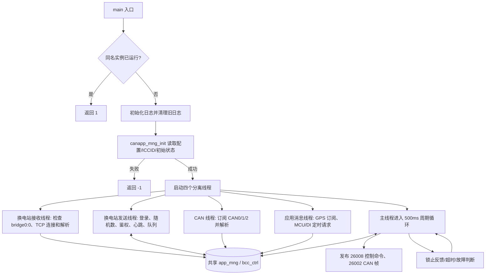
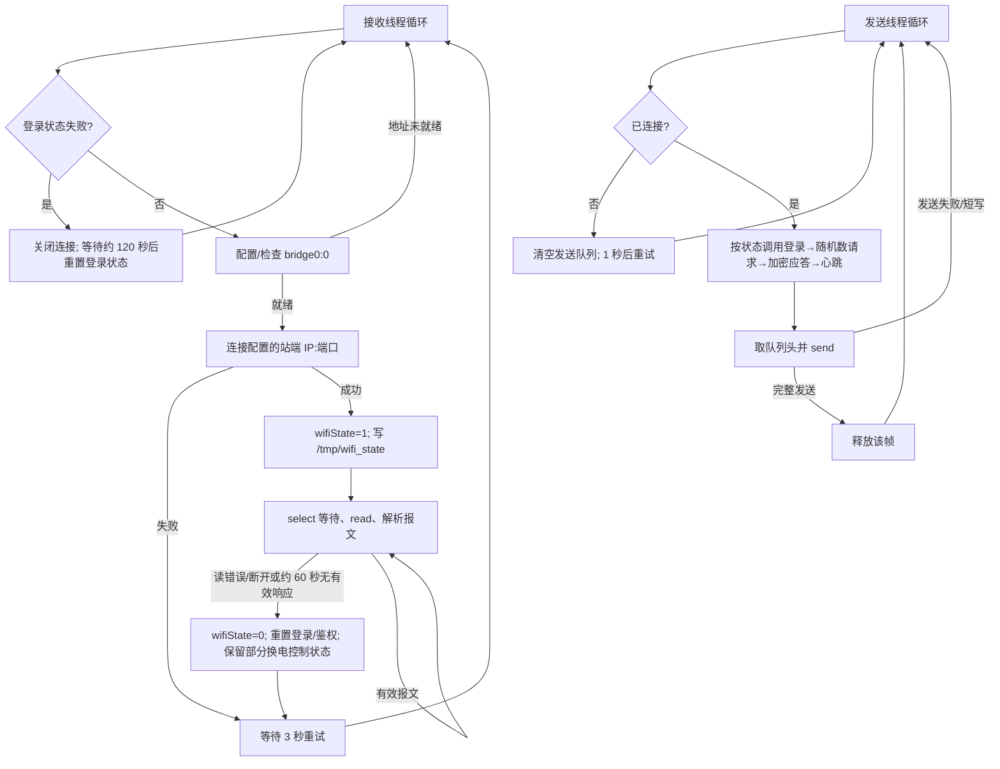
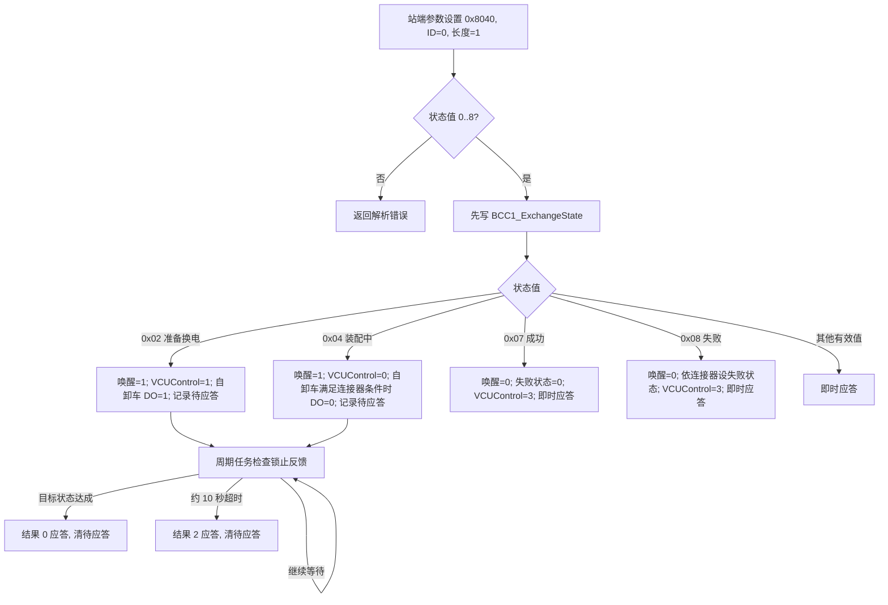

# bs_client_heavy_truck 源码分析

> 分析对象：`/home/tronlong/lyp/code/rtms_sdk/apps/bs_client_heavy_truck`。核对时仓库分支 `develop/rtms_sdk_v1.3_20240408`，提交 `bc60961e`。本文只描述此版本可从源码确认的行为；涉及站端、整车和目标设备的实际效果，需要联调验证。行号均指本次检出的源码。

<!-- rtms-analysis-guide:start -->

## 文档目录

本报告对应 `rtms_sdk/apps/bs_client_heavy_truck/` 在 `bc60961e` 的源码；跨项目关系见[源码分析总览](../源码分析总览.md)。下文原章节编号保留，先用概述、目录、架构、模块和流程五节建立整体脉络。

- [项目概述](#project-overview)
- [源码目录总览](#source-overview)
- [核心架构设计](#core-architecture)
- [核心模块深度分析](#core-modules)
- [关键流程与数据流](#key-flows)
- [1. 范围与结论](#analysis-1)
- [2. 总体逻辑流程图](#analysis-2)
- [3. 启动、配置和运行前提](#analysis-3)
- [4. 站端 TCP 与协议状态机](#analysis-4)
- [5. 换电状态与锁止控制](#analysis-5)
- [6. CAN、VIN、属性与故障](#analysis-6)
- [7. 本机消息与周期命令](#analysis-7)
- [8. 构建、条件编译与证据边界](#analysis-8)
- [9. 已确认的代码边界与核查点](#analysis-9)
- [10. 源码检索入口](#analysis-10)
- [11. 设备故障排查手册](#analysis-11)

**顺读方式：**先读下面五节，再从原第 1 节起顺序阅读详细分析；需要查特定模块时，可用模块表跳到对应章节。

<a id="project-overview"></a>

## 项目概述

重卡换电 `bs_client` 汇集 CAN、MCU、DI 与站端 TCP 状态，向本机服务发送控制命令并按反馈答复换电站；源码还含自卸车分支。

<a id="source-overview"></a>

## 源码目录总览

以下路径相对于该提交的 `apps/bs_client_heavy_truck/`；“职责”只描述源码中的构建或调用角色。

| 路径 | 职责 |
| --- | --- |
| `main.c`、`CMakeLists.txt` | 启动、周期任务与独立构建 |
| `src/app_mng/` | 配置与跨线程共享状态 |
| `src/batt_stand_client/` | 站端 TCP、协议打包解析 |
| `src/can_server/` | 车型 CAN 解析与帧发送 |
| `src/app_server/`、`src/cmd/` | GPS/MCU/DI 和本机控制命令 |
| `src/fault/`、`src/common/`、`src/list/` | 故障、配置和队列辅助 |

<a id="core-architecture"></a>

## 核心架构设计

```text
本机 CAN / MCU / DI → app_mng 共享状态
                              ├→ batt_stand_client ↔ 换电站 TCP
                              └→ cmd / can_server → 本机控制接口
车型与平台宏决定部分解析及 DI/DO 映射
```

该目录未纳入标注提交的顶层 apps/CMakeLists.txt；下述流程以独立目标构建并部署为前提。图中箭头表示源码中的数据或控制方向；外部服务和设备效果以正文标明的证据边界为准。

<a id="core-modules"></a>

## 核心模块深度分析

下表给出主链路模块的入口、关键判断和详细分析位置；具体函数、常量与失败路径以所链章节中的源码引用为准。

| 模块 | 源码入口 | 关键判断与输出 | 详细分析 |
| --- | --- | --- | --- |
| 启动与共享状态 | `main.c`、`src/app_mng/` | 车型、平台宏和配置共同决定实际分支 | [进入章节](#analysis-3) |
| 站端链路 | `src/batt_stand_client/` | 连接、鉴权、心跳、收发与分帧风险 | [进入章节](#analysis-4) |
| 锁止控制 | `src/batt_stand_client/`、`src/cmd/` | 站端状态与本机控制/反馈需分段核对 | [进入章节](#analysis-5) |
| 车辆与故障 | `src/can_server/`、`src/fault/` | 车型 CAN、VIN 和故障路径影响上报内容 | [进入章节](#analysis-6) |

<a id="key-flows"></a>

## 关键流程与数据流

~~~text
本机 CAN / MCU / DI → app_mng 共享状态
共享状态 ↔ 站端 TCP 连接 / 报文 / 换电状态
站端 0x02 / 0x04 状态 → 本机控制命令 → 锁销反馈或超时 → 站端结果应答
~~~

[总体逻辑图](#analysis-2)给出参与线程；[站端协议](#analysis-4)、[锁止控制](#analysis-5)、[车辆数据](#analysis-6)分别展开。此路径以该目标单独构建并部署为前提；TCP 收包不等于本机动作完成。

<!-- rtms-analysis-guide:end -->

<a id="analysis-1"></a>

## 1. 范围与结论

本目录约 7,600 行 C/C++ 与构建代码，主程序名为 `bs_client`。它把换电站 TCP 协议、本机 CAN 数据、本机 MCU/GPS/DI 状态及控制命令连接起来；全局 `app_mng_t` 和 `bcc_ctrl_t` 是跨线程共享状态。目录名虽然是重卡，代码也处理 `dump_truck` 和 `dump_truck_newc`。顶层 `apps/CMakeLists.txt` 当前没有纳入此目录，因此下文的“运行流程”是该目标成功单独构建并部署后的源码流程，不代表现有顶层构建会启动它。[依据：`CMakeLists.txt:1-82`、`main.c:276-334`、`src/app_mng/app_mng.h:11-21`、`apps/CMakeLists.txt`]

### 源码层次

| 层次 | 文件 | 实际职责 |
| --- | --- | --- |
| 入口与周期调度 | `main.c` | 单实例、日志、初始化、线程、DI/锁止反馈、超时及周期控制。 |
| 共享状态与配置 | `src/app_mng/app_mng.c/.h` | 初始化 `app_mng_t`、`bcc_ctrl_t`，读取设备和站端配置。 |
| 换电站链路 | `src/batt_stand_client/batt_stand_client.c` | TCP 建连、重连、收发队列、登录/鉴权/心跳调度。 |
| 站端协议 | `batt_message_pack.c/.h`、`batt_message_parse.c` | 报文打包、校验与命令解析、属性应答、锁止结果应答。 |
| CAN 输入和输出 | `src/can_server/can_server.c`、`can_frame_pack.c` | CAN 帧订阅、按车型解析、VIN 获取、发送 T-Box 状态和故障帧。 |
| 本机状态与命令 | `src/app_server/`、`src/cmd/` | GPS 订阅、MCU/DI 请求、向命令服务发布换电及 DO 命令。 |
| 故障和基础组件 | `src/fault/`、`src/common/`、`src/log/`、`src/net_utils/`、`src/skt_res/`、`src/list/`、`src/iniparser/` | 故障判定、配置/位操作、日志、网络、队列和 INI 解析。`src/aes128/` 有自带 AES 实现，但当前鉴权调用 OpenSSL AES 接口。 |

<a id="analysis-2"></a>

## 2. 总体逻辑流程图

纯文本版（任何 Markdown 阅读器均可显示）：

```text
main()
  │
  ├─ 同名实例已运行？ ─ 是 → 返回 1
  │                      否
  ├─ 日志初始化、清理旧日志
  ├─ canapp_mng_init：配置 / VIN / ICCID / 共享状态
  │                      └─ 失败 → 返回 -1
  ├─ 启动四个分离线程
  │   ├─ 站端接收：网络检查 → TCP 连接 → 读包解析 ─┐
  │   ├─ 站端发送：登录/鉴权/心跳 → 发送队列 ───────┤
  │   ├─ CAN 接收：CAN0/1/2 → 帧解析 ─────────────┤→ app_mng / bcc_ctrl
  │   └─ 应用消息：GPS 订阅 + MCU/DI 请求 ──────────┘
  └─ 主线程每约 500 ms：反馈/超时 → 本机控制命令 → 故障判断 → 循环
```

支持 Mermaid 的阅读器还可显示下图：



`main()` 创建四个 `pthread` 并立即 `detach`；没有检查 `pthread_create` 返回值。主线程自身执行 `start_timer_task()`，持续 `usleep(500000)`。`SIGINT` 直接退出，`SIGPIPE` 被忽略；`SIGUSR1`/`SIGUSR2` 直接改共享换电状态。[依据：`main.c:44-70,276-334`]

<a id="analysis-3"></a>

## 3. 启动、配置和运行前提

1. `is_instance_existing(argv[0])` 以传入的程序名拼 `/tmp/<argv[0]>.pid`，通过 `flock(LOCK_EX | LOCK_NB)` 判重。若启动参数是带斜线的路径，生成的 pid 路径也含斜线；源码没有规范化 basename，也没有显式关闭该 fd。[`src/common/common.c:255-280`]
2. `log_init()` 在 `/media/sdcard/bs_client_log/` 建目录并创建 `truck_hdz-YYYYMMDD-HHMMSS.log`；日志线程异步写入。`main()` 没检查 `log_init()` 的返回值。启动参数 `days` 默认 2，若大于 7 则回退到 2；旧日志清理按文件名中的日期整数比较，不是严格的日历日期差。[`src/log/log.cpp:24-29,206-253,520-601`、`main.c:289-306`]
3. `canapp_mng_init()` 分配站端发送队列及 BCC 状态；从 `/opt/conf.ini` 读 `dev:id`，从 `/opt/electic_station.ini` 读车型、VIN、是否请求 VIN、历史换电状态、站端 IP/端口。缺失配置时使用代码默认值；会把站端 IP/端口写回配置文件。[`src/app_mng/app_mng.c:34-149`]
4. `USE_MACHINE_VIN` 编译宏启用且车型为重卡时，先读 `/opt/machine_vin`。否则优先取 `station:vin`，无值时尝试用设备 ID 更新站端报文 VIN；`batt_stand_update_vin()` 只接受长度恰为 17 的值，默认报文 VIN 为 17 个 `F`。`enable_vin_request=true` 才令 VIN 请求流程开始。[`src/app_mng/app_mng.c:73-112`、`batt_message_pack.c:12,51-57`]
5. 初始化最后调用 `get_iccid(1)`；返回空指针则 `main()` 退出。只有编译了 `EC200A_ENABLE` 的分支才调用 Quectel SIM API；其他编译分支直接返回固定的 `12345678901234567890` 测试字符串。因此不能笼统地认为所有平台都会读真实 SIM ICCID。[`src/common/common.c:15-50`、`src/app_mng/app_mng.c:132-149`]

| 配置/地址 | 源码默认或用途 |
| --- | --- |
| `station:vehicle_type` | 默认 `heavy_truck`；收到特定 CAN 帧还会自动改成 `dump_truck` 或 `dump_truck_newc` 并写回。 |
| `station:server_ip`、`station:server_port` | 默认 `192.168.100.101:7701`。头文件中另有 `192.168.250.1:7701` 常量，但实际 `connect_server()` 用配置值。 |
| `station:exchange_state` | 初始化 `BCC1_LastSaveExchangeState` 和 `BCC1_ExchangeState`；能否代表物理状态，源码无法证明。 |
| `bridge0:0` | 连接站端前要求本地 `192.168.100.1`；缺失时执行 `ifconfig bridge0:0 192.168.100.1 up`。 |
| `/tmp/wifi_state` | TCP 建连后写 `1`、断开后写 `0`，并同步 `wifiState`；是本进程连接标志。 |
| `16002/16003/16004` | nanomsg SUB 接收本机 CAN0/1/2 帧。 |
| `16005` | nanomsg SUB 接收 GPS JSON。 |
| `38000` | 两个 nanomsg REQ socket 分别请求 MCU 与 DI JSON。 |
| `26002`、`26008` | nanomsg PUB 分别向本机 CAN 发送端、命令服务发送数据。 |

以上环回地址由本机其他服务绑定；本目录只调用 `nn_connect`。设备侧进程名、服务自启动方式和真实网桥拓扑不在本目录定义。[`src/can_server/can_server.c:94-112,886-926`、`src/app_server/{gps,mcu,di}.c`、`src/cmd/cmd.c:21-42`]

<a id="analysis-4"></a>

## 4. 站端 TCP 与协议状态机

纯文本版：

```text
接收线程：
  登录失败？ ─ 是 → 关闭连接 → 等待约 120 秒 → 重置登录状态 ─┐
      │ 否                                                   │
      ↓                                                      │
  检查/配置 bridge0:0 → TCP 连接站端 ─ 失败 → 3 秒后重试 ────┤
      │ 成功                                                 │
      ↓                                                      │
  wifiState=1 → select/read → 解析站端报文 → 有效则继续读取     │
      │ 读错、断线或约 60 秒无有效响应                         │
      ↓                                                      │
  wifiState=0 → 重置登录/鉴权并保留部分换电控制状态 → 3 秒后重试 ┘

发送线程：
  未连接 → 清空待发队列 → 1 秒后重试
  已连接 → 按状态安排 登录 → 随机数请求 → 加密应答 → 心跳
         → 取队列头 → send 完整发送后释放；失败或短写则保留并重试
```

支持 Mermaid 的阅读器还可显示下图：



接收线程用 `select` 的 1 秒超时循环处理一个 TCP fd。`batt_message_parse()` 返回 0 时更新“最后有效响应”时间；超过 60 秒则断开。登录失败进入 120 秒冷却；普通断线后等待 3 秒重连。断线时重置登录和鉴权状态、关闭 fd、清掉部分请求字段；`clear_can_req_data()` 明确保留唤醒请求和换电状态，只将 `BCC1_VCUControl` 设为 3。[`batt_stand_client.c:367-518`、`src/can_server/can_server.c:74-92`]

实际建连函数 `skt_res_new_socket_ip()` 先使用阻塞式 `connect()`，成功后再给 fd 加 `O_NONBLOCK`。因此 `send()` 的短写、`EAGAIN` 等情况应按非阻塞 socket 考虑，而建连耗时没有在本目录设置单独超时。[`src/skt_res/skt_res.c:61-96`]

### 发包门槛和节拍

| 动作 | 发送条件 | 最短间隔 |
| --- | --- | --- |
| 车辆登录 | `LoginStat == UNKNOW` | 5 秒 |
| 随机数请求 | 登录成功，鉴权尚未成功且尚未取得随机数 | 5 秒 |
| 加密应答 | `AuthStat == SEED_GOT` | 5 秒 |
| 心跳 | 鉴权成功 | 5 秒 |
| 参数设置应答、属性查询应答 | 鉴权成功；属性主动上报还要求应答流水号为 0 | 主动属性上报 10 秒；普通应答无此节流 |

发送线程每约 500 毫秒检查这些条件，并从带互斥锁的链表取出待发数据。未连接时清空队列。`send()` 返回完整长度才释放当前帧；失败或短写时保留，源码未实现短写偏移续传。[`batt_stand_client.c:52-80,82-365,518-585`]

### 报文结构与接收分派

外层包为 `##` 起始、命令类型、应答标志、17 字节 VIN、加密方式、2 字节大端数据长度、数据域和 1 字节 BCC；头长 24 字节，最短帧 25 字节。`getBCC()` 对起始符之后至校验前的字节做异或。自定义报文的数据域还有 2 字节长度及三一扩展头（客户码 `0x34`、版本 `1.0`、消息 ID、流水号、消息长度）。打包器的外层 `_encryMode=0x01` 注释为“不加密”；鉴权应答的数据体内部另经 AES-128-ECB 加密并以 PKCS#7 补齐。[`batt_message_pack.h:4-30,135-159`、`batt_message_pack.c:129-173,320-382`、`src/common/common.c:106-123`]

| 收到的类型/消息 ID | 当前实现 |
| --- | --- |
| 登录 `0x01` | 按应答标志置成功/失败及响应时间。 |
| 心跳 `0x07` | 记录成功或错误；不是单独的链路状态机。 |
| 自定义 `0x800A` | 校验请求流水号、算法号和密钥序号，保存 3 字节随机数与扩展参数，置 `SEED_GOT`。 |
| 自定义 `0x801A` | 校验流水号与结果，置鉴权成功或失败。 |
| 自定义 `0x8040` | 参数 ID 0、长度 1 时把参数解释为换电状态；状态 2、4 等待锁止反馈，其余有效状态立即应答。 |
| 自定义 `0x8041` | 根据属性 ID 列表组装车辆状态应答，普通列表请求还会设置唤醒 VCU 请求。 |
| 自定义 `0x8001` | 记录平台通用应答日志。 |

**属性内容**由 `propUnit[]` 映射到共享字段，分组如下。代码为每项输出 2 字节属性 ID、1 字节长度及指定长度的值；2/3/4 字节数值在输出时按大端处理。[`batt_message_pack.h:32-67`、`batt_message_pack.c:17-49,473-769`]

| 属性 ID 范围 | 内容 |
| --- | --- |
| 0～3 | VCU ePT 状态、手刹、档位、允许换电。 |
| 4～13 | BCC 滚动计数、锁销、连接器及充/放电连接状态、唤醒请求、失败状态、换电状态、故障等级与错误码。 |
| 14～21 | 八个充/放电正负极温度字段。 |
| 22～23 | 预留字段、BMS SOC。 |
| 24～29 | 额定容量、24 字节电池编码、累计充/放电量、里程、连接器状态的第二属性 ID。 |

接收端当前不按外层长度先切完整 TCP 帧：它直接对一次 `read()` 的全部字节做 BCC 检查，然后才尝试 `NEXT_PACKET`；因此 TCP 分包或多帧合包的可靠性不能从代码保证。[`batt_message_parse.c:90-453`]

<a id="analysis-5"></a>

## 5. 换电状态与锁止控制

纯文本版：

```text
站端参数设置（消息 0x8040，参数 ID=0，长度=1）
  └─ 状态值 0..8？
       ├─ 否 → 解析错误；注意源码已先写入共享状态
       └─ 是 → 按状态执行：
            ├─ 0x02 准备换电 → 唤醒=1、解锁、记录待应答
            ├─ 0x04 装配中   → 唤醒=1、锁止、记录待应答
            ├─ 0x07 成功     → 清唤醒/失败，立即应答
            ├─ 0x08 失败     → 清唤醒，依连接器设失败状态，立即应答
            └─ 其他有效值   → 立即应答

对 0x02/0x04，主线程周期检查：
  ├─ 锁销反馈达到目标 → 结果 0 应答，清待应答
  ├─ 等待约 10 秒超时 → 结果 2 应答，清待应答
  └─ 其余情况         → 下一轮继续检查
```

支持 Mermaid 的阅读器还可显示下图：



站端状态值在源码注释中定义为 `0` 无效、`1` 已连接、`2` 准备换电、`3` 卸载中、`4` 装配中、`5` 电池已放置、`6` 锁止、`7` 成功、`8` 失败。只有 `2` 和 `4` 进入延迟应答；`batt_response_parm_set()` 以 `BCC1_LockPin_Sts=1` 判断解锁，以 `=2` 判断锁止，超时约 10 秒发结果 2。`CHECK_PIN23_PIN30_CHANGE` 打开时，任一反馈引脚变化也可满足成功条件。[`batt_message_parse.c:256-356,34-88`]

主循环从 DI 的三个引脚读锁销、气缸、连接器状态：AG35GL 对应 `di_h_07/09/10`，其他平台对应 `di_in_07/08`、`di_pwm_09`；非新底托重卡及自卸车依赖这一分支。重卡收到 CAN `0x98FFD1EF` 后将 `new_battery_base=1`，锁止状态改从该帧解码。DI 信息未到达时 `check_and_update_bcc()` 直接返回。[`main.c:106-159`、`src/can_server/can_server.c:797-822`]

主循环还实现了两个保护条件：存在换电唤醒请求**或**锁销反馈为解锁时，如 VCU 处于代码值 `0x02`、手刹为 `0`、站端断线，则将换电状态设成 `0x04` 并清唤醒；唤醒请求仍在且站端断开超过约 1800 秒时也清唤醒。重卡的 DO 在唤醒时设 1、否则设 0。`send_cmd_ctrl_period()` 在这段保护逻辑之前调用，所以保护逻辑对命令发布的影响最早发生在下一轮。这里是代码赋值逻辑，物理锁止动作依赖本机命令接收方和 VCU。[`main.c:219-272`]

<a id="analysis-6"></a>

## 6. CAN、VIN、属性与故障

CAN 接收线程将 nanomsg 收到的字节按 `sizeof(can_frame_t)` 分块，按帧 ID 和车型更新 BCC 状态。主要映射如下；同一车型可能还有其他 ID，完整位定义应以 `can_frame_parse()` 为准。[`src/can_server/can_server.c:488-884`]

| 数据 | 重卡 | 自卸车 | 新 C 自卸车 |
| --- | --- | --- | --- |
| VCU 档位/手刹/可换电 | `0x98FFF303` | 档位来自 `0x98FFF303`，手刹来自 `0x9C1F3E17` | 同左 |
| SOC | `0x98FFF101` | `0x9884EFF3` | `0x9ACE0DF3` |
| 电池编码 | `0x98E1EFF3` 或 `0x9ACE03F3` 四片拼接 | 同一分支 | 同一分支 |
| 额定容量 | `0x98FF26B6` | `0x98E2EFF3` | `0x9ACE04F3` |
| 累计充放电 | `0x99FFF918` | `0x98C3EFF3` | `0x9ACE15F3` |
| 里程 | `0x98FEC1EE` | `0x98FEC117` | `0x98FEC117` |
| VIN | `0x97FFF505` 应答及 `0x17FF7F1F` 请求 | `0x98ECFF80`/`0x98EBFF80` 多帧 | `0x9CECFF4A`/`0x9CEBFF4A` 多帧 |

重卡 VIN 请求代码约每 500 毫秒检查一次，按握手 1～3、请求 1～4 递进；每次发出后设 2 秒响应期限，超时将下次重试推迟 10 分钟，最多 3 次。成功拼出 17 字节字母数字 VIN 后更新站端报文 VIN 并写回 INI。不过发送函数写入 `local_fd[0]`，本目录未找到给该 fd 赋 CAN 发送端句柄的代码，须先核查该路径在目标系统是否实际可用。自卸车分支使用 TP.BAM/TP.DT 分片拼 17 字节 VIN，收到识别车型的帧也可能改写 `station:vehicle_type`。[`can_server.c:206-295,403-487,553-625,824-840`、`src/app_mng/app_mng.h:188-216`]

主循环约每 500 毫秒累计 `canIdleTimeout`、`bmsIdleTimeout`，达到 10 次时清除部分车辆或电池字段并把对应状态置 0；这相当于约 5 秒量级，实际值受循环调度影响。清理函数特意保留手刹、锁销、连接器、换电状态和里程等字段，不是把整份状态清零。[`main.c:185-201`、`can_server.c:31-92`]

发送侧在本机 `26002` 发布 CAN 故障帧。`can_tbox_fault_send()` 仅在故障等级非零时调用故障打包；一个故障发单帧，多个故障走 TP 多帧。主循环仅在重卡分支调用它，且在 `fault_handle()` **之前**调用，因此本轮新判定的故障最早在下一轮被发送。`can_cmd_18FFA0FC_pack()` 虽定义了滚动计数、锁销、连接器、唤醒、失败状态、换电状态、VCU 控制的打包方式，但本目录没有发现调用点，不能把它写成当前发送流程。`can_tbox_id_send()` 同样有定义但未被主流程调用。`fault_handle()` 仅在开机 60 秒后、约每 10 秒检查锁销中间态和连接器未连接两项，分别置 `LOCK_UNLOCK_FAULT`、`UNCONN_FAULT`。源码中的 `gps_fault` 等局部变量没有进入当前判定。[`can_frame_pack.c:102-145`、`fault_handle.c:17-46,77-217`、`can_server.c:114-205`、`main.c:264-269`]

<a id="analysis-7"></a>

## 7. 本机消息与周期命令

`app_msg_task()` 以 GPS SUB 接 `16005`；MCU 与 DI 各用 REQ 接 `38000`。POSIX `SIGEV_THREAD` 计时器每 5 秒请求 MCU、每 3 秒请求 DI，主循环用 `nn_poll` 等待响应。GPS JSON 的 `location_info`、MCU/DI JSON 的 `status.io` 被解析到共享结构中。[`app_server.c:17-152`、`gps.c:8-100`、`mcu.c:8-126`、`di.c:8-124`]

MCU 请求体含 `status.io:["mcu"]`，DI 请求体含 `status.io:["di"]`；响应解析按 `dev` 过滤，再读取 MCU 的版本、电压、温度、ACC/IG，或 DI 的通道 `level`。GPS 解析经 cJSON 读取时间、经纬度、速度、卫星数量等字段。本目录仅保存这些 GPS 字段，未找到 GPS 参与 `fault_handle()` 或换电状态判定的调用。[`mcu.c:30-126`、`di.c:30-124`、`gps.c:47-100`、`fault_handle.c:184-217`]

`send_cmd_ctrl_period()` 向 `26008` 发布三类本机命令：换电唤醒与状态（`BS_CMD_TAG=221`，值变化或超过 5 秒）、DO 通道/电平（`DO_CMD_TAG=50`，值变化或超过 5 秒）、连接标志（`OPEN_INFO_CMD_TAG=105`，变化或超过 10 秒）。平台为 AG35GL 时 DO 用通道 3 的枚举值 `2`，其他平台用通道 6 的枚举值 `5`；结构体具体布局在 `src/cmd/cmd.h`。这些命令是否被下游正确执行，须检查对应接收进程。[`src/cmd/cmd.c:21-167`、`cmd.h:6-92`]

### 辅助模块在当前调用链中的作用

| 模块 | 源码可确认的作用与边界 |
| --- | --- |
| `src/common/` | 提供大端转换、BCC 异或、位域提取/设置、INI 读写、进程锁及时间函数。`save_conf()` 用 `w+` 重写整份 INI；`get_str_value_from_conf()` 和 `get_int_value_from_conf()` 加载字典后没有调用 `iniparser_freedict()`，长时间反复调用会累积内存。 |
| `src/iniparser/` | 随项目编译的 INI 解析器和字典容器；配置键采用 `section:key` 格式。它是通用组件，本文不把其每个通用 API 当作换电业务流程。 |
| `src/list/` | `batt_stand_send()` 用 `List_push_end()` 将待发帧放到链表尾，发送线程用 `List_pop()` 从头取；外围互斥锁保护链表。 |
| `src/net_utils/`、`src/skt_res/` | 前者通过 `ioctl(SIOCGIFADDR)` 读取网卡 IP；后者建立站端 TCP 连接，成功后切非阻塞。 |
| `src/log/` | 日志异步入队，后台线程写 SD 卡文件并输出 stderr；文件达到 512 KiB 时调用 `log_file_reinit()`。由于重建函数按当前秒生成文件名并用 `w+` 打开，同秒重建可能覆盖同名日志，需要结合设备日志验证。 |
| `src/aes128/` | 源码作为构建输入存在，当前站端鉴权函数实际调用 `<openssl/aes.h>` 的 `AES_set_encrypt_key()` 和 `AES_ecb_encrypt()`。 |

[依据：`src/common/common.c:76-123,255-401`、`src/list/sany_list.c:17-92`、`src/net_utils/net_utils.c:21-50`、`src/skt_res/skt_res.c:61-96`、`src/log/log.cpp:24-29,170-239,420-520`、`batt_message_pack.c:320-382`]

<a id="analysis-8"></a>

## 8. 构建、条件编译与证据边界

- `CMakeLists.txt` 定义 `bs_client` 2.1、C99，依赖 nanomsg、OpenSSL、tbox-common、cJSON、appmng，以及 cn-cbor、pthread、stdc++ 等；安装程序到安装前缀的 `opt/`。交叉编译选择 `EC200A`、`EG25G`、`MCIMX6Y2CVM08AB`、`AG35GL`。这只是 CMake 中列出的分支，不能推断每个平台当前都能完成链接或跑通设备协议。
- `USE_MACHINE_VIN` 决定是否优先读取 `/opt/machine_vin`；`CHECK_PIN23_PIN30_CHANGE` 决定参数设置应答是否把反馈引脚变化视为成功。`QL_MODULE_PLATFORM_AG35GL` 决定 DI/DO 映射。宏的实际开启状态需查看最终编译命令，不能由源码目录名判断。
- `EC200A_ENABLE` 单独决定 `get_iccid()` 是真实 SIM API 路径还是固定测试字符串；它与 CMake 里设置的 `QL_MODULE_PLATFORM_EC200A` 名称不同，需检查构建时是否另有定义。
- `main.c` 的 `cpactive_task()`、`check_batt_exchange_stat()`，`can_server.c` 的 `can_tbox_id_send()`，以及 `can_frame_pack.c` 的多种打包函数在本目录主调用链没有调用点；这些实现不能当作当前设备流程。`batt_stand_send_task()` 中主动属性上报调用也被注释。
- 本目录没有专用测试目标或站端模拟器。本分析是静态源码审查，没有以实车、站端、CAN 总线或目标设备日志验证。外部协议文档、第三方库和其他进程不在本次分析范围内；“物理锁止成功”“鉴权安全性满足要求”等结论不能从本目录单独得出。

<a id="analysis-9"></a>

## 9. 已确认的代码边界与核查点

以下均可在本版本源码定位，是维护和联调时应优先核查的点；其中“可能后果”是依据代码路径的推论，不等于已在目标设备复现。

| 位置 | 源码事实 | 可能后果或核查方式 |
| --- | --- | --- |
| `batt_message_parse.c:90-453` | 仅先检查总长度至少 25、起始符和整次 `read()` 的 BCC；读取嵌套头及扩展参数前未按数据域长度逐层验证。 | TCP 拆包/合包或畸形长度可能导致误判、越界读取。用边界报文和流式分帧测试核查。 |
| `batt_message_parse.c:352-390` | 全属性请求（`_propNumber=255`）算出完整属性列表后，调用应答时传入原请求的 `_propListLen`，而不是新得到的 `_propNumber`。 | 请求只含数量字节时 `_propListLen=0`，属性应答可能被拒绝；需用实际报文验证。 |
| `batt_message_parse.c:256-271` | 先把收到的状态写入 `BCC1_ExchangeState`，随后才判是否大于 8；该字段为无符号字节，`<0` 分支不会成立。 | 无效状态可能已留在共享状态，且该分支未发送失败应答。 |
| `batt_message_pack.c:13-14,320-382` | 鉴权使用固定 16 字节密钥 `00..0F`，调用 OpenSSL AES-128-ECB，按 PKCS#7 填充；同目录自有 AES 实现没有用于此路径。 | 密钥轮换、保密和协议匹配需要与站端设计核实；不要把静态“鉴权成功”当作安全评估。 |
| `batt_stand_client.c:518-585` | `send()` 仅在返回完整长度时释放当前帧；返回短写后仍从起始地址重发。 | TCP 可能收到重复前缀，应考虑记录发送偏移。 |
| `app_server.c:92-103,130-140`、`di.c:77-83` | `nn_sock[3]` 只显式指定前两个元素为 `-1`，第三个按 C 规则初值为 0；定时器先于 socket 初始化。DI 数组以 `sizeof(mcu_info_t)` 分配，解析时接受 `channel == MAX_DI_CHANNELS`。 | 定时器若在初始化完成前触发，DI 请求可能误用 fd 0。DI 的通道上界逻辑不对；目前较大的分配尺寸可能掩盖越界，改正分配类型时必须同时改边界判断。 |
| `common.c:255-280` | pid 文件路径直接拼 `argv[0]`，且未检查 `open()` 成功。 | 带路径启动时可能无法正常建立判重文件；应核查实际启动方式。 |
| `main.c:44-70` | 信号处理函数会读写共享指针和调用日志/输出函数。 | 异步信号场景需要检查可重入性及初始化完成前收到信号的行为。 |
| `can_server.c:206-295` | VIN 请求把单调时间毫秒值存为 `uint16_t`，并与较宽的超时字段比较。 | 长运行或计数回绕时重试间隔可能偏离预期；需要目标运行日志或单元模拟核查。 |
| `can_server.c:206-295`、`app_mng.h:188-216` | VIN 请求写 `local_fd[0]`；本目录没有给它赋值的代码，全局对象初值为 0。 | 若无外部初始化，VIN 请求可能写到标准输入 fd；先查目标部署与调用链。 |
| `log.cpp:255-261` | `log_set_level()` 直接 `pthread_mutex_unlock(&g_file_lock)`，函数内没有对应加锁，且返回类型为 `int` 却无返回值。 | 启动路径调用此函数；线程同步行为须优先排查。 |
| `common.c:283-345`、`log.cpp:420-455` | 每次配置读取会创建 INI 字典而未释放；日志超限后按当前秒重建同名文件并以 `w+` 打开。 | 长运行内存增长和同秒日志覆盖需核查；可用泄漏检测与快速写日志场景验证。 |
| `can_server.c:775-795` | 新 C 自卸车累计充/放电组装时，先写最高字节又用赋值覆盖为下一字节。 | 四字节容量最高字节丢失；应以总线样本核对。 |

<a id="analysis-10"></a>

## 10. 源码检索入口

要继续追某条链路，可从 `main.c` 的 `main()` 与 `start_timer_task()` 入手；站端收发看 `batt_stand_client.c` 的 `batt_stand_client()`、`batt_stand_send_task()`；站端命令看 `batt_message_parse()`；CAN 看 `can_frame_parse()`；周期命令看 `send_cmd_ctrl_period()`。上面每节给出了本次核对的文件与行号，分支或提交变化后应重新定位。

<a id="analysis-11"></a>

## 11. 设备故障排查手册

本节用于设备上已经怀疑 `bs_client` 异常时定位故障层级。命令均为**只读采集示例**；目标系统若只有 BusyBox，可用其对应子命令替代。先保留现场时间、原始日志和配置副本，再决定是否重启；不要用 `SIGUSR1`、`SIGUSR2` 当作诊断手段，它们会改写锁止/解锁控制状态。[`main.c:44-70`]

### 11.1 先确定故障落在哪一层

```text
设备问题
  │
  ├─ 找不到 bs_client 进程？ → 启动/依赖/配置/日志初始化（11.3）
  │
  └─ 进程存在
       ├─ 无站端连接？ → bridge0:0 → 站端地址/端口 → TCP 重连（11.4）
       ├─ 已连接但无业务？ → 登录 → 随机数 → 鉴权 → 心跳（11.5）
       ├─ CAN/BMS/VIN 异常？ → 本机 nanomsg → 帧 ID/车型 → VIN 路径（11.6）
       ├─ 锁止/解锁异常？ → 参数命令 → 发布命令 → DI/CAN 反馈 → 应答（11.7）
       └─ 日志/属性/故障上报异常？ → 对应队列、打包与日志路径（11.8）
```

**判定原则：** `bs_client` 进程在运行，只能证明入口与部分线程被创建；`/tmp/wifi_state=1` 只能证明代码曾建立 TCP 连接；“登录成功”不等于鉴权成功；“参数应答成功”只说明程序按自己的反馈条件给出结果，不证明物理机构完成动作。按链路逐项收集证据，避免把下游服务、站端或硬件故障直接归因到本进程。[`main.c:276-334`、`batt_stand_client.c:443-518`、`batt_message_parse.c:34-88,130-245`]

### 11.2 首次采集：版本、时间、进程、日志和配置

在目标设备上记录故障发生的本地时间与时区、设备型号、车型、固件版本、问题发生前是否升级或改配置。然后采集：

```sh
date
ps -ef | grep '[b]s_client'
ls -ld /media/sdcard/bs_client_log
ls -lt /media/sdcard/bs_client_log | head
cat /tmp/wifi_state
```

`/tmp/wifi_state` 缺失不直接等于站端断开：可能进程尚未进入连接线程、日志初始化失败或写文件失败。确认进程启动日志中的 `Version ... Git hash ...`，并和正在分析的提交比较；文档对应 `bc60961e`，设备版本不同应先取得对应源码。日志在 `/media/sdcard/bs_client_log/truck_hdz-*.log`，常规 `log_info` 也会输出到 stderr；若服务管理器重定向了 stderr，需要同时查其进程输出。日志可能包含 VIN、ICCID、随机数、原始报文字节，传阅前应做必要脱敏。[`main.c:289-306`、`src/log/log.cpp:24-29,324-353,440-520`、`src/common/common.c:422-435`]

按关键事件快速筛查日志时，可用目标系统自带的 `grep`；再回到原日志核对事件前后文和时间顺序：

```sh
grep -E 'Version|Git hash|CAN_STATE|BMS_STATE|TCP_STATE|login|auth|heartbeat|bridge0:0|timeout|bcc failed|Try LOCK|Try UNLOCK|parm response' /media/sdcard/bs_client_log/truck_hdz-*.log | tail -n 150
```

配置先看文件存在、时间和关键**非敏感**字段；不要直接把完整文件或原始报文贴到工单：

```sh
ls -l /opt/electic_station.ini /opt/conf.ini /opt/machine_vin
grep -E '^(server_ip|server_port|vehicle_type|enable_vin_request|exchange_state)[[:space:]]*=' /opt/electic_station.ini
```

注意：`/opt/machine_vin` 仅在编译了 `USE_MACHINE_VIN` 且为重卡时优先读取；ICCID 是否真实读取取决于 `EC200A_ENABLE`。若配置文件不存在，部分键会取默认值，`save_conf()` 还可能创建并重写站端配置，所以“文件里现在的值”不一定就是故障发生前的值。对比文件修改时间和历史备份。[`src/app_mng/app_mng.c:73-149`、`src/common/common.c:17-50,283-401`]

### 11.3 进程不存在、启动即退出或持续重启

| 观察 | 下一步核查 | 源码依据 |
| --- | --- | --- |
| `app ... already running` | 查看是否确有另一实例、启动命令是否使用带斜线的 `argv[0]`，以及 `/tmp` 下的 pid 文件；单实例函数用 `argv[0]` 直接拼路径。 | `main.c:281-287`、`common.c:255-280` |
| `log file init failed!` 或没有日志文件 | 查 `/media/sdcard` 是否已挂载、目录是否存在且可写、空间是否不足；`main()` 没检查 `log_init()` 返回值，不能仅靠进程存在判断日志正常。 | `log.cpp:206-239,520-535`、`main.c:289-291` |
| `failed to get sim_1 iccid`、`canapp_mng_init failed` | 先确认编译宏 `EC200A_ENABLE` 与 SIM SDK 路径；启用该宏时 `ql_sim_init/ql_sim_get_iccid` 失败会令初始化退出。其他分支使用固定测试 ICCID。 | `common.c:15-50`、`app_mng.c:132-149`、`main.c:313-319` |
| 动态库加载错误，尚无应用日志 | 在目标设备检查可执行文件平台架构及所需共享库；本项目链接 nanomsg、OpenSSL、cJSON、tbox-common、appmng 等，且顶层 CMake 当前未包含该目录。 | `CMakeLists.txt:1-82` |
| 启动后偶发崩溃/卡住 | 记录退出码、核心转储或系统日志，优先核查 `log_set_level()` 的无配对解锁，以及线程创建未检查、接收报文长度校验不全。此处只是代码风险，不能仅凭症状认定根因。 | `log.cpp:255-261`、`main.c:321-329`、`batt_message_parse.c:90-453` |

可读检查示例：`ls -l /opt/bs_client`、`file /opt/bs_client`、`ldd /opt/bs_client`（目标系统有这些工具时使用）。若程序并非装在 `/opt/bs_client`，以设备实际启动脚本中的路径为准；CMake 的 `opt/` 是相对安装前缀的目标目录，不保证运行时绝对路径。不要在故障现场直接覆盖二进制或清理日志。[`CMakeLists.txt:76-82`]

### 11.4 站端连不上或频繁断线

1. 先看日志是否出现 `can not get bridge0:0 ip address` 或 `bridge0:0 ip address[...] is not 192.168.100.1`。代码连接前必须确认该别名地址；`prepare_bridge0()` 会尝试执行 `ifconfig bridge0:0 192.168.100.1 up`。用 `ifconfig bridge0:0` 查看实际结果，再查网桥/无线服务是否创建了该接口。[`batt_stand_client.c:429-490`]
2. 若地址正确，看 `socket connecting <IP>:<port>`、`socket connect ... failed/success`。对照 INI 中的站端 IP/端口，使用 `ss -tn` 或 `netstat -tn` 查看与该 IP/端口的连接状态；设备上工具可能缺失。IP 可达不代表该 TCP 服务可用，连接成功也不代表完成登录。[`src/skt_res/skt_res.c:61-96`]
3. 已连接又断开时，查 `read data error`、`select error`、`no response from plc timeout!!!`、`disconnet with server`。前者是 socket 读/等待问题；最后一个是**约 60 秒未成功解析站端响应**才断开，并非证明无线链路必然断了。若同时出现 `check bcc failed` 或 `header error`，优先保存站端原始收发样本，核对 TCP 分包、长度、BCC、协议版本。[`batt_stand_client.c:367-518`、`batt_message_parse.c:90-159`]
4. 断线时看 `/tmp/wifi_state` 和周期日志 `TCP_STATE`。`WIFI_STA_NB` 是 `hostapd_cli` 读到的接入站数，`TCP_STATE` 是本进程的站端 TCP 标志，两者来源不同；前者为 0 不自动等于后者为 0。[`can_server.c:296-400`、`batt_stand_client.c:420-427,492-514`]

### 11.5 TCP 已连接，但登录/鉴权/心跳失败

按时间顺序找：`car login success/failed` → `Get seed` → `receive auth rsp success/failed` → `receive heartbeat response success/error`。登录失败后源码约 120 秒才重试，不能把这段等待误认为重连线程停止。登录包使用 20 字节 ICCID、17 字节外层 VIN；核对设备实际 VIN 来源、`enable_vin_request`、ICCID 编译分支以及站端记录的拒绝原因。[`batt_stand_client.c:124-271,443-470`、`batt_message_pack.c:175-253`、`batt_message_parse.c:130-245`]

若日志出现 `receive seed rsp session id ... invalid`、`receive seed rsp encrypt alogrithm or secret error` 或 `receive auth rsp session id ... invalid`，对照请求与应答流水号、算法号、密钥序号；若出现 `check bcc failed`，先排除传输分帧问题。鉴权加密使用源码中的固定 16 字节 AES 密钥，不能仅看日志判断站端配置正确；需用站端对照报文核实。**注意** `receive auth rsp success` 在源码里用 `log_err()` 输出，单看 ERROR 等级会误判为失败，要以消息内容及后续心跳判断。[`batt_message_parse.c:172-245`、`batt_message_pack.c:13-14,320-382`]

心跳只有鉴权状态为成功才发送，间隔至少 5 秒；若没有心跳日志，先确认是否走到鉴权成功，再查发送队列和 socket `send failed`。`send failed` 若为暂时不可写，现有代码保留当前整帧重试；短写也不会续传剩余部分，需结合站端收到的字节流核查。[`batt_stand_client.c:82-123,518-585`]

### 11.6 CAN、BMS、VIN 或属性值不对

| 现象 | 依次检查 | 可能落点 |
| --- | --- | --- |
| `CAN_STATE=0`、`can idle timeout` | 看 CAN0/1/2 的 `16002/16003/16004` nanomsg 服务是否在，`connected to can%d port` 是否出现，再确认该车型应有的帧 ID 是否持续到达。`canState` 由特定帧刷新，收到任意 CAN 帧不一定置 1。 | 本机发布服务、总线、车型选择、`can_frame_parse()` 的帧 ID 分支。 |
| `BMS_STATE=0`、`bms idle timeout` | 核对电池编码、容量或累计充放电相关帧是否到达，以及电池是否已拆除；超时清除部分 BMS 字段。 | `can_server.c:666-792`、`main.c:196-201`。 |
| VIN 为空、全 `F` 或不更新 | 确认 `station:vin`、`USE_MACHINE_VIN`、`enable_vin_request`；重卡看 `VIN_REQ`、`VIN_RSP` 与 `vin response timeout`，自卸车看 TP.BAM/TP.DT 帧。重卡还需检查 `local_fd[0]` 未在本目录赋值的风险。 | `app_mng.c:73-112`、`can_server.c:206-295,403-487,560-625`。 |
| 属性查询无应答或数值异常 | 先确认鉴权成功、请求 ID 列表和消息长度，再核对 `propUnit[]` 的状态字段来源。全属性请求传入 `_propListLen` 的代码问题应单独复现；累计容量/里程的端序与车型换算需用原始 CAN 对照。 | `batt_message_parse.c:352-406`、`batt_message_pack.c:17-125,473-769`。 |

`show_can_data()` 约每 15 秒打印 `CAN_STATE`、`BMS_STATE`、`TCP_STATE`、VIN、SOC、容量、里程、锁销和连接器状态，可用于比对时间线。`can idle timeout`/`bms idle timeout` 是对应状态已经置 1 后约 5 秒量级没有刷新；不能从这条日志单独判断是物理 CAN 断线、上游服务停止，还是车型与帧 ID 不匹配。[`can_server.c:335-400`、`main.c:185-201`]

### 11.7 锁止/解锁失败、超时或状态不一致

这是设备动作链路，先只读观察，不向进程发送 `SIGUSR1/SIGUSR2`，也不直接写 DO 或向站端构造参数命令。排查顺序如下：

```text
站端确实发出 0x8040 参数命令？
  → bs_client 收到的参数号、长度、状态值正确？
  → BCC1_ExchangeState / 唤醒请求 / VCUControl 是否按 0x02 或 0x04 更新？
  → 26008 的命令接收进程是否收到并转发？
  → 对应平台 DO 通道及 MCU/VCU 是否执行？
  → DI（或新底托重卡的 0x98FFD1EF CAN 帧）反馈是否变化？
  → 本进程给站端的是结果 0、结果 2，还是根本没有应答？
```

日志对照：`Try UNLOCK`/`Try LOCK` 表示源码进入相应分支；`pin_23`、`pin_30`、`BCC1_LockPin_Sts` 表示输入判定；`unlock success, parm response`、`lock success, parm response` 表示程序认为反馈达标；`unlock/lock timeout, parm response` 表示约 10 秒未达标。若 `can bus no response for parm set!` 出现，源码仅记录错误，没有立即中止该参数设置。自卸车锁止时还有 `Locking in ElecConnect_Sts`/`Failed locking in ElecConnect_Sts` 的连接器条件。[`batt_message_parse.c:34-88,256-356`、`main.c:106-159`]

`0x02` 和 `0x04` 的站端应答由主循环等待锁销反馈；其他有效状态通常立即应答。参数应答还受鉴权成功门槛约束。若站端称“无应答”，须先区分未鉴权、报文校验失败、等待反馈、等待超时、应答已入队但 TCP 发送失败五种情况。若本进程已发成功应答而机构没有动作，继续核查 `26008` 接收方及 VCU/执行机构，不能把程序自己的反馈判断等同于物理成功。[`batt_stand_client.c:274-313,518-585`、`batt_message_parse.c:34-88,250-356`、`cmd.c:21-119`]

重卡新电池底托在收到 `0x98FFD1EF` 后改从该 CAN 帧取锁止反馈，普通路径从 DI 取。实际平台若 DI 通道、电平极性或车型配置不匹配，会导致“命令发出但反馈不达标”。`CHECK_PIN23_PIN30_CHANGE` 宏若开启，仅检测到引脚变化也可应答成功，排查时必须确认设备所用编译宏。[`main.c:106-159`、`can_server.c:796-822`、`batt_message_parse.c:20-88`]

若出现 `Car is ready to run. Lock batt!`，它是主循环在“唤醒中或锁销解锁 + VCU 状态 `0x02` + 手刹 `0` + 站端断线”条件下自动把状态设为 `0x04`；`bs offline timeout! clear exchange state` 表示断站约 1800 秒后清唤醒。两者是不同路径，应把该时刻的 `TCP_STATE`、VCU 状态与锁销反馈放在同一时间线上。[`main.c:219-263`]

### 11.8 故障上报、日志与进程间命令异常

- 若车辆侧没有收到本进程命令，先查本机 `26008` 的接收方和日志 `connected to cmd port for pub`、`send bcc cmd failed`、`send do cmd failed`、`wifi_state output`。这些是 nanomsg PUB 消息；连接成功不证明订阅方处理成功。重卡故障 CAN 发布另走 `26002`。[`cmd.c:21-167`、`can_server.c:94-112,162-205`]
- 若站端看到故障而本机认为正常，核对锁销状态 `0` 和连接器状态是否为 `1`。`fault_handle()` 只在开机满 60 秒后约每 10 秒判这两项；主循环先发故障、后更新判定，所以存在一轮延迟。自卸车分支当前不调用该故障流程。[`fault_handle.c:184-217`、`main.c:264-269`]
- 若日志突然缺失，先核对 `/media/sdcard/bs_client_log` 的挂载/空间与 stderr。日志线程异步消费队列，进程异常退出可能丢最后一段尚未写入的日志；`log_init()` 失败不阻止 `main()` 继续。若同一秒内触发 512 KiB 重建，`w+` 打开同名文件有覆盖风险。[`log.cpp:206-239,420-535`]
- `log_info` 默认可见而 `log_debug` 默认被过滤；`hexDump()` 走 `log_write_simple()`，该函数要求日志级别至少为 DEBUG，因此默认 INFO 级别下也看不到这些十六进制输出。搜不到十六进制细节不代表相应代码未运行。应尽量保留设备的原始日志文件和进程输出，再按时间对齐分析。[`main.c:289-291`、`common.c:422-435`、`log.cpp:324-379`]

### 11.9 最小证据包与复核标准

给开发人员的最小证据包应包含：故障时间段与时区、设备型号和固件/`bs_client` 版本及 Git 哈希、车型配置、进程启动方式、相关日志原件、`bridge0:0` 与站端 IP/端口、`/tmp/wifi_state` 与 `TCP_STATE`、同一时间段的 CAN/DI 状态或站端请求应答记录。对于控制故障，还应附站端命令流水号、程序应答结果、下游 `26008` 接收日志和物理反馈时间；敏感的 VIN、ICCID、随机数及完整原始报文只在受控范围提供。

定位结论至少要说明：**哪一步最后被证实成功、下一步缺少哪条证据、对应哪个代码条件、是否在目标设备复现**。修改程序后按“能启动→能连接→登录鉴权→CAN/DI 数据→站端属性→控制命令→锁销反馈→故障与断线恢复”逐段回归。涉及锁止机构的动作测试应在具备站端与车辆安全条件的受控环境进行；静态源码检查或仅重启进程无法替代这一步。
