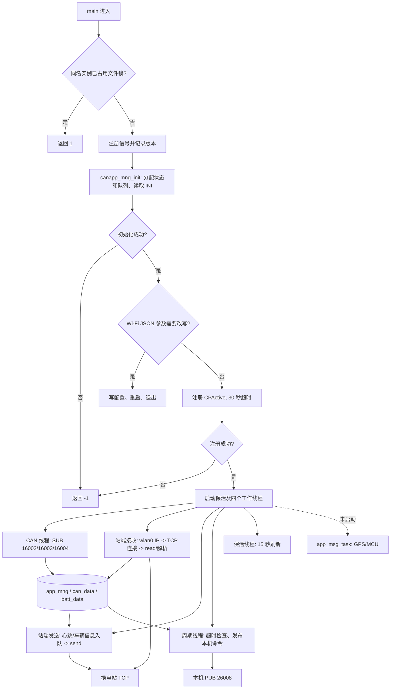
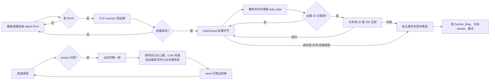

# bs_client_port_crane 源码分析

> 分析对象：`/home/tronlong/lyp/code/rtms_sdk/apps/bs_client_port_crane/`；Git 分支 `develop/rtms_sdk_v1.3_20240408`，提交 `bc60961e`。下文的文件行号对应这次检出的源码。分析以本目录、`apps/CMakeLists.txt` 的静态调用关系为依据；外部库、本机服务、换电站和真实整车行为不在本次源码中，不能由本报告替它们作运行保证。

阅读顺序：先看[主流程图](#3-实际逻辑流程图)和[站端流程图](#61-连接重连发送)，再按[现场故障排查](#11-现场故障排查手册)定位问题。两处流程都提供纯文本版，可在普通 Markdown 阅读器中直接看到。

<!-- rtms-analysis-guide:start -->

## 文档目录

本报告对应 `rtms_sdk/apps/bs_client_port_crane/` 在 `bc60961e` 的源码；跨项目关系见[源码分析总览](../源码分析总览.md)。下文原章节编号保留，先用概述、目录、架构、模块和流程五节建立整体脉络。

- [项目概述](#project-overview)
- [源码目录总览](#source-overview)
- [核心架构设计](#core-architecture)
- [核心模块深度分析](#core-modules)
- [关键流程与数据流](#key-flows)
- [1. 范围与核心结论](#analysis-1)
- [2. 源码组成与实际调用](#analysis-2)
- [3. 实际逻辑流程图](#analysis-3)
- [4. 配置、Wi-Fi 与外部依赖](#analysis-4)
- [5. CAN 接收、字段与 VIN](#analysis-5)
- [6. 换电站 TCP 与协议](#analysis-6)
- [7. 本机命令、周期任务与超时](#analysis-7)
- [8. 已编译但未进入当前执行链的代码](#analysis-8)
- [9. 风险和证据边界](#analysis-9)
- [10. 构建、部署与复核顺序](#analysis-10)
- [11. 现场故障排查手册](#analysis-11)

**顺读方式：**先读下面五节，再从原第 1 节起顺序阅读详细分析；需要查特定模块时，可用模块表跳到对应章节。

<a id="project-overview"></a>

## 项目概述

港机集卡 `bs_client` 从本机 CAN 获取车辆与电池状态，经 TCP 与换电站通信，并通过本机命令服务发布换电状态；GPS/MCU 线程在当前入口未启动。

<a id="source-overview"></a>

## 源码目录总览

以下路径相对于该提交的 `apps/bs_client_port_crane/`；“职责”只描述源码中的构建或调用角色。

| 路径 | 职责 |
| --- | --- |
| `main.c`、`CMakeLists.txt` | 启动、线程和独立目标 |
| `src/app_mng/` | 配置、Wi-Fi 与共享状态 |
| `src/can_server/` | 三路 CAN 接收和字段更新 |
| `src/batt_stand_client/` | 站端 TCP 与报文处理 |
| `src/cmd/` | 本机命令发布 |
| `src/app_server/` | GPS/MCU 代码已编入，当前入口未启动 |
| `scripts/` | 设备侧辅助脚本 |

<a id="core-architecture"></a>

## 核心架构设计

```text
本机 CAN → can_server → app_mng 共享状态 ↔ batt_stand_client ↔ 换电站
                                         ↓
                                  cmd → 本机控制服务
app_server 的 GPS / MCU 线程在当前 main 路径未启动
```

顶层 add_subdirectory 被注释；源码存在的 CAN 发帧和 GPS/MCU 处理并不都在当前入口执行。图中箭头表示源码中的数据或控制方向；外部服务和设备效果以正文标明的证据边界为准。

<a id="core-modules"></a>

## 核心模块深度分析

下表给出主链路模块的入口、关键判断和详细分析位置；具体函数、常量与失败路径以所链章节中的源码引用为准。

| 模块 | 源码入口 | 关键判断与输出 | 详细分析 |
| --- | --- | --- | --- |
| 入口与共享状态 | `main.c`、`src/app_mng/` | 配置、Wi-Fi 与线程启动决定后续链路 | [进入章节](#analysis-2) |
| CAN 输入 | `src/can_server/` | 按车型字段与 VIN 更新共享状态 | [进入章节](#analysis-5) |
| 站端协议 | `src/batt_stand_client/` | TCP 重连、收发和换电握手为不同阶段 | [进入章节](#analysis-6) |
| 本机命令与未启动模块 | `src/cmd/`、`src/app_server/` | 当前发布链和编译但不可达代码须分开 | [进入章节](#analysis-8) |

<a id="key-flows"></a>

## 关键流程与数据流

~~~text
本机 CAN → 共享车辆 / 电池状态
Wi-Fi / 站端 TCP ↔ 心跳、车辆信息与换电状态
站端换电状态 → 本机命令发布 → 下游控制服务
~~~

从[实际逻辑图](#analysis-3)进入，再查[CAN 与 VIN](#analysis-5)、[站端协议](#analysis-6)和[本机命令](#analysis-7)。当前入口未启动已编入的 GPS/MCU 线程；顶层构建也未纳入该目录。

<!-- rtms-analysis-guide:end -->

<a id="analysis-1"></a>

## 1. 范围与核心结论

本项目定义港机集卡换电场景下的设备进程 `bs_client`。实际启动路径从本机 nanomsg 服务订阅 CAN0/1/2，将车辆、电池及 VIN 信息保存在共享状态；经 `wlan0` 连接换电站 TCP 端口，发送心跳和按需发送车辆信息，接收站端换电状态；再通过本机 nanomsg PUB 发布唤醒请求、换电状态和 `PORT_CRANE=2`。站端 TCP、CAN 订阅和命令发布是三条不同链路。依据：`main.c:123-163`、`src/can_server/can_server.c:236-315`、`src/batt_stand_client/batt_stand_client.c:215-315`、`src/cmd/cmd.c:17-64`。

有三项会改变对“功能已经实现”的判断：第一，顶层 `apps/CMakeLists.txt:105-107` 注释了本目录的 `add_subdirectory`，顶层常规构建不会自动编译它。第二，`main.c:160` 注释了 `app_msg_task` 的启动，GPS/MCU 代码虽被 CMake 收集，当前进程不会运行该线程。第三，CAN 指令打包函数虽存在，当前入口到 CAN 模块只有订阅、解析路径，不能把它写成已经向整车发送 CAN 指令。依据：`CMakeLists.txt:35-37`、`main.c:156-161`、`src/can_server/can_server.c:276-315`、`src/can_server/can_frame_pack.c:13-125`。

<a id="analysis-2"></a>

## 2. 源码组成与实际调用

| 层次 | 文件 | 当前职责与执行状态 |
| --- | --- | --- |
| 构建、入口 | `CMakeLists.txt`、`global_config.h.in`、`main.c` | 独立目标名 `bs_client`，版本 1.0；入口初始化并启动四个工作线程。顶层构建没有纳入该目标。 |
| 共享数据与配置 | `src/app_mng/app_mng.c/.h` | `app_mng_t` 持有站端 socket、CAN 数据、站端状态、配置和发送链表；启动时读取 INI，按条件调整设备 Wi-Fi JSON。 |
| 站端链路 | `src/batt_stand_client/batt_stand_client.c` | 接收线程检查 `wlan0`、建立 TCP、读取报文与重连；发送线程入队心跳和车辆信息并写 socket。 |
| 站端协议 | `batt_message_pack.c/.h`、`batt_message_parse.c/.h` | 构造固定帧头、命令、VIN、数据体与 BCC；解析心跳答复、车辆信息请求和换电状态。 |
| CAN 输入 | `src/can_server/can_server.c` | 订阅三个本机 CAN 消息地址，以 `can_frame_t` 解析车辆、电池及 VIN；维护 CAN/BMS 活跃状态。 |
| 本机控制 | `src/cmd/cmd.c/.h` | 根据共享换电状态打包 `cmd_item_t`，向 `127.0.0.1:26008` 发布。 |
| 未启用路径 | `src/app_server/{app_server,gps,mcu}.c`、`src/can_server/can_frame_pack.c` | GPS/MCU 线程未从入口启动；CAN 打包函数没有当前执行路径调用。 |
| 基础组件 | `src/common/`、`src/iniparser/`、`src/list/`、`src/net_utils/`、`src/skt_res/` | INI、链表、时间、位操作、接口 IP 查询及 TCP socket 连接。`iniparser`、`dictionary` 和链表是通用辅助代码，不是额外业务流程。 |
| 安装资源 | `scripts/electic_station.ini`、`scripts/station.script` | 站端配置样例及供 `udhcpc` 使用的 DHCP 事件脚本。脚本被安装不表示进程会主动调用它。 |

<a id="analysis-3"></a>

## 3. 实际逻辑流程图

先给出纯文本流程图，普通 Markdown 阅读器打开文件就能看到。图中只包含 `main()` 真正创建的线程；共享状态箭头表示读写关系，不代表严格的线程执行先后。

```text
main()
  │
  ├─ /tmp/<argv[0]>.pid 文件锁：已有实例？ ── 是 ──→ 返回 1
  │                                      否
  ├─ 注册 SIGPIPE / SIGUSR1 / SIGUSR2，记录版本 1.0
  ├─ canapp_mng_init()
  │    ├─ 分配 CAN 状态、站端状态和发送队列
  │    ├─ 读取 T-Box ID、VIN、站端地址、Wi-Fi 参数
  │    ├─ 初始化失败 ────────────────────────────→ 返回 -1
  │    └─ Wi-Fi JSON 参数变化？ ── 是 ──→ 写配置 → 重启 → 退出
  ├─ 注册 CPActive（超时 30 秒）；失败 ──────────→ 返回 -1
  ├─ 保活线程：每 15 秒刷新进程访问时间 ─────────┐
  ├─ CAN 线程：SUB 16002/16003/16004 → 解析帧 ─┤
  ├─ 站端接收线程：wlan0 IP → TCP → 解析指令 ───┤→ 共享 app_mng
  ├─ 站端发送线程：心跳/车辆信息 → 队列 → TCP ────┤   can_data / batt_data
  └─ 周期线程：约 100 ms 检查超时与状态 ────────┘
       ├─ CAN/BMS 超时处理
       ├─ 更新 Wi-Fi 接口状态、换电请求超时处理
       └─ PUB 26008：唤醒请求、换电状态、车型 PORT_CRANE

  app_msg_task（GPS/MCU）在 main.c 中被注释，当前不启动。
```

支持 Mermaid 的阅读器还可显示下面的节点图。



不支持 Mermaid 的阅读器可按以下顺序理解：`单实例 → 配置及共享状态 → 可选 Wi-Fi 配置写回/重启 → 保活注册 → CAN 输入 + 站端接收 + 站端发送 + 周期控制`；CAN 和站端接收共同更新共享状态，站端发送和周期控制读取它。依据：`main.c:123-163`、`src/app_mng/app_mng.c:108-190`。

### 3.1 启动和线程

1. `is_instance_existing(argv[0])` 使用 `/tmp/<argv[0]>.pid` 和 `flock` 判重，成功拿锁后文件描述符保持打开。代码直接使用 `argv[0]`，若它带路径分隔符，拼出的 PID 路径也会带分隔符；源码未检查 `open` 失败。`main()` 没有业务命令行参数解析。依据：`src/common/common.c:217-232`、`main.c:123-133`。
2. 先注册 `SIGPIPE`、`SIGUSR1`、`SIGUSR2`，再初始化 `p_batt_data`。`SIGUSR1` 设唤醒请求为 1、换电状态为 3；`SIGUSR2` 设为 1、状态为 5。信号处理函数引用共享指针和日志接口，源码未做异步信号安全保护；这些只是软件状态赋值，不证明锁止机构已经动作。依据：`main.c:38-61,135-148`。
3. `canapp_mng_init()` 分配站端发送链表、`can_data_t`、`batt_data_t` 并清零；读取本机 ID、VIN、VIN 接收开关、站端 TCP 和 Wi-Fi 参数。随后保存站端 IP/端口，比较 Wi-Fi JSON。若 JSON 中的模式、SSID 或密码不同，代码先生成 `/tmp/bs-tmp.json`，覆盖系统配置，延时 5 秒后执行 `reboot` 并退出。写入/重启属于条件路径，不是每次启动都发生。依据：`src/app_mng/app_mng.c:25-99,108-190`。
4. 初始化后调用 `create_cpactive()` 和 `cpactive_add_pinfo()`，注册版本 `1.0`、超时 30 秒；保活线程每 15 秒刷新访问时间。然后依次创建站端接收、站端发送、CAN 和周期线程。四次 `pthread_create` 都复用一个变量，最终只 `pthread_join` 最后创建的周期线程，且没有逐次检查创建结果。依据：`main.c:21-35,139-163`。

### 3.2 共享状态与并发关系

`app_mng_t` 为全局变量；`p_can_data` 保存 CAN 解析值，`p_batt_data` 保存站端命令和换电状态，发送链表保存待写 TCP 的完整帧。链表的压入、弹出有 `bs_data_tx_lst_mutex`；CAN 数据、站端状态、socket 文件描述符、`canState`/`bmsState`/`wifiState` 被多个线程直接读写，没有看到相应的统一互斥保护。这里能确认的是同步缺口，具体竞态表现要结合目标平台调度验证。依据：`main.c:25,63-119`、`src/app_mng/app_mng.h:34-145`、`src/batt_stand_client/batt_stand_client.c:47-68,267-315`。

<a id="analysis-4"></a>

## 4. 配置、Wi-Fi 与外部依赖

| 位置 | 源码读取或写入 | 实际含义 |
| --- | --- | --- |
| `/opt/conf.ini` | 读 `dev:id`，缺失用源码默认 ID | 本机 T-Box 标识，参与站端答复比较。 |
| `/opt/electic_station.ini` | 读 `station:vin`、`enable_vin_request`、`server_ip`、`server_port`、`ssid`、`pass`；写回 IP/端口，收到有效 CAN VIN 后写回 VIN | `electic` 是源码原拼写；样例仅提供 IP、端口和 VIN 接收开关。默认 TCP 地址为 `192.168.250.1:7701`。 |
| `/etc/config/config.json` | 读 `config.data.C020301/C020307/C020308`，不一致时改为 STA 模式及配置中的 SSID/密码 | 写回路径会重启整机；程序也会把 SSID/密码打印到日志或标准输出。文档不重复记录默认密码。 |
| `wlan0` | `getIpAddress()` 通过 `SIOCGIFADDR` 查询 IPv4；周期线程每约 10 秒读 `operstate` | 有 IP 是尝试连接站端的前置检查；`operstate=up` 仅用于本地 `wifiState`，不是站端连接或认证结果。 |
| `scripts/station.script` | `bound/renew` 用 `ip addr add`，`deconfig` 清空 IPv4；写网关 IP 文件 | 供设备上的 `udhcpc` 调用，当前进程没有调用脚本的路径。 |

外部依赖包括本机 CAN 消息发布服务、命令接收服务、换电站 TCP 服务、设备 Wi-Fi 配置文件及 `appmng`/日志库。当前目录只对本机 nanomsg 地址调用 `nn_connect`，没有这些服务的绑定和部署定义。依据：`src/app_mng/app_mng.h:10-19`、`src/app_mng/app_mng.c:145-187`、`src/net_utils/net_utils.c:21-49`、`scripts/*`、`src/can_server/can_server.c:276-315`、`src/cmd/cmd.c:40-58`。

<a id="analysis-5"></a>

## 5. CAN 接收、字段与 VIN

CAN 线程创建三个 `NN_SUB` socket 并订阅全部消息，分别连接 `tcp://127.0.0.1:16002`、`16003`、`16004`。`nn_poll` 等待最多 2 秒；收到消息时把有效字节按 `sizeof(can_frame_t)` 分组，逐帧解析，末尾不足一帧的字节直接忽略。帧定义包含 32 位 ID、16 位 DLC、8 字节数据和保留位；解析函数按完整 `can_id` 分支，没有针对通道 `channel` 做过滤。依据：`src/can_server/can_frame_pack.h:23-30`、`src/can_server/can_server.c:236-315`。

| CAN ID（按源码完整值） | 提取或更新 | 结果 |
| --- | --- | --- |
| `0x98FFB0D8` | 数据位 8/9/10–11/12–13 | 手刹、允许换电、锁销、连接器状态；`canState=1`，重置 CAN 空闲计数。 |
| `0x98FEF217` | `data[0..3]` 按低位在前拼里程 | 更新 `mileage`，也刷新 CAN 活跃状态。 |
| `0x98FFA1F3` | 数据位 16–23 | 更新电池 SOC，刷新 BMS 活跃状态。 |
| `0x98E1EFF3` | 帧序号 1–4，取各帧 `data[2..7]` | 拼 24 字节电池编码；四段齐全后只复制一次，刷新 BMS 活跃状态。 |
| `0x98E2EFF3` | `data[4..5]` | 额定容量，刷新 BMS 活跃状态。 |
| `0x98FFA9F3` | `data[0..2]`、`data[3..5]` | 累计充、放电量，刷新 BMS 活跃状态。 |
| `0x98E1F3EF` | 序号 0/1/2，分别取 7/7/3 字节 | `vin_req.done=0` 时拼 17 字节 VIN；仅通过字母数字检查后更新打包 VIN、共享 VIN、INI，并置 `done=1`。 |

`enable_vin_request=true` 只令 `vin_req.done=0`，允许上述 VIN 分段被处理。虽然头文件有 VIN 握手/请求阶段枚举，`can_server.c` 有请求间隔常量，但当前执行路径没有发 VIN 请求帧的调用；最终是否收到 VIN 取决于外部 CAN 发布方。VIN 校验是 ASCII 字母数字检查，源码未实现标准 VIN 校验位或车型规则。依据：`src/app_mng/app_mng.c:148-165`、`src/app_mng/app_mng.h:95-114`、`src/can_server/can_server.c:19-23,187-229`。

周期线程每约 100 毫秒递增 CAN/BMS 空闲计数，达到条件 `>=50` 时把对应状态清零；BMS 超时会清 SOC、容量和电池编码，CAN 超时只改 `canState`，没有清除手刹、里程等旧值。故车辆信息允许发送的条件只是 `canState=1`，不要求 `bmsState=1`；电池字段可能是旧值或被清零。超时约为 5 秒是由当前循环间隔推算，若线程被阻塞，实际墙钟时间会变化。依据：`main.c:63-85,118-120`、`src/can_server/can_server.c:25-37,114-185`、`src/batt_stand_client/batt_stand_client.c:291-298`。

<a id="analysis-6"></a>

## 6. 换电站 TCP 与协议

### 6.1 连接、重连、发送

```text
站端接收线程
  检查 wlan0 IPv4
    ├─ 无地址 → 等 3 秒 → 再检查
    └─ 有地址 → TCP connect
                   ├─ 失败 → 等 3 秒 → 再检查
                   └─ 成功 → select/read
                                ├─ 超过 20 次 1 秒空等 → 断连
                                ├─ read 失败或返回 0 → 断连
                                └─ 收到字节 → 解析命令
                                     ├─ 心跳答复 → 比较本机 ID/VIN
                                     │                └─ 不匹配 → 握手失败 → 断连
                                     ├─ 请求车辆信息 → CarInfo_Req=1
                                     └─ 换电状态 → 更新 batt_data
  断连后清 CarInfo_Req、关闭 socket、等 3 秒重连；
  握手失败时还经过约 10 秒条件等待。

站端发送线程（与接收线程并行）
  ├─ TCP 未连接 → 等 1 秒 → 再检查
  └─ TCP 已连接 → 从队列取出最多一帧
                   → 约每 3 秒入队心跳
                   → CAN 正常且站端请求时，约每 1 秒入队车辆信息
                   → send 已取出的帧 → 等 500 ms → 循环
```

下面的 Mermaid 图与纯文本图描述同一条执行路径。



图中的失败回环包含源码中的 3 秒重试休眠；握手失败还经过约 10 秒条件等待。发送线程与接收线程并行运行，图中两侧不表示先后顺序。依据：`src/batt_stand_client/batt_stand_client.c:140-315`。

接收线程先查询 `wlan0` IPv4，查不到时睡 3 秒重试；查到后以 INI 中 IP/端口调用 `connect()`。`skt_res_new_socket_ip()` 先用阻塞模式连接，连接成功后把 socket 改成非阻塞。`batt_stand_fd > 0` 才被视为已连接；接收线程随即进入 `select`/`read` 循环。每次 `select` 等 1 秒，连续空等计数 `>20` 时断开；`read` 返回 0 或负数也断开，负数没有按 `EAGAIN`、`EINTR` 等错误码细分。断开只清 `CarInfo_Req`，不立即清换电状态和唤醒请求，然后关闭连接、睡 3 秒重试。依据：`src/net_utils/net_utils.c:21-49`、`src/skt_res/skt_res.c:60-93`、`src/batt_stand_client/batt_stand_client.c:140-265`、`src/can_server/can_server.c:39-49`。

发送线程只有在 `batt_stand_fd > 0` 时工作：先从队列弹出最多一帧，再按 3 秒间隔入队心跳；在 `canState=1` 且 `CarInfo_Req=1` 时按 1 秒间隔入队车辆信息；然后发送先前弹出的帧，循环末尾睡 500 毫秒。因此新入队帧通常要到后续迭代才被弹出。`send()` 返回完整长度才释放该项；返回负数保留待重试，返回正数但少于完整长度时同样保留整帧，下一次会从头重发，而不是发送剩余字节。发送失败不直接关闭 socket，队列也没有容量上限或断线清空逻辑。依据：`src/batt_stand_client/batt_stand_client.c:47-132,267-315`、`src/batt_stand_client/batt_stand_client.h:4-7`。

### 6.2 报文格式、命令和校验

发送帧布局为 `3 字节帧头 31 18 66 | 2 字节总长 | 2 字节命令 | 17 字节 VIN/标识 | 数据体 | 1 字节 BCC`；数据体从偏移 24 开始。打包器将长度转为大端，BCC 对除末尾 BCC 外的完整已组帧字节逐字节异或。心跳数据体为一个流水号字节，源码使用 `sessionId % 255`；虽传入 `canState`，打包函数未用它。车辆信息帧声明 10 组字段。依据：`src/batt_stand_client/batt_message_pack.c:10-86,97-161`、`batt_message_pack.h:17-74`。

| 字段 ID | 车辆信息数据来源 | 打包方式 |
| --- | --- | --- |
| `0x0001`、`0x0002`、`0x0003` | 手刹、允许换电、锁销 | 各 1 字节。`0x0002` 的头文件说明写“高压状态”，实际源字段是 `VCU_ExPowerBatAllow`，不能直接等同于高压实测。 |
| `0x0004`、`0x0005`、`0x0006` | 里程、SOC、额定容量 | 分别 4、1、2 字节；多字节整数做大端转换。 |
| `0x0007`、`0x0008` | 累计充电量、累计放电量 | 各取低 24 位，按高字节先行放入 3 字节数组。 |
| `0x0009`、`0x000A` | 24 字节电池编码、连接器状态 | 分别 24、1 字节。 |

接收解析只检查读取长度至少 25 字节和前三字节帧头，按偏移 5–6 的命令码分支。它没有按报文长度字段校验本次读入长度，入站 BCC 校验整块代码被注释，也没有 TCP 粘包/拆包重组。`MESSAGE_TYPE_EXCHANGE_STAT` 直接读偏移 24；当 `message_len=25` 时该位置已经是末尾 BCC 而非数据体。`batt_stand_message_process()` 忽略解析函数返回值，仍会查看远端 ID 标志。依据：`src/batt_stand_client/batt_message_parse.c:9-35,53-58`、`src/batt_stand_client/batt_stand_client.c:176-210`。

| 命令码 | 方向和当前执行行为 |
| --- | --- |
| `0x0101` | 本机发心跳。 |
| `0x0202` | 站端心跳答复；复制偏移 7 起的 17 字节标识，首字节非零时标记“远端 ID 已取得”。 |
| `0x0303` | 站端请求车辆信息；设置 `CarInfo_Req=1` 与唤醒请求为 1。 |
| `0x0505` | 本机发车辆信息；仅在 CAN 活跃且站端已请求时入队。 |
| `0x0606` | 站端换电过程；取数据体首字节 `op_code`，更新下表状态。 |

头文件还定义 `0x0404`、`0x0707`、`0x0808`、`0x0909`、`0x0A0A`，但当前解析函数没有处理它们；`0x0A0A` 也没有当前路径的发送打包实现。依据：`src/batt_stand_client/batt_message_pack.h:6-15,76-79`、`src/batt_stand_client/batt_message_parse.c:37-113`。

### 6.3 站端换电状态及握手

| `op_code` | 源码赋值 | 需要注意 |
| --- | --- | --- |
| `0x01` 开始 | `FailState=0`、`ExchangeState=2` | 不在此分支启动或停止 `CarInfo_Req`。 |
| `0x02` 解锁 | `ExchangeState=3`、`VCUControl=1` | `VCUControl` 当前不在本机 `cmd_item_t` 中发送。 |
| `0x03` 换电中 | `ExchangeState=4` | 只更新软件状态。 |
| `0x04` 锁止 | 当 `batt_data.BCC1_ElecConnect_Sts || canState` 时，状态设 5、`VCUControl=0` | CAN 解析写的是 `can_data.BCC1_ElecConnect_Sts`，当前目录未见写入 `batt_data.BCC1_ElecConnect_Sts`；在当前代码中此条件实际上由 `canState` 决定。 |
| `0x05` 失败 | 唤醒请求清 0、状态设 6、停止车辆信息；源码将锁销状态赋成 `0x2` 并令失败原因恒取 1 | `if (BCC1_LockPin_Sts = 0x2)` 是赋值，不是比较；失败原因 2 的分支不可达。 |
| `0x06` 成功 | 唤醒请求清 0、失败原因清 0、状态设 7、停止车辆信息 | 不表示站端或整车完成后续物理确认。 |

握手标志独立于 TCP 连接：收到心跳答复并设置远端 ID 标志后，代码用 `strncasecmp` 比较远端标识与本机 T-Box ID **或** VIN；匹配时设置 `HAND_SHAKE_STAT_OK`，如果当前换电状态为 0 则置 1；不匹配时置 `FAIL`、记录时间并退出当前接收循环。失败后的下一轮连接循环使用约 10 秒的条件等待，注释所写“三分钟”被注释掉了。发送线程只检查 `batt_stand_fd`，未把握手成功作为发送车辆信息的条件。依据：`src/batt_stand_client/batt_stand_client.c:189-210,224-264,275-298`。

握手比较还有明确边界：`app_mng.vin` 初始为空时 `strlen(vin)=0`，`strncasecmp(..., 0)` 返回相等，故只要远端 ID 首字节非零，空 VIN 分支即可令握手通过；`BCC1_RemoteTboxID` 恰为 17 字节且没有追加 NUL，代码又用 `%s` 打印它。这里是按 C 语言语义从源码直接推出的行为，不是站端身份校验已经可靠的证据。依据：`src/app_mng/app_mng.h:90-92,127-130`、`src/app_mng/app_mng.c:148-156`、`src/batt_stand_client/batt_message_parse.c:39-45`、`src/batt_stand_client/batt_stand_client.c:192-206`。

<a id="analysis-7"></a>

## 7. 本机命令、周期任务与超时

`send_cmd_ctrl_period()` 构造带 PID、`CMD_TAG=221`、单字节命令序号、内容长度的 `cmd_item_t`；内容只包含唤醒请求、换电状态、`PORT_CRANE=2`。代码在首次调用、当前秒数 `> last_time+5` 或状态变化时发送到 `tcp://127.0.0.1:26008`。不过用于比较的两个静态缓存变量 `g_BCC1_ExchangePowerBatWakeUpVCUReq`、`g_BCC1_ExchangeState` 只初始化为 0，从未在发送后更新；因此只要任一共享状态非零，周期线程就会在每次调用时尝试发布，约每 100 毫秒一次，不能按“每五秒一次”理解。`last_time` 即使发送失败也会更新。依据：`src/cmd/cmd.c:14-64`、`src/cmd/cmd.h:6-31`、`main.c:70-85,118-120`。

周期线程还维护唤醒请求超时：若请求活跃而 `wifiState=0`，或 `wifiState=1` 但 `CarInfo_Req=0`，当当前秒数 `> last_time+120` 时清除唤醒请求；`last_time` 在请求不活跃，或 Wi-Fi 与 `CarInfo_Req` 都满足时刷新。`wifiState` 每约 10 秒才在 `show_can_data()` 根据 `wlan0/operstate` 更新；`CarInfo_Req` 由站端请求置 1、成功/失败指令或断连清 0。这些是软件超时条件，不能直接解释为 Wi-Fi 或整车物理状态。依据：`main.c:63-120`、`src/can_server/can_server.c:39-95`、`src/batt_stand_client/batt_message_parse.c:48-101`。

<a id="analysis-8"></a>

## 8. 已编译但未进入当前执行链的代码

- `app_msg_task()` 定义了 `GPS SUB 127.0.0.1:16005` 和 `MCU REQ 127.0.0.1:38000`，并设计每 5 秒请求 MCU JSON、解析 GPS 定位和 MCU 电压/点火信息；`main.c:160` 注释了线程创建，所以当前进程不调用它。即使日后启用，也应检查定时器在 nanomsg socket 初始化之前启动、初始化失败值进入 `nn_poll` 等边界。依据：`src/app_server/app_server.c:24-120`、`gps.c:8-99`、`mcu.c:8-125`。
- `can_frame_pack.c` 有锁止、换电提示、同意换电、状态帧等打包函数，但在当前目录没有被工作线程调用，也没有 CAN PUB 连接。`can_frame_pack.h` 在未定义 `ENABLE_HEAVY_TRUCK` 时声明 `can_cmd_18FFA0D8_pack()`，对应实现未见；因此不能凭这些函数推断设备实际发送了该 CAN 帧。依据：`src/can_server/can_frame_pack.c:13-151`、`can_frame_pack.h:33-38`、`can_server.c:276-315`。
- `batt_message_pack_motor_status()` 仅有头文件声明；`VIN_REQ_INTERVAL`、`VIN_REQ_TIMEOUT` 和 VIN 请求阶段定义未形成当前发送流程。依据：`src/batt_stand_client/batt_message_pack.h:76-79`、`src/can_server/can_server.c:19-23,187-229`、`src/app_mng/app_mng.h:95-114`。

<a id="analysis-9"></a>

## 9. 风险和证据边界

| 源码事实 | 对结果的影响或待验证点 |
| --- | --- |
| TCP 接收不核对帧总长和入站 BCC，也不做字节流分帧。 | 拆包、合包或错误报文可能被丢弃或按错误偏移解释；需要站端报文样本和链路测试确认实际出现频率。依据：`batt_message_parse.c:9-35`、`batt_stand_client.c:176-190`。 |
| 非阻塞 socket 上 `send()` 未处理部分发送，`read()` 负数直接断连。 | 可能重复发送帧或因瞬时错误重连；这是代码路径风险，不能据此断定现场已经发生。依据：`skt_res.c:60-93`、`batt_stand_client.c:180-187,300-311`。 |
| 心跳答复的 ID/VIN 比较允许空 VIN 的零长度比较；远端 ID 缓冲区无字符串终止字节。 | 握手标志不能单独作为站端身份验证可靠性的依据。依据：`batt_stand_client.c:192-206`、`app_mng.h:90-92`。 |
| 锁止条件使用未由当前输入路径更新的 `batt_data` 连接器状态；失败分支存在赋值条件。 | 锁止判断和故障原因不能直接按注释解释；涉及设备动作时须在隔离条件下复核。依据：`batt_message_parse.c:74-94`、`can_server.c:116-127`。 |
| `get_str_value_from_conf()` 每次加载 INI 后未释放字典；初始化还有多处分配/线程错误未完整清理或检查。 | 长期运行和异常启动的资源管理需要另外验证；这里记录直接可见路径，不量化内存泄漏。依据：`common.c:245-265`、`app_mng.c:108-143`、`main.c:150-161`。 |
| `wpa_sta_init()` 在判断 JSON 字段是否存在前，直接对取出的 SSID/密码值执行 `strcmp`，并用系统命令覆盖配置、重启。 | 目标设备 JSON 缺字段或类型不符时可能异常；配置写回路径须在可恢复的设备环境验证。依据：`app_mng.c:60-92`。 |

以上是“源码可确认的行为/风险”，不是已做过真机复现的故障清单。若要判断站端接受、换电机构动作、网络切换和设备重启效果，还需设备配置、外部进程实现、协议文档及联调记录。

<a id="analysis-10"></a>

## 10. 构建、部署与复核顺序

本目录独立 CMake 要求 3.11、C99，查找 nanomsg 1.2、OpenSSL 1.1.1、cJSON 1.7.15、appmng 1.0，链接 cn-cbor、tbox-common、pthread 等；交叉编译支持 `QL_MODULE_PLATFORM=EC200A`、`EG25G`、`MCIMX6Y2CVM08AB`，其余平台值走配置错误。安装目标放 `opt/bs_client`，配置样例放 `opt/`，DHCP 脚本放 `etc/`。这些是 CMake 规则，未在本次分析中执行实际交叉编译。依据：`CMakeLists.txt:1-64`。

建议复核时依次确认：实际构建是否包含该目录和目标平台宏；目标设备 INI、Wi-Fi JSON、`wlan0` IPv4；本机 CAN 16002–16004 和命令 26008 的服务端；站端 TCP 的完整帧、长度、BCC 与握手标识；`canState`/`bmsState`、`CarInfo_Req` 与命令发布频率；最后在隔离设备上核对换电状态和物理反馈。源码中没有本项目专用自动化测试目标；仅靠主机侧静态阅读无法证明端到端功能。依据：`apps/CMakeLists.txt:105-107`、`CMakeLists.txt:1-64`、上述各模块。

<a id="analysis-11"></a>

## 11. 现场故障排查手册

本节按“定位故障发生在哪一段链路”组织。示例命令是只读检查；目标设备可能使用 BusyBox、不同日志系统或不同网口工具，命令不存在时用设备已有的等价工具。先记录设备型号、固件/程序版本、发生时间、站端地址和故障现象，再取证；不要仅根据端口可连接、`send success` 或本地状态值就判定换电站和整车已执行成功。

### 11.1 一页定位流程

```text
设备报“bs_client 相关故障”
  │
  ├─ 程序是否存在且持续运行？
  │    ├─ 否 → 11.3 启动、退出、重启
  │    └─ 是
  ├─ wlan0 有 IP，站端 TCP 7701 已连接吗？
  │    ├─ 否 → 11.4 Wi-Fi 与 TCP
  │    └─ 是
  ├─ 是否收到有效的站端报文和心跳答复？
  │    ├─ 否 → 11.5 报文、握手和超时
  │    └─ 是
  ├─ CAN 消息实际到达，canState / bmsState 正常吗？
  │    ├─ 否 → 11.6 CAN、电池数据、VIN
  │    └─ 是
  ├─ 站端下发 0x0303 / 0x0606 后，本机发布命令了吗？
  │    ├─ 否 → 11.7 命令发布和状态机
  │    └─ 是
  └─ 下游服务收到并执行，设备有对应物理反馈吗？
       ├─ 否 → 核对命令消费者、CAN/MCU、整车和站端记录
       └─ 是 → 对齐双方时间戳、协议应答与最终换电结果
```

这是一条排查顺序，不是故障归因结论。例如 `io_mng` 的头文件定义了 CAN 发布地址 16002–16004 和命令订阅地址 26008，但实际设备是否运行 `io_mng`、是否订阅并处理 `CMD_TAG=221`，仍须核对部署版本及下游日志。依据：`apps/io_mng/src/io_mng/io_mng.h:49-74,85-110`、`apps/io_mng/src/can/can_process.c:25-33`、`apps/io_mng/src/cmd/cmd.c:160-210`、本目录 `src/cmd/cmd.h:6-31`。

### 11.2 先保存最小现场证据

| 证据 | 建议记录方式 | 为什么需要 |
| --- | --- | --- |
| 版本、时间、进程 | 记录设备时间、`/opt/bs_client` 文件信息、进程 PID/启动时间、固件版本；开发侧记录 Git 提交和构建选项 | 排除“文档分析的是另一版程序”。顶层 CMake 当前未启用本目录，部署包可能来自单独构建或其他版本。 |
| 配置 | 保存 `/opt/electic_station.ini`、`/opt/conf.ini` 的相关键及 `/etc/config/config.json` 的 Wi-Fi 模式/SSID；传阅前遮蔽密码、VIN 和设备 ID | 初始化会读取并写回这些文件，配置差异可能直接造成重启、连错站端或握手异常。 |
| 网络 | `wlan0` 地址与 `operstate`、站端 TCP 的连接状态、发生故障时的站端 IP/端口 | 源码分别检查 IP、`operstate` 和 TCP；三者不是同一个状态。 |
| 应用日志 | 保留 `bs_client` 标签的日志和启动时标准输出，前后至少覆盖一次断连与重连；同时取站端和本机服务的同一时间段日志 | 本程序的 `LOG_*` 调用使用 `tbox-common` 的平台日志封装；当前目录没有定义固定日志文件路径。`printf` 内容不一定进入同一日志渠道。 |
| 原始数据 | 若工具与环境允许，保存站端 TCP 原始收发字节、CAN 消息时间戳/ID/数据、本机命令消费者的接收记录 | 仅凭解析后的状态值无法区分“没收到”“收到但没解析”“解析后下游没执行”。 |

源码中的 `logSetTag("bs_client")` 只设置日志标签；日志宏最终调用平台日志接口，实际查看方式随目标系统而变。先确认设备使用 `logread`、`logcat`、串口控制台或厂商日志工具中的哪一种，不要假定存在某个固定 `/media/...` 日志文件。依据：`main.c:139-142`、`3rdparty/tbox-common/src/logger.h:34-63`、`logger.c:6-26`。调试日志 `LOG_D` 是否可见，也取决于部署版本的日志级别和平台收集方式。

设备 shell 可先做下列只读检查；命令是否存在依目标系统而定：

```sh
date
ps -ef | grep '[b]s_client'
ls -l /opt/bs_client /opt/electic_station.ini /opt/conf.ini
ip -4 addr show dev wlan0
cat /sys/class/net/wlan0/operstate
ss -tnp
ss -ltn
```

`ss` 不存在时用设备提供的 `netstat` 等工具。检查配置时不要把 `station:pass` 或 JSON 密码直接贴进问题记录。对 nanomsg 而言，`ss -ltn` 只能看到传输层监听，不能证明 SUB 已收到 CAN 数据或命令消费者已经处理消息。

### 11.3 程序未启动、频繁退出或设备反复重启

| 现场现象 | 从本程序先检查 | 下一步判定 |
| --- | --- | --- |
| 没有 `/opt/bs_client` | 检查安装包及构建记录；本目录虽有 `install(TARGETS ... DESTINATION opt)`，顶层 `apps/CMakeLists.txt` 注释了本目录 | 若构建本身未纳入目标，问题在构建/部署链，不是运行时 TCP 或 CAN。依据：`CMakeLists.txt:60-64`、`apps/CMakeLists.txt:105-107`。 |
| 进程立即退出并提示 `already running` | 查看同名进程、启动命令的 `argv[0]` 与 `/tmp/<argv[0]>.pid`；该函数用 `flock` 判重 | PID 文件存在本身不是“进程仍在”；应看是否有进程持有锁。启动路径带 `/` 时，拼接文件名也会带 `/`，可能导致创建失败。依据：`main.c:130-133`、`common.c:217-232`。 |
| 日志有 `canapp_mng_init failed`、`malloc ... failed` 或 `failed to add process info to CPActive` | 对照初始化分配点及 CPActive 注册，检查资源、目标依赖和完整启动日志 | `main` 这些失败路径会直接返回，不会启动四个工作线程。依据：`app_mng.c:114-143`、`main.c:144-163`。 |
| 每次启动后设备重启 | 搜索 `read config.json wifi para different!`、`copy ... config.json ... reboot!`；对比 INI 中 SSID/密码与 JSON 的 `C020301/C020307/C020308` | `wpa_sta_init()` 确有写 JSON、睡 5 秒、调用 `reboot` 的分支；若参数持续不一致会重复触发。先保存原文件及启动输出，再由设备维护流程核对文件是否真正写入。依据：`app_mng.c:25-99,170-185`。 |
| 进程存在但无 CAN/站端活动 | 查四条 `pthread_create` 的返回路径、CAN 初始化日志、TCP 日志及线程状态 | `main` 没检查各次创建结果，只 `join` 最后一个线程；“进程在”不保证所有工作线程在。依据：`main.c:156-161`。 |

`SIGUSR1`/`SIGUSR2` 会直接改变换电共享状态；排查时不要在运行设备上把发送这些信号当作无副作用的“探活”。依据：`main.c:38-61`。

### 11.4 Wi-Fi 有问题，或站端 TCP 连不上

先区分三个事实：`wlan0` 是否取得 IPv4、`operstate` 是否为 `up`、到配置站端 `IP:port` 的 TCP 是否建立。源码在尝试 `connect` 前只检查 IPv4；周期线程每约 10 秒读 `operstate` 更新 `wifiState`。`wifiState=1` 不代表 TCP 已连接，更不代表握手通过。依据：`src/net_utils/net_utils.c:21-49`、`src/can_server/can_server.c:51-75`、`src/batt_stand_client/batt_stand_client.c:244-264`。

1. 若日志反复出现 `can not get wlan0 ip address`，先查 `ip -4 addr show dev wlan0`、接口状态、DHCP 获取记录及 Wi-Fi 配置是否与目标热点一致。代码每 3 秒重试，没有地址时不会执行站端 `connect`。`station.script` 是给 `udhcpc` 用的脚本，但本进程不主动运行它。依据：`batt_stand_client.c:244-248`、`scripts/station.script:5-28`。
2. 若有 IP 仍反复 `socket connect to ... failed`，核对运行时 INI 的 `station:server_ip`/`server_port` 与站端实际监听；再查地址路由、站端进程/防火墙和 TCP 连接状态。源码默认 `192.168.250.1:7701`，但 INI 可覆盖。`connect` 使用阻塞连接，失败后关闭 socket 并进入外层 3 秒重试。依据：`app_mng.c:13-14,167-180`、`skt_res.c:60-93`、`batt_stand_client.c:250-264`。
3. 若 TCP 已建立但频繁断开，看 `remote no data timeout, going to disconnect!`、`read data failed!`、`read data = 0!`、`disconnet with server.` 的时间顺序。连续超过 20 次一秒空等、读到 EOF 或负值都会结束当前连接；非阻塞 socket 的瞬时读取错误未按错误码区分。抓包需看站端是否确实发数据以及连接由哪一端关闭。依据：`skt_res.c:89-92`、`batt_stand_client.c:153-190,252-263`。
4. 若约 120 秒后唤醒请求被清除，看 `wifi offline timeout!` 或 `bs offline timeout!`。前者由本地 `wifiState=0` 触发，后者由 `CarInfo_Req=0` 触发；并不分别等同于物理 Wi-Fi 断电或 TCP 一定中断。依据：`main.c:87-116`、`can_server.c:65-75`。

### 11.5 TCP 已连，但握手、心跳或站端命令异常

| 现象 | 精确核对点 | 容易误判之处 |
| --- | --- | --- |
| 本机说 `send success!`，站端无心跳 | 在双方同一时间窗核对本机发出的 `0x0101` 原始帧、站端实际收到字节和应答；检查 VIN/标识、长度、BCC | `send success!` 仅代表本机一次 `send()` 返回完整长度，不代表站端解析或存储成功。依据：`batt_stand_client.c:300-311`、`batt_message_pack.c:30-86`。 |
| 站端有回复，仍反复断连 | 查收到的完整原始帧是否以 `31 18 66` 开始、长度是否完整、命令偏移 5–6 是否为 `0x0202/0x0303/0x0606`；对照握手失败日志 | 当前接收解析不做 TCP 分帧、总长和入站 BCC 校验，单次 `read()` 不能当作一个完整协议帧。依据：`batt_message_parse.c:9-35`、`batt_stand_client.c:176-210`。 |
| `hand shake failed` | 对齐站端心跳答复的 17 字节标识、本机 `dev:id` 和有效 VIN；核对大小写无关比较及实际字符串长度 | 远端标识不是 NUL 结尾字符串；空 VIN 会令零长度比较返回相等，不能把“握手通过”视作已完成可靠身份验证。依据：`batt_message_parse.c:39-45`、`batt_stand_client.c:192-206`。 |
| 站端发了换电命令但状态未变 | 抓 `0x0606` 原始帧，核对数据体首字节偏移 24、`op_code` 和同一时间的程序日志 | `message_len=25` 时偏移 24 是帧尾 BCC；解析只检查总长度最小值，且调用处忽略解析返回值。依据：`batt_message_parse.c:9-35,53-115`、`batt_stand_client.c:189-190`。 |

心跳打包的 `canState` 参数在当前实现未写入数据体；站端若要求 CAN 状态，需要对照双方协议版本。握手失败注释写“三分钟”，实际条件是约 10 秒，不要按注释估计重连时间。依据：`batt_message_pack.c:69-86`、`batt_stand_client.c:224-241`。

### 11.6 CAN、电池数据和 VIN 不更新

1. 首先查 CAN 线程是否打印 `connected to can0/1/2 port`，以及有无 `nn_socket`、`nn_setsockopt`、`nn_connect` 或 `nn_poll` 错误。这些日志只能确认 socket 创建/连接调用结果，不能证明有对应 CAN 帧。`io_mng` 的源码定义了同样的 16002–16004 发布地址，可对照设备上实际运行的本机 CAN 服务。依据：本目录 `can_server.c:236-315`，`apps/io_mng/src/io_mng/io_mng.h:49-53,85-89`。
2. 若 `can idle timeout` 持续出现，确认消息中是否有完整 `can_frame_t`，其 `can_id` 是否精确为 `0x98FFB0D8` 或 `0x98FEF217`。只有这两类帧刷新 `canState`；即使 BMS 帧一直到达，车辆信息发送条件仍可能不满足。接收端按结构体大小整数倍解析，没有按 `can_dlc`、通道号做输入有效性检查。依据：`can_server.c:114-145,236-274`、`batt_stand_client.c:293-298`。
3. 若 `bms idle timeout` 或 SOC/容量归零，查 `0x98FFA1F3`、`0x98E1EFF3`、`0x98E2EFF3`、`0x98FFA9F3` 的到达时间和字段。BMS 超时会清 SOC、容量和电池编码，但不会清车辆手刹/里程。`show_can_data()` 每约 10 秒输出 `CAN_STATE/BMS_STATE/WIFI_STATE` 和字段；这些是调试级日志，实际是否显示依平台日志配置。依据：`main.c:72-83`、`can_server.c:25-37,51-95,140-185`。
4. 若 VIN 一直为空或不是预期值，先看 `station:vin`、`station:enable_vin_request` 和 `Found vin`/`enable vin request` 启动输出。源码仅在 `vin_req.done=0` 时接收 `0x98E1F3EF` 序号 0/1/2 的 7/7/3 字节并要求 17 字节均为字母数字；本目录没有主动发 VIN 请求帧。若站端期待 VIN，请核对外部 CAN 发布方是否真的提供这三段。依据：`app_mng.c:148-165`、`can_server.c:187-229`。
5. 若电池编码偶尔错误，核对四个 `0x98E1EFF3` 分段是否属于同一组、顺序/时间和完整性。代码只按序号填缓冲并置位，没有跨组标识或超时重组；BMS 超时才清分段标志。存在混组风险是从代码路径推得，是否发生需原始 CAN 记录证实。依据：`can_server.c:25-37,146-161`。

### 11.7 站端命令已到，但本机未动作或状态不对

按三个阶段分别确认：**解析更新共享状态 → 本程序 PUB 发送 → 下游服务接收并驱动设备**。站端 `0x0303` 置唤醒请求和 `CarInfo_Req`；`0x0606` 的 `0x01`～`0x06` 分别更新开始、解锁、换电中、锁止、失败、成功状态。`cmd_item_t` 只发唤醒请求、换电状态和车型 `PORT_CRANE=2`，不直接发送 `BCC1_VCUControl` 或 CAN 帧。依据：`batt_message_parse.c:48-101`、`cmd.c:17-58`、`cmd.h:6-31`。

| 现场线索 | 该如何继续定位 |
| --- | --- |
| 程序出现 `nn_connect` / `send cmd failed` | 核对本机 `26008` 地址及命令消费者是否运行、是否绑定同一地址；本程序是 nanomsg PUB 的连接方。`io_mng` 定义相同的 SUB 地址，但还需核对目标部署实际使用的服务与 `221` 标签处理链。依据：`cmd.c:40-58`、`apps/io_mng/src/io_mng/io_mng.h:74,110`。 |
| 没有错误日志但设备不动作 | `nn_send` 成功仅表示本机消息接口接受了数据；再看下游是否收到 `cmd_tag=221`、`cmd_len=16`、`Car_Type=2`，以及下游是否转成 CAN/MCU 控制。当前目录不定义物理动作确认。依据：`cmd.h:6-31`、`cmd.c:31-58`。 |
| 站端发锁止命令却被拒绝 | 当前判断是 `batt_data.BCC1_ElecConnect_Sts || canState`；CAN 解析更新的是另一个结构 `can_data.BCC1_ElecConnect_Sts`。检查当时 `canState` 和原始 CAN，而不能只看车辆连接器日志字段。依据：`batt_message_parse.c:74-82`、`can_server.c:116-127`。 |
| 失败原因总为 1 | `0x05` 分支把 `BCC1_LockPin_Sts` 赋值为 `0x2`，条件恒真；这是代码缺陷的直接结果，不应按失败原因 1 反推真实锁销状态。依据：`batt_message_parse.c:84-94`。 |
| 命令量异常密集、CPU 或本机消息压力变大 | `cmd.c` 的两个静态状态缓存从未更新；状态非零时约每 100 毫秒尝试 PUB。核对状态变化时间、下游接收率及本机日志，避免误以为站端每 100 毫秒下发一次命令。依据：`cmd.c:14-60`、`main.c:70-120`。 |
| 断网后唤醒请求仍保持一段时间 | TCP 断开只清 `CarInfo_Req`；周期线程依 `wifiState`/`CarInfo_Req` 约 120 秒条件清唤醒请求。检查两条状态及最后一次刷新时间，而不是只看 socket 已断开。依据：`can_server.c:39-49`、`main.c:87-116`。 |

### 11.8 常见误判与排查记录模板

- `app_msg_task` 未启动，故本程序没有运行中的 GPS/MCU 订阅和请求链路；看到 GPS/MCU 数据或端口存在，不能当作本程序已经消费。依据：`main.c:156-161`、`src/app_server/app_server.c:67-120`。
- 站端 `0x0303` 已到也不保证马上有车辆信息：还需 `canState=1`；该状态只由两类 CAN ID 刷新。`bmsState=1` 单独不足以使车辆信息入队。依据：`batt_message_parse.c:48-52`、`batt_stand_client.c:291-298`、`can_server.c:114-145`。
- `send success!`、`nn_send` 成功、`wifiState=1`、本地换电状态为 7，分别只证明本地发送调用、消息接口、本地网口状态和软件赋值；它们都不能单独证明站端已确认或锁销已动作。依据：`batt_stand_client.c:300-311`、`cmd.c:53-58`、`can_server.c:65-75`、`batt_message_parse.c:95-101`。
- 排查记录建议固定写六项：**故障时间**、**实际程序/固件版本**、**配置摘要**、**原始 TCP/CAN/本机命令时间线**、**应用及下游日志**、**站端/设备最终反馈**。对每项结论注明“源码已确认”“日志已观察”或“仍待联调”，避免把代码风险误写成已复现故障。
