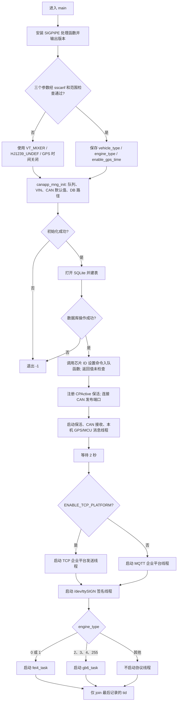
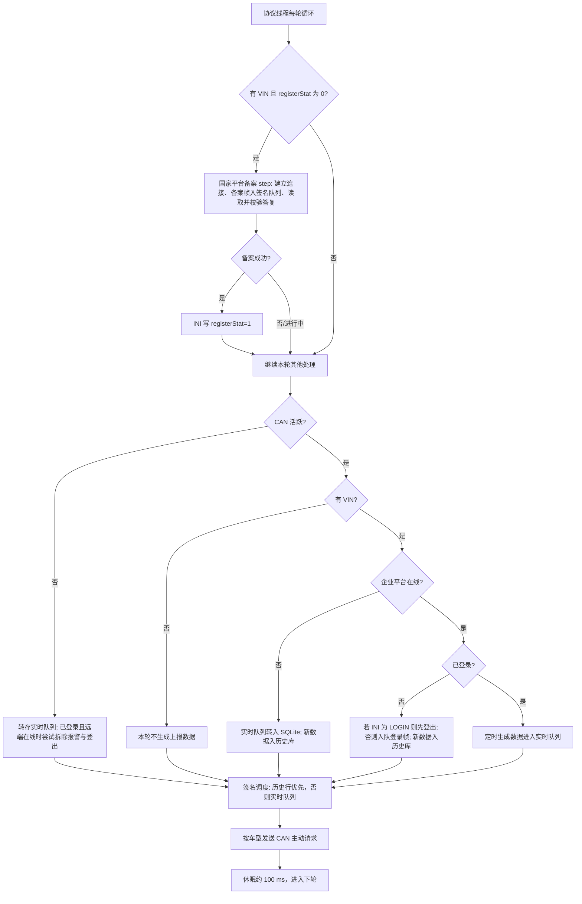
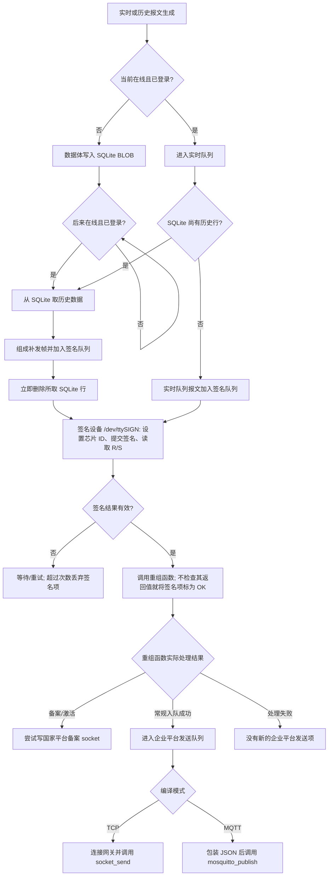

# gb_client_for_mixer 源码全面分析

> 分析对象：`/home/tronlong/lyp/code/rtms_sdk/apps/gb_client_for_mixer/`；仓库分支 `develop/rtms_sdk_v1.3_20240408`，提交 `bc60961e`。以下源码位置相对于该目录；同一引用组中的 `:行号` 沿用前一个完整路径，省略目录的文件名位于同段已提到的子目录。本文以当前代码实际控制流为准；外部服务的应答、目标设备硬件状态及平台接收结果，不能仅由本仓库源码证明。

## 1. 工程边界与结论

该目录构建 `gb_client` 进程。它订阅本机 CAN/GPS 消息、请求 MCU 状态，按车型解析 CAN 数据；按发动机类型选择非道路国四 `fei_4` 或国六 `gb6` 协议；把报文送往 `/dev/ttySIGN` 获取签名结果；常规报文通过 TCP 或 MQTT 送往企业平台。防篡改备案/激活另外连接国家平台。离线或未登录时，部分数据进入 SQLite，在线登录后按代码规则补传。关键入口为 `main.c:119`、`src/can_parse/can_parse.c:4`、`src/fei_4/fei4.c:879`、`src/gb6/gb6.c:1225`、`src/data_signature/data_signature.c:543`。

“启动成功”“入队成功”“调用 `send()` 或 `mosquitto_publish()` 成功”和“平台确认接收”是不同事件。源码对常规企业平台数据没有建立逐帧确认后才删除 SQLite 历史行的闭环；详见第 8、12 节。

### 目录与职责索引

| 路径 | 当前承担的工作 |
| --- | --- |
| `main.c`、`CMakeLists.txt` | 入口、线程启动、编译选项和安装。 |
| `src/app_mng/` | 全局状态、队列和默认 CAN 值；选择 VIN 与数据库；建立 CAN 发送连接。 |
| `src/can_server/`、`src/can_parse/` | 接收 CAN 帧、维护活跃时间、按车型解码、主动请求 OBD/PGN；`bam_proc.c` 重组 BAM 广播多帧。 |
| `src/app_server/` | 接收 GPS JSON、请求并解析 MCU JSON。 |
| `src/gb6/`、`src/fei_4/` | 两套协议状态机、注册/登录、数据入队、历史补传、帧结构与打包。 |
| `src/data_signature/` | 签名请求队列、设备通信、回复校验、平台帧重组。 |
| `src/platform/`、`src/mosquitto/` | 企业平台 TCP 或 MQTT 发送；`client_shared.*` 为 MQTT 客户端配置和连接辅助。 |
| `src/db/`、`src/iniparser/` | SQLite BLOB 历史数据、INI 文件解析。 |
| `src/common/`、`src/skt_res/`、`src/list/` | 公共时间/配置/编码方法、socket 封装、队列链表。 |

## 2. 构建与编译路径

| 项目 | 源码事实 | 位置 |
| --- | --- | --- |
| 顶层开关 | `apps/CMakeLists.txt` 的 `WITH_GB_CLIENT_FOR_MIXER` 默认 `OFF`，开启才加入本目录。 | `../CMakeLists.txt:94` |
| 本目录工程 | CMake 3.11、项目版本 1.3、C99；输出可执行文件 `gb_client`，安装到安装前缀的 `usr/bin`。 | `CMakeLists.txt:1`、`:58`、`:79` |
| 源码收集 | `src/*/*.c` 由 `GLOB_RECURSE` 收集，包括 TCP/MQTT 源文件；实际路径由条件编译决定。 | `CMakeLists.txt:57` |
| 远端模式 | `ENABLE_TCP_PLATFORM=ON` 默认编译 `platform.c` 中的 TCP 上报；关闭后启用 Mosquitto 客户端。 | `CMakeLists.txt:13`、`main.c:175` |
| 补充流 | `ENABLE_SUPPLEMENT_REPORT=OFF` 默认关闭；打开后国六循环才尝试生成补充流。 | `CMakeLists.txt:19`、`src/gb6/gb6.c:907` |
| 目标平台 | 交叉编译只明确处理 `EC200A`、`EG25G`、`MCIMX6Y2CVM08AB`，未知 `QL_MODULE_PLATFORM` 配置失败。 | `CMakeLists.txt:25` |
| 依赖 | CMake 查找 nanomsg、OpenSSL、cJSON、appmng、Mosquitto，另链接 cn-cbor、tbox-common、pthread 等；目标平台还需对应 SDK 和 SQLite 等库。 | `CMakeLists.txt:4`、`:68` |

仓库 README 的交叉编译流程需要额外传入 `-DWITH_GB_CLIENT_FOR_MIXER=ON` 才会包含本程序。源码没有本目录专用测试目标。本文未运行目标板、国家平台、企业平台或签名硬件联调。

## 3. 启动流程图

下方先给出任何 Markdown 阅读器都能显示的文本流程图，随后是 Mermaid 版本。下面只画 `main()` 确实执行的分支。`pthread_create()` 的返回值没有逐项检查；局部 `tid` 被反复覆盖，末尾 `pthread_join(tid, NULL)` 只等待变量中最后留下的线程标识。创建失败时 `tid` 的有效性不能由这段代码保证，也不能视为统一管理全部线程。依据：`main.c:119-198`。

```text
main 入口
  │
  ├─安装 SIGPIPE 处理函数、输出版本
  ├─解析 3 个参数
  │    ├─通过 → 保存车型、发动机类型、GPS 时间开关
  │    └─未通过 → 使用 VT_MIXER / HJ1239_UNDEF / GPS 时间关闭
  ├─初始化共享状态、VIN、数据队列、数据库路径
  │    └─失败 → 退出
  ├─打开 SQLite、创建表
  │    └─失败 → 退出
  ├─芯片 ID 命令入签名队列、注册保活、连接 CAN 发布端口
  ├─启动保活线程、CAN 接收线程、GPS/MCU 消息线程；等待 2 秒
  ├─远端发送模式
  │    ├─ENABLE_TCP_PLATFORM=ON  → TCP 线程
  │    └─ENABLE_TCP_PLATFORM=OFF → MQTT 线程
  ├─启动签名线程
  └─发动机类型
       ├─0、1       → fei4_task
       ├─2、3、4、255 → gb6_task
       └─其他       → 不启动协议线程
  最后仅对 tid 变量中留下的线程标识调用 pthread_join
```



### 参数实际约束

`check_input_args()` 只检查 `argc==4`、三个 `sscanf("%d")` 成功，以及 `vehicle_type` 在 0～255、`engine_type` 在 0～255；它没有检查车型枚举是否为 0～5、发动机枚举是否为 0～4/254/255，也没有检查 GPS 开关必须为 0/1，更没有验证二者组合。`engine_type=254` 通过参数检查却没有协议线程；任意 6～255 的车型值可能通过检查，却没有 CAN 解析分支。依据：`main.c:82-116`、`:184-196`、`src/can_parse/can_parse.c:4-61`。

参数缺失或非法时回退到 `VT_MIXER + HJ1239_UNDEF`。这个组合能进入国六线程和搅拌车 CAN 解析，但 `gb6_hj1239_make_flow_data_by_gps()` 只实现发动机类型 2、3、4，其余直接返回 `-1`；因此不能把回退参数解释成可正常产生国六实时流。依据：`main.c:134-140`、`src/gb6/hj1239_1_2021_frame_pack.c:397-433`。

## 4. 线程、共享状态与数据来源

`app_mng_t` 保存 VIN、车型、发动机、CAN 数据、GPS/MCU 状态、协议登录/注册状态、多个发送队列、SQLite 句柄、nanomsg socket 和远端连接状态。`canapp_mng_init()` 分配队列和 `can_data_t`，把多数尚未采集的 CAN 字段设为无效值，再按发动机类型选择数据库与 VIN 来源。共享结构同时由 CAN、GPS/MCU、协议、签名和发送线程访问；多个队列使用互斥锁，CAN 数据字段的锁定义在结构体中，但不能据此假定所有读写都已同步。依据：`src/app_mng/app_mng.h:197-261`、`src/app_mng/app_mng.c:31-91`、`:212-376`。

| 执行单元 | 实际工作 | 位置 |
| --- | --- | --- |
| `cpactive_task` | 每 10 秒调用 `cpactive_upt_atime`；初始化时登记 20 秒超时。 | `main.c:33`、`:160` |
| `start_can_server` | 连接 CAN0/1/2 的本机 nanomsg SUB，轮询并按 `can_frame_t` 长度拆消息。 | `src/can_server/can_server.c:11`、`:51` |
| `app_msg_task` | GPS SUB 接收 `location_info` JSON；MCU REQ 每 5 秒发送一次请求并解析应答。 | `src/app_server/app_server.c:29`、`:67`；`gps.c:47`；`mcu.c:8` |
| `plaform_data_report_task` 或 `mosq_client_task` | 根据编译选项消费企业平台发送队列。 | `src/platform/platform.c:30`；`src/mosquitto/client_mosquitto.c:349` |
| `data_sign_task` | 消费签名队列，访问 `/dev/ttySIGN`，解析签名结果并重新打包。 | `src/data_signature/data_signature.c:543` |
| `fei4_task` / `gb6_task` | 根据发动机类型只启动其一；约 100 ms 一轮，处理备案、报文入队、签名调度及 CAN 主动请求。 | `src/fei_4/fei4.c:879`；`src/gb6/gb6.c:1225` |

## 5. 车型与 CAN 数据解析

### 5.1 分发矩阵

| 车型参数 | 会调用的解析函数与发动机类型 | CAN 通道 | 主动请求 |
| --- | --- | --- | --- |
| 0 `SAC4000C8` | `HJ1014_DIESEL(0)` → 非四；`HJ1239_DPFSCR(2)` → 国六。 | 非四 CAN1，国六 CAN0 | 非四 VIN；国六诊断、软件、IUPR。 |
| 1 `SAC2000C8` | 同上。 | 非四 CAN1，国六 CAN0 | 同上。 |
| 2 `STC250E5` | 仅 `HJ1239_DPFSCR(2)`。 | CAN0 | 诊断、软件、IUPR。 |
| 3 `STC250_550C5` | 仅 `HJ1239_DPFSCR(2)`。 | CAN0 | 诊断、软件、IUPR。 |
| 4 `VT_MIXER` | 国六 2、3、4、255。 | CAN0 | 7 相位 OBD 请求。 |
| 5 `VT_HYBRID_LC` | 国六 2、3、4、255。 | 该函数没有开头的通道过滤 | 与搅拌车共用 OBD 请求。 |

矩阵来自 `src/can_parse/can_parse.c:4-113`，通道过滤见 `sac4000c8.c:386/476`、`sac2000c8.c:409/492`、`stc250e5.c:295`、`stc250_550c5.c:296`、`vt_mixer.c:668/872`。`HJ1014_NONDIESEL(1)` 虽会启动非四协议线程，但该分发函数没有任何对应 CAN 解析分支。

### 5.2 CAN 数据流

CAN 消息从 `127.0.0.1:16002/16003/16004` 进入 SUB socket。`can_msg_process()` 把消息按 `sizeof(can_frame_t)` 拆帧，调用 `can_frame_parse()`；后者用车型和发动机组合分发。匹配到的解析器更新 `can_data_t` 中车速、发动机转速、扭矩、油耗、排气后处理、故障码、OBD 等字段；某些识别的帧调用 `can_update_canframe_timemap()` 更新全局 CAN 活跃时间。反向请求通过本机 PUB 的 `26002/26003/26004` 发出，具体请求由各车型函数决定。依据：`src/can_server/can_server.c:11-92`、`src/can_parse/can_parse.c:4-113`、`src/app_mng/app_mng.c:379-413`、`src/can_server/can_active.c:7-27`。

搅拌车解析器在 CAN0 按完整 CAN ID 处理车速、气压、扭矩、转速、油耗、NOx、SCR/DPF、EGR、故障码及部分混动字段；混动冷藏车解析器有相似字段和私有帧，但开头没有 CAN 通道判断。二者还解析 UDS 诊断响应，并在检测到第三方 OBD 请求后暂停本端请求；最后一次第三方请求超过 10 秒，才恢复本端周期请求。搅拌车的 7 相位表含诊断协议、就绪状态、VIN、CALID、CVN、IUPR 和故障码，代码按约 2 秒轮转，且先递增相位再发送。依据：`src/can_parse/vt_mixer.c:14-63`、`:463-505`、`:668-870`、`:872-1108`。

SAC、STC 的国六解析处理 J1939 参数组及 BAM 多帧、IUPR 分帧，并周期发送诊断/软件/IUPR 请求；非四 SAC 侧另有 VIN 请求。BAM 重组在 `bam_proc.c` 用静态缓冲和递增帧序号完成，处理跨报文状态；对并发或丢帧时的实际恢复能力不能只凭该函数推断。依据：`src/can_parse/sac4000c8.c:150-385`、`sac2000c8.c:171-408`、`stc250e5.c:134-294`、`stc250_550c5.c:134-295`、`bam_proc.c:8-80`。

## 6. VIN、定位和 MCU 状态

- 非四启动时先从 `/opt/fei4_conf.ini` 的 `fei4:vin` 读取 VIN；国六先读 `/opt/gb6_conf.ini` 的 `gb6:vin`，缺失时尝试从 `/opt/machine_vin` 读满 17 字节并写回国六 INI。VIN 影响备案、登录与数据报文。`get_vin` 是是否取得 VIN 的本地标志。依据：`src/app_mng/app_mng.c:323-377`。
- MQTT 模式下，国六 VIN 还可经订阅主题收到 JSON 命令后写入 `gb6:vin`；未取得 VIN 时每约 10 秒尝试发布请求。回调没有检查 `parse_vin_from_payload()` 的返回值，即使解析失败仍会保存当前 VIN 缓冲并把 `get_vin` 设为真。默认 TCP 模式没有这条 MQTT VIN 获取路径。依据：`src/mosquitto/client_mosquitto.c:51-112`、`:136-156`、`:323-346`、`:450-471`。
- GPS 由 SUB 接收 `location_info` 对象，解析时间、经纬度、速度、卫星数等字段到 `gps_info`。MCU 由 REQ/REP 收到 JSON 状态，解析版本、电压、启动源、温度、ACC/IG 等字段。它们都依赖其他本机进程提供服务。依据：`src/app_server/gps.c:21-91`、`src/app_server/mcu.c:8-114`、`src/app_server/app_server.c:67-118`。
- 国六 `enable_gps_time=0` 时，`gb6_enqueue_flow_data()` 按 10 秒常量取共享 `gps_info` 的副本，并把时间戳设为当前系统时间；非零时改从 `gps_lst` 弹出 GPS 样本。当前目录只找到该队列的初始化和消费，没有找到入队调用，因此非零模式可能一直没有实时流数据。`gps_info` 在初始化时用 `malloc` 分配且没有清零；在第一条 GPS 消息成功解析前，不能把其余字段当作有效定位数据。依据：`src/gb6/gb6.c:245-334`、`src/app_mng/app_mng.c:224-229`、`:276-284`、全目录 `gps_lst` 引用核查。

## 7. 协议线程流程图

国六和非四线程结构相近，具体数据类型与时间常量不同。下图表示两者共有的控制分支；其中“已登录”指内存中的本地 `gb_login` 标志，不代表平台确认。备案流程和企业上报在循环中并列执行，备案成功不是企业平台登录的硬前置条件。先给出始终可见的文本图，再给出 Mermaid 图。依据：`src/gb6/gb6.c:863-1252`、`src/fei_4/fei4.c:684-908`。

```text
每轮协议线程（约 100 ms 一轮）
  │
  ├─有 VIN 且 registerStat 为 0？
  │    ├─是 → 国家平台备案 step（连接 → 备案帧入签名队列 → 读/校验答复）
  │    │         └─答复成功 → INI 写 registerStat=1
  │    └─否/仍在等待 → 继续本轮
  │
  ├─CAN 活跃？
  │    ├─否 → 实时队列转历史；若已登录且远端在线，尝试拆除报警和登出
  │    └─是 → 有 VIN？
  │              ├─否 → 本轮不生成新上报数据
  │              └─是 → 企业平台在线？
  │                        ├─否 → 实时队列转 SQLite；新数据存历史
  │                        └─是 → 已登录？
  │                                  ├─否 → 按 INI 状态登出或入队登录；新数据存历史
  │                                  └─是 → 定时生成新数据，进入实时队列
  │
  ├─签名调度：在线且已登录时，SQLite 历史行优先于实时队列
  ├─按车型执行 CAN 主动请求
  └─休眠约 100 ms → 下一轮
```



### 7.1 国家平台备案

首次或未备案时，国六连接 `g6check.vecc.org.cn:20006`，非四连接 `fdlpfjk.vecc.org.cn:55001`。`*_register_step()` 非阻塞读取可能被 TCP 分片的答复，使用 128 字节接收缓冲，按 24 字节头部中两字节长度判断完整帧，随后做 BCC/答复检查；成功才把 `registerStat` 写为 1。国六收到特定 VIN 错误答复会把 `gb_register` 设为 -1；因为后续条件是 `!gb_register`，该值使当前运行周期不再进入备案 step。非四没有相同错误码分支。部分答复已收到但后续分片一直不来时，当前超时判断只在 `recvLen==0` 的 EAGAIN 分支运行。依据：`src/gb6/gb6.c:30-42`、`:698-823`、`:1225-1252`；`src/fei_4/fei4.c:30-42`、`:533-645`、`:879-908`。

### 7.2 企业平台数据类型和频率

| 流程 | 代码定义的触发间隔和条件 | 位置 |
| --- | --- | --- |
| 国六 | 实时流 10 秒；OBD 120 秒；混动附加流在 `is_hybrid_engine` 为真时 60 秒；补充流在编译选项开启时 60 秒。 | `src/gb6/gb6.h:15-20`、`gb6.c:245-508`、`:907-944` |
| 非四 | 数据流 60 秒；ECD 排放控制诊断数据 600 秒。 | `src/fei_4/fei4.h:12-16`、`fei4.c:235-352` |
| 两者 | 登录和登出函数的发送间隔门限均为 10 秒；CAN 无数据超时常量均为 15 秒。该门限不等于等待平台确认后的自动重试。实际打包还受 VIN、在线、登录、GPS 和数据有效性影响。 | `src/gb6/gb6.h:12-20`、`src/fei_4/fei4.h:9-16`；两模块 `*_device_login_direct()` |

国六实时流按发动机 2/3/4 选择 DPF+SCR、三元催化无 NOx、三元催化有 NOx 结构；`HJ1239_UNDEF(255)` 不在打包函数的有效分支。非四的 `fei4_frame_pack_*` 生成对应数据流、ECD 和拆除报警帧。协议帧采用 `##` 起始标记、VIN、命令码、数据长度、BCC 等字段；具体字节编码和数值缩放以 `src/gb6/hj1239_1_2021_frame_pack.c/.h`、`src/fei_4/fei4_frame_pack.c/.h` 为准，不能由字段名直接推断物理单位。依据：`src/gb6/hj1239_1_2021_frame_pack.c:122-163`、`:375-449`，`src/fei_4/fei4_frame_pack.c:19-58`、`:199-462`。

两套帧头在当前打包函数里均从 `0x23 0x23` 开始；VIN 占 17 字节，数据体长度放在帧的第 22、23 字节，末尾为 BCC。`data_signature.c` 也是按这些偏移提取命令码、长度和数据体送签名设备。两套协议的主要命令码如下，不能因为数值相同就把报文结构当成相同：

| 报文用途 | 国六 `GB6_HJ1239_*` | 非四 `FEI4_*` | 是否进入常规签名队列 |
| --- | --- | --- | --- |
| 登录 | `0x01` | `0x01` | 不进入；直接放企业平台发送队列。 |
| 实时信息 | `0x02` | `0x02` | 进入。 |
| 历史补发 | `0x03` | `0x03` | 进入。 |
| 登出 | `0x04` | `0x04` | 不进入；直接放企业平台发送队列。 |
| 拆除报警 | `0x06` | `0x05` | 不进入；直接放企业平台发送队列。 |
| 防篡改备案/激活 | `0x07` | `0x07` | 进入，签名后直接发国家平台备案 socket。 |

命令码和帧字段定义见 `src/gb6/hj1239_1_2021_frame_pack.h:4-34`、`src/fei_4/fei4_frame_pack.h:4-35`；具体入队点见 `src/gb6/gb6.c:111-244`、`:612-639`、`src/fei_4/fei4.c:103-234`、`:453-482`、`src/data_signature/data_signature.c:199-298`。

**登录状态的判定边界：** `gb6_device_login_direct()` / `fei4_device_login_direct()` 返回 0 的直接条件是把登录帧加入本地企业发送队列成功。协议线程随即把 INI 的 `loginStat` 写为 `LOGIN`，并将内存中的 `gb_login` 设为 1；没有在此等待平台登录答复。登出同样依据本地队列入队结果改变状态。TCP 发送线程断线和 MQTT 断开回调没有清零 `gb_login`；如果 CAN 一直活跃，连接恢复后可能沿用原本地状态继续发送实时帧。因此排查“平台说未登录/重新联网后无数据”时，要关联登录帧的入队、实际发送和平台答复，不能只看 `gb_login`、INI 或 `GB6/FEI4 platform login` 日志。依据：`src/gb6/gb6.c:150-195`、`:863-905`；`src/fei_4/fei4.c:140-185`、`:684-725`；`src/platform/platform.c:50-104`；`src/mosquitto/client_mosquitto.c:168-178`。

## 8. 签名、发送与补传流程图

文本流程图：

```text
产生实时/待补传数据
  │
  ├─离线或未登录 → 数据体写入 SQLite BLOB
  │                     └─以后在线且已登录 → 读历史行 → 组成补发帧入签名队列
  │                                              └─立即删所取 SQLite 行（早于发送确认）
  └─在线且已登录 → 进入实时队列
                         ├─SQLite 仍有历史 → 先处理历史
                         └─SQLite 无历史   → 实时帧入签名队列

签名队列 → /dev/ttySIGN 请求/回复校验
  ├─校验失败 → 等待/重试；超过次数可能丢弃
  └─校验通过 → 尝试重组帧（返回值未检查，仍把签名项标为 OK）
                     ├─备案/激活帧 → 尝试写国家平台备案 socket
                     ├─常规帧成功入队 → 企业平台发送队列
                     │                   ├─TCP：socket_send
                     │                   └─MQTT：包装 JSON 后 mosquitto_publish
                     └─重组或入队失败 → 没有新的企业平台发送项
```

对应的 Mermaid 图：



上图中的“实时/历史”分叉是协议线程里的队列选择，SQLite 历史数据每轮优先于实时队列。国六一次至多读取 10 条历史记录，组合成一个补发帧；非四一次读取 1 条。两个模块都在签名/远端发送确认之前调用 `db_delete_t4hj_rows()` 删除所取行；即使加入签名队列失败，调用位置也不会等待平台确认。数据库上限分别为 61488 和 11088 行，达到上限删除约十分之一的较早记录。依据：`src/gb6/gb6.c:1089-1223`、`src/fei_4/fei4.c:808-877`、`src/app_mng/app_mng.h:15-23`。

`main()` 先把芯片 ID 设置命令加入签名队列，签名线程随后通过 `/dev/ttySIGN` 处理队列。签名请求携带类型、索引、长度及 CRC；回复校验后尝试把 R/S 签名数据追加到原数据体并重组平台帧。备案/激活帧由结果处理函数直接写入国家平台 socket；常规帧加入国六或非四的企业平台队列。`data_signatured_parse()` 在回复校验通过后调用 `data_signatured_handler()`，却不检查后者返回值就把签名项标为 `OK`；因此此处的 `OK` 不能单独证明重组与入队成功。依据：`main.c:159`、`src/data_signature/data_signature.c:29-76`、`:79-197`、`:199-320`、`:440-478`、`:543-636`。

SQLite 表结构仅有自增 `id` 和 BLOB `data`；读历史 SQL 是 `select * ... limit N`，没有显式 `ORDER BY`；删除用第 N 行的 `id` 作为上界删除 `id<=...`。这套代码没有持久化远端确认状态。依据：`src/db/db.c:27-46`、`:172-245`。

## 9. TCP 与 MQTT 两种企业平台通道

**默认 TCP：** `platform.c` 连接 `140.143.114.43:50201`，运行时可用 `TRUCKLINK_GW_IP`、`TRUCKLINK_GW_PORT` 覆盖。线程从选中协议的发送队列取首项，调用 `socket_send()`；返回成功后移除并释放队列项，失败则断开、等待并重连。`remote_online()` 在此模式只按 socket fd 是否大于 0 判断。源码没有在该发送线程中读取企业平台的逐帧业务确认。依据：`src/platform/platform.c:20-116`、`src/common/common.c:614-639`。

**可选 MQTT：** 客户端写定 broker `192.168.1.253:1883`；国六客户端 ID 为 `g6_client`、非四为 `f4_client`。尝试订阅 VIN 命令主题 `v4/s/post/device/cmd/json/1.0`；发送国六/非四二进制帧时先转十六进制字符串，再包成包含 `seq/ts/eventType/events/info.vin/info.data` 的 JSON，发布至 `v4/p/post/thing/event/json/1.0`。当前设置 `qos=0`；`mosquitto_publish()` 返回 `MOSQ_ERR_SUCCESS` 后移除队列并递增本地序号，此返回值仍非云端业务确认。`remote_online()` 同时检查 MQTT 已连接和 `remote_online` 标志；线程定期从 `/tmp/clound_status` 读取值，读到 2 设真，读到其他值设假，读取失败则保留上次标志。该路径拼写是源码原样。依据：`src/mosquitto/client_mosquitto.c:119-173`、`:199-279`、`:349-563`。

TCP/MQTT 都是企业上报通道，不替代第 7.1 节的国家平台备案 socket。头文件中存在未作为当前 TCP 发送地址使用的 `FEI4_DATA_PORT=53001` 等常量，应按实际调用点辨别。依据：`src/platform/platform.c:20-21`、`src/fei_4/fei4.h:4-6`。

## 10. 配置、文件及本机接口

| 位置 | 代码用途 | 依据 |
| --- | --- | --- |
| `/opt/fei4_conf.ini`、`/opt/gb6_conf.ini` | 保存 VIN、`registerStat`、`loginStat`、登录/数据/拆除流水号、日期；代码读写后用来推进本地流程。 | `src/fei_4/fei4.h:18-28`、`src/gb6/gb6.h:22-32` |
| `/opt/machine_vin` | 国六 INI 缺 VIN 时尝试读取 17 字节并回写 INI。 | `src/app_mng/app_mng.c:342-373` |
| `/media/sdcard/hj1014.db`、`hj1239.db` | 非四 `FEI4` 表和国六 `GB6` 表的 BLOB 历史数据。 | `src/app_mng/app_mng.h:15-23`、`src/db/db.c:13-46` |
| `/dev/ttySIGN` | 与签名设备收发请求/回复。 | `src/data_signature/data_signature.c:16`、`:543-636` |
| 本机 `16002/16003/16004` | nanomsg SUB 接收 CAN0/1/2。 | `src/can_server/can_server.c:51-92` |
| 本机 `26002/26003/26004` | nanomsg PUB 发送 CAN0/1/2 请求。 | `src/app_mng/app_mng.c:379-413` |
| 本机 `16005`、`38000` | GPS SUB、MCU REQ。 | `src/app_server/gps.c:8-44`、`mcu.c:8-34` |
| `/tmp/clound_status` | MQTT 模式下辅助判断远端在线；只有值为 2 才设在线。 | `src/mosquitto/client_mosquitto.c:541-563` |

`app_mng.h` 还定义 `MQTT_COFIG_PATH` 和 `ENCRYPT_SKT_PORT=16009`，但本目录当前主执行路径没有使用这两个常量建立相应连接；当前签名执行路径是 `/dev/ttySIGN`。不能依据常量存在就写成实际在用的接口。依据：`src/app_mng/app_mng.h:13-34`，全目录引用核查。

## 11. 具体实现限制与核查重点

以下是源码能够直接确认的行为或潜在影响，按“代码做了什么”描述；发生频率和设备后果需要实测。

1. **回退参数不保证实时流。** 无效参数回退到 `HJ1239_UNDEF`，国六线程可启动、搅拌车 CAN 可解析，但国六实时流打包函数对该类型返回失败。见 `main.c:134-140`、`src/gb6/hj1239_1_2021_frame_pack.c:397-433`。
2. **GPS 时间模式缺少生产者。** `gps_lst` 被初始化和消费，当前目录没有入队引用。`enable_gps_time` 非零时，国六实时流在队列为空的分支返回；GPS SUB 线程只更新 `gps_info`。见 `src/app_mng/app_mng.c:276-284`、`src/gb6/gb6.c:261-281`、`src/app_server/app_server.c:91-102`。
3. **登录报文 ICCID 使用固定值。** 两套登录打包函数里的 `getIccid()` 调用都位于 `#if 0` 禁用分支；当前编译路径进入 `#else`，把代码中的固定 20 位字符串写入登录字段，并不会调用 `getIccid()`。文档不复制这个固定标识；部署前应由协议负责人核对。见 `src/gb6/hj1239_1_2021_frame_pack.c:18-58`、`src/fei_4/fei4_frame_pack.c:101-140`。
4. **历史行早于发送确认删除。** 国六/非四补传函数取行并入签名队列后马上删除数据库行；达到容量上限也主动删除旧行。发生签名失败、进程退出或发送失败时，数据库不再保留已取出的原行。见 `src/gb6/gb6.c:1089-1212`、`src/fei_4/fei4.c:808-864`。
5. **“在线”是本地判断。** TCP 模式看 fd；MQTT 模式看连接标志及 `/tmp/clound_status` 更新的本地标志。常规上报线程移除队列的条件是本地发送调用成功，源码不以企业平台业务应答确认每条数据。`socket_send()` 只调用一次 `send()`，发送长度不完整时返回失败；平台是否已收到部分字节需要结合链路状态分析。见 `src/platform/platform.c:25-28`、`:71-103`、`src/common/common.c:614-639`；`src/mosquitto/client_mosquitto.c:483-511`、`:527-563`。
6. **车型/发动机组合校验宽于解析实现。** 用户参数可落在枚举间隙内；非四非柴油虽启线程却没有 CAN 解析分支。见 `main.c:82-116`、`src/can_parse/can_parse.c:4-113`。
7. **备案分片超时与 VIN 错误行为。** 两种备案 step 的部分数据分片状态会绕过 10 秒无数据超时检查；国六收到 VIN 错误把 `gb_register` 置 -1，当前运行周期不再满足 `!gb_register` 备案条件。见 `src/gb6/gb6.c:698-823`、`src/fei_4/fei4.c:533-645`。
8. **主线程未完整管理工作线程。** 多次 `pthread_create` 共用一个 `pthread_t` 变量、未逐项检查返回值、最后只 `pthread_join` 一次。系统服务是否能长期运行，还受各线程退出和外部保活机制影响。见 `main.c:169-198`。
9. **签名后的重组结果未纳入成功判定。** 签名回复自身校验通过后，`data_signatured_handler()` 可能返回失败，但调用者没有检查该返回值，就标记签名项 `OK`，随后可能把它从队列移除。见 `src/data_signature/data_signature.c:199-320`、`:543-636`。
10. **GPS 和 MQTT VIN 初始状态需核实。** `gps_info` 分配后未清零；MQTT VIN 回调忽略 JSON 解析返回值，仍设置 `get_vin`。两者均不能凭“进程已启动/回调已执行”断定字段有效。见 `src/app_mng/app_mng.c:224-229`、`src/app_server/app_server.c:91-102`、`src/mosquitto/client_mosquitto.c:136-156`。
11. **故障码缓存的清除早于平台确认。** 国六 OBD、非四 ECD 数据打包并尝试入实时队列或 SQLite 后，代码清除对应故障码历史字段；入队/入库结果及平台接收未参与清除条件。不能用“缓存已清空”证明故障码已上报。见 `src/gb6/gb6.c:436-500`、`src/fei_4/fei4.c:282-345`。
12. **登录标志早于平台确认。** 登录/登出帧入本地企业发送队列成功后，协议线程立即更新本地 `gb_login` 和 INI `loginStat`。远端断线时发送线程/回调未重置该标志；只要 CAN 持续活跃，重连后仍可能走“已登录”分支。现场必须用平台侧登录答复验证。见 `src/gb6/gb6.c:150-195`、`:863-905`；`src/fei_4/fei4.c:140-185`、`:684-725`；`src/platform/platform.c:50-104`；`src/mosquitto/client_mosquitto.c:168-178`。

## 12. 验证范围与维护路径

本文对源码的结论来自当前分支的静态调用链、条件编译和常量。没有使用目标设备数据、国家/企业平台记录，也没有执行真实 CAN、签名设备或网络联调。因此本文明确指出哪些路径**会被调用**及何时**入队/删除**，不宣称外部服务一定返回、报文一定合规或平台一定入库。

改动时建议按调用链联查：

| 修改目标 | 必查位置 |
| --- | --- |
| 启动参数或线程 | `main.c`、`src/app_mng/app_mng.h/.c`、`src/can_parse/can_parse.c` |
| 车型 CAN 信号或诊断请求 | `src/can_parse/` 对应车型文件、`src/can_server/`、`src/app_mng/app_mng.h` |
| 非四或国六字段/周期 | `src/fei_4/` 或 `src/gb6/` 的状态机、帧结构与打包函数、`src/data_signature/` |
| 历史补传和可靠性 | `src/db/db.c`、协议模块的 `*_send_backup_to_sign`、签名队列、TCP/MQTT 发送队列 |
| 连接和部署 | `CMakeLists.txt`、`src/platform/platform.c` 或 `src/mosquitto/client_mosquitto.c`、两个 INI、目标设备上的服务端口和 `/dev/ttySIGN` |

验证时应分别记录启动参数、编译开关、CAN 原始帧、签名请求/回复、SQLite 行变动、企业平台发送结果、备案答复和平台侧最终记录。它们对应不同阶段，不能互相代替。

## 13. 设备现场故障排查手册

本节按当前源码的实际处理顺序定位。先确认设备上运行的确实是本工程构建的 `gb_client`，再从输入、解析、打包、签名、传输逐段找**最后一个有证据完成的阶段**。下列命令是只读示例；目标系统可能没有 `ps`、`ss`、`sqlite3` 等工具，应使用设备已有的等价工具。日志输出去向由实际部署的日志库及启动服务决定，本仓库只调用 `logSetTag("gb_client")`、`LOG_*`，并混用 `printf`/`fprintf`；先从服务日志、串口控制台或启动重定向位置找，不能预设固定日志文件。依据：`main.c:127-132`、`src/db/db.c:13-46`、`src/can_server/can_server.c:51-92`。

### 13.1 故障排查图：先判断故障落在哪一段

下面的纯文本图在不支持 Mermaid 的阅读器中也能显示；“有数据”应由真实输入或对应处理日志证明，`nn_connect` 成功只说明本地连接调用成功。

```text
设备异常 / 平台无数据
  |
  +-- 找不到 gb_client 进程、频繁重启
  |     -> 核对启动参数、版本、初始化错误、SQLite 路径、CPActive
  |
  +-- 进程持续运行
        |
        +-- CAN 长时间无有效帧 / 出现 no can data
        |     -> 本机 CAN 发布端、通道、帧结构、车型/发动机解析分支
        |
        +-- CAN 有效，但没有实时帧
        |     -> VIN、启用条件、GPS 时间模式、车型打包函数、队列/入库
        |
        +-- 已产生待签名项，但没有完整平台帧
        |     -> /dev/ttySIGN、请求/回复、CRC/R/S、重组函数返回值
        |
        +-- 已进入发送队列，但企业平台无记录
        |     -> 先分辨 TCP/MQTT，再查连接、发送返回、平台侧回执
        |
        +-- 只报备案/登录异常
              -> 单独查国家平台连接、VIN 和备案答复；不要把它与企业通道混同
```

### 13.2 现场先保留的事实

1. **进程与二进制：** 记录设备时间、故障起止时间、`ps -ef` 中 `gb_client` 的 PID 与三个启动参数；有 `/proc` 时查看 `/proc/<PID>/cmdline`、`/proc/<PID>/exe`。源码没有 `--version` 参数，启动日志的 `Version: 1.3` 来自 CMake 项目版本；同名进程并不能证明文件就是本源码构建。取得部署包的构建记录、校验值及 `ENABLE_TCP_PLATFORM`、`ENABLE_SUPPLEMENT_REPORT`、模块平台宏，再对照现场二进制。默认构建选项是 TCP 开、补传开关关；设备所用包可能另有设置。依据：`CMakeLists.txt:2-21`、`main.c:55-116`、`:127-139`、`:173-188`。
2. **日志时间线：** 从启动到异常前后收集 `gb_client` 标签日志以及标准输出/错误。保留原始时间戳；不能只摘一条 `connected` 或 `OK`。进程若被外部服务重启，还要记录服务管理器的退出码、重启时间。`main()` 只 `pthread_join` 最后一个线程句柄，单一工作线程退出未必使进程退出；“进程存在”不代表每个工作线程都活着。依据：`main.c:169-198`。
3. **只读状态：** 查看 `/opt/fei4_conf.ini` 或 `/opt/gb6_conf.ini` 中 VIN、`registerStat`、`loginStat`、流水号及日期；查看 `/media/sdcard` 挂载和剩余空间、数据库文件状态；查看 `/dev/ttySIGN` 是否存在及进程权限。VIN、MQTT 账号密码、签名材料及原始业务数据只在受控记录中保存，外发日志前脱敏。不要通过清空 INI、删除 DB、改 VIN 或重启进程来“验证”，这些动作会改变登录、补传和现场证据。依据：`src/app_mng/app_mng.c:323-373`、`src/app_mng/app_mng.h:15-23`、`src/data_signature/data_signature.c:16`。

可按设备实际工具执行以下只读命令；`<PID>` 用查到的数字替换，文件缺失时记录“缺失”，不要先创建它：

```sh
ps -ef | grep '[g]b_client'
cat /proc/<PID>/cmdline
readlink /proc/<PID>/exe
ls -l /opt/fei4_conf.ini /opt/gb6_conf.ini /opt/machine_vin /dev/ttySIGN
df -h /media/sdcard
ls -l /media/sdcard/hj1014.db /media/sdcard/hj1239.db
```

`/proc/<PID>/cmdline` 以 NUL 分隔，终端显示可能挤在一起；必要时用设备可用的工具分隔读取。两个数据库只需检查当前发动机对应的一个；文件不存在的含义还要结合该设备此前是否运行过该模式。

### 13.3 按症状逐段定位

| 现象或日志证据 | 优先核查与判定 | 源码位置 |
| --- | --- | --- |
| `invalid input args, use default instead!` | 核对三个参数的个数与值；回退为 `VT_MIXER/HJ1239_UNDEF/0`。`HJ1239_UNDEF` 仍起国六线程，但国六实时流打包会报 `Unknown engine_type`，因此不能把“进程在跑”当成参数正确。 | `main.c:82-140`；`src/gb6/hj1239_1_2021_frame_pack.c:397-435` |
| `canapp_mng_init failed!`、`db_open_t4hj_db failed`、`db_create_t4hj_table failed`、`failed to add process info to CPActive` | 按第一条失败日志分支检查内存分配、当前模式数据库路径及挂载/权限/空间、CPActive 服务；这些点在创建工作线程前直接返回。数据库 `open` 成功也要核对它是否位于预期 SD 卡，避免挂载缺失时落到根文件系统的同名目录。 | `main.c:142-165`；`src/app_mng/app_mng.c:218-373`；`src/db/db.c:13-46` |
| `connected to canN port` 或 `connected to canN port for pub`，但无有效 CAN | 这些仅证明 `nn_connect` 返回成功。检查本机发布服务是否仍运行、16002/3/4 接收与 26002/3/4 请求端口是否对应 CAN0/1/2；记录原始帧数量、ID、长度、到达时间，再对照车型/发动机分发矩阵。 | `src/can_server/can_server.c:51-92`；`src/app_mng/app_mng.c:379-413`；`src/can_parse/can_parse.c:4-113` |
| `no can data after GB6_NO_DATA_TIMEOUT time.` 或 `no can data after FEI4_NO_DATA_TIMEOUT time.` | 代码按有效 CAN 活跃时间判断，阈值 15 秒。核对设备供电/发动机状态、CAN 发布服务、通道映射及解析分支；若原始帧有而本程序仍判超时，重点查帧是否落入能更新时间戳的路径。随后程序可能走下线/登出，故要沿同一时间线看登录状态变化。 | `src/can_server/can_active.c`；`src/gb6/gb6.c:672-695`；`src/fei_4/fei4.c:515-532` |
| 有 CAN，但 `NO GPS Message!!!!!` 或实时流始终不产生 | 先看第三参数 `enable_gps_time`。值为 1 时国六从 `gps_lst` 取时间，本目录只见该队列初始化与消费，未找到生产者；GPS SUB 更新的是 `gps_info`。值为 0 才使用系统时间覆盖时间戳。核对 16005 的 `location_info` JSON 解析及系统时钟，不能仅凭 GPS 服务在线推定本路径可打包。 | `main.c:82-116`；`src/app_server/app_server.c:91-102`；`src/app_server/gps.c:47`；`src/gb6/gb6.c:245-334` |
| `gb6 realtm flow data pack failed!!` 或 `Unknown engine_type` | 先核对启动参数的车型/发动机组合和 CAN 数据完整性。国六实时流打包仅处理发动机类型 2、3、4；`255` 会返回失败。再对照打包函数及错误前的真实 CAN 字段，不先假定是网络问题。 | `src/gb6/gb6.c:245-334`；`src/gb6/hj1239_1_2021_frame_pack.c:397-435` |
| VIN 缺失、登录或备案不推进 | 非四 VIN 从 `/opt/fei4_conf.ini` 取；国六先取 `/opt/gb6_conf.ini`，取不到才读 `/opt/machine_vin` 的 17 字节并回写。核对 VIN 来源、长度、实际内容及配置读写错误；MQTT VIN 回调即使解析失败也会设置 `get_vin`，所以还要查内容。登录报文字段中的 ICCID 当前用源码固定字符串，若平台拒绝登录需纳入协议核对。 | `src/app_mng/app_mng.c:323-373`；`src/mosquitto/client_mosquitto.c:136-156`；两套 `*_frame_pack.c` 登录函数 |
| 日志显示 `GB6/FEI4 platform login`，平台却认为未登录；断网恢复后直接发实时帧 | 该日志是在登录帧**加入本地队列**成功后打印，随后本地 `gb_login` 和 INI `loginStat` 即改为已登录；并未等平台答复。断线也不清空 `gb_login`。查同一登录帧是否实际经 TCP/MQTT 发出、对端是否接受、断线恢复时是否需要重新登录。 | `src/gb6/gb6.c:150-195`、`:863-905`；`src/fei_4/fei4.c:140-185`、`:684-725`；`src/platform/platform.c:50-104`；`src/mosquitto/client_mosquitto.c:168-178` |
| `GB6 platform ... vin error`、`respond timeout`、`connection closed` 或非四对应日志 | 这是**国家平台备案**链路，核对国六 `g6check.vecc.org.cn:20006` 或非四 `fdlpfjk.vecc.org.cn:55001` 的解析、路由、连接、发送帧与平台原始答复。国六 VIN 错误会使当前运行周期的 `gb_register=-1`，从而停止普通重试；分片答复的超时路径也要记录每次接收长度与时间。不要只看企业平台 TCP/MQTT 状态。 | `src/gb6/gb6.c:580-605`、`:698-823`；`src/fei_4/fei4.c:533-645` |
| `failed to open /dev/ttySIGN`、`serial ... encrypt failed`、签名校验错误 | 检查设备节点、权限、串口是否被占用及签名设备供电；捕获请求和回复的类型、序号、长度、状态、BCC/CRC、R/S 长度及重试次数。`chip id set OK` 仅表明芯片 ID 命令回复通过，不能代表后续业务帧签名完成。 | `src/data_signature/data_signature.c:79-197`、`:543-636` |
| 签名日志显示 `check data OK`，却没有企业发送 | 再查 `data_signatured_handler()` 的重组、备案 socket 写入或常规队列入队。调用方没有检查 handler 返回值便标 `OK`，所以该日志只能证明回复校验通过。按报文类型看具体目标队列，不能用签名 OK 直接判定已经发出。 | `src/data_signature/data_signature.c:199-320`、`:440-478` |
| TCP 模式 `failed to connect to platform`、`socket_send t4hj data failed` | 先确认 `ENABLE_TCP_PLATFORM` 与运行时 `TRUCKLINK_GW_IP/PORT`，默认企业网关 `140.143.114.43:50201`。检查路由、运营商链路、远端监听及断开时刻；`socket_send()` 单次发送不满即判失败，可能已有部分字节到达。发送成功后本地队列被移除，但源码未读取逐帧业务确认。 | `src/platform/platform.c:20-116`；`src/common/common.c:614-639` |
| MQTT 模式 `client_connect error`、`remote mqtt disconnect`、publish 失败或队列不出 | 确认实际编译为 MQTT，核对 `192.168.1.253:1883` 可达、broker 连接回调及 `/tmp/clound_status` 内容：值 2 才使本地 `remote_online` 为真。文件读取失败会保留旧值；`mosquitto_publish()` 成功、QoS 0 和本地序号递增均不是云端入库凭证。源码的连接日志会打印账号密码，收集时应脱敏。 | `src/mosquitto/client_mosquitto.c:119-173`、`:349-563` |
| 历史数据增长、补传缺失或 DB 行数下降却平台未收到 | 用只读 SQL 记录当前模式的行数、最小/最大 `id`，并对照签名/发送时间线。国六最多 61488 行、非四最多 11088 行，满额删约 10%；补传读取后也在签名和远端确认前删除。行数下降只能证明本地删除，不能证明补传成功；`select ... limit N` 没有显式排序。 | `src/db/db.c:27-46`、`:172-245`；`src/gb6/gb6.c:1089-1223`；`src/fei_4/fei4.c:808-877` |

若设备带 `sqlite3`，可对**当前模式数据库**做只读计数；数据库在运行时持续变化，两次读数只是两个时点的快照。建议先复制数据库及其可能存在的 `-wal`/`-shm` 文件到取证介质，再做深入分析；直接读取时使用只读模式，避免无意修改。

```sh
sqlite3 -readonly /media/sdcard/hj1239.db 'SELECT count(*), min(id), max(id) FROM GB6;'
sqlite3 -readonly /media/sdcard/hj1014.db 'SELECT count(*), min(id), max(id) FROM FEI4;'
```

### 13.4 排查结果如何下结论

| 最后确认完成的阶段 | 下一步应取得的证据 | 此时不能推出的结论 |
| --- | --- | --- |
| 进程存在 | 工作线程、启动参数、配置和真实输入 | 所有线程正常、参数可打包 |
| CAN 本地连接成功 | 发布服务的原始帧、解析命中、活跃时间 | 已收到有效 CAN |
| 实时数据已入队或已写 SQLite | 签名请求与回复、打包返回值 | 已形成完整平台帧 |
| 签名回复校验 OK | 重组函数结果及发送队列变化 | 已送达企业平台 |
| TCP `send()` 或 MQTT `publish()` 成功 | 对端接收日志、协议应答和平台业务记录 | 远端业务已入库 |
| 国家平台备案回复 OK | 企业平台的独立发送及业务记录 | 企业平台实时数据已接收 |
| SQLite 行被删除 | 签名、发送和平台侧同一条数据的关联记录 | 补传成功 |

一次完整工单至少保留：设备型号和部署包标识、启动参数与编译选项、故障时间段及时间同步状态、脱敏 VIN、原始 CAN 样本及接收通道、GPS/MCU 样本、关键日志连续片段、当前模式 DB 行数、签名请求/回复结果、国家平台备案答复、企业通道发送调用结果和平台侧记录。对照同一时间戳与同一帧/流水号定位断点；缺少对端证据时，结论应写为“本地已调用发送”，不写“平台已收到”。
