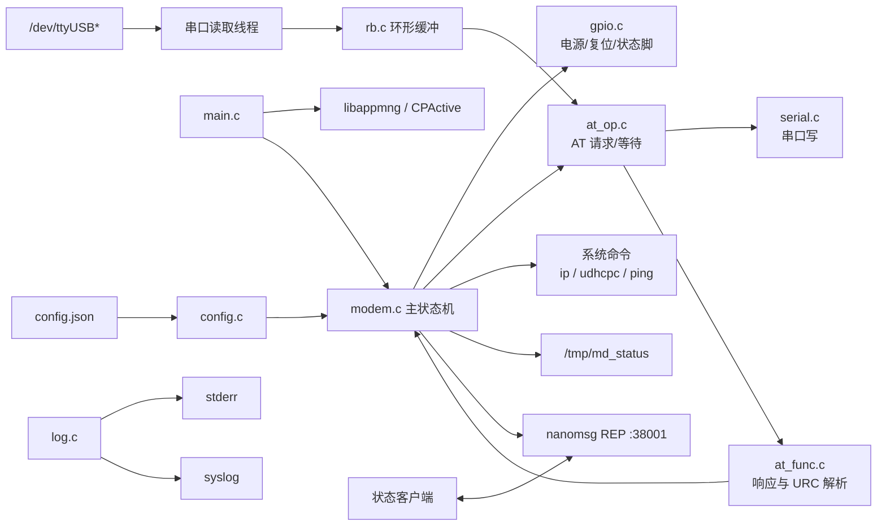
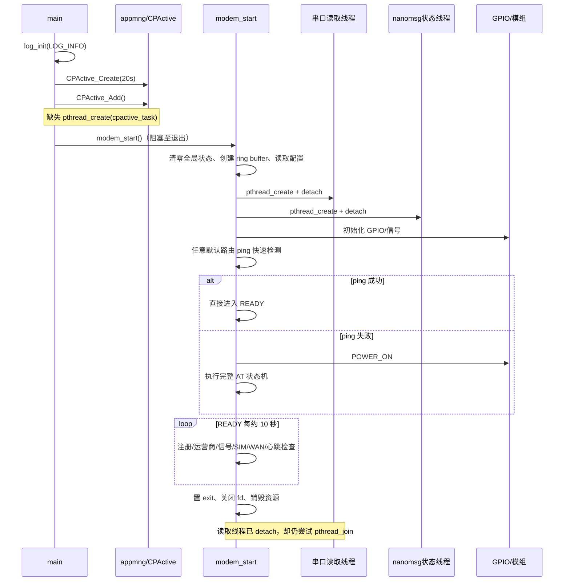
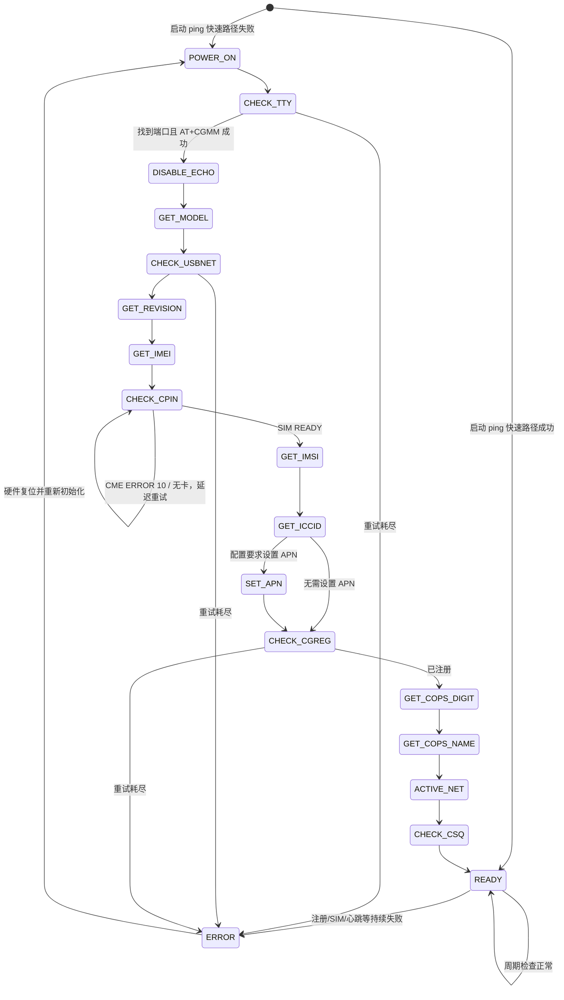
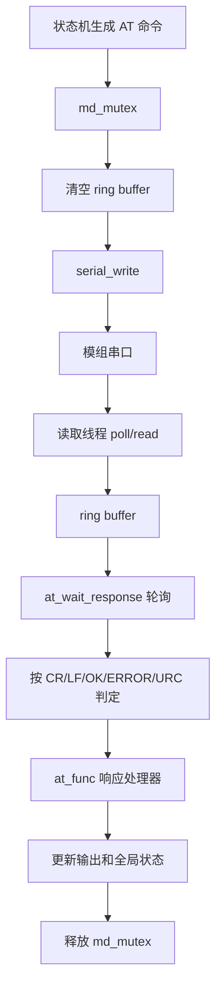
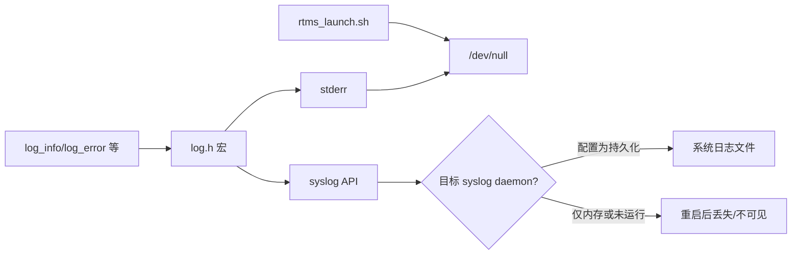
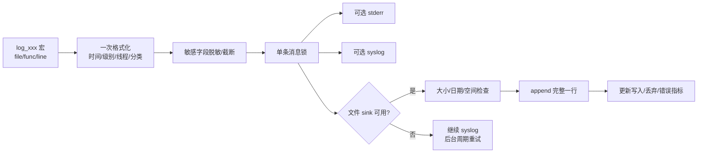

# modem_mng_v2 源码审计、架构与日志系统设计报告

> 审计日期：2026-08-24<br>
> 审计对象：`rtms_sdk/apps/modem_mng_v2`<br>
> Git 分支：`rk3576_20250821`<br>
> Git 提交：`9355b6dc`<br>
> 审计方式：源码静态审查、调用链与并发分析、严格编译告警检查、现有构建验证、脚本语法检查、参考工程日志实现对比<br>
> 限制：本次没有连接真实 EC200A/EG25 模组、SIM 卡、运营商网络和远端状态客户端，因此硬件时序、拨号成功率、弱网恢复与长期稳定性仍需实机验证。

---

## 1. 结论摘要

该程序的主体思路清楚：通过串口 AT 指令识别并初始化 EC200A/EG25，完成 SIM、注册、运营商、拨号和信号检查，随后进入周期监控；同时通过 `/tmp/md_status` 和 nanomsg 提供状态。当前版本能够在现有 SDK 构建环境中成功编译，但不建议未经修复就作为长期无人值守进程部署。

最重要的结论如下：

1. **CPActive 看门狗任务被创建但没有喂活线程**。`cpactive_task()` 已定义，却从未 `pthread_create()`；若平台按 20 秒超时执行存活检测，进程可能被误判失活。
2. **nanomsg REP 服务可被一个无效请求永久卡死**。代码只有在请求 JSON 完全匹配时才回复；REP 套接字收到请求后若不发送响应，下一次 `nn_recv()` 会进入协议状态错误。
3. **状态查询存在稳定的堆内存泄漏**。每次成功请求创建 cJSON 树并打印，但没有 `cJSON_Delete()`。
4. **模组识别存在越界读取**。AT 接收缓冲区按实际长度分配、没有补 `\0`，后续却传给 `strstr()`。
5. **配置值进入 shell 与 AT 命令，存在注入边界**。`ping_addr1` 被直接拼入 `popen("ping ...")`；APN/PDP 文本也未经字符约束进入 AT 命令。
6. **“任意网络可达”被误当成“蜂窝网络已上线”**。启动快速路径和心跳 `ping` 都未绑定蜂窝接口；以太网/Wi-Fi 可导致程序跳过模组初始化并上报 cellular online。
7. **线程共享状态存在 C 语言层面的数据竞争**，且线程被 detach 后退出阶段仍 join，清理顺序不能保证安全。
8. **EG25 ECM 配网命令失败不会阻止进入 READY**，并且会修改系统默认路由，可能影响设备其他网络。
9. **当前没有由应用负责的落盘日志系统**。现有日志只写 `stderr + syslog`；启动脚本又将标准输出和错误重定向到 `/dev/null`。是否真正持久化完全依赖目标系统的 syslog 配置，应用自身不保证落盘、轮转或容量控制。
10. 参考工程 `/home/tronlong/lyp/code/open_dial_for_artery` 的 `seas_log` 可以借鉴“SD 卡、容量阈值、文件大小上限”的方向，但其截断式轮转、多次分段写入、启动阻塞等实现不宜原样复制。

### 风险统计

| 等级 | 数量 | 含义 |
|---|---:|---|
| 严重（Critical） | 4 | 可导致服务失活、远程拒绝服务、越界访问或持续泄漏 |
| 高（High） | 9 | 可导致错误联网判断、并发未定义行为、错误恢复失效或安全边界问题 |
| 中（Medium） | 12 | 影响可靠性、可维护性、诊断能力或接口完整性 |
| 低（Low） | 5 | 版本、文档、冗余依赖等工程质量问题 |
| **合计** | **30** | 详见第 11 节 |

---

## 2. 审计范围与验证结果

### 2.1 源码规模

| 模块 | 主要职责 | 代码规模（约） |
|---|---|---:|
| `main.c` | 进程入口、CPActive 注册 | 44 行 |
| `src/modem/modem.c/.h` | 状态机、线程、拨号、状态服务 | 2363 行 |
| `src/modem/at_func.c/.h` | AT 响应/URC 解析 | 579 行 |
| `src/modem/at_op.c/.h` | AT 请求发送与等待 | 331 行 |
| `src/config` | JSON 配置读取 | 180 行 |
| `src/gpio` | GPIO/sysfs 控制 | 304 行 |
| `src/log` | stderr/syslog 日志宏 | 96 行 |
| `src/rb` | 串口环形缓冲区 | 227 行 |
| `src/serial` | 串口打开、配置、读写 | 173 行 |
| `src/at_server` | 未启用的 TCP AT 服务 | 180 行 |
| `scripts` | EG25 手工调试/部署辅助 | 205 行 |
| **总计** |  | **约 4728 行** |

### 2.2 已执行验证

| 检查 | 结果 | 说明 |
|---|---|---|
| SDK 现有构建 | 通过 | `make -C /home/tronlong/lyp/code/rtms_sdk/build modem_mng_v2/fast` 成功 |
| 产物检查 | 通过 | AArch64 ELF 64-bit PIE，动态链接，带调试信息，未 strip |
| 严格告警审计 | 未通过 | 临时增加 `-Wall -Wextra -Wpedantic -Wformat=2 -Wconversion -Wshadow` 等检查，共暴露 137 条告警、约 50 类消息；其中包含真实未定义行为风险，不能只视为风格问题 |
| Shell 语法 | 通过 | `bash -n scripts/eg25_up.sh` |
| Python 语法 | 通过 | `python3 -m py_compile scripts/atcmd.py scripts/scan.py` |
| 单元/集成测试 | 缺失 | 仓库中未发现自动化测试 |
| 实机/弱网/长稳测试 | 未执行 | 需要模组、SIM、蜂窝网络及目标系统环境 |

### 2.3 构建环境问题

本次构建虽然成功，但当前 RK3576 构建目录仍引用了 `build_ec200a/build_dir` 下的包路径。链接器先遇到不兼容的 ARM 库并跳过，再找到 AArch64 库完成链接。`CMakeCache.txt` 中 `appmng_DIR`、`nanomsg_DIR` 也指向 EC200A 构建目录。

这属于**构建缓存/产物交叉污染**：当前恰好能链接不等于配置可靠。建议为每个目标平台使用独立、可清理重建的 build 目录，并在 CI 中校验依赖 ELF 架构，禁止从其他目标的 `build_dir` 解析库。

---

## 3. 仓库功能与模块关系

### 3.1 对外功能

- 自动扫描 `/dev/ttyUSB*`，发送 `AT+CGMM` 识别 EC200A/EG25。
- 执行模组上电、关闭回显、读取型号/版本/IMEI/IMSI/ICCID。
- 检查 SIM PIN 状态、网络注册状态、运营商和信号强度。
- 根据模组类型执行数据链路激活：EC200A 使用 `QNETDEVCTL`，EG25 使用 ECM/`usb0`。
- 周期性检查注册、SIM、信号、WAN 和配置的心跳地址，异常时触发恢复状态机。
- 将状态写入 `/tmp/md_status`。
- 在 `tcp://0.0.0.0:38001` 上通过 nanomsg REP 返回 cellular 状态 JSON。
- 包含一个默认未启用的 TCP AT 服务（16020）和若干 EG25 辅助脚本。

### 3.2 组件图



### 3.3 线程模型

| 执行上下文 | 生命周期 | 主要工作 | 共享数据 |
|---|---|---|---|
| 主线程 | 全程 | 初始化、模组状态机、READY 周期监控、退出清理 | `g_md` 几乎全部字段 |
| 串口读取线程 | 创建后 detach | `poll/read` 串口并写环形缓冲区 | `modem_fd`、`exit`、`rb` |
| nanomsg 状态线程 | 创建后 detach | 接收 JSON 请求、序列化并回复状态 | `status`、型号和身份字段 |
| CPActive 线程 | **应有但未启动** | 每 5 秒更新进程活跃状态 | `CPActive_Info_t` |
| TCP AT 服务线程 | 默认禁用 | 监听 16020、转发 AT | 串口/AT 状态 |

`md_mutex` 主要用于串行化部分 AT 操作，并没有覆盖所有跨线程字段，所以它不能消除当前的数据竞争。

---

## 4. 启动与退出流程

### 4.1 启动时序



### 4.2 信号与退出

- 安装 `SIGINT`/`SIGTERM` 处理，用共享 `exit` 标志驱动状态机结束。
- 读取线程和状态线程均 detach，但清理阶段无法可靠等待它们结束。
- 主线程关闭串口、释放 ring buffer 时，读取线程可能仍在访问这些资源。
- 建议线程保持 joinable：先原子置退出标志，再唤醒阻塞调用、join 全部线程，最后关闭/释放资源。

---

## 5. 核心状态机

### 5.1 状态流图



### 5.2 关键状态说明

| 状态 | 行为 | 成功去向 | 主要失败行为 |
|---|---|---|---|
| `POWER_ON` | GPIO 上电/复位、等待模组 | `CHECK_TTY` | 重试后 `ERROR` |
| `CHECK_TTY` | 扫描 ttyUSB，发送 `AT+CGMM` 并识别型号 | `DISABLE_ECHO` | 换端口/重试/复位 |
| `DISABLE_ECHO` | `ATE0` | `GET_MODEL` | 重试 |
| `GET_MODEL` | 再读取模组型号 | `CHECK_USBNET` | 重试 |
| `CHECK_USBNET` | EG25 查询/切换 USBNET；EC200A 直接继续 | `GET_REVISION` | 复位或 `ERROR` |
| `GET_REVISION` | 获取固件版本 | `GET_IMEI` | 重试 |
| `GET_IMEI` | 获取 IMEI | `CHECK_CPIN` | 重试 |
| `CHECK_CPIN` | 检查 SIM READY/CME | `GET_IMSI` | 无卡时持续等待；其他错误重试 |
| `GET_IMSI`/`GET_ICCID` | 读取 SIM 标识 | 后续配置/注册 | 重试 |
| `SET_APN` | 生成并发送 `CGDCONT` | `CHECK_CGREG` | 重试 |
| `CHECK_CGREG` | 查询 2G/4G 注册 | `GET_COPS_DIGIT` | 等待，耗尽后恢复 |
| `GET_COPS_*` | 获取 PLMN 与运营商名称 | `ACTIVE_NET` | 重试 |
| `ACTIVE_NET` | EC200A 激活 QNETDEVCTL；EG25 配 `usb0` | `CHECK_CSQ` | **EG25 命令失败仍继续** |
| `CHECK_CSQ` | 获取信号强度 | `READY` | 重试 |
| `READY` | 周期健康检查 | 自循环 | 达到策略阈值后 `ERROR` |
| `ERROR` | 清状态、复位模组 | `POWER_ON` | 持续恢复 |

`MD_TEST_AT` 虽然存在，但正常流转不会进入：`CHECK_TTY` 已完成 AT 探测后直接跳到 `DISABLE_ECHO`。这是死状态，应删除或重新接入并测试。

### 5.3 READY 周期监控

READY 阶段大约每 10 秒执行：

1. 查询 `CGREG/CEREG`，更新注册状态、LAC、Cell ID。
2. 查询运营商数字编码和名称。
3. 查询 `CSQ`。
4. 查询 SIM 状态。
5. 检查 WAN/默认路由和配置的 ping 心跳。
6. 在检查间隙调用 `md_check_none()` 排空并处理 URC。
7. 按累计失败阈值切换至 `ERROR` 并复位。

当前初次注册成功时没有一致地写入 `registered_time`。如果刚进入 READY 就检测到掉线，持续掉线判断可能使用进程较早的时间基准，导致恢复动作比设计预期更早触发。

---

## 6. 模组适配逻辑

### 6.1 模组能力表

| 类型 | 默认 AT 端口 | APN/CGDCONT | 数据激活 | 网络接口 | 备注 |
|---|---|---|---|---|---|
| `UNKNOWN` | `/dev/ttyUSB1` | 默认不设置 | `QNETDEVCTL` 路径 | 未明确 | 识别失败时不应长期使用该兜底 |
| `EC200A` | `/dev/ttyUSB1` | 默认不设置 | `AT+QNETDEVCTL=...` | 模组/系统既有链路 | 当前主要路径 |
| `EG25` | `/dev/ttyUSB2` | 默认 `wbdata`、`IPV4V6` | ECM | `usb0` | 查询/切换 `usbnet` 后 DHCP/路由 |

### 6.2 EG25 USBNET/ECM 流程

1. 查询 `AT+QCFG="usbnet"`。
2. 如果不是期望模式，发送切换命令。
3. 发送 `AT+CFUN=1,1`，等待模组 USB 重新枚举。
4. 重新扫描串口、恢复 AT 通道。
5. 拉起 `usb0`，尝试 `udhcpc`/`dhcpcd`，配置到 `192.168.225.1` 的默认路由。
6. 无论若干系统命令是否失败，当前实现都继续进入 `CHECK_CSQ`，随后可到 `READY`。

风险有两层：一是 `CFUN` 的 AT 返回值被记录却没有用于控制状态；二是 ECM 配置函数只记录命令失败，没有将总体失败向状态机返回。因此“状态机 READY”不等价于“数据链路真的建立”。

### 6.3 EC200A 激活

EC200A 主要通过 `AT+QNETDEVCTL` 查询/激活网络。相较 EG25，状态机能观察 AT 返回，但仍需在实机测试中确认：已经激活、重复激活、SIM 热拔插、注册切换、模组重启后各返回形式都能被解析。

---

## 7. AT 数据通路与解析

### 7.1 数据流图



### 7.2 主要 AT 指令

| 功能 | 典型指令 | 解析结果 |
|---|---|---|
| 基础探测 | `AT` | 串口可用性 |
| 关闭回显 | `ATE0` | OK/ERROR |
| 型号 | `AT+CGMM` | EC200A/EG25/UNKNOWN |
| 版本 | `AT+CGMR` | 固件版本字符串 |
| IMEI | `AT+CGSN` | IMEI |
| SIM | `AT+CPIN?` | READY/CME ERROR |
| IMSI | `AT+CIMI` | IMSI |
| ICCID | `AT+QCCID` 等 | ICCID |
| PDP/APN | `AT+CGDCONT=...` | 上下文配置结果 |
| 注册 | `AT+CGREG?`、`AT+CEREG?` | 注册态、LAC、Cell ID |
| 运营商 | `AT+COPS?` | PLMN、运营商名称 |
| 信号 | `AT+CSQ` | RSSI/BER |
| EC200A 激活 | `AT+QNETDEVCTL...` | 数据链路状态 |
| EG25 USB 模式 | `AT+QCFG="usbnet"...` | ECM 模式 |

### 7.3 环形缓冲与时序

串口读取线程将原始数据写入环形缓冲区，AT 等待函数再从中取数据并寻找终止条件。这种“单读线程 + 命令串行化”设计本身可行，但当前实现有以下边界：

- ring 满时会覆盖最旧数据，没有错误、计数器或告警；大响应/URC 洪泛会悄悄破坏帧。
- 扫描不同 tty 端口时没有在每次候选切换前建立严格的接收代际，旧端口残留数据可能污染新探测。
- 部分位置在没有统一同步协议时清空 ring，可能与读取线程并发。
- `serial_write()` 以 10 ms 为一次间隔换算重试次数，而调用处可传 20 ms；非阻塞 fd 的 `EAGAIN` 也被当作硬失败。
- `at_op` 没有可靠处理串口写失败，后面仍可能等待一个永远不会到来的响应。
- 多个响应处理器按 `msg_len` 精确分配内存却不补终止符；任何 C 字符串函数都必须先补 `\0` 或改为长度受限解析。

---

## 8. 配置系统

### 8.1 配置来源

程序读取固定路径：

```text
/root/rtms_package/etc/config/config.json
```

配置通过编号键映射到心跳和 APN 参数。

### 8.2 已识别配置映射

| 键 | 含义 | 使用情况 |
|---|---|---|
| `C020201` | ping/心跳开关 | 使用 |
| `C020202` | 心跳地址 1 | 使用，并进入 shell 命令 |
| `C020203` | 心跳地址 2 | 已读取，**未实际使用** |
| `C020204` | 正常心跳间隔 | 使用 |
| `C020205` | 失败重试间隔 | 使用 |
| `C020206` | 重试次数 | 使用 |
| `C020301` | APN | 使用 |
| `C020302` | PDP 类型 | 使用 |
| `C020303` | 用户名 | 已读取，**未使用** |
| `C020304` | 密码 | 已读取，**未使用** |
| `C020305` | CID | 使用 |

### 8.3 配置读取问题

- 没有严格验证 JSON 类型、字符串长度、数值范围和枚举合法性。
- 数值经 `cJSON_GetNumberValue()` 转为 `int`；NaN、超范围、负值或零值没有防御。
- 毫秒换算存在先以 `int` 乘 1000、再赋给大整数的路径，可能先溢出。
- 任一前置心跳必需项缺失时，函数可提前返回，连带导致后面的 APN 配置不被读取；两组本应独立的配置被耦合。
- 文件读取中的 `fseek/ftell/fread` 结果和最大文件尺寸未完整检查，`long` 长度再缩窄为 `int`。
- `ping_addr1` 没有限制为 IP/主机名字符集；APN/PDP 没有拒绝引号、反斜杠或 CR/LF。

建议将配置解析拆成“文件加载—schema 校验—默认值合并—业务应用”四步，每个字段给出类型、长度、范围、允许字符和缺省值；心跳与 APN 分别解析，单项错误不应让另一组静默失效。

---

## 9. 状态输出与服务接口

### 9.1 `/tmp/md_status`

程序会以 `fopen(..., "w+")` 直接截断重写 `/tmp/md_status`，内容包括模组、SIM、注册、运营商和收发统计等状态。

当前问题：

- 它是运行时状态快照，**不是日志文件**；重启或 `/tmp` 清理后消失。
- 原文件直接截断重写，读者可能看到空文件或半份内容；应写同目录临时文件，`fsync` 后 `rename` 原子替换。
- 固定 `/tmp` 路径配合特权进程存在符号链接攻击面；应使用安全运行目录、`O_NOFOLLOW`、合理权限和 `openat()`。
- 最后一行 `rx\n` 缺少 `=`，格式与其他键值行不一致。
- IP、DNS、gateway、tx、rx 的业务值尚未完整采集，部分字段固定为空或为 0。

### 9.2 nanomsg 状态服务

监听地址：

```text
tcp://0.0.0.0:38001
```

预期请求结构可推断为：

```json
{
  "status": {
    "network": ["cellular"]
  }
}
```

响应包含 module/model/revision、IMEI/IMSI/ICCID、LAC/Cell ID、CSQ、SIM、注册、运营商、PLMN 和 online 等信息。

该接口当前没有认证、访问控制或加密，并绑定所有接口；IMEI、IMSI、ICCID 属于设备/用户身份信息。若 38001 不应跨主机访问，优先绑定 loopback 或 Unix domain socket；若确需远程访问，应至少增加网络 ACL、认证、请求大小/超时限制与隐私字段分级。

### 9.3 cellular 状态语义

当前 `register`/`online` 在若干路径中混合了三种不同事实：

1. 模组已注册到运营商。
2. 蜂窝数据接口已获得有效网络配置。
3. 系统任意默认路由能够 ping 通公网。

这三者应拆分为独立字段，例如 `sim_ready`、`ps_registered`、`data_session_active`、`interface_ready`、`cellular_reachable` 和 `system_reachable`。否则上层无法判断故障位于 SIM、空口、PDP、接口还是其他网络。

---

## 10. 现有日志系统评估

### 10.1 是否有落盘日志？

**应用自身没有可靠的落盘日志。**

`src/log/log.c/.h` 当前提供：

- `stderr` 输出；
- `openlog()/syslog()` 系统日志输出；
- 日志等级过滤；
- 调用处的函数、文件、行号信息。

但它没有文件 sink、目录创建、追加写、轮转、保留策略、磁盘空间保护、写失败恢复或敏感字段脱敏。SDK 启动脚本又把应用标准输出/错误重定向到 `/dev/null`，因此 stderr 副本在正常守护启动方式下不可见。EG25 的部分 shell 命令把输出管给 `logger`，本质仍是 syslog。

syslog 最终是否落盘取决于目标镜像是否运行 syslog daemon、daemon 的输出路径、持久分区和轮转策略；这些都不由本程序控制。因此准确表述应是：**有日志打印和 syslog 投递能力，但没有应用可保证的持久化日志系统。**

### 10.2 当前日志流



### 10.3 当前日志实现的其他问题

- 日志宏分别调用 `fprintf` 和 `syslog`，格式参数会求值两次；若传入带副作用表达式会产生错误行为。
- 有些调用者格式串已带换行，宏再追加换行，输出会出现空行。
- AT 收发调试信息以 INFO 大量输出，长期运行噪声高，也可能暴露身份信息。
- 缺少统一事件分类、模组状态迁移原因、失败累计计数、恢复动作结果和日志自身健康状态。
- 没有保证一条多线程日志作为整体原子输出。

---

## 11. 源码问题清单

### 11.1 总表

“确定性”列的含义：`确定` 表示从 C/协议语义可直接证明；`条件触发` 表示代码问题确定存在，但需特定输入、资源压力、网络或硬件条件才显现；`待实机` 表示还需目标设备验证实际影响。

| ID | 等级 | 问题 | 主要证据 | 确定性 | 建议 |
|---|---|---|---|---|---|
| A-01 | 严重 | CPActive 已注册但喂活线程未启动 | `main.c:21-41` | 确定 | 创建并管理喂活线程，或明确删除 CPActive 注册 |
| A-02 | 严重 | nanomsg REP 对无效请求不回复，套接字可永久进入 EFSM | `modem.c:455-490` | 确定 | 每次 recv 必须恰好 send 一次，错误也返回 JSON |
| A-03 | 严重 | 每次有效状态请求泄漏整棵 cJSON 响应树 | `prepare_status_response():350-444` | 确定 | `cJSON_Print*` 后无条件 `cJSON_Delete(root)` |
| A-04 | 严重 | 非 NUL 终止的 AT 缓冲传给 `strstr()`，可能越界读 | `at_func.c:123-128`；`modem.c:121-135,753-759` | 确定 | 分配 `len+1` 并终止，或全程长度受限解析 |
| A-05 | 高 | 配置内容可注入 shell/AT 命令 | `config.c:99-107`；`modem.c:1713-1714`；`SET_APN` | 条件触发 | 禁止 shell 拼接；用 argv/接口 API；校验 APN/PDP 字符集 |
| A-06 | 高 | 任意默认路由可达被当作蜂窝在线并跳过初始化 | `modem_try_skip_dial_if_online():1683-1695,2069` | 确定 | ping 绑定蜂窝接口，拆分 system/cellular 状态 |
| A-07 | 高 | 主线程、串口线程、状态线程读写普通共享对象形成数据竞争 | `g_md.exit/modem_fd/status/*` 多处 | 确定 | 原子变量、互斥锁、不可变快照和明确所有权 |
| A-08 | 高 | EG25 ECM 命令失败仍进入 READY，且重写全局默认路由 | `modem.c:1551-1589,1615-1619` | 确定 | 返回并验证每一步；用策略路由/专用路由表 |
| A-09 | 高 | 配置数值未校验，缩窄/乘法可能溢出，间隔可异常 | `config.c`；心跳时间换算 | 条件触发 | schema、范围检查、饱和换算、默认值 |
| A-10 | 高 | 特权进程直接截断固定 `/tmp/md_status`，有竞态和符号链接风险 | `modem.c:285-322` | 条件触发 | 安全目录、`openat/O_NOFOLLOW`、临时文件原子替换 |
| A-11 | 高 | 0.0.0.0 状态端口无认证，公开模组/SIM 身份信息且无请求上限 | `modem.c:455-490` | 确定 | 限制绑定、ACL/认证、`NN_RCVMAXSIZE`、超时、字段分级 |
| A-12 | 高 | 工作线程 detach 后仍 join；资源可能在线程结束前被释放 | `modem_start():2049-2056,2165` | 确定 | 保持 joinable，按 stop→wake→join→free 顺序退出 |
| A-13 | 高 | COPS/注册解析包含未定义行为：空指针自增与 `%X` 指针类型不匹配 | `at_func.c:232-235,267,298` | 条件触发 | 检查分隔符后再移动；用匹配类型/`SCNx32` |
| A-14 | 中 | ring/mutex/thread 创建结果未完整检查，失败后仍继续 | `modem.c:2012,2049-2056` | 条件触发 | 分阶段初始化和统一回滚 |
| A-15 | 中 | `rb_new` 在判断 malloc 结果前 `memset`，OOM 时崩溃；长度也未防御 | `rb.c:29-32` | 条件触发 | 先判空，校验正长度和算术溢出 |
| A-16 | 中 | 串口写重试/超时单位不严谨，EAGAIN 被当硬错；奇偶校验 switch 贯穿 | `serial.c:92-103` 及写函数 | 条件触发 | poll(POLLOUT)、deadline、修复 break、传播错误 |
| A-17 | 中 | ring 满时静默覆盖，切换候选端口可能混入旧响应 | `rb.c`；`CHECK_TTY` | 条件触发 | 溢出返回码/指标，端口代际与受锁 flush |
| A-18 | 中 | `md_urc_msg_handler` 声明返回 int 但无 return | `at_func.c:98-102` | 确定 | 返回明确状态或改为 void |
| A-19 | 中 | `%.*s` 的 precision 传 `size_t` 而非 int，变参类型不匹配 | `at_op.c:117,123` | 确定 | 校验上限后显式转 int，或长度安全写法 |
| A-20 | 中 | USBNET 切换后的 `CFUN` 返回值只打印、不影响状态 | `modem.c:1512-1528` | 确定 | 仅 AT 成功后标记 switched 并等待重枚举 |
| A-21 | 中 | 初次注册成功未一致设置 `registered_time` | `modem_proc_check_cgreg()`；READY 掉线判断 | 条件触发 | 在状态边沿统一更新时间戳 |
| A-22 | 中 | AT handler 已分配输出后若命令最终 ERROR，部分状态路径不释放 | 多个 `modem_proc_*` 失败分支 | 条件触发 | 统一 cleanup/所有权约定 |
| A-23 | 中 | GPIO export 后不等待节点，调用返回被忽略，sysfs 写固定 3 字节含 NUL | `gpio.c`，约 `:221` | 待实机 | 正确长度写入、等待节点、逐级传播错误 |
| A-24 | 中 | 配置文件定位/读取错误检查不完整，长度从 long 缩窄为 int | `config.c` | 条件触发 | 上限、完整读取、`size_t` 和错误区分 |
| A-25 | 中 | 未启用的 AT TCP server 协议/IO 不完整；启用后有安全与可靠性风险 | `at_server.c` | 确定 | 完成协议、鉴权、partial IO、超时与测试后再启用 |
| A-26 | 低 | 文档引用仓库内不存在的 `deploy_eg25.py` | `scripts/README_EG25_部署.md:123-126` | 确定 | 修正文档或补齐脚本 |
| A-27 | 低 | CMake 项目版本 1.3 与 `APP_VERSION` 2.1 不一致 | `CMakeLists.txt`、`main.c` | 确定 | 单一版本来源并在构建时生成 |
| A-28 | 低 | addr2、用户名、密码读取后未用；状态网络字段长期空/零 | `config.c`、`prepare_status_response()` | 确定 | 实现、弃用或明确标记 unsupported |
| A-29 | 低 | 每轮调用 `sysinfo` 但结果未用；`MD_TEST_AT` 不可达 | `modem.c` | 确定 | 删除死代码或接入可测试用途 |
| A-30 | 低 | 日志宏参数求值两次、换行策略不一致；链接若干疑似无用库 | `log.h`、`CMakeLists.txt` | 条件触发 | 单函数格式化；清理依赖 |

### 11.2 A-01：CPActive 喂活缺失

`main()` 调用 `CPActive_Create()` 和 `CPActive_Add()`，超时配置为 20 秒；同一文件已经写好每 5 秒更新的 `cpactive_task()`。但全仓库没有启动该函数的 `pthread_create()`。在 SDK 其他使用 CPActive 的应用中，通常会单独创建更新线程。

预期修复结构：

```text
CPActive_Create/Add 成功
        ↓
创建 joinable cpactive_thread
        ↓ 每 5 秒
CPActive_Update
        ↓ 退出
停止 → join → CPActive_Delete/资源清理
```

需要同时检查 Create/Add/Update 的返回值，线程创建失败不能静默进入业务循环。

### 11.3 A-02：REP 状态机被无效请求锁死

nanomsg 的 REP 语义要求严格交替：

```text
recv(request) → send(reply) → recv(next request)
```

现代码仅当 JSON 中存在 `status.network[]` 且数组包含 `cellular` 时发送响应。以下任一请求都会走到下一轮但没有 send：

- 非 JSON 数据；
- `{}`；
- `status` 或 `network` 类型错误；
- 网络数组为空；
- 只查询其他网络类型。

此时下一个 `nn_recv()` 违反 REP 状态顺序，通常以 EFSM 失败；循环也没有重建 socket，于是服务持续错误。修复时应让每次成功接收都对应一次响应，例如统一返回 `{ok:false,error:{code,message}}`。解析树和 nanomsg 消息必须在所有路径释放。

### 11.4 A-03：远程可触发的响应内存泄漏

`prepare_status_response()` 创建 root 和多层子对象，`cJSON_Print()` 返回独立字符串。函数只把字符串交给调用者释放，没有销毁 root。只要客户端持续发送有效状态请求，进程常驻内存会持续增长。

正确所有权顺序应为：

```c
root = cJSON_CreateObject();
/* build tree */
payload = cJSON_PrintUnformatted(root);
cJSON_Delete(root);
return payload;
```

还要处理任一 `cJSON_Create*`/`cJSON_Add*` 失败，并限制请求速率与消息大小。

### 11.5 A-04：AT 型号缓冲越界读取

响应 handler 以 `malloc(msg_len)` 保存原始片段，没有预留或写入终止 NUL。模组检测函数忽略显式长度并使用 `strstr()`；`CHECK_TTY` 也直接对该缓冲搜索 `EG25`/`EC200A`。由于分配区后一个字节不属于对象，`strstr()` 会继续读取到偶然的零字节，构成未定义行为。

不能仅依赖“malloc 后面通常恰好是 0”。建议先建立统一的字节串类型 `{uint8_t *data; size_t len}`；需要 C 字符串时使用 `len + 1`、检查加法溢出并显式写 `data[len] = '\0'`。

### 11.6 A-05：命令注入边界

心跳地址通过配置文件加载后直接进入：

```c
snprintf(cmd, sizeof(cmd), "ping -c 1 %s 2>&1", addr);
popen(cmd, "r");
```

如果配置链路可被远程管理、升级包或低权限进程影响，分号、命令替换、重定向等 shell 元字符会被解释。安全做法是不用 shell：`fork/execve` 传独立 argv，或直接用 ICMP/连接探测 API；并只接受合法 IPv4、IPv6 或严格主机名。

APN/PDP 虽不经过 shell，但会嵌入双引号 AT 参数。必须拒绝双引号、CR、LF 和控制字符，限定长度与 PDP 枚举，避免构造额外 AT 指令。

### 11.7 A-06：网络快速路径语义错误

启动阶段的 `modem_try_skip_dial_if_online()` 使用未绑定接口的 ping。只要以太网或 Wi-Fi 的默认路由能访问目标，它就设置注册/在线状态并直接进入 READY，完全跳过串口发现、SIM 检查和蜂窝初始化。

修复原则：

- 启动时仍需确认模组、SIM 和注册状态；
- 蜂窝探测必须绑定已确认的蜂窝接口或源地址；
- 不通过“公网 ping 成功”反推运营商注册；
- 若确需快速恢复，必须使用上次保存且经接口/路由验证的蜂窝会话状态。

### 11.8 A-07/A-12：并发与退出所有权

`volatile` 即使被使用，也只能影响编译器访问方式，不能让普通字段成为线程同步机制。当前至少有三类并发：

- 主线程改变 `exit`、`modem_fd`、阶段和状态字段；
- 串口线程读取 fd/退出标志并写 ring；
- 状态线程遍历多个字符串和数值生成 JSON。

状态线程可能读到一次更新中的“撕裂快照”，字符串也可能在读期间变化。更严重的是退出时线程 detach，主线程不能 join，却仍释放 ring/关闭 fd。

推荐所有权模型：

1. `atomic_bool stop_requested` 只负责停止通知。
2. 串口 fd 和 ring 由 I/O 子系统拥有；关闭前先唤醒并 join 读取线程。
3. 主状态机在互斥锁下发布一个定长 `modem_status_snapshot`；查询线程只复制快照，锁外 JSON 序列化。
4. 所有工作线程都保持 joinable；任何创建失败都逆序回滚已创建资源。
5. 不用裸 fd 值变化判断“对象是否还是同一个”，避免 fd 关闭后被复用造成 ABA 问题。

### 11.9 A-08：ECM 配置与系统路由

当前通过 `system()` 执行 `ip link`、DHCP 客户端和默认路由命令。命令返回失败只打印日志，状态机仍可能 READY；此外直接替换 default route 会改变整机网络行为。

建议：

- 用 netlink 或至少结构化执行接口，检查 exit status、signal 和超时；
- 校验接口存在、operstate、地址、前缀、网关及路由确实安装；
- 为蜂窝链路使用独立路由表和 policy rule，避免覆盖以太网/Wi-Fi；
- 对 DHCP 进程使用 pid/生命周期管理，避免重复启动多个客户端；
- 配置成功后执行绑定 `usb0` 的连通性探测，失败不得上报 data-ready。

### 11.10 解析与格式告警为何需要处理

严格编译发现的几类告警会触及 ABI/未定义行为：

- `sscanf("%X", int *)`：`%X` 要求 `unsigned int *`。
- `printf("%.*s", size_t, ...)`：星号 precision 要求 `int`。
- 非 void 函数走到末尾不返回。
- `if (pt1++)`：先对可能为空的指针执行自增；即使分支不进入，自增本身也不合法。
- 对数组地址做真假判断永远为真，可能掩盖本想检查“内容是否为空”的逻辑。

建议把 `-Wall -Wextra -Wformat=2 -Werror=format -Werror=return-type` 先设为 CI 必过，再逐步清理 conversion/shadow 类告警。运行于目标架构的 ASan/UBSan 构建可进一步验证解析边界。

---

## 12. 与 open_dial_for_artery 日志实现的对比

### 12.1 参考实现行为

参考路径：

```text
/home/tronlong/lyp/code/open_dial_for_artery/src/seas_log/seas_log.c
/home/tronlong/lyp/code/open_dial_for_artery/src/seas_log/seas_log.h
/home/tronlong/lyp/code/open_dial_for_artery/src/main.c
```

其主要策略是：

- 启动时最多等待 `/media/sdcard` 约 10 秒；
- 用 `statvfs` 检查剩余空间，至少约 1 GiB 才启用文件日志；
- 日志路径为 `/media/sdcard/seas_log_dial.log`；
- 单文件上限约 60 MiB；
- 包含毫秒时间、等级、函数、文件和行号；
- 使用 mutex 保护文件操作并在每次写后 `fflush`；
- 达到上限后以 `w+` 重新打开同一个文件，即直接清空旧日志。

### 12.2 可借鉴与不宜照搬

| 能力 | 当前 modem_mng_v2 | seas_log 参考 | 本项目建议 |
|---|---|---|---|
| stderr | 有 | 有 | 开发模式保留，可配置 |
| syslog | 有 | 非核心 | 保留为兜底/系统集成 |
| 应用文件落盘 | 无 | 有 | 增加 |
| 存储介质检测 | 无 | 启动时检测 SD | 非阻塞检测，运行期重试 |
| 空间保护 | 无 | 启动时 ≥1 GiB | 启动+周期检查，设最低余量 |
| 文件上限 | 无 | 60 MiB | 可配置 20–60 MiB |
| 轮转 | 无 | 超限清空当前文件 | `.1/.2/.3` 滚动或按日保留 |
| 多线程 | 每个 sink 分别调用 | 文件 mutex | 单条日志格式化后整体加锁写入 |
| 分配行为 | 宏重复格式化 | 每条日志多次 calloc/asprintf | 栈缓冲+一次必要扩容 |
| SD 拔出/写满恢复 | 无 | 不完整 | EIO/ENOSPC 后降级并周期恢复 |
| 隐私处理 | 无 | 无 | IMEI/IMSI/ICCID 默认脱敏 |

可以模仿参考工程的总体方向，但不建议直接复制，原因包括：

1. 轮转时清空当前文件会把故障前最关键的历史一次性丢掉。
2. 一条日志拆成多个 `fwrite`，锁并未覆盖整条逻辑消息时，多线程内容可能交错。
3. 每条日志做多次动态分配，故障/内存紧张场景下可靠性反而下降。
4. 启动等待 SD 卡会延迟模组管理和 CPActive 喂活。
5. 只在启动检查空间，无法应对运行中 SD 拔出、只读、写满或挂载变化。

---

## 13. 推荐的落盘日志设计

### 13.1 目标

在尽量不改业务调用点的前提下，扩展现有 `src/log`，继续兼容 `log_info()`、`log_error()` 等宏，同时提供：

- stderr、syslog、file 三个可独立启停的 sink；
- 线程安全的一次格式化、整行写入；
- 文件大小轮转和保留数量；
- 存储空间保护及 SD 异常降级；
- 状态/AT/恢复事件结构化分类；
- 身份信息脱敏；
- 日志模块自身错误可观测但不递归。

### 13.2 推荐数据流



### 13.3 推荐路径与策略

建议默认配置：

```text
目录：/media/sdcard/modem_mng_v2/
当前文件：modem_mng_v2.log
轮转文件：modem_mng_v2.log.1 ... .3
单文件上限：20 MiB（可配置，最大建议 60 MiB）
最低可用空间：1 GiB 或分区容量的 10%，取更保守者
权限：目录 0750，文件 0640
重试：介质不可用后每 30 秒非阻塞重试
```

若产品已有统一持久日志目录，应使用平台目录而不是硬编码 SD 路径。不要让日志初始化等待挂载 10 秒：应用应立即启动并先写 syslog，介质可用后再启用文件 sink。

### 13.4 轮转与写入可靠性

- 以 `O_APPEND | O_CLOEXEC | O_NOFOLLOW` 打开，校验目标为普通文件。
- 轮转锁覆盖“检查大小—关闭—重命名—重新打开”的整个过程。
- 保留最近 3 份或按日保留 7 天，不直接清空唯一文件。
- 一条日志先完整格式化，再在锁内一次或循环完整 `write()`；正确处理 `EINTR` 和 partial write。
- 日常 INFO 不必每行 `fsync`；可每 N 秒/条批量 `fdatasync`。ERROR/FATAL 与关键恢复事件可立即同步。
- 发生 `ENOSPC`、`EROFS`、`EIO`、介质移除时关闭文件 sink，限频向 syslog 报一次，稍后自动重试。
- 周期检查可用空间，达到保护线后主动停止文件写入或删除最老轮转文件，绝不无限增长。

### 13.5 建议 API

```c
typedef struct {
    int level;
    bool to_stderr;
    bool to_syslog;
    bool to_file;
    const char *file_path;
    size_t rotate_bytes;
    unsigned int rotate_count;
    uint64_t min_free_bytes;
} log_config_t;

int  log_init_ex(const log_config_t *cfg);
void log_shutdown(void);
void log_write(int level, const char *category,
               const char *file, int line, const char *func,
               const char *fmt, ...);
```

现有宏可以只调用一次 `log_write()`，避免参数双重求值。时间戳同时记录墙上时间和进程启动后的单调时长，便于处理系统校时导致的时间跳变。

### 13.6 日志格式与事件分类

建议文本格式示例：

```text
2026-08-24T14:31:07.238+08:00 mono=12843.522 level=INFO tid=742 cat=STATE event=transition from=CHECK_CPIN to=GET_IMSI reason=sim_ready
2026-08-24T14:31:17.901+08:00 mono=12854.185 level=WARN tid=742 cat=HEARTBEAT iface=usb0 target=203.0.113.10 result=timeout consecutive=2
2026-08-24T14:31:28.014+08:00 mono=12864.298 level=ERROR tid=742 cat=RECOVERY action=modem_reset reason=registration_lost result=started
```

推荐分类：

| 分类 | 记录内容 |
|---|---|
| `BOOT` | 版本、配置摘要、平台、日志后端状态 |
| `STATE` | 状态迁移、原因、耗时、重试次数 |
| `AT` | 命令名、耗时、结果；原始内容仅 DEBUG |
| `SIM` | 插拔、PIN 状态变化；身份字段脱敏 |
| `REG` | 注册状态/LAC/Cell 变化，不重复刷屏 |
| `NET` | PDP/ECM、地址、路由和绑定接口探测 |
| `HEARTBEAT` | 目标、接口、耗时、连续失败次数 |
| `FAULT` | 解析、I/O、配置、线程和资源错误 |
| `RECOVERY` | 重试、重开串口、重拨、复位及结果 |
| `LOG` | 文件 sink 启停、轮转、空间不足、恢复 |

### 13.7 隐私与敏感信息

- IMEI/IMSI/ICCID 默认仅保留末 4 位，例如 `***********1234`。
- APN 可记录，但用户名只记录是否配置，密码绝不写日志。
- 原始 AT 响应可能包含身份数据，默认只在 DEBUG 打开，并仍做脱敏。
- 状态服务也应默认移除或脱敏身份字段，按调用方权限决定是否返回完整值。
- 日志文件权限应限制到业务用户/诊断组，不建议 world-readable。

---

## 14. 修复实施顺序

### 14.1 P0：上线阻断项

建议在任何长期部署前完成：

1. 启动并正确停止 CPActive 更新线程，处理所有返回值。
2. 重写 nanomsg 请求循环：每次 recv 都回复；增加错误 JSON、消息上限、收发超时；修复全部 cJSON 所有权。
3. 修复所有 AT 缓冲 NUL/长度问题、COPS 空指针和 scanf/printf 类型不匹配。
4. 去掉 shell 字符串拼接，校验心跳地址、APN、PDP、CID。
5. 建立 joinable 线程生命周期和 status snapshot，消除退出 UAF/数据竞争。
6. 关闭远程暴露或先把状态服务绑定到受控接口，直到鉴权/ACL 明确。

P0 完成后，应以格式类告警和返回值告警为 `-Werror`，并跑 ASan/UBSan、状态接口异常请求测试。

### 14.2 P1：联网语义与可诊断性

1. 拆分蜂窝注册、数据会话、接口就绪、蜂窝可达和系统可达状态。
2. 所有 ping 绑定明确的蜂窝接口/源地址，移除当前“任意网络成功即跳过拨号”逻辑。
3. EG25 ECM 每一步返回状态；验证地址、路由和连通性后才 READY。
4. 避免覆盖系统默认路由，接入平台网络管理或 policy routing。
5. 实现本报告第 13 节的文件日志后端、轮转、空间保护和隐私处理。
6. 原子更新 `/tmp/md_status`，补齐字段和格式，或将其迁移到安全运行目录。
7. 配置 schema 化，解耦心跳/APN，并明确 addr2、认证字段的产品语义。

### 14.3 P2：长期可靠性与工程治理

1. 为 ring 增加溢出检测、统计和端口代际；重新设计 AT/URC 分帧。
2. 完整传播串口、GPIO、线程、内存和系统调用错误。
3. 删除或完成 `at_server`、`MD_TEST_AT`、未用 `sysinfo` 和未用配置字段。
4. 清理无用链接库，统一版本来源，修复 README。
5. 建立主机单测、伪串口集成测试、双模组硬件矩阵和长稳测试。
6. 为 RK3576/EC200A 等目标隔离构建目录并验证依赖架构。

---

## 15. 建议测试方案

### 15.1 主机单元测试

| 对象 | 用例 | 通过标准 |
|---|---|---|
| AT parser | 正常、空、无 NUL、截断、超长、多 URC、乱序、恶意分隔符 | 无越界/泄漏；返回明确错误 |
| COPS/CGREG | 缺逗号、缺引号、十六进制边界、超范围、未知注册码 | 不崩溃，不保留旧脏值 |
| ring buffer | 0/1/容量边界、wrap、满、并发生产消费 | 不越界；溢出可观察 |
| config | 缺键、错类型、NaN、负数、极大值、长字符串、shell/AT 元字符 | 拒绝非法值；独立字段仍加载 |
| status JSON | 每种错误结构、超大消息、重复 1 万次、合法请求跟在非法请求后 | 每次都有响应；服务继续；RSS 有界 |
| logger | 多线程、长消息、partial write、轮转、ENOSPC/EIO、时钟跳变 | 不交错/死锁；大小和保留数受控 |

建议把 parser/config/status/logger 编译为宿主机测试目标，并使用 ASan、UBSan；并发快照和 logger 可增加 TSan 构建。

### 15.2 伪串口集成测试

使用 PTY 编写模组模拟器，按脚本返回 AT 响应，可覆盖：

- EC200A 正常完整流程；
- EG25 需要/不需要切换 USBNET；
- 命令超时、ERROR、CME ERROR、分片响应和延迟 URC；
- tty 断开、重新枚举、端口号变化；
- SIM 缺失、PIN 锁定、热拔插；
- 注册先成功后掉线及漫游状态；
- 大量 URC 触发 ring 压力；
- 退出信号在任意状态到达。

断言状态迁移序列、重试次数、恢复动作、线程退出和最终资源计数，而不仅检查进程是否仍运行。

### 15.3 实机矩阵

| 维度 | 建议覆盖 |
|---|---|
| 模组 | EC200A、EG25，各至少两个固件版本 |
| SIM | 无卡、正常卡、PIN 卡、欠费/禁用卡、热插拔 |
| 注册 | 无信号、弱信号、2G/4G/漫游、基站切换 |
| 网络 | 仅蜂窝、蜂窝+以太网、蜂窝+Wi-Fi、默认路由切换 |
| 故障 | USB 重枚举、串口消失、DHCP 超时、DNS 故障、网关可达但公网不可达 |
| 电源 | 冷启动、软重启、模组复位、频繁掉电 |
| 存储 | 无 SD、只读 SD、拔卡、写满、恢复挂载 |

### 15.4 长稳与资源测试

建议至少执行 72 小时正常长稳和 24 小时故障注入，持续采集：

- RSS/VSZ、fd 数、线程数；
- 状态请求次数和错误次数；
- ring overflow、AT timeout、串口重开次数；
- 注册/拨号/复位次数与原因；
- 日志文件总容量、轮转次数、丢弃条数；
- 每次状态迁移耗时和 READY 可用率。

资源曲线应进入平台稳定区；重复状态请求不能让 RSS 近似线性增长。

---

## 16. 验收标准

### 16.1 正确性与安全

- 进程运行超过 CPActive 超时的多个周期，平台持续判定为 active。
- 任意有效或无效 nanomsg 请求均在超时内得到一个响应；随后合法请求仍能成功。
- 连续 1 万次状态查询后，无 cJSON/nanomsg 泄漏，RSS 增长保持在合理抖动范围。
- 所有 AT parser fuzz/边界用例在 ASan/UBSan 下无报错。
- 含 shell/AT 元字符的配置被拒绝，不会创建额外进程或发送额外 AT 行。
- 以太网/Wi-Fi 可达而蜂窝不可用时，`cellular_reachable` 不得为真，也不得跳过模组初始化。
- 状态服务只在批准的接口可访问，敏感字段符合权限/脱敏要求。

### 16.2 生命周期与网络

- 在每个状态发送 SIGTERM，所有线程都能在规定时间内 join，fd 和内存无泄漏。
- EG25 任一 ECM 配置步骤失败时不进入 data-ready；恢复后可自动成功。
- 蜂窝链路配置不破坏现有以太网/Wi-Fi 路由。
- SIM 热拔插、串口重枚举和注册丢失均产生可追踪的状态迁移与恢复结果。

### 16.3 日志

- SD 不存在时进程立即启动，日志降级到 syslog；SD 恢复后文件 sink 自动启用。
- 文件达到上限后保留规定数量的历史文件，总空间严格受控。
- 写满、只读、拔卡不会阻塞或终止模组状态机，且恢复后能继续记录。
- 多线程日志不交错，错误/关键恢复日志在异常重启后按同步策略可见。
- 日志中没有明文密码，IMEI/IMSI/ICCID 默认脱敏。

### 16.4 构建质量

- `-Wall -Wextra -Wformat=2 -Werror=format -Werror=return-type` 构建通过。
- 每个平台只解析本平台架构的依赖库；干净构建可复现。
- 自动化测试纳入 CI，README 与实际脚本/版本一致。

---

## 17. 文件职责索引

| 文件 | 审计定位 |
|---|---|
| [`main.c`](main.c) | 入口、日志初始化、CPActive 缺失线程 |
| [`src/modem/modem.c`](src/modem/modem.c) | 状态机、模组识别、拨号、READY、状态服务、线程生命周期 |
| [`src/modem/modem.h`](src/modem/modem.h) | 状态、模组类型、全局上下文数据结构 |
| [`src/modem/at_op.c`](src/modem/at_op.c) | AT 发送、响应等待、超时和格式告警 |
| [`src/modem/at_func.c`](src/modem/at_func.c) | 响应解析、URC、越界/格式解析风险 |
| [`src/config/config.c`](src/config/config.c) | JSON 文件加载和编号键映射 |
| [`src/serial/serial.c`](src/serial/serial.c) | termios、非阻塞串口读写 |
| [`src/rb/rb.c`](src/rb/rb.c) | 环形缓冲、OOM/覆盖边界 |
| [`src/gpio/gpio.c`](src/gpio/gpio.c) | sysfs GPIO 上电/复位操作 |
| [`src/log/log.c`](src/log/log.c) / [`log.h`](src/log/log.h) | stderr/syslog；当前无文件落盘 |
| [`src/at_server/at_server.c`](src/at_server/at_server.c) | 默认禁用且未完成的 TCP AT 服务 |
| [`scripts/atcmd.py`](scripts/atcmd.py) | 手工串口 AT 调试 |
| [`scripts/scan.py`](scripts/scan.py) | 串口扫描辅助 |
| [`scripts/eg25_up.sh`](scripts/eg25_up.sh) | EG25/usb0 手工网络配置辅助 |
| [`scripts/README_EG25_部署.md`](scripts/README_EG25_部署.md) | EG25 部署说明，含失效脚本引用 |

---

## 18. 最终判断

该仓库不是“完全不可用”，现有目标构建可以成功，主状态机也覆盖了常见蜂窝初始化步骤；但目前存在多项能够由代码直接证明的严重问题，尤其是 CPActive、状态 REP 协议、cJSON 泄漏、AT 缓冲越界和线程生命周期。它们应先于功能扩展修复。

日志方面，答案是：**现在只有 stderr/syslog 打印，没有应用自己保证的落盘日志；可以参考 open_dial_for_artery，但应按第 13 节做一个更稳健的兼容式扩展，而不是直接复制。**

本报告仅新增文档，没有修改业务源码。建议下一步按 P0 顺序提交小而可验证的修复，再单独引入日志后端，以便每个变更都能通过单元、伪串口和实机测试独立验收。
