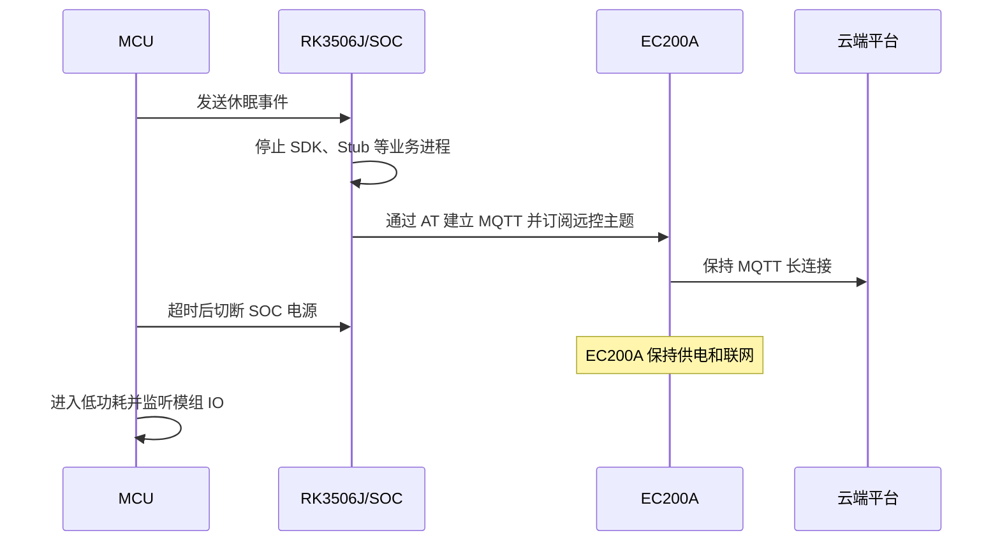
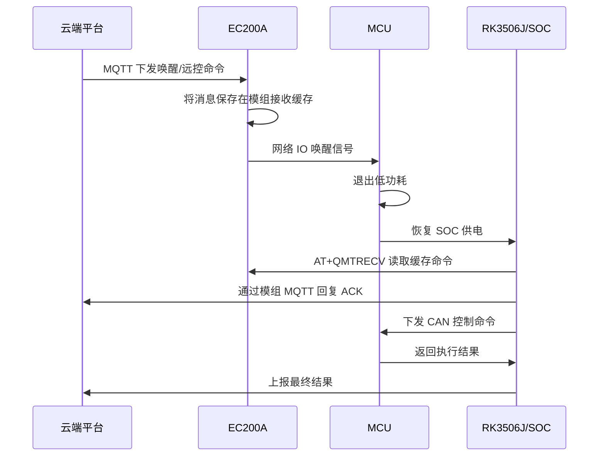
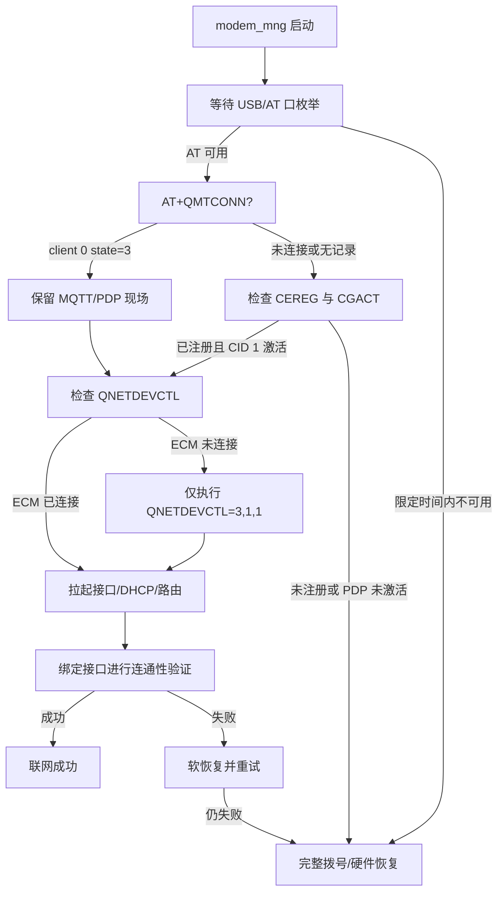

# 工车远控流程与 RK3506J 联网快恢复分析

## 1. 文档目的

本文基于以下两份参考材料整理：

- `工车网络唤醒流程（目前临时方案）.docx`
- `mqtt_on_event.sh-wk`

同时结合当前 RK3506J `modem_mng` 的启动和拨号实现，说明：

1. 工车远控休眠、网络唤醒和普通唤醒的完整流程；
2. 参考 Shell 脚本完成了哪些工作；
3. 当前设备为什么无法依赖原有事件区分冷启动和休眠唤醒；
4. 如何通过 EC200A 模组内部 MQTT/PDP 状态实现快速联网恢复；
5. 实现前必须完成哪些真机验证。

> 说明：`mqtt_on_event.sh-wk` 是流程验证和实现参考，当前设备不直接运行该脚本。现网休眠前的模组 MQTT 建连由同事的脚本完成。

## 2. 系统组成与供电关系

该远控方案涉及四个参与方：

| 参与方 | 主要职责 |
| --- | --- |
| 云端平台 | 下发唤醒和远控命令，接收 ACK 与执行结果 |
| EC200A 模组 | 保持蜂窝注册、PDP 和模组内部 MQTT；接收下行并通过 IO 唤醒 MCU |
| MCU | 管理整机低功耗和 RK3506J 供电，执行或转发车辆控制动作 |
| RK3506J/SOC | 运行 Linux、业务 SDK、`modem_mng`，读取模组消息并处理远控闭环 |

关键供电条件如下：

- 设备休眠时，RK3506J/Linux 被断电；
- EC200A 模组保持供电；
- MCU 进入低功耗状态，但能够被 EC200A 的网络 IO 信号唤醒；
- MCU 唤醒后重新给 RK3506J 上电。

因此，SOC 侧的进程、网卡地址、路由和运行时状态会全部丢失，但 EC200A 内部的蜂窝注册、PDP、MQTT连接和下行缓存可能继续保留。

## 3. 原始远控流程

### 3.1 休眠准备阶段



休眠前必须确认以下异步结果已经成功，而不能只看到 AT 命令返回 `OK`：

```text
+QMTOPEN: 0,0
+QMTCONN: 0,0,0
+QMTSUB: 0,1,0,0
```

### 3.2 网络远控唤醒阶段



原始文档要求网络唤醒场景不启动完整 SDK 和网络拨号，以避免重复驻网和拨号，缩短远控响应时间。

### 3.3 普通唤醒阶段

若唤醒不是由网络 IO 触发，则按照普通开机流程启动 SDK、网络拨号和全部业务功能。

需要注意：

- “网络 IO 唤醒”描述的是本次唤醒原因；
- “EC200A MQTT/PDP 仍在线”描述的是模组网络现场；
- 两者相关，但不是完全相同的概念。

本地点火等普通唤醒发生在一次保电休眠之后时，EC200A 的 MQTT 也可能仍然在线。因此，MQTT 状态适合决定能否快速恢复网络，但不能在所有场景下严格证明 MCU 的唤醒原因。

## 4. 同事脚本建立的模组 MQTT 会话

当前休眠准备脚本使用的主要 AT 序列如下。账号信息在本文中使用占位符表示，避免复制凭据：

```text
ATE0
AT+QMTCFG="version",0,4
AT+QMTCFG="keepalive",0,300
AT+QMTCFG="recv/mode",0,1,1
AT+QMTCLOSE=0
AT+QMTOPEN=0,"<mqtt-host>",1883
AT+QMTCONN=0,"<client-id>","<username>","<password>"
AT+QMTSUB=0,1,"v4/s/post/device/cmd/json/1.0",0
```

各命令含义如下：

| 命令 | 含义 | 对快恢复的影响 |
| --- | --- | --- |
| `ATE0` | 关闭 AT 命令回显 | AT 解析不能依赖命令回显 |
| `QMTCFG="version",0,4` | client 0 使用 MQTT 3.1.1 | 快恢复应查询 client 0 |
| `QMTCFG="keepalive",0,300` | MQTT keepalive 为 300 秒 | 状态检测可能存在有限滞后，最终仍需做网络验证 |
| `QMTCFG="recv/mode",0,1,1` | 下行正文不直接放在 URC 中，消息长度包含在 URC 中，正文进入模组缓存 | SOC 断电期间错过 URC 后仍可用 `QMTRECV` 读取缓存 |
| `QMTCLOSE=0` | 关闭旧的 MQTT 网络连接 | 只能用于休眠准备时重建连接，唤醒探测禁止发送 |
| `QMTOPEN/QMTCONN` | 建立 TCP 和 MQTT 协议连接 | 成功后 `QMTCONN?` 应返回 state 3 |
| `QMTSUB` | 订阅远控下行主题 | 必须等待订阅成功 URC |

脚本没有显式设置 `QMTCFG="pdpcid"`。EC200A 系列 MQTT client 默认使用 PDP CID 1，与当前 RK3506J 拨号代码使用的 CID 1 一致。建议真机额外查询并记录：

```text
AT+QMTCFG="pdpcid",0
```

预期结果为：

```text
+QMTCFG: "pdpcid",1
OK
```

## 5. `mqtt_on_event.sh-wk` 参考脚本说明

### 5.1 事件入口

脚本通过 nanomsg 订阅事件：

| 事件 | 脚本动作 |
| --- | --- |
| `event_code=11` | 停止 `erk*`、`stub*` 等进程，建立并订阅模组 MQTT |
| `event_code=13` | 不重新建立 MQTT，直接进入 `QMTRECV` 持续读取循环 |
| 其他事件 | 启动 `modem_test` 和 `erk-daemon.sh` 等普通业务 |

事件 13 分支中重新建立 MQTT 的代码被注释，说明该流程明确依赖休眠期间保留下来的模组连接。

### 5.2 MQTT 接收

脚本针对缓存接收模式实现了以下处理：

1. 发送 `AT+QMTRECV=<client_idx>,0`；
2. 解析五个缓存槽位的状态；
3. 识别 `+QMTRECV: <idx>,<recv_id>` 通知；
4. 再次按 `recv_id` 读取完整消息；
5. 按长度或 JSON 花括号边界提取 payload；
6. 解析 `WAKEUP` 或 `CUSTOM` 命令。

模组缓存数量有限，远控程序必须及时读取，避免休眠期间连续下行导致缓存耗尽。

### 5.3 远控业务闭环

脚本支持以下远控类型：

- `AcControl`：空调控制；
- `WindowControl`：车窗控制；
- `LockControl`：门锁控制；
- `LightControl`：灯光控制；
- `Location`：寻车；
- `BatteryWarmControl`：电池加热；
- `RemoteCtrlParamSet`：远控参数设置和持久化。

通用处理顺序为：

```text
收到 MQTT 命令
  → 向平台发送 ACK
  → 生成并周期发送 CAN 报文
  → 等待车辆反馈
  → 向平台发送最终结果
```

该脚本以流程验证为主，部分 CAN 反馈超时或不匹配时仍返回成功结果。因此不能直接将其业务结果语义视为生产级实现。

## 6. 当前 RK3506J 的实际问题

### 6.1 启动事件在错误的时序点被读取

当前 `modem_mng` 在主服务启动前等待 nanomsg 唤醒事件：

```text
RK3506J 上电
  → modem_mng 启动
  → 等待 event 13
  → 本地网络/事件初始化脚本尚未启动
  → 1 秒内收不到事件
  → 被判定为 COLD_BOOT
```

该事件通道是无历史的 PUB/SUB。生产者没有启动或没有重放时，消费者无法恢复此前的事件。

### 6.2 超时后的分类与设计注释矛盾

头文件设计说明称：无法取得启动原因时应归类为 `Unknown`，先执行无损网络探测。

实际实现却在等待窗口结束后返回 `ColdBoot`。结果是：

- 允许完整模组上电和破坏性恢复；
- 跳过现有的无损接管分支；
- 无法利用 EC200A 已保留的 MQTT/PDP；
- 增加联网时间；
- 可能破坏尚未读取的远控消息现场。

### 6.3 现有快速接管条件过严

现有接管流程要求同时满足：

- `CFUN=1`；
- SIM READY；
- `CEREG` 已注册；
- `CGACT` 的 CID 1 已激活；
- `QNETDEVCTL` 已处于 ECM connected；
- Linux ECM 网卡存在；
- Linux 已经拥有 IP 和默认路由，或能通过 DHCP立即恢复。

SOC 断电后，Linux 网卡配置、IP和路由必然丢失；USB重新枚举后，ECM通道也未必立即显示 connected。此时模组 MQTT/PDP 可能完全正常，现有代码却可能将其判为接管失败。

## 7. 建议的联网恢复判定

### 7.1 设计原则

1. 不再依赖启动早期 event 13 决定是否允许快速接管；
2. 每次启动都先进行有时间上限的无损 AT 探测；
3. 探测期间禁止关闭、重建或复位现有模组网络；
4. 根据 MQTT、PDP 和 ECM 三层状态决定最小恢复动作；
5. 快恢复失败后先软恢复，最后才允许硬恢复。

### 7.2 推荐状态机



### 7.3 启动探测命令

建议按以下顺序执行只读查询：

```text
AT
AT+QMTCONN?
AT+QMTOPEN?
AT+QMTCFG="pdpcid",0
AT+CEREG?
AT+CGACT?
AT+QNETDEVCTL?
```

核心判断为：

```text
+QMTCONN: 0,3
```

其中 state 的含义为：

| state | 含义 |
| --- | --- |
| 1 | MQTT 初始化中 |
| 2 | MQTT 连接中 |
| 3 | MQTT 已连接 |
| 4 | MQTT 断开中 |

只接受目标 client 0 的 state 3 作为“保活 MQTT 存在”。`QMTOPEN?` 只能证明 MQTT 网络/TCP 曾打开，不能代替 MQTT协议层的 connected 状态。

### 7.4 快恢复期间禁止的操作

检测到保活 MQTT 后，在快恢复阶段禁止发送：

```text
AT+QMTCLOSE=0
AT+QMTDISC=0
AT+QNETDEVCTL=0
AT+CFUN=0
AT+CFUN=1
AT+COPS=...
```

也禁止切换 PWRKEY 或断开模组电源。

这些操作可能关闭 MQTT、释放 PDP、触发重新驻网，或者丢失尚未读取的远控现场。

### 7.5 MQTT未连接时不能立即等同于无 PDP

MQTT 可能因 broker、公网或 keepalive 异常单独掉线，而蜂窝注册和 PDP 仍然正常。因此推荐保留中间分支：

| MQTT | CEREG | CGACT CID 1 | 处理 |
| --- | --- | --- | --- |
| connected | registered | active | 无损恢复 ECM |
| disconnected | registered | active | 仍先轻量恢复 ECM，MQTT由其所属组件单独处理 |
| disconnected | registered | inactive | 进入数据激活/完整拨号 |
| disconnected | unregistered | 任意 | 进入完整驻网和拨号 |
| AT不可用 | 未知 | 未知 | USB等待超时后进入硬件恢复 |

## 8. 快速恢复的最小动作

检测到 MQTT/PDP 仍可复用后：

1. 查询 `QNETDEVCTL?`；
2. ECM 已连接时，不做模组侧拨号，只拉起 Linux 接口；
3. ECM 未连接时，尝试直接发送：

   ```text
   AT+QNETDEVCTL=3,1,1
   ```

4. 等待 ECM 网卡出现；
5. 运行一次 DHCP，恢复 IP、默认路由和 DNS；
6. 使用明确绑定 ECM 网卡的探测验证外网；
7. 成功后进入正常联网监控；
8. 失败后进入有次数和时限的软恢复；
9. 软恢复耗尽后才开放 CFUN/PWRKEY 等完整恢复手段。

`modem_mng` 只负责探测 MQTT状态，不应发送 `QMTRECV` 消费远控消息。消息读取应继续由远控业务所属组件负责。

## 9. 已落地的代码实现

当前 RK3506J 源码已经按上述原则完成以下修改：

- `rk3506j/main.cpp`
  - 不再等待晚于 `modem_mng` 启动的本地 PUB/SUB 事件；
  - 启动原因设置为 `Unknown`，直接进入模组状态探测；
- `rk3506j/startup/network_wake_event_receiver.*`
  - 保留作以后辅助诊断；
  - 接收超时返回 `Unknown`，不再误报 `ColdBoot`；
- `rk3506j/startup/retained_network_probe.*`
  - 新增 client 0 的 `QMTCONN` 状态解析；
  - 新增 MQTT `pdpcid` 解析；
  - 将启动现场分类为 `connected-mqtt`、`active-pdp` 或 `none`；
- `rk3506j/dial/rk3506j_dialer.cpp`
  - 所有启动先进入无损探测；
  - 查询 `QMTCONN/QMTCFG pdpcid/QMTOPEN/CEREG/CGACT/QNETDEVCTL`；
  - 不再要求 Linux 主机网络预先完整存在；
  - MQTT 或已注册的活动 PDP 可复用时，只启动对应 CID 的 ECM；
  - ECM 就绪后只恢复接口、DHCP、路由并做绑定接口的连通性验证；
  - 快接管失败时先开放 AT 软恢复，硬复位仍保持禁止；
  - 确认没有可复用网络时才开放正常全流程拨号；
  - 无损 USB/AT 拓扑发现预算为 4 秒，随后状态探测和接管预算为 10 秒；
  - 各只读 AT 查询最多 1 秒，正常响应时不会耗尽上述预算；
  - 不发送 `QMTRECV`，不抢占远控消息消费者职责；
  - Linux启动超过10秒且原始USB总线上仍无Quectel设备时，只保留600毫秒宽限期，
    随后提前进入冷启动，避免固定等待满4秒；
  - 完整拨号前先完成模组上电和缓存验证，再按EG912/EC200A分流，避免冷启动时
    因模组尚未枚举而落入 `family=UNKNOWN`；
  - 冷启动15秒准备窗口内把CME 10/14/515视为SIM初始化瞬态；精确收到
    `+CPIN: READY` 但终止符延迟时接受就绪证据，并由下一个AT事务执行流同步；
  - AT软重拨先查询CID1的QNET状态，仅在确认连接时发送停止命令，停止等待最多5秒，
    避免未建立数据通道时被 `QNETDEVCTL=0` 阻塞30秒；
- `CMakeLists.txt` 和单元测试
  - 生产目标加入保留网络探测实现；
  - 新增多 client、夹杂 URC、CID 范围和三态判定测试。

实际启动决策如下：

| 模组证据 | 快恢复动作 | 后续失败处理 |
| --- | --- | --- |
| `QMTCONN client 0 state=3` | 读取 MQTT CID，恢复 QNET/ECM 与 Linux 网络 | 先软恢复，耗尽后硬恢复 |
| MQTT 不在线，但 `CEREG=1/5` 且对应 `CGACT=1` | 复用活动 PDP，恢复 QNET/ECM 与 Linux 网络 | 先软恢复，耗尽后硬恢复 |
| 无 MQTT 且无可复用活动 PDP | 不走接管，进入原完整拨号 | 原恢复阶梯 |
| AT/USB 在无损窗口内不可用 | 视为无法证明可复用，进入完整拨号 | 允许硬件恢复 |

## 10. 真机验证计划

### 10.1 休眠前基线

记录：

```text
ATI
AT+QMTCONN?
AT+QMTOPEN?
AT+QMTCFG="pdpcid",0
AT+CEREG?
AT+CGACT?
AT+QNETDEVCTL?
```

并确认 `QMTOPEN/QMTCONN/QMTSUB` 的异步成功 URC。

### 10.2 SOC断电、模组保电后的状态

RK重新上电且暂不执行完整拨号，立即记录相同查询，重点确认：

- `QMTCONN?` 是否仍为 client 0/state 3；
- `CEREG?` 是否仍为注册状态 1 或 5；
- `CGACT?` 中 CID 1 是否仍激活；
- `QNETDEVCTL?` 是否仍为 connected；
- AT口和 ECM 网卡分别在上电后多少毫秒出现。

### 10.3 快恢复影响验证

在 MQTT 在线、ECM 未恢复的情况下执行一次：

```text
AT+QNETDEVCTL=3,1,1
```

随后验证：

- MQTT 是否仍保持 state 3；
- 订阅是否仍有效；
- 已缓存的远控命令是否仍可读取；
- ECM 网卡是否出现；
- DHCP、路由和外网探测是否成功；
- 整个恢复耗时。

### 10.4 异常场景

至少覆盖：

1. 真正冷启动，EC200A 与 RK同时断电；
2. SOC休眠、EC200A保电且 MQTT正常；
3. SOC休眠期间 MQTT断开但 PDP仍在；
4. SOC休眠期间 PDP掉线；
5. AT口枚举慢；
6. ECM网卡枚举慢；
7. DHCP失败；
8. broker不可达；
9. `QMTCONN?` 返回多个 client；
10. AT响应中夹杂 `QMTRECV/QMTSTAT` 等 URC。

## 11. 验收标准

建议以以下指标验收：

- MQTT/PDP保活时，不出现 `CFUN`、`COPS`、PWRKEY、`QMTCLOSE` 和先停后启的数据操作；
- 快恢复不消费模组中的远控消息；
- MQTT保持连接和订阅；
- ECM、IP、默认路由恢复成功；
- 能输出每个启动阶段的耗时；
- 快恢复失败后能够可靠进入完整拨号，不永久卡在保护状态；
- 真正冷启动行为不退化；
- 普通唤醒即使无法取得 event，也能依据模组状态选择最小恢复动作。

## 12. 结论

当前问题的根因不是 EC200A 无法保留网络，而是 RK3506J 在本地事件服务启动前就完成了冷启动/唤醒分类。事件收不到后被误判为冷启动，导致已有的 MQTT/PDP现场无法被利用。

同事脚本已经在休眠前通过 client 0、默认 PDP CID 1 建立模组内部 MQTT，并配置为缓存接收模式。因此，RK3506J 启动后可以用 `AT+QMTCONN?` 的 `+QMTCONN: 0,3` 作为保活网络的强判据，然后仅恢复 ECM 和 Linux主机侧网络。

推荐最终策略为：

> 启动事件降级为辅助信息；模组真实状态成为联网恢复的主要依据。先无损探测和快速接管，确认无可复用网络后再进入完整拨号。
