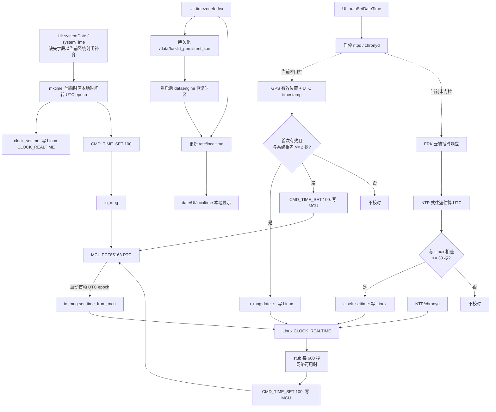

# RK3576 叉车时间、时区与自动校时链路分析

## 目录

1. [简要总结](#0-简要总结)
2. [本次日志的结论与证据](#1-本次日志的结论与证据)
3. [时间的三个概念](#2-时间的三个概念)
4. [相关组件与保存位置](#3-相关组件与保存位置)
5. [UI 设置时间与时区的实际行为](#4-ui-设置时间与时区的实际行为)
6. [全量校时链路流程图](#5-全量校时链路流程图)
7. [重启后“10 月变回 9 月”的逐步还原](#6-重启后10-月变回-9-月的逐步还原)
8. [GPS 校时机制与阈值](#7-gps-校时机制与阈值)
9. [云端 ERK 校时机制与阈值](#8-云端-erk-校时机制与阈值)
10. [NTP、PTP 与 stub 的作用](#9-ntpptp-与-stub-的作用)
11. [当前设计缺口](#10-当前设计缺口)
12. [后续排查日志判定表](#11-后续排查日志判定表)
13. [最终判定](#12-最终判定)
14. [附录：两个会话的现象对照](#附录-a两个会话的现象对照)

## 0. 简要总结

### 现象

在东八区手动将设备时间设为 2026 年 10 月 25 日后，重启时设备先正常显示 10 月 25 日；等待 GPS 定位成功后，日期又变为 2026 年 9 月 22 日。将 UI 时区切换为贝克岛（UTC-12）后，重启仍保持贝克岛本地日期和时间。

### 结论

本次把 10 月 25 日改回 9 月 22 日的是 **GPS 自动校时**。GPS 通过 `io_mng` 同时改写了 Linux 系统时间和 MCU RTC；云端 ERK 在本次仅检测到 1.825 秒偏差，未执行校时；stub 是在 GPS 校时后把 Linux 时间再次写入 MCU，并非源头。

### 一条时间线

```text
UI 手动设为 10 月 25 日
  → Linux 与 MCU 都写入 10 月 25 日
  → 重启后 MCU 先把 Linux 恢复为 10 月 25 日
  → GPS 首次获得有效时间 9 月 22 日
  → GPS 校时触发：Linux 改为 9 月 22 日
  → GPS 发 CMD_TIME_SET：MCU 也改为 9 月 22 日
```

### 时区为何能保持

时区选择只持久化 `/etc/localtime` 和 `timezoneIndex`，它只改变同一 UTC 时刻的显示方式，不改变 UTC epoch。GPS、云端和 MCU 授时均不修改时区，所以切换到贝克岛后重启仍显示贝克岛本地时间是正常行为。

### 当前缺口

`autoSetDateTime=0` 目前只停止 `ntpd` / `chronyd`，不能阻止 GPS 或 ERK。因而在“手动时间模式”下，重启后的 GPS 首次有效时间仍可以覆盖手工设定的时间。

---

## 1. 本次日志的结论与证据

本次“在东八区手动设为 2026-10-25，重启后又回到 2026-09-22”的直接写入者是 **GPS 自动校时路径**，即 `io_mng` 的 `set_time_from_gps()`。

日志已形成完整闭环：GPS 给出 UTC epoch `1790064283`，`io_mng` 用该值设置 Linux 系统时间，并发送 `CMD_TIME_SET(100)` 给 MCU；MCU 应答成功后也开始上报同一个 epoch。因此，手工设定的 10 月时间并非在重启时丢失，而是在重启后 GPS 首次获得有效时间时被覆盖。

本次云端 ERK 收到时间响应，但偏差仅 `1825 ms`，低于其 `30000 ms` 阈值，未执行系统校时。`stub-sany-forklift` 在 GPS 校时之后才将 Linux 当前时间回写 MCU，不是最初的回拨源。

时区是另一条独立链路。UI 选择贝克岛后，设备以 UTC-12 显示同一 UTC 时刻；该设置持久化在 `timezoneIndex` 和 `/etc/localtime` 中，GPS、云端和 MCU 时间同步均不会改动它。

---

## 2. 时间的三个概念

排查时必须区分以下三项：

| 对象 | 含义 | 示例 |
|---|---|---|
| UTC epoch | 与时区无关的绝对时刻，单位为秒或毫秒 | `1790064283` |
| 系统时钟 | Linux 的 `CLOCK_REALTIME`，其本质是 UTC epoch | 可由 `date +%s` 查看 |
| 时区 | 将 UTC epoch 格式化为本地日期时间的规则 | `Asia/Shanghai`、`Etc/GMT+12` |

同一个 UTC epoch 在不同时区显示不同，但绝对时刻没有变化：

```text
UTC epoch 1790073336

UTC：    2026-09-22 10:35:36
UTC+8：  2026-09-22 18:35:36
UTC-12： 2026-09-21 22:35:36
```

Linux 的 `Etc/GMT+12` 使用 POSIX 的反向符号约定，实际表示 **UTC-12**，即贝克岛时区。

---

## 3. 相关组件与保存位置

| 组件 | 保存/写入对象 | 重启后是否存在 | 说明 |
|---|---|---:|---|
| UI / dataengine | Linux `CLOCK_REALTIME` | 否 | 断电后系统钟需重新授时 |
| MCU PCF85163 RTC | UTC epoch | 是 | 有电池，作为启动早期的时间来源 |
| dataengine 持久化文件 | `autoSetDateTime`、`timezoneIndex` | 是 | `/data/forklift_persistent.json` |
| `/etc/localtime` | 时区规则 | 是/重启时恢复 | UI 时区设置写入并由 dataengine 再次恢复 |
| GPS | GPS UTC 时间戳 | 不适用 | 首次有效定位后可触发校时 |
| ERK | 云端估算 UTC 时间 | 不适用 | 偏差超过阈值时写 Linux |

UI 的手动日期、时间并不作为 dataengine 配置单独保存；它会立即转换为 UTC epoch，并通过 `CMD_TIME_SET` 写入 MCU RTC。故手动时间跨重启的主要持久化介质是 MCU RTC。

---

## 4. UI 设置时间与时区的实际行为

### 4.1 手动设置日期/时间

UI 下发 `systemDate` 或 `systemTime` 后，`SkesQtBridge` 使用当前时区把本地墙钟时间转换为 UTC epoch：

```text
UI 本地日期/时间
  → mktime() 按当前 /etc/localtime 换算 UTC epoch
  → clock_settime(CLOCK_REALTIME) 设置 Linux 系统钟
  → CMD_TIME_SET(100) 发往 io_mng
  → MCU 写入 PCF85163 RTC
```

实现位置：

- `vehicles/forklift/SkesQtBridge.cpp`：`tryApplySystemTime()`
- `vehicles/forklift/SkesQtBridge.cpp`：`setSystemClockUTC()`
- `vehicles/forklift/SkesQtBridge.cpp`：`sendTimeSetToMcu()`

因此，在东八区手动设置 `2026-10-25 16:00`，是把该东八区本地时间对应的绝对 UTC epoch 同时写入 Linux 和 MCU，不是仅改变界面显示。

需要注意，`tryApplySystemTime()` 的实际行为与“等待两个字段都到齐”的注释并不完全一致：只要已收到日期或时间中的任意一个字段，它就会以当前系统本地时间补齐另一个字段并立即写钟。若 UI 将日期和时间分两条消息发送，可能发生两次写入：第一次是“新日期 + 旧时间”或“旧日期 + 新时间”，第二次才是用户最终选择的完整时间。两条消息相邻时该中间状态通常很短，但它是独立的时间写入行为，排查日志时应予以区分。

### 4.2 设置时区

UI 下发 `timezoneIndex` 后：

```text
timezoneIndex
  → 写入 /data/forklift_persistent.json
  → 更新 /etc/localtime 的符号链接
  → setenv("TZ") + tzset()
```

时区改变不会调用 `clock_settime()`，不会修改 MCU RTC，也不会改变 UTC epoch；它仅改变 `date`、`localtime()` 及 UI 对同一 UTC epoch 的显示方式。

设备重启后，`loadPersistent()` 会恢复 `timezoneIndex` 并再次调用 `applyTimezone()`，因此贝克岛时区能在重启后保持是预期行为。

---

## 5. 全量校时链路流程图

### 5.1 可直接阅读的校时流程图

```text
┌──────────────────────────────────────────────────────────────────────────────┐
│                         UI 手动设置日期 / 时间                               │
│  systemDate / systemTime（缺失字段由当前系统时间补齐，按当前时区解释）       │
└──────────────────────────────────────────────────────────────────────────────┘
                                      │
                                      ▼
                    ┌──────────────────────────────────┐
                    │ dataengine: mktime()              │
                    │ 本地墙钟时间 → UTC epoch          │
                    └──────────────────────────────────┘
                         │                         │
                         │                         │
                         ▼                         ▼
       ┌────────────────────────────┐  ┌─────────────────────────────────────┐
       │ clock_settime()            │  │ CMD_TIME_SET(100)                   │
       │ Linux CLOCK_REALTIME       │  │ dataengine → io_mng → MCU PCF85163 │
       └──────────────┬─────────────┘  └──────────────────┬──────────────────┘
                      │                                   │
                      │                                   ▼
                      │                     ┌───────────────────────────────┐
                      │                     │ MCU RTC：跨重启保存 UTC epoch │
                      │                     └──────────────┬────────────────┘
                      │                                    │
                      │             设备重启后，io_mng 首帧读取 MCU RTC
                      │                                    ▼
                      │                     ┌───────────────────────────────┐
                      └────────────────────►│ MCU → io_mng → Linux 系统钟   │
                                            └───────────────────────────────┘


┌──────────────────────────────────────────────────────────────────────────────┐
│                           重启后的自动校时竞争                                │
└──────────────────────────────────────────────────────────────────────────────┘

  GPS 首次有效时间                               ERK 云端时间响应
  经纬度非零、timestamp 非零                     四时刻往返估算 UTC
          │                                                │
          ▼                                                ▼
  ┌───────────────────────┐                    ┌───────────────────────┐
  │ 与 Linux 相差 ≥ 2 秒? │                    │ 与 Linux 相差 ≥ 30 秒?│
  └───────┬─────────┬─────┘                    └───────┬─────────┬─────┘
          │是       │否                               │是       │否
          ▼         ▼                                 ▼         ▼
   GPS 写 Linux   不处理                         ERK 写 Linux   不处理
          │
          ├───────────────► GPS 发 CMD_TIME_SET(100) ─────► MCU
          │
          ▼
      Linux 当前时间
          │
          ▼
  stub：启动后约 60 秒首次、此后每 600 秒
  网络已连接或 ql 标志存在时：Linux → CMD_TIME_SET(100) → MCU


┌──────────────────────────────────────────────────────────────────────────────┐
│                               时区独立链路                                   │
└──────────────────────────────────────────────────────────────────────────────┘

  UI timezoneIndex
          │
          ├──► /data/forklift_persistent.json（重启后读取）
          │
          └──► /etc/localtime + TZ + tzset()
                         │
                         ▼
              仅影响 date/UI/localtime 的本地显示
              不修改 Linux UTC epoch，不修改 MCU RTC
```

### 5.2 Mermaid 流程图



图中实线表示当前实际数据流；虚线表示设计缺口：`autoSetDateTime` 当前没有约束 GPS 和 ERK。

---

## 6. 重启后“10 月变回 9 月”的逐步还原

### 6.1 手工设置阶段

用户在东八区通过 UI 将日期改为 2026 年 10 月 25 日。

dataengine 的处理为：

```text
UI 时间 → UTC epoch → Linux CLOCK_REALTIME
                     → CMD_TIME_SET → MCU RTC
```

因此 MCU RTC 已保存 10 月 25 日。

### 6.2 重启后的 MCU 灌钟阶段

日志：

```text
MCU rtc_timestamp=1792915382 (2026-10-25 16:03:02)
MCU_FIRST_FRAME set_time_from_mcu FIRED (one-shot)
date -s "2026-10-25 16:3:2"
```

这说明：

1. MCU 仍保存着手动设定的 10 月 25 日；
2. `io_mng` 启动时从 MCU 读取该时间；
3. Linux 系统钟先被正确恢复为 10 月 25 日。

因此，问题不是手动时间没有写入 MCU，也不是 MCU 掉电丢失时间。

### 6.3 GPS 首次有效时间阶段

GPS 尚未有效时，日志多次为：

```text
timestamp=0
lat=0.000000
lon=0.000000
```

这时 GPS 不触发校时。

随后 GPS 首次给出有效坐标和时间：

```text
GPS_RAW ... timestamp=1790064283
UTC 2026-09-22 08:04:43
lat=28.240286 lon=113.099854
```

下一轮 `io_mng` 处理时触发：

```text
GPS set_time_from_gps FIRED
gps_secs=1790064283
cur_time_before=1792915409
```

对应的绝对时间为：

```text
cur_time_before = 1792915409 = 2026-10-25（手动未来时间）
gps_secs        = 1790064283 = 2026-09-22（GPS 时间）
```

两者相差约 33 天，远高于 GPS 的 2 秒阈值。因此 GPS 路径立即改写 Linux 系统钟。

### 6.4 GPS 将 MCU 一并覆盖

随后日志连续出现：

```text
push_cmd_req tag=100 pid=451 listLen=1
CMD_TIME_SET packed UTC=1790064283 pid=451
CMD_TIME_SET MCU reply error=0
MCU rtc_timestamp=1790064283 (2026-9-22 16:4:43)
```

含义如下：

1. `io_mng` 使用 GPS epoch 构造 `CMD_TIME_SET(100)`；
2. 命令由 `io_mng` 本身发出，`pid=451`；
3. MCU 应答 `error=0`，表示写入成功；
4. 后续 MCU 上报的 epoch 已变为 GPS 的 `1790064283`。

至此，Linux 和 MCU 均已从 10 月 25 日改为 9 月 22 日。下一次重启时，MCU 也只会恢复 9 月 22 日。

---

## 7. GPS 校时机制与阈值

实现位置：`rtms_sdk/apps/io_mng/src/io_mng/io_mng.c` 中的 `set_time_from_gps()`。

GPS 校时的前提：

```text
latitude != 0
longitude != 0
timestamp != 0
isSync == false
```

满足前提后：

```text
|GPS epoch - Linux epoch| < 2 秒：不设置
|GPS epoch - Linux epoch| >= 2 秒：设置 Linux，并发送 CMD_TIME_SET 给 MCU
```

这不是“GPS 只允许偏差 2 秒”的限制，而是“差至少 2 秒才执行校时”。当前代码未设最大可接受偏差，也没有禁止时间倒退的判断；无论差 1 分钟、1 天还是 33 天，均会采纳 GPS。

此外，`isSync` 是进程内静态变量。一次 GPS 校时后它变为 `true`，同一 `io_mng` 进程运行期间不会再次走 GPS 校时；但设备或 `io_mng` 重启后它回到 `false`，GPS 首次有效时间又可再次覆盖系统和 MCU。

这解释了测试中“未重启时手工设为未来时间似乎能保持，重启后又被回拨”的差异。

日志字符串中的 `gps_secs(UTC+8 local ts)` 只是历史调试文案；当前代码实际使用的是原始 `timestamp`，未再额外加 8 小时。显示时的 UTC/本地时区差异由 `localtime()` 和 `/etc/localtime` 决定。

---

## 8. 云端 ERK 校时机制与阈值

实现位置：`rootcloud-stp-sdk/erk-core/rcpv4/rcpv4-cmd-time.c` 中的 `rcpv4_cmd_on_post_time()`。

ERK 使用近似 NTP 的往返时间估算，而非直接相信一个单点时间：

```text
deviceSendTime：设备发起请求时的单调时钟
hubRecvTime：    云端收到请求时的 UTC 毫秒时间
hubSendTime：    云端发出回复时的 UTC 毫秒时间
deviceRecvTime：设备收到回复时的单调时钟

估算 UTC = (deviceRecvTime + hubRecvTime + hubSendTime - deviceSendTime) / 2
```

ERK 将估算结果与 Linux `CLOCK_REALTIME` 比较：

```text
偏差 < timing_info.diff：不校时
偏差 >= timing_info.diff：erk_set_clock_time() → clock_settime()
```

本次实际阈值由日志给出：

```text
threshold_ms=30000
```

本次实际结果：

```text
cloud_ts=2026-09-22 16:05:09
local_ts_sys=2026-09-22 16:05:07
diff_ms=1825
threshold_ms=30000
```

因为 `1825 < 30000`，ERK 本次直接返回，未调用 `erk_set_clock_time()`；因此云端不是本次从 10 月回拨到 9 月的来源。

ERK 直接写 Linux，不直接发送 `CMD_TIME_SET` 给 MCU。若 ERK 后续修改 Linux，stub 等 Linux→MCU 同步路径可能再将该结果写入 MCU。

当前 ERK 中原本“手动模式 `autoSetDateTime=0` 时跳过云端校时”的门控代码处于注释状态。因此若 GPS 不工作、Linux 仍保留手工未来时间，而 ERK 收到云端时间，偏差达到 30 秒后仍可能改写 Linux。

---

## 9. NTP、PTP 与 stub 的作用

### 9.1 NTP / chronyd

会话中实现的 `autoSetDateTime` 控制的是 `ntpd` 和 `chronyd`：

```text
autoSetDateTime=1：启动 chronyd、ntpd
autoSetDateTime=0：停止 chronyd、ntpd
```

安装脚本会将原先开机自动执行的 `S49ntp`、`S49chrony` 改名，避免它们在 dataengine 读取持久化开关之前抢先校时。该逻辑仅在叉车安装分支生效。

PTP 的 `phc2sys` 理论上也可写系统钟，但当前安装脚本与 dataengine 中相关启停代码均被注释，未纳入本次直接证据链。

### 9.2 stub-sany-forklift

stub 在启动约 60 秒后首次运行，之后每 600 秒运行一次：

```text
network_connected == 1
或 /tmp/ql_time_set_flag 存在
  → 读取 Linux 当前时间
  → CMD_TIME_SET 写 MCU
```

本次日志：

```text
STUB_FORKLIFT sync_time_to_mcu
wallclock=2026-09-22 16:05:16
will_send=1
```

此时 GPS 已在约 `16:04:29` 将 Linux 改为 9 月 22 日。因此 stub 只是把已经被 GPS 改写的 Linux 时间再次同步 MCU，不是最早的回拨源。

---

## 10. 当前设计缺口

产品语义期望为：

```text
autoSetDateTime=0：手动时间 / MCU RTC 为准，任何自动来源均不得覆盖
autoSetDateTime=1：允许自动校时
```

当前实际实现为：

| 自动来源 | `autoSetDateTime=0` 是否阻止 | 结果 |
|---|---:|---|
| `ntpd` / `chronyd` | 是 | 已由 dataengine 启停控制 |
| GPS `io_mng` | 否 | 重启后首次有效 GPS 可覆盖 Linux 和 MCU |
| ERK 云端 | 否 | 偏差达到 30 秒时可覆盖 Linux |
| `stub` | 间接否 | 会把当前 Linux 时间同步到 MCU |
| PTP / `phc2sys` | 当前未完整门控 | 需按部署状态确认 |

因此，关闭自动时间开关后仍被 GPS 回拨，不是偶发现象，而是当前代码结构下的确定风险。

---

## 11. 后续排查日志判定表

发生时间跳变时，可按以下日志判断写入者：

| 日志特征 | 写入者 | 写入目标 |
|---|---|---|
| `MCU_FIRST_FRAME set_time_from_mcu FIRED` | MCU 启动灌钟 | MCU → Linux |
| `GPS set_time_from_gps FIRED` | GPS | GPS → Linux + MCU |
| `CMD_TIME_SET packed ... pid=io_mng PID` 且紧随 GPS 日志 | `io_mng` GPS 路径 | GPS → MCU |
| `ERK_AGENT ... erk_set_clock_time_rc=0` | ERK 云端 | 云端 → Linux |
| `STUB_FORKLIFT sync_time_to_mcu ... will_send=1` | stub | Linux → MCU |
| `[时间] 应用设时` / `系统钟已设` | UI / dataengine | UI → Linux；随后可写 MCU |
| `chronyd`、`ntpd` 的启动或授时日志 | NTP | NTP → Linux |

建议在复现时同时保留：

```sh
tail -f /tmp/io_mng_cmd.log
tail -f /tmp/vehicleDataEngine.log
```

并记录触发前后的：

```sh
date
date -u
date +%s
readlink -f /etc/localtime
```

这样可以把“绝对时间被改写”和“仅时区改变导致本地显示变化”严格区分开。

---

## 12. 最终判定

本次链路可归纳为：

```text
UI 手动设置 10 月 25 日：成功
MCU 持久化 10 月 25 日：成功
重启后 MCU 恢复 10 月 25 日：成功
GPS 首次有效时间到达：覆盖 Linux 为 9 月 22 日
GPS 发 CMD_TIME_SET：覆盖 MCU 为 9 月 22 日
ERK：本次仅检测，未校时
stub：后续重复同步 9 月 22 日到 MCU，不是源头
时区：独立持久化，未参与绝对时间回拨
```

要使手动设置时间在重启、GPS 可用、联网时仍能保持，必须将 GPS 和 ERK 一并纳入 `autoSetDateTime` 的统一门控；仅停止 NTP/chronyd 不足以保证手动时间不被覆盖。

---

## 附录 A：两个会话的现象对照

本分析同时覆盖了以下两次排查记录。

| 项目 | 指定恢复会话 `01a0c322-ce18-7021-87b9-2d3e434a78b5` | 当前会话日志 |
|---|---|---|
| 初始 MCU 时间 | 2026-09-22 | 手工设定后的 2026-10-25 |
| GPS 首次有效时间 | 2026-09-21，比 MCU 早一天 | 2026-09-22，比手工时间早约 33 天 |
| GPS 是否触发 | 是 | 是 |
| GPS 写入结果 | Linux 和 MCU 从 9 月 22 日回拨到 9 月 21 日 | Linux 和 MCU 从 10 月 25 日回拨到 9 月 22 日 |
| 同一 `io_mng` 进程内再次手动设时 | UI 将时间设为 10 月后，GPS 未再次改写 | 本次关键动作发生在设备重启后 |
| 不同表现的原因 | GPS 已首次同步，`isSync=true`，同进程不再触发 | 重启使 `isSync` 恢复为 `false`，GPS 首次有效数据再次触发 |
| ERK 云端 | 会话中作为潜在来源排查 | 本次偏差 1825 ms，小于 30000 ms，未写系统钟 |

两个会话并不矛盾，反而验证了同一条规则：

```text
GPS 在每个 io_mng 进程生命周期中只会尝试一次自动校时。

未重启：首次 GPS 校时后 isSync=true，手动改时间不会再被 GPS 第二次覆盖。
重启后：isSync=false，GPS 首次取得有效数据时会重新比较并覆盖系统和 MCU。
```

恢复会话中的“一天回拨”和当前会话中的“三十三天回拨”只有差值不同，触发条件、执行函数和写入链路完全相同：

```text
GPS 有效时间 → io_mng set_time_from_gps()
              → Linux date -s
              → CMD_TIME_SET(100)
              → MCU RTC
```
